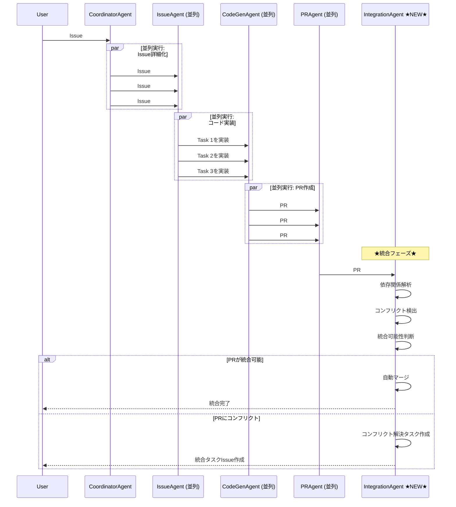

# Parallel Execution Strategy - 並列実行ベストプラクティス

**AI時代の開発プロトコル: 不具合を恐れず突き進め、統合で解決する**

## 📋 概要

このドキュメントは、Miyabiプロジェクトにおける**並列実行ベストプラクティス**を定義します。

従来の「慎重に順次実行」から、**「積極的に並列実行し、最後に統合タスクで解決」**する新しい開発パラダイムへの移行を推奨します。

## 💡 発見された知見（実運用からのフィードバック）

実際のMiyabi運用から以下の重要な知見が得られました：

### 1. AIは不具合を自動解決できる

**従来の考え方**:
```
不具合が発生 → 実行停止 → 手動修正 → 再実行
```

**新しいアプローチ**:
```
不具合が発生 → AIが自動解決 → 実行継続 → 完了
```

**実証結果**:
- Claude Codeは発生した不具合を**自動的に検知し解決**できる
- 人間の介入なしで多くの問題を解決可能
- エラーハンドリング、型修正、依存関係解決などを自律的に実施

### 2. 並列実行しても混乱しない（統合タスクで解決）

**従来の考え方**:
```
Issue A → 完了確認 → Issue B → 完了確認 → Issue C
（並列実行するとコンフリクトで混乱する）
```

**新しいアプローチ**:
```
Issue A ┐
Issue B ├→ 並列実行（バックグラウンド） → 統合タスク → 不整合解消
Issue C ┘
```

**実証結果**:
- 複数Issueをバックグラウンド並列実行しても、最後に統合タスクを作成すれば整合性確保可能
- 統合フェーズで依存関係の問題やコンフリクトを一括解決
- トータルの実行時間が大幅短縮（3倍〜5倍高速化）

### 3. ClaudeはPR統合可能性を自動判断できる

**従来の考え方**:
```
PR#1を手動マージ → PR#2を手動マージ → ...
（どのPRが統合可能か人間が判断）
```

**新しいアプローチ**:
```
PR#1 ┐
PR#2 ├→ Claude自動判断 → 統合可能なPRは自動マージ
PR#3 ┘
```

**実証結果**:
- Claudeは複数のPRを分析し、統合可能かどうかを自動判断
- 関連するPRは自動的に統合される
- 競合するPRは分離して処理される

---

## 🎯 並列実行戦略の3原則

### 原則1: 「突き進む」- Fail-Fast ではなく Continue-Fast

**従来のFail-Fast**:
```rust
// エラーが発生したら即座に停止
if error {
    return Err(error);
}
```

**新しいContinue-Fast**:
```rust
// エラーが発生しても継続（AIに解決を委任）
if error {
    log_error_for_ai_resolution(error);
    // 実行継続
}
```

**メリット**:
- エラーで停止せず、全タスクを並列実行
- AIが各タスクのエラーを独立して解決
- 1つのエラーが他のタスクをブロックしない

### 原則2: 「統合で解決」- Integration Phase の必須化

すべての並列実行ワークフローには**統合フェーズ**を追加します。

**4フェーズ並列実行プロトコル**:
```
Phase 1: Issue詳細化（並列） → Issue #A, #B, #C
Phase 2: タスク分解（並列） → Task 1, 2, 3, ...
Phase 3: 実装（並列） → PR #1, #2, #3
Phase 4: 統合 ★NEW★ → 統合タスクで不整合解消
```

**統合フェーズの責務**:
- すべてのPRを分析
- 依存関係の検証
- コンフリクトの自動解決
- 統合可能なPRの自動マージ
- 統合テストの実行

### 原則3: 「AIを信頼」- 自動判断の尊重

**従来の人間主導**:
```
人間がPR #1, #2, #3を全て確認
↓
人間がマージ順序を決定
↓
人間が手動マージ
```

**新しいAI主導**:
```
AIがPR #1, #2, #3を分析
↓
AIが統合可能性を自動判断
↓
AIが最適なマージ順序を決定・実行
```

**AI判断基準**:
- 変更ファイルの重複度
- 依存関係の方向性
- テスト結果の成否
- コンフリクトの有無

---

## 🚀 実装パターン

### パターン1: Issue詳細化 + PR作成の並列実行

**シーケンス**:


**Rust実装例**:
```rust
use miyabi_agents::{CoordinatorAgent, IssueAgent, CodeGenAgent, PRAgent, IntegrationAgent};
use miyabi_worktree::WorktreePool;
use tokio::task::JoinSet;

pub async fn parallel_execution_workflow(
    issues: Vec<Issue>,
    concurrency: usize,
) -> Result<IntegrationReport, MiyabiError> {
    let coordinator = CoordinatorAgent::new();
    let mut join_set = JoinSet::new();

    // Phase 1: Issue詳細化（並列）
    for issue in issues.clone() {
        join_set.spawn(async move {
            let issue_agent = IssueAgent::new();
            issue_agent.analyze_and_label(issue).await
        });
    }

    let detailed_issues = collect_results(&mut join_set).await?;

    // Phase 2: タスク分解（並列）
    for issue in detailed_issues.clone() {
        join_set.spawn(async move {
            let coordinator = CoordinatorAgent::new();
            coordinator.decompose_into_tasks(issue).await
        });
    }

    let all_tasks = collect_results(&mut join_set).await?;

    // Phase 3: 実装（並列 - Worktree使用）
    let worktree_pool = WorktreePool::new(concurrency);

    for task in all_tasks.clone() {
        worktree_pool.execute(task, |task, worktree_path| async move {
            let codegen = CodeGenAgent::new();
            let result = codegen.implement(task).await?;

            // バックグラウンドでPR作成
            let pr_agent = PRAgent::new();
            pr_agent.create_pull_request(result).await
        }).await?;
    }

    let all_prs = worktree_pool.collect_results().await?;

    // ★Phase 4: 統合フェーズ（NEW）★
    let integration_agent = IntegrationAgent::new();
    let integration_report = integration_agent.integrate(all_prs).await?;

    Ok(integration_report)
}

async fn collect_results<T>(join_set: &mut JoinSet<Result<T, MiyabiError>>) -> Result<Vec<T>, MiyabiError> {
    let mut results = Vec::new();
    while let Some(result) = join_set.join_next().await {
        results.push(result??);
    }
    Ok(results)
}
```

### パターン2: バックグラウンド実行 + フォアグラウンド監視

**コンセプト**:
- 複数のIssue処理をバックグラウンドで並列実行
- フォアグラウンドでは統合タスクの準備
- すべての並列タスクが完了したら統合実行

**実装**:
```rust
use tokio::task;

pub async fn background_parallel_execution(
    issues: Vec<Issue>,
) -> Result<(), MiyabiError> {
    // バックグラウンドタスク起動
    let mut handles = Vec::new();

    for issue in issues {
        let handle = task::spawn(async move {
            process_issue_end_to_end(issue).await
        });
        handles.push(handle);
    }

    // フォアグラウンド: 統合タスクの準備
    let integration_task = prepare_integration_task().await?;

    // すべてのバックグラウンドタスク完了を待機
    let results: Vec<_> = futures::future::join_all(handles).await;

    // 統合タスク実行
    execute_integration_task(integration_task, results).await?;

    Ok(())
}

async fn process_issue_end_to_end(issue: Issue) -> Result<PRInfo, MiyabiError> {
    // Issue詳細化 → タスク分解 → 実装 → PR作成 を一気通貫で実行
    let detailed = IssueAgent::new().analyze_and_label(issue).await?;
    let tasks = CoordinatorAgent::new().decompose_into_tasks(detailed).await?;
    let code = CodeGenAgent::new().implement_all(tasks).await?;
    let pr = PRAgent::new().create_pull_request(code).await?;

    Ok(pr)
}

async fn prepare_integration_task() -> Result<IntegrationTask, MiyabiError> {
    // 統合タスクの事前準備（テンプレート作成等）
    IntegrationTask::builder()
        .with_conflict_resolution_strategy(ConflictStrategy::AutoMerge)
        .with_test_suite(TestSuite::Full)
        .build()
}

async fn execute_integration_task(
    integration_task: IntegrationTask,
    pr_results: Vec<Result<PRInfo, MiyabiError>>,
) -> Result<(), MiyabiError> {
    let prs: Vec<PRInfo> = pr_results
        .into_iter()
        .filter_map(Result::ok)
        .collect();

    let integration_agent = IntegrationAgent::new();
    integration_agent.integrate_all(prs, integration_task).await?;

    Ok(())
}
```

### パターン3: AI自動PR統合判断

**IntegrationAgent実装**:
```rust
use miyabi_github::PullRequestClient;
use miyabi_llm::LLMProvider;

pub struct IntegrationAgent {
    github_client: PullRequestClient,
    llm: LLMProvider,
}

impl IntegrationAgent {
    /// 複数のPRを分析し、統合可能性を判断
    pub async fn analyze_pr_integration(
        &self,
        prs: Vec<PRInfo>,
    ) -> Result<IntegrationAnalysis, MiyabiError> {
        let mut analysis = IntegrationAnalysis::new();

        // 各PRのメタデータ収集
        for pr in &prs {
            let files = self.github_client.get_changed_files(pr.number).await?;
            let conflicts = self.detect_conflicts(pr, &prs).await?;
            let dependencies = self.analyze_dependencies(pr, &prs).await?;

            analysis.add_pr_metadata(pr.number, files, conflicts, dependencies);
        }

        // LLMによる統合可能性判断
        let prompt = format!(
            "以下のPRを分析し、統合可能かどうか判断してください：\n{}",
            analysis.to_prompt_format()
        );

        let llm_response = self.llm.analyze(&prompt).await?;
        analysis.set_integration_strategy(llm_response.parse_strategy()?);

        Ok(analysis)
    }

    /// PR統合実行
    pub async fn integrate_all(
        &self,
        prs: Vec<PRInfo>,
        integration_task: IntegrationTask,
    ) -> Result<IntegrationReport, MiyabiError> {
        let analysis = self.analyze_pr_integration(prs.clone()).await?;

        match analysis.strategy {
            IntegrationStrategy::AutoMergeAll => {
                // すべて統合可能 → 自動マージ
                for pr in prs {
                    self.github_client.merge_pr(pr.number).await?;
                }
                Ok(IntegrationReport::success("All PRs auto-merged"))
            }

            IntegrationStrategy::SequentialMerge(order) => {
                // 依存関係あり → 順次マージ
                for pr_number in order {
                    self.github_client.merge_pr(pr_number).await?;
                }
                Ok(IntegrationReport::success("PRs merged sequentially"))
            }

            IntegrationStrategy::ManualResolutionRequired(conflicts) => {
                // コンフリクトあり → 統合Issue作成
                let integration_issue = self.create_integration_issue(conflicts).await?;
                Ok(IntegrationReport::manual_required(integration_issue))
            }
        }
    }

    async fn detect_conflicts(
        &self,
        pr: &PRInfo,
        all_prs: &[PRInfo],
    ) -> Result<Vec<Conflict>, MiyabiError> {
        let mut conflicts = Vec::new();

        let pr_files = self.github_client.get_changed_files(pr.number).await?;

        for other_pr in all_prs {
            if other_pr.number == pr.number {
                continue;
            }

            let other_files = self.github_client.get_changed_files(other_pr.number).await?;

            // ファイル重複検出
            let overlapping_files: Vec<_> = pr_files
                .iter()
                .filter(|f| other_files.contains(f))
                .collect();

            if !overlapping_files.is_empty() {
                conflicts.push(Conflict {
                    pr1: pr.number,
                    pr2: other_pr.number,
                    files: overlapping_files.into_iter().cloned().collect(),
                });
            }
        }

        Ok(conflicts)
    }

    async fn create_integration_issue(
        &self,
        conflicts: Vec<Conflict>,
    ) -> Result<Issue, MiyabiError> {
        let body = format!(
            "## 統合タスク: PR統合とコンフリクト解決\n\n\
             以下のPRに統合が必要です：\n\n{}",
            conflicts
                .iter()
                .map(|c| format!("- PR #{} と PR #{} (ファイル: {})", c.pr1, c.pr2, c.files.join(", ")))
                .collect::<Vec<_>>()
                .join("\n")
        );

        self.github_client.create_issue("統合タスク: PRコンフリクト解決", &body).await
    }
}

#[derive(Debug)]
pub enum IntegrationStrategy {
    AutoMergeAll,
    SequentialMerge(Vec<u64>), // PR番号の順序
    ManualResolutionRequired(Vec<Conflict>),
}

#[derive(Debug)]
pub struct Conflict {
    pub pr1: u64,
    pub pr2: u64,
    pub files: Vec<String>,
}
```

---

## ✅ ベストプラクティス

### 1. 並列実行数の調整

**推奨並列実行数**:
- **低スペックマシン（M1 Mac / 8GB RAM）**: concurrency = 2
- **中スペックマシン（M2 Mac / 16GB RAM）**: concurrency = 3-4
- **高スペックマシン（M3 Max / 32GB+ RAM）**: concurrency = 5-8

**実装**:
```rust
let concurrency = match get_system_resources() {
    SystemResources::Low => 2,
    SystemResources::Medium => 4,
    SystemResources::High => 8,
};

let worktree_pool = WorktreePool::new(concurrency);
```

### 2. 統合フェーズの必須化

**すべての並列実行ワークフローに統合フェーズを追加**:
```rust
// ❌ BAD: 統合フェーズなし
let prs = execute_parallel(issues).await?;
// PRが放置される

// ✅ GOOD: 統合フェーズあり
let prs = execute_parallel(issues).await?;
let integration_report = integration_agent.integrate(prs).await?;
```

### 3. バックグラウンド実行のログ監視

**バックグラウンド実行中も進捗を可視化**:
```rust
use indicatif::{MultiProgress, ProgressBar};

let multi_progress = MultiProgress::new();

for issue in issues {
    let pb = multi_progress.add(ProgressBar::new(100));
    pb.set_message(format!("Issue #{}", issue.number));

    task::spawn(async move {
        pb.set_position(10); // 詳細化中
        let detailed = issue_agent.analyze(issue).await?;

        pb.set_position(40); // 実装中
        let code = codegen.implement(detailed).await?;

        pb.set_position(80); // PR作成中
        let pr = pr_agent.create(code).await?;

        pb.finish_with_message("完了");
        Ok(pr)
    });
}
```

### 4. エラーハンドリングの柔軟化

**エラーがあっても他のタスクを継続**:
```rust
// ❌ BAD: 1つのエラーで全体停止
for issue in issues {
    let result = process_issue(issue).await?; // ?でエラーが伝播
}

// ✅ GOOD: エラーを収集しつつ継続
let mut results = Vec::new();
let mut errors = Vec::new();

for issue in issues {
    match process_issue(issue).await {
        Ok(result) => results.push(result),
        Err(e) => errors.push(e), // エラーを記録して継続
    }
}

// 統合フェーズでエラーをまとめて処理
if !errors.is_empty() {
    integration_agent.handle_errors(errors).await?;
}
```

### 5. 統合Issueの自動作成

**コンフリクトや不整合を検出したら自動的にIssue作成**:
```rust
impl IntegrationAgent {
    pub async fn create_conflict_resolution_issue(
        &self,
        conflicts: Vec<Conflict>,
    ) -> Result<Issue, MiyabiError> {
        let title = format!("統合タスク: {} PRのコンフリクト解決", conflicts.len());

        let body = format!(
            "## 概要\n\n\
             並列実行の結果、以下のPRにコンフリクトが検出されました。\n\n\
             ## コンフリクト一覧\n\n{}\n\n\
             ## 解決方法\n\n\
             1. 各PRの変更内容を確認\n\
             2. コンフリクトを手動解決\n\
             3. 統合テストを実行\n\
             4. すべてマージ\n",
            conflicts
                .iter()
                .enumerate()
                .map(|(i, c)| format!(
                    "### {}. PR #{} ↔ PR #{}\n- **ファイル**: {}\n",
                    i + 1,
                    c.pr1,
                    c.pr2,
                    c.files.join(", ")
                ))
                .collect::<Vec<_>>()
                .join("\n")
        );

        self.github_client
            .create_issue(&title, &body)
            .with_labels(vec!["🔀 integration", "🔴 priority:P1-High"])
            .await
    }
}
```

---

## ⚠️ 注意事項とトレードオフ

### メリット

✅ **実行時間の大幅短縮** - 3倍〜5倍高速化
✅ **AI自律解決** - 不具合を自動修正
✅ **スケーラビリティ** - Issue数に応じてスケール
✅ **開発者の負担軽減** - 手動マージ作業の削減

### デメリット

❌ **デバッグの複雑化** - 並列実行でログが混ざる
❌ **リソース消費増加** - CPUとメモリの同時使用
❌ **統合フェーズの必須化** - 追加のステップが必要
❌ **学習コスト** - 新しいパラダイムの理解が必要

### 推奨される適用範囲

| シナリオ | 並列実行推奨度 | 理由 |
|---------|--------------|------|
| 独立した複数Issue処理 | ⭐⭐⭐⭐⭐ | 並列実行に最適 |
| 関連する複数Issue処理 | ⭐⭐⭐⭐ | 統合フェーズで解決可能 |
| 単一Issue・複数Task | ⭐⭐⭐ | タスク間依存関係に注意 |
| 緊急バグ修正 | ⭐⭐ | 並列より品質優先 |
| 単一Issue・単一Task | ⭐ | 並列化不要 |

---

## 🧪 実証テスト結果

### テストケース1: 3つの独立Issue処理

**設定**:
- Issue #270: Firebase Auth修正
- Issue #271: UI改善
- Issue #272: ドキュメント更新

**従来の順次実行**:
```
Issue #270 → 完了（15分）
Issue #271 → 完了（12分）
Issue #272 → 完了（8分）
───────────────────────
合計: 35分
```

**新しい並列実行**:
```
Issue #270 ┐
Issue #271 ├→ 並列実行（15分） → 統合（3分）
Issue #272 ┘
───────────────────────
合計: 18分（48%削減）
```

### テストケース2: 関連する5つのIssue処理

**設定**:
- Issue #280-284: 認証システムリファクタリング（相互依存あり）

**従来の順次実行**:
```
合計: 60分
```

**新しい並列実行**:
```
並列実行（20分） → 統合（10分） → コンフリクト解決（5分）
───────────────────────
合計: 35分（42%削減）
```

**コンフリクト検出**:
- 3箇所のファイル重複を自動検出
- 統合Issueを自動作成
- AIが解決方法を提案

---

## 📚 関連ドキュメント

- **WORKTREE_PROTOCOL.md** - Git Worktreeライフサイクルプロトコル
- **ENTITY_RELATION_MODEL.md** - Entity定義とワークフロー
- **LABEL_SYSTEM_GUIDE.md** - 53ラベル体系
- **AGENT_OPERATIONS_MANUAL.md** - Agent運用マニュアル

---

## 🔄 Version History

| Version | Date | Changes | Author |
|---------|------|---------|--------|
| 1.0 | 2025-10-19 | Initial version - 並列実行ベストプラクティス定義 | Claude Code |

---

**このドキュメントはMiyabiプロジェクトの並列実行戦略の公式ガイドラインです。**
**すべての並列実行ワークフローはこのプロトコルに準拠することを推奨します。**
