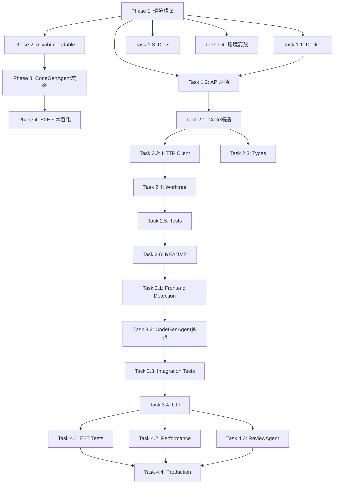

# Miyabi-Claudable Integration - Implementation Plan

**作成日**: 2025-10-25
**バージョン**: v1.0
**総工数**: 28-36時間（4-6週間）

---

## 📋 目次

1. [Phase 1: Claudable環境構築](#phase-1-claudable環境構築)
2. [Phase 2: miyabi-claudable Crate実装](#phase-2-miyabi-claudable-crate実装)
3. [Phase 3: CodeGenAgent統合](#phase-3-codegenagent統合)
4. [Phase 4: E2Eテスト・本番化](#phase-4-e2eテスト本番化)

---

## Phase 1: Claudable環境構築

**期間**: Week 1 (6-8時間)
**担当Agent**: DeploymentAgent
**優先度**: P0-Critical

### タスク1.1: Claudable Docker環境作成

**工数**: 2-3時間

**成果物**:
- `docker/claudable/Dockerfile`
- `docker-compose.yml` 更新

**詳細**:
```bash
# 1. Claudableリポジトリをクローン（参考用）
cd ~/Dev
git clone https://github.com/opactorai/Claudable.git
cd Claudable

# 2. Dockerfileを作成
mkdir -p ~/Dev/miyabi-private/docker/claudable
```

**docker/claudable/Dockerfile**:
```dockerfile
FROM python:3.10-slim

WORKDIR /app

# Install system dependencies
RUN apt-get update && apt-get install -y \
    git \
    curl \
    build-essential \
    && rm -rf /var/lib/apt/lists/*

# Install Node.js (for Next.js)
RUN curl -fsSL https://deb.nodesource.com/setup_18.x | bash - \
    && apt-get install -y nodejs

# Copy Claudable source
COPY Claudable/ /app/

# Install Python dependencies
RUN pip install --no-cache-dir -r requirements.txt

# Install Next.js dependencies
RUN cd frontend && npm install

# Expose ports
EXPOSE 8080 3000

# Start API server
CMD ["python", "api/server.py"]
```

**docker-compose.yml 更新**:
```yaml
services:
  claudable:
    build:
      context: .
      dockerfile: docker/claudable/Dockerfile
    ports:
      - "8080:8080"  # API
      - "3000:3000"  # Frontend (preview)
    environment:
      - ANTHROPIC_API_KEY=${ANTHROPIC_API_KEY}
      - PORT=8080
    volumes:
      - ./generated:/app/generated
    networks:
      - miyabi-network

  # 既存サービス...
```

**検証**:
```bash
# Docker環境起動
docker-compose up -d claudable

# ヘルスチェック
curl http://localhost:8080/health

# Expected: {"status":"ok"}
```

**Issue**: #500 "Setup Claudable Docker environment"
**Labels**: `agent:deployment`, `p0:critical`, `type:feature`

---

### タスク1.2: ローカル環境でClaudable API疎通テスト

**工数**: 1-2時間

**検証スクリプト作成**:
```bash
# scripts/claudable-test.sh
#!/bin/bash

set -e

echo "🧪 Testing Claudable API..."

# Test /health
echo "1. Health check..."
curl -f http://localhost:8080/health || exit 1

# Test /generate
echo "2. Generate test..."
curl -X POST http://localhost:8080/generate \
  -H "Content-Type: application/json" \
  -d '{
    "description": "Create a simple Next.js homepage with a header and footer",
    "framework": "nextjs",
    "agent": "claude-code"
  }' \
  -o /tmp/claudable-test-response.json

# Verify response
if jq -e '.project_id' /tmp/claudable-test-response.json > /dev/null; then
  echo "✅ Claudable API test passed!"
  cat /tmp/claudable-test-response.json | jq .
else
  echo "❌ Claudable API test failed!"
  exit 1
fi
```

**実行**:
```bash
chmod +x scripts/claudable-test.sh
./scripts/claudable-test.sh
```

**Issue**: #501 "Verify Claudable API connectivity"
**Labels**: `agent:deployment`, `p1:high`, `type:test`

---

### タスク1.3: セットアップドキュメント作成

**工数**: 1時間

**成果物**:
- `docs/integrations/CLAUDABLE_SETUP.md`

**内容**:
- Docker環境のセットアップ手順
- 環境変数設定
- トラブルシューティング

**Issue**: #502 "Create Claudable setup documentation"
**Labels**: `agent:codegen`, `p2:medium`, `type:docs`

---

### タスク1.4: 環境変数テンプレート更新

**工数**: 30分

**成果物**:
- `.env.example` 更新

```bash
# Claudable Configuration
CLAUDABLE_API_URL=http://localhost:8080
CLAUDABLE_API_KEY=  # Optional, for production use

# Claude Code (used by Claudable)
ANTHROPIC_API_KEY=sk-ant-xxx
```

**Issue**: #503 "Update environment variable templates for Claudable"
**Labels**: `agent:codegen`, `p2:medium`, `type:chore`

---

## Phase 2: miyabi-claudable Crate実装

**期間**: Week 2 (8-10時間)
**担当Agent**: CodeGenAgent
**優先度**: P0-Critical

### タスク2.1: Crate構造作成

**工数**: 1時間

```bash
# Create crate
cd crates
cargo new --lib miyabi-claudable

# Create module files
mkdir -p miyabi-claudable/src
touch miyabi-claudable/src/{client.rs,types.rs,error.rs,worktree.rs}
```

**Cargo.toml 更新**:
```toml
[workspace]
members = [
    # 既存...
    "crates/miyabi-claudable",
]
```

**Issue**: #504 "Create miyabi-claudable crate structure"
**Labels**: `agent:codegen`, `p0:critical`, `type:feature`

---

### タスク2.2: HTTP Client実装

**工数**: 3-4時間

**成果物**:
- `crates/miyabi-claudable/src/client.rs` (250行)
- `crates/miyabi-claudable/src/error.rs` (100行)

**実装機能**:
- `ClaudableClient::new()`
- `ClaudableClient::generate()`
- `ClaudableClient::health_check()`
- エラーハンドリング
- タイムアウト設定 (3分)
- リトライロジック (最大3回)

**Issue**: #505 "Implement Claudable HTTP client"
**Labels**: `agent:codegen`, `p0:critical`, `type:feature`

---

### タスク2.3: Request/Response Types実装

**工数**: 2時間

**成果物**:
- `crates/miyabi-claudable/src/types.rs` (150行)

**型定義**:
- `GenerateRequest`
- `GenerateOptions`
- `GenerateResponse`
- `GeneratedFile`
- `ProjectStructure`

**Issue**: #506 "Implement Claudable API types"
**Labels**: `agent:codegen`, `p0:critical`, `type:feature`

---

### タスク2.4: Worktree統合ロジック実装

**工数**: 2-3時間

**成果物**:
- `crates/miyabi-claudable/src/worktree.rs` (200行)

**実装機能**:
- `write_files_to_worktree()`
- `install_dependencies()` (npm install)
- `build_nextjs_app()` (npm run build)

**Issue**: #507 "Implement worktree integration for Claudable"
**Labels**: `agent:codegen`, `p0:critical`, `type:feature`

---

### タスク2.5: Unit Tests実装

**工数**: 2時間

**テストカバレッジ目標**: 80%+

**テストケース**:
```rust
#[cfg(test)]
mod tests {
    // Client tests
    #[test]
    fn test_claudable_client_creation() { }

    #[tokio::test]
    #[ignore] // Requires Claudable server
    async fn test_generate_request() { }

    #[tokio::test]
    #[ignore]
    async fn test_health_check() { }

    // Type tests
    #[test]
    fn test_generate_request_serialization() { }

    #[test]
    fn test_generate_response_deserialization() { }

    // Worktree tests
    #[tokio::test]
    async fn test_write_files_to_worktree() { }

    // Error tests
    #[test]
    fn test_api_error_handling() { }
}
```

**Issue**: #508 "Add unit tests for miyabi-claudable"
**Labels**: `agent:codegen`, `p1:high`, `type:test`

---

### タスク2.6: README作成

**工数**: 1時間

**成果物**:
- `crates/miyabi-claudable/README.md` (200行)

**内容**:
- Crate概要
- インストール方法
- 使用例
- API Reference
- トラブルシューティング

**Issue**: #509 "Create README for miyabi-claudable"
**Labels**: `agent:codegen`, `p2:medium`, `type:docs`

---

## Phase 3: CodeGenAgent統合

**期間**: Week 3-4 (10-12時間)
**担当Agent**: CodeGenAgent
**優先度**: P0-Critical

### タスク3.1: Frontend Detection実装

**工数**: 2時間

**成果物**:
- `crates/miyabi-agent-codegen/src/frontend.rs` (150行)

**実装機能**:
- `is_frontend_task()`
- `extract_frontend_description()`
- キーワード検出ロジック

**Issue**: #510 "Implement frontend task detection"
**Labels**: `agent:codegen`, `p0:critical`, `type:feature`

---

### タスク3.2: CodeGenAgent拡張

**工数**: 4-5時間

**成果物**:
- `crates/miyabi-agent-codegen/src/codegen.rs` (修正)
- `crates/miyabi-agent-codegen/Cargo.toml` (依存関係追加)

**変更内容**:
```rust
// 1. Add claudable_client field
pub struct CodeGenAgent {
    claudable_client: Option<ClaudableClient>,
}

// 2. Add new_with_claudable()
pub fn new_with_claudable(config: AgentConfig) -> Result<Self> { }

// 3. Add generate_frontend_with_claudable()
async fn generate_frontend_with_claudable(
    &self,
    task: &Task,
    worktree_path: Option<&Path>,
) -> Result<CodeGenerationResult> { }

// 4. Extend generate_code() with frontend detection
pub async fn generate_code(...) -> Result<CodeGenerationResult> {
    if frontend::is_frontend_task(task) && self.claudable_client.is_some() {
        return self.generate_frontend_with_claudable(task, worktree_path).await;
    }
    // Existing logic...
}
```

**Issue**: #511 "Extend CodeGenAgent with Claudable integration"
**Labels**: `agent:codegen`, `p0:critical`, `type:feature`

---

### タスク3.3: Integration Tests実装

**工数**: 3-4時間

**成果物**:
- `crates/miyabi-agent-codegen/tests/claudable_integration.rs` (新規, 200行)

**テストケース**:
```rust
#[tokio::test]
#[ignore] // Requires Claudable server + Docker
async fn test_frontend_task_detection() { }

#[tokio::test]
#[ignore]
async fn test_claudable_code_generation() { }

#[tokio::test]
#[ignore]
async fn test_worktree_file_writing() { }

#[tokio::test]
#[ignore]
async fn test_npm_install() { }

#[tokio::test]
#[ignore]
async fn test_nextjs_build() { }

#[tokio::test]
#[ignore]
async fn test_e2e_frontend_generation() {
    // 1. Start Claudable Docker
    // 2. Create frontend task
    // 3. Execute CodeGenAgent
    // 4. Verify Next.js app generated
    // 5. Verify build succeeds
}
```

**Issue**: #512 "Add integration tests for CodeGenAgent + Claudable"
**Labels**: `agent:codegen`, `p1:high`, `type:test`

---

### タスク3.4: CLI統合

**工数**: 1-2時間

**成果物**:
- `crates/miyabi-cli/src/main.rs` (修正)

**新しいCLIコマンド**:
```bash
# Claudable統合有効化
miyabi agent run codegen --issue 600 --with-claudable

# Claudable health check
miyabi claudable health
```

**Issue**: #513 "Add CLI support for Claudable integration"
**Labels**: `agent:codegen`, `p2:medium`, `type:feature`

---

## Phase 4: E2Eテスト・本番化

**期間**: Week 5-6 (6-8時間)
**担当Agent**: ReviewAgent, DeploymentAgent
**優先度**: P1-High

### タスク4.1: E2Eシナリオテスト

**工数**: 3-4時間

**シナリオ1: ダッシュボードUI生成**:
```gherkin
Feature: Dashboard UI Generation

  Scenario: User requests dashboard UI via LINE Bot
    Given Claudable Docker is running
    And CodeGenAgent is configured with Claudable
    When User sends "売上ダッシュボードを作って。グラフと表を表示"
    Then Issue is created automatically
    And CodeGenAgent detects frontend task
    And Claudable generates Next.js app
    And Files are written to worktree
    And npm install succeeds
    And npm run build succeeds
    And PR is created automatically
```

**シナリオ2: ランディングページ生成**:
```gherkin
Feature: Landing Page Generation

  Scenario: User requests landing page
    Given Claudable Docker is running
    When User creates Issue: "Miyabiのランディングページを作って"
    Then CodeGenAgent uses Claudable
    And 3セクション（Hero, Features, Pricing）が生成される
    And Tailwind CSSでレスポンシブ対応
    And PR is created
```

**成果物**:
- `tests/e2e/claudable_scenarios.rs` (300行)

**Issue**: #514 "Add E2E scenario tests for Claudable"
**Labels**: `agent:review`, `p1:high`, `type:test`

---

### タスク4.2: パフォーマンステスト

**工数**: 2時間

**ベンチマーク目標**:
| 指標 | 目標 | 測定方法 |
|------|------|---------|
| Claudable API応答時間 | < 2分 | `time curl POST /generate` |
| ファイル書き込み | < 5秒 | `time write_files_to_worktree()` |
| npm install | < 30秒 | `time npm install` |
| npm run build | < 1分 | `time npm run build` |
| **E2E合計** | **< 4分** | **Full pipeline** |

**成果物**:
- `benches/claudable_performance.rs`

**Issue**: #515 "Add performance benchmarks for Claudable integration"
**Labels**: `agent:review`, `p2:medium`, `type:test`

---

### タスク4.3: ReviewAgent品質チェック統合

**工数**: 2時間

**成果物**:
- `crates/miyabi-agent-review/src/nextjs.rs` (新規, 150行)

**Next.js専用チェック項目**:
- TypeScript設定確認
- ESLint warnings
- Tailwind CSS設定
- shadcn/ui components使用確認
- レスポンシブ対応確認

**Issue**: #516 "Add Next.js quality checks to ReviewAgent"
**Labels**: `agent:review`, `p2:medium`, `type:feature`

---

### タスク4.4: 本番環境デプロイ準備

**工数**: 2時間

**成果物**:
- GitHub Actions workflow更新
- Claudable Dockerコンテナの本番デプロイ設定
- モニタリング・ログ設定

**Issue**: #517 "Prepare Claudable for production deployment"
**Labels**: `agent:deployment`, `p2:medium`, `type:chore`

---

## 工数サマリー

| Phase | タスク数 | 工数 | 優先度 |
|-------|---------|------|--------|
| **Phase 1**: 環境構築 | 4 | 6-8時間 | P0 |
| **Phase 2**: miyabi-claudable | 6 | 8-10時間 | P0 |
| **Phase 3**: CodeGenAgent統合 | 4 | 10-12時間 | P0 |
| **Phase 4**: E2E・本番化 | 4 | 6-8時間 | P1 |
| **合計** | **18** | **28-36時間** | - |

---

## 依存関係グラフ



---

## Issues一覧

| Issue # | タイトル | Phase | 工数 | 優先度 | Labels |
|---------|---------|-------|------|--------|--------|
| #500 | Setup Claudable Docker environment | 1 | 2-3h | P0 | `agent:deployment`, `type:feature` |
| #501 | Verify Claudable API connectivity | 1 | 1-2h | P1 | `agent:deployment`, `type:test` |
| #502 | Create Claudable setup documentation | 1 | 1h | P2 | `agent:codegen`, `type:docs` |
| #503 | Update environment variable templates | 1 | 30m | P2 | `agent:codegen`, `type:chore` |
| #504 | Create miyabi-claudable crate structure | 2 | 1h | P0 | `agent:codegen`, `type:feature` |
| #505 | Implement Claudable HTTP client | 2 | 3-4h | P0 | `agent:codegen`, `type:feature` |
| #506 | Implement Claudable API types | 2 | 2h | P0 | `agent:codegen`, `type:feature` |
| #507 | Implement worktree integration | 2 | 2-3h | P0 | `agent:codegen`, `type:feature` |
| #508 | Add unit tests for miyabi-claudable | 2 | 2h | P1 | `agent:codegen`, `type:test` |
| #509 | Create README for miyabi-claudable | 2 | 1h | P2 | `agent:codegen`, `type:docs` |
| #510 | Implement frontend task detection | 3 | 2h | P0 | `agent:codegen`, `type:feature` |
| #511 | Extend CodeGenAgent with Claudable | 3 | 4-5h | P0 | `agent:codegen`, `type:feature` |
| #512 | Add integration tests | 3 | 3-4h | P1 | `agent:codegen`, `type:test` |
| #513 | Add CLI support for Claudable | 3 | 1-2h | P2 | `agent:codegen`, `type:feature` |
| #514 | Add E2E scenario tests | 4 | 3-4h | P1 | `agent:review`, `type:test` |
| #515 | Add performance benchmarks | 4 | 2h | P2 | `agent:review`, `type:test` |
| #516 | Add Next.js quality checks | 4 | 2h | P2 | `agent:review`, `type:feature` |
| #517 | Prepare production deployment | 4 | 2h | P2 | `agent:deployment`, `type:chore` |

---

## リスク管理

### High Risk

| リスク | 影響 | 対策 |
|--------|------|------|
| Claudable APIが不安定 | 生成失敗 | リトライロジック実装 + フォールバック |
| Docker環境構築失敗 | 開発ブロック | 公式Dockerfileから参考 |
| npm install/build失敗 | デプロイ不可 | エラーログ詳細化 + Vercel代替 |

### Medium Risk

| リスク | 影響 | 対策 |
|--------|------|------|
| Frontend検出精度低下 | 誤判定 | キーワードリスト継続改善 |
| パフォーマンス遅延 | UX低下 | 並列処理 + キャッシュ |
| テストカバレッジ不足 | バグ増加 | 80%+カバレッジ必須化 |

---

## 成功基準

### Phase 1

- [ ] Claudable Dockerが起動する
- [ ] `curl http://localhost:8080/health` が成功
- [ ] `/generate` APIが動作

### Phase 2

- [ ] `miyabi-claudable` crateがビルドできる
- [ ] Unit tests 10個以上実装
- [ ] Test coverage 80%以上

### Phase 3

- [ ] Frontend task検出が動作
- [ ] Claudable API呼び出しが成功
- [ ] Worktreeにファイルが書き込まれる
- [ ] npm install/buildが成功

### Phase 4

- [ ] E2Eシナリオ2個が成功
- [ ] パフォーマンス目標達成 (< 4分)
- [ ] ReviewAgentがNext.jsをチェック
- [ ] 本番環境にデプロイ可能

---

## 次のアクション

1. **Phase 1.1を開始**: Claudable Docker環境構築
2. **Issue #500を作成**: Setup Claudable Docker environment
3. **PRAgent起動**: Draft PR作成

---

**Status**: ✅ 実装計画完了
**Total Issues**: 18個
**Total Effort**: 28-36時間
**Target Completion**: Week 6

🤖 Generated with [Claude Code](https://claude.com/claude-code)
