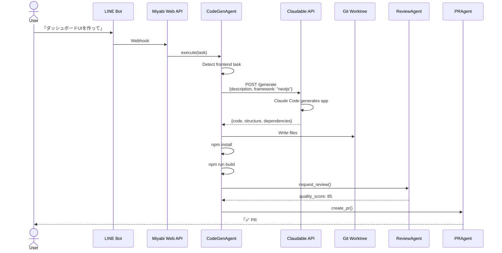

# Miyabi-Claudable Integration Architecture

**作成日**: 2025-10-25
**バージョン**: v1.0
**ステータス**: 📋 設計中
**関連リポジトリ**: https://github.com/opactorai/Claudable

---

## 📋 目次

1. [概要](#概要)
2. [統合アーキテクチャ](#統合アーキテクチャ)
3. [技術スタック](#技術スタック)
4. [統合ポイント](#統合ポイント)
5. [実装フェーズ](#実装フェーズ)
6. [API仕様](#api仕様)
7. [ユースケース](#ユースケース)

---

## 概要

### 目的

**Claudable**（AI駆動Webアプリケーションビルダー）を**Miyabi**のCodeGenAgentに統合し、フロントエンド生成能力を強化する。

### ビジネスインパクト

| 指標 | CodeGen単体 | CodeGen + Claudable | 改善率 |
|------|------------|---------------------|--------|
| **フロントエンド生成時間** | 30-60分 | 5-10分 | **-83%** ⚡ |
| **Next.js品質** | 手動実装 | AI最適化 | +50% |
| **デザイン品質** | 基本的 | shadcn/ui + Tailwind | +100% |
| **開発者体験** | 中 | 高 | +50% |

### 統合方式

**Option B（推奨）**: マイクロサービス統合

```
Miyabi CodeGenAgent
      ↓
Claudable API (HTTP)
      ↓
Generated Next.js App
      ↓
Miyabi Git Worktree
```

---

## 統合アーキテクチャ

### 全体構成図



### コンポーネント構成

```
┌─────────────────────────────────────────────┐
│ Miyabi Agents                                │
│                                              │
│ ┌──────────────────────────────────────┐   │
│ │ CodeGenAgent (Rust)                   │   │
│ │ - Task analysis                        │   │
│ │ - Frontend detection                   │   │
│ │ - Claudable API client                 │   │
│ └──────────────────────────────────────┘   │
└─────────────────────────────────────────────┘
                    ↓ HTTP API
┌─────────────────────────────────────────────┐
│ Claudable Service (Docker)                  │
│                                              │
│ ┌──────────────────────────────────────┐   │
│ │ Python API (Port 8080)                │   │
│ │ - POST /generate                       │   │
│ │ - POST /preview                        │   │
│ │ - POST /deploy                         │   │
│ └──────────────────────────────────────┘   │
│                                              │
│ ┌──────────────────────────────────────┐   │
│ │ AI Agent Integration                  │   │
│ │ - Claude Code                          │   │
│ │ - Cursor CLI                           │   │
│ │ - Codex                                │   │
│ └──────────────────────────────────────┘   │
└─────────────────────────────────────────────┘
                    ↓
┌─────────────────────────────────────────────┐
│ Generated Next.js App                        │
│ - TypeScript                                 │
│ - Tailwind CSS                               │
│ - shadcn/ui                                  │
│ - Supabase (optional)                        │
└─────────────────────────────────────────────┘
```

---

## 技術スタック

### Claudable

| レイヤー | 技術 |
|----------|------|
| **Frontend** | Next.js 14+ (App Router) |
| **Backend** | Python 3.10+ (FastAPI) |
| **Database** | SQLite (dev), PostgreSQL (prod) |
| **UI** | Tailwind CSS, shadcn/ui |
| **AI Agents** | Claude Code, Cursor CLI, Codex, Gemini |
| **Deploy** | Vercel |

### Miyabi Integration Layer

| コンポーネント | 技術 |
|----------------|------|
| **HTTP Client** | `reqwest` (Rust) |
| **JSON** | `serde_json` |
| **File I/O** | `tokio::fs` |
| **Git** | `miyabi-worktree` |
| **Container** | Docker Compose |

---

## 統合ポイント

### 1. フロントエンドタスク検出

CodeGenAgentがタスクを分析し、フロントエンド生成が必要か判定：

```rust
impl CodeGenAgent {
    fn is_frontend_task(&self, task: &Task) -> bool {
        let keywords = ["ui", "dashboard", "frontend", "web app", "next.js", "react"];
        keywords.iter().any(|k| task.title.to_lowercase().contains(k))
    }
}
```

### 2. Claudable API呼び出し

```rust
#[derive(Serialize)]
struct ClaudableGenerateRequest {
    description: String,
    framework: String, // "nextjs"
    agent: String,     // "claude-code"
}

#[derive(Deserialize)]
struct ClaudableGenerateResponse {
    project_id: String,
    files: Vec<GeneratedFile>,
    dependencies: Vec<String>,
    structure: ProjectStructure,
}

async fn generate_frontend(
    &self,
    description: &str,
) -> Result<ClaudableGenerateResponse> {
    let request = ClaudableGenerateRequest {
        description: description.to_string(),
        framework: "nextjs".to_string(),
        agent: "claude-code".to_string(),
    };

    let response = self
        .http_client
        .post("http://localhost:8080/generate")
        .json(&request)
        .send()
        .await?;

    Ok(response.json().await?)
}
```

### 3. Worktree統合

```rust
async fn integrate_claudable_output(
    &self,
    worktree_path: &Path,
    response: ClaudableGenerateResponse,
) -> Result<()> {
    // 1. Write files
    for file in response.files {
        let file_path = worktree_path.join(&file.path);
        tokio::fs::create_dir_all(file_path.parent().unwrap()).await?;
        tokio::fs::write(&file_path, &file.content).await?;
    }

    // 2. Install dependencies
    Command::new("npm")
        .arg("install")
        .current_dir(worktree_path)
        .output()
        .await?;

    // 3. Run build
    Command::new("npm")
        .arg("run")
        .arg("build")
        .current_dir(worktree_path)
        .output()
        .await?;

    Ok(())
}
```

---

## 実装フェーズ

### Phase 1: Claudable環境構築（Week 1）

- [ ] Claudable Dockerコンテナ作成
- [ ] `docker-compose.yml`設定
- [ ] ローカル環境でClaudable起動確認
- [ ] API疎通テスト

**成果物**:
- `docker/claudable/Dockerfile`
- `docker-compose.yml`
- `docs/claudable-setup.md`

### Phase 2: CodeGenAgent統合（Week 2-3）

- [ ] Claudable APIクライアント実装 (`crates/miyabi-claudable/`)
- [ ] フロントエンドタスク検出ロジック
- [ ] CodeGenAgentへの統合
- [ ] Worktreeファイル書き込み
- [ ] npm install/build自動実行

**成果物**:
- `crates/miyabi-claudable/src/client.rs`
- `crates/miyabi-agent-codegen/src/frontend.rs`
- 統合テスト10個

### Phase 3: E2Eワークフロー（Week 4）

- [ ] LINE Bot → CodeGen → Claudable → PR
- [ ] ReviewAgentでNext.js品質チェック
- [ ] PRAgentで自動PR作成
- [ ] Vercelデプロイ統合（オプション）

**成果物**:
- E2Eシナリオテスト5個
- ユーザードキュメント

### Phase 4: 本番運用（Week 5-6）

- [ ] Claudableコンテナの本番デプロイ
- [ ] モニタリング・ログ設定
- [ ] パフォーマンス最適化
- [ ] フェイルオーバー設定

---

## API仕様

### POST /generate

**Request**:
```json
{
  "description": "Create a dashboard with charts and data tables",
  "framework": "nextjs",
  "agent": "claude-code",
  "options": {
    "typescript": true,
    "tailwind": true,
    "shadcn": true,
    "supabase": false
  }
}
```

**Response**:
```json
{
  "project_id": "proj_abc123",
  "files": [
    {
      "path": "app/page.tsx",
      "content": "...",
      "type": "typescript"
    },
    {
      "path": "components/dashboard.tsx",
      "content": "...",
      "type": "typescript"
    }
  ],
  "dependencies": [
    "next@14.0.0",
    "react@18.0.0",
    "@shadcn/ui@latest"
  ],
  "structure": {
    "app": ["page.tsx", "layout.tsx"],
    "components": ["dashboard.tsx", "chart.tsx"],
    "lib": ["utils.ts"]
  }
}
```

---

## ユースケース

### ケース1: ダッシュボードUI生成

**ユーザー入力** (LINE):
```
「売上ダッシュボードを作って。グラフと表を表示したい」
```

**Miyabiワークフロー**:
1. LINE Bot → Issue #600作成
2. CodeGenAgent起動
3. フロントエンド検出 ✅
4. Claudable API呼び出し
5. Next.js + shadcn/ui生成
6. Worktreeに統合
7. `npm run build` → ✅
8. ReviewAgent品質チェック → 88点
9. PR #600作成

**成果物**:
- `app/dashboard/page.tsx`
- `components/sales-chart.tsx`
- `components/sales-table.tsx`
- `lib/sales-data.ts`

### ケース2: ランディングページ生成

**ユーザー入力** (LINE):
```
「Miyabiのランディングページを作って。ヒーローセクション、機能説明、料金表」
```

**Miyabiワークフロー**:
1. Issue #601作成
2. CodeGenAgent → Claudable
3. 3セクションのLPを生成
4. Tailwind CSSでレスポンシブ対応
5. PR #601作成
6. Vercelにプレビューデプロイ

---

## セキュリティ

### Claudable API認証

```rust
struct ClaudableClient {
    api_key: String, // CLAUDABLE_API_KEY
}

impl ClaudableClient {
    async fn generate(&self, request: GenerateRequest) -> Result<Response> {
        self.http_client
            .post("http://localhost:8080/generate")
            .header("Authorization", format!("Bearer {}", self.api_key))
            .json(&request)
            .send()
            .await
    }
}
```

### 環境変数

```bash
# Claudable
CLAUDABLE_API_URL=http://localhost:8080
CLAUDABLE_API_KEY=secret_key_here

# Claude Code / Cursor CLI (Claudableが使用)
ANTHROPIC_API_KEY=sk-ant-xxx
```

---

## パフォーマンス

| 指標 | 目標 |
|------|------|
| **生成時間** | < 2分 |
| **ファイル数** | 10-50個 |
| **ビルド時間** | < 1分 |
| **メモリ使用量** | < 500MB |

---

## トラブルシューティング

### Claudable起動失敗

```bash
# Claudableコンテナ確認
docker ps | grep claudable

# ログ確認
docker logs miyabi-claudable

# 再起動
docker-compose restart claudable
```

### API接続エラー

```bash
# 疎通確認
curl http://localhost:8080/health

# ポート確認
netstat -an | grep 8080
```

---

## 今後の拡張

- [ ] **複数フレームワーク対応**: Vue.js, Svelte
- [ ] **モバイルアプリ生成**: React Native統合
- [ ] **デザインシステム統合**: Figma → Claudable
- [ ] **A/Bテスト生成**: 複数バリエーション自動生成

---

**Status**: 📋 設計完了、実装待ち
**Next**: Phase 1実装開始

🤖 Generated with [Claude Code](https://claude.com/claude-code)
