# L-Step Status Tags Specification
**Phase 2: Customer Lifecycle Management**

**Created by**: まなぶん (Course Society Curriculum Designer)
**Created date**: 2026-01-08
**Version**: 1.0.0
**Target**: PPAL Learners Customer Journey

---

## 🎯 Executive Summary

L-Step Status tags are designed to track customer lifecycle progression for PPAL learners, focusing on learning engagement, retention, and success metrics. These tags complement the existing Product tags (PT_001-PT_003) by adding behavioral and engagement dimensions to customer segmentation.

### Integration with Product Tags

| Product Tag | Focus | Status Tag | Focus |
|-------------|-------|------------|-------|
| PT_001: PPAL Pro | Feature tier | ST_001-ST_006 | Learning progress |
| PT_002: PPAL Enterprise | Team usage | ST_001-ST_006 | Engagement level |
| PT_003: PPAL Freemium | Trial users | ST_001-ST_006 | Conversion stage |

---

## 📊 Status Tags Overview

### 6 Core Status Tags for Customer Lifecycle

| Tag ID | Tag Name | Description | Typical Duration | Auto-Transition |
|--------|----------|-------------|------------------|-----------------|
| **ST_001** | 🌱 Learning:Active | Actively engaging with PPAL content and tutorials | 1-12 weeks | ✅ |
| **ST_002** | 📚 Learning:Progressing | Completing milestones and advancing through curriculum | 2-8 weeks | ✅ |
| **ST_003** | 🏆 Learning:Mastery | Demonstrated proficiency in PPAL workflows | 4+ weeks | ✅ |
| **ST_004** | ⚠️ Risk:Declining | Decreased engagement, showing churn signals | 1-3 weeks | ✅ |
| **ST_005** | 🔄 Risk:Re-engagement | In active retention campaign | 2-4 weeks | ⚠️ |
| **ST_006** | 📤 Status:Churned | No activity for 30+ days, considered lost | Permanent | ❌ |

---

## 🛤️ Status Lifecycle Progression

### Happy Path Journey

```mermaid
graph TD
    A[ST_001: Learning:Active] --> B[ST_002: Learning:Progressing]
    B --> C[ST_003: Learning:Mastery]
    C --> D[🔄 Continuous Learning Cycle]
```


### At-Risk Path

```mermaid
graph TD
    A[ST_001: Learning:Active] --> E[ST_004: Risk:Declining]
    B[ST_002: Learning:Progressing] --> E
    E --> F[ST_005: Risk:Re-engagement]
    F --> G[ST_006: Status:Churned]
    F --> H[🔄 Recovery to Active]
```


### Recovery Paths


---

## 🎯 Detailed Status Tag Specifications

### ST_001: 🌱 Learning:Active

**Definition**: Learners who are actively engaging with PPAL content and making consistent progress.

**Trigger Conditions** (Auto-transition to Active):
- Completes ≥2 lessons per week
- Opens PPAL ≥3 times per week
- Participates in community discussions
- Completes hands-on exercises

**Behavioral Signals**:
- High lesson completion rate (≥80%)
- Regular login patterns (≥3x/week)
- Active in community forums
- Submits practical projects

**Automation Rules**:
```yaml
auto_transition_to_active:
  conditions:
    - lesson_completion_last_7days >= 2
    - login_frequency_last_7days >= 3
    - community_engagement_last_7days >= 1
  action: apply_tag_ST_001
```

**Marketing Actions**:
- Send encouragement messages
- Highlight upcoming advanced features
- Invite to community challenges
- Recommend related courses

---

### ST_002: 📚 Learning:Progressing

**Definition**: Learners who have completed initial milestones and are advancing through the curriculum systematically.

**Trigger Conditions** (Auto-transition to Progressing):
- Completes Week 1 fundamentals module
- Achieves 70%+ score on assessments
- Configures first PPAL workflow successfully
- Demonstrates understanding through projects

**Behavioral Signals**:
- Consistent week-over-week progress
- Increasing complexity in projects
- Mentor session participation
- Peer collaboration in community

**Learning Milestones Tracked**:
1. **Week 1**: PPAL Setup & Basic Configuration
2. **Week 2**: First Automation Workflow
3. **Week 3**: Advanced Prompt Engineering
4. **Week 4**: Team Collaboration Features
5. **Week 5**: Performance Optimization
6. **Week 6**: Custom Integration Development

**Automation Rules**:
```yaml
auto_transition_to_progressing:
  conditions:
    - completed_modules >= 2
    - assessment_average_score >= 70
    - practical_projects_submitted >= 1
    - days_since_enrollment <= 42
  action: apply_tag_ST_002
```

**Marketing Actions**:
- Progress celebration emails
- Advanced feature previews
- Certification pathway information
- Success story sharing

---

### ST_003: 🏆 Learning:Mastery

**Definition**: Learners who have achieved proficiency in PPAL workflows and can implement advanced use cases.

**Trigger Conditions** (Auto-transition to Mastery):
- Completes all core curriculum modules
- Achieves 85%+ on final assessments
- Successfully implements real-world project
- Receives community recognition

**Mastery Indicators**:
- Builds custom PPAL integrations
- Mentors other learners in community
- Contributes to PPAL ecosystem
- Demonstrates ROI from PPAL implementation

**Advanced Capabilities Demonstrated**:
- Multi-agent workflow orchestration
- Custom prompt template creation
- API integration development
- Performance monitoring setup
- Team training delivery

**Automation Rules**:
```yaml
auto_transition_to_mastery:
  conditions:
    - curriculum_completion_rate >= 90
    - final_assessment_score >= 85
    - real_world_project_approved == true
    - community_contribution_score >= 50
  action: apply_tag_ST_003
```

**Marketing Actions**:
- Certification badge issuance
- Expert community access
- Speaking opportunity invitations
- Case study development partnership
- Advanced product beta access

---

### ST_004: ⚠️ Risk:Declining

**Definition**: Learners showing decreased engagement patterns that indicate potential churn risk.

**Risk Signals** (Auto-transition to Declining):
- No logins for 5-7 days
- Lesson completion rate drops below 40%
- Stops participating in community
- Support tickets remain unresolved
- Assessment scores declining

**Early Warning Indicators**:
- Login frequency decreased by 50%+
- Time-per-session decreased significantly
- Stopped completing assignments
- No community interaction for 1 week+
- Negative sentiment in feedback

**Automation Rules**:
```yaml
auto_transition_to_declining:
  conditions:
    - days_since_last_login >= 5
    - lesson_completion_rate_last_14days < 40
    - community_engagement_last_14days == 0
    - support_satisfaction_score < 3
  action: apply_tag_ST_004
  alert: retention_team
```

**Immediate Intervention Actions**:
- Personal check-in email from instructor
- Offer 1-on-1 guidance session
- Provide simplified learning path
- Address specific blocking issues
- Extend course access deadline

---

### ST_005: 🔄 Risk:Re-engagement

**Definition**: Learners in active retention campaign after showing declining engagement.

**Entry Criteria** (Manual/Triggered transition):
- Upgraded from ST_004: Risk:Declining
- Enrolled in retention campaign
- Receiving personalized intervention
- High-value customer (Enterprise tier)

**Re-engagement Strategies**:

1. **Personal Outreach** (Human touch)
   - 1-on-1 call with Customer Success Manager
   - Personalized learning path adjustment
   - Direct instructor mentoring sessions

2. **Content Customization**
   - Tailored learning modules
   - Industry-specific use cases
   - Reduced complexity track

3. **Community Integration**
   - Buddy system pairing
   - Small group study sessions
   - Peer success story sharing

4. **Incentive Programs**
   - Extended access periods
   - Bonus content unlock
   - Certification fee waiver
   - Priority support access

**Automation Rules**:
```yaml
auto_transition_to_reengagement:
  conditions:
    - current_tag == ST_004
    - customer_tier in ['Enterprise', 'Pro']
    - ltv_score >= 1000
  action: apply_tag_ST_005
  trigger: retention_campaign_workflow
```

**Success Metrics**:
- 40% recovery rate to active status
- Average re-engagement duration: 2-4 weeks
- Post-recovery retention rate: 85%

---

### ST_006: 📤 Status:Churned

**Definition**: Learners who have not engaged for 30+ days and are considered churned.

**Churn Criteria** (Auto-transition to Churned):
- No login activity for 30+ days
- No response to re-engagement campaigns
- Explicitly cancelled subscription
- Support-confirmed disengagement

**Churn Prevention (Before ST_006)**:
- 14-day warning email sequence
- 21-day retention phone call
- 28-day final outreach attempt
- Exit interview offer

**Post-Churn Actions**:
- Quarterly win-back campaigns
- Product update notifications
- Community success story sharing
- Re-enrollment with discount offers

**Automation Rules**:
```yaml
auto_transition_to_churned:
  conditions:
    - days_since_last_activity >= 30
    - reengagement_campaign_response == false
    - account_status != 'active'
  action: apply_tag_ST_006
  archive: move_to_winback_sequence
```

**Win-back Campaign Schedule**:
- Month 1: Product improvement highlights
- Month 3: Success story featuring similar role
- Month 6: Major feature announcement + discount
- Month 12: Anniversary offer + community highlights

---

## 🤖 Automation Rules Engine

### Tag Transition Logic

```typescript
interface StatusTransition {
  from: StatusTag[];
  to: StatusTag;
  conditions: TransitionCondition[];
  manual_override: boolean;
  notification: NotificationConfig;
}

const statusTransitions: StatusTransition[] = [
  {
    from: ['ST_001'],
    to: 'ST_002',
    conditions: [
      { metric: 'modules_completed', operator: '>=', value: 2 },
      { metric: 'assessment_score_avg', operator: '>=', value: 70 }
    ],
    manual_override: true,
    notification: { team: 'education', priority: 'low' }
  },
  {
    from: ['ST_001', 'ST_002'],
    to: 'ST_004',
    conditions: [
      { metric: 'days_since_login', operator: '>=', value: 5 },
      { metric: 'engagement_score', operator: '<', value: 40 }
    ],
    manual_override: false,
    notification: { team: 'retention', priority: 'high' }
  }
];
```

### Learning Analytics Integration

```typescript
interface LearningMetrics {
  user_id: string;
  completion_rate: number;
  engagement_score: number;
  time_spent_minutes: number;
  community_participation: number;
  assessment_scores: number[];
  last_activity_date: Date;
  milestone_progress: MilestoneProgress[];
}

interface MilestoneProgress {
  week: number;
  module_name: string;
  completion_status: 'completed' | 'in_progress' | 'not_started';
  score: number;
  completion_date?: Date;
}
```

---

## 📈 Success Metrics & KPIs

### Status Tag Performance Dashboard

| Metric | Definition | Target | Current |
|--------|------------|--------|---------|
| **Active Learner Rate** | % in ST_001 + ST_002 | ≥70% | TBD |
| **Progression Rate** | ST_001 → ST_002 conversion | ≥60% | TBD |
| **Mastery Achievement** | % reaching ST_003 | ≥40% | TBD |
| **At-Risk Detection** | Time to identify ST_004 | ≤3 days | TBD |
| **Recovery Rate** | ST_004/005 → ST_001/002 | ≥35% | TBD |
| **Churn Rate** | % moving to ST_006 | ≤15% | TBD |

### Learning Experience Optimization

**A/B Testing Framework**:
- Test intervention timing (5 days vs 7 days for ST_004)
- Compare outreach methods (email vs in-app vs phone)
- Optimize re-engagement content types
- Measure incentive effectiveness

**Cohort Analysis**:
- Track status progression by enrollment month
- Compare enterprise vs individual learners
- Analyze seasonal engagement patterns
- Measure feature usage correlation with progression

---

## 🛠️ Technical Implementation

### Database Schema Changes

```sql
-- Status Tags Table
CREATE TABLE customer_status_tags (
    id BIGSERIAL PRIMARY KEY,
    customer_id BIGINT NOT NULL REFERENCES customers(id),
    status_tag VARCHAR(10) NOT NULL, -- ST_001, ST_002, etc.
    applied_date TIMESTAMP WITH TIME ZONE DEFAULT NOW(),
    applied_by VARCHAR(50), -- 'auto', 'manual', user_id
    previous_tag VARCHAR(10),
    transition_reason TEXT,
    automation_trigger JSONB,
    valid_until TIMESTAMP WITH TIME ZONE,
    created_at TIMESTAMP WITH TIME ZONE DEFAULT NOW(),
    updated_at TIMESTAMP WITH TIME ZONE DEFAULT NOW()
);

-- Indexes
CREATE INDEX idx_customer_status_current ON customer_status_tags (customer_id, applied_date DESC);
CREATE INDEX idx_status_tag_performance ON customer_status_tags (status_tag, applied_date);

-- Learning Metrics Table
CREATE TABLE learning_metrics (
    id BIGSERIAL PRIMARY KEY,
    customer_id BIGINT NOT NULL REFERENCES customers(id),
    metric_date DATE NOT NULL,
    completion_rate DECIMAL(5,2),
    engagement_score INTEGER,
    time_spent_minutes INTEGER,
    logins_count INTEGER,
    community_posts INTEGER,
    assessment_avg_score DECIMAL(5,2),
    milestone_progress JSONB,
    created_at TIMESTAMP WITH TIME ZONE DEFAULT NOW()
);

CREATE UNIQUE INDEX idx_customer_metrics_date ON learning_metrics (customer_id, metric_date);
```

### API Endpoints

```typescript
// GET /api/customers/{id}/status-tags
interface StatusTagResponse {
  current_tag: string;
  applied_date: string;
  history: StatusTagHistory[];
  next_possible_transitions: string[];
  automation_suggestions: AutomationSuggestion[];
}

// POST /api/customers/{id}/status-tags
interface StatusTagUpdate {
  new_tag: string;
  reason: string;
  manual_override: boolean;
  notes?: string;
}

// GET /api/analytics/status-tags/dashboard
interface StatusDashboard {
  distribution: { [tag: string]: number };
  transitions_today: TransitionSummary[];
  at_risk_count: number;
  automation_effectiveness: MetricSummary;
}
```

---

## 🚀 Deployment Roadmap

### Phase 1: Core Implementation (Week 1-2)
- [ ] Database schema migration
- [ ] Basic tag application logic
- [ ] Manual tag assignment UI
- [ ] Simple analytics dashboard

### Phase 2: Automation Engine (Week 3-4)
- [ ] Learning metrics collection
- [ ] Auto-transition rules engine
- [ ] Notification system integration
- [ ] A/B testing framework

### Phase 3: Advanced Features (Week 5-6)
- [ ] ML-based churn prediction
- [ ] Personalized intervention recommendations
- [ ] Advanced analytics and cohort analysis
- [ ] Integration with marketing automation

### Phase 4: Optimization (Week 7-8)
- [ ] Performance monitoring
- [ ] Rule optimization based on data
- [ ] Advanced reporting features
- [ ] Customer success team training

---

## 🎓 Customer Journey Integration

### Learning Path Mapping


### Integration with Existing Product Tags

**Synergy Matrix**:

| Product + Status | Interpretation | Priority Action |
|------------------|----------------|------------------|
| PT_001 + ST_001 | Pro user, actively learning | Standard support |
| PT_001 + ST_004 | Pro user at risk | High-touch retention |
| PT_002 + ST_003 | Enterprise mastery achieved | Expansion opportunity |
| PT_003 + ST_002 | Freemium progressing well | Upgrade nurturing |
| PT_003 + ST_006 | Free user churned | Win-back with value demo |

### Success Story Framework

**Case Study Template**:
```markdown
## Customer Success Story
**Customer**: [Company/Individual Name]
**Journey**: PT_003 → PT_001 → ST_001 → ST_002 → ST_003
**Timeline**: 8 weeks
**ROI Achieved**: 300% productivity improvement

### Challenge
[Original pain point and goals]

### PPAL Implementation
[How they used PPAL features]

### Results
[Quantified outcomes and benefits]

### Quote
"[Customer testimonial]"
```

---

## 🔄 Continuous Improvement Process

### Monthly Review Process

1. **Status Tag Distribution Analysis**
   - Review monthly progression rates
   - Identify bottlenecks in customer journey
   - Analyze cohort performance variations

2. **Automation Effectiveness Review**
   - Evaluate trigger accuracy
   - Optimize transition timing
   - Refine risk detection algorithms

3. **Intervention Success Measurement**
   - Track recovery rates by intervention type
   - A/B test new retention strategies
   - Update messaging based on feedback

4. **Customer Feedback Integration**
   - Collect qualitative insights on journey experience
   - Incorporate suggestions into tag logic
   - Validate assumptions with user interviews

### Quarterly Evolution

- **Q1**: Baseline implementation and data collection
- **Q2**: ML enhancement and predictive capabilities
- **Q3**: Advanced personalization and micro-segmentation
- **Q4**: Ecosystem integration and external partnerships

---

## 📝 Implementation Notes

### Dependencies
- Existing Product Tags (PT_001-PT_003) must be stable
- Learning analytics infrastructure required
- Customer success team training needed
- Marketing automation platform integration

### Risks & Mitigation
- **Risk**: Over-automation reducing human touch
  - **Mitigation**: Manual override capabilities and human escalation paths
- **Risk**: False positive churn predictions
  - **Mitigation**: Gradual automation rollout with validation periods
- **Risk**: Customer privacy concerns with behavioral tracking
  - **Mitigation**: Transparent data usage policies and opt-out options

### Success Criteria
- 25% improvement in customer retention by Q2
- 40% of users reaching mastery level (ST_003)
- 90% automation accuracy for status transitions
- Customer satisfaction score ≥ 4.5/5 for learning experience

---

**Document Status**: Ready for Implementation
**Next Action**: Technical architecture review and development sprint planning

---
*Generated by まなぶん (Course Society Curriculum Designer)*
*Miyabi AI Agent Society - L-Step Customer Lifecycle Management*