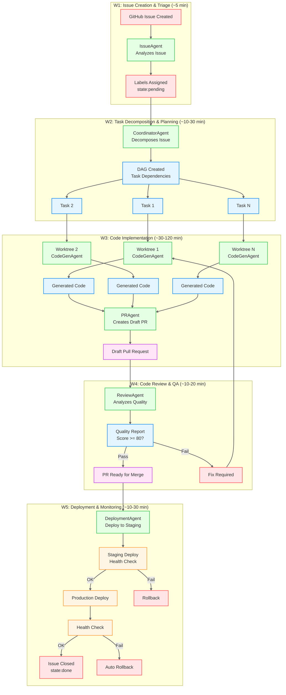
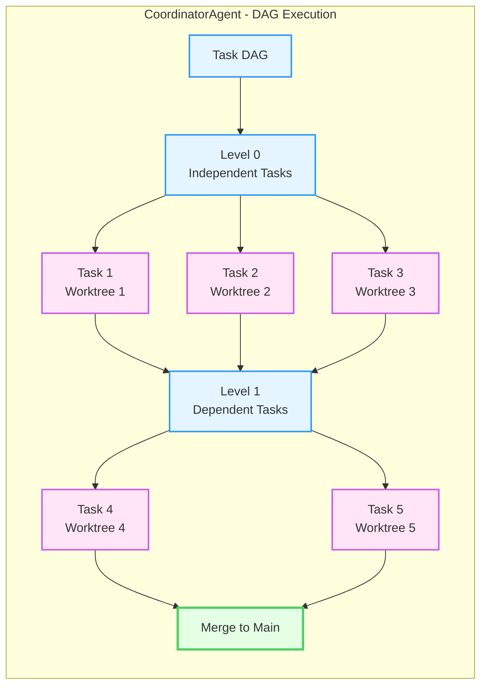
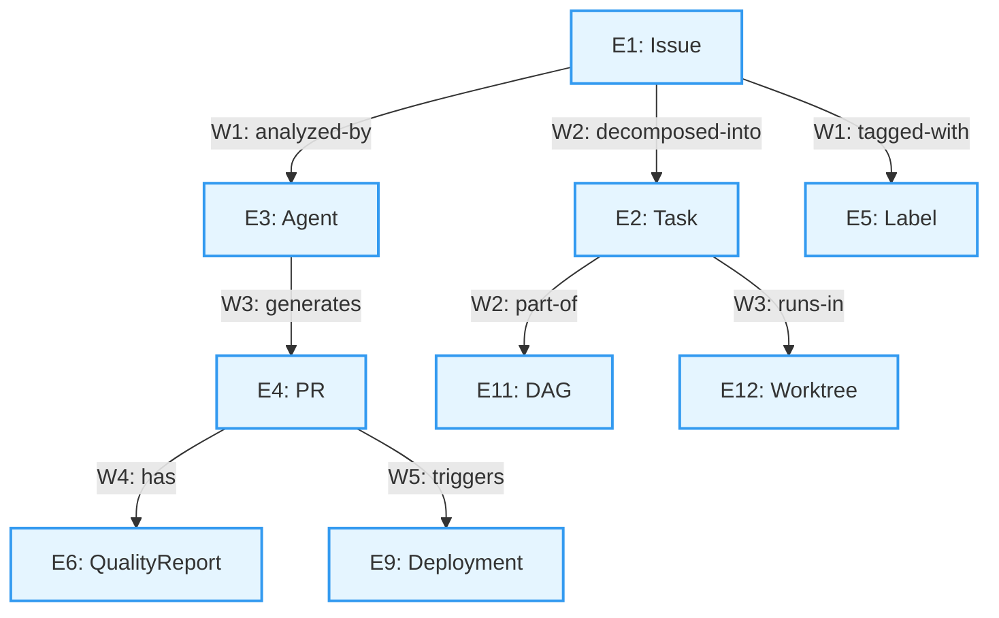

# Miyabi Workflows - Visual Guide

## 🔄 Complete Workflow Chain

## 📊 Workflow Details

### W1: Issue Creation & Triage
- **Duration**: ~5 minutes
- **Trigger**: Issue created on GitHub
- **Agent**: IssueAgent
- **Output**: Labeled Issue with type/priority/severity

### W2: Task Decomposition & Planning
- **Duration**: ~10-30 minutes
- **Trigger**: `trigger:agent-execute` label OR manual command
- **Agent**: CoordinatorAgent
- **Output**: DAG with decomposed tasks

### W3: Code Implementation
- **Duration**: ~30-120 minutes
- **Trigger**: Task decomposition completed
- **Agents**: CodeGenAgent, PRAgent
- **Output**: Draft Pull Request

### W4: Code Review & QA
- **Duration**: ~10-20 minutes
- **Trigger**: Draft PR created
- **Agent**: ReviewAgent
- **Output**: Quality Report (score, recommendations)

### W5: Deployment & Monitoring
- **Duration**: ~10-30 minutes
- **Trigger**: PR approved and merged
- **Agent**: DeploymentAgent
- **Output**: Production deployment + health check

---

## 🔀 Parallel Execution Flow

---

## 🎯 Entity Flow Through Workflows

---

## 📈 Workflow Statistics

| Workflow | Avg Duration | Entities | Agents | Relations |
|----------|-------------|----------|--------|-----------|
| W1 | ~5 min | 3 (E1,E3,E5) | 1 | 25 |
| W2 | ~10-30 min | 3 (E2,E3,E11) | 1 | 21 |
| W3 | ~30-120 min | 5 (E2,E3,E4,E10,E12) | 2 | 26 |
| W4 | ~10-20 min | 2 (E3,E6) | 1 | 16 |
| W5 | ~10-30 min | 3 (E1,E3,E9) | 1 | 23 |

**Total Pipeline Duration**: ~55-185 minutes (best to worst case)

---

## 🔗 Related Documents

- [[workflows/INDEX|Workflows Index]] - Detailed workflow documentation
- [[entities/INDEX|Entities Index]] - All entities
- [[agents/INDEX|Agents Index]] - All agents
- [[relations/INDEX|Relations Index]] - All relationships

---

**Visual Guide** | Version 1.0 | 2025-11-18
