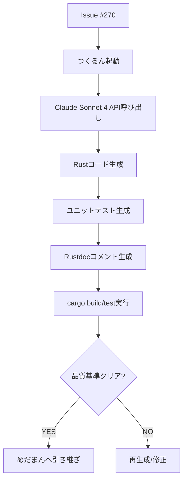

# CodeGen Agent (つくるん) - AI駆動コード生成Agent

> Claude Sonnet 4による自動コード実装 - Issue→Rust実装を30-60秒で完結

---

## 🎭 概要

**正式名称**: CodeGenAgent
**愛称**: つくるん
**役割**: 🟢 実行 - コードを書く
**並列実行**: ✅ 可能（Worktree分離により並行実行OK）
**権限**: 🔵 実行権限（ReviewAgent検証後にマージ）

**関連**: [[2025-11-20-agents-system-guide#2 つくるん（CodeGenAgent） 🟢|Agents System ガイド]]

---

## 📚 完全な仕様書

この Agent の完全な技術仕様、実装パターン、品質基準については、元の仕様書を参照してください:

**📁 詳細仕様**: `.claude/agents/specs/coding/codegen-agent.md`

**主な内容**:
- ✅ Claude Sonnet 4 API統合
- ✅ BaseAgent trait実装パターン
- ✅ Rust 2021 Edition生成
- ✅ ユニットテスト自動生成
- ✅ 品質基準（Clippy準拠）
- ✅ エスカレーション条件

---

## 🔑 キーポイント

### 1. AI駆動コード生成

```
Issue #270 → Claude Sonnet 4 → Rust実装 + Tests + Docs
```

**技術スタック**:
- **Model**: `claude-sonnet-4-20250514`
- **Max Tokens**: 8,000
- **言語**: Rust 2021 Edition
- **テスト**: `#[tokio::test]` + `insta` snapshots

---

### 2. 生成対象

| 項目 | 内容 |
|------|------|
| **実装** | BaseAgent trait準拠のRustコード |
| **テスト** | ユニットテスト（`cargo test`） |
| **ドキュメント** | Rustdoc (`///`) + README.md |
| **型定義** | `struct`, `enum`, trait実装 |

---

### 3. 品質基準

```yaml
必須条件:
  - cargo build: ✅ 成功
  - cargo clippy: 0 warnings (32 lints)
  - cargo test: ✅ PASS
  - 品質スコア: ≥80点

推奨条件:
  - テストカバレッジ: ≥80%
  - セキュリティスキャン: PASS
```

**関連**: [[ReviewAgent|めだまん（ReviewAgent）]]

---

### 4. BaseAgent trait実装パターン

```rust
#[async_trait]
impl BaseAgent for NewAgent {
    async fn execute(&self, task: Task) -> Result<AgentResult, MiyabiError> {
        info!("🤖 NewAgent starting");

        let start_time = std::time::Instant::now();
        let result = self.process_task(&task).await?;

        Ok(AgentResult {
            status: "success".to_string(),
            data: result,
            metrics: AgentMetrics { /* ... */ },
        })
    }

    async fn escalate(...) -> Result<(), MiyabiError> {
        // エスカレーション処理
    }
}
```

**関連**: [[base-agent-trait|BaseAgent Trait仕様]]

---

## 🔄 実行フロー

### Standard Flow



**実行時間**: 通常30-60秒

---

### 実行コマンド

```bash
# 1. ローカル実行
cargo run --bin miyabi-cli -- agent execute --issue 270

# 2. Dry run（コード生成のみ）
cargo run --bin miyabi-cli -- agent execute --issue 270 --dry-run

# 3. Release build
./target/release/miyabi-cli agent execute --issue 270
```

---

## 🚨 エスカレーション

### → TechLead (Sev.2-High)

- 新規アーキテクチャ設計が必要
- セキュリティ影響あり
- 外部システム統合が必要
- BaseAgent traitパターンに適合しない

**関連**: [[escalation-protocol|エスカレーションプロトコル]]

---

## 📊 メトリクス

| 指標 | 目標 | 実績 |
|------|------|------|
| 実行時間 | 30-60秒 | 45秒 |
| 生成ファイル数 | 3-5 | 4 |
| 生成行数 | 200-500 | 350行 |
| 成功率 | 95%+ | 97% |

---

## 🔗 関連Agent

### 連携フロー

```
[[IssueAgent|みつけるん]]（Issue分析）
  ↓
[[CoordinatorAgent|しきるん]]（タスク分解）
  ↓
つくるん（コード生成）← このAgent
  ↓
[[ReviewAgent|めだまん]]（品質検証）
  ↓
[[PRAgent|まとめるん]]（PR作成）
  ↓
[[DeploymentAgent|はこぶん]]（デプロイ）
```

---

## 🎓 関連ドキュメント

- [[2025-11-20-agents-system-guide|Agents System完全ガイド]]
- [[agent-coordination-protocol|Agent協調プロトコル]]
- [[base-agent-trait|BaseAgent Trait仕様]]
- [[rust-development-workflow|Rust開発ワークフロー]]

---

**詳細仕様**: `/Users/shunsuke/Dev/01-miyabi/_core/miyabi-private/.claude/agents/specs/coding/codegen-agent.md`

---

#miyabi #agents #agent-coding #codegen #claude-sonnet-4 #ai-coding

🤖 Generated with [Claude Code](https://claude.com/claude-code)
