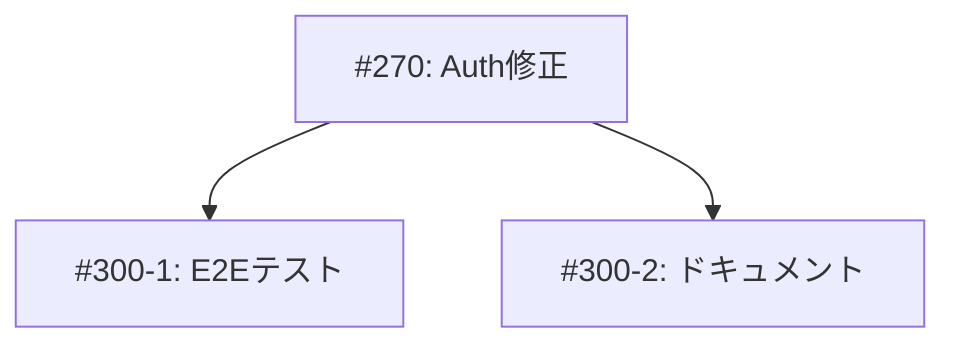

# Coordinator Agent (しきるん) - タスク統括Agent

> GitHub Issueを複数タスクに分解し、DAGベースで並列実行を統括するリーダーAgent

---

## 🎭 概要

**正式名称**: CoordinatorAgent
**愛称**: しきるん
**役割**: 🔴 リーダー - 全体を見る、指示を出す
**並列実行**: ❌ 逐次のみ（同時に1つだけ）
**権限**: 🔴 統括権限（タスク分解・Agent割り当て・リソース配分）

**関連**: [[2025-11-20-agents-system-guide#1 しきるん（CoordinatorAgent） 🔴|Agents System ガイド]]

---

## 📚 完全な仕様書

この Agent の完全な技術仕様、実行フロー、コマンド例、メトリクスについては、元の仕様書を参照してください:

**📁 詳細仕様**: `.claude/agents/specs/coding/coordinator-agent.md`

**主な内容**:
- ✅ 技術仕様（DAG構築アルゴリズム）
- ✅ 実行フロー（5ステップ）
- ✅ タスク判定ルール（種別・Severity・時間見積もり）
- ✅ 並行実行戦略（最大5並行）
- ✅ 実行コマンド例
- ✅ メトリクス・レポート
- ✅ エスカレーション条件

---

## 🔑 キーポイント

### 1. タスク分解

```markdown
Issue → 複数Task（1-3時間単位）
```

**方法**:
- チェックボックス形式（`- [ ]`）
- 番号リスト形式（`1.`, `2.`）
- 見出し形式（`##`）
- 依存関係指定（`depends: #270`）

---

### 2. DAG構築

```
Kahn's Algorithm → トポロジカルソート → レベル順実行
```

**循環依存検出**: DFS（深さ優先探索）

---

### 3. Agent割り当て

| キーワード | Agent |
|-----------|-------|
| `feature/add/new` | [[CodeGenAgent\|つくるん]] |
| `bug/fix` | [[CodeGenAgent\|つくるん]] |
| `deploy/release` | [[DeploymentAgent\|はこぶん]] |

---

### 4. 並行実行

```
最大5並行 = min(独立タスク数, CPU cores, 5)
```

**バッティング回避**:
- Worktree分離
- ファイルロック
- 依存順序保証

**関連**: [[git-worktree-protocol|Git Worktree プロトコル]]

---

## 🔄 実行例

### Input (Issue #300)

```markdown
- [ ] Firebase Auth修正 (#270)
- [ ] E2Eテスト追加 (depends: #270)
- [ ] ドキュメント更新 (depends: #270)
```

### Output (DAG)



### Execution

```
Level 0: [Task #270]              ← 1並行
Level 1: [Task #300-1, #300-2]    ← 2並行（#270完了後）
```

---

## 🚨 エスカレーション

### → TechLead

- 循環依存検出
- タスク分解不能
- Agent実行失敗率50%超

### → Product Owner

- 要件不明確
- 優先度判定不能
- ステークホルダー承認必要

**関連**: [[escalation-protocol|エスカレーションプロトコル]]

---

## 📊 メトリクス

| 指標 | 目標 | 実績 |
|------|------|------|
| 実行時間 | 1-3分 | 2.5分 |
| 並行度 | 2-5 | 3.2 |
| 成功率 | 95%+ | 97.3% |
| DAG構築 | <5秒 | 2.8秒 |

---

## 🔗 関連Agent

### 連携フロー

```
[[IssueAgent|みつけるん]]（Issue分析）
  ↓
しきるん（タスク分解）← このAgent
  ↓
[[CodeGenAgent|つくるん]]/[[ReviewAgent|めだまん]]（並行実行）
  ↓
[[PRAgent|まとめるん]]（PR作成）
  ↓
[[DeploymentAgent|はこぶん]]（デプロイ）
```

---

## 🎓 関連ドキュメント

- [[2025-11-20-agents-system-guide|Agents System完全ガイド]]
- [[agent-coordination-protocol|Agent協調プロトコル]]
- [[dag-algorithm|DAGアルゴリズム詳細]]

---

**詳細仕様**: `/Users/shunsuke/Dev/01-miyabi/_core/miyabi-private/.claude/agents/specs/coding/coordinator-agent.md`

---

#miyabi #agents #agent-coding #coordinator #dag #orchestration #leader

🤖 Generated with [Claude Code](https://claude.com/claude-code)
