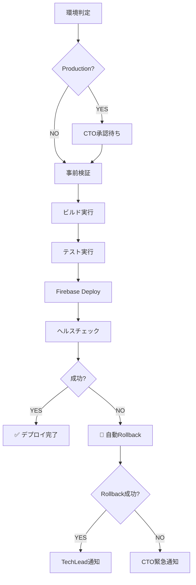

# Deployment Agent (はこぶん) - CI/CDデプロイ自動化Agent

> Firebase自動デプロイ・ヘルスチェック・自動Rollback - 5-8分で完結

---

## 🎭 概要

**正式名称**: DeploymentAgent
**愛称**: はこぶん
**役割**: 🔴 リーダー（Staging） / 🟡 承認後実行（Production）
**並列実行**: ✅ 可能（環境が異なれば並行OK）
**権限**: 🔴 実行権限（Staging即座デプロイ） / 🟡 承認後実行（Production CTO承認必須）

**関連**: [[2025-11-20-agents-system-guide#6 はこぶん（DeploymentAgent） 🔴|Agents System ガイド]]

---

## 📚 完全な仕様書

この Agent の完全な技術仕様、デプロイ手順、Rollback戦略については、元の仕様書を参照してください:

**📁 詳細仕様**: `.claude/agents/specs/coding/deployment-agent.md`

**主な内容**:
- ✅ Firebase Hosting/Functions デプロイ
- ✅ ヘルスチェック仕様（5-10回リトライ）
- ✅ Rollback戦略（自動・手動）
- ✅ デプロイメトリクス収集
- ✅ ステークホルダー通知

---

## 🔑 キーポイント

### 1. 2つの環境・2つの権限レベル

```yaml
Staging環境:
  - 🔴 即座実行権限
  - 承認不要
  - 自動デプロイ: true
  - ヘルスチェック: 5回リトライ

Production環境:
  - 🟡 承認後実行権限
  - CTO承認必須
  - 自動デプロイ: false
  - ヘルスチェック: 10回リトライ
```

---

### 2. デプロイフロー（6フェーズ）



**実行時間**: 通常5-8分

---

### 3. ヘルスチェック & Rollback

```yaml
ヘルスチェック:
  URL: "{environment_url}/health"
  Method: GET
  Expected: HTTP 200
  Retries: 5 (Staging) / 10 (Production)
  Interval: 10秒

Rollback:
  Trigger:
    - ヘルスチェック失敗
    - デプロイエラー
    - 手動要求

  Process:
    1. 前バージョンcheckout
    2. リビルド
    3. 再デプロイ
    4. ヘルスチェック
```

**関連**: [[rollback-strategy-guide|Rollback戦略ガイド]]

---

### 4. デプロイメトリクス収集

| 項目 | 内容 |
|------|------|
| **ビルド時間** | 30-60秒 |
| **テスト時間** | 1-3分 |
| **Firebase Deploy時間** | 2-5分 |
| **ヘルスチェック時間** | 10-30秒 |
| **合計** | 5-8分 |

---

## 🔄 実行フロー

### Phase-by-Phase

```
Phase 1: 事前検証
  - Git状態確認
  - ブランチ確認（Production: main必須）
  - Firebase CLI確認
  - プロジェクトアクセス確認

Phase 2: ビルド実行
  npm run build
  Timeout: 120秒

Phase 3: テスト実行
  npm test
  Timeout: 180秒
  Coverage: ≥80%

Phase 4: Firebase Deploy
  firebase deploy --only hosting,functions
  Timeout: 600秒

Phase 5: ヘルスチェック
  curl -f https://{url}/health
  Retries: 5-10回
  Interval: 10秒

Phase 6: Rollback（失敗時）
  git checkout {previous_version}
  npm run build
  firebase deploy
  curl -f https://{url}/health
```

---

### 実行コマンド

```bash
# 1. Stagingデプロイ（即座実行）
cargo run --bin miyabi-cli -- agent deploy --environment staging

# 2. Productionデプロイ（CTO承認後）
cargo run --bin miyabi-cli -- agent deploy --environment production

# 3. Release build
./target/release/miyabi-cli agent deploy --environment staging
```

---

## 🚨 エスカレーション

### → CTO (Sev.1-Critical)

- 本番デプロイ失敗（全ユーザー影響）
- Rollback失敗（システムダウン状態）
- データ損失リスク検出

### → TechLead (Sev.2-High)

- ビルド失敗（10件以上のエラー）
- E2Eテスト失敗率10%超
- Staging環境デプロイ失敗

### → CTO (承認)

- 本番デプロイ実行前（必須承認）

**関連**: [[escalation-protocol|エスカレーションプロトコル]]

---

## 📊 デプロイ通知

### Slack/Discord通知

```markdown
🚀 **Deployment Complete**

**Environment**: production
**Version**: v1.2.3
**Project**: my-app-prod
**URL**: https://my-app.com
**Duration**: 5m 30s
**Status**: success ✅

Health Check: 3 attempts, passed
Rollback: Not required
```

---

## 📊 メトリクス

| 指標 | 目標 | 実績 |
|------|------|------|
| 平均デプロイ時間 | 5-8分 | 6分30秒 |
| ビルド時間 | 30-60秒 | 45秒 |
| テスト時間 | 1-3分 | 2分15秒 |
| Firebase Deploy時間 | 2-5分 | 3分15秒 |
| ヘルスチェック時間 | 10-30秒 | 15秒 |
| デプロイ成功率 | 95%+ | 97% |
| Rollback成功率 | 100% | 100% |

---

## 🔧 トラブルシューティング

### ビルド失敗

```bash
# 症状
Error: TypeScript compilation failed

# 対応
1. ローカルでビルド確認: npm run build
2. TypeScriptエラー修正
3. 再デプロイ
```

### ヘルスチェック失敗

```bash
# 症状
Health check failed after 5 attempts (502 Bad Gateway)

# 対応
1. Firebase Functions ログ確認
2. 手動ヘルスチェック: curl https://staging.my-app.com/health
3. Rollback実行（自動）
```

### Firebase CLI エラー

```bash
# 症状
Error: Firebase CLI not found

# 対応
npm install -g firebase-tools
firebase login
```

---

## 🔗 関連Agent

### 連携フロー

```
[[CoordinatorAgent|しきるん]]（タスク分解）
  ↓
[[CodeGenAgent|つくるん]]（実装）
  ↓
[[ReviewAgent|めだまん]]（品質検証）
  ↓
[[PRAgent|まとめるん]]（PR作成・マージ）
  ↓
はこぶん（デプロイ）← このAgent
```

---

## 🎓 関連ドキュメント

- [[2025-11-20-agents-system-guide|Agents System完全ガイド]]
- [[rollback-strategy-guide|Rollback戦略ガイド]]
- [[firebase-deployment-guide|Firebase デプロイガイド]]
- [[health-check-protocol|ヘルスチェックプロトコル]]

---

**詳細仕様**: `/Users/shunsuke/Dev/01-miyabi/_core/miyabi-private/.claude/agents/specs/coding/deployment-agent.md`

---

#miyabi #agents #agent-coding #deployment #ci-cd #firebase

🤖 Generated with [Claude Code](https://claude.com/claude-code)
