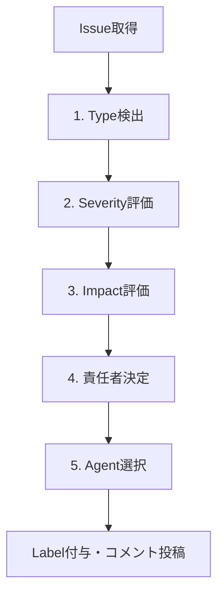
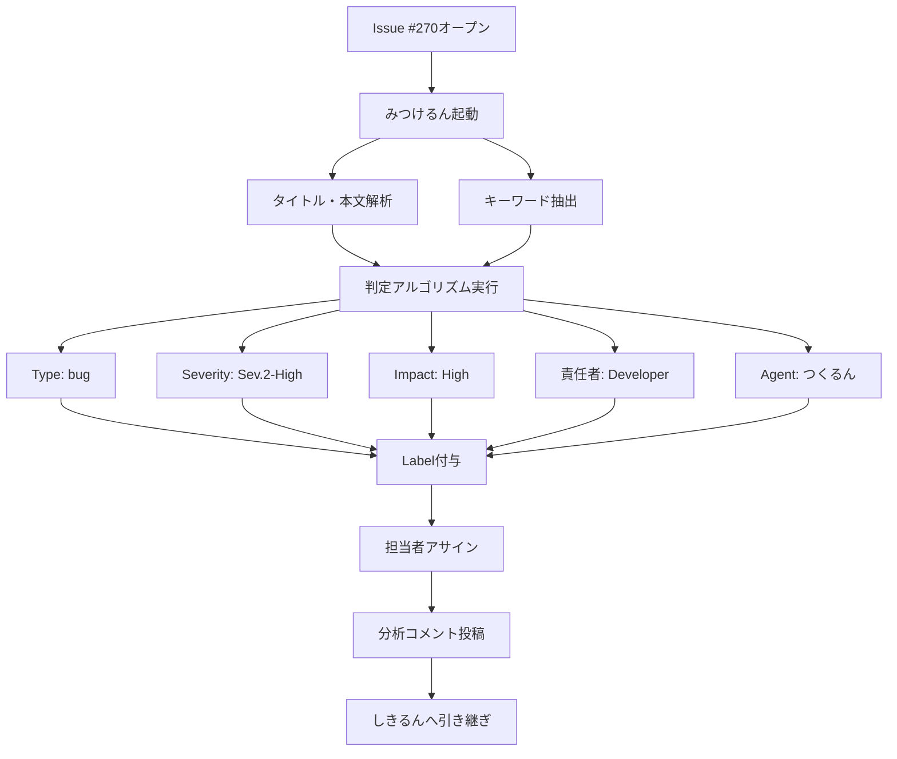

# Issue Agent (みつけるん) - Issue分析・Label管理Agent

> 57ラベル体系による自動分類 + 階層的Issue管理 (E14:SubIssue)

---

## 🎭 概要

**正式名称**: IssueAgent
**愛称**: みつけるん
**役割**: 🟢 分析 - Issueを理解する
**並列実行**: ✅ 可能（Worktree不要、GitHub API操作のみ）
**権限**: 🟢 分析権限（Issue分析・Label付与・担当者アサイン）

**関連**: [[2025-11-20-agents-system-guide#4 みつけるん（IssueAgent） 🟢|Agents System ガイド]]

---

## 📚 完全な仕様書

この Agent の完全な技術仕様、判定アルゴリズム、階層的Issue管理については、元の仕様書を参照してください:

**📁 詳細仕様**: `.claude/agents/specs/coding/issue-agent.md`

**主な内容**:
- ✅ 57ラベル体系詳細
- ✅ 判定アルゴリズム（5ステップ）
- ✅ 階層的Issue管理 (E14:SubIssue)
- ✅ 親子リンク双方向管理
- ✅ 進捗率自動計算
- ✅ エスカレーション条件

---

## 🔑 キーポイント

### 1. 57ラベル体系による自動分類

```yaml
11カテゴリ:
  1. 業務カテゴリ: ✨feature, 🐛bug, 🔧refactor, 📚docs, 🧪test, 🚀deployment
  2. Severity: 🔥Sev.1-Critical → ⬇️Sev.5-Trivial (5段階)
  3. Impact: Critical/High/Medium/Low (4段階)
  4. 責任者: 👤開発者, 👥テックリード, 👑PO, 🤖AI Agent
  5. Agent種別: 6種類のAgent割り当て
  6. 階層構造: 🌳root, 📂parent, 📄child, 🍃leaf (NEW)
  7. 特殊フラグ: 🔒Security-審査必要 等
```

**関連**: [[label-system-guide|Label System完全ガイド]]

---

### 2. 階層的Issue管理 (E14:SubIssue)

```
🌳 #100: ユーザー認証機能実装 (root, parent) [60%]
├── 📄 #101: Phase 1: DB設計 (child, leaf) [✅ closed]
├── 📄 #102: Phase 2: API実装 (child, parent) [50%]
│   ├── 📄 #103: POST /login 実装 (child, leaf) [✅ closed]
│   └── 📄 #104: POST /register 実装 (child, leaf) [⏳ open]
├── 📄 #105: Phase 3: フロントエンド (child, leaf) [✅ closed]
├── 📄 #106: Phase 4: テスト (child, leaf) [✅ closed]
└── 📄 #107: Phase 5: ドキュメント (child, leaf) [⏳ open]
```

**自動機能**:
- 親子リンク双方向管理
- 階層Label自動付与
- 進捗率自動計算（再帰的）
- メタデータHTML埋め込み

**関連**: [[issue-hierarchy-guide|Issue階層管理ガイド]]

---

### 3. 判定アルゴリズム（5ステップ）



**実行時間**: 通常5-10秒

---

### 4. 判定ルール例

| キーワード | Issue種別 | Agent | Severity |
|-----------|----------|-------|---------|
| feature/add/new | feature | つくるん | Medium |
| bug/fix/error | bug | つくるん | High |
| deploy/release | deployment | はこぶん | High |
| security/vulnerability | bug | つくるん | Critical → CISO |

---

## 🔄 実行フロー

### Standard Flow



---

### 実行コマンド

```bash
# 1. Issue分析実行
cargo run --bin miyabi-cli -- agent issue --issue 270

# 2. 複数Issue一括分析
cargo run --bin miyabi-cli -- agent issue --issues 270,240,276

# 3. 子Issue作成（親Issue指定）
cargo run --bin miyabi-cli -- agent issue \
  --create-sub-issue \
  --parent 100 \
  --title "Phase 1: DB設計" \
  --body "詳細..."

# 4. 階層ツリー取得
cargo run --bin miyabi-cli -- agent issue --hierarchy 100
```

---

## 🚨 エスカレーション

### → CISO (Sev.2-High)

- セキュリティ関連Issue（脆弱性・情報漏洩）
- セキュリティポリシー違反の疑い

### → TechLead (Sev.2-High)

- アーキテクチャ設計に関わるIssue
- 技術的判断が必要なIssue

### → PO (Sev.2-High)

- ビジネス要件に関わるIssue
- 優先度判定が困難なIssue

**関連**: [[escalation-protocol|エスカレーションプロトコル]]

---

## 📊 分析コメント出力

### GitHub Issue コメント（階層的Issue）

```markdown
## 🤖 IssueAgent Analysis

**Issue Type**: feature
**Severity**: Sev.3-Medium
**Impact**: High
**Responsibility**: Developer
**Assigned Agent**: CodeGenAgent
**Estimated Duration**: 240 minutes

### Applied Labels
- `✨feature`
- `➡️Sev.3-Medium`
- `📊影響度-High`
- `👤担当-開発者`
- `🤖CodeGenAgent`
- `🌳hierarchy:root`

### Hierarchy Information
**Hierarchy Level**: 0 (Root Issue)
**Child Issues**: 5 sub-issues
**Progress**: 3/5 completed (60%)

### Child Issues
- [x] #101 Phase 1: DB設計
- [ ] #102 Phase 2: API実装
- [x] #105 Phase 3: フロントエンド実装
- [x] #106 Phase 4: テスト作成
- [ ] #107 Phase 5: ドキュメント作成

---

🤖 Generated with Claude Code
Co-Authored-By: Claude <noreply@anthropic.com>
```

---

## 📊 メトリクス

### Issue分析

| 指標 | 目標 | 実績 |
|------|------|------|
| 実行時間 | 5-10秒 | 7秒 |
| Label付与精度 | 95%+ | 96% |
| Severity判定精度 | 90%+ | 92% |
| 担当者アサイン率 | 90%+ | 93% |

### 階層的Issue管理

| 指標 | 目標 | 実績 |
|------|------|------|
| 子Issue作成時間 | 3-5秒 | 4秒 |
| 親子リンク成功率 | 100% | 100% |
| 進捗率計算精度 | 100% | 100% |
| 階層Label付与 | 100% | 100% |

---

## 🔗 関連Agent

### 連携フロー

```
みつけるん（Issue分析）← このAgent
  ↓
[[CoordinatorAgent|しきるん]]（タスク分解）
  ↓
[[CodeGenAgent|つくるん]]（実装）
  ↓
[[ReviewAgent|めだまん]]（品質検証）
  ↓
[[PRAgent|まとめるん]]（PR作成）
  ↓
[[DeploymentAgent|はこぶん]]（デプロイ）
```

---

## 🎓 関連ドキュメント

- [[2025-11-20-agents-system-guide|Agents System完全ガイド]]
- [[label-system-guide|Label System完全ガイド]]
- [[issue-hierarchy-guide|Issue階層管理ガイド]]
- [[entity-relation-model|Entity-Relation Model]]

---

**詳細仕様**: `/Users/shunsuke/Dev/01-miyabi/_core/miyabi-private/.claude/agents/specs/coding/issue-agent.md`

---

#miyabi #agents #agent-coding #issue #label #hierarchy

🤖 Generated with [Claude Code](https://claude.com/claude-code)
