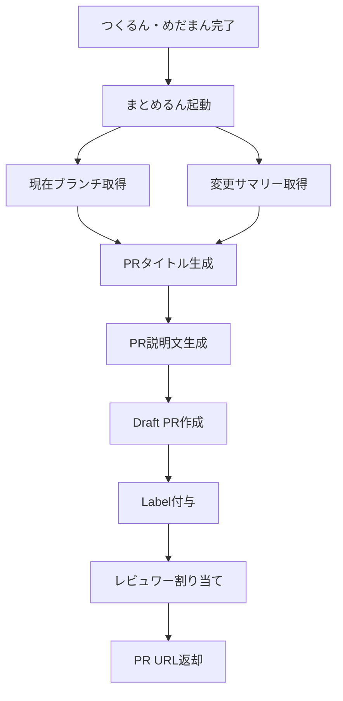

# PR Agent (まとめるん) - Pull Request自動作成Agent

> Conventional Commits準拠 - Draft PR自動生成とレビュワー割り当て

---

## 🎭 概要

**正式名称**: PRAgent
**愛称**: まとめるん
**役割**: 🟢 実行 - PRにまとめる
**並列実行**: ✅ 可能（Worktree分離により並行実行OK）
**権限**: 🔵 実行権限（PR作成・Label付与・レビュワー割り当て）

**関連**: [[2025-11-20-agents-system-guide#5 まとめるん（PRAgent） 🟢|Agents System ガイド]]

---

## 📚 完全な仕様書

この Agent の完全な技術仕様、PR説明文構造、エラーハンドリングについては、元の仕様書を参照してください:

**📁 詳細仕様**: `.claude/agents/specs/coding/pr-agent.md`

**主な内容**:
- ✅ Conventional Commits準拠タイトル生成
- ✅ PR説明文自動構築
- ✅ レビュワー自動割り当て（CODEOWNERS）
- ✅ Label自動付与
- ✅ エラーハンドリング（権限・競合・重複）

---

## 🔑 キーポイント

### 1. Conventional Commits準拠タイトル

```yaml
Format: "{prefix}({scope}): {description}"

Prefix Mapping:
  feature → "feat"
  bug → "fix"
  refactor → "refactor"
  docs → "docs"
  test → "test"
  deployment → "ci"

Example:
  - "feat(auth): Add Firebase authentication"
  - "fix(api): Resolve invalid-credential error"
  - "docs(readme): Update installation guide"
```

**関連**: [[conventional-commits-guide|Conventional Commits ガイド]]

---

### 2. PR説明文構造

```markdown
## 概要
{Issue説明またはタスク概要}

## 変更内容
- src/services/authService.ts (45 changes)
- src/services/firebaseConfig.ts (12 changes)
- tests/unit/auth.test.ts (30 changes)

## テスト結果
```
✅ Unit Tests: Passed (12/12)
✅ E2E Tests: Passed (8/8)
✅ Coverage: 85% (target: 80%)
✅ Quality Score: 92/100 (ReviewAgent)
```

## チェックリスト
- [x] Clippy通過
- [x] cargo build成功
- [x] テストカバレッジ80%以上
- [x] セキュリティスキャン通過
- [ ] レビュー完了

## 関連Issue
Closes #270

---

🤖 Generated with Claude Code
Co-Authored-By: Claude <noreply@anthropic.com>
```

---

### 3. レビュワー自動割り当て

```
CODEOWNERS参照:
  agents/          → @ai-agent-team
  src/services/    → @backend-team
  src/components/  → @frontend-team
  *.md             → @docs-team

変更ファイルから決定:
  src/services/authService.ts 変更
    → @backend-team 割り当て

デフォルト:
  CODEOWNERS不一致時 → TechLead
```

**関連**: [[codeowners-guide|CODEOWNERS設定ガイド]]

---

### 4. Label自動付与

```yaml
labels:
  - "🐛bug"              # Task Type
  - "⭐Sev.2-High"       # Severity
  - "🤖CodeGenAgent"     # Agent
  - "🔍review-required"  # Review Status
```

---

## 🔄 実行フロー

### Standard Flow



**実行時間**: 通常10-20秒

---

### 実行コマンド

```bash
# 1. PRAgent単体実行
cargo run --bin miyabi-cli -- agent pr \
  --issue 270 \
  --branch "fix/firebase-auth-error"

# 2. CodeGenAgent → ReviewAgent → PRAgent の自動連携
cargo run --bin miyabi-cli -- agent execute --issue 270

# 3. Release build
./target/release/miyabi-cli agent pr --issue 270
```

---

## 🚨 エスカレーション

### → TechLead (Sev.2-High)

- GitHub API権限エラー（403/401）
- PR作成失敗（重複・コンフリクト等）
- レビュワー割り当て失敗

**関連**: [[escalation-protocol|エスカレーションプロトコル]]

---

## 📊 PR作成例

### 入力 (Task)

```yaml
task:
  id: "task-270"
  title: "Firebase Auth invalid-credential エラー修正"
  type: "bug"
  severity: "Sev.2-High"
  metadata:
    issueNumber: 270
    branch: "fix/firebase-auth-error"
    baseBranch: "main"
```

### 出力 (Pull Request)

```
URL: https://github.com/user/repo/pull/309
Title: fix(services): Firebase Auth invalid-credential エラー修正
State: draft
Branch: fix/firebase-auth-error → main
Labels: 🐛bug, ⭐Sev.2-High, 🤖CodeGenAgent
Reviewers: @tech-lead
```

---

## 📊 メトリクス

| 指標 | 目標 | 実績 |
|------|------|------|
| 実行時間 | 10-20秒 | 15秒 |
| PR作成成功率 | 98%+ | 99% |
| Draft状態率 | 100% | 100% |
| レビュワー割り当て率 | 90%+ | 92% |
| タイトル形式準拠率 | 100% | 100% |

---

## 🔧 エラーハンドリング

### 1. Branch not pushed

```bash
# エラー
Reference does not exist: feature/my-branch

# 対応
git push -u origin feature/my-branch
```

### 2. PR already exists

```bash
# エラー
A pull request already exists for user:feature/my-branch.

# 対応
既存PRを使用 or ブランチ名変更
```

### 3. Permission denied

```bash
# エラー
Resource not accessible by integration (403)

# 対応
- GITHUB_TOKEN権限確認
- TechLeadへエスカレーション
```

---

## 🔗 関連Agent

### 連携フロー

```
[[CoordinatorAgent|しきるん]]（タスク分解）
  ↓
[[CodeGenAgent|つくるん]]（実装）
  ↓
[[ReviewAgent|めだまん]]（品質検証）
  ↓
まとめるん（PR作成）← このAgent
  ↓
[[DeploymentAgent|はこぶん]]（デプロイ）
```

---

## 🎓 関連ドキュメント

- [[2025-11-20-agents-system-guide|Agents System完全ガイド]]
- [[conventional-commits-guide|Conventional Commits ガイド]]
- [[codeowners-guide|CODEOWNERS設定ガイド]]
- [[git-workflow-protocol|Git Workflowプロトコル]]

---

**詳細仕様**: `/Users/shunsuke/Dev/01-miyabi/_core/miyabi-private/.claude/agents/specs/coding/pr-agent.md`

---

#miyabi #agents #agent-coding #pr #conventional-commits #automation

🤖 Generated with [Claude Code](https://claude.com/claude-code)
