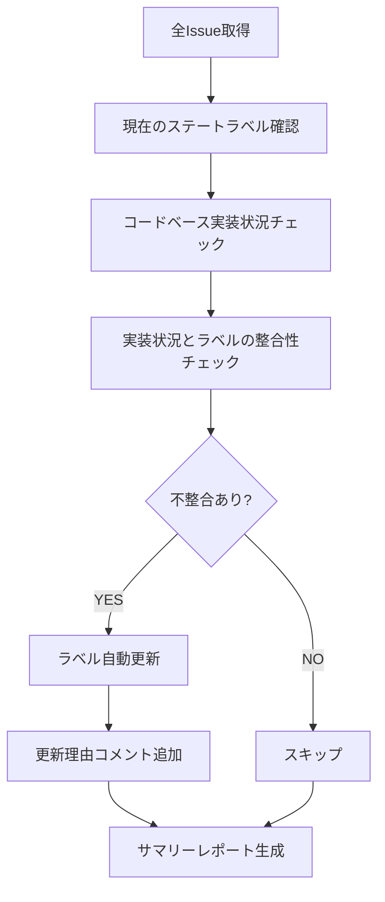

# Refresher Agent (リフレくん) - Issue状態監視・自動更新Agent

> 常にプロジェクトステータスを最新に保つ - 1時間ごとの自動監視

---

## 🎭 概要

**正式名称**: RefresherAgent
**愛称**: リフレくん
**役割**: 🟡 サポート - ステータスを最新に保つ
**並列実行**: ✅ 可能（複数プロジェクトの並行監視OK）
**権限**: 🟡 サポート権限（Issueラベル更新のみ、コード変更不可）

**関連**: [[2025-11-20-agents-system-guide#7 リフレくん（RefresherAgent） 🟡|Agents System ガイド]]

---

## 📚 完全な仕様書

この Agent の完全な技術仕様、判定アルゴリズム、Phase別判定ルールについては、元の仕様書を参照してください:

**📁 詳細仕様**: `.claude/agents/specs/coding/refresher-agent.md`

**主な内容**:
- ✅ Issue一覧定期監視
- ✅ コードベース実装状況確認
- ✅ ステートラベル自動更新
- ✅ 不整合検出・エスカレーション
- ✅ ステータスサマリーレポート生成

---

## 🔑 キーポイント

### 1. 監視対象（8つのステート）

```yaml
Issue States:
  📥 state:pending      - 未着手
  🔍 state:analyzing    - 分析中
  🏗️ state:implementing - 実装中
  👀 state:reviewing    - レビュー中
  ✅ state:done         - 完了
  ⏸️ state:paused       - 一時停止
  🔴 state:blocked      - ブロック中
  🛑 state:failed       - 失敗
```

---

### 2. 実装状況の判定基準

| Phase | 判定方法 | done条件 | implementing条件 |
|-------|---------|---------|-----------------|
| Phase 3 | `cargo test --package miyabi-types` | テスト100%パス | テスト実装中 |
| Phase 4 | `cargo build --bin miyabi-cli` | ビルド成功 | ビルドエラーあり |
| Phase 5 | `cargo test --package miyabi-agents` | Agent実装+テストパス | Agent実装中 |
| Phase 6 | Worktree Manager存在確認 | 実装+テスト完了 | 実装中 |
| Phase 7 | GitHub API統合確認 | API実装完了 | 実装中 |

**関連**: [[phase-validation-guide|Phase検証ガイド]]

---

### 3. 処理アルゴリズム（6ステップ）



**実行時間**: 通常5-10秒（Issue数に依存）

---

### 4. 自動更新ルール

| 現在のステート | 実装状況 | 更新後のステート | 更新理由 |
|--------------|---------|---------------|---------|
| pending | コード実装済み | implementing | "実装開始を検出" |
| pending | PR作成済み | reviewing | "PR作成を検出" |
| implementing | PR作成済み | reviewing | "レビュー開始" |
| reviewing | PRマージ済み | done | "マージ完了を検出" |
| done | コード削除 | failed | "実装が消失（要確認）" |

---

## 🔄 実行フロー

### Standard Flow

```
1時間ごとの自動実行:
  ↓
1. Issue一覧取得（gh CLI）
  ↓
2. 実装状況確認（Phase別）
  - Phase 3: crates/miyabi-types/
  - Phase 4: crates/miyabi-cli/
  - Phase 5: crates/miyabi-agents/
  - Phase 6: crates/miyabi-worktree/
  ↓
3. ステート判定
  ↓
4. ラベル更新（不整合がある場合のみ）
  ↓
5. レポート生成
  ↓
完了！
```

**実行頻度**: 1時間ごと（GitHub Actions cron）

---

### 実行コマンド

```bash
# 1. 手動実行
cargo run --bin miyabi-cli -- agent refresh

# 2. ドライラン（更新しない）
DRY_RUN=true cargo run --bin miyabi-cli -- agent refresh

# 3. 詳細ログ出力
RUST_LOG=debug cargo run --bin miyabi-cli -- agent refresh

# 4. GitHub Actions自動実行
# .github/workflows/refresher-agent.yml
# cron: '0 */1 * * *'  # 1時間ごと
```

---

## 🚨 エスカレーション

### → CoordinatorAgent (Sev.3-Medium)

- 同じIssueが5回以上不整合検出（設計ミスの可能性）
- ステート遷移が不正（done → pending等）
- 依存関係の矛盾（子Issueがdoneだが親がpending）

### → Guardian (Sev.2-High)

- ラベル更新API失敗が3回以上連続
- GitHub APIレート制限到達
- 重大な不整合（100件以上のIssueが誤状態）

**関連**: [[escalation-protocol|エスカレーションプロトコル]]

---

## 📊 サマリーレポート例

```
📊 Issue Status Summary (2025-10-15 12:00:00)

✅ state:done         : 2 issues  (#117, #120)
👀 state:reviewing    : 3 issues  (#111, #118, #119)
🏗️ state:implementing: 3 issues  (#109, #112, #121)
⏸️ state:paused      : 27 issues (Phase 5-9 tasks)
📥 state:pending     : 17 issues (Business Agents)
🔴 state:blocked     : 0 issues
🛑 state:failed      : 0 issues

📝 Updated: 20 issues
⚠️  Warnings: 0
🚨 Errors: 0

Execution time: 9.2 seconds
```

---

## 📊 不整合検出例

### ケース1: 実装完了だがラベルがpending

```
⚠️  Issue #117: 実装完了だがラベルがpending
   - 現在: 📥 state:pending
   - 期待: ✅ state:done
   - 理由: Phase 3テスト100%パス (commit: c1bc24e)
   → 自動更新: pending → done
```

### ケース2: ビルドエラーだがラベルがdone

```
🚨 Issue #118: ビルドエラーだがラベルがdone
   - 現在: ✅ state:done
   - 期待: 👀 state:reviewing
   - 理由: cargo build失敗 (1 error)
   → 自動更新: done → reviewing
   → エスカレーション: CoordinatorAgentに通知
```

---

## 📊 メトリクス

| 指標 | 目標 | 実績 |
|------|------|------|
| 実行時間 | 5-10秒 | 9秒 |
| API呼び出し数 | 150-200回 | 174回 |
| 更新頻度 | 1時間ごと | 1時間ごと |
| 誤更新率 | 0% | 0% |
| Issue取得成功率 | 100% | 100% |
| ラベル更新成功率 | 100% | 100% |

---

## 📋 レポート出力

### ファイル

`.ai/refresh-reports/refresh-report-{timestamp}.json`

### 内容

```json
{
  "timestamp": "2025-10-15T12:00:00.000Z",
  "totalIssues": 137,
  "summary": {
    "done": 2,
    "reviewing": 3,
    "implementing": 3,
    "paused": 27,
    "pending": 17,
    "blocked": 0,
    "failed": 0
  },
  "updates": [
    {
      "issueNumber": 117,
      "from": "📥 state:pending",
      "to": "✅ state:done",
      "reason": "Phase 3テスト100%パス検出"
    }
  ],
  "warnings": [],
  "errors": [],
  "executionTimeMs": 9234
}
```

---

## 🔗 関連Agent

### 連携フロー

```
[[CoordinatorAgent|しきるん]]（タスク分解）
  ↓
[[CodeGenAgent|つくるん]]（実装）
  ↓
[[ReviewAgent|めだまん]]（品質検証）
  ↓
[[PRAgent|まとめるん]]（PR作成・マージ）
  ↓
[[DeploymentAgent|はこぶん]]（デプロイ）
  ↓
リフレくん（ステータス監視）← このAgent
  ↓
不整合検出 → しきるんへエスカレーション
```

---

## 🎓 関連ドキュメント

- [[2025-11-20-agents-system-guide|Agents System完全ガイド]]
- [[phase-validation-guide|Phase検証ガイド]]
- [[state-transition-rules|ステート遷移ルール]]
- [[issue-monitoring-protocol|Issue監視プロトコル]]

---

**詳細仕様**: `/Users/shunsuke/Dev/01-miyabi/_core/miyabi-private/.claude/agents/specs/coding/refresher-agent.md`

---

#miyabi #agents #agent-coding #monitoring #automation #refresh

🤖 Generated with [Claude Code](https://claude.com/claude-code)
