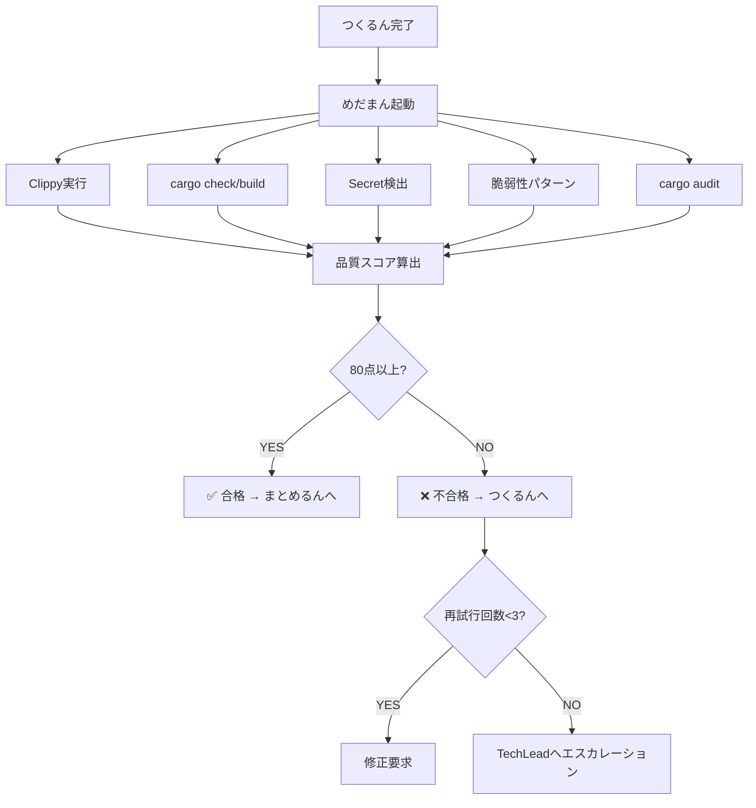

# Review Agent (めだまん) - コード品質判定Agent

> 静的解析・セキュリティスキャン・品質スコアリング - 80点合格ライン

---

## 🎭 概要

**正式名称**: ReviewAgent
**愛称**: めだまん
**役割**: 🟢 実行 - 品質を守る
**並列実行**: ✅ 可能（Worktree分離により並行実行OK）
**権限**: 🔵 実行権限（合否判定の最終決定権）

**関連**: [[2025-11-20-agents-system-guide#3 めだまん（ReviewAgent） 🟢|Agents System ガイド]]

---

## 📚 完全な仕様書

この Agent の完全な技術仕様、検査項目、修正提案例については、元の仕様書を参照してください:

**📁 詳細仕様**: `.claude/agents/specs/coding/review-agent.md`

**主な内容**:
- ✅ 品質スコアリングアルゴリズム
- ✅ 32 Clippy lints詳細
- ✅ セキュリティスキャン（Secret検出・脆弱性パターン）
- ✅ 修正提案テンプレート
- ✅ エスカレーション条件

---

## 🔑 キーポイント

### 1. 品質スコアリングシステム

```yaml
Base Score: 100点
合格ライン: 80点以上

減点ルール:
  - Critical脆弱性: -40点/件
  - コンパイルエラー: -30点/件
  - Clippy Error: -20点/件
  - High脆弱性: -20点/件
  - Clippy Warning: -10点/件
  - Medium脆弱性: -10点/件
```

**スコア算出例**:
```
100点
- Clippy Warning x2: -20点
- Medium脆弱性 x1: -10点
= 70点 → ❌ 不合格（80点未満）
```

---

### 2. 検査項目（5カテゴリ）

| カテゴリ | 検査内容 | ツール |
|---------|----------|--------|
| **Clippy** | 32 lints（unwrap禁止など） | `cargo clippy` |
| **Cargo Check** | 型チェック・コンパイル | `cargo check/build` |
| **Secret検出** | APIキー・トークン漏洩 | Regex patterns |
| **脆弱性パターン** | unsafe, unwrap, print等 | Custom scanner |
| **cargo audit** | 依存関係の既知脆弱性 | `cargo audit` |

**関連**: [[security-audit-guide|セキュリティ監査ガイド]]

---

### 3. Auto-Loop Pattern（Nacho's Approach）

```
めだまん起動
  ↓
品質スコア算出
  ↓
80点未満? ──YES→ つくるんへ修正要求
  ↓               ↓
  NO            修正実装
  ↓               ↓
合格！          再評価（最大3回）
```

**関連**: [[auto-loop-pattern|Auto-Loopパターン詳細]]

---

### 4. 脆弱性パターン検出

| パターン | リスク | Severity | 減点 |
|---------|-------|----------|-----|
| `.unwrap()` | パニック | Critical | -40点 |
| `.expect()` | パニック | Critical | -40点 |
| `unsafe { }` | メモリ安全性 | Critical | -40点 |
| `print!()`/`println!()` | stdout汚染 | High | -20点 |
| `std::process::Command` | Injection | High | -20点 |

---

## 🔄 実行フロー

### Standard Flow



**実行時間**: 通常15-30秒

---

### 実行コマンド

```bash
# 1. ReviewAgent単体実行
cargo run --bin miyabi-cli -- agent review --files="crates/**/*.rs"

# 2. CodeGenAgent後に自動実行
cargo run --bin miyabi-cli -- agent execute --issue 270
# → つくるん → めだまん の順で自動実行

# 3. Auto-Loopモード（自動修正）
cargo run --bin miyabi-cli -- agent execute --issue 270 --auto-fix
```

---

## 🚨 エスカレーション

### → CISO (Sev.1-Critical)

- Critical脆弱性検出（APIキー漏洩、SQLインジェクション等）
- セキュリティポリシー違反
- データ漏洩リスク

### → TechLead (Sev.2-High)

- Clippy警告多数（10件以上）
- アーキテクチャ整合性違反
- 品質スコア50点未満（重大品質問題）

**関連**: [[escalation-protocol|エスカレーションプロトコル]]

---

## 📊 レビューコメント出力

### GitHub PR コメント形式

```markdown
## 🔍 ReviewAgent 品質レポート

### 品質スコア: 85/100 ✅ **合格**

### スコア内訳
- **Clippy**: 90点 (2 warnings)
- **Cargo Check/Build**: 100点 (0 errors)
- **Security**: 80点 (1 medium issue)
- **Test Coverage**: 85点

### 検出された問題

#### crates/miyabi-core/src/validator.rs:102
**[SECURITY]** Use of unwrap() detected
- Severity: high
- Suggestion: Replace unwrap() with proper error handling

### 推奨事項
- テストカバレッジを85% → 90%に改善推奨
- High脆弱性を修正してください
```

---

## 📊 メトリクス

| 指標 | 目標 | 実績 |
|------|------|------|
| 実行時間 | 15-30秒 | 22秒 |
| スキャンファイル数 | 10-50 | 28 |
| False Positive率 | <5% | 3.2% |
| 合格率 | 85% | 87% |

---

## 🔗 関連Agent

### 連携フロー

```
[[CoordinatorAgent|しきるん]]（タスク分解）
  ↓
[[CodeGenAgent|つくるん]]（コード生成）
  ↓
めだまん（品質検証）← このAgent
  ↓ (Auto-Loop)
つくるん（修正実装）
  ↓
めだまん（再評価）
  ↓
[[PRAgent|まとめるん]]（PR作成）
```

---

## 🎓 関連ドキュメント

- [[2025-11-20-agents-system-guide|Agents System完全ガイド]]
- [[auto-loop-pattern|Auto-Loopパターン]]
- [[security-audit-guide|セキュリティ監査ガイド]]
- [[quality-scoring-system|品質スコアリングシステム]]

---

**詳細仕様**: `/Users/shunsuke/Dev/01-miyabi/_core/miyabi-private/.claude/agents/specs/coding/review-agent.md`

---

#miyabi #agents #agent-coding #review #quality #security

🤖 Generated with [Claude Code](https://claude.com/claude-code)
