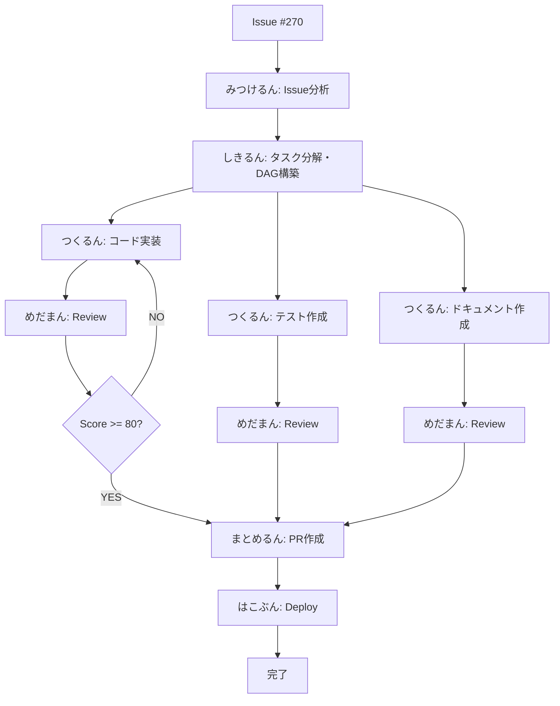
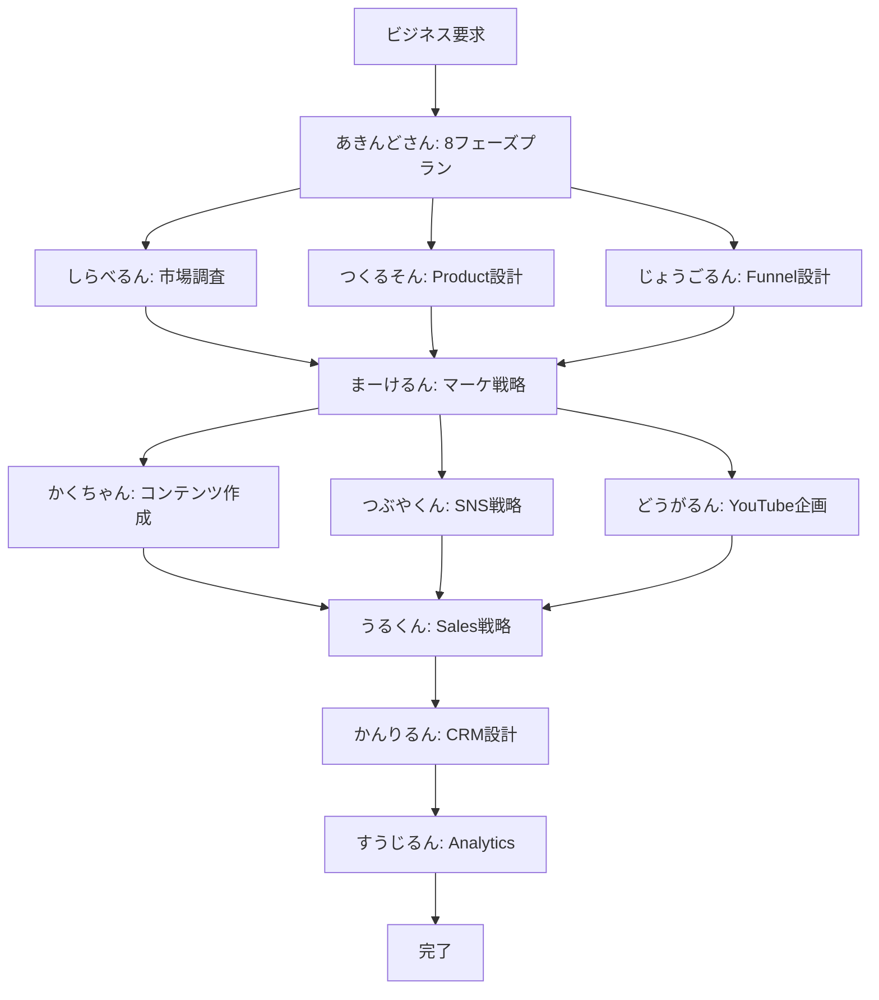

# Agents System - 21人の自律型チーム

> Coding 7人 + Business 14人 = 完全自律型開発・経営チーム

---

## 🎯 Agent Systemとは

**定義**: GitHub Issueを自動処理する、21個の自律型Agent

**特徴**:
- 🤖 **自律性**: 人間の介入なしでタスク完遂
- 🎭 **キャラクター化**: 親しみやすい名前（しきるん、つくるん、etc.）
- 🎨 **権限レベル**: 🔴リーダー / 🟢実行役 / 🔵分析役 / 🟡サポート役
- 🔄 **協調実行**: Worktreeによる並列処理
- 📊 **Auto-Loop**: ReviewAgentによる品質保証（80点以上まで自動改善）

---

## 🎭 キャラクター図鑑

### 色分けルール

| 色 | 意味 | キャラ数 | 並列実行 |
|---|------|---------|---------|
| 🔴 **リーダー** | 指示を出す、全体を見る | 2 | ❌ |
| 🟢 **実行役** | 実際に作業する、動く | 12 | ✅ |
| 🔵 **分析役** | 調べる、考える | 5 | ✅ |
| 🟡 **サポート役** | 手伝う、つなぐ | 3 | ⚠️ |

**関連**: [[agent-characters|Agent キャラクター詳細図鑑]]

---

## 🔧 Coding Agents（開発チーム - 7人）

### 1. しきるん（CoordinatorAgent） 🔴

**本名**: CoordinatorAgent
**権限**: リーダー
**並列**: ❌ 逐次のみ

**できること**:
- Issueを小さなタスクに分解
- DAG（依存関係グラフ）構築
- 他Agentへのタスク割り当て
- 進捗管理

**実行フロー**:
```
Issue #270 受領
  ↓
タスク分解:
  - Task 1: コード実装（つくるん）
  - Task 2: テスト作成（めだまん）
  - Task 3: デプロイ準備（はこぶん）
  ↓
DAG構築: Task1 → Task2 → Task3
  ↓
Worktree作成 × 3
  ↓
並列実行開始
```

**エスカレーション**:
- アーキテクチャ問題 → Tech Lead
- リソース不足 → Project Manager

**関連**: [[coordinator-agent-spec|しきるん仕様書]]

---

### 2. つくるん（CodeGenAgent） 🟢

**本名**: CodeGenAgent
**権限**: 実行役
**並列**: ✅ OK

**できること**:
- Claude Sonnet 4によるコード生成
- Rust 2021 Edition準拠
- ユニットテスト自動生成
- ドキュメントコメント生成

**実行フロー**:
```
Task受領（例: "ユーザー認証機能実装"）
  ↓
要件分析（5分）
  ↓
コード設計（10分）
  ↓
実装（30分）:
  - src/auth.rs
  - tests/auth_test.rs
  ↓
Self-review（5分）
  ↓
完了報告
```

**品質基準**:
- Clippy: 0 warnings
- Tests: All pass
- Documentation: 全public APIにコメント

**関連**: [[codegen-agent-spec|つくるん仕様書]]

---

### 3. めだまん（ReviewAgent） 🟢

**本名**: ReviewAgent
**権限**: 実行役
**並列**: ✅ OK

**できること**:
- コード品質スコアリング（100点満点）
- 静的解析（clippy）
- セキュリティスキャン（cargo-audit）
- **Auto-Loop**: 80点未満なら自動改善要求

**実行フロー**:
```
コード受領
  ↓
並列実行:
  - Clippy（40点）
  - Cargo check（30点）
  - Cargo audit（30点）
  ↓
スコア計算
  ↓
80点以上？
  ├─ YES → quality:good Label付与 → 完了
  └─ NO → /review --auto-fix → つくるんへ改善要求
```

**Auto-Loop Pattern（Nacho's Approach）**:
```
つくるん → めだまん → スコア < 80?
                ↓
              YES（最大3回）
                ↓
        /review --auto-fix
                ↓
            つくるん（修正実装）
                ↓
            めだまん（再評価）
```

**関連**: [[review-agent-spec|めだまん仕様書]], [[auto-loop-pattern|Auto-Loopパターン]]

---

### 4. みつけるん（IssueAgent） 🔵

**本名**: IssueAgent
**権限**: 分析役
**並列**: ✅ OK

**できること**:
- Issue内容分析
- 57ラベル体系からAI推論
- TYPE/PRIORITY/SEVERITY自動判定
- エスカレーション推奨

**実行フロー**:
```
Issue #270 受領
  ↓
内容分析:
  - タイトル: "Add user authentication"
  - 本文: "Implement JWT-based auth..."
  ↓
Label推論:
  - TYPE: feature
  - PRIORITY: p1
  - AGENT: codegen
  - PHASE: implementation
  ↓
Label付与
  ↓
しきるん へ引き継ぎ
```

**Label Categories（11）**:
1. STATE（8）
2. AGENT（6）
3. PRIORITY（4）
4. TYPE（7）
5. SEVERITY（4）
6. PHASE（5）
7. SPECIAL（7）
8. TRIGGER（4）
9. QUALITY（4）
10. COMMUNITY（4）
11. HIERARCHY（4）

**関連**: [[issue-agent-spec|みつけるん仕様書]], [[label-system-guide|57ラベル体系]]

---

### 5. まとめるん（PRAgent） 🟡

**本名**: PRAgent
**権限**: サポート役
**並列**: ⚠️ 条件付き

**できること**:
- Pull Request自動作成
- PR説明生成（Summary/Changes/Test Plan）
- Quality Report添付
- Conventional Commits準拠

**実行フロー**:
```
Worktree完了通知受領
  ↓
変更内容分析:
  - Git diff集計
  - Commit履歴解析
  ↓
PR説明生成:
  ## Summary
  - 3-5 bullet points

  ## Changes
  - ファイル別変更サマリ

  ## Test Plan
  - テスト手順チェックリスト

  ## Quality Report
  - Clippy: ✅
  - Tests: ✅
  - Coverage: 85%
  ↓
PR作成（Draft）
  ↓
完了報告
```

**関連**: [[pr-agent-spec|まとめるん仕様書]]

---

### 6. はこぶん（DeploymentAgent） 🟢

**本名**: DeploymentAgent
**権限**: 実行役
**並列**: ✅ OK

**できること**:
- CI/CD自動デプロイ
- Firebase/Cloud Run対応
- ヘルスチェック
- 自動Rollback（失敗時）

**実行フロー**:
```
PR Merge通知受領
  ↓
デプロイ準備:
  - Environment変数確認
  - Secrets確認
  ↓
デプロイ実行:
  firebase deploy --only hosting
  ↓
ヘルスチェック（5分間）:
  - HTTP 200 OK?
  - Error rate < 1%?
  ↓
成功？
  ├─ YES → state:deployed Label付与
  └─ NO → Rollback実行 → エスカレーション
```

**関連**: [[deployment-agent-spec|はこぶん仕様書]]

---

### 7. リフレッシュさん（RefresherAgent） 🟡

**本名**: RefresherAgent
**権限**: サポート役
**並列**: ⚠️ 条件付き

**できること**:
- Issue状態監視
- ステータス自動更新
- Stale Issue検出
- 定期リマインダー

**実行条件**:
- 毎日 00:00 UTC
- Issue更新後24時間経過
- state:stale Label付与時

**関連**: [[refresher-agent-spec|リフレッシュさん仕様書]]

---

## 💼 Business Agents（ビジネスチーム - 14人）

### 🎯 戦略・企画系（6人）

#### 1. あきんどさん（AIEntrepreneurAgent） 🔴

**権限**: リーダー
**並列**: ❌ 逐次のみ

**できること**:
- 8フェーズビジネスプラン作成
- TAM/SAM/SOM計算
- 収益モデル設計
- 資金調達戦略

**8 Phases**:
1. 市場分析
2. 競合分析
3. 顧客分析
4. 価値提案
5. 収益モデル
6. マーケティング戦略
7. チーム構成
8. 資金調達

**関連**: [[8-phase-business-plan|8フェーズビジネスプラン詳細]]

---

#### 2. つくるそん（ProductConceptAgent） 🟢

**できること**:
- MVP設計
- プロダクトロードマップ作成
- 技術スタック選定
- 6ヶ月開発計画

---

#### 3. でざいなー（ProductDesignAgent） 🟢

**できること**:
- UI/UX設計
- デザインシステム構築
- ワイヤーフレーム作成
- ユーザビリティテスト計画

---

#### 4. じょうごるん（FunnelDesignAgent） 🟢

**できること**:
- カスタマージャーニー設計
- ファネル最適化
- LTV最大化戦略
- コンバージョン率改善

**関連**: [[sales-funnel-optimization|Sales Funnel最適化]]

---

#### 5. ぺるそん（PersonaAgent） 🔵

**できること**:
- ペルソナ作成（3-5人）
- ユーザーインタビュー計画
- Empathy Map作成
- Jobs-to-be-Done分析

---

#### 6. じぶんるん（SelfAnalysisAgent） 🔵

**できること**:
- SWOT分析
- キャリアプランニング
- スキルギャップ分析
- 強み・弱み可視化

---

### 📢 マーケティング系（5人）

#### 7. しらべるん（MarketResearchAgent） 🔵

**できること**:
- 市場調査（TAM/SAM/SOM）
- 競合分析（20+ companies）
- トレンド分析（5大トレンド）
- Customer needs assessment

**関連**: [[market-analysis-framework|市場分析フレームワーク]]

---

#### 8. まーけるん（MarketingAgent） 🟢

**できること**:
- マーケティング施策立案
- 広告戦略設計
- SEO最適化
- プレスリリース作成

---

#### 9. かくちゃん（ContentCreationAgent） 🟢

**できること**:
- ブログ記事生成
- SNS投稿作成
- プレスリリース作成
- ホワイトペーパー執筆

---

#### 10. つぶやくん（SNSStrategyAgent） 🟢

**できること**:
- SNS投稿計画（Twitter/LinkedIn/Instagram）
- エンゲージメント最適化
- ハッシュタグ戦略
- インフルエンサー連携

---

#### 11. どうがるん（YouTubeAgent） 🟢

**できること**:
- 動画企画（13 workflows）
- 台本作成
- サムネイル設計
- SEO最適化

**13 Workflows**:
1. チャンネルコンセプト設計
2. ターゲットオーディエンス分析
3. コンテンツカレンダー作成
4. 動画企画立案
5. 台本作成
6. 撮影計画
7. 編集ガイドライン
8. サムネイル設計
9. タイトル最適化
10. SEO最適化
11. 公開スケジュール
12. アナリティクス分析
13. 改善サイクル

---

### 💼 営業・顧客管理系（3人）

#### 12. うるくん（SalesAgent） 🟢

**できること**:
- 営業戦略立案
- リード管理
- BANT qualification
- セールスプレイブック作成

---

#### 13. かんりるん（CRMAgent） 🟢

**できること**:
- 顧客データ管理
- Customer health scoring（0-100点）
- Churn prediction
- Win-back campaign設計

---

#### 14. すうじるん（AnalyticsAgent） 🔵

**できること**:
- KPIダッシュボード設計（20+ metrics）
- Cohort分析
- A/B testing framework
- PDCA cycle実行

**関連**: [[kpi-dashboard-design|KPIダッシュボード設計]]

---

## 🔄 Agent協調実行フロー

### Coding Agent実行フロー



---

### Business Agent実行フロー



---

## 🎯 Auto-Loop Pattern（Nacho's Approach）

**概要**: ReviewAgent(/review)による自動品質改善ループ

```
Step 1: つくるん（CodeGen）
  ↓
Step 2: めだまん（Review）→ スコアリング（100点満点）
  ↓
Step 3: スコア < 80点?
  ├─ YES → /review --auto-fix → Step 1へ（最大3回）
  └─ NO → quality:good Label付与 → 完了
```

**実装詳細**:
- ReviewAgent: `crates/miyabi-agents/src/review.rs`
- /review Command: `.claude/commands/review.md`
- Test Suite: `crates/miyabi-agents/src/review.rs #[cfg(test)]`

**成功条件**:
- Clippy: 0 warnings, 0 errors
- Tests: All pass
- Quality Score: 80点以上

**エスカレーション条件**:
- Critical Security Issues
- 3回の反復でも80点未達
- ビルド/実行エラー

**関連**: [[auto-loop-pattern|Auto-Loop Pattern詳細]]

---

## 📊 Agent統計

### カテゴリ別分布

| カテゴリ | Agents数 | 用途 |
|---------|---------|------|
| **Coding** | 7 | 開発・運用自動化 |
| **Business Strategy** | 6 | 戦略・企画 |
| **Marketing** | 5 | マーケティング |
| **Sales/CRM** | 3 | 営業・顧客管理 |

### 権限レベル分布

| レベル | Agents数 | 並列実行 |
|--------|---------|---------|
| 🔴 リーダー | 2 | ❌ |
| 🟢 実行役 | 12 | ✅ |
| 🔵 分析役 | 5 | ✅ |
| 🟡 サポート役 | 3 | ⚠️ |

---

## 🔗 関連ドキュメント

### System Overview

- [[2025-11-20-claude-directory-index|.claude/ ディレクトリ全体像]]
- [[miyabi-architecture|Miyabiアーキテクチャ]]
- [[worktree-parallel-execution|Worktree並列実行]]

### Agent Specifications

- [[coordinator-agent-spec|CoordinatorAgent仕様]]
- [[codegen-agent-spec|CodeGenAgent仕様]]
- [[review-agent-spec|ReviewAgent仕様]]
- [[deployment-agent-spec|DeploymentAgent仕様]]

### Protocols

- [[agent-coordination-protocol|Agent協調プロトコル]]
- [[auto-loop-pattern|Auto-Loopパターン]]
- [[escalation-protocol|エスカレーションプロトコル]]

### Business Agents

- [[8-phase-business-plan|8フェーズビジネスプラン]]
- [[market-analysis-framework|市場分析フレームワーク]]
- [[sales-funnel-optimization|Sales Funnel最適化]]

---

**作成日**: 2025-11-20
**最終更新**: 2025-11-20
**バージョン**: 1.0.0
**ステータス**: ✅ Published

#miyabi #agents #autonomous #team #collaboration

---

🤖 Generated with [Claude Code](https://claude.com/claude-code)
Co-Authored-By: Claude <noreply@anthropic.com>
