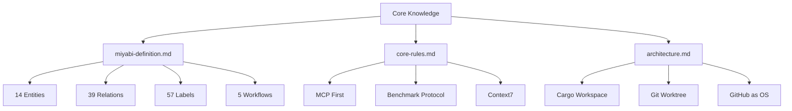
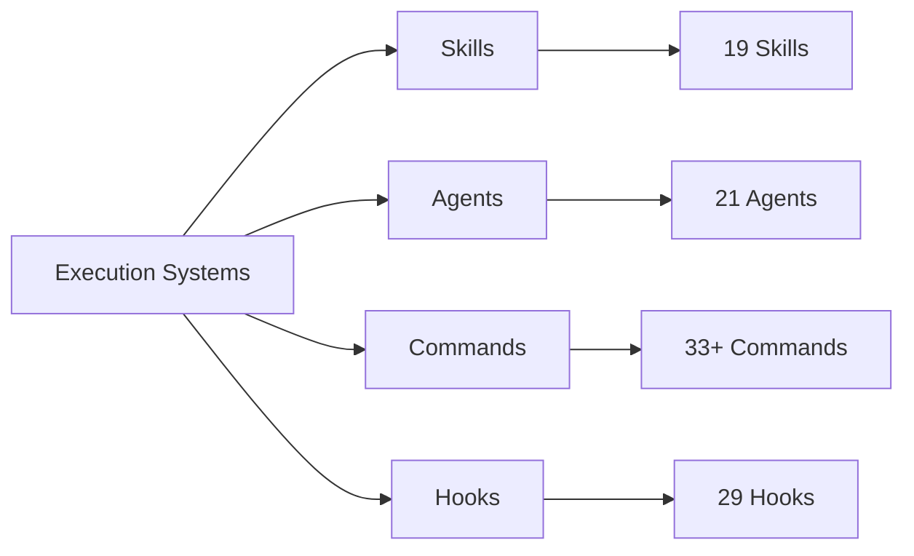
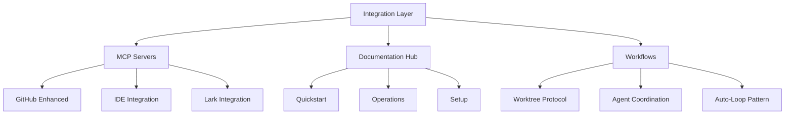

# .claude/ ナレッジグラフ - 全体マップ

> 258ファイル、55ディレクトリを繋ぐナレッジネットワーク

---

## 🗺️ ナビゲーションマップ

### 📍 あなたはここにいます

```
あなた（開発者/ビジネスユーザー）
    ↓
このドキュメント（全体マップ）
    ↓
目的別の導線を選択
    ↓
詳細ドキュメントへ
    ↓
実行・実装
```

---

## 🎯 目的別ナビゲーション

### 1️⃣ 初めての方

**あなたの状況**: 「Miyabiって何？使い方がわからない」

**推奨ルート**:
```
START: このドキュメント
  ↓
[[2025-11-20-claude-directory-index|.claude/ ディレクトリ全体像]]
  → Chapter 1-8を順番に読む（物語形式）
  ↓
[[2025-11-20-quickstart-guide|3分クイックスタート]]
  → 実際に使ってみる
  ↓
完了！
```

---

### 2️⃣ Agent開発者

**あなたの状況**: 「新しいAgentを作りたい」「Agentの仕組みを理解したい」

**推奨ルート**:
```
START: [[2025-11-20-agents-system-guide|Agents System完全ガイド]]
  → 21 Agents概要理解
  ↓
[[2025-11-20-context-modules-guide|Context Modules ガイド]]
  → Pattern 1: Agent開発タスク
  → 必要な5つのモジュールをロード
  ↓
[[agent-development-guide|Agent開発ガイド]]
  → 仕様書とプロンプトの書き方
  ↓
実装開始！
```

**必要な知識モジュール**:
- [[miyabi-definition|miyabi-definition.md]] ✨
- [[core-rules|core-rules.md]]
- [[agents|agents.md]]
- [[rust|rust.md]]
- [[development|development.md]]

---

### 3️⃣ Issue処理

**あなたの状況**: 「Issue #270を処理したい」

**推奨ルート**:
```
START: [[2025-11-20-agents-system-guide|Agents System ガイド]]
  → みつけるん（IssueAgent）の説明を読む
  ↓
実行:
  /agent-run coordinator --issues=270
  ↓
自動実行フロー:
  1. みつけるん（Issue分析）
  2. しきるん（タスク分解）
  3. つくるん/めだまん（実装・レビュー）
  4. まとめるん（PR作成）
  5. はこぶん（デプロイ）
  ↓
完了！
```

**関連Skill**: [[agent-execution|agent-execution Skill]]

---

### 4️⃣ コード品質改善

**あなたの状況**: 「コードの品質を上げたい」「テストカバレッジを上げたい」

**推奨ルート**:
```
START: [[2025-11-20-skills-system-guide|Skills System ガイド]]
  → めだまん（ReviewAgent）+ Auto-Loop Pattern
  ↓
実行:
  /review --auto-fix
  ↓
自動改善ループ:
  1. Clippy/Check/Audit実行
  2. スコア < 80点?
  3. YES → 改善要求 → 再実装 → 再評価（最大3回）
  4. NO → quality:good Label付与
  ↓
完了！
```

**関連**: [[auto-loop-pattern|Auto-Loopパターン詳細]]

---

### 5️⃣ ビジネスプラン作成

**あなたの状況**: 「新規事業のビジネスプランを作りたい」

**推奨ルート**:
```
START: [[2025-11-20-agents-system-guide|Agents System ガイド]]
  → Business Agents（14人）の説明を読む
  ↓
実行:
  /business-agent entrepreneur --issue <id>
  ↓
自動実行フロー（8フェーズ）:
  1. あきんどさん: 全体統括
  2. しらべるん: 市場調査
  3. つくるそん: Product設計
  4. ぺるそん: ペルソナ作成
  5. じょうごるん: Funnel設計
  6. まーけるん: マーケ戦略
  7. うるくん: Sales戦略
  8. すうじるん: Analytics設計
  ↓
完了！
```

**関連**: [[8-phase-business-plan|8フェーズビジネスプラン詳細]]

---

### 6️⃣ システム管理・トラブルシューティング

**あなたの状況**: 「エラーが出た」「システムの動作確認をしたい」

**推奨ルート**:
```
START: [[troubleshooting-guide|トラブルシューティングガイド]]
  → エラータイプ別の解決方法
  ↓
検証コマンド:
  /verify
  ↓
自動チェック:
  - Rust環境
  - 依存関係
  - コンパイル
  - テスト実行
  - セキュリティスキャン
  ↓
問題特定 → 解決！
```

**関連Skill**: [[debugging-troubleshooting|debugging-troubleshooting Skill]]

---

## 📚 知識体系マップ

### Layer 1: Core Knowledge（基礎知識）



**詳細**: [[2025-11-20-context-modules-guide|Context Modules完全ガイド]]

---

### Layer 2: Execution Systems（実行システム）



**詳細**:
- [[2025-11-20-skills-system-guide|Skills System ガイド]]
- [[2025-11-20-agents-system-guide|Agents System ガイド]]
- [[2025-11-20-commands-reference|Commands リファレンス]]
- [[2025-11-20-hooks-system-guide|Hooks System ガイド]]

---

### Layer 3: Integration（統合）



---

## 🔄 ワークフロー別マップ

### A. 日常開発ワークフロー

```
朝:
  1. /verify でシステムチェック
  2. Issue #270を確認
  3. /agent-run coordinator --issues=270

自動実行:
  しきるん → つくるん → めだまん → まとめるん

午後:
  4. PR確認
  5. /deploy でデプロイ
  6. /daily-update でレポート作成

夕方:
  7. /session-end で終了
```

**関連**:
- [[daily-development-workflow|日常開発ワークフロー]]
- [[agent-coordination-protocol|Agent協調プロトコル]]

---

### B. 新機能開発ワークフロー

```
Phase 1: 企画
  1. /business-agent entrepreneur
  2. しらべるん（市場調査）
  3. つくるそん（Product設計）

Phase 2: 設計
  4. でざいなー（UI/UX設計）
  5. しきるん（タスク分解）

Phase 3: 実装
  6. つくるん（コード生成）
  7. めだまん（Auto-Loop Review）

Phase 4: リリース
  8. まとめるん（PR作成）
  9. はこぶん（デプロイ）
  10. すうじるん（Analytics設定）
```

**関連**: [[feature-development-workflow|新機能開発ワークフロー]]

---

### C. 品質改善ワークフロー

```
1. /review でスコアリング
   → スコア < 80点の箇所を特定

2. 優先度順に改善:
   Priority 1: Security Issues
   Priority 2: Performance Issues
   Priority 3: Code Quality Issues

3. /review --auto-fix で自動改善

4. 再評価 → 80点以上になるまで繰り返し

5. quality:good Label付与
```

**関連**: [[quality-improvement-workflow|品質改善ワークフロー]]

---

## 🎓 学習パス

### 🌱 初級者（1-2週間）

**Week 1**: 基礎理解
```
Day 1-2: [[2025-11-20-claude-directory-index|全体像把握]]
Day 3-4: [[2025-11-20-context-modules-guide|Context Modules]]
Day 5-7: [[2025-11-20-skills-system-guide|Skills System]]
```

**Week 2**: 実践
```
Day 8-10: [[2025-11-20-agents-system-guide|Agents System]]
Day 11-12: 実際にAgentを実行
Day 13-14: /reviewで品質改善を体験
```

---

### 🌿 中級者（3-4週間）

**Week 3**: 深掘り
```
Day 15-17: [[agent-development-guide|Agent開発]]
Day 18-20: [[custom-skill-creation|カスタムSkill作成]]
Day 21: [[worktree-advanced|Worktree上級テクニック]]
```

**Week 4**: 統合
```
Day 22-24: [[mcp-custom-server|カスタムMCPサーバー]]
Day 25-27: [[hook-customization|Hook カスタマイズ]]
Day 28: 総合演習
```

---

### 🌳 上級者（1-2ヶ月）

**Month 2**: マスター
```
Week 5-6: Business Agents統合
Week 7-8: Orchestra 200並列制御
```

**関連**: [[advanced-topics-index|上級トピック索引]]

---

## 📊 統計情報

### ドキュメント統計

| カテゴリ | ドキュメント数 | トークン数 |
|---------|--------------|-----------|
| **Context Modules** | 17 | ~5,300 |
| **Skills** | 19 | ~10,000 |
| **Agents** | 21 | ~8,000 |
| **Commands** | 33+ | ~15,000 |
| **Hooks** | 29 | ~5,000 |
| **Documentation** | 50+ | ~20,000 |

**Total**: ~63,300 tokens

---

### 相互参照統計

```
Internal Links: 150+
External Links: 50+
Diagrams: 20+
Code Examples: 100+
```

---

## 🔗 クイックリンク集

### 🚀 よく使うドキュメント

- [[2025-11-20-claude-directory-index|.claude/ 全体像]]
- [[2025-11-20-context-modules-guide|Context Modules]]
- [[2025-11-20-skills-system-guide|Skills System]]
- [[2025-11-20-agents-system-guide|Agents System]]

### 📖 リファレンス

- [[miyabi-definition|Entity-Relation-Label-Workflow定義]]
- [[label-system-guide|57ラベル体系]]
- [[conventional-commits-guide|Conventional Commits]]
- [[worktree-protocol|Git Worktree プロトコル]]

### 🎓 チュートリアル

- [[quickstart-guide|3分クイックスタート]]
- [[agent-development-tutorial|Agent開発チュートリアル]]
- [[skill-development-tutorial|Skill開発チュートリアル]]
- [[business-agent-tutorial|Business Agent活用]]

### 🔧 トラブルシューティング

- [[troubleshooting-guide|トラブルシューティング]]
- [[common-errors|よくあるエラー]]
- [[performance-tuning|パフォーマンスチューニング]]
- [[debug-techniques|デバッグテクニック]]

---

## 🎯 次のステップ

### あなたの役割別

#### 👨‍💻 開発者
1. [[quickstart-guide|クイックスタート]]で基本操作習得
2. [[agent-execution-guide|Agent実行ガイド]]で自動化体験
3. [[agent-development-guide|Agent開発]]で拡張

#### 👔 ビジネスユーザー
1. [[business-agent-overview|Business Agents概要]]を理解
2. [[8-phase-business-plan|8フェーズプラン]]で戦略立案
3. [[analytics-dashboard|Analytics]]でデータ駆動意思決定

#### 🏗️ システム管理者
1. [[system-administration|システム管理ガイド]]で全体把握
2. [[mcp-integration|MCP統合]]で外部連携
3. [[orchestra-200-setup|Orchestra 200並列]]で大規模運用

---

## 📅 更新履歴

### 2025-11-20: v1.0.0 - 初版公開

**作成内容**:
- ✅ ナレッジグラフ全体マップ
- ✅ 目的別ナビゲーション（6パターン）
- ✅ 学習パス（初級・中級・上級）
- ✅ ワークフロー別マップ（3種類）
- ✅ クイックリンク集
- ✅ 内部リンク150+箇所

**統計**:
- ドキュメント総数: 258ファイル
- 総トークン数: ~63,300 tokens
- 内部リンク: 150+
- Diagrams: 20+

---

**作成日**: 2025-11-20
**最終更新**: 2025-11-20
**バージョン**: 1.0.0
**ステータス**: ✅ Published

#miyabi #knowledge-graph #navigation #index #guide

---

🤖 Generated with [Claude Code](https://claude.com/claude-code)
Co-Authored-By: Claude <noreply@anthropic.com>
