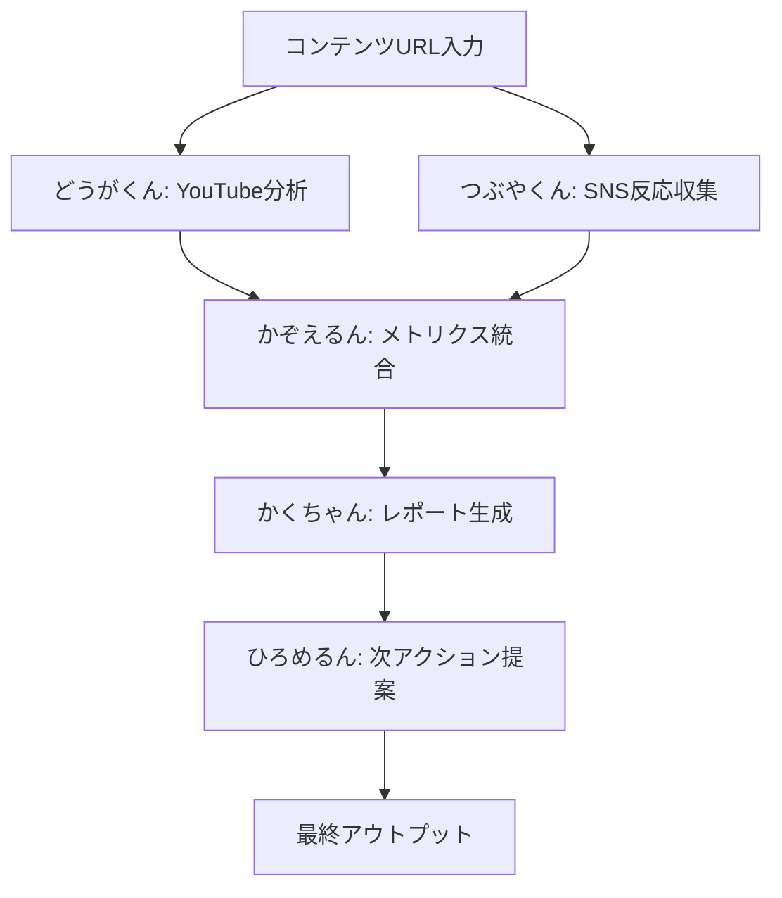

# Miyabi Content Society - コンテンツソサエティー

## 概要
コンテンツのソーシャルシェア分析・反応まとめ・拡散戦略を専門とするエージェント集団。

## ミッション
「コンテンツの社会的インパクトを可視化し、次の一手を導く」

## 所属エージェント

### 1. 📊 かぞえるん (Analytics Agent)
- **役割**: 定量メトリクス収集・分析
- **担当**: Views, Likes, Reposts, Quotes, センチメント比率
- **出力**: ダッシュボード形式レポート

### 2. 🐦 つぶやくん (SNS Strategy Agent)
- **役割**: X/Twitter反応分析・トレンド把握
- **担当**: ポスト収集、インフルエンサー特定、拡散パターン分析
- **出力**: 口コミマップ、影響力ランキング

### 3. 🎬 どうがくん (YouTube Agent)
- **役割**: YouTube特化分析
- **担当**: 視聴回数推移、コメント分析、急上昇ランク追跡
- **出力**: 動画パフォーマンスレポート

### 4. ✍️ かくちゃん (Content Creation Agent)
- **役割**: 分析結果のコンテンツ化
- **担当**: レポート作成、サマリー生成、シェア用投稿作成
- **出力**: Markdown/HTML形式レポート

### 5. 📣 ひろめるん (Marketing Agent)
- **役割**: 拡散戦略立案
- **担当**: 次アクション提案、ターゲティング戦略
- **出力**: アクションプラン

## ワークフロー

## エージェント連携プロトコル

| Phase | エージェント | Input | Output |
|-------|-------------|-------|--------|
| 1 | どうがくん | YouTube URL | 動画メトリクス |
| 2 | つぶやくん | コンテンツキーワード | SNS口コミ一覧 |
| 3 | かぞえるん | メトリクス群 | 統合ダッシュボード |
| 4 | かくちゃん | 分析結果 | レポートドキュメント |
| 5 | ひろめるん | レポート | アクションプラン |

## 関連リンク
- [[agents/AnalyticsAgent]]
- [[agents/SNSStrategyAgent]]
- [[agents/YouTubeAgent]]
- [[agents/ContentCreationAgent]]
- [[agents/MarketingAgent]]
