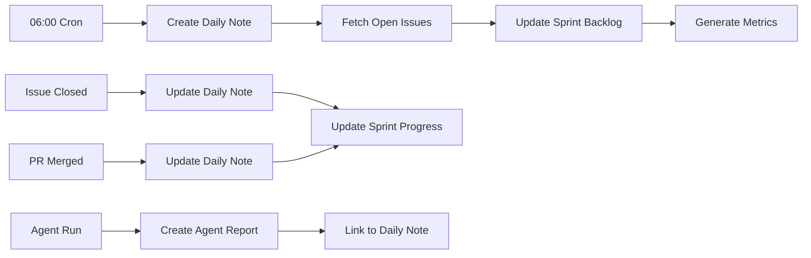
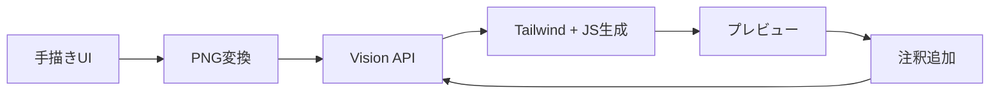
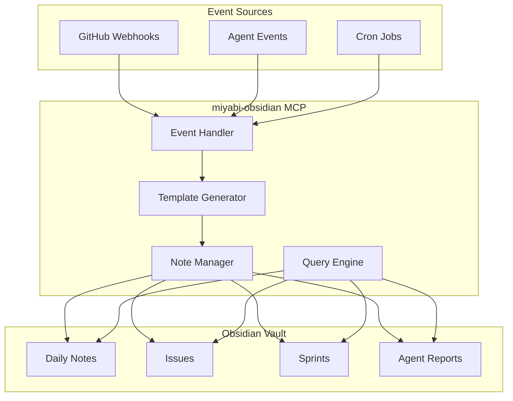

# Miyabi Obsidian Enhancement - Detailed Design

**Version**: 1.0.0
**Target**: docs/obsidian-vault/
**Implementation Time**: 4-6 hours

---

## 1. Executive Summary

### 1.1 Goals
- 57ラベル体系とObsidianタグの完全同期
- 自動化されたドキュメント生成パイプライン
- スプリント管理のデイリーノート統合
- MCP経由の完全自動化

### 1.2 Current State
- **Total Documents**: 136 (entities, agents, relations, workflows, labels)
- **Tag System**: Basic (#entity, #agent, etc.)
- **Templates**: None
- **Daily Notes**: None
- **MCP Integration**: Partial (miyabi-obsidian)

### 1.3 Target State
- **Tag System**: 階層化 (11カテゴリ × 57ラベル完全マッピング)
- **Templates**: 8種類 (Issue, PR, Daily, Sprint, Agent, Meeting, Decision, Retrospective)
- **Daily Notes**: スプリント統合 + 自動生成
- **MCP Integration**: 完全自動化 (Issue→Note自動生成)

---

## 2. Tag Hierarchy System

### 2.1 Design Principles
- GitHub 57ラベル体系と1:1マッピング
- 階層構造で検索性向上
- グラフビューでの可視化最適化

### 2.2 Tag Mapping (11 Categories → 57 Labels)

#### Category 1: Priority (5 labels)
```yaml
priority:
  - "#priority/P0"     # Critical - 即座対応
  - "#priority/P1"     # High - 24時間以内
  - "#priority/P2"     # Medium - 今週中
  - "#priority/P3"     # Low - 今月中
  - "#priority/P4"     # Trivial - いつか
```

#### Category 2: Type (8 labels)
```yaml
type:
  - "#type/feature"        # 新機能
  - "#type/bug"            # バグ修正
  - "#type/refactor"       # リファクタリング
  - "#type/docs"           # ドキュメント
  - "#type/test"           # テスト
  - "#type/chore"          # 雑務
  - "#type/security"       # セキュリティ
  - "#type/performance"    # パフォーマンス
```

#### Category 3: Status (6 labels)
```yaml
status:
  - "#status/backlog"      # バックログ
  - "#status/ready"        # 着手可能
  - "#status/in-progress"  # 作業中
  - "#status/review"       # レビュー中
  - "#status/blocked"      # ブロック中
  - "#status/done"         # 完了
```

#### Category 4: Phase (6 labels)
```yaml
phase:
  - "#phase/analysis"      # 分析
  - "#phase/design"        # 設計
  - "#phase/implementation"# 実装
  - "#phase/testing"       # テスト
  - "#phase/review"        # レビュー
  - "#phase/deployment"    # デプロイ
```

#### Category 5: Size (5 labels)
```yaml
size:
  - "#size/XS"   # ~1h
  - "#size/S"    # 1-4h
  - "#size/M"    # 4-8h
  - "#size/L"    # 1-3d
  - "#size/XL"   # 3d+
```

#### Category 6: Agent (7 Coding + 14 Business = 21 labels)
```yaml
agent/coding:
  - "#agent/CoordinatorAgent"
  - "#agent/CodeGenAgent"
  - "#agent/ReviewAgent"
  - "#agent/IssueAgent"
  - "#agent/PRAgent"
  - "#agent/DeploymentAgent"
  - "#agent/RefresherAgent"

agent/business:
  - "#agent/AIEntrepreneurAgent"
  - "#agent/SelfAnalysisAgent"
  - "#agent/MarketResearchAgent"
  - "#agent/PersonaAgent"
  - "#agent/ProductConceptAgent"
  - "#agent/ProductDesignAgent"
  - "#agent/ContentCreationAgent"
  - "#agent/FunnelDesignAgent"
  - "#agent/SNSStrategyAgent"
  - "#agent/MarketingAgent"
  - "#agent/SalesAgent"
  - "#agent/CRMAgent"
  - "#agent/AnalyticsAgent"
  - "#agent/YouTubeAgent"
```

#### Category 7: Component (4 labels)
```yaml
component:
  - "#component/core"      # miyabi-core
  - "#component/cli"       # miyabi-cli
  - "#component/web-api"   # miyabi-web-api
  - "#component/agents"    # miyabi-agent-*
```

#### Category 8: Area (3 labels)
```yaml
area:
  - "#area/frontend"
  - "#area/backend"
  - "#area/infrastructure"
```

#### Category 9: Integration (3 labels)
```yaml
integration:
  - "#integration/github"
  - "#integration/discord"
  - "#integration/lark"
```

### 2.3 Tag Combination Examples

```markdown
<!-- Issue #978: Console統合 -->
---
tags:
  - "#priority/P1"
  - "#type/feature"
  - "#status/in-progress"
  - "#phase/implementation"
  - "#size/L"
  - "#agent/CodeGenAgent"
  - "#component/web-api"
  - "#area/frontend"
---
```

### 2.4 Graph View Color Configuration

```json
// .obsidian/graph.json
{
  "colorGroups": [
    {"query": "tag:#priority/P0", "color": {"a": 1, "rgb": 16711680}},  // Red
    {"query": "tag:#priority/P1", "color": {"a": 1, "rgb": 16744448}},  // Orange
    {"query": "tag:#type/feature", "color": {"a": 1, "rgb": 65280}},    // Green
    {"query": "tag:#type/bug", "color": {"a": 1, "rgb": 16711680}},     // Red
    {"query": "tag:#agent", "color": {"a": 1, "rgb": 255}},             // Blue
    {"query": "tag:#status/done", "color": {"a": 1, "rgb": 8421504}}    // Gray
  ]
}
```

---

## 3. Template System

### 3.1 Template Directory Structure

```
docs/obsidian-vault/templates/
├── issue.md              # GitHub Issue連携
├── pr.md                 # Pull Request
├── daily.md              # デイリーノート
├── sprint.md             # スプリント計画
├── agent-report.md       # Agent実行レポート
├── meeting.md            # ミーティング記録
├── decision.md           # 意思決定記録 (ADR)
├── retrospective.md      # 振り返り
└── drawing.tldraw        # tldraw図面テンプレート
```

### 3.2 Template: Issue (issue.md)

```markdown
---
title: "Issue #{{number}}: {{title}}"
created: {{date}}
updated: {{date}}
github_url: "https://github.com/customer-cloud/miyabi-private/issues/{{number}}"
issue_number: {{number}}
category: "issue"
tags:
  - issue
  - "{{#labels}}#{{category}}/{{name}} {{/labels}}"
status: "{{state}}"
assignee: "{{assignee}}"
milestone: "{{milestone}}"
---

# Issue #{{number}}: {{title}}

## Summary

{{body}}

## Labels

{{#labels}}
- [[labels/{{name}}|{{name}}]]
{{/labels}}

## Tasks

{{#tasks}}
- [ ] {{description}}
{{/tasks}}

## Related

### Linked Issues
{{#linked_issues}}
- [[issues/{{number}}|#{{number}}]]
{{/linked_issues}}

### Related PRs
{{#pull_requests}}
- [[prs/{{number}}|PR #{{number}}]]
{{/pull_requests}}

### Related Agents
{{#agents}}
- [[agents/{{name}}|{{name}}]]
{{/agents}}

## Progress Log

### {{date}}
- Initial creation

---

**Auto-generated by**: miyabi-obsidian MCP
**Source**: GitHub Issue #{{number}}
```

### 3.3 Template: Daily Note (daily.md)

```markdown
---
title: "{{date:YYYY-MM-DD}}"
created: {{date}}
category: "daily"
tags:
  - daily
  - "sprint-{{sprint_number}}"
  - "{{date:YYYY}}"
  - "{{date:MM}}"
day_of_week: "{{date:dddd}}"
---

# {{date:YYYY-MM-DD}} ({{date:dddd}})

## Morning Planning

### Today's Focus
- [ ]

### Priority Issues
- [[issues/|#]] -

## Work Log

### 09:00 - 12:00

### 13:00 - 18:00

## End of Day Review

### Completed
-

### Blocked/Carried Over
-

### Learnings
-

## Metrics

| Metric | Value |
|--------|-------|
| Issues Closed | 0 |
| PRs Merged | 0 |
| Commits | 0 |
| Agent Runs | 0 |

## Tomorrow's Plan
-

---

**Previous**: [[{{yesterday}}]]
**Next**: [[{{tomorrow}}]]
**Sprint**: [[sprints/sprint-{{sprint_number}}|Sprint {{sprint_number}}]]
```

### 3.4 Template: Sprint (sprint.md)

```markdown
---
title: "Sprint {{number}}"
created: {{start_date}}
updated: {{date}}
category: "sprint"
tags:
  - sprint
  - "sprint-{{number}}"
  - "{{quarter}}"
start_date: {{start_date}}
end_date: {{end_date}}
status: "active"
---

# Sprint {{number}}

**Period**: {{start_date}} - {{end_date}} (2 weeks)

## Sprint Goal

>

## Backlog

### P0 - Must Complete
- [ ] [[issues/|#]] -

### P1 - Should Complete
- [ ] [[issues/|#]] -

### P2 - Nice to Have
- [ ] [[issues/|#]] -

## Daily Notes

{{#days}}
- [[daily-notes/{{date}}|{{date}} ({{day}})]]
{{/days}}

## Metrics

### Velocity

| Metric | Planned | Actual |
|--------|---------|--------|
| Story Points | | |
| Issues | | |
| PRs | | |

### Burndown

```chart
type: line
labels: [Day1, Day2, Day3, Day4, Day5, Day6, Day7, Day8, Day9, Day10]
series:
  - title: Ideal
    data: [100, 90, 80, 70, 60, 50, 40, 30, 20, 10, 0]
  - title: Actual
    data: [100]
```

## Retrospective

### What Went Well
-

### What Could Be Improved
-

### Action Items
- [ ]

---

**Previous Sprint**: [[sprints/sprint-{{prev_number}}|Sprint {{prev_number}}]]
**Next Sprint**: [[sprints/sprint-{{next_number}}|Sprint {{next_number}}]]
```

### 3.5 Template: Agent Report (agent-report.md)

```markdown
---
title: "{{agent_name}} Run - {{date:YYYY-MM-DD HH:mm}}"
created: {{date}}
category: "agent-report"
tags:
  - agent-report
  - "#agent/{{agent_name}}"
  - "{{#labels}}#{{category}}/{{name}} {{/labels}}"
agent: "{{agent_name}}"
trigger: "{{trigger}}"
duration_ms: {{duration}}
status: "{{status}}"
---

# {{agent_name}} Run Report

**Timestamp**: {{date:YYYY-MM-DD HH:mm:ss}}
**Trigger**: {{trigger}}
**Duration**: {{duration_ms}}ms
**Status**: {{status}}

## Input

```json
{{input_json}}
```

## Output

```json
{{output_json}}
```

## Actions Taken

{{#actions}}
1. **{{action_type}}**: {{description}}
   - Result: {{result}}
{{/actions}}

## Artifacts

{{#artifacts}}
- [[{{path}}|{{name}}]]
{{/artifacts}}

## Errors

{{#errors}}
- **{{error_type}}**: {{message}}
  ```
  {{stack_trace}}
  ```
{{/errors}}

## Related

- **Issue**: [[issues/{{issue_number}}|#{{issue_number}}]]
- **PR**: [[prs/{{pr_number}}|PR #{{pr_number}}]]

---

**Agent**: [[agents/{{agent_name}}|{{agent_name}}]]
**Workflow**: [[workflows/{{workflow}}|{{workflow}}]]
```

---

## 4. Daily Notes & Sprint Integration

### 4.1 Directory Structure

```
docs/obsidian-vault/
├── daily-notes/
│   ├── 2025-11-23.md
│   ├── 2025-11-24.md
│   └── ...
├── sprints/
│   ├── sprint-42.md
│   ├── sprint-43.md
│   └── ...
└── retrospectives/
    ├── 2025-11-22-sprint-42-retro.md
    └── ...
```

### 4.2 Automation Flow



### 4.3 MCP Integration Points

```typescript
// miyabi-obsidian MCP server extensions
interface DailyNoteOperations {
  // 自動生成
  createDailyNote(date: string): Promise<Note>;

  // 更新
  logWorkItem(date: string, item: WorkItem): Promise<void>;
  updateMetrics(date: string, metrics: Metrics): Promise<void>;

  // クエリ
  getDailyNote(date: string): Promise<Note>;
  getWeekNotes(weekStart: string): Promise<Note[]>;
}

interface SprintOperations {
  // スプリント管理
  createSprint(number: number, startDate: string): Promise<Note>;
  updateSprintBacklog(sprintNumber: number, issues: Issue[]): Promise<void>;
  calculateVelocity(sprintNumber: number): Promise<VelocityData>;

  // バーンダウン
  updateBurndown(sprintNumber: number, data: BurndownPoint): Promise<void>;
}
```

---

## 5. Plugin Configuration

### 5.1 Required Plugins (Core)

| Plugin | Purpose | Configuration |
|--------|---------|---------------|
| **Dataview** | SQLライクなノート検索 | Index query on load |
| **Templater** | 高度なテンプレート | Custom scripts enabled |
| **Git** | バージョン管理 | Auto-commit every 10 min |
| **Calendar** | デイリーノートナビ | Link to daily-notes/ |

### 5.2 Recommended Plugins (Enhancement)

| Plugin | Purpose | Priority |
|--------|---------|----------|
| **tldraw** | ホワイトボード・図解 | **P1** |
| **Kanban** | スプリントボード | P1 |
| **Tasks** | タスク管理 | P1 |
| **Ink** | 手書きノート (tldraw基盤) | P2 |
| **Charts** | バーンダウン可視化 | P2 |
| **Mermaid** | ダイアグラム | P2 |
| **Obsidian Publish** | 公開用 | P3 |

### 5.2.1 tldraw Integration Details

**Plugin**: [tldraw-in-obsidian](https://github.com/szamsolo/tldraw-in-obsidian)
**Latest Version**: 1.25.0 (2025-10-29)

#### Key Features
- **Markdown Storage**: 図面データは`.tldraw`ファイルとしてMarkdownベースで保存
- **Vault画像埋め込み**: `![[image.png]]`構文でVault内画像をキャンバスに追加可能
- **ビュー切り替え**: tldrawビュー ↔ Markdownビュー切り替え
- **バックリンク対応**: Markdown viewでタグ・リンクを追加可能

#### Installation
```
Settings > Community plugins > Browse > "tldraw" > Install
```

#### Miyabi活用パターン

**1. アーキテクチャ図**
```markdown
<!-- architecture/system-overview.tldraw -->
- Agent間の関係図
- データフロー図
- インフラ構成図
```

**2. スプリント計画ホワイトボード**
```markdown
<!-- sprints/sprint-42-planning.tldraw -->
- Issue依存関係
- タスク分解
- リソース配分
```

**3. Issue分析図**
```markdown
<!-- issues/123-analysis.tldraw -->
- 問題の視覚化
- 解決アプローチ比較
- 影響範囲マッピング
```

**4. ミーティングノート**
```markdown
<!-- meetings/2025-11-23-standup.tldraw -->
- リアルタイムスケッチ
- アイデア出し
- 議論の可視化
```

#### Directory Structure
```
docs/obsidian-vault/
├── drawings/                    # tldrawファイル格納
│   ├── architecture/
│   │   ├── system-overview.tldraw
│   │   └── agent-relations.tldraw
│   ├── sprints/
│   │   └── sprint-42-planning.tldraw
│   └── issues/
│       └── 123-analysis.tldraw
```

#### Template: Drawing (drawing.tldraw)

```markdown
---
title: "{{title}}"
created: {{date}}
category: "drawing"
tags:
  - drawing
  - "{{type}}"
  - "{{related_tags}}"
related:
  - "[[{{related_note}}]]"
---

<!-- tldraw data below -->
```

#### Keyboard Shortcuts
- `Ctrl/Cmd + Shift + D`: 新規tldrawファイル作成
- `Ctrl/Cmd + E`: ビュー切り替え (tldraw ↔ Markdown)

#### MCP Integration

```typescript
// miyabi-obsidian MCP extension for tldraw
interface TldrawOperations {
  // 図面作成
  createDrawing(path: string, template?: string): Promise<Note>;

  // 画像エクスポート
  exportDrawingAsPng(path: string): Promise<Buffer>;

  // 埋め込み生成
  generateEmbed(drawingPath: string): string;
}

// Usage example
const embed = await mcp.call('miyabi-obsidian', 'generate_embed', {
  drawingPath: 'drawings/architecture/system-overview.tldraw'
});
// Returns: ![[drawings/architecture/system-overview.tldraw]]
```

### 5.2.2 Make Real AI Integration

**概要**: 手描きUI図面を機能するコードに変換するAI機能

**公式サイト**: [makereal.tldraw.com](https://makereal.tldraw.com/)
**GitHub**: [tldraw/make-real](https://github.com/tldraw/make-real)

#### 動作原理



1. **描画**: tldrawでUIをスケッチ
2. **キャプチャ**: キャンバスをbase64 PNGに変換
3. **AI処理**: Vision API (GPT-4V/Claude) で解釈
4. **コード生成**: Tailwind CSS + JavaScript生成
5. **反復**: 生成結果に注釈→再生成

#### Miyabi統合アーキテクチャ

```
┌─────────────────────────────────────────────────────┐
│                  Obsidian + tldraw                  │
├─────────────────────────────────────────────────────┤
│  ┌─────────┐    ┌─────────────┐    ┌─────────────┐  │
│  │ Drawing │ -> │ Make Real   │ -> │ Code Output │  │
│  └─────────┘    │ Button      │    └─────────────┘  │
│                 └──────┬──────┘                     │
└────────────────────────┼────────────────────────────┘
                         │
                         v
┌─────────────────────────────────────────────────────┐
│              miyabi-makereal MCP Server             │
├─────────────────────────────────────────────────────┤
│  ┌─────────────┐  ┌─────────────┐  ┌─────────────┐  │
│  │ Image       │  │ Claude      │  │ Code        │  │
│  │ Processor   │->│ Vision API  │->│ Generator   │  │
│  └─────────────┘  └─────────────┘  └─────────────┘  │
└────────────────────────┬────────────────────────────┘
                         │
                         v
┌─────────────────────────────────────────────────────┐
│                 CodeGenAgent                        │
├─────────────────────────────────────────────────────┤
│  - コード品質チェック                                │
│  - Rustへの変換 (WASM)                              │
│  - テスト生成                                       │
│  - PRAgent連携                                      │
└─────────────────────────────────────────────────────┘
```

#### Make Real MCP Interface

```typescript
// crates/miyabi-mcp-server/src/makereal/mod.rs

interface MakeRealOperations {
  // 基本機能
  generateFromDrawing(params: {
    drawingPath: string;
    outputFormat: 'html' | 'react' | 'svelte' | 'rust-yew';
    cssFramework: 'tailwind' | 'css-modules' | 'styled-components';
  }): Promise<GeneratedCode>;

  // 反復生成
  refineWithAnnotations(params: {
    previousOutput: string;
    annotationImage: string;
    instructions: string;
  }): Promise<GeneratedCode>;

  // Miyabi統合
  createIssueFromDesign(params: {
    drawingPath: string;
    title: string;
    description: string;
  }): Promise<Issue>;

  // デプロイ
  deployPreview(params: {
    code: GeneratedCode;
    environment: 'vercel' | 'cloudflare' | 'miyabi-preview';
  }): Promise<DeploymentUrl>;
}

interface GeneratedCode {
  html: string;
  css: string;
  javascript: string;
  components: ComponentFile[];
  preview_url?: string;
}
```

#### 使用例: UI設計→Issue→実装

```markdown
## ワークフロー例

### 1. 初期デザイン
1. Obsidianで新規tldrawファイル作成
2. ダッシュボードUIをスケッチ
3. 「Make Real」ボタンクリック

### 2. コード生成
- Claude Vision APIでUI解釈
- Tailwind CSS + React生成
- プレビュー表示

### 3. 反復改善
1. プレビューに注釈追加 (「ボタンをもっと大きく」)
2. 再度「Make Real」
3. 改善されたコード生成

### 4. Issue作成
1. 「Create Issue」ボタン
2. 自動的にIssue作成:
   - タイトル: ダッシュボードUI実装
   - 本文: 生成コード + スクリーンショット
   - ラベル: #type/feature, #phase/design

### 5. Agent実行
- CodeGenAgentが自動でPR作成
- ReviewAgentがコードレビュー
- DeploymentAgentがプレビュー環境にデプロイ
```

#### Configuration

```yaml
# .claude/makereal-config.yaml

makereal:
  # Vision API設定
  vision_api: claude  # claude | openai
  model: claude-3-5-sonnet-20241022

  # 出力設定
  default_output:
    format: react
    css: tailwind
    typescript: true

  # プロンプト設定
  system_prompt: |
    あなたはUIデザイナー兼フロントエンド開発者です。
    与えられた手描きUIスケッチを、機能的なReactコンポーネントに変換してください。
    - Tailwind CSSを使用
    - TypeScriptで型安全に
    - アクセシビリティを考慮
    - Miyabiデザインシステムに準拠

  # コスト管理
  cost_limit:
    per_request: 0.05  # USD
    daily_max: 5.00    # USD

  # プレビュー設定
  preview:
    auto_deploy: true
    environment: vercel
    domain: preview.miyabi.dev
```

#### Miyabi活用パターン

**1. コンソールUI設計**
```
drawings/console/
├── dashboard-v1.tldraw      # 初期スケッチ
├── dashboard-v2.tldraw      # 改善版
└── dashboard-final.tldraw   # 最終版
    └── generated/
        ├── Dashboard.tsx
        ├── Dashboard.module.css
        └── types.ts
```

**2. Agent UI設計**
```
drawings/agents/
├── agent-panel.tldraw       # Agent管理パネル
├── workflow-editor.tldraw   # ワークフローエディタ
└── monitoring-view.tldraw   # モニタリング画面
```

**3. ゲーム/インタラクティブ要素**
```
drawings/games/
├── breakout-clone.tldraw    # ブロック崩し
└── agent-visualization.tldraw  # 3D Agent可視化
```

#### コスト見積

| 操作 | API呼び出し | 推定コスト (USD) |
|------|------------|-----------------|
| 単純UI生成 | 1回 | $0.01 - $0.03 |
| 反復改善 (3回) | 3回 | $0.03 - $0.09 |
| 複雑なダッシュボード | 5回 | $0.05 - $0.15 |

**月間予算**: $50 (約1,600回の生成)

### 5.3 Dataview Queries

#### Active Issues Query
```dataview
TABLE
  status as Status,
  priority as Priority,
  assignee as Assignee
FROM "issues"
WHERE status != "done"
SORT priority ASC
```

#### Today's Agent Runs
```dataview
LIST
FROM "agent-reports"
WHERE date(created) = date(today)
SORT created DESC
```

#### Sprint Velocity
```dataview
TABLE
  sum(story_points) as "Story Points",
  length(rows) as "Issues"
FROM "issues"
WHERE contains(tags, this.sprint_tag)
GROUP BY status
```

### 5.4 Templater Scripts

```javascript
// tp.user.get_open_issues.js
async function getOpenIssues() {
  const response = await fetch('http://localhost:3000/api/issues?state=open');
  const issues = await response.json();
  return issues.map(i => `- [[issues/${i.number}|#${i.number}]] - ${i.title}`).join('\n');
}
module.exports = getOpenIssues;
```

```javascript
// tp.user.get_sprint_number.js
function getSprintNumber() {
  const start = new Date('2025-01-01');
  const now = new Date();
  const weeks = Math.floor((now - start) / (7 * 24 * 60 * 60 * 1000));
  return Math.floor(weeks / 2) + 1;
}
module.exports = getSprintNumber;
```

---

## 6. MCP Automation Integration

### 6.1 Architecture



### 6.2 Event Handlers

```typescript
// src/handlers/github-events.ts
export class GitHubEventHandler {
  async onIssueCreated(issue: GitHubIssue): Promise<void> {
    // 1. Issueノート自動生成
    const note = await this.templateGenerator.generate('issue', {
      number: issue.number,
      title: issue.title,
      body: issue.body,
      labels: issue.labels,
      assignee: issue.assignee?.login,
      milestone: issue.milestone?.title
    });

    await this.noteManager.create(`issues/${issue.number}.md`, note);

    // 2. デイリーノートに追記
    await this.dailyNoteManager.logWorkItem(new Date(), {
      type: 'issue_created',
      reference: `issues/${issue.number}`,
      description: `Issue #${issue.number} created: ${issue.title}`
    });
  }

  async onIssueClosed(issue: GitHubIssue): Promise<void> {
    // 1. Issueノート更新
    await this.noteManager.updateFrontmatter(`issues/${issue.number}.md`, {
      status: 'done',
      closed_at: new Date().toISOString()
    });

    // 2. デイリーノートに追記
    await this.dailyNoteManager.logWorkItem(new Date(), {
      type: 'issue_closed',
      reference: `issues/${issue.number}`,
      description: `Issue #${issue.number} closed: ${issue.title}`
    });

    // 3. スプリントメトリクス更新
    await this.sprintManager.updateMetrics();
  }

  async onPRMerged(pr: GitHubPR): Promise<void> {
    // PR対応のIssueを完了処理
    // デイリーノート更新
    // スプリント進捗更新
  }
}
```

### 6.3 Cron Jobs

```typescript
// src/cron/daily-tasks.ts
export const dailyTasks = {
  // 毎朝6:00 - デイリーノート自動生成
  '0 6 * * *': async () => {
    const today = new Date().toISOString().split('T')[0];
    await mcpClient.call('miyabi-obsidian', 'create_daily_note', { date: today });
  },

  // 毎日18:00 - メトリクス集計
  '0 18 * * *': async () => {
    const today = new Date().toISOString().split('T')[0];
    await mcpClient.call('miyabi-obsidian', 'update_daily_metrics', { date: today });
  },

  // 毎週月曜9:00 - スプリント開始
  '0 9 * * 1': async () => {
    // 2週間ごとに新スプリント開始
    const sprintNumber = calculateCurrentSprint();
    if (isSprintStart(sprintNumber)) {
      await mcpClient.call('miyabi-obsidian', 'create_sprint', { number: sprintNumber });
    }
  },

  // 毎週金曜17:00 - 週次レポート
  '0 17 * * 5': async () => {
    await mcpClient.call('miyabi-obsidian', 'generate_weekly_report', {});
  }
};
```

### 6.4 API Endpoints (Web API Integration)

```rust
// crates/miyabi-web-api/src/routes/obsidian.rs

/// POST /api/obsidian/notes
/// Create a new note from template
pub async fn create_note(
    State(state): State<AppState>,
    Json(req): Json<CreateNoteRequest>,
) -> Result<Json<NoteResponse>, ApiError> {
    let mcp_client = state.mcp_client.lock().await;

    let result = mcp_client
        .call("miyabi-obsidian", "create_note", json!({
            "template": req.template,
            "data": req.data,
            "path": req.path
        }))
        .await?;

    Ok(Json(NoteResponse::from(result)))
}

/// GET /api/obsidian/search
/// Search notes with Dataview-like queries
pub async fn search_notes(
    State(state): State<AppState>,
    Query(params): Query<SearchParams>,
) -> Result<Json<SearchResponse>, ApiError> {
    // Implementation
}

/// POST /api/obsidian/daily/{date}/log
/// Log work item to daily note
pub async fn log_work_item(
    State(state): State<AppState>,
    Path(date): Path<String>,
    Json(item): Json<WorkItem>,
) -> Result<Json<()>, ApiError> {
    // Implementation
}
```

---

## 7. Implementation Plan

### 7.1 Phase 1: Foundation (2h)

| Task | Description | Output |
|------|-------------|--------|
| 1.1 | Create templates directory | `templates/` |
| 1.2 | Implement 8 templates | `*.md` templates |
| 1.3 | Configure graph.json | Color mapping |
| 1.4 | Install core plugins | Dataview, Templater, Git, Calendar |

### 7.2 Phase 2: Tag Migration (1h)

| Task | Description | Output |
|------|-------------|--------|
| 2.1 | Create tag migration script | `scripts/migrate-tags.js` |
| 2.2 | Update existing 136 notes | Tags updated |
| 2.3 | Verify graph view | Screenshot |

### 7.3 Phase 3: MCP Enhancement (2h)

| Task | Description | Output |
|------|-------------|--------|
| 3.1 | Extend miyabi-obsidian MCP | New methods |
| 3.2 | Implement event handlers | GitHub/Agent events |
| 3.3 | Add cron jobs | Daily automation |
| 3.4 | Add Web API endpoints | REST endpoints |

### 7.4 Phase 4: Testing & Documentation (1h)

| Task | Description | Output |
|------|-------------|--------|
| 4.1 | Test full workflow | E2E tests |
| 4.2 | Update INDEX.md | Navigation |
| 4.3 | Create user guide | `OBSIDIAN_USER_GUIDE.md` |

---

## 8. File Changes Summary

### 8.1 New Files

```
docs/obsidian-vault/
├── templates/
│   ├── issue.md
│   ├── pr.md
│   ├── daily.md
│   ├── sprint.md
│   ├── agent-report.md
│   ├── meeting.md
│   ├── decision.md
│   ├── retrospective.md
│   └── drawing.tldraw        # NEW: tldraw図面テンプレート
├── drawings/                  # NEW: tldraw図面格納
│   ├── architecture/
│   │   └── .gitkeep
│   ├── sprints/
│   │   └── .gitkeep
│   └── issues/
│       └── .gitkeep
├── daily-notes/
│   └── .gitkeep
├── sprints/
│   └── .gitkeep
├── retrospectives/
│   └── .gitkeep
├── .obsidian/
│   └── graph.json (updated)
└── OBSIDIAN_USER_GUIDE.md
```

### 8.2 Modified Files

```
crates/miyabi-mcp-server/src/
├── obsidian/
│   ├── mod.rs (new handlers)
│   ├── templates.rs (new)
│   ├── daily_notes.rs (new)
│   └── sprints.rs (new)

crates/miyabi-web-api/src/routes/
├── mod.rs (add obsidian)
└── obsidian.rs (new)

scripts/
└── migrate-obsidian-tags.ts (new)
```

---

## 9. Success Criteria

### 9.1 Functional
- [ ] 全57ラベルがタグとしてマッピング
- [ ] 8テンプレート全てが動作
- [ ] Issue作成時にObsidianノート自動生成
- [ ] デイリーノート自動生成 (毎朝6:00)
- [ ] スプリント進捗自動更新

### 9.2 Non-Functional
- [ ] グラフビューで色分け表示
- [ ] Dataviewクエリ応答 < 1秒
- [ ] MCP呼び出し応答 < 500ms

### 9.3 Documentation
- [ ] INDEX.md更新
- [ ] ユーザーガイド作成
- [ ] テンプレート使用例

---

## 10. Risks & Mitigations

| Risk | Impact | Probability | Mitigation |
|------|--------|-------------|------------|
| 既存ノートのタグ破損 | High | Low | バックアップ作成、段階的移行 |
| MCP過負荷 | Medium | Medium | キュー実装、レート制限 |
| プラグイン競合 | Low | Medium | 最小構成から開始 |
| Obsidian Sync遅延 | Low | Low | ローカル優先設計 |

---

## 11. Appendix

### A. Tag Migration Script

```typescript
// scripts/migrate-obsidian-tags.ts
import * as fs from 'fs';
import * as path from 'path';
import * as yaml from 'js-yaml';

const VAULT_PATH = 'docs/obsidian-vault';
const LABEL_MAP: Record<string, string> = {
  // Old tag -> New hierarchical tag
  'P0': '#priority/P0',
  'P1': '#priority/P1',
  'feature': '#type/feature',
  'bug': '#type/bug',
  // ... 57 mappings
};

async function migrateFile(filePath: string): Promise<void> {
  const content = fs.readFileSync(filePath, 'utf-8');
  const [, frontmatter, body] = content.match(/^---\n([\s\S]*?)\n---\n([\s\S]*)$/) || [];

  if (!frontmatter) return;

  const data = yaml.load(frontmatter) as any;
  if (data.tags) {
    data.tags = data.tags.map((tag: string) => LABEL_MAP[tag] || tag);
  }

  const newContent = `---\n${yaml.dump(data)}---\n${body}`;
  fs.writeFileSync(filePath, newContent);
}

async function main(): Promise<void> {
  const files = glob.sync(`${VAULT_PATH}/**/*.md`);
  console.log(`Migrating ${files.length} files...`);

  for (const file of files) {
    await migrateFile(file);
    console.log(`✓ ${path.basename(file)}`);
  }

  console.log('Migration complete!');
}

main().catch(console.error);
```

### B. Dataview Dashboard

```markdown
<!-- dashboard.md -->
# Miyabi Dashboard

## Active Sprint

```dataview
TABLE WITHOUT ID
  link(file.link, title) as "Sprint",
  status as "Status",
  dateformat(end_date, "yyyy-MM-dd") as "End Date"
FROM "sprints"
WHERE status = "active"
```

## Today's Progress

```dataview
LIST
FROM "agent-reports"
WHERE date(created) = date(today)
SORT created DESC
LIMIT 10
```

## Open Issues by Priority

```dataview
TABLE WITHOUT ID
  link(file.link, title) as "Issue",
  priority as "Priority",
  status as "Status"
FROM "issues"
WHERE status != "done"
SORT priority ASC
LIMIT 20
```
```

---

**Document Status**: Draft
**Next Review**: After Phase 1 completion
**Owner**: Claude Code
