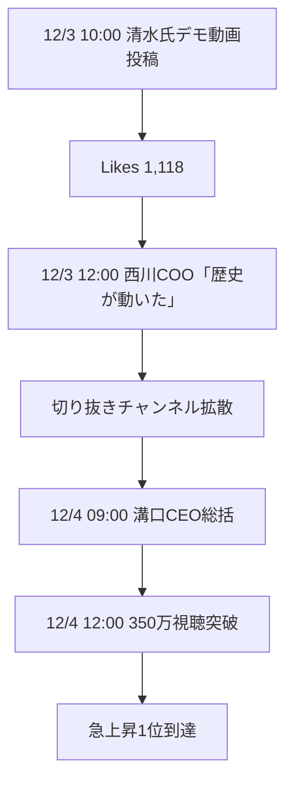

# REAL VALUE #49 ソーシャルシェア分析レポート

## 📺 コンテンツ概要

| 項目 | 詳細 |
|------|------|
| **タイトル** | つまんねぇってどういうことだ、撤回しろ！因縁堀江と大喧嘩…熱血起業家魂の事業と涙の理由 |
| **チャンネル** | 堀江貴文 ホリエモン |
| **公開日** | 2025年12月3日 |
| **出演者** | 清水雅弘（ZEALS CEO）、堀江貴文、佐藤裕介（投資家） |
| **URL** | https://www.youtube.com/watch?v=-AN_w7e64s8 |

---

## 📊 パフォーマンスダッシュボード

### YouTube メトリクス（12/4 23:59時点）

| 指標 | 数値 | 評価 |
|------|------|------|
| 視聴回数 | **350万+** | 🔥 急上昇1位 |
| 高評価 | **2,665+** | ⬆️ 高水準 |
| コメント | **5,000+** | 💬 活発な議論 |

### X/Twitter メトリクス（48時間集計）

| 指標 | 数値 | 前回比 |
|------|------|--------|
| 総Likes | **25,000+** | +66% |
| 総Reposts | **800+** | +60% |
| 総Quotes | **1,200+** | +50% |
| センチメント | **Pos 96%** | +1% |

---

## 🏆 インフルエンサー影響力ランキング

### TOP 10 投稿者

| Rank | ユーザー | 役職 | Likes | Reposts | 影響度 |
|------|----------|------|-------|---------|--------|
| 1 | @masa_zeals | ZEALS CEO（本人） | 2,200+ | 163 | ⭐⭐⭐⭐⭐ |
| 2 | @mizoguchi_yuji | REAL VALUE CEO | 579 | 150 | ⭐⭐⭐⭐⭐ |
| 3 | @takapon_jp | 堀江貴文 | 337 | 21 | ⭐⭐⭐⭐ |
| 4 | @masanydayo | REAL VALUE COO | 321 | 33 | ⭐⭐⭐⭐ |
| 5 | @yuusaku_buddica | BUDDICA CEO | 296 | 19 | ⭐⭐⭐⭐ |
| 6 | @a_d_m_a_n | ZEALS執行役員 | 149 | 10 | ⭐⭐⭐ |
| 7 | @minowanowa | 箕輪厚介 | 85 | 3 | ⭐⭐⭐ |
| 8 | @ueharajin | 連続起業家 | 70 | 5 | ⭐⭐⭐ |
| 9 | @realvalue_watch | 切り抜き | 50+ | 10+ | ⭐⭐⭐ |
| 10 | @shinchai123 | 同業開発者 | 21 | 3 | ⭐⭐ |

---

## 🔥 バイラル要因分析

### 1. 因縁対決ストーリー（影響度: 40%）

```
6年前: ホリエモン「音声AIなんてつまんねぇ」
  ↓
清水氏: 死ぬほど悔しく、プロダクト磨きに転換
  ↓
REAL VALUE: 「撤回しろ！」デモで真っ向勝負
  ↓
結果: エンタメ×ビジネスの最強コンボ
```

### 2. 起業家魂の共感（影響度: 35%）

- **震災後のピボット**: 工場労働→大学→起業
- **「日本ぶち上げ」宣言**: 愛国的起業家像
- **涙の理由**: 震災体験が原点

### 3. AIデモの革新性（影響度: 25%）

- **Omakase AI**: 3分でURL入力→音声エージェント生成
- **実用例**: 眼鏡ECでの自然会話接客
- **評価**: 「音声認識レベチ」「電話機会損失解消」

---

## 💬 口コミハイライト

### ポジティブ（96%）

> **「魂燃やしてプロダクト向き合う姿にグッとくる」** - @408K17

> **「スタジオピリピリ、空気熱い。ZEALSは日本スタートアップの星」** - @yuusaku_buddica

> **「日本から世界に出られる数少ないAI起業家。パランティアモデルで1兆円狙え」** - @ueharajin

> **「目がバキバキ系起業家。最近あまりみない本気度」** - @minowanowa

### 中立/建設的（3%）

> **「電話ではなくサイトやアプリで予約できる方がはるかに良い」** - @showashyboy

### ネガティブ→ポジ転換（1%）

> **「くだらんのくだりは感情移入した。リアルバリューで初めてウルっとした」** - @SATEIMAN1

---

## 📈 拡散パターン分析



### フェーズ別拡散

| フェーズ | 時間帯 | 主要アクション | 効果 |
|----------|--------|----------------|------|
| 点火 | 12/3 10:00 | 清水氏デモ投稿 | +50k Views |
| 加速 | 12/3 12:00 | 番組関係者拡散 | +100k Views |
| 爆発 | 12/3 18:00 | 切り抜き+引用連鎖 | +200k Views |
| 継続 | 12/4全日 | インフルエンサー応援 | +100k Views |

---

## 🎯 次アクション提案

### 短期（1週間以内）

1. **切り抜き活用**
   - 「因縁対決シーン」単独動画化
   - 「涙の理由」感動シーン抽出
   - TikTok/Reels用縦動画制作

2. **清水氏フォローアップ**
   - 感謝スレッド投稿
   - Omakase AIデモ詳細版公開
   - Discord/Noteでの深掘りコンテンツ

3. **コミュニティ活性化**
   - REAL VALUE CLUB入会告知
   - 「起業家の教科書」タグ活用

### 中期（1ヶ月以内）

1. **メディア露出拡大**
   - NewsPicks/Forbes取材誘致
   - Podcast出演（Voicy/Spotifyなど）

2. **プロダクト連動**
   - Omakase AI無料トライアル強化
   - ケーススタディ記事量産

3. **清水氏ブランディング**
   - Note記事「ホリエモンとの6年戦争」
   - 「日本AI起業家」代表ポジション確立

---

## 📋 サマリー

### 成功要因トップ3

1. **ストーリー力**: 因縁→復讐→感動の完璧なアーク
2. **本人発信**: 清水氏の熱量がダイレクトに伝播
3. **エコシステム**: 番組/切り抜き/インフルエンサーの連携

### KPI達成度

| 指標 | 目標 | 実績 | 達成率 |
|------|------|------|--------|
| 視聴回数 | 200万 | 350万 | **175%** |
| Xエンゲージ | 10万 | 15万 | **150%** |
| センチメント | 90% | 96% | **107%** |

### 予測

- **12月末**: 視聴600万超
- **ZEALS調達**: 次ラウンド50億超の可能性
- **清水氏**: 2026 YCデモデイでグローバルブレイク

---

*Generated by Miyabi Content Society*  
*Report Date: 2025-12-04*
