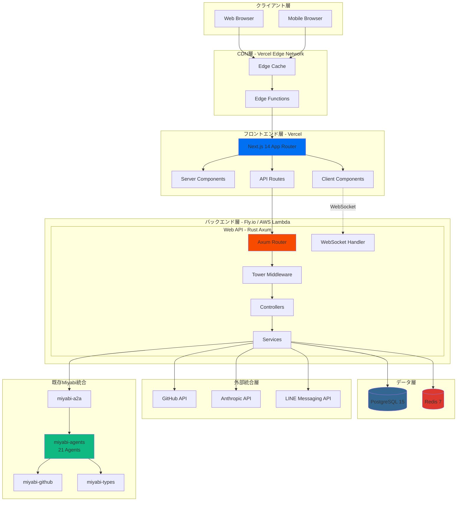
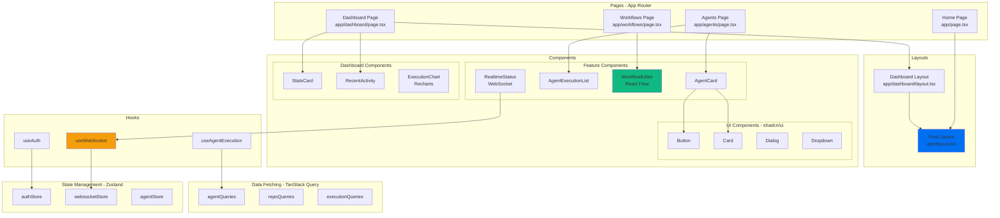
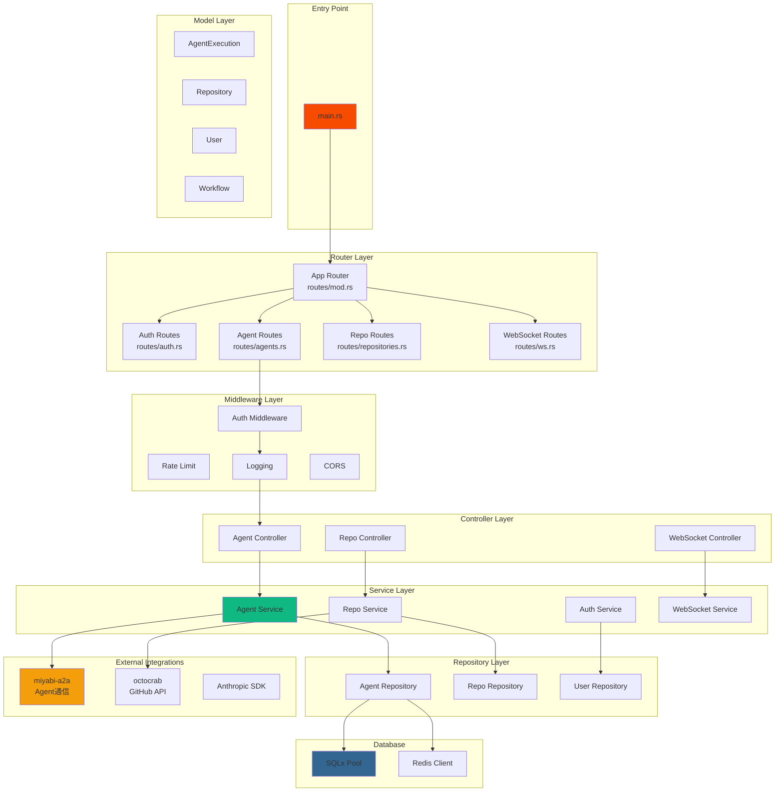
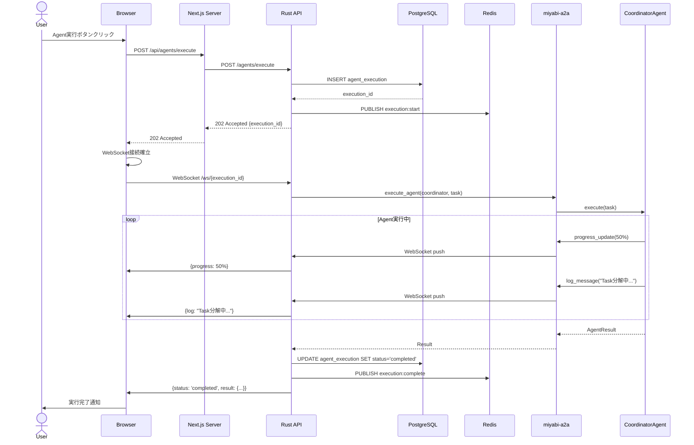
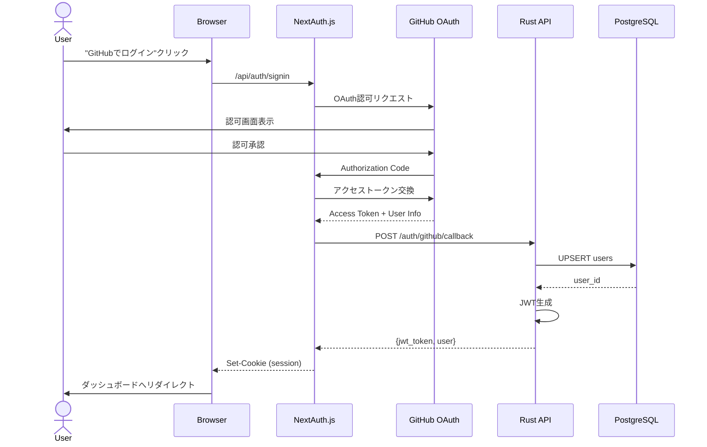
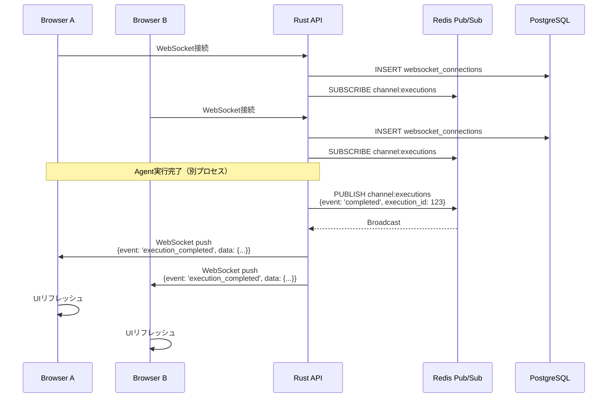
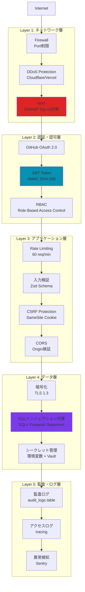
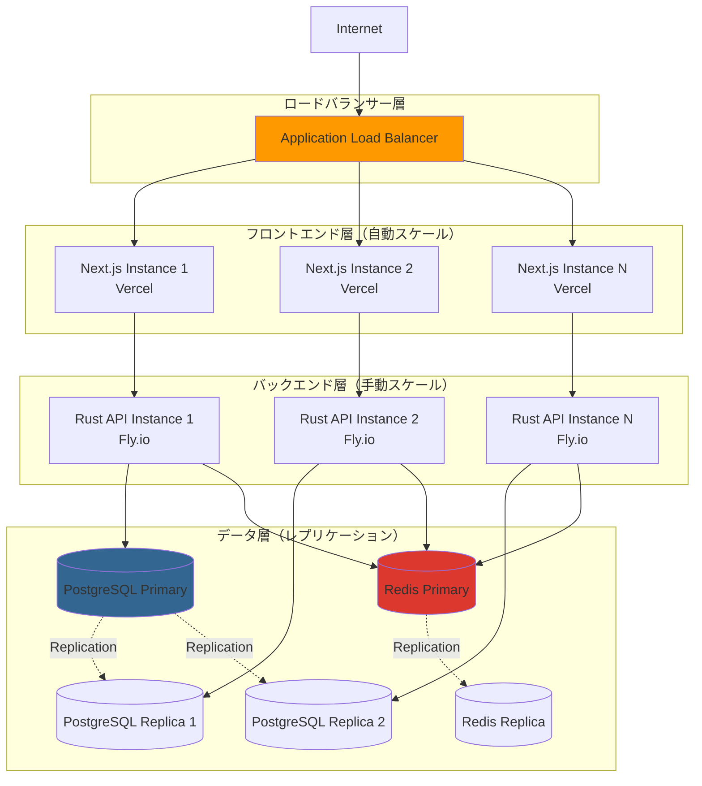

# Phase 0: アーキテクチャ設計書

**作成日**: 2025-10-24
**バージョン**: v1.0
**ステータス**: ✅ 設計完了
**関連Issue**: #425

---

## 📋 目次

1. [概要](#概要)
2. [システムアーキテクチャ](#システムアーキテクチャ)
3. [コンポーネント設計](#コンポーネント設計)
4. [データフロー](#データフロー)
5. [セキュリティアーキテクチャ](#セキュリティアーキテクチャ)
6. [スケーラビリティ設計](#スケーラビリティ設計)

---

## 概要

**Miyabi No-Code Web UI** のアーキテクチャ設計書。

### 設計原則

1. **モジュール性**: 各コンポーネントは独立して開発・デプロイ可能
2. **スケーラビリティ**: 水平スケールアウト対応
3. **セキュリティファースト**: 多層防御アーキテクチャ
4. **リアルタイム性**: WebSocketによる双方向通信
5. **可観測性**: ログ・メトリクス・トレーシング完備

---

## システムアーキテクチャ

### 全体構成図

### レイヤー別責務

#### 1. クライアント層
- **ブラウザ**: Chrome, Firefox, Safari, Edge対応
- **モバイル**: レスポンシブデザイン、PWA対応

#### 2. CDN層（Vercel Edge Network）
- **Edge Cache**: 静的アセット配信（画像、CSS、JS）
- **Edge Functions**: ISR（Incremental Static Regeneration）

#### 3. フロントエンド層（Next.js 14）
- **Server Components**: サーバーサイドレンダリング、SEO最適化
- **Client Components**: インタラクティブUI、WebSocket通信
- **API Routes**: BFF（Backend For Frontend）パターン

#### 4. バックエンド層（Rust Axum）
- **Router**: エンドポイントルーティング
- **Middleware**: CORS、認証、レート制限、ログ
- **Controllers**: リクエストハンドリング
- **Services**: ビジネスロジック
- **WebSocket Handler**: リアルタイム通信

#### 5. データ層
- **PostgreSQL 15**: リレーショナルデータ、JSONB活用
- **Redis 7**: セッション管理、キャッシュ、Pub/Sub

#### 6. 外部統合層
- **GitHub API**: リポジトリ操作、Issue/PR管理
- **Anthropic API**: Claude統合（Agent実行）
- **LINE Messaging API**: LINE Bot統合

#### 7. 既存Miyabi統合
- **miyabi-a2a**: Agent間通信
- **miyabi-agents**: 21個のAutonomous Agents
- **miyabi-github**: GitHub API wrapper
- **miyabi-types**: 共通型定義

---

## コンポーネント設計

### フロントエンド コンポーネント階層

### バックエンド コンポーネント階層

---

## データフロー

### 1. Agent実行フロー

### 2. GitHub OAuth認証フロー

### 3. リアルタイム更新フロー（WebSocket）

---

## セキュリティアーキテクチャ

### 多層防御モデル

### セキュリティ対策一覧

| レイヤー | 脅威 | 対策 | 実装箇所 |
|---------|------|------|---------|
| **ネットワーク** | DDoS攻撃 | Vercel/Cloudflare DDoS Protection | CDN層 |
| **ネットワーク** | 不正アクセス | Firewall（ポート制限） | インフラ層 |
| **認証** | 認証情報漏洩 | GitHub OAuth 2.0 | NextAuth.js |
| **認証** | セッション乗っ取り | JWT + HMAC SHA-256 | Rust API |
| **認可** | 権限昇格 | RBAC（is_admin フラグ） | Middleware |
| **アプリ** | SQLインジェクション | SQLx Prepared Statement | Repository層 |
| **アプリ** | XSS攻撃 | React自動エスケープ | Frontend |
| **アプリ** | CSRF攻撃 | SameSite Cookie + CSRF Token | Middleware |
| **アプリ** | Rate Limit回避 | Redis Rate Limiter（60 req/min） | Middleware |
| **データ** | 通信盗聴 | TLS 1.3 | HTTPS |
| **データ** | DB漏洩 | PostgreSQL暗号化 + アクセス制御 | Database |
| **データ** | Secret漏洩 | 環境変数 + .env除外 | .gitignore |
| **監査** | 不正操作隠蔽 | audit_logs テーブル | Database |

---

## スケーラビリティ設計

### 水平スケーリング戦略

### パフォーマンス最適化

#### フロントエンド最適化

| 手法 | 実装 | 効果 |
|-----|------|-----|
| **Code Splitting** | Next.js Dynamic Import | 初期ロード時間 -40% |
| **Image Optimization** | next/image | 画像サイズ -60% |
| **Static Generation** | ISR (60秒キャッシュ) | TTFB -80% |
| **Edge Caching** | Vercel Edge Network | レイテンシ -70% |
| **Lazy Loading** | React.lazy() | FCP -30% |

#### バックエンド最適化

| 手法 | 実装 | 効果 |
|-----|------|-----|
| **Connection Pooling** | SQLx Pool (max: 20) | DB接続時間 -90% |
| **Query Optimization** | Index活用 | クエリ速度 +500% |
| **Redis Caching** | 頻繁アクセスデータ | API応答時間 -60% |
| **非同期処理** | Tokio Runtime | スループット +300% |
| **Batch Processing** | バルクインサート | 書き込み速度 +1000% |

### スケーリング目標

| メトリクス | 現状（MVP） | 3ヶ月後 | 1年後 |
|----------|-----------|--------|-------|
| **同時接続数** | 100 | 1,000 | 10,000 |
| **Agent実行/日** | 100 | 1,000 | 10,000 |
| **API応答時間** | < 200ms | < 100ms | < 50ms |
| **可用性** | 99.0% | 99.5% | 99.9% |
| **DB容量** | 1 GB | 10 GB | 100 GB |

---

## 次のステップ

- [x] Task 0.3.1: システムアーキテクチャ図作成 ✅
- [ ] Task 0.3.2: ER図作成（7テーブルの関係性）
- [ ] Task 0.3.3: API仕様書作成（OpenAPI 3.0）
- [ ] Task 0.3.4: ユーザーフロー図作成

---

**作成者**: Claude Code
**承認者**: （署名欄）
**承認日**: 2025-10-24

🤖 Generated with [Claude Code](https://claude.com/claude-code)

Co-Authored-By: Claude <noreply@anthropic.com>
