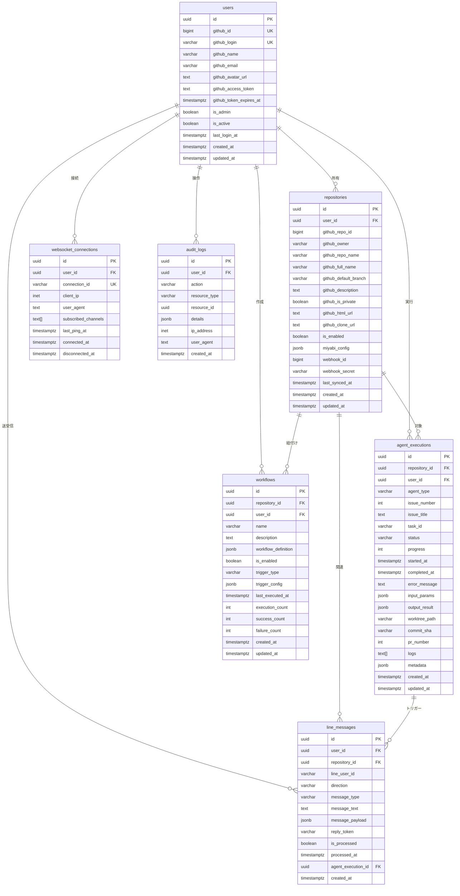

# Phase 0: ER図（Entity-Relationship Diagram）

**作成日**: 2025-10-24
**バージョン**: v1.0
**ステータス**: ✅ 設計完了
**関連Issue**: #425

---

## 📋 目次

1. [概要](#概要)
2. [ER図](#er図)
3. [テーブル定義](#テーブル定義)
4. [関係性詳細](#関係性詳細)
5. [インデックス戦略](#インデックス戦略)

---

## 概要

Miyabi No-Code Web UI のデータベーススキーマ設計。PostgreSQL 15の機能を最大限活用し、JSONB型による柔軟なスキーマ設計を実現。

### 設計原則

1. **正規化**: 第3正規形までの正規化
2. **柔軟性**: JSONB型による拡張可能なスキーマ
3. **パフォーマンス**: 適切なインデックス配置
4. **監査性**: audit_logsによる全操作追跡
5. **スケーラビリティ**: パーティショニング対応設計

---

## ER図

### 全体ER図



---

## テーブル定義

### 1. users - GitHub OAuth認証ユーザー

**目的**: GitHub OAuthで認証されたユーザー情報を管理

| カラム名 | 型 | NULL | デフォルト | 説明 |
|---------|---|------|----------|------|
| `id` | UUID | NOT NULL | uuid_generate_v4() | **PK** 内部ID |
| `github_id` | BIGINT | NOT NULL | - | **UK** GitHub User ID |
| `github_login` | VARCHAR(255) | NOT NULL | - | **UK** GitHubユーザー名 |
| `github_name` | VARCHAR(255) | NULL | - | GitHub表示名 |
| `github_email` | VARCHAR(255) | NULL | - | GitHubメールアドレス |
| `github_avatar_url` | TEXT | NULL | - | アバター画像URL |
| `github_access_token` | TEXT | NOT NULL | - | GitHub PAT（暗号化推奨） |
| `github_token_expires_at` | TIMESTAMPTZ | NULL | - | トークン有効期限 |
| `is_admin` | BOOLEAN | NOT NULL | FALSE | 管理者フラグ |
| `is_active` | BOOLEAN | NOT NULL | TRUE | アクティブフラグ |
| `last_login_at` | TIMESTAMPTZ | NULL | - | 最終ログイン日時 |
| `created_at` | TIMESTAMPTZ | NOT NULL | NOW() | 作成日時 |
| `updated_at` | TIMESTAMPTZ | NOT NULL | NOW() | 更新日時 |

**インデックス**:
- `idx_users_github_id` (github_id)
- `idx_users_github_login` (github_login)
- `idx_users_is_active` (is_active)

**トリガー**:
- `update_users_updated_at` - updated_at自動更新

---

### 2. repositories - 接続されたGitHubリポジトリ

**目的**: ユーザーが接続したGitHubリポジトリの情報を管理

| カラム名 | 型 | NULL | デフォルト | 説明 |
|---------|---|------|----------|------|
| `id` | UUID | NOT NULL | uuid_generate_v4() | **PK** 内部ID |
| `user_id` | UUID | NOT NULL | - | **FK** users(id) |
| `github_repo_id` | BIGINT | NOT NULL | - | GitHub Repository ID |
| `github_owner` | VARCHAR(255) | NOT NULL | - | リポジトリオーナー |
| `github_repo_name` | VARCHAR(255) | NOT NULL | - | リポジトリ名 |
| `github_full_name` | VARCHAR(511) | NOT NULL | - | フルネーム (owner/repo) |
| `github_default_branch` | VARCHAR(255) | NOT NULL | 'main' | デフォルトブランチ |
| `github_description` | TEXT | NULL | - | リポジトリ説明 |
| `github_is_private` | BOOLEAN | NOT NULL | FALSE | プライベートリポジトリフラグ |
| `github_html_url` | TEXT | NOT NULL | - | GitHubページURL |
| `github_clone_url` | TEXT | NOT NULL | - | Clone URL |
| `is_enabled` | BOOLEAN | NOT NULL | TRUE | Miyabi連携有効フラグ |
| `miyabi_config` | JSONB | NULL | - | .miyabi.yml解析結果 |
| `webhook_id` | BIGINT | NULL | - | GitHub Webhook ID |
| `webhook_secret` | VARCHAR(255) | NULL | - | Webhook検証シークレット |
| `last_synced_at` | TIMESTAMPTZ | NULL | - | 最終同期日時 |
| `created_at` | TIMESTAMPTZ | NOT NULL | NOW() | 作成日時 |
| `updated_at` | TIMESTAMPTZ | NOT NULL | NOW() | 更新日時 |

**ユニーク制約**:
- `(user_id, github_repo_id)` - 同じリポジトリの重複登録防止

**インデックス**:
- `idx_repositories_user_id` (user_id)
- `idx_repositories_github_full_name` (github_full_name)
- `idx_repositories_is_enabled` (is_enabled)
- `idx_repositories_last_synced_at` (last_synced_at)

**トリガー**:
- `update_repositories_updated_at` - updated_at自動更新

---

### 3. agent_executions - Agent実行履歴

**目的**: Miyabi Agent実行の履歴・進捗・ログを管理

| カラム名 | 型 | NULL | デフォルト | 説明 |
|---------|---|------|----------|------|
| `id` | UUID | NOT NULL | uuid_generate_v4() | **PK** 内部ID |
| `repository_id` | UUID | NOT NULL | - | **FK** repositories(id) |
| `user_id` | UUID | NOT NULL | - | **FK** users(id) |
| `agent_type` | VARCHAR(100) | NOT NULL | - | Agent種別 (CoordinatorAgent等) |
| `issue_number` | INTEGER | NULL | - | GitHub Issue番号 |
| `issue_title` | TEXT | NULL | - | Issue タイトル |
| `task_id` | VARCHAR(255) | NULL | - | タスクID |
| `status` | VARCHAR(50) | NOT NULL | 'pending' | ステータス (pending/running/completed/failed) |
| `progress` | INTEGER | NOT NULL | 0 | 進捗率 (0-100) |
| `started_at` | TIMESTAMPTZ | NULL | - | 開始日時 |
| `completed_at` | TIMESTAMPTZ | NULL | - | 完了日時 |
| `error_message` | TEXT | NULL | - | エラーメッセージ |
| `input_params` | JSONB | NOT NULL | - | Agent入力パラメータ |
| `output_result` | JSONB | NULL | - | Agent出力結果 |
| `worktree_path` | VARCHAR(512) | NULL | - | Git Worktreeパス |
| `commit_sha` | VARCHAR(40) | NULL | - | Gitコミット SHA |
| `pr_number` | INTEGER | NULL | - | 作成されたPR番号 |
| `logs` | TEXT[] | NULL | - | 実行ログ配列 |
| `metadata` | JSONB | NULL | - | 追加メタデータ |
| `created_at` | TIMESTAMPTZ | NOT NULL | NOW() | 作成日時 |
| `updated_at` | TIMESTAMPTZ | NOT NULL | NOW() | 更新日時 |

**インデックス**:
- `idx_agent_executions_repository_id` (repository_id)
- `idx_agent_executions_user_id` (user_id)
- `idx_agent_executions_agent_type` (agent_type)
- `idx_agent_executions_status` (status)
- `idx_agent_executions_created_at` (created_at DESC)
- `idx_agent_executions_issue_number` (issue_number) WHERE issue_number IS NOT NULL

**トリガー**:
- `update_agent_executions_updated_at` - updated_at自動更新

---

### 4. workflows - ユーザー定義ワークフロー

**目的**: React Flowで作成されたビジュアルワークフローを管理

| カラム名 | 型 | NULL | デフォルト | 説明 |
|---------|---|------|----------|------|
| `id` | UUID | NOT NULL | uuid_generate_v4() | **PK** 内部ID |
| `repository_id` | UUID | NOT NULL | - | **FK** repositories(id) |
| `user_id` | UUID | NOT NULL | - | **FK** users(id) |
| `name` | VARCHAR(255) | NOT NULL | - | ワークフロー名 |
| `description` | TEXT | NULL | - | 説明 |
| `workflow_definition` | JSONB | NOT NULL | - | React Flowグラフ定義 |
| `is_enabled` | BOOLEAN | NOT NULL | TRUE | 有効フラグ |
| `trigger_type` | VARCHAR(50) | NOT NULL | - | トリガー種別 (manual/webhook/schedule) |
| `trigger_config` | JSONB | NULL | - | トリガー設定 |
| `last_executed_at` | TIMESTAMPTZ | NULL | - | 最終実行日時 |
| `execution_count` | INTEGER | NOT NULL | 0 | 実行回数 |
| `success_count` | INTEGER | NOT NULL | 0 | 成功回数 |
| `failure_count` | INTEGER | NOT NULL | 0 | 失敗回数 |
| `created_at` | TIMESTAMPTZ | NOT NULL | NOW() | 作成日時 |
| `updated_at` | TIMESTAMPTZ | NOT NULL | NOW() | 更新日時 |

**ユニーク制約**:
- `(repository_id, name)` - 同じリポジトリ内で同名ワークフロー禁止

**インデックス**:
- `idx_workflows_repository_id` (repository_id)
- `idx_workflows_user_id` (user_id)
- `idx_workflows_is_enabled` (is_enabled)
- `idx_workflows_trigger_type` (trigger_type)
- `idx_workflows_last_executed_at` (last_executed_at DESC)

**トリガー**:
- `update_workflows_updated_at` - updated_at自動更新

---

### 5. line_messages - LINE Bot メッセージ

**目的**: LINE Bot統合でのメッセージ送受信を管理（Phase 6）

| カラム名 | 型 | NULL | デフォルト | 説明 |
|---------|---|------|----------|------|
| `id` | UUID | NOT NULL | uuid_generate_v4() | **PK** 内部ID |
| `user_id` | UUID | NOT NULL | - | **FK** users(id) |
| `repository_id` | UUID | NULL | - | **FK** repositories(id) |
| `line_user_id` | VARCHAR(255) | NOT NULL | - | LINE User ID |
| `direction` | VARCHAR(20) | NOT NULL | - | 方向 (inbound/outbound) |
| `message_type` | VARCHAR(50) | NOT NULL | - | メッセージ種別 (text/image/video等) |
| `message_text` | TEXT | NULL | - | テキストメッセージ本文 |
| `message_payload` | JSONB | NULL | - | LINE メッセージ JSON |
| `reply_token` | VARCHAR(255) | NULL | - | LINE Reply Token |
| `is_processed` | BOOLEAN | NOT NULL | FALSE | 処理済みフラグ |
| `processed_at` | TIMESTAMPTZ | NULL | - | 処理日時 |
| `agent_execution_id` | UUID | NULL | - | **FK** agent_executions(id) |
| `created_at` | TIMESTAMPTZ | NOT NULL | NOW() | 作成日時 |

**インデックス**:
- `idx_line_messages_user_id` (user_id)
- `idx_line_messages_line_user_id` (line_user_id)
- `idx_line_messages_direction` (direction)
- `idx_line_messages_is_processed` (is_processed)
- `idx_line_messages_created_at` (created_at DESC)

---

### 6. websocket_connections - WebSocket接続

**目的**: アクティブなWebSocket接続を管理

| カラム名 | 型 | NULL | デフォルト | 説明 |
|---------|---|------|----------|------|
| `id` | UUID | NOT NULL | uuid_generate_v4() | **PK** 内部ID |
| `user_id` | UUID | NOT NULL | - | **FK** users(id) |
| `connection_id` | VARCHAR(255) | NOT NULL | - | **UK** WebSocket接続ID |
| `client_ip` | INET | NULL | - | クライアントIPアドレス |
| `user_agent` | TEXT | NULL | - | User-Agent |
| `subscribed_channels` | TEXT[] | NULL | - | 購読チャンネル配列 |
| `last_ping_at` | TIMESTAMPTZ | NULL | - | 最終Ping日時 |
| `connected_at` | TIMESTAMPTZ | NOT NULL | NOW() | 接続日時 |
| `disconnected_at` | TIMESTAMPTZ | NULL | - | 切断日時 |

**インデックス**:
- `idx_websocket_connections_user_id` (user_id)
- `idx_websocket_connections_connection_id` (connection_id)
- `idx_websocket_connections_connected_at` (connected_at DESC)
- `idx_websocket_connections_active` (user_id, connected_at) WHERE disconnected_at IS NULL

---

### 7. audit_logs - 監査ログ

**目的**: 全ユーザー操作の監査証跡を記録

| カラム名 | 型 | NULL | デフォルト | 説明 |
|---------|---|------|----------|------|
| `id` | UUID | NOT NULL | uuid_generate_v4() | **PK** 内部ID |
| `user_id` | UUID | NULL | - | **FK** users(id) |
| `action` | VARCHAR(100) | NOT NULL | - | 操作種別 (login/logout/agent_execute等) |
| `resource_type` | VARCHAR(100) | NULL | - | リソース種別 (repository/agent_execution等) |
| `resource_id` | UUID | NULL | - | リソースID |
| `details` | JSONB | NULL | - | 詳細情報 |
| `ip_address` | INET | NULL | - | IPアドレス |
| `user_agent` | TEXT | NULL | - | User-Agent |
| `created_at` | TIMESTAMPTZ | NOT NULL | NOW() | 作成日時 |

**インデックス**:
- `idx_audit_logs_user_id` (user_id)
- `idx_audit_logs_action` (action)
- `idx_audit_logs_resource_type` (resource_type)
- `idx_audit_logs_created_at` (created_at DESC)

---

## 関係性詳細

### 1対多関係

| 親テーブル | 子テーブル | 関係 | カーディナリティ |
|----------|----------|------|--------------|
| **users** | repositories | 所有 | 1:N (1ユーザーが複数リポジトリ) |
| **users** | agent_executions | 実行 | 1:N (1ユーザーが複数実行) |
| **users** | workflows | 作成 | 1:N (1ユーザーが複数ワークフロー) |
| **users** | line_messages | 送受信 | 1:N (1ユーザーが複数メッセージ) |
| **users** | websocket_connections | 接続 | 1:N (1ユーザーが複数接続) |
| **users** | audit_logs | 操作 | 1:N (1ユーザーが複数操作) |
| **repositories** | agent_executions | 対象 | 1:N (1リポジトリで複数実行) |
| **repositories** | workflows | 紐付け | 1:N (1リポジトリで複数ワークフロー) |
| **agent_executions** | line_messages | トリガー | 1:N (1実行で複数メッセージ) |

### カスケード削除ルール

| 親テーブル | 子テーブル | ON DELETE動作 |
|----------|----------|-------------|
| users | repositories | **CASCADE** - ユーザー削除時にリポジトリも削除 |
| users | agent_executions | **CASCADE** - ユーザー削除時に実行履歴も削除 |
| repositories | agent_executions | **CASCADE** - リポジトリ削除時に実行履歴も削除 |
| repositories | line_messages | **SET NULL** - リポジトリ削除時にNULLに設定 |
| agent_executions | line_messages | **SET NULL** - 実行削除時にNULLに設定 |
| users | audit_logs | **SET NULL** - ユーザー削除後も監査ログは保持 |

---

## インデックス戦略

### パフォーマンスクリティカルなクエリ

#### 1. ユーザーダッシュボード表示

```sql
-- 最近のAgent実行一覧（ページネーション）
SELECT * FROM agent_executions
WHERE user_id = $1
ORDER BY created_at DESC
LIMIT 20 OFFSET 0;
```

**使用インデックス**: `idx_agent_executions_created_at`

#### 2. リアルタイムステータス更新

```sql
-- 実行中のAgent一覧
SELECT * FROM agent_executions
WHERE status = 'running'
  AND repository_id = $1;
```

**使用インデックス**: `idx_agent_executions_status`, `idx_agent_executions_repository_id`

#### 3. WebSocket接続管理

```sql
-- アクティブな接続一覧
SELECT * FROM websocket_connections
WHERE user_id = $1
  AND disconnected_at IS NULL;
```

**使用インデックス**: `idx_websocket_connections_active` (部分インデックス)

#### 4. 監査ログ検索

```sql
-- 特定ユーザーの操作履歴
SELECT * FROM audit_logs
WHERE user_id = $1
  AND action = 'agent_execute'
  AND created_at > NOW() - INTERVAL '7 days'
ORDER BY created_at DESC;
```

**使用インデックス**: `idx_audit_logs_user_id`, `idx_audit_logs_action`, `idx_audit_logs_created_at`

---

## 次のステップ

- [x] Task 0.3.1: システムアーキテクチャ図作成 ✅
- [x] Task 0.3.2: ER図作成 ✅
- [ ] Task 0.3.3: API仕様書作成（OpenAPI 3.0）
- [ ] Task 0.3.4: ユーザーフロー図作成

---

**作成者**: Claude Code
**承認者**: （署名欄）
**承認日**: 2025-10-24

🤖 Generated with [Claude Code](https://claude.com/claude-code)

Co-Authored-By: Claude <noreply@anthropic.com>
