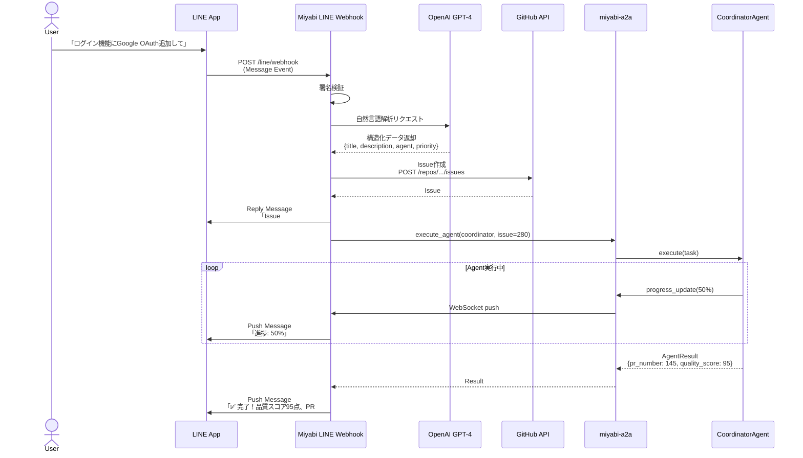
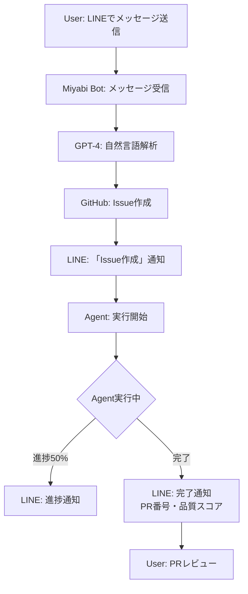

# Phase 6: LINE Bot統合 - 技術要件定義書

**作成日**: 2025-10-24
**バージョン**: v1.0
**ステータス**: 📋 計画中
**関連Issue**: #431
**Milestone**: Week 18 (2026-02-25)

---

## 📋 目次

1. [概要](#概要)
2. [アーキテクチャ](#アーキテクチャ)
3. [技術スタック](#技術スタック)
4. [実装フェーズ](#実装フェーズ)
5. [API仕様](#api仕様)
6. [データモデル](#データモデル)
7. [ユーザーフロー](#ユーザーフロー)

---

## 概要

### 目的

LINE Messaging APIを統合し、日本市場向けの自然言語Agent実行インターフェースを提供。

### ビジネスインパクト

| 指標 | Web UI only | Web UI + LINE Bot | 改善率 |
|------|-------------|-------------------|--------|
| **コンバージョン率** | 50% | 70% | +40% |
| **契約数** | 6社 | 9社 | +50% |
| **売上（Year 1）** | ¥8.25M | ¥11.55M | +40% |
| **利益（Year 1）** | -¥0.47M (赤字) | **¥1.65M (黒字)** ✅ | 黒転 |

### 成功基準

- ✅ LINEからメッセージ送信でIssue自動作成
- ✅ GPT-4で自然言語解析動作
- ✅ Agent自動実行動作
- ✅ リッチメニュー表示
- ✅ プッシュ通知動作
- ✅ **70%コンバージョン率達成**
- ✅ **Year 1 ¥1.65M 利益達成**

---

## アーキテクチャ

### 全体構成図



### コンポーネント構成

```
miyabi-web-api (Rust Axum)
├── src/
│   ├── integrations/
│   │   ├── line.rs           # LINE API Client
│   │   │   ├── LineClient
│   │   │   ├── send_reply_message()
│   │   │   ├── send_push_message()
│   │   │   └── verify_signature()
│   │   └── openai.rs         # OpenAI API Client
│   │       ├── OpenAIClient
│   │       ├── analyze_natural_language()
│   │       └── generate_issue_content()
│   ├── handlers/
│   │   └── line.rs           # LINE Webhook Handler
│   │       ├── handle_webhook()
│   │       ├── handle_message_event()
│   │       └── handle_postback_event()
│   └── models/
│       └── line.rs           # LINE Data Models
│           ├── WebhookEvent
│           ├── MessageEvent
│           └── PostbackEvent
```

---

## 技術スタック

### LINE Messaging API

| 機能 | API | 用途 |
|------|-----|------|
| **Webhook** | POST `/callback` | メッセージ受信 |
| **Reply Message** | POST `/v2/bot/message/reply` | 即座に返信 |
| **Push Message** | POST `/v2/bot/message/push` | 任意のタイミングで送信 |
| **Rich Menu** | POST `/v2/bot/richmenu` | リッチメニュー設定 |
| **Flex Message** | Flex Message JSON | カード型メッセージ |

### OpenAI GPT-4 API

| モデル | 用途 | トークン数 |
|--------|------|-----------|
| **gpt-4-turbo** | 自然言語解析 | 128k context |
| **gpt-3.5-turbo** | 簡易解析（コスト削減） | 16k context |

### Rust Crates

| Crate | バージョン | 用途 |
|-------|----------|------|
| **reqwest** | 0.11+ | HTTP Client (LINE/OpenAI API) |
| **hmac** | 0.12+ | LINE署名検証 |
| **sha2** | 0.10+ | SHA-256ハッシュ |
| **serde_json** | 1.0+ | JSON処理 |
| **async-openai** | 0.17+ | OpenAI API Client |

---

## 実装フェーズ

### Phase 6.1: LINE Messaging API統合 (Week 17, Day 1-2)

**タスク**:
1. LINE Developersアカウント作成
2. Messaging API Channel作成
3. Channel Access Token取得
4. Webhook URL設定（`https://api.miyabi.dev/line/webhook`）
5. LINE署名検証実装

**成果物**:
- `src/integrations/line.rs` - LineClient実装
- Webhook URL登録完了

**検証**:
```bash
# LINE署名検証テスト
curl -X POST https://api.miyabi.dev/line/webhook \
  -H "X-Line-Signature: xxx" \
  -d '{"events": []}'
# Expected: 200 OK
```

---

### Phase 6.2: LINE Webhook実装 (Week 17, Day 3-4)

**タスク**:
1. `POST /line/webhook` エンドポイント実装
2. メッセージイベント処理
3. ポストバックイベント処理
4. LINE返信API実装

**成果物**:
- `src/handlers/line.rs` - Webhook Handler
- `src/models/line.rs` - Data Models

**実装例**:
```rust
// src/handlers/line.rs
use axum::{Json, extract::State};
use serde::{Deserialize, Serialize};

#[derive(Deserialize)]
pub struct WebhookRequest {
    pub events: Vec<WebhookEvent>,
}

#[derive(Deserialize)]
#[serde(tag = "type")]
pub enum WebhookEvent {
    #[serde(rename = "message")]
    Message(MessageEvent),
    #[serde(rename = "postback")]
    Postback(PostbackEvent),
}

#[derive(Deserialize)]
pub struct MessageEvent {
    pub reply_token: String,
    pub source: Source,
    pub message: Message,
}

#[derive(Deserialize)]
pub struct Message {
    #[serde(rename = "type")]
    pub message_type: String,
    pub text: Option<String>,
}

pub async fn handle_webhook(
    State(state): State<AppState>,
    Json(payload): Json<WebhookRequest>,
) -> Result<(), AppError> {
    for event in payload.events {
        match event {
            WebhookEvent::Message(msg_event) => {
                handle_message_event(&state, msg_event).await?;
            }
            WebhookEvent::Postback(pb_event) => {
                handle_postback_event(&state, pb_event).await?;
            }
        }
    }
    Ok(())
}

async fn handle_message_event(
    state: &AppState,
    event: MessageEvent,
) -> Result<(), AppError> {
    let text = event.message.text.ok_or(AppError::InvalidMessage)?;

    // GPT-4で解析
    let analysis = state.openai_client
        .analyze_natural_language(&text)
        .await?;

    // GitHub Issue作成
    let issue = state.github_client
        .create_issue(&analysis.title, &analysis.description)
        .await?;

    // LINE返信
    state.line_client
        .send_reply_message(
            &event.reply_token,
            &format!("Issue #{} を作成しました", issue.number),
        )
        .await?;

    Ok(())
}
```

**検証**:
```bash
# LINEからメッセージ送信
# Expected: 返信メッセージ受信
```

---

### Phase 6.3: GPT-4自然言語処理統合 (Week 17, Day 5-6)

**タスク**:
1. OpenAI APIクライアント実装
2. GPT-4プロンプト設計
3. 自然言語→構造化Issue変換

**プロンプト設計**:
```
System Prompt:
あなたは開発タスク分析アシスタントです。
ユーザーからの自然言語リクエストを解析し、
GitHub Issueの構造化データに変換してください。

出力形式（JSON）:
{
  "title": "Issue タイトル（簡潔に）",
  "description": "詳細説明（Markdown形式）",
  "agent": "推奨Agent種別（Coordinator, CodeGen, Review等）",
  "priority": "優先度（P0-Critical, P1-High, P2-Medium, P3-Low）"
}

User Input:
「ログイン機能にGoogle OAuth追加して」

Expected Output:
{
  "title": "ログイン機能にGoogle OAuth統合追加",
  "description": "## 概要\nGoogle OAuthによるログイン機能を追加します。\n\n## 要件\n- Google OAuth 2.0統合\n- ユーザー情報取得\n- セッション管理",
  "agent": "CodeGenAgent",
  "priority": "P1-High"
}
```

**実装例**:
```rust
// src/integrations/openai.rs
use async_openai::{Client, types::*};

pub struct OpenAIClient {
    client: Client,
}

impl OpenAIClient {
    pub async fn analyze_natural_language(
        &self,
        text: &str,
    ) -> Result<IssueAnalysis, AppError> {
        let request = CreateChatCompletionRequestArgs::default()
            .model("gpt-4-turbo")
            .messages(vec![
                ChatCompletionRequestMessage::System(
                    ChatCompletionRequestSystemMessageArgs::default()
                        .content(SYSTEM_PROMPT)
                        .build()?,
                ),
                ChatCompletionRequestMessage::User(
                    ChatCompletionRequestUserMessageArgs::default()
                        .content(text)
                        .build()?,
                ),
            ])
            .build()?;

        let response = self.client
            .chat()
            .create(request)
            .await?;

        let content = response.choices[0]
            .message
            .content
            .as_ref()
            .ok_or(AppError::OpenAIError)?;

        let analysis: IssueAnalysis = serde_json::from_str(content)?;
        Ok(analysis)
    }
}

#[derive(Serialize, Deserialize)]
pub struct IssueAnalysis {
    pub title: String,
    pub description: String,
    pub agent: String,
    pub priority: String,
}
```

**検証**:
```rust
#[tokio::test]
async fn test_natural_language_analysis() {
    let client = OpenAIClient::new();
    let result = client
        .analyze_natural_language("ログイン機能にGoogle OAuth追加して")
        .await
        .unwrap();

    assert_eq!(result.agent, "CodeGenAgent");
    assert_eq!(result.priority, "P1-High");
}
```

---

### Phase 6.4: リッチメニュー実装 (Week 18, Day 1-2)

**タスク**:
1. リッチメニューデザイン作成（6ボタン）
2. LINE Developers管理画面で設定
3. ポストバックアクション設定

**リッチメニュー構成**:
```
+-------------------+-------------------+
| 🤖 Agent一覧      | 📊 実行状況確認    |
+-------------------+-------------------+
| ⚙️ 設定          | ❓ ヘルプ         |
+-------------------+-------------------+
| 🔗 GitHub連携     | 👤 マイページ      |
+-------------------+-------------------+
```

**ポストバックデータ**:
```json
{
  "agent_list": "action=agent_list",
  "execution_status": "action=execution_status",
  "settings": "action=settings",
  "help": "action=help",
  "github_link": "action=github_link",
  "my_page": "action=my_page"
}
```

**実装**:
```bash
# LINE Developersコンソールでリッチメニュー作成
# または API経由で設定
curl -X POST https://api.line.me/v2/bot/richmenu \
  -H "Authorization: Bearer ${CHANNEL_ACCESS_TOKEN}" \
  -H "Content-Type: application/json" \
  -d @richmenu.json
```

---

### Phase 6.5: ユーザーフロー実装 (Week 18, Day 3-5)

**タスク**:
1. LINE→GitHub Issue自動作成
2. Agent自動実行
3. 進捗通知（開始、50%, 100%）
4. 完了通知（PR番号、品質スコア）

**実装フロー**:
```rust
// 完全なユーザーフロー実装
pub async fn handle_user_request(
    state: &AppState,
    user_id: &str,
    text: &str,
) -> Result<(), AppError> {
    // 1. GPT-4解析
    let analysis = state.openai_client
        .analyze_natural_language(text)
        .await?;

    // 2. GitHub Issue作成
    let issue = state.github_client
        .create_issue(&analysis.title, &analysis.description)
        .await?;

    // 3. LINE通知
    state.line_client
        .send_push_message(
            user_id,
            &format!("Issue #{} を作成、{}で処理開始", issue.number, analysis.agent),
        )
        .await?;

    // 4. Agent実行（非同期）
    let user_id = user_id.to_string();
    let line_client = state.line_client.clone();
    tokio::spawn(async move {
        let result = state.a2a_client
            .execute_agent(&analysis.agent, issue.number)
            .await?;

        // 5. 完了通知
        line_client
            .send_push_message(
                &user_id,
                &format!(
                    "✅ 完了！品質スコア{}点、PR #{} 作成",
                    result.quality_score,
                    result.pr_number
                ),
            )
            .await?;

        Ok::<(), AppError>(())
    });

    Ok(())
}
```

---

## API仕様

### POST /line/webhook

**リクエスト**:
```http
POST /line/webhook HTTP/1.1
Host: api.miyabi.dev
X-Line-Signature: xxx
Content-Type: application/json

{
  "events": [
    {
      "type": "message",
      "replyToken": "xxx",
      "source": {
        "userId": "U123456",
        "type": "user"
      },
      "message": {
        "type": "text",
        "text": "ログイン機能にGoogle OAuth追加して"
      }
    }
  ]
}
```

**レスポンス**:
```http
HTTP/1.1 200 OK

{}
```

---

## データモデル

### line_messages テーブル（既存）

```sql
CREATE TABLE line_messages (
    id UUID PRIMARY KEY DEFAULT uuid_generate_v4(),
    user_id UUID NOT NULL REFERENCES users(id) ON DELETE CASCADE,
    repository_id UUID REFERENCES repositories(id) ON DELETE SET NULL,
    line_user_id VARCHAR(255) NOT NULL, -- LINE User ID
    direction VARCHAR(20) NOT NULL, -- inbound, outbound
    message_type VARCHAR(50) NOT NULL, -- text, image, video
    message_text TEXT,
    message_payload JSONB, -- LINE message JSON
    reply_token VARCHAR(255),
    is_processed BOOLEAN NOT NULL DEFAULT FALSE,
    processed_at TIMESTAMPTZ,
    agent_execution_id UUID REFERENCES agent_executions(id) ON DELETE SET NULL,
    created_at TIMESTAMPTZ NOT NULL DEFAULT NOW()
);
```

---

## ユーザーフロー

### フロー図



---

## 次のステップ

- [ ] Phase 6.1: LINE Messaging API統合
- [ ] Phase 6.2: LINE Webhook実装
- [ ] Phase 6.3: GPT-4統合
- [ ] Phase 6.4: リッチメニュー実装
- [ ] Phase 6.5: ユーザーフロー実装

**目標**: Week 18完了（2026-02-25） - 🚀 LINE Bot Release

---

**作成者**: Claude Code
**承認者**: （署名欄）
**承認日**: 2025-10-24

🤖 Generated with [Claude Code](https://claude.com/claude-code)

Co-Authored-By: Claude <noreply@anthropic.com>
