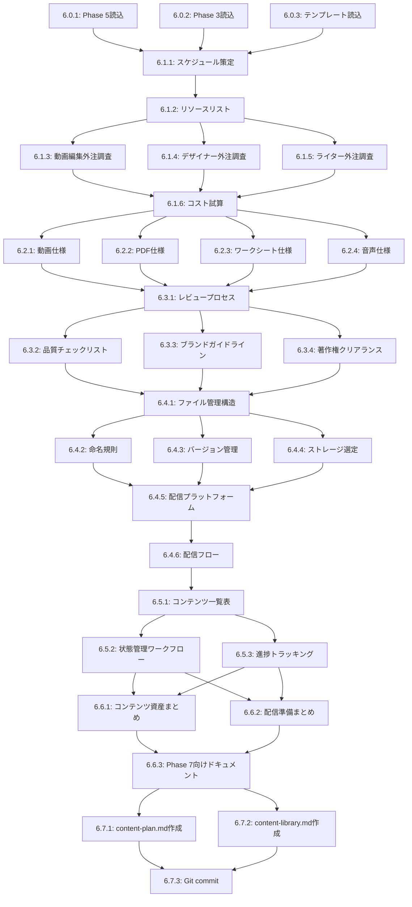

# Phase 6: ContentCreationAgent - タスク分解（DAG構造）

## 概要

**Phase 6**: コンテンツ制作計画立案
**Agent**: ContentCreationAgent
**合計推定時間**: 306分（約5時間）
**並列実行ポイント**: 8箇所（最大3タスク同時実行）

---

## Phase 6.0: 事前準備（並列実行可能）

**依存**: なし | **推定時間**: 6分

| Task ID | タスク名 | 内容 | 並列 |
|---------|---------|------|------|
| 6.0.1 | Phase 5結果読み込み | `docs/product/product-detail.md`を読み込み | ✅ |
| 6.0.2 | Phase 3結果読み込み | `docs/persona/persona-sheet.md`を読み込み | ✅ |
| 6.0.3 | テンプレート読み込み | `docs/templates/06-content-creation-template.md`を読み込み | ✅ |

**Entity-Relation Mapping**:
```
N1:Phase5Result $H→ N2:ContentCreationAgent $H→ N3:ContentPlan
N1:Phase3Result $L→ N2:ContentCreationAgent
```

---

## Phase 6.1: コンテンツ制作計画

**依存**: 6.0完了 | **推定時間**: 60分

| Task ID | タスク名 | 内容 | 依存 | 並列 |
|---------|---------|------|------|------|
| 6.1.1 | 全体スケジュール策定 | 20週間の制作スケジュール作成（Phase 1-4） | 6.0 | ❌ |
| 6.1.2 | リソースリスト作成 | 人的リソース（6職種）+ 機材・ツール（7種類） | 6.1.1 | ❌ |
| 6.1.3 | 外注先調査（動画編集） | 候補3社リストアップ（プロフィール、料金、納期） | 6.1.2 | ✅ |
| 6.1.4 | 外注先調査（デザイナー） | 候補3社リストアップ | 6.1.2 | ✅ |
| 6.1.5 | 外注先調査（ライター） | 候補3社リストアップ | 6.1.2 | ✅ |
| 6.1.6 | 外注コスト試算 | 4項目（動画編集、PDF、スクリプト、サムネ）の総額算出 | 6.1.3-6.1.5 | ❌ |

**Entity-Relation Mapping**:
```
N1:Schedule $H→ N2:ResourcePlanning $H→ N3:VendorList
N2:ResourcePlanning $H→ N2:CostEstimation $H→ N3:Budget
```

---

## Phase 6.2: コンテンツ制作詳細設計（並列実行可能）

**依存**: 6.1完了 | **推定時間**: 90分

| Task ID | タスク名 | 内容 | 依存 | 並列 |
|---------|---------|------|------|------|
| 6.2.1 | 動画コンテンツ仕様 | Month 1-6の動画仕様（72本分） | 6.1 | ✅ |
| 6.2.1.1 | スクリプト構成案 | 5部構成（オープニング、メイン×3、まとめ） | 6.2.1 | - |
| 6.2.1.2 | 撮影メモ | 撮影場所、時間、アングル、編集ポイント | 6.2.1 | - |
| 6.2.1.3 | 提供形式定義 | MP4（1080p）、字幕、サムネイル、補足資料 | 6.2.1 | - |
| 6.2.2 | テキストコンテンツ仕様 | PDF資料（24個分） | 6.1 | ✅ |
| 6.2.2.1 | 内容構成定義 | 7項目（表紙、目次、本文、ワークシート等） | 6.2.2 | - |
| 6.2.2.2 | デザイン仕様 | A4サイズ、フォント、カラー、画像挿入ルール | 6.2.2 | - |
| 6.2.2.3 | 制作ツール選定 | Canva / Adobe InDesign選定 | 6.2.2 | - |
| 6.2.3 | ワークシート仕様 | 24個分（目的、所要時間、質問、提出形式） | 6.1 | ✅ |
| 6.2.4 | 音声コンテンツ仕様 | Podcast（オプション、Episode 1-N） | 6.1 | ✅ |

**Entity-Relation Mapping**:
```
N1:ContentSpec $H→ N2:VideoProduction $H→ N3:VideoAssets
N1:ContentSpec $H→ N2:PDFProduction $H→ N3:PDFAssets
N1:ContentSpec $H→ N2:WorksheetDesign $H→ N3:WorksheetAssets
```

---

## Phase 6.3: 品質管理プロセス設計

**依存**: 6.2完了 | **推定時間**: 40分

| Task ID | タスク名 | 内容 | 依存 | 並列 |
|---------|---------|------|------|------|
| 6.3.1 | レビュープロセス定義 | 3段階（初稿→品質→最終承認） | 6.2 | ❌ |
| 6.3.2 | 品質チェックリスト | 動画6項目、PDF5項目 | 6.3.1 | ✅ |
| 6.3.3 | ブランドガイドライン | トーン&マナー、ビジュアルスタイル、ロゴ使用ルール | 6.3.1 | ✅ |
| 6.3.4 | 著作権クリアランス | 画像、BGM、引用の権利確認手順 | 6.3.1 | ✅ |

**Entity-Relation Mapping**:
```
N1:QualityProcess $H→ N2:ReviewAgent $H→ N3:QualityReport
N2:ReviewAgent $H→ N2:BrandCompliance $L→ N3:ApprovalStatus
```

---

## Phase 6.4: コンテンツ管理システム設計

**依存**: 6.3完了 | **推定時間**: 50分

| Task ID | タスク名 | 内容 | 依存 | 並列 |
|---------|---------|------|------|------|
| 6.4.1 | ファイル管理構造設計 | ディレクトリ構造（videos/pdfs/worksheets/assets） | 6.3 | ❌ |
| 6.4.2 | 命名規則定義 | `M01_W01_D01_[Title].mp4`形式 | 6.4.1 | ✅ |
| 6.4.3 | バージョン管理ルール | v1.0（初稿）、v1.1（修正）、v2.0（最終） | 6.4.1 | ✅ |
| 6.4.4 | ストレージ選定 | Google Drive/Dropbox（メイン）+ AWS S3（バックアップ） | 6.4.1 | ✅ |
| 6.4.5 | 配信プラットフォーム選定 | Vimeo Pro/Wistia（動画）、S3+CloudFront（PDF） | 6.4.2-6.4.4 | ❌ |
| 6.4.6 | コンテンツ配信フロー定義 | 6ステップ（制作→チェック→アップロード→公開→リンク→通知） | 6.4.5 | ❌ |

**Entity-Relation Mapping**:
```
N1:FileStructure $H→ N2:StorageSystem $H→ N3:DeliveryPlatform
N2:StorageSystem $H→ N2:VersionControl $L→ N3:AssetManagement
```

---

## Phase 6.5: コンテンツライブラリ作成

**依存**: 6.4完了 | **推定時間**: 30分

| Task ID | タスク名 | 内容 | 依存 | 並列 |
|---------|---------|------|------|------|
| 6.5.1 | 全コンテンツ一覧表 | 120個（72動画+24PDF+24ワークシート）の管理表 | 6.4 | ❌ |
| 6.5.2 | 状態管理ワークフロー | 8状態（未着手→スクリプト作成→撮影→編集→レビュー→修正→完成→公開） | 6.5.1 | ✅ |
| 6.5.3 | 進捗トラッキング表 | Month 1-6の完成率追跡表 | 6.5.1 | ✅ |

**Entity-Relation Mapping**:
```
N1:ContentInventory $H→ N2:StatusTracking $H→ N3:ProgressReport
```

---

## Phase 6.6: 次フェーズへの引き継ぎ

**依存**: 6.5完了 | **推定時間**: 20分

| Task ID | タスク名 | 内容 | 依存 | 並列 |
|---------|---------|------|------|------|
| 6.6.1 | コンテンツ資産情報まとめ | 利用可能なコンテンツ一覧、強み、リードマグネット候補 | 6.5 | ✅ |
| 6.6.2 | 配信準備状況まとめ | プラットフォーム選定済み、ファイル管理構築済み | 6.5 | ✅ |
| 6.6.3 | Phase 7向けドキュメント | FunnelDesignAgentへの引き継ぎ資料 | 6.6.1-6.6.2 | ❌ |

**Entity-Relation Mapping**:
```
N1:ContentAssets $H→ N2:FunnelDesignAgent $H→ N3:Phase7Input
```

---

## Phase 6.7: ドキュメント出力（並列実行可能）

**依存**: 6.6完了 | **推定時間**: 10分

| Task ID | タスク名 | 内容 | 依存 | 並列 |
|---------|---------|------|------|------|
| 6.7.1 | content-plan.md作成 | コンテンツ制作計画（12,000-15,000文字） | 6.6 | ✅ |
| 6.7.2 | content-library.md作成 | コンテンツ一覧・管理表（3,000-5,000文字） | 6.6 | ✅ |
| 6.7.3 | Git commit & push | Conventional Commits準拠のコミット | 6.7.1-6.7.2 | ❌ |

**Entity-Relation Mapping**:
```
N1:PlanDocument $H→ N2:GitCommit $H→ N3:Phase6Completion
N1:LibraryDocument $H→ N2:GitCommit
```

---

## DAG可視化（Mermaid）



---

## 並列実行戦略

**同時実行可能なタスクグループ**:

1. **グループ1（Phase 6.0）**: 6.0.1, 6.0.2, 6.0.3（3タスク）
2. **グループ2（Phase 6.1）**: 6.1.3, 6.1.4, 6.1.5（3タスク）
3. **グループ3（Phase 6.2）**: 6.2.1, 6.2.2, 6.2.3, 6.2.4（4タスク）
4. **グループ4（Phase 6.3）**: 6.3.2, 6.3.3, 6.3.4（3タスク）
5. **グループ5（Phase 6.4）**: 6.4.2, 6.4.3, 6.4.4（3タスク）
6. **グループ6（Phase 6.5）**: 6.5.2, 6.5.3（2タスク）
7. **グループ7（Phase 6.6）**: 6.6.1, 6.6.2（2タスク）
8. **グループ8（Phase 6.7）**: 6.7.1, 6.7.2（2タスク）

**最適な並列度**:
- **高スペックマシン**: concurrency=4（Phase 6.2で4タスク同時実行）
- **中スペックマシン**: concurrency=3（Phase 6.1, 6.3, 6.4で3タスク同時実行）
- **低スペックマシン**: concurrency=2（すべてのフェーズで2タスク同時実行）

---

## 成功条件チェックリスト

- [ ] 6ヶ月分の制作スケジュール完成（20週間）
- [ ] 外注先候補リスト作成（動画編集3社、デザイナー3社、ライター3社）
- [ ] コスト試算完了（総額¥1,350,000以内）
- [ ] 品質管理プロセス定義（3段階レビュー）
- [ ] ファイル管理システム設計（ディレクトリ構造、命名規則、バージョン管理）
- [ ] 配信プラットフォーム選定（Vimeo/Wistia + S3/CloudFront）
- [ ] コンテンツライブラリ作成（120個の管理表）
- [ ] Phase 7への引き継ぎ情報の明記

---

## エスカレーション条件

以下の場合、**CoordinatorAgent**にエスカレーション：

- 🚨 **外注先確保困難**: 予算内で外注先が見つからない
- 🚨 **コスト超過**: 制作コストが予算の2倍以上（¥2,700,000超）
- 🚨 **継続的な制作体制が維持不可能**: リソース不足

---

## 出力ファイル構成

```
docs/content/
├── content-plan.md            # コンテンツ制作計画（12,000-15,000文字）
└── content-library.md         # コンテンツ一覧・管理表（3,000-5,000文字）
```

---

## Agent割り当て

| Phase | タスク種別 | 推奨Agent | 理由 |
|-------|-----------|-----------|------|
| 6.0-6.2 | 計画立案・仕様設計 | **ContentCreationAgent** | コンテンツ制作専門 |
| 6.3-6.4 | 品質管理・システム設計 | **ContentCreationAgent** | 品質基準・管理システム構築 |
| 6.5-6.7 | ドキュメント作成 | **ContentCreationAgent** | 全フェーズ統合・文書化 |

**すべてのタスクは単一のAgent（ContentCreationAgent）で実行可能**です。

---

## タスク一覧（Issue作成用）

### Phase 6.0: 事前準備
- [ ] 6.0.1: Phase 5結果読み込み（2分）
- [ ] 6.0.2: Phase 3結果読み込み（2分）
- [ ] 6.0.3: テンプレート読み込み（2分）

### Phase 6.1: コンテンツ制作計画
- [ ] 6.1.1: 全体スケジュール策定（15分）
- [ ] 6.1.2: リソースリスト作成（10分）
- [ ] 6.1.3: 外注先調査（動画編集）（10分）
- [ ] 6.1.4: 外注先調査（デザイナー）（10分）
- [ ] 6.1.5: 外注先調査（ライター）（10分）
- [ ] 6.1.6: 外注コスト試算（5分）

### Phase 6.2: コンテンツ制作詳細設計
- [ ] 6.2.1: 動画コンテンツ仕様（30分）
- [ ] 6.2.2: テキストコンテンツ仕様（25分）
- [ ] 6.2.3: ワークシート仕様（20分）
- [ ] 6.2.4: 音声コンテンツ仕様（15分）

### Phase 6.3: 品質管理プロセス設計
- [ ] 6.3.1: レビュープロセス定義（10分）
- [ ] 6.3.2: 品質チェックリスト（10分）
- [ ] 6.3.3: ブランドガイドライン（10分）
- [ ] 6.3.4: 著作権クリアランス（10分）

### Phase 6.4: コンテンツ管理システム設計
- [ ] 6.4.1: ファイル管理構造設計（10分）
- [ ] 6.4.2: 命名規則定義（8分）
- [ ] 6.4.3: バージョン管理ルール（8分）
- [ ] 6.4.4: ストレージ選定（8分）
- [ ] 6.4.5: 配信プラットフォーム選定（8分）
- [ ] 6.4.6: コンテンツ配信フロー定義（8分）

### Phase 6.5: コンテンツライブラリ作成
- [ ] 6.5.1: 全コンテンツ一覧表（15分）
- [ ] 6.5.2: 状態管理ワークフロー（8分）
- [ ] 6.5.3: 進捗トラッキング表（7分）

### Phase 6.6: 次フェーズへの引き継ぎ
- [ ] 6.6.1: コンテンツ資産情報まとめ（8分）
- [ ] 6.6.2: 配信準備状況まとめ（7分）
- [ ] 6.6.3: Phase 7向けドキュメント（5分）

### Phase 6.7: ドキュメント出力
- [ ] 6.7.1: content-plan.md作成（3分）
- [ ] 6.7.2: content-library.md作成（3分）
- [ ] 6.7.3: Git commit & push（4分）

---

**Phase 6タスク分解完了** ✅

作成日: 2025-10-15
