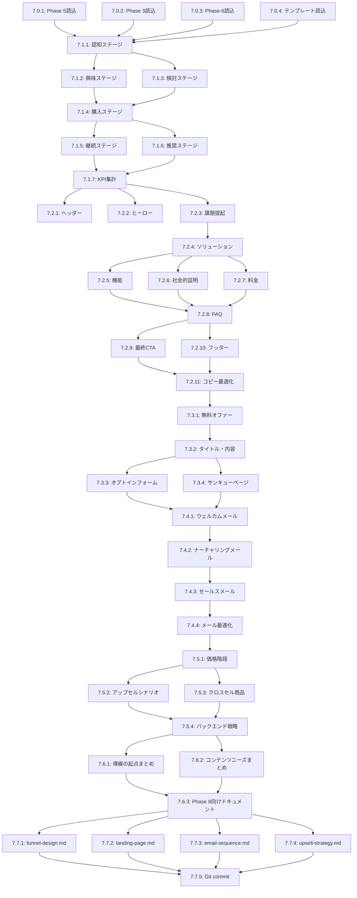

# Phase 7: FunnelDesignAgent - タスク分解（DAG構造）

## 概要

**Phase 7**: 顧客導線設計（認知→購入→LTV）
**Agent**: FunnelDesignAgent
**合計推定時間**: 264分（約4.5時間）
**並列実行ポイント**: 6箇所（最大4タスク同時実行）

---

## Phase 7.0: 事前準備（並列実行可能）

**依存**: なし | **推定時間**: 9分

| Task ID | タスク名 | 内容 | 並列 |
|---------|---------|------|------|
| 7.0.1 | Phase 5結果読み込み | `docs/product/product-detail.md`（サービス詳細） | ✅ |
| 7.0.2 | Phase 3結果読み込み | `docs/persona/customer-journey-map.md`（カスタマージャーニー） | ✅ |
| 7.0.3 | Phase 6結果読み込み | `docs/content/content-plan.md`（コンテンツ計画） | ✅ |
| 7.0.4 | テンプレート読み込み | `docs/templates/07-funnel-design-template.md` | ✅ |

**Entity-Relation Mapping**:
```
N1:ProductDetail $H→ N2:FunnelDesignAgent $H→ N3:CustomerFunnel
N1:CustomerJourneyMap $H→ N2:FunnelDesignAgent
N1:ContentPlan $L→ N2:FunnelDesignAgent
```

---

## Phase 7.1: ファネル全体設計

**依存**: 7.0完了 | **推定時間**: 60分

| Task ID | タスク名 | 内容 | 依存 | 並列 |
|---------|---------|------|------|------|
| 7.1.1 | 認知ステージ設計 | 流入チャネル、目標リーチ、KPI設定 | 7.0 | ✅ |
| 7.1.2 | 興味ステージ設計 | タッチポイント、目標訪問者、転換率設定 | 7.0 | ✅ |
| 7.1.3 | 検討ステージ設計 | リードマグネット、メール、転換率設定 | 7.0 | ✅ |
| 7.1.4 | 購入ステージ設計 | 決済ページ、転換率、CVR設定 | 7.1.1-7.1.3 | ❌ |
| 7.1.5 | 継続ステージ設計 | オンボーディング、チャーン率、継続率設定 | 7.1.4 | ✅ |
| 7.1.6 | 推奨ステージ設計 | SNS、紹介プログラム、NPS設定 | 7.1.4 | ✅ |
| 7.1.7 | ファネル全体KPI集計 | 6ステージの転換率・累積転換率表作成 | 7.1.5-7.1.6 | ❌ |

**Entity-Relation Mapping**:
```
N1:AwarenessStage $H→ N2:InterestStage $H→ N3:ConsiderationStage
N3:ConsiderationStage $H→ N2:PurchaseStage $H→ N3:RetentionStage
N3:RetentionStage $H→ N2:AdvocacyStage $H→ N3:FunnelKPI
```

---

## Phase 7.2: ランディングページ設計

**依存**: 7.1完了 | **推定時間**: 70分

| Task ID | タスク名 | 内容 | 依存 | 並列 |
|---------|---------|------|------|------|
| 7.2.1 | ヘッダー設計 | ロゴ、ナビゲーション、CTAボタン | 7.1 | ✅ |
| 7.2.2 | ヒーローセクション設計 | 見出し（30文字）、サブ見出し、画像、CTA、社会的証明 | 7.1 | ✅ |
| 7.2.3 | 課題提起セクション設計 | 3つの悩み提示 | 7.1 | ✅ |
| 7.2.4 | ソリューションセクション設計 | 3つのコアバリュー提示 | 7.2.3 | ❌ |
| 7.2.5 | 機能セクション設計 | 各機能のスクリーンショット、説明文 | 7.2.4 | ✅ |
| 7.2.6 | 社会的証明セクション設計 | 3つのTestimonial | 7.2.4 | ✅ |
| 7.2.7 | 料金セクション設計 | プランカード（Basic, Pro, Enterprise） | 7.2.4 | ✅ |
| 7.2.8 | FAQセクション設計 | 5つのQ&A | 7.2.5-7.2.7 | ❌ |
| 7.2.9 | 最終CTAセクション設計 | 見出し、サブ見出し、CTAボタン | 7.2.8 | ✅ |
| 7.2.10 | フッター設計 | プライバシーポリシー、利用規約、SNSリンク | 7.2.8 | ✅ |
| 7.2.11 | コピーライティング最適化 | ベネフィット強調、具体的数字、緊急性演出 | 7.2.9-7.2.10 | ❌ |

**Entity-Relation Mapping**:
```
N1:LandingPageStructure $H→ N2:HeroSection $H→ N3:ProblemSolution
N3:ProblemSolution $H→ N2:SocialProof $H→ N3:PricingSection
N3:PricingSection $H→ N2:CopyOptimization $H→ N3:FinalLP
```

---

## Phase 7.3: リードマグネット設計

**依存**: 7.2完了 | **推定時間**: 40分

| Task ID | タスク名 | 内容 | 依存 | 並列 |
|---------|---------|------|------|------|
| 7.3.1 | 無料オファー設計 | eBook/チェックリスト/テンプレート選定 | 7.2 | ❌ |
| 7.3.2 | オファータイトル・内容設計 | タイトル、ページ数、提供価値、ターゲット | 7.3.1 | ❌ |
| 7.3.3 | オプトインフォーム設計 | 見出し、入力項目（名前、メール、職業） | 7.3.2 | ✅ |
| 7.3.4 | サンキューページ設計 | 見出し、次ステップ案内、SNSフォロー誘導 | 7.3.2 | ✅ |

**Entity-Relation Mapping**:
```
N1:LeadMagnet $H→ N2:OptInForm $H→ N3:ThankYouPage
```

---

## Phase 7.4: メールシーケンス設計

**依存**: 7.3完了 | **推定時間**: 55分

| Task ID | タスク名 | 内容 | 依存 | 並列 |
|---------|---------|------|------|------|
| 7.4.1 | ウェルカムメール設計（Day 1-7） | 7通のメール（Day 1: ウェルカム、Day 2-7: バリュー提供） | 7.3 | ❌ |
| 7.4.2 | ナーチャリングメール設計（Week 2-4） | 3週間分の教育コンテンツメール | 7.4.1 | ❌ |
| 7.4.3 | セールスメール設計（Week 5-6） | Week 5: オファー紹介、Week 6: ラストチャンス | 7.4.2 | ❌ |
| 7.4.4 | メールベストプラクティス適用 | 件名最適化、パーソナライゼーション、モバイル対応 | 7.4.3 | ❌ |

**Entity-Relation Mapping**:
```
N1:WelcomeEmail $H→ N2:NurturingEmail $H→ N3:SalesEmail
N3:SalesEmail $H→ N2:EmailOptimization $H→ N3:EmailSequence
```

---

## Phase 7.5: アップセル/クロスセル設計

**依存**: 7.4完了 | **推定時間**: 40分

| Task ID | タスク名 | 内容 | 依存 | 並列 |
|---------|---------|------|------|------|
| 7.5.1 | 価格階段設計 | 5ステップ（無料→Basic→Pro→コンサル→法人） | 7.4 | ❌ |
| 7.5.2 | アップセルシナリオ設計 | Basic→Pro、Pro→コンサル（トリガー、タイミング、インセンティブ） | 7.5.1 | ✅ |
| 7.5.3 | クロスセル商品設計 | 追加コンテンツ、コミュニティ、1on1セッション | 7.5.1 | ✅ |
| 7.5.4 | バックエンド戦略設計 | LTV最大化、チャーン防止、リファラルプログラム | 7.5.2-7.5.3 | ❌ |

**Entity-Relation Mapping**:
```
N1:PriceLadder $H→ N2:UpsellScenario $H→ N3:BackendStrategy
N1:PriceLadder $H→ N2:CrossSell $H→ N3:BackendStrategy
```

---

## Phase 7.6: 次フェーズへの引き継ぎ

**依存**: 7.5完了 | **推定時間**: 15分

| Task ID | タスク名 | 内容 | 依存 | 並列 |
|---------|---------|------|------|------|
| 7.6.1 | 導線の起点情報まとめ | SNS→LP誘導、各SNSでの訴求ポイント | 7.5 | ✅ |
| 7.6.2 | コンテンツニーズまとめ | SNS投稿用コンテンツ、リードマグネット告知 | 7.5 | ✅ |
| 7.6.3 | Phase 8向けドキュメント | SNSStrategyAgentへの引き継ぎ資料 | 7.6.1-7.6.2 | ❌ |

**Entity-Relation Mapping**:
```
N1:FunnelEntry $H→ N2:SNSStrategyAgent $H→ N3:Phase8Input
```

---

## Phase 7.7: ドキュメント出力（並列実行可能）

**依存**: 7.6完了 | **推定時間**: 15分

| Task ID | タスク名 | 内容 | 依存 | 並列 |
|---------|---------|------|------|------|
| 7.7.1 | funnel-design.md作成 | ファネル全体図（4,000文字） | 7.6 | ✅ |
| 7.7.2 | landing-page.md作成 | LP設計書（4,500文字） | 7.6 | ✅ |
| 7.7.3 | email-sequence.md作成 | メールシーケンス（3,500文字） | 7.6 | ✅ |
| 7.7.4 | upsell-strategy.md作成 | アップセル戦略（2,500文字） | 7.6 | ✅ |
| 7.7.5 | Git commit & push | Conventional Commits準拠のコミット | 7.7.1-7.7.4 | ❌ |

**Entity-Relation Mapping**:
```
N1:FunnelDoc $H→ N2:GitCommit $H→ N3:Phase7Completion
N1:LPDoc $H→ N2:GitCommit
N1:EmailDoc $H→ N2:GitCommit
N1:UpsellDoc $H→ N2:GitCommit
```

---

## DAG可視化（Mermaid）



---

## 並列実行戦略

**同時実行可能なタスクグループ**:

1. **グループ1（Phase 7.0）**: 7.0.1, 7.0.2, 7.0.3, 7.0.4（4タスク）
2. **グループ2（Phase 7.1）**: 7.1.1, 7.1.2, 7.1.3（3タスク）
3. **グループ3（Phase 7.1）**: 7.1.5, 7.1.6（2タスク）
4. **グループ4（Phase 7.2）**: 7.2.1, 7.2.2, 7.2.3（3タスク）
5. **グループ5（Phase 7.2）**: 7.2.5, 7.2.6, 7.2.7（3タスク）
6. **グループ6（Phase 7.2）**: 7.2.9, 7.2.10（2タスク）
7. **グループ7（Phase 7.3）**: 7.3.3, 7.3.4（2タスク）
8. **グループ8（Phase 7.5）**: 7.5.2, 7.5.3（2タスク）
9. **グループ9（Phase 7.6）**: 7.6.1, 7.6.2（2タスク）
10. **グループ10（Phase 7.7）**: 7.7.1, 7.7.2, 7.7.3, 7.7.4（4タスク）

**最適な並列度**:
- **高スペックマシン**: concurrency=4（Phase 7.0, 7.7で4タスク同時実行）
- **中スペックマシン**: concurrency=3（Phase 7.1, 7.2で3タスク同時実行）
- **低スペックマシン**: concurrency=2（すべてのフェーズで2タスク同時実行）

---

## 成功条件チェックリスト

- [ ] ファネル全体のKPI設計（6ステージ、転換率設定）
- [ ] LP構成とコピー案作成（11セクション）
- [ ] リードマグネット設計（無料オファー、フォーム、サンキューページ）
- [ ] メールシーケンス（Day 1-42）設計
- [ ] アップセル/クロスセル戦略（5ステップ価格階段）
- [ ] Phase 8への引き継ぎ情報の明記

---

## エスカレーション条件

以下の場合、**CoordinatorAgent**にエスカレーション：

- 🚨 **導線設計困難**: 転換率目標が非現実的
- 🚨 **リードマグネットアイデア不足**: 魅力的なオファーが思いつかない
- 🚨 **メールコンテンツ不十分**: 継続的な価値提供ができない

---

## 出力ファイル構成

```
docs/funnel/
├── funnel-design.md           # ファネル全体図（4,000文字）
├── landing-page.md            # LP設計書（4,500文字）
├── email-sequence.md          # メールシーケンス（3,500文字）
└── upsell-strategy.md         # アップセル戦略（2,500文字）
```

---

## Agent割り当て

| Phase | タスク種別 | 推奨Agent | 理由 |
|-------|-----------|-----------|------|
| 7.0-7.2 | ファネル・LP設計 | **FunnelDesignAgent** | 導線設計専門 |
| 7.3-7.4 | リードマグネット・メール設計 | **FunnelDesignAgent** | コンバージョン最適化 |
| 7.5-7.7 | アップセル・ドキュメント作成 | **FunnelDesignAgent** | 全フェーズ統合 |

**すべてのタスクは単一のAgent（FunnelDesignAgent）で実行可能**です。

---

## タスク一覧（Issue作成用）

### Phase 7.0: 事前準備
- [ ] 7.0.1: Phase 5結果読み込み（2分）
- [ ] 7.0.2: Phase 3結果読み込み（2分）
- [ ] 7.0.3: Phase 6結果読み込み（2分）
- [ ] 7.0.4: テンプレート読み込み（3分）

### Phase 7.1: ファネル全体設計
- [ ] 7.1.1: 認知ステージ設計（10分）
- [ ] 7.1.2: 興味ステージ設計（10分）
- [ ] 7.1.3: 検討ステージ設計（10分）
- [ ] 7.1.4: 購入ステージ設計（10分）
- [ ] 7.1.5: 継続ステージ設計（10分）
- [ ] 7.1.6: 推奨ステージ設計（10分）
- [ ] 7.1.7: ファネル全体KPI集計（10分）

### Phase 7.2: ランディングページ設計
- [ ] 7.2.1: ヘッダー設計（5分）
- [ ] 7.2.2: ヒーローセクション設計（10分）
- [ ] 7.2.3: 課題提起セクション設計（5分）
- [ ] 7.2.4: ソリューションセクション設計（10分）
- [ ] 7.2.5: 機能セクション設計（8分）
- [ ] 7.2.6: 社会的証明セクション設計（8分）
- [ ] 7.2.7: 料金セクション設計（8分）
- [ ] 7.2.8: FAQセクション設計（6分）
- [ ] 7.2.9: 最終CTAセクション設計（5分）
- [ ] 7.2.10: フッター設計（3分）
- [ ] 7.2.11: コピーライティング最適化（12分）

### Phase 7.3: リードマグネット設計
- [ ] 7.3.1: 無料オファー設計（10分）
- [ ] 7.3.2: オファータイトル・内容設計（12分）
- [ ] 7.3.3: オプトインフォーム設計（8分）
- [ ] 7.3.4: サンキューページ設計（10分）

### Phase 7.4: メールシーケンス設計
- [ ] 7.4.1: ウェルカムメール設計（20分）
- [ ] 7.4.2: ナーチャリングメール設計（15分）
- [ ] 7.4.3: セールスメール設計（12分）
- [ ] 7.4.4: メールベストプラクティス適用（8分）

### Phase 7.5: アップセル/クロスセル設計
- [ ] 7.5.1: 価格階段設計（10分）
- [ ] 7.5.2: アップセルシナリオ設計（12分）
- [ ] 7.5.3: クロスセル商品設計（10分）
- [ ] 7.5.4: バックエンド戦略設計（8分）

### Phase 7.6: 次フェーズへの引き継ぎ
- [ ] 7.6.1: 導線の起点情報まとめ（6分）
- [ ] 7.6.2: コンテンツニーズまとめ（5分）
- [ ] 7.6.3: Phase 8向けドキュメント（4分）

### Phase 7.7: ドキュメント出力
- [ ] 7.7.1: funnel-design.md作成（4分）
- [ ] 7.7.2: landing-page.md作成（4分）
- [ ] 7.7.3: email-sequence.md作成（3分）
- [ ] 7.7.4: upsell-strategy.md作成（3分）
- [ ] 7.7.5: Git commit & push（4分）

---

**Phase 7タスク分解完了** ✅

作成日: 2025-10-15
