# Miyabi 完全自律化マスタープラン

**作成日**: 2025-10-26
**バージョン**: 1.0.0
**ステータス**: 🚧 設計中

**目的**: Claude Code Interactive Mode と Headless Mode を完全に切り分け、Miyabiプロジェクトの完全自動化・自律化を実現する

---

## 📖 目次

1. [概要](#概要)
2. [基本原則](#基本原則)
3. [プロセスフロー全体像](#プロセスフロー全体像)
4. [Interactive vs Headless 完全分離戦略](#interactive-vs-headless-完全分離戦略)
5. [決定木マッピング](#決定木マッピング)
6. [確定プロセスのスクリプト化](#確定プロセスのスクリプト化)
7. [AI判断ポイントの設計](#ai判断ポイントの設計)
8. [Claude Agent SDK統合戦略](#claude-agent-sdk統合戦略)
9. [セーフティメカニズム](#セーフティメカニズム)
10. [実装ロードマップ](#実装ロードマップ)

---

## 概要

### 🎯 プロジェクトゴール

**"Claude Codeを動力源とした完全自律型開発プラットフォーム"**

```
Issue作成 → 自動分析 → タスク分解 → 並列実装 → PR作成 → レビュー → デプロイ
     ↑                                                              ↓
     └──────────────────── 継続的な改善サイクル ──────────────────────┘
```

### 🔑 成功の鍵

1. **完全分離**: Interactive Modeは人間の判断が必要な箇所のみ
2. **スクリプト優先**: 確定プロセスは100%スクリプト化
3. **条件分岐**: AI判断ポイントは明確な条件分岐で制御
4. **安全第一**: エラー検出・ロールバック・エスカレーション機構
5. **段階的移行**: 一気に自動化せず、段階的にHeadless化

### 📊 現状分析

#### ✅ 既に存在するコンポーネント

- **14個のBusiness Agents**: Rust実装完了
- **Entity-Relation Model**: 14 Entities, 39 Relationships
- **Worktree並列実行**: Git Worktreeベースの並列Agent実行
- **Label体系**: 53 Labels（10カテゴリ）
- **MCP Server**: JSON-RPC 2.0 Agent実行エンドポイント
- **Stream Deck統合**: 32ボタンInteractive Mode制御

#### 🚧 必要な新規コンポーネント

- **Headless Orchestrator**: Headless Mode全体制御
- **Decision Engine**: 条件分岐エンジン
- **Claude Agent SDK Wrapper**: SDK統合レイヤー
- **Safety Monitor**: 異常検知・ロールバック
- **State Machine**: プロセス状態管理

---

## 基本原則

### Rule 1: モード分離原則

**"Interactive Modeは人間のため、Headless Modeは機械のため"**

| モード | 用途 | トリガー | セッション |
|--------|------|---------|-----------|
| **Interactive** | 戦略的判断、レビュー、承認 | Stream Deck、手動操作 | 永続的（開発セッション） |
| **Headless** | 自動実行、バッチ処理、CI/CD | Label、Webhook、Cron | 一時的（タスク完了まで） |

### Rule 2: 確定プロセス優先原則

**"スクリプト化可能なものは全てスクリプト化"**

```
✅ スクリプト化対象:
- ビルド・テスト・Lint実行
- Git操作（commit, push, merge）
- Label付与・削除
- Issue/PRのCRUD操作
- デプロイ実行
- ログ記録

❌ スクリプト化不可（AI判断必要）:
- Issue内容の意図理解
- タスク分解の適切性判断
- コード設計の妥当性判定
- エスカレーション判断
- セキュリティリスク評価
```

### Rule 3: 条件分岐制御原則

**"AI判断は明確な条件分岐で導く"**

```bash
# Good: 明確な条件分岐
if [ "$quality_score" -ge 80 ]; then
  # 確定プロセス: 自動マージ
  gh pr merge --auto
elif [ "$quality_score" -ge 60 ]; then
  # AI判断: Claude Code Headless Modeでコードレビュー
  claude -p "Review this PR and suggest improvements" --output-format json
else
  # 確定プロセス: エスカレーション
  escalate_to_human "TechLead" "Quality score too low: $quality_score"
fi
```

### Rule 4: セーフティファースト原則

**"常に安全側に倒す"**

```
1. エラー検出 → 即座に停止
2. 不明な状態 → 人間にエスカレーション
3. 重要な変更 → ドライラン必須
4. 本番デプロイ → ヘルスチェック必須
5. 失敗検知 → 自動ロールバック
```

### Rule 5: 段階的自動化原則

**"一気に自動化せず、段階的にHeadless化"**

```
Level 0: 完全手動（人間が全て操作）
  ↓
Level 1: 半自動（人間が確認してHeadless実行）
  ↓
Level 2: 条件付き自動（特定条件のみHeadless実行）
  ↓
Level 3: 完全自動（すべてHeadless実行、人間は監視のみ）
```

---

## プロセスフロー全体像

### 🌊 End-to-End 自律化フロー

```mermaid
graph TB
    Start[Issue作成] --> Analyze{分析必要?}

    %% Phase 1: Issue分析
    Analyze -->|Yes| IssueAnalysis[IssueAgent\nHeadless]
    Analyze -->|No| ManualLabel[手動Label付与\nInteractive]

    IssueAnalysis --> LabelApply[Label自動付与\nScript]
    ManualLabel --> LabelApply

    %% Phase 2: タスク分解
    LabelApply --> TriggerCheck{trigger:agent-execute?}
    TriggerCheck -->|Yes| Coordinator[CoordinatorAgent\nHeadless]
    TriggerCheck -->|No| Wait[待機]

    Coordinator --> DAGBuild[DAG構築\nScript]
    DAGBuild --> ComplexityCheck{複雑度チェック}

    ComplexityCheck -->|Simple| AutoApprove[自動承認\nScript]
    ComplexityCheck -->|Complex| HumanReview[人間レビュー\nInteractive]

    AutoApprove --> WorktreeCreate[Worktree作成\nScript]
    HumanReview -->|承認| WorktreeCreate
    HumanReview -->|拒否| Escalate1[エスカレーション\nScript]

    %% Phase 3: 並列実装
    WorktreeCreate --> ParallelExec[並列Agent実行\nHeadless]
    ParallelExec --> CodeGen[CodeGenAgent\nHeadless]
    ParallelExec --> Test[テスト実行\nScript]

    CodeGen --> QualityCheck{品質チェック}
    Test --> QualityCheck

    %% Phase 4: レビュー
    QualityCheck -->|Pass| PRCreate[PR作成\nScript]
    QualityCheck -->|Fail| AutoFix{自動修正可能?}

    AutoFix -->|Yes| FixApply[自動修正\nHeadless]
    AutoFix -->|No| Escalate2[エスカレーション\nScript]

    FixApply --> QualityCheck

    PRCreate --> ReviewAgent[ReviewAgent\nHeadless]
    ReviewAgent --> ScoreCheck{Score >= 80?}

    ScoreCheck -->|Yes| AutoMerge[自動マージ\nScript]
    ScoreCheck -->|No| HumanReview2[人間レビュー\nInteractive]

    HumanReview2 -->|承認| AutoMerge
    HumanReview2 -->|修正依頼| FixApply

    %% Phase 5: デプロイ
    AutoMerge --> DeployCheck{デプロイ必要?}
    DeployCheck -->|Yes| DeployStaging[Staging\nHeadless]
    DeployCheck -->|No| Done[完了]

    DeployStaging --> HealthCheck{ヘルスチェック}
    HealthCheck -->|OK| DeployProd[Production\nHeadless]
    HealthCheck -->|NG| Rollback[ロールバック\nScript]

    DeployProd --> HealthCheck2{ヘルスチェック}
    HealthCheck2 -->|OK| Done
    HealthCheck2 -->|NG| Rollback2[ロールバック\nScript]

    Rollback --> Escalate3[エスカレーション\nScript]
    Rollback2 --> Escalate3

    style Start fill:#e3f2fd
    style Done fill:#c8e6c9
    style Escalate1 fill:#ffccbc
    style Escalate2 fill:#ffccbc
    style Escalate3 fill:#ffccbc
```



### 📊 モード使用統計（目標）

| フェーズ | Interactive | Headless | Script | AI判断 |
|---------|-------------|----------|--------|--------|
| **Issue分析** | 10% | 70% | 20% | 70% |
| **タスク分解** | 20% | 60% | 20% | 60% |
| **実装** | 5% | 80% | 15% | 80% |
| **レビュー** | 15% | 70% | 15% | 70% |
| **デプロイ** | 5% | 20% | 75% | 20% |
| **全体平均** | 11% | 60% | 29% | 60% |

**目標**: 人間介入を全体の **11%** まで削減

---

## Interactive vs Headless 完全分離戦略

### 🔵 Interactive Mode 使用ケース

**"人間の創造性・判断が必要な場面"**

#### 1. 戦略的判断

```bash
# Stream Deck ボタン経由
# 01-next.sh → "Issue #270 を確認して、実装方針を提案してください"

# Claude Code Interactive Mode で:
# - Issue内容の深い理解
# - アーキテクチャ設計の妥当性判断
# - ビジネス要件との整合性確認
```

**判断基準**:
- 新規機能の設計方針
- アーキテクチャ変更の承認
- ビジネス要件の解釈

#### 2. コードレビュー（重要な変更）

```bash
# 重要度が高い変更（core, auth, security関連）
if [ "$module" = "miyabi-core" ] || [ "$module" = "auth" ]; then
  # Interactive Mode: Stream Deck "03-fix.sh"
  # 人間が直接レビュー
  echo "Critical module - manual review required"
  exit 1
fi
```

**判断基準**:
- `miyabi-core`, `miyabi-auth`, `miyabi-security` の変更
- 10ファイル以上の大規模変更
- 破壊的変更（breaking changes）

#### 3. エスカレーション対応

```bash
# Headless Modeでエスカレーション発生
# → Interactive Modeに通知

# Stream Deck "29-voice.sh" 経由
tools/voicevox_enqueue.sh "エスカレーションが発生しました。Issue ${ISSUE_NUM} を確認してください"

# Interactive Mode で判断
# → 対応方針決定
```

**判断基準**:
- セキュリティ脆弱性（Sev.1-2）
- システムレベル障害
- 要件不明確

### 🔴 Headless Mode 使用ケース

**"機械的に実行可能なタスク"**

#### 1. Issue自動分析

```bash
#!/bin/bash
# tools/claude-headless/analyze-issue.sh

ISSUE_NUM="$1"

# Phase 1: Issue情報取得（確定プロセス）
gh issue view "$ISSUE_NUM" --json title,body,labels > /tmp/issue-$ISSUE_NUM.json

# Phase 2: AI分析（Headless Mode）
claude -p "Analyze Issue #${ISSUE_NUM} and suggest appropriate labels" \
  --output-format json \
  --allowedTools "Read,Grep" \
  > /tmp/analysis-$ISSUE_NUM.json

# Phase 3: Label自動付与（確定プロセス）
SUGGESTED_LABELS=$(jq -r '.result.labels[]' /tmp/analysis-$ISSUE_NUM.json)
gh issue edit "$ISSUE_NUM" --add-label "$SUGGESTED_LABELS"
```

#### 2. 並列Agent実行

```bash
#!/bin/bash
# tools/claude-headless/parallel-agents.sh

ISSUES=("$@")

for issue in "${ISSUES[@]}"; do
  # 各IssueをHeadless Modeで並列実行
  (
    claude -p "Process Issue #$issue completely" \
      --append-system-prompt "$(cat .claude/agents/prompts/coding/coordinator.md)" \
      --output-format json \
      > "/tmp/agent-issue-$issue.json" &
  )
done

wait  # すべてのAgent完了を待機
```

#### 3. CI/CDパイプライン

```yaml
# .github/workflows/autonomous-agent.yml

on:
  issues:
    types: [labeled]

jobs:
  autonomous-execution:
    if: contains(github.event.label.name, 'trigger:agent-execute')
    runs-on: ubuntu-latest
    steps:
      - name: Execute Headless Agent
        run: |
          # Headless Mode自動実行
          tools/claude-headless/execute-pipeline.sh ${{ github.event.issue.number }}
```

---

## 決定木マッピング

### 🌳 全プロセスの決定ポイント

#### Decision Tree: Issue → Deployment

```
D1: Issue作成時
├─ Label "trigger:agent-execute" 付与？
│  ├─ Yes → [HEADLESS] CoordinatorAgent起動
│  └─ No → [WAIT] 手動Label付与待機

D2: Issue分析完了時
├─ 複雑度 <= 3（Simple）？
│  ├─ Yes → [SCRIPT] 自動承認 → 実装開始
│  └─ No → [INTERACTIVE] 人間レビュー
│     ├─ 承認 → [SCRIPT] 実装開始
│     └─ 拒否 → [SCRIPT] エスカレーション

D3: タスク分解完了時
├─ 循環依存あり？
│  ├─ Yes → [SCRIPT] エラー通知 → 停止
│  └─ No → [SCRIPT] DAG構築 → 並列実行

D4: コード生成完了時
├─ コンパイルエラーあり？
│  ├─ Yes → [HEADLESS] AutoFixAgent起動
│  │  ├─ 修正成功 → [SCRIPT] 再テスト
│  │  └─ 修正失敗 → [SCRIPT] エスカレーション
│  └─ No → [SCRIPT] 次フェーズへ

D5: テスト実行完了時
├─ すべてPass？
│  ├─ Yes → [SCRIPT] PR作成
│  └─ No → [HEADLESS] テスト修正
│     ├─ 修正成功 → [SCRIPT] 再テスト
│     └─ 修正失敗（3回目） → [SCRIPT] エスカレーション

D6: PR作成完了時
├─ Quality Score >= 80？
│  ├─ Yes → [SCRIPT] 自動マージ
│  └─ No → [INTERACTIVE] 人間レビュー
│     ├─ 承認 → [SCRIPT] マージ
│     └─ 修正依頼 → [HEADLESS] 修正実行

D7: マージ完了時
├─ Label "deploy:staging" or "deploy:production" あり？
│  ├─ Yes → [HEADLESS] DeploymentAgent起動
│  └─ No → [DONE] 完了

D8: Staging デプロイ完了時
├─ ヘルスチェック OK？
│  ├─ Yes → [SCRIPT] Production デプロイ
│  └─ No → [SCRIPT] ロールバック → エスカレーション

D9: Production デプロイ完了時
├─ ヘルスチェック OK？
│  ├─ Yes → [DONE] 完了通知
│  └─ No → [SCRIPT] 緊急ロールバック → 緊急エスカレーション
```

### 📋 決定ポイント分類表

| ID | 決定ポイント | 判断主体 | モード | 自動化可能 |
|----|------------|---------|--------|----------|
| D1 | Label確認 | Script | N/A | ✅ 100% |
| D2 | 複雑度判定 | AI + Rule | Headless + Script | ✅ 80% |
| D3 | 循環依存検出 | Script | N/A | ✅ 100% |
| D4 | コンパイル結果判定 | Script | N/A | ✅ 100% |
| D5 | テスト結果判定 | Script | N/A | ✅ 100% |
| D6 | 品質スコア判定 | AI + Rule | Headless + Script | ✅ 90% |
| D7 | デプロイLabel確認 | Script | N/A | ✅ 100% |
| D8 | Stagingヘルスチェック | Script | N/A | ✅ 100% |
| D9 | Productionヘルスチェック | Script | N/A | ✅ 100% |

**自動化率**: 平均 **90.5%**

---

## 確定プロセスのスクリプト化

### 🔧 スクリプト群の設計

#### 1. 基盤スクリプト（Primitives）

**`scripts/primitives/`**

```bash
# scripts/primitives/check-label.sh
#!/bin/bash
# Usage: check-label.sh <issue_number> <label_name>
gh issue view "$1" --json labels \
  | jq -r ".labels[].name" \
  | grep -q "^$2$"
```

```bash
# scripts/primitives/add-label.sh
#!/bin/bash
# Usage: add-label.sh <issue_number> <label_name>
gh issue edit "$1" --add-label "$2"
```

```bash
# scripts/primitives/run-tests.sh
#!/bin/bash
# Usage: run-tests.sh
cargo test --all 2>&1 | tee /tmp/test-results.log
exit "${PIPESTATUS[0]}"
```

```bash
# scripts/primitives/check-quality-score.sh
#!/bin/bash
# Usage: check-quality-score.sh <score>
# Returns: 0 if score >= 80, 1 otherwise
[ "$1" -ge 80 ]
```

#### 2. 条件分岐スクリプト（Decision Trees）

**`scripts/decision-trees/`**

```bash
# scripts/decision-trees/issue-triage.sh
#!/bin/bash
# Issue自動振り分け

set -e

ISSUE_NUM="$1"

# D1: Label確認
if scripts/primitives/check-label.sh "$ISSUE_NUM" "trigger:agent-execute"; then
  echo "✅ Auto-execute triggered"

  # Headless Mode起動
  tools/claude-headless/coordinator-agent.sh "$ISSUE_NUM"

else
  echo "⏸️ Waiting for manual label"
  exit 0
fi
```

```bash
# scripts/decision-trees/code-quality-gate.sh
#!/bin/bash
# コード品質ゲート

set -e

SCORE="$1"
PR_NUM="$2"

# D6: 品質スコア判定
if scripts/primitives/check-quality-score.sh "$SCORE"; then
  echo "✅ Quality score $SCORE >= 80 - Auto-merge approved"

  # 自動マージ（確定プロセス）
  gh pr merge "$PR_NUM" --auto --squash

else
  echo "⚠️ Quality score $SCORE < 80 - Manual review required"

  # Interactive Mode通知（Stream Deck経由）
  tools/stream-deck/29-voice.sh "PR ${PR_NUM} requires manual review. Score: ${SCORE}"

  # Label付与
  gh issue edit "$PR_NUM" --add-label "needs-review"

  exit 1
fi
```

#### 3. オーケストレーションスクリプト（Orchestrators）

**`scripts/orchestrators/`**

```bash
# scripts/orchestrators/autonomous-pipeline.sh
#!/bin/bash
# 完全自律パイプライン

set -e

ISSUE_NUM="$1"

echo "🚀 Starting autonomous pipeline for Issue #${ISSUE_NUM}"

# Phase 1: Issue分析
echo "📋 Phase 1: Analyzing Issue"
tools/claude-headless/01-process-issue.sh "$ISSUE_NUM"

# Phase 2: タスク分解
echo "🔀 Phase 2: Decomposing into tasks"
tools/claude-headless/coordinator-decompose.sh "$ISSUE_NUM"

# Phase 3: 並列実装
echo "⚡ Phase 3: Parallel execution"
tools/claude-headless/02-parallel-agent.sh "$ISSUE_NUM"

# Phase 4: 品質チェック
echo "✨ Phase 4: Quality check"
SCORE=$(scripts/primitives/get-quality-score.sh "$ISSUE_NUM")

# Phase 5: 条件分岐
scripts/decision-trees/code-quality-gate.sh "$SCORE" "$ISSUE_NUM"

# Phase 6: デプロイ（オプション）
if scripts/primitives/check-label.sh "$ISSUE_NUM" "deploy:staging"; then
  echo "🚀 Phase 6: Deploying to staging"
  scripts/orchestrators/deploy-staging.sh "$ISSUE_NUM"
fi

echo "✅ Pipeline completed successfully"
```

---

## AI判断ポイントの設計

### 🤖 AI判断が必要な箇所

#### 1. Issue内容理解（高レベル）

**入力**: Issue title + body
**出力**: 意図、要件、推奨Action

```bash
# Headless Mode
claude -p "Analyze Issue #${ISSUE_NUM}:

Title: ${TITLE}

Description:
${BODY}

Instructions:
1. Understand the user's intent
2. Classify the issue type (feature/bug/refactor/docs)
3. Estimate complexity (Low/Medium/High)
4. Suggest appropriate labels
5. Recommend implementation approach

Output JSON format:
{
  \"intent\": \"...\",
  \"type\": \"feature\",
  \"complexity\": \"Medium\",
  \"suggestedLabels\": [...],
  \"approach\": \"...\"
}
" --output-format json
```

**条件分岐**:
```bash
COMPLEXITY=$(jq -r '.complexity' /tmp/analysis.json)

if [ "$COMPLEXITY" = "Low" ]; then
  # 低複雑度 → 自動実装
  AUTO_APPROVE=true
elif [ "$COMPLEXITY" = "Medium" ]; then
  # 中複雑度 → AI判断
  claude -p "Should we auto-approve this Medium complexity task?" --output-format json
else
  # 高複雑度 → 人間判断
  AUTO_APPROVE=false
fi
```

#### 2. タスク分解（中レベル）

**入力**: Issue全体
**出力**: Task[] + DAG

```bash
claude -p "Decompose Issue #${ISSUE_NUM} into actionable tasks:

1. Break down into 3-7 tasks
2. Define dependencies (DAG)
3. Assign agent types
4. Estimate duration

Output JSON:
{
  \"tasks\": [{
    \"id\": \"T1\",
    \"title\": \"...\",
    \"dependencies\": [],
    \"agent\": \"CodeGenAgent\",
    \"estimatedMinutes\": 30
  }],
  \"dag\": {
    \"nodes\": [...],
    \"edges\": [...]
  }
}
" --output-format json
```

**条件分岐**:
```bash
TASK_COUNT=$(jq '.tasks | length' /tmp/decomposition.json)
HAS_CYCLES=$(jq '.dag.hasCycles' /tmp/decomposition.json)

if [ "$HAS_CYCLES" = "true" ]; then
  # 循環依存 → エラー
  echo "❌ Circular dependency detected"
  exit 1
elif [ "$TASK_COUNT" -gt 7 ]; then
  # タスク数多すぎ → 人間レビュー
  echo "⚠️ Too many tasks ($TASK_COUNT) - manual review required"
  exit 1
else
  # OK → 実行
  echo "✅ DAG validated - proceeding"
fi
```

#### 3. コード生成（低レベル）

**入力**: Task仕様
**出力**: コード + テスト

```bash
claude -p "Generate code for Task ${TASK_ID}:

Title: ${TASK_TITLE}
Description: ${TASK_DESC}

Requirements:
1. Write Rust code following project conventions
2. Add comprehensive tests
3. Add Rustdoc comments
4. Ensure clippy passes

Output:
- List of files to create/modify
- Code implementation
- Test cases
" --output-format json \
  --allowedTools "Read,Write,Edit,Bash(cargo)"
```

**条件分岐**:
```bash
# コンパイルチェック
if cargo build 2>&1 | tee /tmp/build.log; then
  echo "✅ Build successful"
else
  # ビルド失敗 → 自動修正試行
  echo "❌ Build failed - attempting auto-fix"

  BUILD_ERROR=$(tail -20 /tmp/build.log)

  claude -p "Fix this build error:

${BUILD_ERROR}

Fix the code and re-run cargo build.
" --output-format json --allowedTools "Read,Edit,Bash(cargo build)"

  # 再ビルド
  if cargo build; then
    echo "✅ Auto-fix successful"
  else
    echo "❌ Auto-fix failed - escalating"
    scripts/primitives/escalate.sh "TechLead" "Build errors could not be auto-fixed"
    exit 1
  fi
fi
```

### 🎯 AI判断の信頼性向上戦略

#### 1. プロンプトエンジニアリング

```bash
# ❌ Bad: 曖昧な指示
claude -p "Fix this"

# ✅ Good: 具体的な指示 + 制約
claude -p "Fix the following build error in Rust:

Error: ${ERROR_MESSAGE}

Constraints:
- Do not change public APIs
- Maintain backward compatibility
- Add tests for the fix
- Follow Rust 2021 Edition conventions

Steps:
1. Analyze the error
2. Identify the root cause
3. Apply the minimal fix
4. Verify with cargo build
5. Add regression test

Output format: JSON with 'fixed_files' and 'test_added' fields
"
```

#### 2. Few-Shot Learning

```bash
# 過去の成功例を含める
claude -p "Analyze this Issue like the following examples:

Example 1:
Issue: 'Add user authentication'
Analysis: {
  \"type\": \"feature\",
  \"complexity\": \"High\",
  \"labels\": [\"type:feature\", \"priority:P1\", \"agent:codegen\"]
}

Example 2:
Issue: 'Fix typo in README'
Analysis: {
  \"type\": \"docs\",
  \"complexity\": \"Low\",
  \"labels\": [\"type:docs\", \"priority:P3\"]
}

Now analyze:
Issue: '${TITLE}'
Description: '${BODY}'
"
```

#### 3. Validation & Retry

```bash
# AI出力の検証
validate_ai_output() {
  local output="$1"

  # JSON形式チェック
  if ! jq . <<< "$output" > /dev/null 2>&1; then
    echo "Invalid JSON output"
    return 1
  fi

  # 必須フィールドチェック
  if ! jq -e '.type' <<< "$output" > /dev/null; then
    echo "Missing 'type' field"
    return 1
  fi

  # 値の範囲チェック
  local complexity=$(jq -r '.complexity' <<< "$output")
  if [[ ! "$complexity" =~ ^(Low|Medium|High)$ ]]; then
    echo "Invalid complexity value: $complexity"
    return 1
  fi

  return 0
}

# リトライロジック
MAX_RETRIES=3
for i in $(seq 1 $MAX_RETRIES); do
  OUTPUT=$(claude -p "$PROMPT" --output-format json)

  if validate_ai_output "$OUTPUT"; then
    echo "✅ Valid output received"
    break
  else
    echo "⚠️ Invalid output - retry $i/$MAX_RETRIES"
    if [ $i -eq $MAX_RETRIES ]; then
      echo "❌ Max retries exceeded - escalating"
      scripts/primitives/escalate.sh "TechLead" "AI output validation failed after $MAX_RETRIES attempts"
      exit 1
    fi
  fi
done
```

---

## Claude Agent SDK統合戦略

### 📦 SDK統合アーキテクチャ

```
┌─────────────────────────────────────────────┐
│          Miyabi Orchestrator                │
│         (Rust + Bash Scripts)              │
└──────────────────┬──────────────────────────┘
                   │
        ┌──────────┴──────────┐
        │                     │
        ▼                     ▼
┌──────────────┐    ┌──────────────────┐
│ Interactive  │    │ Headless Mode    │
│ Mode         │    │ (Claude Agent SDK)│
│ (Stream Deck)│    └─────────┬────────┘
└──────────────┘              │
                    ┌─────────┴─────────┐
                    │                   │
                    ▼                   ▼
            ┌──────────────┐   ┌──────────────┐
            │ Agent Runner │   │ Session Mgr  │
            │ (TypeScript) │   │ (TypeScript) │
            └──────────────┘   └──────────────┘
```

### 🔧 SDK Wrapper実装

#### 1. Rust → TypeScript Bridge

**`crates/miyabi-agent-sdk/src/lib.rs`**

```rust
use serde::{Deserialize, Serialize};
use std::process::Command;

#[derive(Debug, Serialize, Deserialize)]
pub struct AgentRequest {
    pub prompt: String,
    pub agent_type: String,
    pub issue_number: Option<u32>,
    pub output_format: String,
}

#[derive(Debug, Serialize, Deserialize)]
pub struct AgentResponse {
    pub result: String,
    pub total_cost_usd: f64,
    pub duration_ms: u64,
    pub is_error: bool,
}

pub async fn execute_agent_sdk(request: &AgentRequest) -> Result<AgentResponse, Box<dyn std::error::Error>> {
    // TypeScript Wrapper呼び出し
    let output = Command::new("node")
        .arg("scripts/sdk-wrapper/agent-runner.js")
        .arg("--prompt").arg(&request.prompt)
        .arg("--agent-type").arg(&request.agent_type)
        .arg("--output-format").arg(&request.output_format)
        .output()?;

    if !output.status.success() {
        return Err(format!("Agent execution failed: {}", String::from_utf8_lossy(&output.stderr)).into());
    }

    let response: AgentResponse = serde_json::from_slice(&output.stdout)?;
    Ok(response)
}
```

#### 2. TypeScript SDK Wrapper

**`scripts/sdk-wrapper/agent-runner.ts`**

```typescript
import { Claude } from '@anthropic-ai/claude-agent-sdk';
import { readFileSync } from 'fs';

interface AgentConfig {
  prompt: string;
  agentType: string;
  issueNumber?: number;
  outputFormat: 'json' | 'text';
}

async function runAgent(config: AgentConfig) {
  const claude = new Claude({
    apiKey: process.env.ANTHROPIC_API_KEY,
  });

  // Agent固有のプロンプトを読み込み
  const agentPrompt = readFileSync(
    `.claude/agents/prompts/coding/${config.agentType}-agent-prompt.md`,
    'utf-8'
  );

  // セッション作成
  const session = await claude.createSession({
    systemPrompt: agentPrompt,
    tools: ['Read', 'Write', 'Edit', 'Bash'],
    contextLimit: 200000,
  });

  // プロンプト実行
  const startTime = Date.now();
  const result = await session.query(config.prompt);
  const duration = Date.now() - startTime;

  // 結果をJSON出力
  console.log(JSON.stringify({
    result: result.text,
    total_cost_usd: result.usage.totalCostUSD,
    duration_ms: duration,
    is_error: false,
  }));
}

// CLI実行
const args = process.argv.slice(2);
const config: AgentConfig = {
  prompt: args[args.indexOf('--prompt') + 1],
  agentType: args[args.indexOf('--agent-type') + 1],
  outputFormat: args[args.indexOf('--output-format') + 1] as 'json' | 'text',
};

runAgent(config).catch((error) => {
  console.error(JSON.stringify({
    result: error.message,
    total_cost_usd: 0,
    duration_ms: 0,
    is_error: true,
  }));
  process.exit(1);
});
```

#### 3. セッション管理

**`scripts/sdk-wrapper/session-manager.ts`**

```typescript
import { Claude } from '@anthropic-ai/claude-agent-sdk';
import { writeFileSync, readFileSync, existsSync } from 'fs';

interface SessionInfo {
  sessionId: string;
  agentType: string;
  issueNumber: number;
  createdAt: string;
  status: 'active' | 'completed' | 'failed';
}

class SessionManager {
  private sessionsFile = '.miyabi/sessions.json';

  async createSession(agentType: string, issueNumber: number): Promise<string> {
    const claude = new Claude({ apiKey: process.env.ANTHROPIC_API_KEY });

    const session = await claude.createSession({
      systemPrompt: readFileSync(`.claude/agents/prompts/coding/${agentType}-agent-prompt.md`, 'utf-8'),
      tools: ['Read', 'Write', 'Edit', 'Bash', 'Grep', 'Glob'],
    });

    const sessionInfo: SessionInfo = {
      sessionId: session.id,
      agentType,
      issueNumber,
      createdAt: new Date().toISOString(),
      status: 'active',
    };

    // セッション情報を保存
    this.saveSess(sessionInfo);

    return session.id;
  }

  async resumeSession(sessionId: string): Promise<Claude.Session> {
    const claude = new Claude({ apiKey: process.env.ANTHROPIC_API_KEY });
    return await claude.getSession(sessionId);
  }

  private saveSession(info: SessionInfo): void {
    const sessions = this.loadSessions();
    sessions.push(info);
    writeFileSync(this.sessionsFile, JSON.stringify(sessions, null, 2));
  }

  private loadSessions(): SessionInfo[] {
    if (!existsSync(this.sessionsFile)) {
      return [];
    }
    return JSON.parse(readFileSync(this.sessionsFile, 'utf-8'));
  }
}
```

### 📊 SDK使用パターン

#### Pattern 1: One-Shot Execution

```bash
# 単発実行（セッション不要）
cargo run --bin miyabi-sdk -- \
  --agent coordinator \
  --issue 270 \
  --mode headless
```

#### Pattern 2: Multi-Turn Session

```bash
# セッション作成
SESSION_ID=$(cargo run --bin miyabi-sdk -- \
  --agent codegen \
  --issue 270 \
  --create-session)

# 継続実行
cargo run --bin miyabi-sdk -- \
  --session "$SESSION_ID" \
  --prompt "Continue implementation"

# セッション終了
cargo run --bin miyabi-sdk -- \
  --session "$SESSION_ID" \
  --close
```

#### Pattern 3: Context Resumption

```bash
# Interactive Mode で開始（Stream Deck）
# → Headless Modeに引き継ぎ

# Main Session IDを取得
MAIN_SESSION=$(claude --list-sessions | jq -r '.[0].id')

# Headless Modeで継続実行
cargo run --bin miyabi-sdk -- \
  --resume-from "$MAIN_SESSION" \
  --agent codegen \
  --issue 270
```

---

## セーフティメカニズム

### 🛡️ 多層防御アーキテクチャ

```
Layer 1: 入力検証          (Validation)
   ↓
Layer 2: 実行前チェック     (Pre-flight Check)
   ↓
Layer 3: 実行監視          (Runtime Monitoring)
   ↓
Layer 4: 結果検証          (Post-execution Validation)
   ↓
Layer 5: ロールバック       (Rollback on Failure)
   ↓
Layer 6: エスカレーション    (Human Escalation)
```

### 🔍 Layer 1: 入力検証

```bash
# scripts/safety/validate-input.sh

validate_issue_number() {
  local issue_num="$1"

  # 数値チェック
  if ! [[ "$issue_num" =~ ^[0-9]+$ ]]; then
    echo "❌ Invalid issue number: $issue_num"
    return 1
  fi

  # Issue存在チェック
  if ! gh issue view "$issue_num" > /dev/null 2>&1; then
    echo "❌ Issue #$issue_num not found"
    return 1
  fi

  # 状態チェック
  local state=$(gh issue view "$issue_num" --json state -q '.state')
  if [ "$state" = "closed" ]; then
    echo "❌ Issue #$issue_num is already closed"
    return 1
  fi

  echo "✅ Issue #$issue_num validated"
  return 0
}
```

### ✅ Layer 2: 実行前チェック

```bash
# scripts/safety/pre-flight-check.sh

pre_flight_check() {
  local issue_num="$1"

  echo "🔍 Running pre-flight checks for Issue #$issue_num"

  # 1. 依存関係チェック
  if ! command -v claude > /dev/null; then
    echo "❌ Claude CLI not found"
    return 1
  fi

  # 2. APIキーチェック
  if [ -z "$ANTHROPIC_API_KEY" ]; then
    echo "❌ ANTHROPIC_API_KEY not set"
    return 1
  fi

  # 3. Git状態チェック
  if ! git status --porcelain | grep -q .; then
    echo "⚠️ Working tree has uncommitted changes"
    # 自動stash
    git stash push -m "Auto-stash before autonomous execution"
  fi

  # 4. ブランチチェック
  local current_branch=$(git branch --show-current)
  if [ "$current_branch" != "main" ]; then
    echo "⚠️ Not on main branch (current: $current_branch)"
    # 自動切り替え
    git checkout main
  fi

  # 5. 並列実行制限チェック
  local active_agents=$(pgrep -f "claude-headless" | wc -l)
  if [ "$active_agents" -ge 5 ]; then
    echo "❌ Too many active agents ($active_agents/5)"
    return 1
  fi

  echo "✅ Pre-flight checks passed"
  return 0
}
```

### 📊 Layer 3: 実行監視

```bash
# scripts/safety/monitor-execution.sh

monitor_execution() {
  local pid="$1"
  local max_duration_sec="$2"  # デフォルト: 1800秒（30分）
  local start_time=$(date +%s)

  while kill -0 "$pid" 2> /dev/null; do
    local current_time=$(date +%s)
    local elapsed=$((current_time - start_time))

    # タイムアウトチェック
    if [ "$elapsed" -ge "$max_duration_sec" ]; then
      echo "⏰ Execution timeout (${elapsed}s) - killing process $pid"
      kill -TERM "$pid"
      sleep 5
      if kill -0 "$pid" 2> /dev/null; then
        kill -KILL "$pid"
      fi
      return 1
    fi

    # メモリ使用量チェック
    local mem_mb=$(ps -o rss= -p "$pid" | awk '{print int($1/1024)}')
    if [ "$mem_mb" -ge 4096 ]; then
      echo "💾 Memory limit exceeded (${mem_mb}MB) - killing process $pid"
      kill -TERM "$pid"
      return 1
    fi

    sleep 10
  done

  # プロセス終了コードチェック
  wait "$pid"
  return $?
}
```

### ✔️ Layer 4: 結果検証

```bash
# scripts/safety/validate-output.sh

validate_agent_output() {
  local output_file="$1"
  local expected_format="$2"  # "json" or "text"

  # ファイル存在チェック
  if [ ! -f "$output_file" ]; then
    echo "❌ Output file not found: $output_file"
    return 1
  fi

  # ファイルサイズチェック
  local size_bytes=$(stat -f%z "$output_file")
  if [ "$size_bytes" -eq 0 ]; then
    echo "❌ Output file is empty"
    return 1
  fi

  # フォーマット検証
  if [ "$expected_format" = "json" ]; then
    if ! jq . "$output_file" > /dev/null 2>&1; then
      echo "❌ Invalid JSON output"
      return 1
    fi

    # エラーフラグチェック
    local is_error=$(jq -r '.is_error // false' "$output_file")
    if [ "$is_error" = "true" ]; then
      echo "❌ Agent reported error"
      local error_msg=$(jq -r '.result' "$output_file")
      echo "Error message: $error_msg"
      return 1
    fi
  fi

  echo "✅ Output validation passed"
  return 0
}
```

### ⏮️ Layer 5: ロールバック

```bash
# scripts/safety/rollback.sh

rollback_on_failure() {
  local issue_num="$1"
  local failure_point="$2"

  echo "🔄 Rolling back Issue #$issue_num from failure point: $failure_point"

  case "$failure_point" in
    "build")
      # ビルド失敗 → 変更を破棄
      git checkout .
      git clean -fd
      ;;

    "test")
      # テスト失敗 → コミット取り消し
      git reset --hard HEAD~1
      ;;

    "pr")
      # PR作成失敗 → ブランチ削除
      local branch="feature/agent-issue-$issue_num"
      git branch -D "$branch"
      ;;

    "deploy")
      # デプロイ失敗 → 前バージョンに戻す
      local prev_version=$(git describe --tags --abbrev=0 HEAD~1)
      scripts/primitives/deploy-rollback.sh "$prev_version"
      ;;

    *)
      echo "⚠️ Unknown failure point: $failure_point"
      ;;
  esac

  # Issueにコメント
  gh issue comment "$issue_num" --body "🔄 Automatic rollback triggered at: $failure_point"

  # Labelを戻す
  gh issue edit "$issue_num" --remove-label "state:implementing" --add-label "state:failed"
}
```

### 🚨 Layer 6: エスカレーション

```bash
# scripts/safety/escalate.sh

escalate_to_human() {
  local target="$1"      # "TechLead" | "PO" | "CISO" | "CTO" | "DevOps"
  local reason="$2"
  local context="$3"

  echo "🚨 Escalating to $target: $reason"

  # Escalation情報作成
  local escalation_json=$(jq -n \
    --arg target "$target" \
    --arg reason "$reason" \
    --arg context "$context" \
    --arg timestamp "$(date -u +"%Y-%m-%dT%H:%M:%SZ")" \
    '{
      target: $target,
      reason: $reason,
      context: $context,
      timestamp: $timestamp,
      severity: "Sev.2-High"
    }')

  # GitHub Issue comment
  gh issue comment "$ISSUE_NUM" --body "## 🚨 Escalation to $target

**Reason**: $reason

**Context**:
\`\`\`
$context
\`\`\`

**Timestamp**: $(date)

cc @$target"

  # Discord通知（オプション）
  if [ -f "tools/discord-notify.sh" ]; then
    tools/discord-notify.sh "#help-general" "@$target Escalation: $reason"
  fi

  # VOICEVOX音声通知
  if [ -f "tools/voicevox_enqueue.sh" ]; then
    tools/voicevox_enqueue.sh "エスカレーションが発生しました。$target に通知しました"
  fi

  # Stream Deck通知（Interactive Mode）
  if [ -f "tools/stream-deck/29-voice.sh" ]; then
    tools/stream-deck/29-voice.sh "Escalation to $target: $reason"
  fi
}
```

### 🛡️ セーフティ統合フロー

```bash
# scripts/safety/safe-execute.sh
#!/bin/bash
# セーフティメカニズム統合実行

set -e

ISSUE_NUM="$1"
AGENT_TYPE="$2"

# Layer 1: 入力検証
if ! scripts/safety/validate-input.sh "$ISSUE_NUM"; then
  exit 1
fi

# Layer 2: 実行前チェック
if ! scripts/safety/pre-flight-check.sh "$ISSUE_NUM"; then
  escalate_to_human "DevOps" "Pre-flight check failed" "Issue #$ISSUE_NUM"
  exit 1
fi

# Layer 3: 監視付き実行
(
  # Headless Agent実行
  tools/claude-headless/01-process-issue.sh "$ISSUE_NUM" \
    > "/tmp/agent-$ISSUE_NUM.log" 2>&1
) &

AGENT_PID=$!

if ! scripts/safety/monitor-execution.sh "$AGENT_PID" 1800; then
  # タイムアウトまたはリソース超過
  escalate_to_human "DevOps" "Execution monitoring failed" "PID: $AGENT_PID"
  rollback_on_failure "$ISSUE_NUM" "execution"
  exit 1
fi

# Layer 4: 結果検証
if ! scripts/safety/validate-output.sh "/tmp/agent-$ISSUE_NUM.json" "json"; then
  escalate_to_human "TechLead" "Output validation failed" "See /tmp/agent-$ISSUE_NUM.json"
  rollback_on_failure "$ISSUE_NUM" "validation"
  exit 1
fi

echo "✅ Safe execution completed successfully"
```

---

## 実装ロードマップ

### 📅 Phase 0: 設計完了（今ここ）

**期間**: 2025-10-26 ～ 2025-10-27（2日）

- [x] Claude Code Agent SDK調査
- [x] プロジェクトドキュメント詳細読み込み
- [x] 全体アーキテクチャ設計
- [x] 決定木マッピング
- [x] セーフティメカニズム設計
- [ ] マスタープラン完成（このドキュメント）

**成果物**:
- `docs/MIYABI_AUTONOMOUS_OPERATION_MASTER_PLAN.md`（このファイル）

---

### 📅 Phase 1: 決定木マッピング実装

**期間**: 2025-10-27 ～ 2025-10-29（3日）

#### タスク

1. **全プロセスの決定ポイント洗い出し**
   - Issue → Deployment までの全フローを詳細化
   - 各決定ポイントを `D1, D2, ... D20` と番号付け
   - 判断基準を明文化

2. **決定ポイント分類**
   - 確定プロセス（100%スクリプト化可能）
   - AI判断必要（Headless Mode使用）
   - 人間判断必須（Interactive Mode使用）

3. **決定木ドキュメント作成**
   - Mermaid図: 全フロー可視化
   - JSON定義: 機械可読形式
   - テストケース: 各分岐の検証

**成果物**:
- `docs/DECISION_TREE_COMPLETE.md`
- `docs/decision-trees/*.json`
- `docs/decision-trees/*.test.md`

---

### 📅 Phase 2: 確定プロセスのスクリプト化

**期間**: 2025-10-29 ～ 2025-11-02（5日）

#### タスク

1. **基盤スクリプト実装**（`scripts/primitives/`）
   - [ ] `check-label.sh`
   - [ ] `add-label.sh`
   - [ ] `remove-label.sh`
   - [ ] `run-tests.sh`
   - [ ] `run-build.sh`
   - [ ] `run-clippy.sh`
   - [ ] `check-quality-score.sh`
   - [ ] `get-issue-info.sh`
   - [ ] `create-pr.sh`
   - [ ] `merge-pr.sh`

2. **条件分岐スクリプト実装**（`scripts/decision-trees/`）
   - [ ] `issue-triage.sh`（D1）
   - [ ] `complexity-check.sh`（D2）
   - [ ] `dag-validation.sh`（D3）
   - [ ] `build-check.sh`（D4）
   - [ ] `test-check.sh`（D5）
   - [ ] `code-quality-gate.sh`（D6）
   - [ ] `deploy-check.sh`（D7-D9）

3. **オーケストレーションスクリプト実装**（`scripts/orchestrators/`）
   - [ ] `autonomous-pipeline.sh`（全体フロー）
   - [ ] `parallel-execution.sh`（並列実行）
   - [ ] `deploy-staging.sh`
   - [ ] `deploy-production.sh`

**成果物**:
- `scripts/primitives/*.sh`（10+ scripts）
- `scripts/decision-trees/*.sh`（7+ scripts）
- `scripts/orchestrators/*.sh`（4+ scripts）
- `tests/scripts/*.bats`（テスト）

---

### 📅 Phase 3: Claude Agent SDK統合実装

**期間**: 2025-11-02 ～ 2025-11-07（6日）

#### タスク

1. **SDK Wrapper実装**（TypeScript）
   - [ ] `scripts/sdk-wrapper/agent-runner.ts`
   - [ ] `scripts/sdk-wrapper/session-manager.ts`
   - [ ] `scripts/sdk-wrapper/context-builder.ts`
   - [ ] `scripts/sdk-wrapper/output-parser.ts`

2. **Rust Bridge実装**
   - [ ] `crates/miyabi-agent-sdk/src/lib.rs`
   - [ ] `crates/miyabi-agent-sdk/src/executor.rs`
   - [ ] `crates/miyabi-agent-sdk/src/session.rs`
   - [ ] `crates/miyabi-agent-sdk/tests/integration.rs`

3. **CLI統合**
   - [ ] `miyabi agent sdk --create-session`
   - [ ] `miyabi agent sdk --resume`
   - [ ] `miyabi agent sdk --execute`
   - [ ] `miyabi agent sdk --close`

**成果物**:
- `scripts/sdk-wrapper/*.ts`（4+ files）
- `crates/miyabi-agent-sdk/`（新規crate）
- `miyabi agent sdk` サブコマンド

---

### 📅 Phase 4: セーフティメカニズム実装

**期間**: 2025-11-07 ～ 2025-11-10（4日）

#### タスク

1. **6層防御実装**（`scripts/safety/`）
   - [ ] Layer 1: `validate-input.sh`
   - [ ] Layer 2: `pre-flight-check.sh`
   - [ ] Layer 3: `monitor-execution.sh`
   - [ ] Layer 4: `validate-output.sh`
   - [ ] Layer 5: `rollback.sh`
   - [ ] Layer 6: `escalate.sh`

2. **統合セーフティラッパー**
   - [ ] `scripts/safety/safe-execute.sh`（全Layer統合）
   - [ ] `scripts/safety/emergency-stop.sh`（緊急停止）
   - [ ] `scripts/safety/health-check.sh`（システムヘルスチェック）

3. **エラーハンドリング強化**
   - [ ] Retry logic（指数バックオフ）
   - [ ] Graceful degradation（段階的縮退）
   - [ ] Circuit breaker（サーキットブレーカー）

**成果物**:
- `scripts/safety/*.sh`（9+ scripts）
- `docs/SAFETY_MECHANISMS.md`
- `tests/safety/*.bats`

---

### 📅 Phase 5: 統合テスト・検証

**期間**: 2025-11-10 ～ 2025-11-15（6日）

#### タスク

1. **End-to-End テスト**
   - [ ] シナリオ1: 単純Issue（Low複雑度）→ 完全自動化
   - [ ] シナリオ2: 中程度Issue（Medium複雑度）→ 一部人間介入
   - [ ] シナリオ3: 複雑Issue（High複雑度）→ 人間レビュー必須
   - [ ] シナリオ4: エラー発生 → ロールバック
   - [ ] シナリオ5: エスカレーション → 人間介入

2. **パフォーマンス検証**
   - [ ] 並列実行数: 1, 3, 5 Agentsでベンチマーク
   - [ ] レスポンスタイム: 各フェーズの実行時間測定
   - [ ] コスト分析: API利用料の計測

3. **セーフティ検証**
   - [ ] タイムアウト動作確認
   - [ ] メモリリーク検出
   - [ ] エラーハンドリング網羅性テスト
   - [ ] ロールバック機能テスト

**成果物**:
- `tests/e2e/*.sh`（5+ scenarios）
- `docs/TEST_RESULTS.md`
- `docs/PERFORMANCE_REPORT.md`

---

### 📊 全体スケジュール

```
2025-10-26 ─┬─ Phase 0: 設計完了 (2日)
2025-10-27 ─┘
            │
2025-10-27 ─┬─ Phase 1: 決定木マッピング (3日)
2025-10-29 ─┘
            │
2025-10-29 ─┬─ Phase 2: スクリプト化 (5日)
2025-11-02 ─┘
            │
2025-11-02 ─┬─ Phase 3: SDK統合 (6日)
2025-11-07 ─┘
            │
2025-11-07 ─┬─ Phase 4: セーフティ実装 (4日)
2025-11-10 ─┘
            │
2025-11-10 ─┬─ Phase 5: 統合テスト (6日)
2025-11-15 ─┘

合計: 26日間
```

---

## まとめ

### 🎯 この設計の特徴

1. **完全分離**: Interactive/Headless を明確に分けた
2. **スクリプト優先**: 確定プロセスを徹底的にスクリプト化
3. **条件分岐**: AI判断を明確な条件で制御
4. **安全第一**: 6層防御で堅牢性を確保
5. **段階的**: 一気に自動化せず、検証しながら進める

### 📈 期待効果

- **開発速度**: 3-5倍向上（並列実行 + 自動化）
- **品質**: 90%以上の自動品質チェック
- **人間介入**: 11%まで削減（戦略的判断のみ）
- **安全性**: 6層防御 + 自動ロールバック
- **コスト**: API利用料を可視化・最適化

### 🚀 次のステップ

**即座に開始**:
1. Phase 1の決定木マッピングを完成させる
2. 最初の基盤スクリプト（`scripts/primitives/`）を実装
3. 1つの簡単なIssueで動作検証

**2週間後**:
- Phase 3のSDK統合を完了
- 実際のIssueで並列実行テスト

**1ヶ月後**:
- 全フェーズ完了
- Miyabi完全自律化の実現

---

**🤖 Generated with [Claude Code](https://claude.com/claude-code)**

**このマスタープランに従い、Miyabiを完全自律型開発プラットフォームへと進化させます。**
