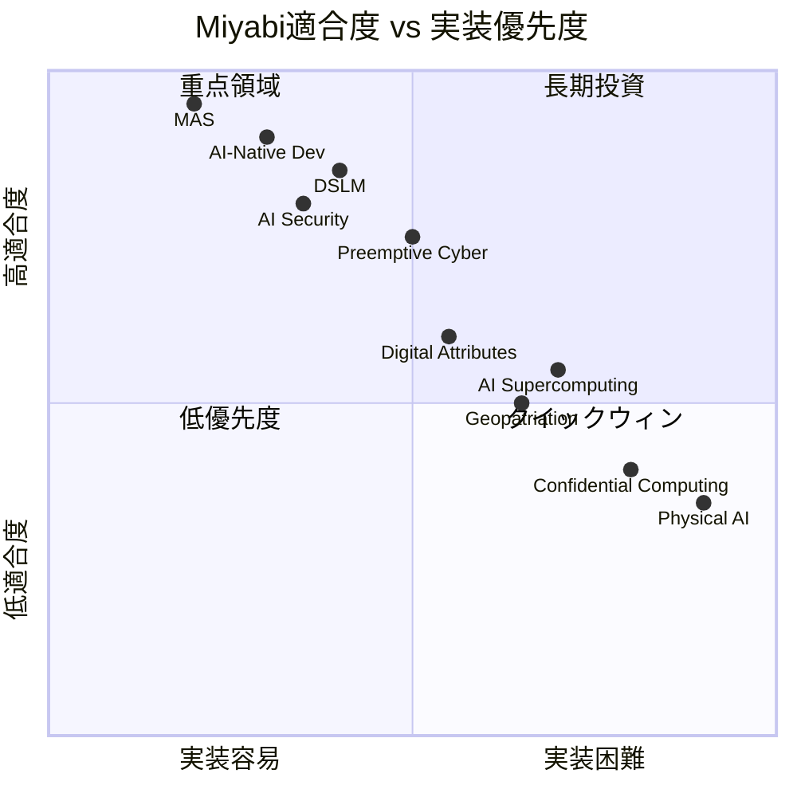
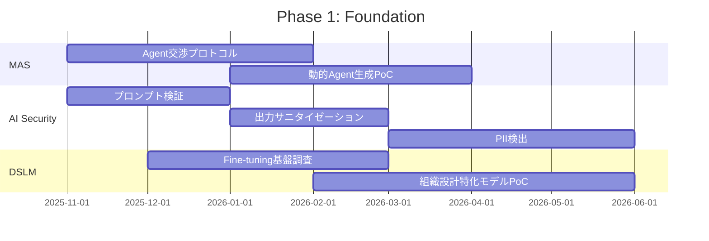
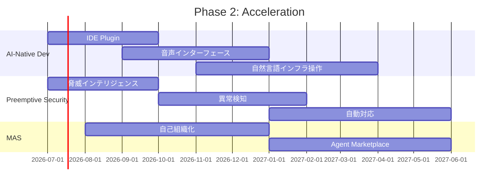
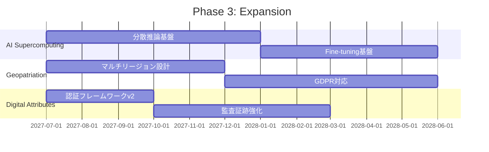
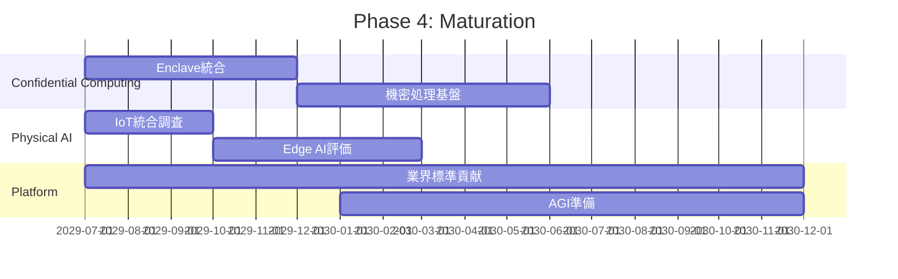
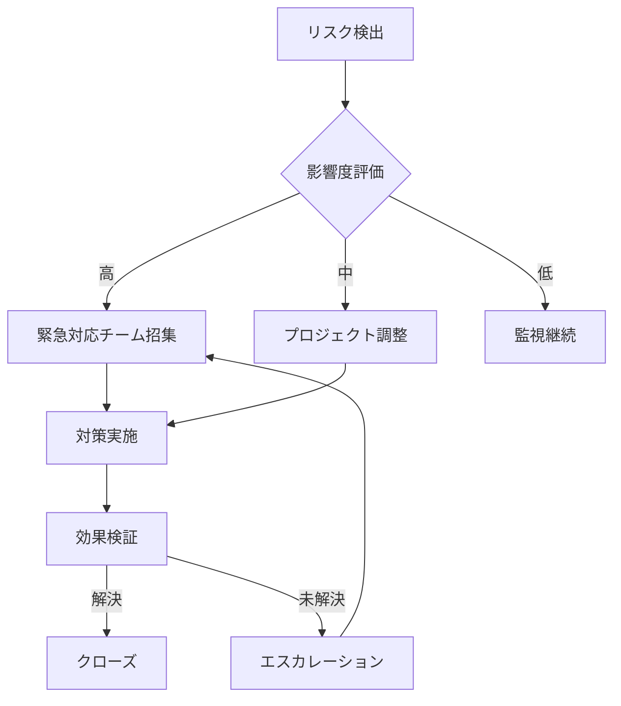

# Miyabi Technology Roadmap 2026-2030

**Version**: 1.0.0
**Date**: 2025-11-26
**Status**: Strategic Planning Document
**Owner**: Miyabi Core Team

---

## Table of Contents

1. [Executive Overview](#executive-overview)
2. [Gartner 2026 Trends Analysis](#gartner-2026-trends-analysis)
3. [Phase-by-Phase Implementation](#phase-by-phase-implementation)
4. [Technology Deep Dives](#technology-deep-dives)
5. [Resource Planning](#resource-planning)
6. [Risk Analysis](#risk-analysis)
7. [Success Metrics](#success-metrics)
8. [Related Issues](#related-issues)

---

## Executive Overview

### Vision

Miyabiは2030年までに**完全自律型AI開発オペレーションプラットフォーム**として、Gartner 2026の10大戦略的テクノロジートレンドを取り込み、業界をリードする技術基盤を構築します。

### Mission

- **自律開発**: Issue作成からデプロイまでの完全自動化
- **マルチエージェント協調**: 21個以上の専門Agentの協調動作
- **エンタープライズセキュリティ**: AI時代のセキュリティ基準を確立
- **グローバルスケール**: 世界中どこでもコンプライアンス準拠で運用

---

## Gartner 2026 Trends Analysis

### Trend Mapping Matrix



### Detailed Trend Analysis

#### Trend 1: AIネイティブ開発プラットフォーム

```yaml
Gartner定義: |
  AIをファーストクラス市民として扱い、開発ライフサイクル全体を
  AI Agentが支援するプラットフォーム

Miyabi現状:
  実装度: 85%
  主要機能:
    - 21個のAI Agent (Coding 7 + Business 14)
    - Issue → PR → Deploy 自動化
    - GitHub as OS アーキテクチャ

ギャップ分析:
  完了:
    - Agent基盤
    - Git Worktree並列実行
    - A2A Protocol
  残課題:
    - IDE統合深化
    - リアルタイムコラボレーション
    - 自然言語でのインフラ操作

2026アクション:
  Q1: IDE Plugin (VS Code, JetBrains)
  Q2: リアルタイム音声インターフェース
  Q3: 自然言語インフラ操作
  Q4: 自己改善Agent
```

#### Trend 2: AIスーパーコンピューティング・プラットフォーム

```yaml
Gartner定義: |
  大規模AIモデルのトレーニング・推論のための専用インフラ。
  従来のHPCを超えるAI最適化アーキテクチャ。

Miyabi現状:
  実装度: 35%
  主要機能:
    - AWS EC2 GPU (MAJIN) 連携
    - 基本的な並列処理

ギャップ分析:
  完了:
    - 単一GPU利用
    - 基本的なバッチ処理
  残課題:
    - マルチGPUクラスタ
    - 分散トレーニング基盤
    - 推論最適化

2027-2028アクション:
  2027Q1: AWS p5インスタンス評価
  2027Q3: 分散推論基盤構築
  2028Q1: カスタムモデル Fine-tuning基盤
  2028Q3: オンプレミスGPU検討
```

#### Trend 3: マルチエージェント・システム (MAS)

```yaml
Gartner定義: |
  複数のAI Agentが協調・競争・交渉しながら
  複雑なタスクを解決するシステム

Miyabi現状:
  実装度: 90%
  主要機能:
    - 4層ヒエラルキー (Maestro/Orchestrator/Coordinator/Agent)
    - A2A Bridge通信
    - 専門化Agent群

ギャップ分析:
  完了:
    - Agent階層構造
    - タスク分解・割り当て
    - 並列実行基盤
  残課題:
    - Agent間交渉プロトコル
    - 競争的タスク実行
    - 自己組織化

2026アクション:
  Q1: Agent間交渉プロトコル
  Q2: 動的Agent生成
  Q3: 自己組織化メカニズム
  Q4: Agent Marketplace
```

#### Trend 4: ドメイン特化言語モデル (DSLM)

```yaml
Gartner定義: |
  特定ドメインに最適化された言語モデル。
  汎用LLMより高精度・低コスト・高速。

Miyabi現状:
  実装度: 40%
  主要機能:
    - Rust/TypeScript特化プロンプト
    - ドメイン固有コンテキスト

ギャップ分析:
  完了:
    - プロンプトエンジニアリング
    - RAG基盤
  残課題:
    - カスタムFine-tuning
    - 組織設計特化モデル
    - ビジネス分析特化モデル

2026-2027アクション:
  2026Q1: Fine-tuning基盤調査
  2026Q2: 組織設計特化モデル PoC
  2026Q4: Rustコード生成特化モデル
  2027Q2: 本番投入
```

#### Trend 5: 先制的サイバーセキュリティ

```yaml
Gartner定義: |
  攻撃を予測・阻止するプロアクティブなセキュリティ。
  AIを活用した脅威予測と自動対応。

Miyabi現状:
  実装度: 55%
  主要機能:
    - Security Audit Skill
    - AWS SCP組織制御
    - 依存関係自動監査

ギャップ分析:
  完了:
    - 静的脆弱性スキャン
    - 組織ポリシー制御
  残課題:
    - 脅威予測エンジン
    - 動的防御
    - 自動復旧

2026-2027アクション:
  2026Q2: 脅威インテリジェンス統合
  2026Q4: AIベース異常検知
  2027Q2: 自動インシデント対応
  2027Q4: 予測型セキュリティ
```

#### Trend 6: デジタル属性

```yaml
Gartner定義: |
  デジタルアイデンティティと属性の管理。
  プライバシー保護と検証可能性の両立。

Miyabi現状:
  実装度: 45%
  主要機能:
    - GitHub OAuth認証
    - JWT トークン
    - 基本的な監査ログ

ギャップ分析:
  完了:
    - 基本認証
    - Agent実行ログ
  残課題:
    - 分散アイデンティティ
    - 検証可能なクレデンシャル
    - ゼロ知識証明

2027-2028アクション:
  2027Q1: Agent認証フレームワークv2
  2027Q3: 監査証跡強化
  2028Q1: DID (分散ID) 統合調査
  2028Q3: 検証可能クレデンシャル
```

#### Trend 7: AIセキュリティ・プラットフォーム

```yaml
Gartner定義: |
  AI特有のセキュリティリスク対策プラットフォーム。
  プロンプトインジェクション、データ漏洩、モデル攻撃への防御。

Miyabi現状:
  実装度: 50%
  主要機能:
    - 基本的な入力検証
    - Secrets管理

ギャップ分析:
  完了:
    - シークレット管理
    - 基本的なサニタイゼーション
  残課題:
    - 高度なプロンプト検証
    - 出力フィルタリング
    - モデル攻撃検知

2026アクション:
  Q1: プロンプトインジェクション検知
  Q2: 出力サニタイゼーション強化
  Q3: PII検出・マスキング
  Q4: モデル攻撃監視
```

#### Trend 8: ジオパトリエーション

```yaml
Gartner定義: |
  データの地理的配置とコンプライアンス管理。
  データ主権への対応。

Miyabi現状:
  実装度: 30%
  主要機能:
    - AWS単一リージョン
    - 基本的なデータ分類

ギャップ分析:
  完了:
    - 単一リージョンデプロイ
  残課題:
    - マルチリージョン
    - データローカリティ制御
    - 各国規制対応

2027-2029アクション:
  2027Q3: マルチリージョン設計
  2028Q1: GDPR完全対応
  2028Q3: 米国データ規制対応
  2029Q1: APAC規制対応
```

#### Trend 9: コンフィデンシャル・コンピューティング

```yaml
Gartner定義: |
  暗号化されたままデータを処理する技術。
  TEE (Trusted Execution Environment) の活用。

Miyabi現状:
  実装度: 10%
  主要機能:
    - 基本的な暗号化

ギャップ分析:
  完了:
    - 保存時暗号化
    - 転送中暗号化
  残課題:
    - 処理中暗号化
    - Enclave統合
    - 同型暗号

2028-2030アクション:
  2028Q3: AWS Nitro Enclaves評価
  2029Q1: Enclave統合PoC
  2029Q3: 機密データ処理基盤
  2030: 完全なConfidential Computing
```

#### Trend 10: フィジカルAI

```yaml
Gartner定義: |
  物理世界と連携するAI。
  ロボティクス、IoT、デジタルツイン。

Miyabi現状:
  実装度: 5%
  主要機能:
    - 基本的なAPI連携

ギャップ分析:
  残課題:
    - IoTデータ統合
    - エッジAI
    - ロボティクス制御

2029-2030アクション:
  2029Q3: IoTデータ統合調査
  2030Q1: Edge AI評価
  2030Q3: ロボティクス連携PoC
```

---

## Phase-by-Phase Implementation

### Phase 1: Foundation (2025 Q4 - 2026 Q2)

**テーマ**: 「転換点 - AIセキュリティと基盤強化」



**主要マイルストーン**:
- 2025-12: プロンプトインジェクション対策v1リリース
- 2026-02: Agent間交渉プロトコルv1
- 2026-04: DSLM評価完了
- 2026-06: Phase 1 完了レビュー

**チーム配置**:
| ロール | 人数 | 担当 |
|--------|------|------|
| Tech Lead | 1 | 全体統括 |
| Security Engineer | 2 | AIセキュリティ |
| ML Engineer | 2 | DSLM評価 |
| Backend Engineer | 3 | Agent基盤 |

### Phase 2: Acceleration (2026 Q3 - 2027 Q2)

**テーマ**: 「加速 - AIネイティブ開発の完成」



**主要マイルストーン**:
- 2026-10: VS Code Plugin リリース
- 2027-01: 音声操作v1
- 2027-04: 自然言語インフラ操作
- 2027-06: Phase 2 完了レビュー

### Phase 3: Expansion (2027 Q3 - 2029 Q2)

**テーマ**: 「拡大 - グローバル展開とエンタープライズ対応」



**主要マイルストーン**:
- 2028-01: 分散推論基盤
- 2028-06: GDPR完全対応
- 2029-01: グローバル展開開始
- 2029-06: Phase 3 完了レビュー

### Phase 4: Maturation (2029 Q3 - 2030)

**テーマ**: 「成熟 - 次世代技術への準備」



---

## Technology Deep Dives

### Deep Dive 1: Agent間交渉プロトコル

```
┌─────────────────────────────────────────────────────────────────┐
│                    Agent Negotiation Protocol                    │
│                                                                  │
│  ┌───────────┐     Propose      ┌───────────┐                  │
│  │  Agent A  │──────────────────▶│  Agent B  │                  │
│  │           │◀──────────────────│           │                  │
│  │  (Buyer)  │   Counter-Propose │ (Seller)  │                  │
│  └─────┬─────┘                   └─────┬─────┘                  │
│        │                               │                         │
│        │         Negotiation           │                         │
│        │◀──────────────────────────────▶│                        │
│        │                               │                         │
│        │           Accept              │                         │
│        │──────────────────────────────▶│                        │
│        │                               │                         │
│        ▼                               ▼                         │
│  ┌───────────────────────────────────────────┐                  │
│  │              Commitment Protocol          │                   │
│  │  - Resource allocation                    │                   │
│  │  - Task assignment                        │                   │
│  │  - SLA agreement                          │                   │
│  └───────────────────────────────────────────┘                  │
└─────────────────────────────────────────────────────────────────┘
```

**Protocol Specification**:
```rust
pub struct NegotiationMessage {
    pub sender: AgentId,
    pub receiver: AgentId,
    pub action: NegotiationAction,
    pub payload: NegotiationPayload,
    pub timestamp: DateTime<Utc>,
}

pub enum NegotiationAction {
    Propose,
    CounterPropose,
    Accept,
    Reject,
    Withdraw,
}

pub struct NegotiationPayload {
    pub resource_request: ResourceSpec,
    pub priority: Priority,
    pub deadline: Option<DateTime<Utc>>,
    pub constraints: Vec<Constraint>,
}
```

### Deep Dive 2: DSLM統合アーキテクチャ

```
┌─────────────────────────────────────────────────────────────────┐
│                    DSLM Integration Architecture                 │
│                                                                  │
│  ┌─────────────────────────────────────────────────────────┐   │
│  │                      Request Router                      │   │
│  └───────────────────────────┬─────────────────────────────┘   │
│                              │                                  │
│          ┌───────────────────┼───────────────────┐             │
│          ▼                   ▼                   ▼              │
│  ┌───────────────┐   ┌───────────────┐   ┌───────────────┐    │
│  │  DSLM: Code   │   │  DSLM: Org    │   │  DSLM: Biz    │    │
│  │  Generation   │   │  Design       │   │  Analysis     │    │
│  │               │   │               │   │               │    │
│  │  - Rust       │   │  - 57 Labels  │   │  - Market     │    │
│  │  - TypeScript │   │  - Hierarchy  │   │  - Revenue    │    │
│  │  - Tests      │   │  - Workflow   │   │  - Strategy   │    │
│  └───────────────┘   └───────────────┘   └───────────────┘    │
│          │                   │                   │              │
│          └───────────────────┼───────────────────┘             │
│                              ▼                                  │
│  ┌─────────────────────────────────────────────────────────┐   │
│  │                    Response Aggregator                   │   │
│  │              - Confidence scoring                        │   │
│  │              - Fallback to general LLM                   │   │
│  │              - Response validation                       │   │
│  └─────────────────────────────────────────────────────────┘   │
└─────────────────────────────────────────────────────────────────┘
```

### Deep Dive 3: AIセキュリティ多層防御

```
                          AIセキュリティ多層防御

Layer 5 ┌─────────────────────────────────────────────────┐
        │              Monitoring & Audit                  │
        │  - 全Agent動作ログ                               │
        │  - 異常検知アラート                              │
        │  - コンプライアンスレポート                       │
        └─────────────────────────────────────────────────┘
                              │
Layer 4 ┌─────────────────────────────────────────────────┐
        │              Output Validation                   │
        │  - PII検出・マスキング                           │
        │  - コード安全性検証                              │
        │  - ハルシネーション検出                          │
        └─────────────────────────────────────────────────┘
                              │
Layer 3 ┌─────────────────────────────────────────────────┐
        │              Model Security                      │
        │  - 敵対的入力検出                               │
        │  - モデル出力バリデーション                      │
        │  - Rate limiting                                │
        └─────────────────────────────────────────────────┘
                              │
Layer 2 ┌─────────────────────────────────────────────────┐
        │              Input Sanitization                  │
        │  - プロンプトインジェクション検出                │
        │  - 入力長制限                                   │
        │  - フォーマット検証                             │
        └─────────────────────────────────────────────────┘
                              │
Layer 1 ┌─────────────────────────────────────────────────┐
        │              Authentication & Authorization      │
        │  - Agent認証                                    │
        │  - 権限検証                                     │
        │  - セッション管理                               │
        └─────────────────────────────────────────────────┘
```

---

## Resource Planning

### 人員計画 (2026-2030)

| Year | Core Dev | ML/AI | Security | DevOps | Total |
|------|----------|-------|----------|--------|-------|
| 2026 | 5 | 3 | 2 | 2 | 12 |
| 2027 | 7 | 5 | 3 | 3 | 18 |
| 2028 | 10 | 7 | 4 | 4 | 25 |
| 2029 | 12 | 10 | 5 | 5 | 32 |
| 2030 | 15 | 12 | 6 | 6 | 39 |

### インフラ計画

```
                    Infrastructure Scaling Plan

Compute
  2026: │████████░░░░░░░│ 8 GPUs, 32 vCPUs
  2027: │██████████████░│ 16 GPUs, 64 vCPUs
  2028: │██████████████████│ 32 GPUs, 128 vCPUs
  2029: │████████████████████████│ 64 GPUs, 256 vCPUs
  2030: │████████████████████████████████│ 128+ GPUs

Storage
  2026: │████░░░░░░░░░░░│ 10 TB
  2027: │████████░░░░░░░│ 50 TB
  2028: │██████████████░│ 200 TB
  2029: │██████████████████│ 500 TB
  2030: │████████████████████████│ 1+ PB

Regions
  2026: │██░░░░░░░░░░░░░│ 1 (US)
  2027: │████░░░░░░░░░░░│ 2 (US, EU)
  2028: │████████░░░░░░░│ 4 (US, EU, APAC-1, APAC-2)
  2029: │████████████░░░│ 6 (+ South America, Middle East)
  2030: │████████████████│ 8+ (Global)
```

### 予算概算

| カテゴリ | 2026 | 2027 | 2028 | 2029 | 2030 |
|---------|------|------|------|------|------|
| 人件費 | $1.2M | $1.8M | $2.5M | $3.2M | $3.9M |
| インフラ | $0.3M | $0.5M | $0.8M | $1.2M | $1.8M |
| ツール・ライセンス | $0.1M | $0.15M | $0.2M | $0.25M | $0.3M |
| R&D | $0.2M | $0.35M | $0.5M | $0.75M | $1.0M |
| **Total** | **$1.8M** | **$2.8M** | **$4.0M** | **$5.4M** | **$7.0M** |

---

## Risk Analysis

### リスクマトリクス

| リスク | 影響度 | 発生確率 | 対策 |
|--------|--------|----------|------|
| LLM価格高騰 | 高 | 中 | DSLM移行、マルチプロバイダー |
| セキュリティ侵害 | 高 | 低 | 多層防御、監査強化 |
| 人材不足 | 中 | 高 | 自動化推進、リモート採用 |
| 規制変更 | 中 | 中 | 法務チーム強化、柔軟設計 |
| 技術陳腐化 | 中 | 中 | R&D投資、モジュラー設計 |
| 競合台頭 | 中 | 高 | 差別化推進、先行者優位確保 |

### リスク対応計画



---

## Success Metrics

### KPI Dashboard

| Metric | 2026 Target | 2027 Target | 2028 Target | 2029 Target | 2030 Target |
|--------|-------------|-------------|-------------|-------------|-------------|
| 自動化率 | 60% | 75% | 85% | 92% | 97% |
| Agent数 | 25 | 35 | 50 | 70 | 100 |
| デプロイ頻度/日 | 10 | 30 | 100 | 300 | 1000 |
| MTTR (分) | 30 | 15 | 5 | 2 | 1 |
| セキュリティスコア | 80 | 85 | 90 | 95 | 98 |
| 顧客満足度 | 4.0 | 4.3 | 4.5 | 4.7 | 4.9 |

### 成功基準

**2026年末**:
- AIネイティブ開発プラットフォームとして認知
- AIセキュリティベストプラクティス確立

**2027年末**:
- エンタープライズ採用開始
- グローバル展開準備完了

**2028年末**:
- 業界リーダーとしての地位確立
- 1000社以上の導入

**2030年**:
- AIプラットフォームの業界標準
- 自律型開発の事実上の標準

---

## Related Issues

| Issue # | Title | Status | Phase |
|---------|-------|--------|-------|
| #821 | AIネイティブ開発プラットフォーム強化 | Open | 1 |
| #822 | DSLM統合基盤 | Open | 1 |
| #823 | 先制的サイバーセキュリティ導入 | Open | 1-2 |
| #824 | デジタル属性フレームワーク | Open | 2 |
| #825 | AIセキュリティプラットフォーム構築 | Open | 1 |
| #826 | MAS強化 (Agent交渉プロトコル) | Open | 1 |
| #827 | ジオパトリエーション対応設計 | Open | 3 |
| #828 | AIスーパーコンピューティング連携 | Open | 2-3 |
| #829 | コンフィデンシャル・コンピューティング基盤 | Open | 4 |
| #830 | フィジカルAI統合調査 | Open | 4 |
| #831 | 本Issue（ロードマップ文書化） | In Progress | - |

---

## Document Control

| Item | Value |
|------|-------|
| Version | 1.0.0 |
| Author | Claude Code (Miyabi AI Development Platform) |
| Created | 2025-11-26 |
| Last Updated | 2025-11-26 |
| Review Cycle | Quarterly |
| Next Review | 2026-02-26 |
| Approvers | CTO, CEO |
| Classification | Internal - Strategic |

---

**Generated with Claude Code (https://claude.com/claude-code)**
