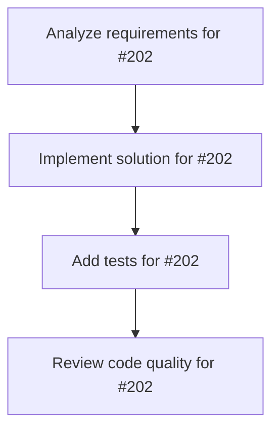

# Plans for Issue #202

**Title**: Harden Domain Models

**URL**: https://github.com/ShunsukeHayashi/miyabi-private/issues/202

---

## 📋 Summary

- **Total Tasks**: 4
- **Estimated Duration**: 60 minutes
- **Execution Levels**: 4
- **Has Cycles**: ✅ No

## 📝 Task Breakdown

### 1. Analyze requirements for #202

- **ID**: `task-202-analysis`
- **Type**: Docs
- **Assigned Agent**: IssueAgent
- **Priority**: 0
- **Estimated Duration**: 5 min

**Description**: Analyze issue requirements and create detailed specification

### 2. Implement solution for #202

- **ID**: `task-202-impl`
- **Type**: Feature
- **Assigned Agent**: CodeGenAgent
- **Priority**: 1
- **Estimated Duration**: 30 min
- **Dependencies**: task-202-analysis

**Description**: ## Summary
Normalize core types across crates, tighten invariants, and eliminate duplicated business rules so downstream agents and services rely on a single, well-documented schema.

## Deliverables
- Canonical enums/constructors for key entities
- Updated consumers compiling against the stricter API
- Tests and docs covering invariants

## Dependencies
- Issue 201 (Baseline & Guardrails Setup)

## Checklist
- [ ] T2-schema-inventory — types-lead — catalogue current type usage and duplicates
- [ ] T2-design-invariants — architecture — define canonical enums, validation rules, and RFC notes
- [ ] T2-implement-types — types-lead — implement invariants in `agent.rs`, `task.rs`, `workflow.rs`
- [ ] T2-update-consumers — agents-team — migrate crates to new types and resolve build breaks
- [ ] T2-guard-tests — qa — add unit tests for invariants, serde round trips, rejection flows
- [ ] T2-doc-sync — docs — refresh docs/prompts referencing domain models

### 3. Add tests for #202

- **ID**: `task-202-test`
- **Type**: Test
- **Assigned Agent**: CodeGenAgent
- **Priority**: 2
- **Estimated Duration**: 15 min
- **Dependencies**: task-202-impl

**Description**: Create comprehensive test coverage

### 4. Review code quality for #202

- **ID**: `task-202-review`
- **Type**: Refactor
- **Assigned Agent**: ReviewAgent
- **Priority**: 3
- **Estimated Duration**: 10 min
- **Dependencies**: task-202-test

**Description**: Run quality checks and code review

## 🔄 Execution Plan (DAG Levels)

Tasks can be executed in parallel within each level:

### Level 0 (Parallel Execution)

- `task-202-analysis` - Analyze requirements for #202

### Level 1 (Parallel Execution)

- `task-202-impl` - Implement solution for #202

### Level 2 (Parallel Execution)

- `task-202-test` - Add tests for #202

### Level 3 (Parallel Execution)

- `task-202-review` - Review code quality for #202

## 📊 Dependency Graph

## ⏱️ Timeline Estimation

- **Sequential Execution**: 60 minutes (1.0 hours)
- **Parallel Execution (Critical Path)**: 10 minutes (0.2 hours)
- **Estimated Speedup**: 6.0x

---

*Generated by CoordinatorAgent on 2025-10-19 06:06:04 UTC*
