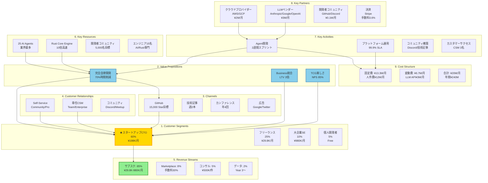

# 🎨 Miyabi - Business Model Canvas

**作成日**: 2025-11-29
**Agent**: ProductConceptAgent（概/がいさん💡）
**Phase**: 4 - Product Concept Design
**Status**: ✅ Complete

---

## 📋 Business Model Canvas全体図

---

## 1. Customer Segments（顧客セグメント）

### セグメント優先順位

| Segment | 優先度 | 規模 | 価格 | シェア | LTV | CAC | LTV/CAC |
|---------|--------|------|------|--------|-----|-----|---------|
| **スタートアップCTO** | P0 ★ | 10,000社 | ¥198K/月 | 60% | ¥5.5M | ¥500K | 11.1x |
| **フリーランス** | P1 | 50,000名 | ¥29.8K/月 | 25% | ¥832K | ¥30K | 27.7x |
| **大企業SE** | P1 | 500社 | ¥980K/月 | 10% | ¥35.3M | ¥3M | 11.8x |
| **個人開発者** | P2 | 100,000名 | ¥0 | 5% | - | - | - |

---

### Primary Segment: スタートアップCTO

**プロフィール**:
- 氏名: 鈴木花子（28歳）
- 役職: CTO
- 会社: 従業員5-20名のSaaSスタートアップ
- 予算: ¥300,000/月
- 技術スタック: Rust/TypeScript/AWS

**Jobs to Be Done**:
- プロダクト開発を加速したい
- 少人数で大企業並みの生産性を出したい
- 技術的負債を減らしたい
- マーケティング・営業も回したい
- 投資家に成長を示したい

**Pains**:
- やることが多すぎて開発に集中できない（月160時間の雑務）
- コードレビューする人がいない（バグ率15%）
- マーケ・営業まで手が回らない（MRR成長率5%）
- データ分析・KPI管理ができていない
- 学習コストが高い（新ツール導入）

**Gains**:
- 開発時間を2倍にしたい（160h → 320h）
- コード品質を向上させたい（バグ率15% → 5%）
- MRR成長率を3倍にしたい（5% → 15%）
- データドリブン経営を実現したい
- 楽しく仕事をしたい（NPS +35pt）

**市場規模**: 日本国内10,000社

**獲得目標**: Year 1: 50社、Year 3: 500社

---

## 2. Value Propositions（価値提案）

### コアバリュー3つ

#### 1. 完全自律実行

**価値**: Issue作成からデプロイまで、人間の介入なしで完結

**機能**:
- CoordinatorAgent（采配）
- CodeGenAgent（コード生成）
- ReviewAgent（レビュー）
- IssueAgent（Issue管理）
- PRAgent（PR作成）
- DeploymentAgent（デプロイ）
- RefresherAgent（リファクタリング）

**インパクト**:
- 開発時間70%削減
- 月間160時間を創造的作業に転換
- リリースサイクル90%短縮

**Pain Relievers**:
- ✅ 雑務時間160h → 20h（87%削減）
- ✅ コードレビュー自動化（バグ率67%削減）
- ✅ リリース作業自動化（手動0時間）

---

#### 2. ビジネスインテリジェンス統合

**価値**: 開発だけでなく、マーケ・営業・分析まで一気通貫

**機能**:
- MarketResearchAgent（市場調査）
- PersonaAgent（ペルソナ設計）
- ProductConceptAgent（プロダクト設計）
- MarketingAgent（マーケ自動化）
- SalesAgent（営業自動化）
- CRMAgent（LTV最適化）
- AnalyticsAgent（KPI分析）
- YouTubeAgent（動画マーケ）
- ...他6 Agents

**インパクト**:
- LTV 3倍向上
- チャーン率40%削減
- MRR成長率 5% → 15%（3倍）

**Pain Relievers**:
- ✅ マーケ・営業の自動化（専任不要）
- ✅ データドリブン意思決定（KPI自動レポート）
- ✅ 顧客満足度向上（CRM最適化）

---

#### 3. 高速実行 × ゲーミフィケーション

**価値**: Rust性能 + TCGカードで楽しく成長

**機能**:
- Rust並列処理エンジン（処理速度10倍）
- 450枚のTCGカード
- Agent育成システム
- バトルモード（Agent vs Agent）
- ランキング・実績システム
- 3D可視化

**インパクト**:
- 処理速度10倍（Rust vs TypeScript）
- 開発者エンゲージメント85% NPS
- 習得時間93%削減（2週間 → 2日）

**Gain Creators**:
- ✅ 楽しく成長を実感（TCGカード獲得）
- ✅ チーム内競争（ランキング）
- ✅ 学習が容易（チュートリアルAgent）

---

### Value Ladder（価値の階段）

| レベル | プラン | 価値 | 価格 | ゴール |
|--------|--------|------|------|--------|
| **Entry** | Community | プロダクト体験 | ¥0 | お試し |
| **Mid** | Professional | 業務効率化 | ¥29.8K/月 | 継続利用 |
| **High** | Team | チーム生産性向上 | ¥198K/月 | 組織導入 |
| **Premium** | Enterprise | DX推進パートナー | ¥980K/月 | 戦略提携 |

---

## 3. Channels（チャネル）

### 認知獲得（Awareness）

**Channel 1: GitHub**
- 戦略: オープンソース公開、Star獲得
- 目標: 月間15,000 Star（Year 1）
- コスト: ¥0（オーガニック）

**Channel 2: 技術ブログ・Zenn・Qiita**
- 戦略: 技術記事投稿（週2本）
- 目標: 月間50,000PV
- コスト: ¥200,000/月（執筆外注）

**Channel 3: Twitter/X**
- 戦略: 開発者向けツイート、デモ動画
- 目標: フォロワー10,000名
- コスト: ¥100,000/月（広告）

**Channel 4: 技術カンファレンス**
- 戦略: 登壇、ブース出展
- 目標: 年4回参加
- コスト: ¥500,000/回

---

### 評価（Evaluation）

**Channel 5: ランディングページ**
- 戦略: デモ動画、ユースケース紹介
- CVR: 10%
- コスト: ¥500,000（制作）

**Channel 6: 無料トライアル（Community tier）**
- 戦略: 即座に体験可能
- Activation Rate: 70%
- コスト: ¥70/ユーザー

---

### 購入（Purchase）

**Channel 7: Webサイト（Stripe決済）**
- CVR: 30%（Free → Pro）
- コスト: 手数料3.6%

**Channel 8: 営業（Team/Enterprise）**
- CVR: 40%
- コスト: ¥3,000,000/月（人件費）

---

### 配信（Delivery）

**Channel 9: CLI / Web Dashboard**
- Uptime: 99.9%
- コスト: ¥2,000,000/月（インフラ）

---

### アフターセールス（After Sales）

**Channel 10: Discord コミュニティ**
- Active Rate: 40%
- コスト: ¥100,000/月

**Channel 11: 専任CSM（Team/Enterprise）**
- Satisfaction: 4.8/5
- コスト: ¥500,000/月/CSM

---

## 4. Customer Relationships（顧客との関係）

### Tier別関係性戦略

#### Community tier: Self-Service

**タッチポイント**:
- チュートリアル動画
- ドキュメント
- Discordコミュニティ

**自動化率**: 95%

**コスト**: ¥20/ユーザー/月

---

#### Professional tier: Assisted Self-Service

**タッチポイント**:
- 優先メールサポート（24時間以内返信）
- 月次ニュースレター
- オンボーディングウェビナー

**自動化率**: 70%

**コスト**: ¥5,000/ユーザー/月

---

#### Team tier: Dedicated Support

**タッチポイント**:
- 専任CSM（月1回MTG）
- Slack連携サポート
- カスタムトレーニング

**自動化率**: 30%

**コスト**: ¥50,000/顧客/月

---

#### Enterprise tier: Co-Creation

**タッチポイント**:
- テクニカルアカウントマネージャー
- 四半期ビジネスレビュー
- カスタムAgent開発
- 24/7電話サポート

**自動化率**: 10%

**コスト**: ¥200,000/顧客/月

---

### リテンション施策

**Tactic 1: Success Milestones**
- 初回Agent実行、10回実行、100回実行でバッジ付与
- インパクト: リテンション+15%

**Tactic 2: Usage-Based Alerts**
- 利用量80%到達時にアップグレード提案
- インパクト: アップセル率20%

**Tactic 3: Community Events**
- 月次オンラインMeetup
- インパクト: エンゲージメント+25%

---

## 5. Revenue Streams（収益の流れ）

### Stream 1: サブスクリプション（85%）

**Tiers**:
- Community: ¥0
- Professional: ¥29,800/月
- Team: ¥198,000/月
- Enterprise: ¥980,000/月〜

**Year 1 Target**: ARR ¥144,000,000

**Year 3 Target**: ARR ¥1,800,000,000

**特徴**:
- 予測可能な収益
- 高いLTV
- チャーン管理が重要

---

### Stream 2: Marketplace手数料（8%）

**手数料率**: 30%

**開始**: Year 2

**Year 3 Target**: ¥45,000,000/年

**特徴**:
- サードパーティAgent販売時の手数料
- エコシステム拡大

---

### Stream 3: プロフェッショナルサービス（5%）

**サービス**:
- カスタムAgent開発: ¥500,000〜/件
- 導入コンサルティング: ¥300,000/日
- トレーニング: ¥200,000/日

**Year 3 Target**: ¥30,000,000/年

**特徴**:
- 高単価
- スケールしない

---

### Stream 4: データインサイト販売（2%）

**商品**:
- 月次トレンドレポート: ¥50,000/月
- 年次ベストプラクティス集: ¥500,000/年

**開始**: Year 3

**Year 3 Target**: ¥10,000,000/年

**特徴**:
- 匿名化データ活用
- 追加収益源

---

## 6. Key Resources（リソース）

### 知的財産

**Resource 1: 25 AI Agents**
- 説明: 業界最多のAgent群
- 競争優位性: Very High
- 開発期間: 24ヶ月
- 模倣困難性: ネットワーク効果、学習データ

**Resource 2: Rust Core Engine**
- 説明: 高速並列実行エンジン
- 競争優位性: High
- 開発期間: 18ヶ月
- 模倣困難性: 技術的複雑性

**Resource 3: TCG System**
- 説明: 450枚のカード、育成システム
- 競争優位性: Medium
- 開発期間: 12ヶ月
- 模倣困難性: コンテンツ量

---

### 人的リソース（15名体制）

| 役職 | 人数 | コスト | スキル |
|------|------|--------|--------|
| Rust Engineer | 3 | ¥800K/月/人 | Rust, 並列処理, LLM統合 |
| Agent Developer | 5 | ¥700K/月/人 | AI/ML, Prompt Engineering |
| Product Manager | 2 | ¥900K/月/人 | 開発者プロダクト経験 |
| DevRel / Community | 2 | ¥600K/月/人 | 技術発信, コミュニティ運営 |
| Sales / CS | 3 | ¥700K/月/人 | B2B SaaS営業 |

**合計人件費**: ¥11,100,000/月

---

### 物理リソース

**インフラ**:
- AWS/GCP: ¥2,000,000/月
- LLM API（Claude, Gemini, GPT-4）: ¥3,000,000/月

---

### 財務リソース

**Seed Funding（想定）**:
- 金額: ¥100,000,000
- Runway: 15ヶ月
- ソース: VC（想定）

---

## 7. Key Activities（主要活動）

### Activity 1: Agent開発

**頻度**: 2週間スプリント

**リソース**: Rust Engineer 3名 + Agent Developer 5名

**アウトプット**: 月2-3機能リリース

**重要度**: Critical

---

### Activity 2: プラットフォーム運用

**頻度**: 24/7

**リソース**: SRE 2名（想定）

**SLA**: 99.9% uptime

**重要度**: Critical

---

### Activity 3: コミュニティ構築

**頻度**: 毎日

**リソース**: DevRel 2名

**アウトプット**:
- 週2本技術記事
- 月次Meetup
- Discord運営

**重要度**: High

---

### Activity 4: カスタマーサクセス

**頻度**: 毎日

**リソース**: CS 3名

**SLA**: 24時間以内返信（Pro以上）

**重要度**: High

---

### Activity 5: セールス

**頻度**: 毎日

**リソース**: Sales 2名

**目標**: 月10社成約（Team tier）

**重要度**: Medium

---

## 8. Key Partnerships（パートナー）

### Partner 1: クラウドプロバイダー（AWS/GCP）

**タイプ**: インフラ提供

**ベネフィット**: 安定したサーバー環境、スケーラビリティ

**コスト**: ¥2,000,000/月

**重要度**: Critical

---

### Partner 2: LLMベンダー（Anthropic/Google/OpenAI）

**タイプ**: LLM API提供

**ベネフィット**: 最新モデルへのアクセス

**コスト**: ¥3,000,000/月

**重要度**: Critical

**リスク軽減**: マルチLLM戦略で単一ベンダー依存回避

---

### Partner 3: 開発者コミュニティ（GitHub/Discord）

**タイプ**: コミュニティプラットフォーム

**ベネフィット**: 開発者リーチ、コミュニティ運営

**コスト**: ¥100,000/月

**重要度**: High

---

### Partner 4: 決済（Stripe）

**タイプ**: 決済処理

**ベネフィット**: 安全な決済システム

**コスト**: 手数料3.6%

**重要度**: High

---

### Partner 5: 分析（Mixpanel/Amplitude）

**タイプ**: プロダクト分析

**ベネフィット**: ユーザー行動分析

**コスト**: ¥200,000/月

**重要度**: Medium

---

### Partner 6: 販売代理店（大手SIer、想定）

**タイプ**: 販売代理店

**ベネフィット**: Enterprise顧客へのアクセス

**Revenue Share**: 20%

**重要度**: Medium

**開始**: Year 2

---

## 9. Cost Structure（コスト構造）

### タイプ: Value-Driven（価値重視型）

**説明**: 高品質Agent・サポートに投資し、顧客LTV最大化

---

### 固定費（¥13,300,000/月）

#### 人件費（¥12,000,000/月）
- エンジニア（8名）: ¥5,900,000
- PM（2名）: ¥1,800,000
- DevRel/Community（2名）: ¥1,200,000
- Sales/CS（3名）: ¥2,100,000
- 管理・バックオフィス: ¥1,000,000

#### インフラ基本費（¥1,300,000/月）
- AWS/GCP基本料金: ¥500,000
- SaaSツール（Slack, GitHub, Mixpanel等）: ¥300,000
- オフィス・通信費: ¥500,000

---

### 変動費（¥6,700,000/月、Year 1平均）

- AWS/GCP（ユーザー連動）: ¥1,500,000
- LLM API（実行回数連動）: ¥3,000,000
- 広告費: ¥2,000,000
- サポートツール: ¥200,000

---

### 合計

**月間コスト**: ¥20,000,000

**年間コスト**: ¥240,000,000

---

### 損益分岐点分析（Team tier想定）

**固定費**: ¥13,300,000/月

**変動費（Team 1社あたり）**: ¥100,000/月

**Team tier価格**: ¥198,000/月

**Contribution Margin**: ¥98,000/社

**Break-Even Customers**: **136社**

**Break-Even Month**: **Month 14**（Year 2 Q2想定）

---

### コスト最適化ロードマップ

#### Phase 1: Year 1（成長優先）
- Burn Rate: ¥20M/月
- 許容: Yes（資金調達前提）

#### Phase 2: Year 2（効率化）
- 目標: Gross Margin 70%以上
- 施策:
  - LLM API最適化（キャッシュ活用）
  - 自動化によるCS効率化

#### Phase 3: Year 3（収益化）
- 目標: 黒字化
- EBITDA Margin: 20%

---

## 📊 3年財務予測

| 指標 | Year 1 | Year 2 | Year 3 |
|------|--------|--------|--------|
| **収益** | | | |
| ARR | ¥144M | ¥750M | ¥1.8B |
| MRR（Q4） | ¥19.75M | ¥99M | ¥197.5M |
| 成長率 | - | +421% | +140% |
| **顧客** | | | |
| Team tier | 50社 | 250社 | 500社 |
| Professional | 250名 | 1,250名 | 2,500名 |
| Enterprise | 5社 | 25社 | 50社 |
| Community | 5,000名 | 25,000名 | 50,000名 |
| **コスト** | | | |
| 人件費 | ¥133M | ¥288M | ¥576M |
| インフラ | ¥54M | ¥120M | ¥250M |
| マーケティング | ¥36M | ¥100M | ¥180M |
| その他 | ¥17M | ¥42M | ¥94M |
| 合計コスト | ¥240M | ¥550M | ¥1.1B |
| **利益性** | | | |
| Gross Profit | ¥80.75M | ¥637.5M | ¥1.53B |
| Gross Margin | 85% | 85% | 85% |
| EBITDA | -¥145M | ¥87.5M | ¥430M |
| EBITDA Margin | - | 12% | 24% |
| **メトリクス** | | | |
| LTV/CAC（Team） | 11.1x | 12.0x | 13.5x |
| Payback Period | 3.0ヶ月 | 2.5ヶ月 | 2.0ヶ月 |
| Churn Rate | 3%/月 | 2.5%/月 | 2%/月 |
| NPS | 60 | 70 | 80 |

---

## 🎯 戦略的インサイト

### 強み（Strengths）
- ✅ 25 Agents（業界最多）
- ✅ 14 Business Agents（業界唯一）
- ✅ Rust性能（10倍高速）
- ✅ TCGゲーミフィケーション
- ✅ LTV/CAC 11.1x（健全）

### 課題（Weaknesses）
- ⚠️ ブランド認知度低い（10%）
- ⚠️ 導入実績少ない（Year 1開始）
- ⚠️ Enterprise機能不足

### 機会（Opportunities）
- 📈 AI開発ツール市場成長（CAGR 22.8%）
- 📈 日本DX推進政策
- 📈 開発者不足

### 脅威（Threats）
- ⚡ Microsoft（GitHub Copilot）の圧倒的ブランド
- ⚡ 大手IT企業の参入リスク
- ⚡ 競合の価格攻勢

---

## 🚀 次フェーズへ

**Phase 5（ProductDesignAgent）への引き継ぎ**:

Business Model Canvasが完成しました。

次は、このビジネスモデルを実現するための
UI/UX設計、情報アーキテクチャ、MVPスコープ定義を
ProductDesignAgent（創/そうさん✍️）が担当します。

**設計時の重要ポイント**:
- Agent Dashboard（25 Agentの状態表示）
- 価格tierに応じた機能制限
- Freemium転換UX
- TCGゲーミフィケーション要素

---

**作成者**: ProductConceptAgent（概/がいさん💡）
**完了日**: 2025-11-29
**次フェーズ**: Phase 5 - Product Design（創/そうさん✍️）
