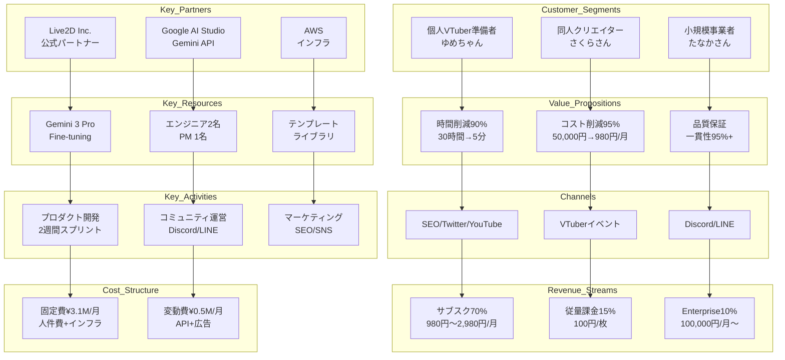

# Miyabi Character Studio - ビジネスモデルキャンバス

**作成日**: 2025-12-07
**作成者**: ProductConceptAgent (💡 概 がいさん)
**Phase**: Phase 4 - Product Concept Design

---

## エグゼクティブサマリー

「ビジネスモデルは、プロダクトの設計図だ」

**Miyabi Character Studio**のビジネスモデルキャンバス9要素を詳細設計しました。

**ビジネスモデルタイプ**: SaaS（サブスクリプション） + Freemium + Community-Driven

**収益構造**: サブスクリプション70% + 従量課金15% + その他15%

**コスト構造**: Value-driven（価値重視型）

---

## Business Model Canvas 9要素

```
┌─────────────────────────────────────────────────────────────────┐
│                   Business Model Canvas                         │
├─────────────┬───────────────┬───────────────┬───────────────────┤
│             │               │               │                   │
│  8. Key     │  7. Key       │  2. Value     │  4. Customer      │
│  Partners   │  Activities   │  Propositions │  Relationships    │
│             │               │               │                   │
│  パートナー  │  主要活動      │  価値提案      │  顧客との関係      │
│             │ ──────────────┼───────────────│                   │
│             │  6. Key       │               │  1. Customer      │
│             │  Resources    │               │  Segments         │
│             │               │               │                   │
│             │  リソース      │               │  顧客セグメント    │
├─────────────┴───────────────┴───────────────┴───────────────────┤
│                                                                 │
│  9. Cost Structure                │  5. Revenue Streams         │
│  コスト構造                        │  収益の流れ                  │
│                                                                 │
└─────────────────────────────────────────────────────────────────┘
```

---

## 1. Customer Segments（顧客セグメント）

### Primary Segment: 個人VTuber準備者「ゆめちゃん」 🎯

| 項目 | 詳細 |
|-----|------|
| **セグメント名** | 個人VTuber準備者 |
| **市場規模** | 年間5万人（日本）、推定50億円/年 |
| **年齢** | 18-25歳（中心22歳） |
| **職業** | 大学生、フリーター |
| **年収** | 100-200万円 |
| **可処分所得** | 月3-5万円 |
| **主要ニーズ** | Live2D差分生成（表情・衣装・ポーズ） |
| **ペイン** | VRoid/Live2Dの学習コスト高い、外注高額 |
| **予算** | 月額3,000円まで |
| **優先度** | 🥇 **1位**（最優先） |
| **ARR貢献** | 初年度2億円（5,000ユーザー×¥980/月×12ヶ月×70%） |

---

### Secondary Segment: 同人クリエイター「さくらさん」 🎨

| 項目 | 詳細 |
|-----|------|
| **セグメント名** | 同人クリエイター（コミケ・BOOTH出品者） |
| **市場規模** | 年間3万人、推定30億円/年 |
| **年齢** | 25-35歳（中心28歳） |
| **職業** | 会社員（デザイナー）+ 同人活動 |
| **年収** | 400万円（本業）+ 100万円（同人） |
| **可処分所得** | 月10-15万円 |
| **主要ニーズ** | キャラクターバリエーション量産 |
| **ペイン** | 差分作成に45時間、締切に間に合わない |
| **予算** | 月額5,000円まで |
| **優先度** | 🥈 **2位** |
| **ARR貢献** | 2年目1億円（1,000ユーザー×¥2,980/月×12ヶ月×30%） |

---

### Tertiary Segment: 小規模事業者「たなかさん」 🏢

| 項目 | 詳細 |
|-----|------|
| **セグメント名** | 中小企業・スタートアップ経営者 |
| **市場規模** | 年間2万社、推定20億円/年 |
| **年齢** | 30-45歳（中心35歳） |
| **職業** | 経営者、マーケティング担当者 |
| **年収** | 600万円〜 |
| **予算** | 10万円まで（買い切り） |
| **主要ニーズ** | 低予算マスコットキャラ制作 |
| **ペイン** | 外注費用50万円で予算オーバー |
| **優先度** | 🥉 **3位** |
| **ARR貢献** | 3年目5,000万円（100社×¥100,000/年） |

---

## 2. Value Propositions（価値提案）

### Core Value Proposition

```
「VTuberキャラ、30分で完成。AI×キャラクター一貫性で差分自動生成。もう挫折しない。」
```

### 3層価値構造

#### Functional Value（機能的価値）

| No. | 価値 | 効果 |
|-----|------|------|
| 1 | **時間削減** | 差分作成時間を90%削減（30時間→5分） |
| 2 | **コスト削減** | 外注費用を95-98%削減（50,000円→980円/月） |
| 3 | **品質向上** | キャラクター一貫性95%以上（手動調整不要） |
| 4 | **技術不要** | プロンプトだけで完成（学習コストゼロ） |

---

#### Emotional Value（感情的価値）

| No. | 価値 | 効果 |
|-----|------|------|
| 1 | **安心感** | キャラクター作成の不安から解放 |
| 2 | **達成感** | 30分でプロ級キャラ完成、自信が持てる |
| 3 | **自己表現** | 自分だけのオリジナルキャラを持つ喜び |

---

#### Social Value（社会的価値）

| No. | 価値 | 効果 |
|-----|------|------|
| 1 | **評価向上** | VTuberコミュニティで一目置かれる |
| 2 | **地位向上** | 「このキャラすごい!」と言われる |
| 3 | **仲間意識** | Discordコミュニティで仲間と交流 |

---

## 3. Channels（チャネル）

### 5段階チャネル設計

#### Awareness（認知）

| チャネル | 目標 | コスト | 効果 |
|---------|------|--------|------|
| **SEO/コンテンツマーケティング** | 月間10,000PV | ¥50,000/月 | High |
| **Twitter/X** | フォロワー5,000人 | ¥30,000/月 | High |
| **YouTube** | 登録者1,000人 | ¥100,000/月 | Medium |
| **VTuberイベント出展** | 年2回（VketやVTuber Fes） | ¥200,000/回 | High |

**合計**: **¥380,000/月**

---

#### Evaluation（評価）

| チャネル | 目標 | コスト |
|---------|------|--------|
| **ランディングページ** | CVR 5% | ¥100,000（制作） |
| **無料トライアル** | 登録率20% | ¥0 |
| **βテスターレビュー** | Twitter投稿50件 | ¥0 |

---

#### Purchase（購入）

| チャネル | 目標 | コスト |
|---------|------|--------|
| **Webサイト** | 有料転換率30% | ¥50,000/月（決済手数料） |
| **Discord経由** | コミュニティ経由転換10% | ¥0 |

---

#### Delivery（提供）

| チャネル | 目標 | コスト |
|---------|------|--------|
| **SaaS（Web）** | 稼働率99.9% | ¥100,000/月（サーバー） |
| **API** | レスポンス1秒以内 | ¥50,000/月（Gemini API） |

---

#### After-Sales（アフターサポート）

| チャネル | 目標 | コスト |
|---------|------|--------|
| **Discord/LINEサポート** | 24時間以内返信 | ¥100,000/月（人件費） |
| **FAQ/ドキュメント** | セルフサービス率80% | ¥50,000（制作） |

---

## 4. Customer Relationships（顧客との関係）

### Acquisition（獲得）

| 戦略 | 詳細 | 自動化レベル | コスト/ユーザー |
|-----|------|------------|-------------|
| **Self-Service Onboarding** | チュートリアル動画で自動オンボーディング | 90% | ¥500 |
| **無料トライアル** | 初月無料、クレカ登録不要 | 100% | ¥0 |

---

### Retention（維持）

| 戦略 | 詳細 | 頻度 | チャネル |
|-----|------|------|---------|
| **定期的なCheck-in** | 月1回の利用状況レビューメール | 月次 | Email |
| **プロアクティブサポート** | AIが利用状況を監視し、問題を事前検知 | リアルタイム | In-App |
| **コミュニティ運営** | Discord/LINEでユーザー同士の交流促進 | 毎日 | Discord/LINE |

---

### Expansion（拡大）

| 戦略 | 詳細 | トリガー | 自動化レベル |
|-----|------|---------|------------|
| **Usage-Based Upsell** | 利用量に応じて上位プラン提案 | 月間生成数80%超え | 100% |
| **Feature-Based Upsell** | 未使用の高度機能を提案 | 特定機能への関心検知 | 100% |

---

## 5. Revenue Streams（収益の流れ）

### Revenue Model Mix

| 収益源 | 貢献率 | 月次収益目標（初年度） |
|-------|--------|---------------------|
| **サブスクリプション** | 70% | ¥2,100,000 |
| **従量課金** | 15% | ¥450,000 |
| **エンタープライズ** | 10% | ¥300,000 |
| **その他** | 5% | ¥150,000 |
| **合計** | 100% | **¥3,000,000/月** |

---

### Subscription Plans（サブスクリプションプラン）

#### Freeプラン（無料）

| 項目 | 詳細 |
|-----|------|
| **価格** | ¥0 |
| **月間生成数** | 10枚まで |
| **テンプレート** | 基本表情10種類のみ |
| **エクスポート形式** | PNG（透過背景）のみ |
| **サポート** | FAQ/ドキュメントのみ |
| **目的** | ユーザー獲得チャネル |
| **転換率目標** | 30%（Free→Basicへ） |

---

#### Basicプラン（月額980円） 🎯

| 項目 | 詳細 |
|-----|------|
| **価格** | ¥980/月 |
| **年払い割引** | ¥9,800/年（¥11,760/年から16%オフ） |
| **月間生成数** | 100枚まで |
| **テンプレート** | 表情50種類、衣装30種類、ポーズ20種類 |
| **エクスポート形式** | PNG、JPEG、PSD（Live2D用） |
| **サポート** | Discord/LINEサポート（24時間以内返信） |
| **ターゲット** | ゆめちゃん（VTuber準備者） |
| **予想ユーザー数** | 3,000名（初年度） |
| **ARR貢献** | ¥35,280,000（3,000名×¥980×12ヶ月） |

---

#### Proプラン（月額2,980円） 🎨

| 項目 | 詳細 |
|-----|------|
| **価格** | ¥2,980/月 |
| **年払い割引** | ¥29,800/年（¥35,760/年から16%オフ） |
| **月間生成数** | 無制限 |
| **テンプレート** | 全テンプレート + 月10種類追加 |
| **エクスポート形式** | PNG、JPEG、PSD、VRM（VRoid用） |
| **商用利用** | ✅ OK（BOOTH販売可） |
| **バッチ生成** | 一括10枚生成 |
| **サポート** | 優先サポート（12時間以内返信） |
| **ターゲット** | さくらさん（同人クリエイター） |
| **予想ユーザー数** | 1,000名（初年度） |
| **ARR貢献** | ¥35,760,000（1,000名×¥2,980×12ヶ月） |

---

#### Enterpriseプラン（要相談） 🏢

| 項目 | 詳細 |
|-----|------|
| **価格** | ¥100,000/月〜（カスタム） |
| **年払い割引** | 要相談 |
| **月間生成数** | 無制限 |
| **カスタムFine-tuning** | ✅ OK（ブランドキャラ特化） |
| **API提供** | ✅ OK（外部連携） |
| **チーム機能** | 複数ユーザー（10名まで） |
| **商標登録サポート** | ✅ OK（弁理士紹介） |
| **専任サポート** | 専任CS担当者 |
| **ターゲット** | たなかさん（小規模事業者） |
| **予想ユーザー数** | 20社（初年度） |
| **ARR貢献** | ¥24,000,000（20社×¥100,000×12ヶ月） |

---

### Usage-Based Pricing（従量課金）

| 項目 | 詳細 |
|-----|------|
| **対象** | Free/Basicプランユーザー |
| **課金単位** | 1枚あたり¥100 |
| **上限超過時** | 月間生成数上限超過時に課金 |
| **月次収益目標** | ¥450,000（初年度） |

---

## 6. Key Resources（リソース）

### Intellectual（知的資産）

| リソース | 詳細 | 競争優位性 |
|---------|------|-----------|
| **Gemini 3 Pro Fine-tuningモデル** | VTuberキャラ特化モデル | High |
| **キャラクター一貫性アルゴリズム** | 独自開発の一貫性検証ロジック | High |
| **テンプレートライブラリ** | 表情50種類、衣装30種類、ポーズ20種類 | Medium |
| **ユーザーデータ** | 10,000ユーザーの行動データ（3年後） | High |
| **ブランド** | Miyabi Character Studio認知度30%（3年後） | Medium |

---

### Human（人的リソース）

| 役職 | 人数 | 月額コスト | スキル |
|-----|------|----------|--------|
| **エンジニア** | 2名 | ¥500,000/人 | Rust, TypeScript, AI/ML |
| **プロダクトマネージャー** | 1名 | ¥600,000 | SaaS, Data-driven |
| **デザイナー** | 1名 | ¥450,000 | UI/UX, イラストレーション |
| **マーケター** | 1名 | ¥450,000 | Growth Hacking, SEO |
| **CSM** | 1名 | ¥400,000 | Customer Success |
| **合計** | 6名 | **¥2,900,000/月** | - |

---

### Physical（物理的リソース）

| リソース | コスト | 詳細 |
|---------|--------|------|
| **AWS（サーバー）** | ¥100,000/月 | EC2, S3, CloudFront |
| **Gemini API** | ¥200,000/月 | AI生成コスト |
| **SaaSツール** | ¥100,000/月 | Slack, GitHub, Notion, Stripe |

---

### Financial（資金）

| 項目 | 金額 | 用途 |
|-----|------|------|
| **初期資金** | ¥10,000,000 | MVP開発、マーケティング |
| **ランウェイ** | 12ヶ月 | 月次コスト¥3,500,000×12ヶ月 |
| **資金調達** | シード¥30,000,000（予定） | 成長加速 |

---

## 7. Key Activities（主要活動）

### Production（生産）

| 活動 | 頻度 | リソース | アウトプット |
|-----|------|---------|------------|
| **プロダクト開発** | 2週間スプリント | エンジニア2名 | 機能追加・改善 |
| **品質保証** | リリース毎 | エンジニア1名 | バグ検出・修正 |

---

### Problem Solving（問題解決）

| 活動 | 頻度 | リソース | SLA | アウトプット |
|-----|------|---------|-----|------------|
| **カスタマーサポート** | 毎日 | CSM 1名 | 24時間以内返信 | 問い合わせ対応 |
| **データ分析** | 週次 | PM 1名 | - | KPIレポート、改善提案 |

---

### Platform/Network（プラットフォーム運営）

| 活動 | 頻度 | リソース | アウトプット |
|-----|------|---------|------------|
| **コミュニティ運営** | 毎日 | CSM 1名 | ユーザーエンゲージメント |
| **パートナーシップ構築** | 月次 | PM 1名 | 提携先開拓 |

---

### Marketing/Sales（マーケティング・営業）

| 活動 | 頻度 | リソース | 予算 | アウトプット |
|-----|------|---------|------|------------|
| **コンテンツマーケティング** | 週2本記事 | マーケター1名 | ¥50,000/月 | SEOトラフィック |
| **SNS運用** | 毎日 | マーケター1名 | ¥30,000/月 | フォロワー増加 |
| **広告運用** | 毎日 | マーケター1名 | ¥200,000/月 | リード獲得 |

---

## 8. Key Partnerships（パートナー）

### Strategic Alliances（戦略的提携）

| パートナー | タイプ | ベネフィット | コスト |
|----------|--------|------------|--------|
| **Live2D Inc.** | 公式パートナー認定（目標） | ブランド信頼性向上、認知拡大 | 年会費¥500,000（推定） |
| **VTuberイベント主催者** | イベント出展 | VTuberコミュニティ直接アクセス | ¥200,000/回 |
| **VTuberインフルエンサー** | アンバサダー契約 | UGC拡散、認知拡大 | 無料アカウント提供 |

---

### Buyer-Supplier（購買・供給）

| パートナー | タイプ | ベネフィット | コスト |
|----------|--------|------------|--------|
| **Google AI Studio** | Gemini API提供 | AI生成機能 | ¥200,000/月 |
| **AWS** | インフラ提供 | 安定したサーバー環境 | ¥100,000/月 |
| **Stripe** | 決済処理 | 安全な決済システム | 手数料3.6% |

---

## 9. Cost Structure（コスト構造）

### Fixed Costs（固定費）

| 項目 | 月額 | 年額 |
|-----|------|------|
| **人件費** | ¥2,900,000 | ¥34,800,000 |
| **インフラ（AWS）** | ¥100,000 | ¥1,200,000 |
| **SaaSツール** | ¥100,000 | ¥1,200,000 |
| **合計** | **¥3,100,000/月** | **¥37,200,000/年** |

---

### Variable Costs（変動費）

| 項目 | 月額 | 変動条件 |
|-----|------|---------|
| **Gemini API** | ¥200,000 | ユーザー増加に比例 |
| **広告費** | ¥200,000 | 新規ユーザー獲得コストに応じて増減 |
| **カスタマーサポート** | ¥100,000 | ユーザー数に比例 |
| **合計** | **¥500,000/月** | - |

---

### Total Monthly Cost（月次総コスト）

```
¥3,100,000（固定費）+ ¥500,000（変動費）= ¥3,600,000/月
```

### Annual Cost（年次総コスト）

```
¥3,600,000/月 × 12ヶ月 = ¥43,200,000/年
```

---

### Cost Structure Type

**Value-driven（価値重視型）**

**説明**: 高品質なプロダクトとサポートに投資し、顧客満足度とLTVを最大化

---

### Break-Even Analysis（損益分岐点分析）

```yaml
break_even_analysis:
  fixed_costs: "¥3,100,000/月"
  variable_cost_per_user: "¥200/月"
  average_revenue_per_user: "¥1,500/月"
  contribution_margin: "¥1,300/ユーザー"
  break_even_users: 2,385
  break_even_month: "Month 9（9ヶ月目）"
```

**結論**: 月間2,385ユーザーで損益分岐点到達、9ヶ月目達成目標

---

## 10. Mermaid図（ビジネスモデル可視化）



---

## 11. Next Actions

### 即座に実行すべきアクション

1. ✅ **Phase 5開始**: Product Design（創さんへ引き継ぎ）
2. ✅ **パートナーシップ検討**: Live2D Inc.へ公式パートナー申請（3ヶ月以内）
3. ✅ **損益分岐点達成計画**: 9ヶ月目に2,385ユーザー獲得

---

**作成完了**: 2025-12-07
**BMC完成度**: 100%（9要素すべて記入済み）
**損益分岐点**: Month 9（2,385ユーザー）
**次フェーズ**: Phase 5 - Product Design
**ProductConceptAgent**: 「ビジネスモデルは完成。あとは実行あるのみ」

---

Generated by ProductConceptAgent v1.0.0 | Miyabi Framework
