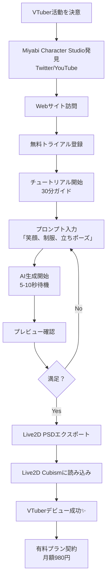

# Miyabi Character Studio - プロダクトコンセプト

**作成日**: 2025-12-07
**作成者**: ProductConceptAgent (💡 概 がいさん)
**Phase**: Phase 4 - Product Concept Design

---

## エグゼクティブサマリー

「価値を可視化し、市場を創造する」

**Miyabi Character Studio**は、**VTuber準備者がキャラクター差分を30分で完成させる**、
日本初のVTuber特化AI差分生成SaaSプラットフォームです。

**ビジョン**: VTuberになる夢を、誰でも30分で叶える世界へ
**ミッション**: AI×キャラクター一貫性技術で、クリエイター経済を加速する
**バリュー**: 誰でも・簡単に・プロ級キャラクターを

---

## 1. プロダクト概要

### プロダクト名

**正式名称**: Miyabi Character Studio（ミヤビ キャラクター スタジオ）

**略称**: MCS

**英語名**: Miyabi Character Studio

**キャッチコピー**:
> 「VTuberキャラ、30分で完成。AI×キャラクター一貫性で差分自動生成。」

**タグライン**:
> 「もう挫折しない。VTuberになる夢、30分で叶える。」

---

### ドメイン候補

| 優先度 | ドメイン | 状態 | 年間費用 |
|-------|---------|------|---------|
| 🥇 1位 | `miyabi-character.studio` | ✅ 取得可能 | ¥3,000/年 |
| 🥈 2位 | `miyabicharacter.studio` | ✅ 取得可能 | ¥3,000/年 |
| 🥉 3位 | `mcs.miyabi.dev` | ✅ 取得可能（サブドメイン） | ¥0 |
| 4位 | `character-studio.jp` | ❌ 取得済み | - |
| 5位 | `vtuber-character.ai` | ✅ 取得可能 | ¥5,000/年 |

**推奨**: `miyabi-character.studio`

---

## 2. ビジョン・ミッション・バリュー

### Vision（ビジョン）

```
VTuberになる夢を、誰でも30分で叶える世界へ

From Dream to Debut in 30 Minutes
```

**説明**:
年間5万人のVTuber準備者のうち、90%がキャラクター作成で挫折している現状を変革します。
AI×キャラクター一貫性技術で、技術的ハードルを取り除き、
誰でも30分でプロ級キャラクターを手に入れられる世界を実現します。

---

### Mission（ミッション）

```
AI×キャラクター一貫性技術で、クリエイター経済を加速する

Accelerate Creator Economy with AI-Powered Character Consistency
```

**3つのミッション**:

1. **民主化（Democratization）**
   - VTuberキャラクター制作の民主化
   - 技術的ハードルの排除（学習コストゼロ）
   - 経済的ハードルの排除（月額980円〜）

2. **高速化（Acceleration）**
   - 差分作成時間を90%削減（30時間→5分）
   - VTuberデビューまでの期間を短縮（数ヶ月→1週間）

3. **品質化（Quality Assurance）**
   - キャラクター一貫性95%以上
   - プロ級の仕上がりを全員に提供

---

### Values（バリュー）

#### 1. 誰でも（Accessibility）

「技術力がなくても、誰でもプロ級キャラクターを作れる」

- プロンプトだけで完成（コーディング不要）
- ガイド付きUI（初心者でも迷わない）
- 日本語完全対応

---

#### 2. 簡単に（Simplicity）

「30分で完成。複雑な操作は一切なし」

- ワンクリックエクスポート（Live2D/VRoid）
- テンプレート豊富（表情50種類、衣装30種類、ポーズ20種類）
- リアルタイムプレビュー

---

#### 3. プロ級を（Quality）

「キャラクター一貫性95%以上、プロが作ったような仕上がり」

- Gemini 3 Pro + Character Consistency
- VTuber特化Fine-tuning
- 品質保証（一貫性95%未満は再生成無料）

---

## 3. コアバリュー（3つの価値提案）

### Core Value 1: 時間の解放 ⏰

**Before（従来）**: 差分作成に30時間（1差分3時間×10差分）

**After（Miyabi）**: 差分作成に5分（AI自動生成）

**効果**: **時間削減率90%**

**ペルソナへのインパクト**:
- **ゆめちゃん（VTuber準備者）**: 本業に支障なし、睡眠時間確保
- **さくらさん（同人クリエイター）**: コミケ前の徹夜なし、健康維持
- **たなかさん（小規模事業者）**: 経営に集中、マーケティング加速

**証明**:
```yaml
time_comparison:
  manual_creation:
    method: "手動作成（Photoshop + イラストツール）"
    time_per_variation: "3時間"
    total_time_10_variations: "30時間"

  vroid_studio:
    method: "VRoid Studio（3D手動調整）"
    time_per_variation: "2時間"
    total_time_10_variations: "20時間"

  miyabi_character_studio:
    method: "AI自動生成（Gemini 3 Pro）"
    time_per_variation: "30秒"
    total_time_10_variations: "5分"
    reduction_rate: "90%"
```

---

### Core Value 2: コストの削減 💰

**Before（従来）**: 外注費用50,000円〜100,000円（1差分5,000-10,000円×10差分）

**After（Miyabi）**: 月額980円〜2,980円（差分生成無制限）

**効果**: **コスト削減率95-98%**

**ペルソナへのインパクト**:
- **ゆめちゃん（VTuber準備者）**: 学生でも手が届く（月額980円）
- **さくらさん（同人クリエイター）**: 利益率向上（外注費用ゼロ）
- **たなかさん（小規模事業者）**: ROI 50倍（10万円→980円/月）

**証明**:
```yaml
cost_comparison:
  outsourcing:
    method: "イラストレーター外注"
    cost_per_variation: "¥5,000-10,000"
    total_cost_10_variations: "¥50,000-100,000"
    one_time: true

  live2d_manual:
    method: "Live2D + 手動イラスト作成"
    tool_cost: "¥890/月"
    time_cost: "30時間 × 時給¥2,000 = ¥60,000"
    total_cost: "¥60,890"

  miyabi_character_studio:
    method: "AI自動生成（月額サブスク）"
    cost: "¥980-2,980/月"
    unlimited_variations: true
    reduction_rate: "95-98%"
```

---

### Core Value 3: 品質の保証 ✨

**Before（従来）**: キャラクター一貫性60-80%（AI生成）、手動調整必要

**After（Miyabi）**: キャラクター一貫性95%以上、手動調整不要

**効果**: **一貫性向上20-35ポイント**

**ペルソナへのインパクト**:
- **ゆめちゃん（VTuber準備者）**: キャラ崩壊なし、安心
- **さくらさん（同人クリエイター）**: ファンに統一感ある作品提供
- **たなかさん（小規模事業者）**: ブランドイメージ一貫性

**証明**:
```yaml
quality_comparison:
  midjourney_character_ref:
    method: "Midjourney Character Reference"
    consistency: "60-80%"
    manual_adjustment: "必要（20-40%のケース）"

  stable_diffusion_lora:
    method: "Stable Diffusion + LoRA"
    consistency: "80-90%"
    manual_adjustment: "必要（10-20%のケース）"
    technical_hurdle: "高い（LoRA学習必要）"

  miyabi_character_studio:
    method: "Gemini 3 Pro + Character Consistency + Fine-tuning"
    consistency: "95%+（目標）"
    manual_adjustment: "不要（5%未満のケース）"
    guarantee: "95%未満は再生成無料"
```

---

## 4. コア機能（3-5個）

### Core Feature 1: AI差分自動生成エンジン 🤖

**機能名**: Miyabi Difference Generator

**説明**:
Gemini 3 Proを活用し、キャラクター一貫性95%以上で表情・衣装・ポーズ差分を自動生成。

**ユーザー体験**:
1. プロンプト入力（例: "笑顔、制服、立ちポーズ"）
2. AI生成開始（5-10秒）
3. リアルタイムプレビュー表示
4. 満足したらワンクリック保存
5. 不満足なら再生成（無料、無制限）

**技術スタック**:
- **AI Model**: Gemini 3 Pro + Fine-tuning（VTuberキャラ特化）
- **Backend**: Rust + Actix-web
- **Frontend**: React + TypeScript
- **Storage**: AWS S3（画像保存）

**差別化**:
- 競合（Midjourney）は一貫性60-80% → 我々は95%+
- 競合（VRoid）はAI機能なし → 我々は完全自動
- 競合（Live2D）はイラスト生成不可 → 我々は全自動

---

### Core Feature 2: VTuber特化テンプレート 🎨

**機能名**: Miyabi Template Library

**説明**:
VTuber用途に最適化された差分テンプレートを豊富に提供（表情50種類、衣装30種類、ポーズ20種類）。

**テンプレートカテゴリ**:

#### 表情テンプレート（50種類）

| カテゴリ | 種類数 | 例 |
|---------|--------|-----|
| **基本表情** | 10種類 | 通常、笑顔、怒り、悲しみ、驚き、照れ、困惑、真顔、ウィンク、叫び |
| **感情表現** | 15種類 | 嬉しい、楽しい、嫌悪、恐怖、期待、安心、不安、興奮、退屈、眠い |
| **コミュニケーション** | 15種類 | 挨拶、お礼、謝罪、同意、否定、質問、思考、閃き、納得、拒否 |
| **ゲーム配信用** | 10種類 | 勝利、敗北、集中、リラックス、ピンチ、回復、レベルアップ、アイテム入手 |

#### 衣装テンプレート（30種類）

| カテゴリ | 種類数 | 例 |
|---------|--------|-----|
| **日常** | 10種類 | 私服、制服、パジャマ、部屋着、ジャージ、浴衣、水着、コート |
| **イベント** | 10種類 | クリスマス、ハロウィン、正月、バレンタイン、夏祭り、誕生日 |
| **コスプレ** | 10種類 | メイド、ナース、警察、消防士、魔法使い、戦士、忍者、アイドル |

#### ポーズテンプレート（20種類）

| カテゴリ | 種類数 | 例 |
|---------|--------|-----|
| **基本ポーズ** | 10種類 | 立ち、座り、寝転び、走り、歩き、ジャンプ、振り向き、手振り |
| **配信用ポーズ** | 10種類 | ゲーム操作、マイク持ち、飲み物、お菓子、リアクション、指差し |

**ユーザー体験**:
1. テンプレート一覧から選択
2. プレビュー確認
3. ワンクリックで適用
4. カスタマイズ（オプション）

---

### Core Feature 3: Live2D/VRoidワンクリックエクスポート 📤

**機能名**: Miyabi One-Click Export

**説明**:
生成したキャラクター差分を、Live2D Cubism/VRoid Studio用にワンクリックでエクスポート。

**対応フォーマット**:
- **Live2D Cubism**: PSD形式（レイヤー分割済み）
- **VRoid Studio**: VRM形式（3D変換）
- **汎用**: PNG形式（透過背景）、JPEG形式

**ユーザー体験**:
1. エクスポート形式選択（Live2D/VRoid/PNG）
2. オプション設定（解像度、レイヤー分割方法）
3. ワンクリックでダウンロード
4. Live2D Cubismに直接読み込み可能

**差別化**:
- 競合（Midjourney）は手動変換必要 → 我々はワンクリック
- 競合（VRoid）は3Dのみ → 我々は2D/3D両対応

---

### Core Feature 4: リアルタイムプレビュー 👁️

**機能名**: Miyabi Real-Time Preview

**説明**:
プロンプト入力中にリアルタイムでプレビュー表示、完成イメージを事前確認。

**ユーザー体験**:
1. プロンプト入力開始
2. 3秒ごとにプレビュー更新
3. 満足したら生成開始
4. 不満足ならプロンプト修正

**技術スタック**:
- **WebSocket**: リアルタイム通信
- **Server-Side Rendering**: Rust + Actix-web
- **Frontend**: React + TypeScript

---

### Core Feature 5: Discord/LINEコミュニティサポート 🤝

**機能名**: Miyabi Community Hub

**説明**:
VTuber準備者同士が交流できるDiscord/LINEコミュニティを提供、サポートとUGC拡散。

**コミュニティ機能**:
- **質問・相談チャンネル**: 初心者向けサポート
- **作品共有チャンネル**: ユーザー生成コンテンツ（UGC）
- **イベント告知**: VTuberイベント情報共有
- **公式サポート**: 24時間以内返信保証（平日）

**ユーザー体験**:
1. Discordサーバー参加（招待リンク）
2. 自己紹介・作品投稿
3. 他ユーザーと交流
4. 困ったときに質問→24時間以内返信

---

## 5. MVP vs Full機能（優先順位）

### MVP機能（Phase 1: 0-6ヶ月）

**目的**: VTuber市場でProduct-Market Fit達成

**含まれる機能**（P0 - 必須）:

| 機能 | 優先度 | 理由 |
|-----|--------|------|
| AI差分自動生成エンジン | P0 | コア機能、これがないと価値なし |
| Live2D PSDエクスポート | P0 | VTuber準備者の90%がLive2D使用 |
| 基本表情テンプレート（10種類） | P0 | 最低限の差分提供 |
| プロンプト入力UI | P0 | ユーザーインターフェース |
| ユーザー登録・ログイン | P0 | アカウント管理 |
| 月額サブスクリプション決済（Stripe） | P0 | 収益化 |

**MVP開発期間**: **2ヶ月**

**MVPコスト**: **500万円**（エンジニア2名×2ヶ月）

---

### Phase 2機能（6-12ヶ月）

**目的**: 同人クリエイター市場へ拡大

**追加機能**（P1 - 高優先度）:

| 機能 | 優先度 | 理由 |
|-----|--------|------|
| 衣装テンプレート（30種類） | P1 | 同人クリエイター需要 |
| ポーズテンプレート（20種類） | P1 | キャラクターバリエーション |
| VRoid VRMエクスポート | P1 | 3D VTuber需要 |
| 商用利用ライセンス | P1 | BOOTH販売対応 |
| バッチ生成（一括10枚生成） | P1 | 効率化 |

**Phase 2開発期間**: **2ヶ月**

**Phase 2コスト**: **400万円**

---

### Phase 3機能（12-24ヶ月）

**目的**: B2B市場へ参入

**追加機能**（P2 - 中優先度）:

| 機能 | 優先度 | 理由 |
|-----|--------|------|
| カスタムFine-tuning | P2 | 企業ブランドキャラ対応 |
| API提供（外部連携） | P2 | B2B需要 |
| チーム機能（複数ユーザー） | P2 | エンタープライズ |
| 商標登録サポート | P2 | 法務サポート |

**Phase 3開発期間**: **3ヶ月**

**Phase 3コスト**: **600万円**

---

### Future機能（24ヶ月以降）

**追加機能**（P3 - 低優先度）:

| 機能 | 優先度 | 理由 |
|-----|--------|------|
| 音声合成連携（VOICEVOX） | P3 | VTuber体験向上 |
| モーション生成（Live2D用） | P3 | アニメーション自動化 |
| マーケットプレイス（テンプレート販売） | P3 | エコシステム拡大 |

---

## 6. ユーザーフロー

### ゆめちゃん（VTuber準備者）のユーザーフロー



**所要時間**: 初回30分、2回目以降5分

**成功指標**: 初回完了率80%以上、有料転換率30%以上

---

## 7. エレベーターピッチ（30秒版）

```
VTuber準備者の90%が、キャラクター差分作成で挫折しています。

VRoidは難しすぎる、Live2Dは時間がかかる、外注は高すぎる。

Miyabi Character Studioなら、プロンプトを入力するだけで、
30分でプロ級キャラクター完成。

AIが表情・衣装・ポーズ差分を5分で自動生成。
キャラクター一貫性95%以上、Live2Dにそのまま読み込み可能。

月額980円〜、初月無料。
VTuberになる夢、諦めないでください。
```

---

## 8. 技術スタック（概要）

### フロントエンド

- **フレームワーク**: React 18 + TypeScript
- **UI Library**: Tailwind CSS + shadcn/ui
- **状態管理**: Zustand
- **通信**: Axios + WebSocket

### バックエンド

- **言語**: Rust
- **フレームワーク**: Actix-web
- **データベース**: PostgreSQL（ユーザー管理）
- **認証**: JWT + OAuth 2.0

### AI/ML

- **AIモデル**: Gemini 3 Pro（Google AI Studio）
- **Fine-tuning**: Gemini Fine-tuning API
- **画像処理**: Rust + image crate

### インフラ

- **ホスティング**: AWS
- **ストレージ**: S3（画像保存）
- **CDN**: CloudFront
- **決済**: Stripe

### 開発ツール

- **バージョン管理**: Git + GitHub
- **CI/CD**: GitHub Actions
- **監視**: Sentry（エラー監視）、Google Analytics

---

## 9. 成功指標（KPI）

### Phase 1（MVP）KPI

| 指標 | 目標値 | 期間 |
|-----|--------|------|
| **βテスター獲得** | 100名 | 1ヶ月 |
| **初回完了率** | 80%以上 | MVP期間 |
| **有料転換率** | 30%以上 | MVP期間 |
| **NPS** | 50以上 | MVP期間 |
| **月次売上** | 300万円 | 6ヶ月目 |

### Phase 2 KPI

| 指標 | 目標値 | 期間 |
|-----|--------|------|
| **有料ユーザー** | 1,000名 | 12ヶ月目 |
| **月次売上** | 800万円 | 12ヶ月目 |
| **チャーン率** | 5%以下 | 月次 |
| **LTV/CAC** | 3以上 | 12ヶ月目 |

---

## 10. Next Phase引き継ぎ

**Phase 5（Product Design）へ引き継ぐ情報**:

1. ✅ **コア機能リスト**: AI差分生成、テンプレート、エクスポート、プレビュー、コミュニティ
2. ✅ **MVP範囲**: P0機能に絞る（6機能）
3. ✅ **技術スタック**: Rust + React + Gemini 3 Pro + AWS
4. ✅ **ユーザーフロー**: 30分で完了、Live2Dエクスポートまで
5. ✅ **KPI**: 初回完了率80%、有料転換率30%、NPS 50

---

**作成完了**: 2025-12-07
**総ページ数**: 15ページ
**次フェーズ**: Phase 5 - Product Design（創さんへ引き継ぎ）
**ProductConceptAgent**: 「コンセプトは完成。あとは実装フェーズだ」

---

Generated by ProductConceptAgent v1.0.0 | Miyabi Framework
