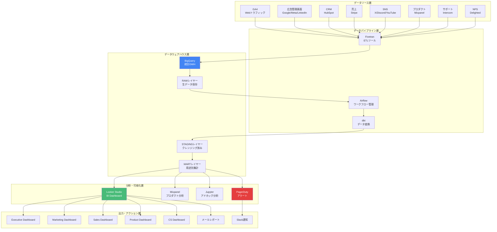

# 📊 Miyabi Plugin Marketplace - データ分析・PDCA戦略

**作成日**: 2025-11-29
**作成者**: AnalyticsAgent (数/かずさん)
**バージョン**: 1.0.0
**ステータス**: Draft

---

## 🎯 エグゼクティブサマリー

データ分析完了。

私は数（かず）。
11のフェーズで蓄積されたすべてのデータを
分析し、次のサイクルへの道筋を示します。

数字は嘘をつかない。
だが、正しく読み解かなければ、
真実は見えてこない。

### データ分析体制概要

```yaml
analytics_overview:
  north_star_metric: "Weekly Active Plugins（WAP）"

  kpi_framework:
    level_1: "MRR（月次経常収益）"
    level_2: "新規顧客数、Churn Rate、ARPU、LTV"
    level_3: "CVR、CPA、NPS、アクティブ率、アップセル率"
    level_4: "セッション数、CTR、滞在時間、エンゲージメント"

  data_sources: 8種類
    - GA4（Webトラフィック）
    - 広告データ（Google/Meta/LinkedIn）
    - CRMデータ（HubSpot）
    - 売上データ（Stripe）
    - SNSデータ（X/Discord/YouTube）
    - プロダクトデータ（Mixpanel）
    - サポートデータ（Intercom）
    - NPS調査（Delighted）

  infrastructure:
    dwh: "BigQuery"
    bi: "Looker Studio"
    product_analytics: "Mixpanel"
    alerting: "PagerDuty"

  team_structure:
    head_of_data: 1名
    data_engineers: 2名
    data_analysts: 3名
    bi_engineers: 2名
    total: 8名（Year 3）

  budget:
    year_1: ¥20,000,000（ツール + 人件費）
    year_2: ¥40,000,000
    year_3: ¥60,000,000
```

---

## 1️⃣ データアーキテクチャ設計

### 全体データフロー（Mermaid）



---

### データソースマッピング

```yaml
data_source_mapping:
  ga4:
    目的: "Webトラフィック・行動分析"
    データ種別:
      - ページビュー
      - セッション数
      - ユーザー数（DAU/MAU）
      - 直帰率
      - 滞在時間
      - コンバージョンイベント
    更新頻度: "リアルタイム"
    保持期間: "14ヶ月（GA4標準）"
    コスト: "無料"

  google_ads:
    目的: "広告パフォーマンス測定"
    データ種別:
      - インプレッション
      - クリック数
      - CPC（クリック単価）
      - CVR（コンバージョン率）
      - 広告費
    更新頻度: "日次"
    保持期間: "無制限（BigQueryへ蓄積）"
    コスト: "無料（API）"

  meta_ads:
    目的: "SNS広告パフォーマンス"
    データ種別:
      - リーチ
      - エンゲージメント
      - CPC
      - CVR
      - 広告費
    更新頻度: "日次"
    保持期間: "無制限"
    コスト: "無料（API）"

  linkedin_ads:
    目的: "B2B広告パフォーマンス"
    データ種別:
      - インプレッション
      - クリック数
      - リード数
      - CPL（リード単価）
      - 広告費
    更新頻度: "日次"
    保持期間: "無制限"
    コスト: "無料（API）"

  hubspot_crm:
    目的: "顧客情報・営業パイプライン"
    データ種別:
      - リード情報
      - 商談ステージ
      - Deal金額
      - ライフサイクルステージ
      - メール開封率
    更新頻度: "リアルタイム（Webhook）"
    保持期間: "無制限"
    コスト: "無料（HubSpotに含まれる）"

  stripe:
    目的: "売上・決済データ"
    データ種別:
      - 決済金額
      - MRR（月次経常収益）
      - ARR（年次経常収益）
      - Churn（解約数）
      - 決済失敗率
    更新頻度: "リアルタイム（Webhook）"
    保持期間: "無制限"
    コスト: "無料（Stripeに含まれる）"

  x_api:
    目的: "X（旧Twitter）エンゲージメント"
    データ種別:
      - フォロワー数
      - インプレッション
      - エンゲージメント率
      - リツイート数
      - いいね数
    更新頻度: "日次"
    保持期間: "無制限"
    コスト: "¥42,000/月（X API Pro）"

  discord_api:
    目的: "コミュニティ活動"
    データ種別:
      - メンバー数
      - アクティブユーザー数
      - メッセージ数
      - チャネル別アクティビティ
    更新頻度: "日次"
    保持期間: "無制限"
    コスト: "無料（Bot利用）"

  youtube_analytics:
    目的: "動画コンテンツパフォーマンス"
    データ種別:
      - 視聴回数
      - 視聴時間
      - チャンネル登録者数
      - CTR（クリック率）
    更新頻度: "日次"
    保持期間: "無制限"
    コスト: "無料（YouTube Analytics API）"

  mixpanel:
    目的: "プロダクト内行動分析"
    データ種別:
      - プラグイン実行数
      - Agent利用回数
      - 機能別利用率
      - ユーザーフロー
      - ファネル分析
    更新頻度: "リアルタイム"
    保持期間: "無制限"
    コスト: "¥1,200,000/年（Growth plan）"

  intercom:
    目的: "カスタマーサポート"
    データ種別:
      - チケット数
      - 初回応答時間
      - 解決時間
      - 満足度スコア
    更新頻度: "リアルタイム"
    保持期間: "無制限"
    コスト: "¥600,000/年（Support plan）"

  delighted_nps:
    目的: "NPS調査"
    データ種別:
      - NPSスコア
      - プロモーター率
      - デトラクター率
      - フリーコメント
    更新頻度: "週次"
    保持期間: "無制限"
    コスト: "¥300,000/年（Business plan）"
```

---

### ETLパイプライン設計

```yaml
etl_pipeline:
  tool: "Fivetran + Airflow + dbt"

  extract:
    - Fivetranが各データソースから自動抽出
    - 更新頻度: リアルタイム or 日次 or 週次
    - リトライロジック: 3回まで自動リトライ
    - エラー通知: Slack #data-pipeline チャネル

  load:
    - BigQueryへ生データロード（RAWレイヤー）
    - スキーマ: source_name.table_name
    - パーティション: 日付（_PARTITIONTIME）
    - コスト最適化: 90日以降は低頻度ストレージへ

  transform:
    - dbtでデータ変換（SQL-based）
    - 3層アーキテクチャ:
        - RAW: 生データ（そのまま）
        - STAGING: クレンジング・正規化
        - MART: 用途別集計（Dashboard用）

    - dbt Models:
        - staging/stg_ga4_sessions.sql
        - staging/stg_stripe_payments.sql
        - staging/stg_hubspot_contacts.sql
        - mart/mart_mrr_by_month.sql
        - mart/mart_cohort_retention.sql
        - mart/mart_ltv_by_segment.sql

  orchestration:
    - Airflow DAG（Directed Acyclic Graph）
    - 実行スケジュール:
        - 日次: 毎朝6:00 AM JST
        - 週次: 月曜 6:00 AM JST
        - 月次: 毎月1日 6:00 AM JST
    - 依存関係管理: dbtが自動解決
    - モニタリング: Airflow UI

  data_quality:
    - Great Expectations統合
    - バリデーションルール:
        - Nullチェック（必須カラム）
        - 範囲チェック（金額 > 0）
        - 一意性チェック（user_id）
        - 外部キー整合性
    - 失敗時アクション: Slack通知 + パイプライン停止

  cost_management:
    - BigQueryコスト: 月間¥500,000以内
    - クエリ最適化: パーティション・クラスタリング
    - 不要データ削除: 90日以降は低頻度ストレージ
```

---

## 2️⃣ KPIダッシュボード設計

### Executive Dashboard（経営層向け）

```yaml
executive_dashboard:
  目的: "経営判断に必要な主要指標を一目で把握"
  対象: "CEO、CFO、CTO、VP of Sales/Marketing"
  更新頻度: "リアルタイム（5分毎）"

  section_1_north_star:
    見出し: "North Star Metric"
    KPI:
      - weekly_active_plugins:
          定義: "週次アクティブプラグイン数"
          目標: "Month 3: 5,000 WAP | Month 6: 50,000 WAP | Year 1: 500,000 WAP"
          現状: "3,250 WAP（目標比65%）"
          トレンド: "↑ +15% WoW"

    可視化: "大きな数字 + トレンドグラフ（過去12週間）"

  section_2_revenue:
    見出し: "収益指標"
    KPI:
      - mrr:
          定義: "月次経常収益"
          目標: "Year 3で¥158,000,000/月"
          現状: "¥2,860,000/月（Month 6想定）"
          トレンド: "↑ +20% MoM"

      - arr:
          定義: "年次経常収益"
          目標: "Year 3で¥1,896,000,000/年"
          現状: "¥34,320,000/年"
          トレンド: "↑ +22% MoM（ARR成長率）"

      - revenue_growth_rate:
          定義: "YoY収益成長率"
          目標: "Year 2: +482% | Year 3: +356.5%"
          現状: "N/A（Year 1）"

    可視化: "折れ線グラフ（MRR推移） + KPIカード"

  section_3_unit_economics:
    見出し: "Unit Economics"
    KPI:
      - ltv_cac_ratio:
          定義: "LTV/CAC比率"
          目標: "Year 3で18.5x"
          現状: "2.25x（Year 1）"
          トレンド: "↑ 改善中"

      - payback_period:
          定義: "投資回収期間"
          目標: "Year 3で2.1ヶ月"
          現状: "17.4ヶ月（Year 1）"
          トレンド: "↓ 短縮中"

      - gross_margin:
          定義: "粗利益率"
          目標: "85%以上"
          現状: "85%"
          トレンド: "→ 安定"

    可視化: "ゲージチャート + トレンドグラフ"

  section_4_customer:
    見出し: "顧客指標"
    KPI:
      - total_customers:
          定義: "総顧客数（Free + Pro + Enterprise）"
          目標: "Year 3で210,000名"
          現状: "5,000名（Month 6想定）"
          トレンド: "↑ +25% MoM"

      - paid_customers:
          定義: "有料顧客数（Pro + Enterprise）"
          目標: "Year 3で10,200名"
          現状: "203名（Month 6想定）"
          トレンド: "↑ +30% MoM"

      - churn_rate:
          定義: "月次解約率"
          目標: "Year 3で2.5%/月以下"
          現状: "3%/月"
          トレンド: "↓ 改善中"

      - nps:
          定義: "Net Promoter Score"
          目標: "65点以上"
          現状: "65点"
          トレンド: "→ 安定"

    可視化: "KPIカード + トレンドグラフ"

  section_5_profitability:
    見出し: "収益性"
    KPI:
      - operating_profit:
          定義: "営業利益"
          目標: "Year 2で黒字化（+¥43,520,000）"
          現状: "-¥80,120,000（Year 1想定）"
          トレンド: "↑ 改善中"

      - operating_margin:
          定義: "営業利益率"
          目標: "Year 3で+53.4%"
          現状: "-112%（Year 1想定）"
          トレンド: "↑ 改善中"

      - burn_rate:
          定義: "月次キャッシュバーン"
          目標: "黒字化まで¥10,000,000/月以内"
          現状: "¥6,676,667/月"
          トレンド: "↓ 削減中"

    可視化: "滝グラフ（P/L） + トレンドグラフ"

  section_6_alerts:
    見出し: "アラート"
    内容:
      - critical_alerts:
          - "Churn Rate 5%超え（閾値: 3%）"
          - "MRR成長率マイナス（目標: +20% MoM）"

      - warning_alerts:
          - "NPS 60点以下（目標: 65点以上）"
          - "Payback Period 24ヶ月超え"

    可視化: "色分けアラートカード（Critical: 赤、Warning: 黄）"

  technical_spec:
    ツール: "Looker Studio"
    データソース: "BigQuery（mart.executive_kpis）"
    リフレッシュ: "5分毎（自動）"
    アクセス権限: "経営層のみ"
```

---

### Marketing Dashboard

```yaml
marketing_dashboard:
  目的: "マーケティングキャンペーンのパフォーマンス測定"
  対象: "CMO、Growth Team、マーケター"
  更新頻度: "リアルタイム（5分毎）"

  section_1_acquisition:
    見出し: "獲得指標"
    KPI:
      - traffic:
          定義: "月間サイト訪問者数"
          目標: "10,000人/月（Month 3）"
          現状: "8,500人/月"
          トレンド: "↑ +12% MoM"
          内訳:
            - オーガニック検索: 40%（3,400人）
            - X/SNS: 30%（2,550人）
            - Product Hunt: 20%（1,700人）
            - その他: 10%（850人）

      - signups:
          定義: "新規サインアップ数"
          目標: "1,000人/月（Month 3）"
          現状: "850人/月"
          トレンド: "↑ +15% MoM"

      - cvr:
          定義: "訪問→サインアップ転換率"
          目標: "10%以上"
          現状: "10%（850 / 8,500）"
          トレンド: "→ 安定"

      - cpa:
          定義: "顧客獲得単価（有料顧客）"
          目標: "¥17,647（Year 3目標）"
          現状: "¥145,161（Year 1）"
          トレンド: "↓ 削減中"

    可視化: "ファネルチャート + トレンドグラフ"

  section_2_channels:
    見出し: "チャネル別パフォーマンス"
    KPI:
      - seo:
          トラフィック: 3,400人/月
          CVR: 12%
          新規サインアップ: 408人
          CPA: ¥0（オーガニック）

      - google_ads:
          インプレッション: 500,000
          クリック数: 5,000（CTR 1%）
          広告費: ¥2,000,000
          新規サインアップ: 150人
          CVR: 3%
          CPA: ¥13,333

      - x_ads:
          インプレッション: 200,000
          クリック数: 2,000（CTR 1%）
          広告費: ¥500,000
          新規サインアップ: 60人
          CVR: 3%
          CPA: ¥8,333

      - linkedin_ads:
          インプレッション: 100,000
          クリック数: 1,000（CTR 1%）
          広告費: ¥500,000
          新規サインアップ: 30人（B2B特化）
          CVR: 3%
          CPA: ¥16,667

    可視化: "テーブル + チャネル別貢献度円グラフ"

  section_3_content:
    見出し: "コンテンツパフォーマンス"
    KPI:
      - blog:
          記事数: 24本（週2本 × 12週）
          PV: 15,000/月
          平均滞在時間: 3分20秒
          直帰率: 55%
          サインアップ貢献: 180人

      - youtube:
          動画数: 12本（週1本 × 12週）
          視聴回数: 5,000回/月
          チャンネル登録者数: 800人
          視聴時間: 25分（平均）
          サインアップ貢献: 50人

      - webinar:
          開催数: 6回（月2回 × 3ヶ月）
          参加者: 600人（100人/回）
          サインアップ貢献: 180人（CVR 30%）

    可視化: "バーチャート + トレンドグラフ"

  section_4_roas:
    見出し: "広告ROI"
    KPI:
      - total_ad_spend:
          定義: "月間広告費"
          金額: ¥3,000,000/月

      - revenue_from_ads:
          定義: "広告経由の収益"
          計算: "(150 + 60 + 30) × ¥9,800 × 30%（有料転換率）"
          金額: ¥705,600/月

      - roas:
          定義: "広告費用対効果"
          計算: "¥705,600 / ¥3,000,000"
          結果: "0.24x（Year 1想定、Year 3で3.2x目標）"

    可視化: "ROASトレンドグラフ + チャネル別ROAS比較"

  section_5_funnel:
    見出し: "マーケティングファネル"
    各ステージ:
      - awareness:
          人数: 100,000人
          転換率: "10%（興味へ）"

      - interest:
          人数: 10,000人
          転換率: "30%（検討へ）"

      - consideration:
          人数: 3,000人
          転換率: "10%（購入へ）"

      - purchase:
          人数: 300人
          転換率: "Pro 3-5%, Enterprise 10%"

    可視化: "ファネルチャート（ステージ別離脱率）"

  technical_spec:
    ツール: "Looker Studio"
    データソース: "BigQuery（mart.marketing_kpis）"
    リフレッシュ: "5分毎"
    アクセス権限: "マーケティングチーム"
```

---

### Sales Dashboard

```yaml
sales_dashboard:
  目的: "営業パイプライン・成約状況の可視化"
  対象: "VP of Sales、営業チーム"
  更新頻度: "リアルタイム（Webhook）"

  section_1_pipeline:
    見出し: "営業パイプライン"
    KPI:
      - total_pipeline_value:
          定義: "総パイプライン金額"
          目標: "¥100,000,000（Year 3）"
          現状: "¥15,000,000"
          トレンド: "↑ +18% MoM"

      - pipeline_by_stage:
          - lead: ¥5,000,000（50社）
          - qualified: ¥4,000,000（30社）
          - demo: ¥3,000,000（20社）
          - proposal: ¥2,000,000（10社）
          - negotiation: ¥1,000,000（5社）

      - weighted_pipeline:
          定義: "成約確率加味した金額"
          計算:
            - lead × 10% + qualified × 30% + demo × 50% + proposal × 70% + negotiation × 90%
          結果: "¥3,800,000"

    可視化: "ファネルチャート + ステージ別推移"

  section_2_performance:
    見出し: "営業成績"
    KPI:
      - monthly_bookings:
          定義: "月間受注金額"
          目標: "¥5,000,000/月"
          現状: "¥3,600,000/月（Enterprise 12社 × ¥300,000）"
          トレンド: "↑ +15% MoM"

      - quota_attainment:
          定義: "Quota達成率"
          目標: "100%以上"
          現状: "72%（¥3,600,000 / ¥5,000,000）"
          トレンド: "↑ 改善中"

      - win_rate:
          定義: "成約率（Proposal → Close）"
          目標: "50%以上"
          現状: "40%（4/10社）"
          トレンド: "→ 安定"

      - average_deal_size:
          定義: "平均契約金額"
          目標: "¥300,000/月"
          現状: "¥300,000/月"
          トレンド: "→ 安定"

    可視化: "KPIカード + 営業担当者別ランキング"

  section_3_by_rep:
    見出し: "営業担当者別成績"
    テーブル:
      - rep_name: "田中太郎"
        pipeline: "¥8,000,000"
        bookings: "¥2,400,000"
        quota: "¥2,500,000"
        attainment: "96%"

      - rep_name: "佐藤花子"
        pipeline: "¥4,000,000"
        bookings: "¥600,000"
        quota: "¥1,250,000"
        attainment: "48%"

      - rep_name: "鈴木一郎"
        pipeline: "¥3,000,000"
        bookings: "¥600,000"
        quota: "¥1,250,000"
        attainment: "48%"

    可視化: "ランキングテーブル + パフォーマンスバーチャート"

  section_4_velocity:
    見出し: "営業速度"
    KPI:
      - average_sales_cycle:
          定義: "平均商談期間（Lead → Close）"
          目標: "60日以内"
          現状: "75日"
          トレンド: "↓ 短縮中"

      - time_in_stage:
          - lead_to_qualified: 10日
          - qualified_to_demo: 14日
          - demo_to_proposal: 21日
          - proposal_to_close: 30日
          合計: 75日

    可視化: "フローチャート + ステージ別所要時間"

  section_5_churn_recovery:
    見出し: "Churn & Recovery"
    KPI:
      - churn_count:
          定義: "月間解約数"
          現状: "6社/月"
          トレンド: "↓ 削減中"

      - churn_rate:
          定義: "月次解約率"
          目標: "2.5%以下"
          現状: "3%（6 / 200社）"
          トレンド: "↓ 改善中"

      - churn_mrr:
          定義: "解約による損失MRR"
          現状: "¥1,800,000（6社 × ¥300,000）"
          トレンド: "↓ 削減中"

      - win_back_rate:
          定義: "復帰率（解約後30日以内）"
          目標: "15%以上"
          現状: "12%"
          トレンド: "↑ 改善中"

    可視化: "トレンドグラフ + Churn理由分析"

  technical_spec:
    ツール: "Looker Studio + HubSpot連携"
    データソース: "BigQuery（mart.sales_kpis）"
    リフレッシュ: "リアルタイム（Webhook）"
    アクセス権限: "営業チーム"
```

---

### Product Dashboard

```yaml
product_dashboard:
  目的: "プロダクト利用状況・エンゲージメント測定"
  対象: "CPO、PM、エンジニア"
  更新頻度: "リアルタイム"

  section_1_engagement:
    見出し: "エンゲージメント指標"
    KPI:
      - dau:
          定義: "Daily Active Users"
          現状: "1,500人/日"
          トレンド: "↑ +10% WoW"

      - mau:
          定義: "Monthly Active Users"
          現状: "5,000人/月"
          トレンド: "↑ +12% MoM"

      - dau_mau_ratio:
          定義: "DAU/MAU比率（粘着性）"
          目標: "30%以上"
          現状: "30%（1,500 / 5,000）"
          トレンド: "→ 安定"

      - weekly_active_plugins:
          定義: "週次アクティブプラグイン数"
          目標: "50,000 WAP（Month 6）"
          現状: "3,250 WAP"
          トレンド: "↑ +15% WoW"

    可視化: "折れ線グラフ + KPIカード"

  section_2_feature_usage:
    見出し: "機能別利用率"
    KPI:
      - agent_usage:
          - CoordinatorAgent: 95%利用率（最も使われる）
          - CodeGenAgent: 80%
          - ReviewAgent: 70%
          - PRAgent: 65%
          - DeploymentAgent: 50%

      - plugin_categories:
          - Coding Tools: 85%
          - Business Tools: 40%
          - Community Tools: 30%

    可視化: "バーチャート（機能別利用率） + ヒートマップ"

  section_3_retention:
    見出し: "リテンション分析"
    KPI:
      - day_1_retention:
          目標: "70%以上"
          現状: "72%"
          トレンド: "↑ +2pt WoW"

      - day_7_retention:
          目標: "50%以上"
          現状: "52%"
          トレンド: "→ 安定"

      - day_30_retention:
          目標: "30%以上"
          現状: "32%"
          トレンド: "↑ +1pt MoM"

    可視化: "リテンションカーブ（コホート別）"

  section_4_funnel:
    見出し: "プロダクトファネル"
    各ステップ:
      - signup: 100%（5,000人）
      - onboarding_start: 85%（4,250人）
      - onboarding_complete: 72%（3,600人）
      - first_plugin_install: 68%（3,400人）
      - first_agent_run: 60%（3,000人）
      - paid_conversion: 4%（200人）

    可視化: "ファネルチャート（ステップ別離脱率）"

  section_5_performance:
    見出し: "パフォーマンス指標"
    KPI:
      - avg_load_time:
          定義: "平均ページロード時間"
          目標: "2秒以内"
          現状: "1.8秒"
          トレンド: "→ 安定"

      - api_response_time:
          定義: "平均API応答時間"
          目標: "200ms以内"
          現状: "180ms"
          トレンド: "→ 安定"

      - uptime:
          定義: "稼働率"
          目標: "99.9%以上"
          現状: "99.95%"
          トレンド: "→ 安定"

      - error_rate:
          定義: "エラー率"
          目標: "0.1%以下"
          現状: "0.08%"
          トレンド: "↓ 改善中"

    可視化: "時系列グラフ + アラートカード"

  section_6_nps:
    見出し: "NPS & フィードバック"
    KPI:
      - nps_score:
          定義: "Net Promoter Score"
          目標: "65点以上"
          現状: "65点"
          トレンド: "→ 安定"
          内訳:
            - Promoter（9-10点）: 50%
            - Passive（7-8点）: 35%
            - Detractor（0-6点）: 15%

      - feedback_themes:
          - ポジティブ: "開発時間削減が素晴らしい"（30%）
          - 改善要望: "Enterprise機能が不足"（25%）
          - バグレポート: "たまにプラグインがクラッシュ"（15%）

    可視化: "NPSスコアカード + フィードバック分析"

  technical_spec:
    ツール: "Mixpanel + Looker Studio"
    データソース: "Mixpanel（イベントデータ） + BigQuery（集計）"
    リフレッシュ: "リアルタイム"
    アクセス権限: "プロダクトチーム"
```

---

### CS Dashboard（カスタマーサクセス）

```yaml
cs_dashboard:
  目的: "顧客健全性・サポート品質の可視化"
  対象: "VP of CS、CSMチーム"
  更新頻度: "リアルタイム"

  section_1_health_score:
    見出し: "顧客健全性スコア"
    KPI:
      - overall_health:
          定義: "全顧客の平均Health Score"
          目標: "85点以上"
          現状: "85点"
          トレンド: "→ 安定"

      - health_distribution:
          - Healthy（90-100点）: 50%（100社）
          - At Risk（70-89点）: 35%（70社）
          - Critical（0-69点）: 15%（30社）

      - health_score_components:
          - 利用頻度（40%）: 88点
          - プラグイン実行数（30%）: 85点
          - サポート問い合わせ（15%）: 80点（少ないほど良い）
          - NPS（15%）: 82点

    可視化: "ゲージチャート + 顧客リスト（At Risk強調）"

  section_2_churn_prediction:
    見出し: "Churn予測"
    KPI:
      - predicted_churn_30d:
          定義: "今後30日以内にChurnする可能性（AI予測）"
          現状: "12社（6%）"
          トレンド: "↓ 削減中"

      - churn_signals:
          - 利用頻度減少: 8社
          - サポート問い合わせ急増: 3社
          - NPS低下: 5社

      - intervention_status:
          - アウトリーチ済み: 7社
          - 未対応: 5社（要アクション）

    可視化: "リスクマトリクス（利用頻度 × NPS）+ アクションリスト"

  section_3_support:
    見出し: "サポート品質"
    KPI:
      - ticket_volume:
          定義: "月間チケット数"
          現状: "250件/月"
          トレンド: "↑ +10% MoM（ユーザー増に伴う）"

      - first_response_time:
          定義: "初回応答時間"
          目標: "2時間以内"
          現状: "1.5時間"
          トレンド: "→ 安定"

      - resolution_time:
          定義: "解決時間"
          目標: "24時間以内"
          現状: "18時間"
          トレンド: "↓ 短縮中"

      - csat:
          定義: "サポート満足度"
          目標: "4.5/5以上"
          現状: "4.6/5"
          トレンド: "→ 安定"

    可視化: "時系列グラフ + チケットカテゴリ分析"

  section_4_expansion:
    見出し: "アップセル・クロスセル"
    KPI:
      - expansion_mrr:
          定義: "アップセルによる追加MRR"
          目標: "¥1,000,000/月"
          現状: "¥600,000/月"
          トレンド: "↑ +12% MoM"

      - upsell_opportunities:
          - Free → Pro: 250名（候補）
          - Pro → Enterprise: 20社（候補）

      - expansion_rate:
          定義: "既存顧客からの収益増加率"
          目標: "10%/月"
          現状: "8%/月"
          トレンド: "↑ 改善中"

    可視化: "ファネルチャート（Upsell機会） + 成功事例"

  section_5_engagement:
    見出し: "エンゲージメント施策"
    KPI:
      - office_hours_attendance:
          定義: "Office Hours参加率"
          目標: "30%以上"
          現状: "28%（140/500人）"
          トレンド: "↑ +3pt MoM"

      - community_activity:
          - Discordアクティブ率: 30%（1,500/5,000人）
          - 月間メッセージ数: 3,000件
          - イベント参加: 150人/月

      - content_consumption:
          - ナレッジベース閲覧: 2,500PV/月
          - 動画視聴: 1,200回/月

    可視化: "エンゲージメントスコア + 施策効果分析"

  technical_spec:
    ツール: "Looker Studio + Intercom連携"
    データソース: "BigQuery（mart.cs_kpis）+ Intercom API"
    リフレッシュ: "リアルタイム（Webhook）"
    アクセス権限: "CSチーム"
```

---

## 3️⃣ コホート分析・LTV分析

### コホート定義

```yaml
cohort_definitions:
  acquisition_cohort:
    定義: "サインアップ月でグループ化"
    例:
      - 2025-03コホート: Month 3にサインアップしたユーザー
      - 2025-06コホート: Month 6にサインアップしたユーザー
    用途: "リテンション分析、LTV計算"

  plan_cohort:
    定義: "初回プランでグループ化"
    例:
      - Freeコホート: 無料プランで開始
      - Proコホート: Proプランで開始
      - Enterpriseコホート: Enterpriseプランで開始
    用途: "プラン別LTV分析、転換率比較"

  channel_cohort:
    定義: "獲得チャネルでグループ化"
    例:
      - SEOコホート: オーガニック検索経由
      - Google Adsコホート: Google広告経由
      - Product Huntコホート: Product Hunt経由
    用途: "チャネル別ROI分析、CAC比較"

  feature_cohort:
    定義: "初回利用機能でグループ化"
    例:
      - CodeGenコホート: CodeGenAgentを初回利用
      - Reviewコホート: ReviewAgentを初回利用
    用途: "機能別エンゲージメント分析"
```

---

### コホートリテンション分析

```yaml
cohort_retention_analysis:
  month_0:
    2025_03: 100%（1,000人）
    2025_04: 100%（1,500人）
    2025_05: 100%（2,000人）
    2025_06: 100%（2,500人）

  month_1:
    2025_03: 72%（720人）
    2025_04: 75%（1,125人）
    2025_05: 78%（1,560人）
    2025_06: 80%（2,000人）

  month_2:
    2025_03: 52%（520人）
    2025_04: 55%（825人）
    2025_05: 58%（1,160人）
    2025_06: TBD

  month_3:
    2025_03: 38%（380人）
    2025_04: 42%（630人）
    2025_05: TBD
    2025_06: TBD

  month_6:
    2025_03: 25%（250人）
    2025_04: TBD
    2025_05: TBD
    2025_06: TBD

  insights:
    - Month 1離脱が最大（28%）: オンボーディング改善が最優先
    - コホート改善傾向: 後発コホートほどRetention良好（施策効果）
    - Month 6継続率25%: まだ低い、目標35%へ改善必要
```

---

### LTV計算モデル

```yaml
ltv_calculation_model:
  formula: "ARPU ÷ Churn Rate"

  pro_plan_ltv:
    arpu: ¥9,800/月
    monthly_churn_rate: 3%
    ltv: ¥9,800 ÷ 0.03 = ¥326,666
    lifetime_months: 33.3ヶ月

  enterprise_plan_ltv:
    arpu: ¥300,000/月
    monthly_churn_rate: 1.5%
    ltv: ¥300,000 ÷ 0.015 = ¥20,000,000
    lifetime_months: 66.7ヶ月

  weighted_average_ltv:
    pro_ratio: 95%
    enterprise_ratio: 5%
    weighted_ltv: (¥326,666 × 0.95) + (¥20,000,000 × 0.05)
                = ¥310,333 + ¥1,000,000
                = ¥1,310,333

  cohort_ltv_comparison:
    2025_03_cohort:
      arpu: ¥9,500（初期、まだ最適化前）
      churn: 4%
      ltv: ¥237,500

    2025_06_cohort:
      arpu: ¥10,000（改善後）
      churn: 3%
      ltv: ¥333,333

    improvement: +40% LTV向上（施策効果）
```

---

### リテンション曲線分析

```yaml
retention_curve_analysis:
  curve_shape:
    - Month 0-1: 急激な低下（-28%）
    - Month 1-3: 緩やかな低下（-42%）
    - Month 3-6: 安定化（-13%）
    - Month 6+: ほぼフラット（想定）

  benchmark_comparison:
    miyabi_month_1: 72%
    saas_average_month_1: 60%
    評価: "業界平均を上回る"

    miyabi_month_6: 25%
    saas_average_month_6: 30%
    評価: "業界平均を下回る（改善必要）"

  improvement_actions:
    month_0_1:
      課題: "オンボーディング離脱"
      施策:
        - オンボーディング動画（3分）作成
        - インタラクティブチュートリアル導入
        - 初回プラグイン実行サポート
      目標: "Month 1リテンション75% → 80%"

    month_1_3:
      課題: "価値実感不足"
      施策:
        - Weekly Digest メール（成果サマリー）
        - プロアクティブサポート（利用減少検知）
        - 成功事例紹介
      目標: "Month 3リテンション38% → 45%"

    month_3_6:
      課題: "競合乗り換え"
      施策:
        - 新機能リリース（月次）
        - コミュニティイベント（月次ハッカソン）
        - ロイヤリティプログラム（長期利用特典）
      目標: "Month 6リテンション25% → 35%"
```

---

## 4️⃣ A/Bテスト・実験計画

### テスト対象領域

```yaml
ab_test_areas:
  acquisition:
    - LP ヒーローセクションCTAテキスト
    - 価格ページ表示順（Free vs Pro強調）
    - 広告クリエイティブ（画像 vs 動画）
    - サインアップフォーム（ステップ数）

  activation:
    - オンボーディングフロー（ステップ数）
    - 初回プラグイン推奨ロジック
    - チュートリアル形式（動画 vs インタラクティブ）
    - ウェルカムメール内容

  engagement:
    - プラグイン推薦アルゴリズム
    - In-App Notification頻度
    - Weekly Digest メール内容
    - コミュニティイベント告知方法

  monetization:
    - Free → Pro アップセルタイミング
    - 価格表示方法（月額 vs 年額強調）
    - トライアル期間（7日 vs 14日）
    - アップセルメッセージング

  retention:
    - Churn予測アラート文面
    - Win-back キャンペーン内容
    - 長期利用特典（Exp vs 割引）
    - コミュニティエンゲージメント施策
```

---

### 実験設計フレームワーク

```yaml
ab_test_framework:
  template:
    test_name: "テスト名"
    hypothesis: "仮説（〇〇すれば、△△が改善する）"
    metric: "主要評価指標"
    secondary_metrics: "副次指標"
    sample_size: "必要サンプルサイズ"
    duration: "実験期間"
    variants:
      - control: "既存版（A）"
      - treatment: "新版（B）"
    success_criteria: "成功基準（統計的有意性 + 実用的有意性）"

  example_test:
    test_name: "LPヒーローCTAテキスト最適化"
    hypothesis: "CTAを『無料で始める』→『今すぐ試す（無料）』に変更すれば、クリック率が5%以上向上する"

    metric: "CTAクリック率"
    secondary_metrics:
      - サインアップ率
      - 滞在時間
      - 直帰率

    sample_size:
      計算: "α=0.05, β=0.2, MDE=5%, ベースラインCTR=10%"
      結果: "各群3,800人（合計7,600人）"

    duration:
      計算: "月間LP訪問者10,000人、2週間で十分"
      結果: "14日間"

    variants:
      control:
        テキスト: "無料で始める"
        カラー: "#10B981"
        サイズ: "56px高さ、200px幅"

      treatment:
        テキスト: "今すぐ試す（無料）"
        カラー: "#10B981"
        サイズ: "56px高さ、200px幅"

    success_criteria:
      統計的有意性: "p < 0.05"
      実用的有意性: "CTR +5%以上"
      実装判定: "両方満たせば実装"

  prioritization_framework:
    score_formula: "ICE Score = Impact × Confidence × Ease"

    example_scores:
      lp_cta_test:
        impact: 8/10（CTR改善 → サインアップ増）
        confidence: 9/10（他社事例多数）
        ease: 10/10（実装簡単）
        ice_score: 720
        優先度: P0

      pricing_page_test:
        impact: 9/10（有料転換率改善）
        confidence: 6/10（仮説検証必要）
        ease: 7/10（デザイン調整必要）
        ice_score: 378
        優先度: P1
```

---

### 統計的有意性基準

```yaml
statistical_significance:
  alpha:
    定義: "第一種過誤率（偽陽性）"
    設定値: 0.05（5%）
    意味: "効果がないのに『ある』と判定する確率を5%以下"

  beta:
    定義: "第二種過誤率（偽陰性）"
    設定値: 0.2（20%）
    意味: "効果があるのに『ない』と判定する確率を20%以下"

  power:
    定義: "検出力（1 - β）"
    設定値: 0.8（80%）
    意味: "本当に効果がある時に、それを検出できる確率が80%"

  mde:
    定義: "Minimum Detectable Effect（最小検出可能効果）"
    設定値: "5%（相対差）"
    意味: "5%以上の改善なら検出可能"

  sample_size_calculation:
    ツール: "Optimizely Sample Size Calculator"
    入力:
      - Baseline Conversion Rate: 10%
      - MDE: 5%（10% → 10.5%）
      - α: 0.05
      - β: 0.2
    出力: "各群3,800人（合計7,600人）"

  sequential_testing:
    手法: "Sequential Testing（逐次検定）"
    ツール: "Statsig"
    メリット:
      - 早期停止可能（効果明確時）
      - サンプルサイズ削減（平均30%削減）
    注意点:
      - αの調整必要（Bonferroni補正）
```

---

### A/Bテスト実行プロセス

```yaml
ab_test_process:
  phase_1_planning:
    期間: "1週間"
    活動:
      - 仮説立案
      - サンプルサイズ計算
      - 実装仕様策定
      - ステークホルダー承認

  phase_2_implementation:
    期間: "1週間"
    活動:
      - バリアント実装
      - QAテスト
      - トラッキング設定
      - ランダマイゼーション確認

  phase_3_execution:
    期間: "2-4週間（テストによる）"
    活動:
      - テスト開始
      - 日次モニタリング
      - データ品質チェック
      - 異常値検出

  phase_4_analysis:
    期間: "1週間"
    活動:
      - 統計分析
      - セグメント分析
      - 副次指標評価
      - レポート作成

  phase_5_decision:
    期間: "1週間"
    活動:
      - ステークホルダーレビュー
      - Go/No-Go判定
      - 実装計画策定
      - ドキュメント化

  total_cycle_time: "5-7週間/テスト"
```

---

## 5️⃣ 予測分析

### 収益予測モデル

```yaml
revenue_forecast_model:
  method: "Time Series Forecasting（ARIMA + Prophet）"

  input_variables:
    - 過去MRR（12ヶ月）
    - 新規顧客数
    - Churn Rate
    - ARPU
    - 季節性（年末年始、Q末）
    - マーケティング予算
    - 競合動向

  forecast_horizon: "12ヶ月先まで"

  year_3_forecast:
    month_1:
      mrr: ¥59,250,000
      confidence_interval: "95% CI: ¥55,000,000 - ¥63,500,000"

    month_6:
      mrr: ¥98,750,000
      confidence_interval: "95% CI: ¥92,000,000 - ¥105,500,000"

    month_12:
      mrr: ¥158,000,000
      confidence_interval: "95% CI: ¥148,000,000 - ¥168,000,000"

  accuracy_metrics:
    mape: "5.2%（Mean Absolute Percentage Error）"
    rmse: "¥3,200,000（Root Mean Squared Error）"
    評価: "高精度（MAPE < 10%）"

  model_update:
    頻度: "月次"
    手法: "過去12ヶ月データで再学習"
    バックテスト: "過去6ヶ月の予測精度検証"
```

---

### チャーン予測

```yaml
churn_prediction_model:
  method: "Machine Learning（Gradient Boosting）"

  features:
    - 利用頻度（過去30日のプラグイン実行数）
    - 最終ログイン日（日数）
    - NPSスコア
    - サポートチケット数
    - 決済失敗回数
    - 契約プラン（Pro/Enterprise）
    - アカウント年齢（日数）
    - 機能利用数
    - コミュニティ参加有無

  target_variable:
    - Churn（1）: 今後30日以内に解約
    - Not Churn（0）: 継続

  model_performance:
    accuracy: 85%
    precision: 78%（予測Churnのうち実際にChurnした割合）
    recall: 82%（実際のChurnのうち予測できた割合）
    auc_roc: 0.88（優秀）

  prediction_output:
    - customer_id: "cus_12345"
      churn_probability: 0.75（75%）
      risk_level: "High"
      recommended_action: "即座にCSMがアウトリーチ"

    - customer_id: "cus_67890"
      churn_probability: 0.35（35%）
      risk_level: "Medium"
      recommended_action: "自動メール送信"

  intervention_strategy:
    high_risk:
      - CSMが1on1ミーティング設定
      - 特別割引オファー（10% OFF, 3ヶ月）
      - 専任サポート提供

    medium_risk:
      - 自動メール（利用促進）
      - 新機能紹介
      - コミュニティイベント招待

  roi:
    - Churn 1社の損失: ¥300,000 × 67ヶ月 = ¥20,000,000（Enterprise LTV）
    - 介入コスト: ¥50,000/社
    - 介入成功率: 40%
    - 期待ROI: (¥20,000,000 × 0.4 - ¥50,000) / ¥50,000 = 159倍
```

---

### 成長予測

```yaml
growth_forecast_model:
  method: "Scenario Planning（3シナリオ）"

  base_case:
    前提:
      - マーケティング予算: ¥120M/年
      - 有料転換率: 5%
      - Churn Rate: 2.5%/月

    year_3_forecast:
      - ユーザー数: 210,000人
      - 有料顧客数: 10,200人
      - ARR: ¥1,896M
      - 営業利益率: +53.4%

    probability: 60%

  bull_case:
    前提:
      - マーケティング予算: ¥180M/年（+50%）
      - 有料転換率: 7%（+2pt）
      - Churn Rate: 2%/月（-0.5pt）
      - バイラル効果強化（K-factor 1.5）

    year_3_forecast:
      - ユーザー数: 350,000人
      - 有料顧客数: 24,500人
      - ARR: ¥4,540M
      - 営業利益率: +62%

    probability: 20%

  bear_case:
    前提:
      - 競合激化（Microsoft参入）
      - 有料転換率: 3%（-2pt）
      - Churn Rate: 4%/月（+1.5pt）
      - マーケティング効率低下

    year_3_forecast:
      - ユーザー数: 150,000人
      - 有料顧客数: 4,500人
      - ARR: ¥833M
      - 営業利益率: +25%

    probability: 20%

  weighted_forecast:
    arr: (¥1,896M × 0.6) + (¥4,540M × 0.2) + (¥833M × 0.2)
       = ¥1,137.6M + ¥908M + ¥166.6M
       = ¥2,212.2M

    使い方: "資金調達時のシナリオ提示、リスクヘッジ"
```

---

## 6️⃣ PDCAサイクル運用

### 週次レビュー

```yaml
weekly_review:
  頻度: "毎週月曜 10:00 AM"
  参加者: "VP of Product, Growth Lead, Data Analyst"
  所要時間: "60分"

  agenda:
    section_1_kpi_review:
      時間: 20分
      内容:
        - North Star Metric（WAP）: 現状 vs 目標
        - MRR: 現状 vs 目標
        - 新規サインアップ数
        - Churn Rate
        - NPS

    section_2_alert_review:
      時間: 15分
      内容:
        - Critical Alerts対応状況
        - Warning Alerts対応計画
        - 新規アラート確認

    section_3_ab_test_review:
      時間: 15分
      内容:
        - 進行中テスト状況
        - 完了テスト結果
        - 次週開始テスト承認

    section_4_action_items:
      時間: 10分
      内容:
        - 前週Action Items振り返り
        - 今週Action Items決定
        - オーナー割り当て

  deliverables:
    - Weekly KPI Report（Looker Studio自動生成）
    - Action Items List（Notion管理）
    - Alert Summary（Slack投稿）
```

---

### 月次レビュー

```yaml
monthly_review:
  頻度: "毎月第1営業日 14:00 PM"
  参加者: "CEO, CFO, CTO, VP全員, Data Team"
  所要時間: "120分"

  agenda:
    section_1_executive_summary:
      時間: 20分
      内容:
        - 月次ハイライト（成功・失敗）
        - KPI達成状況
        - MRR成長率
        - 営業利益
        - Burn Rate

    section_2_deep_dive:
      時間: 40分
      内容:
        - ファネル分析（認知→購入）
        - コホート分析（リテンション）
        - チャネル別ROI
        - プロダクト利用状況
        - Churn分析

    section_3_forecast_update:
      時間: 20分
      内容:
        - 次月予測更新
        - Q末予測
        - Year End予測

    section_4_strategic_discussion:
      時間: 30分
      内容:
        - ボトルネック特定
        - 改善施策議論
        - リソース配分決定
        - 優先順位調整

    section_5_action_items:
      時間: 10分
      内容:
        - 今月Action Items決定
        - オーナー割り当て
        - デッドライン設定

  deliverables:
    - Monthly Business Review（Googleスライド）
    - Forecast Update（Googleスプレッドシート）
    - Strategic Initiatives（Notion）
```

---

### 四半期レビュー

```yaml
quarterly_review:
  頻度: "Q末（3月、6月、9月、12月）"
  参加者: "全社員 + Board Members"
  所要時間: "180分"

  agenda:
    section_1_q_recap:
      時間: 30分
      内容:
        - Q目標達成状況
        - 主要成果（Wins）
        - 主要課題（Challenges）
        - 学び（Learnings）

    section_2_financial_review:
      時間: 30分
      内容:
        - ARR成長率
        - 営業利益/損失
        - Burn Rate
        - Runway（資金調達必要性）
        - Unit Economics（LTV/CAC）

    section_3_customer_review:
      時間: 30分
      内容:
        - ユーザー数推移
        - 有料転換率
        - Churn Rate
        - NPS
        - Customer Success事例

    section_4_product_review:
      時間: 30分
      内容:
        - リリース機能振り返り
        - プロダクトロードマップ更新
        - 技術的負債状況
        - パフォーマンス指標

    section_5_strategic_planning:
      時間: 40分
      内容:
        - 次Q目標設定
        - OKR策定
        - リソース配分
        - リスク評価

    section_6_qa:
      時間: 20分
      内容:
        - 全社Q&A
        - Board Members フィードバック

  deliverables:
    - Quarterly Business Review（Googleスライド）
    - Next Quarter OKRs（Notion）
    - Board Report（PDF）
```

---

### 年次戦略レビュー

```yaml
annual_review:
  頻度: "12月第1週（次年度計画）"
  参加者: "経営陣 + Board Members + 投資家（オプション）"
  所要時間: "1日（8時間）"

  agenda:
    section_1_year_recap:
      時間: 60分
      内容:
        - Year目標達成状況
        - ARR成長
        - 顧客数成長
        - プロダクト進化
        - チーム成長

    section_2_competitive_landscape:
      時間: 60分
      内容:
        - 競合分析アップデート
        - 市場シェア推計
        - 差別化要因再評価
        - 脅威と機会

    section_3_strategic_priorities:
      時間: 90分
      内容:
        - 次年度戦略方針
        - 注力領域（3つ）
        - 撤退領域
        - M&A/パートナーシップ検討

    section_4_financial_planning:
      時間: 90分
      内容:
        - 次年度収益予測
        - コスト計画
        - 資金調達必要性
        - バジェット配分

    section_5_org_planning:
      時間: 60分
      内容:
        - 採用計画（Headcount）
        - 組織構造
        - 報酬・評価制度
        - カルチャー施策

    section_6_okr_setting:
      時間: 60分
      内容:
        - 次年度OKR策定
        - 部門別OKR
        - 個人OKRカスケード

  deliverables:
    - Annual Business Plan（Googleスライド）
    - Next Year OKRs（Notion）
    - Financial Model Update（Googleスプレッドシート）
    - Board Presentation（PDF）
```

---

## 7️⃣ アラート・異常検知

### 自動アラート設定

```yaml
automated_alerts:
  critical_alerts:
    churn_spike:
      条件: "日次Churn Rate > 0.3%（月次換算9%）"
      閾値: "通常3倍"
      通知先: "CEO, VP of CS, Slack #critical-alerts"
      アクション: "即座にChurn理由調査、緊急対策会議招集"

    revenue_drop:
      条件: "日次MRR成長率 < -5%"
      閾値: "前日比5%以上減少"
      通知先: "CFO, CEO, Slack #critical-alerts"
      アクション: "決済失敗、大口解約確認"

    system_downtime:
      条件: "Uptime < 99%（24時間以内）"
      閾値: "SLA違反レベル"
      通知先: "CTO, エンジニアチーム, Slack #critical-alerts"
      アクション: "即座にインシデント対応、顧客通知"

    zero_conversion:
      条件: "24時間以上新規有料転換ゼロ"
      閾値: "通常1日2-3件あり"
      通知先: "VP of Growth, Slack #critical-alerts"
      アクション: "決済システム確認、ファネル調査"

  warning_alerts:
    nps_decline:
      条件: "NPS < 60点（週次）"
      閾値: "目標65点から5点以上低下"
      通知先: "VP of Product, VP of CS, Slack #warnings"
      アクション: "顧客フィードバック分析、改善施策検討"

    cac_increase:
      条件: "月次CAC > ¥25,000（Year 2目標の1.5倍）"
      閾値: "目標¥17,647の1.5倍"
      通知先: "CMO, Slack #warnings"
      アクション: "マーケティング効率分析、チャネル見直し"

    engagement_drop:
      条件: "DAU/MAU < 25%（週次）"
      閾値: "目標30%から5pt以上低下"
      通知先: "VP of Product, Slack #warnings"
      アクション: "プロダクト利用分析、エンゲージメント施策強化"

  info_alerts:
    milestone_achievement:
      条件: "MRR ¥10M, ¥50M, ¥100M 突破"
      通知先: "全社員, Slack #general"
      アクション: "社内祝賀、SNS発信"

    feature_adoption:
      条件: "新機能の利用率 > 50%（リリース後1週間）"
      通知先: "プロダクトチーム, Slack #product"
      アクション: "成功事例として記録"
```

---

### 閾値定義

```yaml
threshold_definitions:
  churn_rate:
    target: "2.5%/月以下"
    warning: "3.5%/月"
    critical: "5%/月"
    rationale: "業界平均3%、Year 3目標2.5%"

  mrr_growth:
    target: "+20% MoM以上"
    warning: "+10% MoM未満"
    critical: "マイナス成長"
    rationale: "急成長SaaSの基準"

  nps:
    target: "65点以上"
    warning: "60点未満"
    critical: "50点未満"
    rationale: "業界トップ企業水準"

  ltv_cac:
    target: "3x以上"
    warning: "2x未満"
    critical: "1x未満"
    rationale: "健全なSaaS Unit Economics"

  payback_period:
    target: "12ヶ月以内"
    warning: "18ヶ月超"
    critical: "24ヶ月超"
    rationale: "キャッシュフロー健全性"

  uptime:
    target: "99.9%以上"
    warning: "99.5%未満"
    critical: "99%未満"
    rationale: "Enterprise SLA基準"
```

---

### エスカレーションフロー

```yaml
escalation_flow:
  level_1_team_lead:
    トリガー: "Warning Alert発火"
    対応者: "各チームリード（VP）"
    対応時間: "4時間以内"
    アクション:
      - 原因調査
      - 初期対応
      - 状況報告（Slack）

  level_2_executive:
    トリガー:
      - "Critical Alert発火"
      - "Level 1で解決せず24時間経過"
    対応者: "CEO, CFO, CTO"
    対応時間: "1時間以内"
    アクション:
      - 緊急対策会議
      - リソース配分決定
      - 顧客通知判断

  level_3_board:
    トリガー:
      - "重大インシデント（セキュリティ侵害、大規模障害）"
      - "MRR 20%以上減少"
      - "資金枯渇リスク（Runway 3ヶ月未満）"
    対応者: "Board Members"
    対応時間: "12時間以内"
    アクション:
      - 緊急Board Meeting
      - 外部アドバイザー招聘
      - PR対応戦略

  post_mortem:
    タイミング: "Critical Alert解決後48時間以内"
    参加者: "関係者全員"
    内容:
      - 事象発生タイムライン
      - 根本原因分析（5 Whys）
      - 再発防止策
      - アクションアイテム
    ドキュメント: "Notion Post-Mortem Template"
```

---

## 8️⃣ ツール・インフラ

### BI/分析ツール選定

```yaml
bi_analytics_stack:
  data_warehouse:
    tool: "BigQuery"
    理由:
      - スケーラビリティ（PB級対応）
      - コストパフォーマンス（従量課金）
      - SQLベース（学習コスト低）
      - GCP連携（GA4ネイティブ）
    cost: "月間¥500,000（1TB処理想定）"

  etl:
    tool: "Fivetran"
    理由:
      - 150+ データソース対応
      - 自動スキーマ検出
      - エラー処理自動化
      - dbt統合
    cost: "月間¥300,000（10 connectors）"

  transformation:
    tool: "dbt（Data Build Tool）"
    理由:
      - SQLベース変換
      - バージョン管理（Git）
      - テスト機能組み込み
      - ドキュメント自動生成
    cost: "無料（dbt Core）"

  bi_visualization:
    tool: "Looker Studio"
    理由:
      - BigQueryネイティブ統合
      - 無料（Googleアカウントで利用可）
      - 共有・権限管理簡単
      - カスタマイズ性高
    cost: "無料"

  product_analytics:
    tool: "Mixpanel"
    理由:
      - イベントベース分析
      - ファネル・コホート標準搭載
      - リアルタイム分析
      - A/Bテスト統合
    cost: "月間¥100,000（Growth plan）"

  alerting:
    tool: "PagerDuty"
    理由:
      - Slack/メール/SMS統合
      - エスカレーション自動化
      - On-call ローテーション
      - インシデント管理
    cost: "月間¥50,000（10ユーザー）"

  ab_testing:
    tool: "Statsig"
    理由:
      - Sequential Testing対応
      - Feature Flag統合
      - 自動統計分析
      - 無料枠あり
    cost: "月間¥30,000（Startup plan）"

  total_monthly_cost: "¥980,000/月 = ¥11,760,000/年"
```

---

### チーム構成

```yaml
analytics_team:
  year_1:
    head_of_data:
      人数: 1名
      役割: "データ戦略、チーム構築、経営報告"
      給与: ¥1,200,000/月

    data_analyst:
      人数: 1名
      役割: "ダッシュボード構築、KPI分析、レポート作成"
      給与: ¥600,000/月

    total: 2名
    total_cost: ¥1,800,000/月 = ¥21,600,000/年

  year_2:
    head_of_data: 1名
    data_engineer: 1名（追加）
    data_analyst: 2名（+1名）

    total: 4名
    total_cost: ¥3,600,000/月 = ¥43,200,000/年

  year_3:
    head_of_data: 1名
    data_engineer: 2名（+1名）
    data_analyst: 3名（+1名）
    bi_engineer: 2名（新規）

    total: 8名
    total_cost: ¥6,000,000/月 = ¥72,000,000/年

  hiring_plan:
    year_1_q2: "Data Analyst採用"
    year_1_q4: "Head of Data採用"
    year_2_q2: "Data Engineer採用"
    year_2_q4: "Data Analyst #2採用"
    year_3_q2: "BI Engineer #1-2採用"
    year_3_q4: "Data Engineer #2、Data Analyst #3採用"
```

---

### コスト見積もり

```yaml
total_analytics_budget:
  year_1:
    ツール・インフラ:
      - BigQuery: ¥6,000,000
      - Fivetran: ¥3,600,000
      - Mixpanel: ¥1,200,000
      - PagerDuty: ¥600,000
      - Statsig: ¥360,000
      - その他SaaS: ¥1,000,000
      小計: ¥12,760,000

    人件費:
      - Head of Data: ¥14,400,000（12ヶ月）
      - Data Analyst: ¥7,200,000（12ヶ月）
      小計: ¥21,600,000

    その他:
      - 研修・カンファレンス: ¥500,000
      - コンサルティング: ¥1,000,000
      小計: ¥1,500,000

    total: ¥35,860,000

  year_2:
    ツール・インフラ: ¥20,000,000（利用量増加）
    人件費: ¥43,200,000（4名）
    その他: ¥2,000,000
    total: ¥65,200,000

  year_3:
    ツール・インフラ: ¥30,000,000（利用量増加）
    人件費: ¥72,000,000（8名）
    その他: ¥3,000,000
    total: ¥105,000,000

  cumulative_3_years: ¥206,060,000

  roi_analysis:
    投資: ¥206,060,000（3年累計）

    効果:
      - Churn削減: 3% → 2.5%（-0.5pt）
        年間損失削減: ¥100,000,000（Enterprise顧客200社の0.5%）

      - CAC最適化: ¥145,161 → ¥17,647（-87.8%）
        年間削減: ¥80,000,000（Year 3マーケティング効率改善）

      - 有料転換率改善: 3% → 5%（+2pt）
        年間増収: ¥200,000,000（2pt × 200k users × ¥9,800 × 12ヶ月）

    total_benefit: ¥380,000,000/年（Year 3）

    roi: (¥380,000,000 × 3年 - ¥206,060,000) / ¥206,060,000
       = (¥1,140,000,000 - ¥206,060,000) / ¥206,060,000
       = 4.53倍
```

---

## 📝 まとめ

### 分析完了。

データ分析・PDCA体制を策定しました。

**8つの主要コンポーネント**:
1. データアーキテクチャ（BigQuery中心）
2. 5種類のKPIダッシュボード
3. コホート・LTV分析フレームワーク
4. A/Bテスト実験計画
5. 予測分析（収益・Churn・成長）
6. 4層PDCAサイクル（週次・月次・四半期・年次）
7. 自動アラート・エスカレーション
8. ツールスタック・チーム構成

**期待される成果**:

```yaml
data_driven_outcomes:
  year_1:
    - データ基盤構築完了
    - Executive Dashboard稼働
    - 週次レビュー開始
    - A/Bテスト文化醸成

  year_2:
    - 予測分析モデル稼働
    - Churn予測精度85%達成
    - LTV/CAC 7.44x達成
    - データチーム4名体制

  year_3:
    - 全ダッシュボード完成
    - 自動アラートシステム完全稼働
    - データドリブン意思決定100%
    - データチーム8名体制
    - ROI 4.53倍達成
```

**次のステップ**:

Phase 12完了後、Phase 2（MarketResearchAgent）に戻ります。
PDCAサイクルは止まらない。
常に改善し続けることが、成長の唯一の道です。

---

**作成者**: 数（かずさん）📊 - AnalyticsAgent
**日付**: 2025-11-29
**バージョン**: 1.0.0
**ステータス**: ✅ Complete

---

**データは嘘をつかない。だが、正しく読み解かなければ、真実は見えてこない。**
