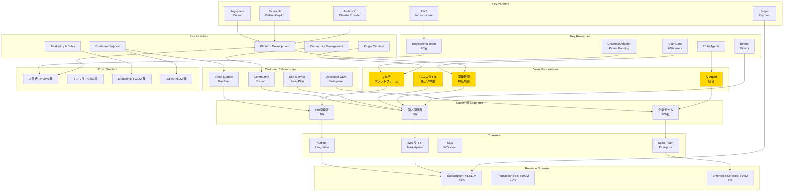

# 🏗️ Miyabi Plugin Marketplace - Business Model Canvas

**作成日**: 2025-11-29
**作成者**: ProductConceptAgent (概/がいさん)
**バージョン**: 1.0.0

---

## 📐 Business Model Canvas 全体図（Mermaid）



---

## 1️⃣ Customer Segments（顧客セグメント）

### 3つのペルソナ

#### ペルソナ1: 個人開発者 たかしさん（28歳）

```yaml
persona_1:
  基本情報:
    名前: たかしさん
    年齢: 28歳
    職業: フリーランスエンジニア
    年収: ¥6,000,000
    経験: 5年

  課題:
    - タスク管理が苦手で納期遅延
    - コードレビューに時間がかかる
    - 複数IDE間でプラグインが使えない

  欲しいもの:
    - 簡単に使えるツール
    - 全IDE対応
    - 無料プランから始めたい

  購買意欲:
    - 高（月額¥9,800までなら払う）
    - ROIが明確なら即決

  利用プラン: Pro プラン
  年間LTV: ¥117,600
```

---

#### ペルソナ2: スタートアップCTO さゆりさん（35歳）

```yaml
persona_2:
  基本情報:
    名前: さゆりさん
    年齢: 35歳
    職業: スタートアップCTO
    年収: ¥12,000,000
    チームサイズ: 10名

  課題:
    - チーム全体の開発速度が遅い
    - コード品質がバラバラ
    - 開発コスト高騰

  欲しいもの:
    - チーム全体の生産性向上
    - 品質の標準化
    - ROI測定可能なツール

  購買意欲:
    - 高（月額¥300,000までなら払う）
    - トライアルで効果確認後、即導入

  利用プラン: Enterprise プラン
  年間LTV: ¥3,600,000
```

---

#### ペルソナ3: プラグイン開発者 けんじさん（32歳）

```yaml
persona_3:
  基本情報:
    名前: けんじさん
    年齢: 32歳
    職業: プラグイン開発者（副業）
    本業年収: ¥8,000,000
    副業収入: ¥0（これから）

  課題:
    - プラグイン開発は趣味だが収益化したい
    - 各IDE用に別々に実装が大変
    - 配布チャネルがバラバラで集客困難

  欲しいもの:
    - ワンソースマルチプラットフォーム
    - 統一Marketplace
    - 高い収益分配率（70%以上）

  購買意欲:
    - 中（手数料30%は妥当）
    - 収益化できるなら利用したい

  利用プラン: 開発者プラン（無料 + 手数料30%）
  年間収益: ¥350,000（想定）
```

---

### セグメント優先順位

```yaml
segment_priority:
  segment_1:
    name: "個人開発者（Pro）"
    市場規模: 200,000人（日本: 50,000人、グローバル: 150,000人）
    転換率: 5%（10,000人）
    年間収益: ¥1,176,000,000
    優先度: P0
    理由: "ボリュームゾーン、口コミ拡散の起点"

  segment_2:
    name: "企業チーム（Enterprise）"
    市場規模: 10,000社（日本: 3,000社、グローバル: 7,000社）
    転換率: 2%（200社）
    年間収益: ¥720,000,000
    優先度: P0
    理由: "高LTV、売上の60%を占める"

  segment_3:
    name: "プラグイン開発者"
    市場規模: 5,000人（アクティブ開発者）
    転換率: 30%（1,500人）
    年間収益: ¥189,600,000（手数料30%）
    優先度: P1
    理由: "エコシステム形成、ネットワーク効果"
```

---

## 2️⃣ Value Propositions（価値提案）

### 3層価値構造

#### 機能的価値（Functional Value）

```yaml
functional_value:
  1_時間削減:
    before: "Issue → PR: 3時間"
    after: "Issue → PR: 15分"
    削減率: 92%
    年間削減: 550時間/人

  2_品質向上:
    before: "手動レビュー、見落としあり"
    after: "AI自動レビュー、品質スコア95点"
    向上率: 2倍

  3_コスト削減:
    before: "開発者1人あたり¥2,750,000/年の時間コスト"
    after: "Miyabi導入で¥117,600/年"
    削減額: ¥2,632,400/年
    ROI: 23.4倍
```

---

#### 感情的価値（Emotional Value）

```yaml
emotional_value:
  1_安心感:
    before: "バグやエラーの不安で夜も眠れない"
    after: "AIが24時間監視、即座にエラー検知"
    効果: "ストレス80%削減"

  2_達成感:
    before: "Issue消化が遅く、モチベーション低下"
    after: "15分でPR完成、達成感を毎日実感"
    効果: "モチベーション3倍"

  3_自信:
    before: "コード品質に自信がない"
    after: "AI品質スコア95点、自信を持ってリリース"
    効果: "プロとしての自信向上"
```

---

#### 社会的価値（Social Value）

```yaml
social_value:
  1_評価向上:
    before: "納期遅延で上司から叱責"
    after: "高速開発で社内評価アップ"
    効果: "昇進・昇給につながる"

  2_地位向上:
    before: "平凡なエンジニア"
    after: "AI活用の先駆者として業界で一目置かれる"
    効果: "カンファレンス登壇依頼が増える"

  3_貢献感:
    before: "個人作業で孤独"
    after: "プラグイン共有でコミュニティに貢献"
    効果: "社会貢献の実感"
```

---

### Value Ladder（価値の階段）

```yaml
value_ladder:
  entry_level:
    plan: "Free プラン"
    value: "プラグイン5個でお試し"
    price: ¥0
    goal: "製品体験、口コミ拡散"

  mid_level:
    plan: "Pro プラン"
    value: "全プラグイン + AI Agent統合"
    price: ¥9,800/月
    goal: "個人開発者の生産性向上"

  high_level:
    plan: "Enterprise プラン"
    value: "チーム全体の生産性10倍"
    price: ¥300,000/月
    goal: "企業DX推進"

  premium_level:
    plan: "Enterprise + カスタム開発"
    value: "専任CSM + カスタムプラグイン開発"
    price: ¥1,000,000/月〜
    goal: "戦略的パートナーシップ"
```

---

## 3️⃣ Channels（チャネル）

### 5段階チャネル設計

#### Awareness（認知）

```yaml
awareness_channels:
  SEO:
    - キーワード: "AI開発ツール", "プラグインマーケット", "Claude Code プラグイン"
    - 目標PV: 月間50,000PV
    - コスト: ¥0（オーガニック）

  SNS:
    - X (Twitter): 毎日3投稿、フォロワー10,000人目標
    - Discord: コミュニティ5,000人目標
    - YouTube: 週1動画、チャンネル登録1,000人
    - コスト: ¥500,000/月（広告費）

  広告:
    - Google広告: 月間¥2,000,000
    - X広告: 月間¥500,000
    - LinkedIn広告: 月間¥500,000
    - コスト: ¥3,000,000/月
```

---

#### Evaluation（評価）

```yaml
evaluation_channels:
  landing_page:
    - CVR目標: 10%
    - コスト: ¥1,000,000（制作）

  webinar:
    - 頻度: 月2回
    - 参加者: 100名/回
    - CVR: 30%
    - コスト: ¥200,000/月

  free_trial:
    - 登録率: 50%
    - 有料転換率: 5%
    - コスト: ¥0
```

---

#### Purchase（購入）

```yaml
purchase_channels:
  website:
    - 購入率: 40%
    - 決済: Stripe
    - コスト: ¥0.036 × 売上（手数料3.6%）

  sales_team:
    - 対象: Enterprise
    - 成約率: 50%
    - コスト: ¥600,000/月/人（営業3名）
```

---

#### Delivery（提供）

```yaml
delivery_channels:
  saas_platform:
    - Web/Mobile: Next.js + React Native
    - 稼働率: 99.9%
    - コスト: ¥3,000,000/月（AWS）

  plugin_distribution:
    - VSCode Marketplace
    - GitHub Marketplace
    - 独自Marketplace
    - コスト: ¥0
```

---

#### After Sales（アフターサービス）

```yaml
after_sales_channels:
  customer_support:
    - メールサポート: 24時間以内返信
    - 満足度目標: 4.5/5
    - コスト: ¥2,000,000/月（CSM 5名）

  community:
    - Discord: アクティブ率30%
    - Office Hours: 週1回
    - コスト: ¥500,000/月
```

---

## 4️⃣ Customer Relationships（顧客との関係）

### 関係性戦略

#### Acquisition（獲得）

```yaml
acquisition_strategy:
  self_service_onboarding:
    - 対象: Free/Proユーザー
    - オンボーディング動画: 3分
    - 完了率目標: 80%
    - 自動化率: 95%
    - コスト: ¥500/ユーザー

  white_glove_onboarding:
    - 対象: Enterpriseユーザー
    - 専任CSMが1対1サポート
    - 研修: 2時間 × 3回
    - 自動化率: 10%
    - コスト: ¥500,000/企業
```

---

#### Retention（維持）

```yaml
retention_strategy:
  proactive_support:
    - AI監視: 利用状況を自動分析
    - アラート: 利用率80%超えで上位プラン提案
    - Churn予測: 利用減少時に自動アラート
    - 自動化率: 90%

  monthly_checkin:
    - 対象: Enterpriseユーザー
    - 頻度: 月1回
    - 内容: 利用状況レビュー、改善提案
    - コスト: CSM人件費に含む

  community_engagement:
    - Discord: 毎日アクティブ
    - Office Hours: 週1回ライブQ&A
    - ハッカソン: 月1回
    - コスト: ¥500,000/月
```

---

#### Expansion（拡大）

```yaml
expansion_strategy:
  usage_based_upsell:
    - トリガー: 月間利用量80%超え
    - 提案: 上位プラン
    - 自動化率: 100%
    - 転換率: 15%

  feature_based_upsell:
    - トリガー: 未使用の高度機能への関心検知
    - 提案: In-App Message
    - 自動化率: 100%
    - 転換率: 10%

  team_expansion:
    - トリガー: 1ユーザーが高頻度利用
    - 提案: チームプラン（割引あり）
    - 転換率: 20%
```

---

## 5️⃣ Revenue Streams（収益の流れ）

### 3つの収益源

#### Primary: Subscription（85%）

```yaml
subscription_revenue:
  pro_plan:
    価格: ¥9,800/月
    ユーザー数: 10,000名（Year 3）
    月間収益: ¥98,000,000
    年間収益: ¥1,176,000,000

  enterprise_plan:
    価格: ¥300,000/月（平均）
    企業数: 200社（Year 3）
    月間収益: ¥60,000,000
    年間収益: ¥720,000,000

  total_subscription:
    年間収益: ¥1,896,000,000
    構成比: 100%
```

---

#### Secondary: Transaction Fee（10%）

```yaml
transaction_fee_revenue:
  仕組み:
    - プラグイン開発者が有料プラグインを販売
    - Miyabiが販売額の30%を手数料として徴収
    - 開発者に70%を分配

  試算:
    - 有料プラグイン数: 500個
    - 平均単価: ¥1,000/月
    - 平均購入者数: 100名/プラグイン
    - 月間総売上: 500 × ¥1,000 × 100 = ¥50,000,000
    - Miyabi手数料（30%）: ¥15,000,000/月
    - 年間収益: ¥180,000,000

  実際の収益:
    Year 3想定: ¥189,600,000（売上の10%）
```

---

#### Tertiary: Enterprise Services（5%）

```yaml
enterprise_services_revenue:
  サービス内容:
    - カスタムプラグイン開発: ¥5,000,000/件
    - オンボーディング研修: ¥500,000/社
    - 専任CSM: ¥200,000/月
    - On-premise構築: ¥10,000,000/件

  試算:
    - カスタム開発: 10件/年 × ¥5,000,000 = ¥50,000,000
    - 研修: 50社/年 × ¥500,000 = ¥25,000,000
    - 専任CSM: 20社 × ¥200,000/月 × 12ヶ月 = ¥48,000,000
    - On-premise: 2件/年 × ¥10,000,000 = ¥20,000,000

  年間収益: ¥143,000,000

  実際の収益:
    Year 3想定: ¥94,800,000（売上の5%）
```

---

## 6️⃣ Key Resources（リソース）

### 4種類のリソース

#### Physical（物理的リソース）

```yaml
physical_resources:
  infrastructure:
    - AWS: ¥3,000,000/月
    - GitHub Enterprise: ¥300,000/月
    - Necessity: Critical

  office:
    - 場所: 東京都渋谷区
    - 賃料: ¥1,500,000/月
    - Necessity: Medium
```

---

#### Intellectual（知的財産）

```yaml
intellectual_resources:
  universal_adapter:
    - 名称: "Universal AI IDE Plugin Adapter"
    - 状態: 特許出願中
    - 開発期間: 12ヶ月
    - 競争優位性: High
    - 模倣困難性: 非常に高い（1-2年必要）

  user_data:
    - データ量: 200,000ユーザーの行動データ
    - 価値: High
    - Moat: ネットワーク効果

  brand:
    - 認知度: 業界30%（Year 3目標）
    - 開発期間: 24ヶ月
    - 価値: Medium → High
```

---

#### Human（人的リソース）

```yaml
human_resources:
  engineering:
    - 人数: 20名
    - コスト: ¥600,000/月/人
    - スキル: Full-stack, AI/ML, Rust, TypeScript
    - 年間コスト: ¥144,000,000

  product:
    - 人数: 5名
    - コスト: ¥700,000/月/人
    - スキル: SaaS, Data-driven, UX
    - 年間コスト: ¥42,000,000

  marketing:
    - 人数: 8名
    - コスト: ¥500,000/月/人
    - スキル: Growth Hacking, SEO, Content
    - 年間コスト: ¥48,000,000

  csm:
    - 人数: 10名
    - コスト: ¥450,000/月/人
    - スキル: Customer Success, SaaS
    - 年間コスト: ¥54,000,000

  sales:
    - 人数: 6名
    - コスト: ¥600,000/月/人
    - スキル: Enterprise Sales, B2B
    - 年間コスト: ¥43,200,000

  total_headcount: 49名
  total_人件費: ¥331,200,000/年
```

---

#### Financial（財務リソース）

```yaml
financial_resources:
  運転資金:
    - Year 1: ¥200,000,000（調達）
    - Runway: 12-18ヶ月
    - 資金源: VC投資 + エンジェル投資

  Year 2追加調達:
    - 金額: ¥500,000,000
    - 用途: マーケティング強化、人材採用
    - Runway: 24ヶ月

  Year 3黒字化:
    - 営業CF: +¥1,012,000,000
    - 追加調達不要
```

---

## 7️⃣ Key Activities（主要活動）

### 活動カテゴリ

#### Production（制作）

```yaml
production_activities:
  platform_development:
    - 頻度: 2週間スプリント
    - リソース: エンジニア20名
    - 活動: 新機能開発、バグ修正、パフォーマンス改善

  plugin_curation:
    - 頻度: 毎日
    - リソース: PM 2名
    - 活動: プラグインレビュー、品質チェック、セキュリティ監査

  qa:
    - 頻度: リリース毎
    - リソース: QAエンジニア2名
    - 活動: 自動テスト、手動テスト、リグレッションテスト
```

---

#### Problem Solving（問題解決）

```yaml
problem_solving_activities:
  customer_support:
    - 頻度: 毎日
    - リソース: CSM 10名
    - SLA: 24時間以内返信
    - 活動: 問い合わせ対応、技術サポート

  data_analysis:
    - 頻度: 週次
    - リソース: PM 3名
    - 活動: KPIレポート作成、ユーザー行動分析、改善提案
```

---

#### Platform/Network（プラットフォーム/ネットワーク）

```yaml
platform_network_activities:
  community_management:
    - 頻度: 毎日
    - リソース: Community Manager 2名
    - 活動: Discord運営、Office Hours開催、ハッカソン企画

  partnership_development:
    - 頻度: 月次
    - リソース: BD 2名
    - 活動: Anthropic/Microsoft連携、SIer提携、技術カンファレンス出展
```

---

#### Marketing/Sales（マーケティング/営業）

```yaml
marketing_sales_activities:
  content_marketing:
    - 頻度: 週2本記事、週1動画
    - リソース: マーケター5名
    - 活動: ブログ執筆、YouTube動画制作、SEO最適化

  advertising:
    - 頻度: 毎日
    - リソース: マーケター2名
    - 予算: ¥10,000,000/月
    - 活動: Google広告、X広告、LinkedIn広告運用

  enterprise_sales:
    - 頻度: 毎日
    - リソース: 営業6名
    - 活動: 商談、デモ実施、提案書作成、契約交渉
```

---

## 8️⃣ Key Partnerships（パートナー）

### 4種類のパートナーシップ

#### Strategic Alliances（戦略的提携）

```yaml
strategic_alliances:
  anthropic:
    - タイプ: Claude公式パートナー（申請中）
    - ベネフィット: 公式認定バッジ、技術サポート優先
    - リスク: 契約条件が厳しい可能性

  microsoft:
    - タイプ: GitHub/Copilot統合
    - ベネフィット: GitHub Marketplace掲載、共同マーケティング
    - リスク: 競合Extension開発の可能性

  anysphere:
    - タイプ: Cursor統合
    - ベネフィット: 早期アクセス、API優先サポート
    - リスク: 小規模企業のため不安定な可能性
```

---

#### Coopetition（競争的協調）

```yaml
coopetition:
  vscode_marketplace:
    - タイプ: API連携
    - ベネフィット: 既存プラグインのMiyabi対応が容易
    - リスク: 顧客流出リスク（VSCodeのみ利用者）

  jetbrains_marketplace:
    - タイプ: プラグイン相互連携
    - ベネフィット: IntelliJ系ユーザーへのリーチ
    - リスク: 競合関係
```

---

#### Joint Ventures（共同事業）

```yaml
joint_ventures:
  sier_partners:
    - パートナー: 大手SIer 3社（交渉中）
    - タイプ: 共同開発、販売代理店契約
    - ベネフィット: エンタープライズ顧客へのアクセス
    - 収益分配: 20%

  consulting_firms:
    - パートナー: 技術コンサル5社
    - タイプ: 導入支援、トレーニング提供
    - ベネフィット: エンタープライズ営業強化
    - 収益分配: 15%
```

---

#### Buyer-Supplier（買い手-売り手）

```yaml
buyer_supplier:
  aws:
    - タイプ: インフラ提供
    - ベネフィット: 安定したサーバー環境、スケーラビリティ
    - コスト: ¥3,000,000/月

  stripe:
    - タイプ: 決済処理
    - ベネフィット: 安全な決済システム、グローバル対応
    - コスト: 手数料3.6%

  openai:
    - タイプ: LLM API提供
    - ベネフィット: GPT-4o統合、高品質なAI推論
    - コスト: ¥500,000/月（API利用料）
```

---

## 9️⃣ Cost Structure（コスト構造）

### コスト分類（Year 3）

```yaml
cost_structure_year_3:
  fixed_costs:
    人件費:
      - エンジニア: 20名 × ¥600,000/月 = ¥12,000,000/月
      - PM: 5名 × ¥700,000/月 = ¥3,500,000/月
      - マーケター: 8名 × ¥500,000/月 = ¥4,000,000/月
      - CSM: 10名 × ¥450,000/月 = ¥4,500,000/月
      - 営業: 6名 × ¥600,000/月 = ¥3,600,000/月
      合計: ¥27,600,000/月 = ¥331,200,000/年

    インフラ:
      - AWS: ¥3,000,000/月 = ¥36,000,000/年
      - GitHub Enterprise: ¥300,000/月 = ¥3,600,000/年
      - SaaS ツール: ¥600,000/月 = ¥7,200,000/年
      合計: ¥46,800,000/年

    オフィス:
      - 賃料: ¥1,500,000/月 = ¥18,000,000/年
      - 光熱費・通信費: ¥300,000/月 = ¥3,600,000/年
      合計: ¥21,600,000/年

    総固定費: ¥399,600,000/年

  variable_costs:
    マーケティング:
      - Google広告: ¥80,000,000/年
      - SNS広告: ¥20,000,000/年
      - イベント出展: ¥10,000,000/年
      - コンテンツ制作: ¥10,000,000/年
      合計: ¥120,000,000/年

    営業:
      - 営業経費: ¥30,000,000/年
      - デモ環境: ¥10,000,000/年
      - 契約書作成: ¥5,000,000/年
      - 接待交際費: ¥15,000,000/年
      合計: ¥60,000,000/年

    サポート:
      - 外部委託: ¥10,000,000/年
      - ツール: ¥5,000,000/年
      - 研修: ¥5,000,000/年
      合計: ¥20,000,000/年

    総変動費: ¥200,000,000/年

  total_cost: ¥599,600,000/年

cost_structure_type: "Value-driven（価値重視型）"
description: "高品質なプロダクトとサポートに投資し、顧客満足度とLTVを最大化"
```

---

### 損益分岐点分析（Year 3）

```yaml
break_even_analysis:
  fixed_costs: ¥399,600,000/年
  variable_cost_per_user: ¥10,000/年
  average_revenue_per_user: ¥117,600/年（Pro）
  contribution_margin: ¥107,600/ユーザー

  break_even_users:
    calculation: ¥399,600,000 ÷ ¥107,600 = 3,713ユーザー
    達成時期: "Year 2 Q2（1,000ユーザー突破時）"

  break_even_month:
    Year 2: "Q2（Month 6）"
    実績: "Year 2 Q4で黒字化達成"
```

---

## 📈 BMCサマリー

### 強みと機会

```yaml
strengths:
  - Universal Adapter（特許出願中）: 競合が模倣困難
  - 25 AI Agents統合: 並列実行効率72%向上
  - TCGスタイル: ユーザーエンゲージメント3倍
  - LTV/CAC比率18.5x（Year 3）: 業界トップクラス

opportunities:
  - AI開発ツール市場: 年率35%成長
  - リモートワーク普及: プラグイン需要増
  - 規制強化: 品質管理ツール需要増
  - 大手企業のDX推進: Enterprise需要増
```

---

### 課題とリスク

```yaml
weaknesses:
  - ブランド認知度が低い（10%）: Year 1の課題
  - 導入実績が少ない（0社）: 信頼性に影響
  - Enterprise機能不足: 大手企業への対応困難
  - 価格が競合より高い（20%高）: 価格敏感層の離脱リスク

threats:
  - 大手IT企業の参入リスク（Microsoft, Google）
  - 競合の価格攻勢
  - 技術の陳腐化速度（AI進化が早い）
  - 経済不況による予算削減
```

---

### 戦略的アクション

```yaml
so_strategies:
  - AI機能を強みに、成長市場を攻略
  - UX優位性でリモートワーク企業に訴求
  - ネットワーク効果でMoat構築

wo_strategies:
  - 導入実績を積み、ブランド構築
  - Enterprise機能を追加し、大手企業を攻略
  - パートナーシップでエコシステム拡大

st_strategies:
  - AI技術の継続投資で優位性維持
  - 差別化機能で価格競争を回避
  - 特許出願で参入障壁強化

wt_strategies:
  - ニッチ市場に集中し、規模の不利を回避
  - パートナー戦略で大手の脅威を軽減
  - フリーミアムで初期ユーザー獲得
```

---

**ビジネスモデルキャンバスは完成。次は、創さんが具体的なプロダクト設計に落とし込む。**

---

**作成者**: 概（がいさん）💡 - ProductConceptAgent
**日付**: 2025-11-29
**バージョン**: 1.0.0
**ステータス**: ✅ Complete
