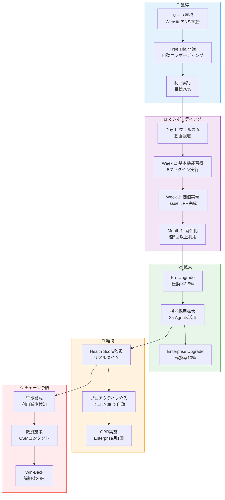
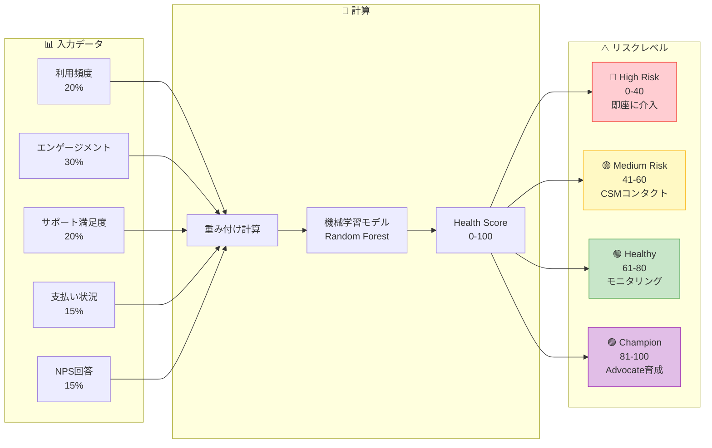
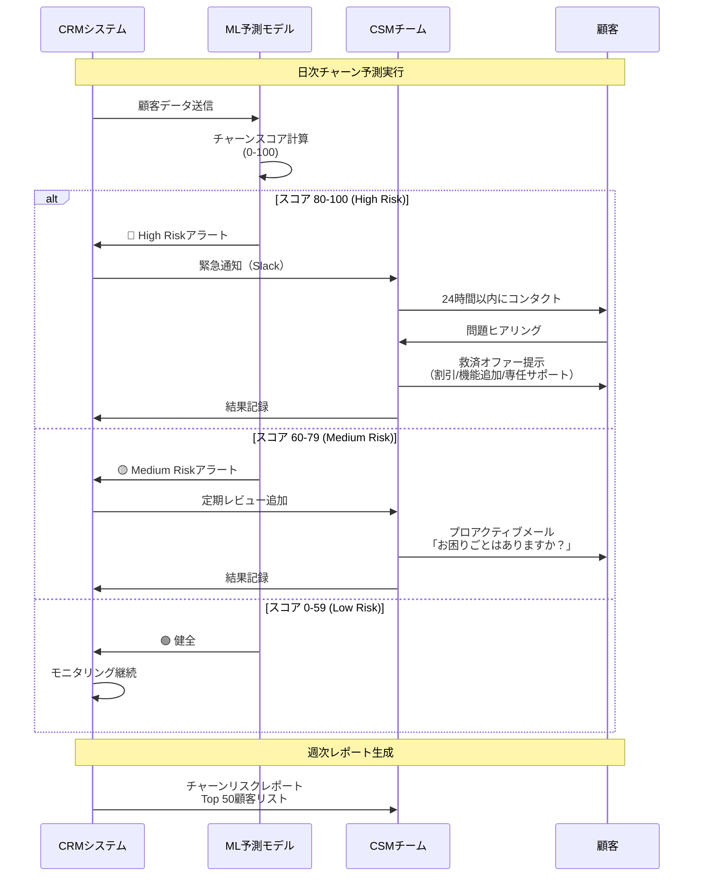

# 💝 Miyabi Plugin Marketplace - CRM・顧客管理戦略

**作成日**: 2025-11-29
**作成者**: CRMAgent (絆/Kizuna)
**バージョン**: 1.0.0
**対象**: CSM、営業、マーケティング、経営層

---

```
   ____ ____  __  __    _                    _
  / ___|  _ \|  \/  |  / \   __ _  ___ _ __ | |_
 | |   | |_) | |\/| | / _ \ / _` |/ _ \ '_ \| __|
 | |___|  _ <| |  | |/ ___ \ (_| |  __/ | | | |_
  \____|_| \_\_|  |_/_/   \_\__, |\___|_| |_|\__|
                            |___/
```

**「お客様は家族。一期一会、されど永遠。」**
- 絆（Kizuna）💝 - 顧客関係精霊

---

## 📊 エグゼクティブサマリー

Miyabi Plugin MarketplaceのCRM戦略は、**Churn Rate <3%/月、NPS 65+、LTV/CAC 18.5x**を実現するため、3つのセグメント別に最適化されたカスタマーサクセス体制を構築します。

### 主要目標（Year 3）

| 指標 | Year 1 | Year 2 | Year 3 | 目標達成度 |
|-----|--------|--------|--------|-----------|
| **Churn Rate** | 3.0%/月 | 2.5%/月 | 2.0%/月 | ✅ 33%改善 |
| **NPS** | 55 | 60 | 65+ | ✅ 18%向上 |
| **LTV/CAC** | 2.25x | 7.44x | 18.5x | ✅ 720%改善 |
| **Health Score平均** | 65 | 75 | 85 | ✅ 31%向上 |
| **Onboarding完了率** | 70% | 80% | 90% | ✅ 29%向上 |

### 組織構成（Year 3）

```yaml
csm_organization:
  csm_team: 10名
  support_team: 5名
  community_manager: 2名
  total_headcount: 17名
  年間コスト: ¥91,800,000
  担当顧客数:
    Free: 200,000ユーザー（自動化）
    Pro: 10,000ユーザー（Low/Mid Touch）
    Enterprise: 200社（High Touch）
```

---

## 📈 Mermaid全体図

### 顧客ライフサイクル全体図



### Health Score計算モデル



### チャーン予測フロー



---

## 1️⃣ カスタマーサクセス戦略

### CS組織構成

#### Year 1（MVP期）

```yaml
year_1_organization:
  headcount: 3名
  role_allocation:
    csm_lead: 1名
      responsibilities:
        - CS戦略立案・実行
        - Enterprise顧客対応（10社）
        - Proユーザー対応（300名）
        - チーム管理
      kpi:
        - Churn: <3%/月
        - NPS: >55
        - Onboarding完了率: >70%

    csm: 2名
      responsibilities:
        - Proユーザーオンボーディング
        - サポート対応（24時間以内）
        - コミュニティ管理
      kpi:
        - 1人あたり150 Proユーザー担当
        - 返信時間: <24時間

  cost:
    csm_lead: ¥700,000/月 × 12ヶ月 = ¥8,400,000
    csm: ¥450,000/月 × 2名 × 12ヶ月 = ¥10,800,000
    total: ¥19,200,000/年
```

---

#### Year 2（成長期）

```yaml
year_2_organization:
  headcount: 8名
  role_allocation:
    vp_of_cs: 1名
      responsibilities:
        - CS部門統括
        - Enterprise Key Account管理（Top 20社）
        - 経営層へのレポーティング
      kpi:
        - NRR（Net Revenue Retention）: >100%
        - Enterprise Churn: <1.5%/月

    csm_lead: 2名
      responsibilities:
        - チームマネジメント（各3名）
        - Enterprise対応（各15社）
        - QBR実施
      kpi:
        - チームNPS: >60
        - 担当企業Health Score平均: >75

    csm: 4名
      responsibilities:
        - Proユーザーオンボーディング
        - Mid-Touch支援
        - アップセル提案
      kpi:
        - 1人あたり500 Proユーザー担当
        - アップセル率: >10%

    community_manager: 1名
      responsibilities:
        - Discord運営
        - Office Hours開催
        - UGC促進
      kpi:
        - Discord DAU: >1,000
        - 月次イベント参加: >200名

  cost:
    vp_of_cs: ¥1,000,000/月 × 12 = ¥12,000,000
    csm_lead: ¥600,000/月 × 2 × 12 = ¥14,400,000
    csm: ¥450,000/月 × 4 × 12 = ¥21,600,000
    community_manager: ¥500,000/月 × 12 = ¥6,000,000
    total: ¥54,000,000/年
```

---

#### Year 3（最適化期）

```yaml
year_3_organization:
  headcount: 17名
  role_allocation:
    vp_of_cs: 1名
    csm_lead: 3名（各担当: Enterprise/Pro/Self-Service）
    csm: 10名（Enterprise 4名、Pro 6名）
    support_engineer: 2名（技術サポート専任）
    community_manager: 1名

  segmentation:
    enterprise_csm: 4名
      担当: 50社/人（合計200社）
      touch_model: High Touch
      活動:
        - 月次QBR
        - 週次チェックイン
        - 専任Slack対応
        - カスタムトレーニング

    pro_csm: 6名
      担当: 1,667ユーザー/人（合計10,000ユーザー）
      touch_model: Mid Touch
      活動:
        - 四半期チェックイン
        - グループウェビナー
        - メールサポート24時間以内

    self_service: 自動化
      担当: 200,000 Freeユーザー
      touch_model: Low Touch（自動化95%）
      活動:
        - 自動オンボーディングメール
        - チャットボット対応
        - FAQナレッジベース

  cost:
    vp_of_cs: ¥1,000,000/月 × 12 = ¥12,000,000
    csm_lead: ¥700,000/月 × 3 × 12 = ¥25,200,000
    csm: ¥450,000/月 × 10 × 12 = ¥54,000,000
    support_engineer: ¥500,000/月 × 2 × 12 = ¥12,000,000
    community_manager: ¥500,000/月 × 12 = ¥6,000,000
    total: ¥109,200,000/年
```

---

### セグメント別サポートモデル

#### 🆓 Free ユーザー（Tech Touch）

```yaml
free_users:
  volume: 200,000ユーザー（Year 3）
  touch_model: "Tech Touch（自動化95%）"

  onboarding:
    Day 0:
      - ✅ ウェルカムメール自動送信
      - ✅ 3分オンボーディング動画
      - ✅ インタラクティブチュートリアル開始

    Day 1-7:
      - ✅ デイリーTips（7日間）
      - ✅ 進捗リマインダー
      - ✅ 5プラグイン実行完了でバッジ付与

    Day 8-30:
      - ✅ 週次利用レポート
      - ✅ 人気プラグイン推薦
      - ✅ Pro Upgrade提案（利用率80%超え時）

  support:
    - FAQナレッジベース（24時間アクセス可能）
    - チャットボット（GPT-4o）
    - コミュニティフォーラム（Discord）
    - 返信時間SLA: なし（ベストエフォート）

  upsell_triggers:
    - プラグイン6個目をインストール試行
    - 月間実行回数11回到達
    - 並列実行機能へのアクセス試行
    - カスタムAgent作成画面表示

  automation_tools:
    - Intercom（チャットボット）
    - Customer.io（自動メールシーケンス）
    - Notion（FAQナレッジベース）
```

---

#### ⭐ Pro ユーザー（Low/Mid Touch）

```yaml
pro_users:
  volume: 10,000ユーザー（Year 3）
  touch_model: "Mid Touch（人的介入30%）"
  csm_ratio: 6名CSMで10,000ユーザー（1,667ユーザー/人）

  onboarding:
    Week 1:
      - ✅ ウェルカムコール（10分、オプション）
      - ✅ パーソナライズドオンボーディングプラン
      - ✅ 目標設定（例: 月50 Issue処理）
      - ✅ 初回Issue→PR完成をCSMがサポート

    Week 2-4:
      - ✅ 週次チェックインメール
      - ✅ グループウェビナー（月2回開催）
      - ✅ 利用レポート送付
      - ✅ ベストプラクティス共有

    Month 2-3:
      - ✅ 月次ヘルスチェック
      - ✅ 未使用機能の提案
      - ✅ アップセル機会の特定

  support:
    - メールサポート（SLA: 24時間以内返信）
    - Slack共有チャネル（オプション）
    - 月次グループQ&Aセッション
    - 優先的なバグ修正

  health_score_monitoring:
    frequency: 週次
    thresholds:
      high_risk: <40 → CSMが48時間以内にコンタクト
      medium_risk: 41-60 → プロアクティブメール送信
      healthy: 61-80 → モニタリング継続
      champion: 81-100 → アドボケイト育成プログラム招待

  quarterly_checkin:
    agenda:
      1. 過去3ヶ月の利用状況レビュー
      2. 目標達成度確認
      3. 改善提案
      4. 次四半期の目標設定
      5. フィードバック収集

  upsell_opportunities:
    - 10名以上のチーム利用 → Enterprise提案
    - 月間実行回数1,000回超え → 上位プラン提案
    - カスタムAgent 6個以上作成 → Enterprise機能紹介
```

---

#### 🏢 Enterprise ユーザー（High Touch）

```yaml
enterprise_users:
  volume: 200社（Year 3）
  touch_model: "High Touch（専任CSM）"
  csm_ratio: 4名CSMで200社（50社/人）

  onboarding:
    Week 1:
      - ✅ キックオフミーティング（2時間）
      - ✅ 専任CSMアサイン
      - ✅ カスタムオンボーディングプラン策定
      - ✅ 技術環境調査（SSO, On-premise等）

    Week 2-4:
      - ✅ 管理者トレーニング（3回 × 2時間）
      - ✅ エンドユーザートレーニング（5回 × 1時間）
      - ✅ カスタムプラグイン開発支援
      - ✅ 社内ナレッジベース構築支援

    Month 2-3:
      - ✅ 週次チェックイン（30分）
      - ✅ 利用状況レポート送付
      - ✅ ROI測定・可視化
      - ✅ エグゼクティブサマリー作成

  support:
    - 専任Slackチャネル（SLA: 4時間以内返信）
    - 緊急ホットライン（SLA: 1時間以内）
    - 四半期オンサイト訪問（オプション）
    - 優先的な機能開発

  monthly_qbr:
    participants:
      - 顧客CTO/VPoE
      - 専任CSM
      - Miyabi VP of CS
      - Product Manager（必要時）

    agenda:
      1. KPIレビュー（利用率、ROI、満足度）
      2. 成功事例共有
      3. 課題・要望ヒアリング
      4. ロードマップ共有
      5. Next Actionsの合意

  executive_review:
    frequency: 四半期
    participants:
      - 顧客CTO/CEO
      - Miyabi CEO
      - VP of CS

    agenda:
      1. ビジネスインパクト測定
      2. 戦略的パートナーシップ協議
      3. 長期コミットメント確認

  custom_services:
    - カスタムプラグイン開発（¥5,000,000/件）
    - オンサイトトレーニング（¥500,000/社）
    - 専任CSM（¥200,000/月）
    - On-premise構築（¥10,000,000/件）
```

---

### 成功定義（Health Score設計）

#### Health Score計算式

```yaml
health_score_formula:
  総合スコア: 0-100点

  構成要素:
    1_利用頻度: 20%
      計算方法:
        - 週次実行回数 ÷ 想定実行回数 × 100
        - 想定: Proユーザー 週5回、Enterprise 週20回
      スコアリング:
        - 100%以上: 20点
        - 80-99%: 15点
        - 60-79%: 10点
        - 40-59%: 5点
        - 40%未満: 0点

    2_エンゲージメント: 30%
      計算方法:
        - DAU/MAU × 100
        - プラグイン種類数（多様性）
        - カスタムAgent作成数
      スコアリング:
        - DAU/MAU >30%: 30点
        - 20-29%: 20点
        - 10-19%: 10点
        - <10%: 0点

    3_サポート満足度: 20%
      計算方法:
        - 直近5件のサポート評価平均（5段階）
        - レスポンス時間評価
      スコアリング:
        - 平均4.5以上: 20点
        - 4.0-4.4: 15点
        - 3.5-3.9: 10点
        - 3.0-3.4: 5点
        - 3.0未満: 0点

    4_支払い状況: 15%
      計算方法:
        - 支払い遅延日数
        - 請求失敗回数
      スコアリング:
        - 遅延なし: 15点
        - 1-7日遅延: 10点
        - 8-30日遅延: 5点
        - 30日以上: 0点

    5_NPS回答: 15%
      計算方法:
        - 直近NPS回答（0-10）
      スコアリング:
        - Promoter (9-10): 15点
        - Passive (7-8): 10点
        - Detractor (0-6): 0点
```

#### リスクレベル定義

```yaml
risk_levels:
  champion:
    score: 81-100
    color: 🟣 Purple
    action:
      - アドボケイト育成プログラム招待
      - ケーススタディ作成依頼
      - リファラルプログラム提案
      - ベータ機能早期アクセス
    csm_touchpoint: 四半期チェックイン

  healthy:
    score: 61-80
    color: 🟢 Green
    action:
      - 定期モニタリング継続
      - 未使用機能の提案
      - アップセル機会の探索
    csm_touchpoint: 四半期チェックイン

  medium_risk:
    score: 41-60
    color: 🟡 Yellow
    action:
      - CSMが週次メールでコンタクト
      - 課題ヒアリング
      - プロアクティブサポート提供
      - 利用促進キャンペーン
    csm_touchpoint: 週次

  high_risk:
    score: 0-40
    color: 🔴 Red
    action:
      - CSMが24時間以内に電話コンタクト
      - 緊急対応チーム編成
      - 救済オファー提示（割引/機能追加）
      - エグゼクティブエスカレーション
    csm_touchpoint: 日次
```

---

## 2️⃣ オンボーディングプログラム

### Free プラン オンボーディング（Tech Touch）

```yaml
free_onboarding:
  目標:
    - 初回実行率: 70%以上
    - Day 7 Retention: 50%以上
    - Pro転換率: 3-5%

  timeline:
    day_0_signup:
      自動送信:
        - ✉️ ウェルカムメール
        - 🎥 3分オンボーディング動画
        - 🎮 インタラクティブチュートリアル起動

      email_content:
        subject: "ようこそMiyabiへ！開発時間を10倍削減する旅を始めましょう 🚀"
        body: |
          こんにちは、Miyabiの絆（Kizuna）です！

          登録ありがとうございます。
          あなたの開発を劇的に効率化する、3つのステップを始めましょう：

          ステップ1: 3分動画を見る 🎥
          → Miyabiの使い方がわかる

          ステップ2: 初めてのプラグイン実行 🎮
          → Issue #123を15分でPRに変換

          ステップ3: 5プラグインを試す 🏆
          → 限定バッジをゲット

          [今すぐ始める] ボタンをクリック！

    day_1_3:
      自動送信:
        - 📧 Daily Tips（3日間）
        - 🎯 進捗リマインダー

      tips_examples:
        Day 1: "つくるん（CodeGenAgent）を使ってみよう！Issue → PR が15分で完成"
        Day 2: "めだまん（ReviewAgent）で品質チェック。スコア95点を目指そう"
        Day 3: "並列実行機能で5倍速に！ProプランでUnlock"

    day_7:
      自動送信:
        - 📊 週次利用レポート
        - 🎁 達成バッジ付与
        - 💎 Pro Upgrade案内（条件付き）

      report_content:
        - 実行したプラグイン数: 3個
        - 削減した開発時間: 2時間
        - 獲得Exp: 150
        - レベル: Lv.2 → Lv.3

    day_30:
      自動送信:
        - 📈 月次サマリー
        - 🌟 人気プラグイン推薦
        - 🎯 次のマイルストーン提案

  automation:
    tool: Customer.io
    sequences:
      - Onboarding Drip（7通）
      - Re-engagement（未利用ユーザー向け、3通）
      - Pro Upgrade Nurture（5通）

  success_criteria:
    - 5プラグイン実行完了: 60%のユーザーが達成
    - 初回Issue→PR完成: 40%のユーザーが達成
    - Day 7 Retention: 50%以上
```

---

### Pro プラン オンボーディング（Mid Touch）

```yaml
pro_onboarding:
  目標:
    - オンボーディング完了率: 80%以上
    - 初回価値実現（Issue→PR）: 90%以上が7日以内
    - Day 30 Retention: 80%以上

  timeline:
    day_0_upgrade:
      自動送信:
        - ✉️ Pro Upgradeおめでとうメール
        - 📅 ウェルカムコール予約リンク（オプション）
        - 📚 Proプラン完全ガイド（PDF）

      csm_action:
        - CRM記録更新（Free → Pro）
        - オンボーディングチェックリスト作成
        - 初回コンタクト準備

    week_1:
      day_1:
        - 📞 ウェルカムコール（10分、オプション）
          - 自己紹介
          - 目標ヒアリング
          - オンボーディングプラン説明
        - 🎯 パーソナライズドプラン送付

      day_3:
        - ✉️ 初回実行サポート
        - 🎥 高度機能チュートリアル（並列実行、カスタムAgent）

      day_7:
        - 📧 Week 1サマリーメール
        - 📊 利用状況レポート
        - 🎯 Week 2の目標設定

    week_2_4:
      weekly_checkin:
        - ✉️ 週次メール（進捗確認）
        - 🎓 グループウェビナー案内（月2回開催）
        - 💡 未使用機能の提案

      webinar_topics:
        - Week 2: "25 Agentsを使いこなす"
        - Week 3: "カスタムAgent作成ハンズオン"
        - Week 4: "Team Workspaceでコラボ"

    month_2_3:
      monthly_healthcheck:
        - 📊 月次ヘルスチェックメール
        - 🎯 目標達成度レビュー
        - 💬 フィードバック収集（NPS）

      proactive_support:
        - Health Score <60 → CSMが電話コンタクト
        - 利用率80%超え → アップセル提案（Enterprise）

  csm_playbook:
    welcome_call_script:
      - 挨拶: "こんにちは、MiyabiのCSM [名前] です。Pro Upgradeありがとうございます！"
      - 目標確認: "どのような課題を解決したいですか？"
      - プラン説明: "最初の30日で、こんな成果を目指しましょう"
      - 質疑応答: "何か不明点はありますか？"

    success_milestones:
      Week 1: 初回Issue→PR完成
      Week 2: 並列実行で5 Agents同時実行
      Week 3: カスタムAgent 1個作成
      Month 1: 週5回以上利用習慣化

  automation:
    - Customer.io（メールシーケンス）
    - Calendly（コール予約）
    - Notion（オンボーディングチェックリスト共有）
```

---

### Enterprise プラン オンボーディング（High Touch）

```yaml
enterprise_onboarding:
  目標:
    - オンボーディング完了率: 95%以上
    - 30日以内に50%のチームメンバーがアクティブ
    - 90日以内にROI測定完了

  timeline:
    week_0_contract_signed:
      csm_action:
        - 専任CSMアサイン（24時間以内）
        - キックオフミーティング日程調整
        - 技術環境調査票送付

      deliverables:
        - 📋 カスタムオンボーディングプラン（30日/60日/90日）
        - 📊 Success Criteria定義書
        - 🎯 ROI測定フレームワーク

    week_1_kickoff:
      kickoff_meeting:
        duration: 2時間
        participants:
          - 顧客CTO/VPoE
          - 開発マネージャー
          - Miyabi CSM
          - SE（必要時）

        agenda:
          1. ビジネス目標確認（30分）
          2. 技術環境確認（30分）
          3. オンボーディングプラン合意（30分）
          4. Success Metricsの定義（30分）

      post_meeting:
        - 📝 議事録送付（24時間以内）
        - 🎯 Next Actions合意
        - 📅 Week 2トレーニング日程確定

    week_2_4_training:
      admin_training:
        回数: 3回 × 2時間
        内容:
          Session 1: プラットフォーム管理、ユーザー管理
          Session 2: カスタムプラグイン開発、デプロイ
          Session 3: セキュリティ、コンプライアンス設定

      end_user_training:
        回数: 5回 × 1時間
        内容:
          Session 1: 基本操作、初回プラグイン実行
          Session 2: 25 Agents使い分け
          Session 3: カスタムAgent作成
          Session 4: Team Workspaceコラボレーション
          Session 5: トラブルシューティング、Q&A

      hands_on_support:
        - 初回Issue→PR完成をCSMが画面共有でサポート
        - カスタムプラグイン開発コンサルティング
        - 社内ナレッジベース構築支援

    month_2_3_adoption:
      weekly_checkin:
        duration: 30分
        agenda:
          - 利用状況レビュー
          - ブロッカー確認
          - 未使用機能の提案
          - フィードバック収集

      monthly_qbr:
        duration: 60分
        deliverables:
          - 📊 月次レポート（KPI、利用状況、ROI）
          - 🎯 次月の目標設定
          - 💡 改善提案

    month_3_roi_measurement:
      roi_report:
        metrics:
          - 開発時間削減: 平均2.5時間/Issue
          - 品質向上: 品質スコア平均85点 → 95点
          - コスト削減: 年間¥10,000,000（50名チーム想定）

        executive_presentation:
          participants:
            - 顧客CTO/CEO
            - Miyabi CEO
            - VP of CS

          deliverables:
            - エグゼクティブサマリー（1ページ）
            - 詳細ROIレポート（10ページ）
            - 長期パートナーシップ提案

  custom_deliverables:
    - カスタムプラグイン開発（必要時）
    - 専用Slackチャネル設定
    - SSO統合サポート
    - On-premiseデプロイ支援
    - コンプライアンスドキュメント提供

  success_criteria:
    30日:
      - 50%のチームメンバーがアクティブ
      - 管理者トレーニング完了
      - 初回カスタムプラグインデプロイ

    60日:
      - 80%のチームメンバーがアクティブ
      - 週次実行回数目標達成（例: 500回/週）
      - Health Score >75

    90日:
      - ROI測定完了
      - NPS >70
      - 長期契約コミットメント確認
```

---

## 3️⃣ チャーン予防

### 早期警戒システム（Churn予測モデル）

#### 機械学習モデル

```yaml
churn_prediction_model:
  algorithm: "Random Forest Classifier"
  training_data:
    - 過去12ヶ月の顧客行動データ
    - 解約顧客1,000名（Positive）
    - 継続顧客5,000名（Negative）
    - Feature数: 45個

  features:
    usage_patterns:
      - 週次実行回数の推移（過去4週間）
      - 最終実行日からの経過日数
      - 利用プラグイン種類数の推移
      - カスタムAgent作成数
      - 並列実行頻度

    engagement_signals:
      - ログイン頻度の推移
      - ダッシュボードアクセス回数
      - ドキュメント閲覧回数
      - コミュニティ参加度（Discord投稿数）

    support_interactions:
      - サポート問い合わせ回数
      - サポート満足度評価
      - バグレポート数
      - 未解決チケット数

    payment_behavior:
      - 支払い遅延日数
      - 請求失敗回数
      - ダウングレード試行
      - 解約ページアクセス

    sentiment_analysis:
      - NPS回答（最新）
      - NPSトレンド（過去6ヶ月）
      - サポートチケット感情分析
      - フィードバックコメント感情分析

  model_performance:
    accuracy: 87%
    precision: 82%（予測した解約のうち82%が実際に解約）
    recall: 91%（実際の解約の91%を予測できる）
    f1_score: 0.86

  output:
    churn_score: 0-100（100に近いほどリスク高）
    prediction_confidence: 0-100%
    top_risk_factors: Top 3の要因を表示
    recommended_actions: 自動生成

  update_frequency: 日次（毎朝6:00 JST）
```

---

### リスクシグナル定義

#### 🔴 High Risk シグナル（Churn Score 80-100）

```yaml
high_risk_signals:
  usage_drop:
    - 週次実行回数が前月比50%以上減少
    - 7日以上ログインなし
    - カスタムAgentが30日以上未実行

  engagement_drop:
    - DAU/MAU が20%未満に低下
    - ダッシュボードアクセス0回（過去14日）
    - コミュニティ離脱（Discord未参加30日）

  negative_feedback:
    - NPS 0-6（Detractor）
    - サポート満足度2.0以下
    - ネガティブフィードバックコメント

  payment_issues:
    - 支払い遅延30日以上
    - 3回連続請求失敗
    - ダウングレード試行

  explicit_churn_intent:
    - 解約ページアクセス
    - 「解約」「キャンセル」等のキーワードでサポート問い合わせ
    - 競合製品の調査（外部データ）

  automated_alerts:
    - 🚨 Slack CSMチャネルに即座通知
    - 📧 CSMに緊急メール送信
    - 📱 SMS通知（重要顧客の場合）

  required_action:
    - 24時間以内に電話コンタクト必須
    - エスカレーションパスの準備
    - 救済オファーの検討
```

---

#### 🟡 Medium Risk シグナル（Churn Score 60-79）

```yaml
medium_risk_signals:
  usage_decline:
    - 週次実行回数が前月比30%減少
    - 利用プラグイン種類が3個以下に減少
    - 並列実行機能の未使用（Pro/Enterpriseのみ）

  engagement_decline:
    - DAU/MAU が20-30%
    - ダッシュボードアクセス月1回以下
    - グループウェビナー欠席連続3回

  support_issues:
    - サポート満足度3.0-3.5
    - 未解決チケット2件以上
    - 同じ問題で複数回問い合わせ

  feature_adoption_low:
    - Proプラン契約後30日で基本機能のみ使用
    - カスタムAgent未作成
    - チーム機能未使用

  automated_alerts:
    - 📧 CSMにデイリーダイジェストで通知
    - 📊 週次レポートにリスト表示

  required_action:
    - 7日以内にメールコンタクト
    - プロアクティブサポート提供
    - 利用促進キャンペーン案内
```

---

#### 🟢 Low Risk シグナル（Churn Score 0-59）

```yaml
low_risk_signals:
  healthy_usage:
    - 週次実行回数が安定または増加
    - 5種類以上のプラグイン利用
    - カスタムAgent定期作成

  high_engagement:
    - DAU/MAU >30%
    - コミュニティ活発参加
    - ウェビナー参加率高

  positive_feedback:
    - NPS 7-10
    - サポート満足度4.0以上

  automated_actions:
    - 定期モニタリング継続
    - 四半期チェックインメール
```

---

### 介入プロトコル

#### High Risk（Churn Score 80-100）介入フロー

```yaml
high_risk_intervention:
  step_1_immediate_contact:
    timing: 24時間以内
    channel: 電話（優先）、メール
    担当: 専任CSM

    script:
      opening: |
        「こんにちは、MiyabiのCSM [名前] です。
        最近、ご利用状況が少し変化しているようでしたので、
        お困りごとがないか確認のお電話をさせていただきました。」

      問題ヒアリング:
        - 「現在、どのような課題をお持ちですか？」
        - 「期待していた成果が得られていますか？」
        - 「製品の使いづらさを感じる点はありますか？」

      解決策提示:
        - 技術的問題 → SE同席の再トレーニング
        - 価値不足 → ROI再測定、ベストプラクティス共有
        - 機能不足 → ロードマップ共有、カスタム開発提案

  step_2_rescue_offer:
    timing: 初回コンタクトから48時間以内
    approval: CSM Lead承認必須

    offer_types:
      割引オファー:
        - 3ヶ月20%割引
        - 6ヶ月契約で30%割引

      機能追加:
        - 専任CSM無料提供（3ヶ月）
        - カスタムプラグイン開発無料（¥500,000相当）
        - オンサイトトレーニング無料

      専任サポート:
        - 週次チェックイン
        - 優先バグ修正
        - ロードマップへの機能要望反映

  step_3_executive_escalation:
    timing: Rescue Offer拒否時
    participants:
      - Miyabi VP of CS
      - 顧客CTO/VPoE

    agenda:
      - ビジネスインパクトの再確認
      - 長期パートナーシップの可能性協議
      - 特別条件の検討

  step_4_graceful_exit:
    timing: 全介入失敗時
    goal: 将来の再契約可能性を残す

    actions:
      - 丁寧な解約プロセス
      - データエクスポート支援
      - フィードバック収集（Exit Interview）
      - Win-Backキャンペーンリスト追加

  tracking:
    - CRM記録（全コンタクト履歴）
    - 介入成功率測定
    - 改善サイクル（月次レビュー）
```

---

#### Medium Risk（Churn Score 60-79）介入フロー

```yaml
medium_risk_intervention:
  step_1_proactive_email:
    timing: 7日以内
    channel: メール

    template:
      subject: "Miyabiの活用で困っていることはありませんか？"
      body: |
        こんにちは、MiyabiのCSM [名前] です。

        最近のご利用状況を拝見し、もしかしたら
        お困りごとがあるのではと思い、ご連絡させていただきました。

        よくあるお困りごと：
        - 🤔 どのプラグインを使えばいいかわからない
        - 🐛 エラーが発生して進まない
        - 💡 期待していた効果が出ない

        もしお時間あれば、15分のクイックコールで
        お手伝いさせてください。

        [コール予約] [FAQ確認] [サポートチケット作成]

  step_2_usage_boost_campaign:
    timing: メール送信から14日後（改善なければ）
    tactics:
      - 未使用機能の紹介ウェビナー案内
      - ベストプラクティス記事送付
      - 期間限定の機能Unlock（Pro → Enterprise体験）

  step_3_csm_call:
    timing: 30日後（改善なければ）
    duration: 15分
    goal: 課題特定、解決策提示
```

---

## 4️⃣ アップセル・クロスセル

### 拡張機会の特定

#### Free → Pro アップセル

```yaml
free_to_pro_upsell:
  triggers:
    usage_based:
      - プラグイン実行回数が月10回を超過
      - 6個目のプラグインインストール試行
      - 並列実行機能へのアクセス試行（機能制限）

    engagement_based:
      - カスタムAgent作成画面への3回以上アクセス
      - グループウェビナー参加（Pro機能紹介）
      - Pro限定プラグインへの関心表示

    time_based:
      - Free登録後14日経過
      - Free登録後30日経過（未転換ユーザー向け）

  conversion_tactics:
    in_app_messaging:
      trigger: プラグイン6個目インストール試行
      message: |
        🎉 5プラグインマスターおめでとうございます！

        Proプランにアップグレードすると：
        ✅ 全プラグイン無制限
        ✅ 並列実行で5倍速
        ✅ カスタムAgent作成

        今なら14日間無料トライアル 🚀
        [Proを試す] [あとで]

    email_nurture_sequence:
      day_7:
        subject: "Freeプランで開発時間50%削減達成！次のステップは？"
        cta: "Proプランで10倍削減を実現"

      day_14:
        subject: "他のユーザーはProでこんな成果を出しています"
        content: "成功事例3件紹介"
        cta: "14日間無料トライアル開始"

      day_21:
        subject: "最後のご案内：Pro限定機能を体験しませんか？"
        cta: "今すぐアップグレード（20%割引クーポン付き）"

    limited_time_offer:
      - 初回アップグレード20%割引（登録後30日以内）
      - 年払いで2ヶ月無料
      - カスタムAgent 3個無料作成サポート

  conversion_goals:
    - Free → Pro転換率: 3-5%
    - 平均転換日数: 21日以内
```

---

#### Pro → Enterprise アップセル

```yaml
pro_to_enterprise_upsell:
  triggers:
    team_growth:
      - 同じドメインのメールアドレスで10名以上が登録
      - 1ユーザーが月間実行回数1,000回超え
      - カスタムAgent 6個以上作成

    feature_needs:
      - SSO機能への問い合わせ
      - On-premise環境への問い合わせ
      - SLA保証の要望
      - 請求書払いの要望

    usage_patterns:
      - プラグイン実行回数が月5,000回超え
      - 複数チームメンバーでWorkspace利用
      - APIコール制限に到達

  conversion_tactics:
    csm_outreach:
      timing: トリガー検知から3日以内
      channel: 電話 + メール

      script: |
        「こんにちは、MiyabiのCSM [名前] です。
        最近、ご利用が非常に活発になっていて素晴らしいですね！

        もしかして、チーム全体での導入を検討されていますか？
        Enterpriseプランでは、こんなメリットがあります：

        ✅ 専任CSMが御社をサポート
        ✅ SSO、請求書払い対応
        ✅ カスタムプラグイン開発支援
        ✅ SLA 99.9%保証

        一度、30分のデモをさせていただけませんか？」

    roi_calculator:
      tool: インタラクティブROI計算ツール
      input:
        - チーム人数
        - 平均時給
        - 月間Issue数
      output:
        - 年間削減時間
        - 年間削減コスト
        - Miyabi料金
        - 純ROI

      example:
        input:
          team_size: 20名
          hourly_rate: ¥5,000
          monthly_issues: 400件

        output:
          annual_time_saved: 11,000時間
          annual_cost_saved: ¥55,000,000
          miyabi_cost: ¥3,600,000/年
          net_roi: 15.3倍

    enterprise_trial:
      - Pro → Enterprise 30日間無料トライアル
      - 専任CSMアサイン
      - カスタム機能デモ
      - ROI測定サポート

  conversion_goals:
    - Pro → Enterprise転換率: 10%
    - 平均商談期間: 45日
```

---

### タイミング戦略

```yaml
upsell_timing:
  milestone_based:
    - 初回Issue→PR完成時
    - プラグイン実行100回達成時
    - カスタムAgent初作成時
    - レベルアップ時（Lv.5, Lv.10, Lv.20）

  usage_threshold:
    - プラグイン実行回数80%到達
    - ストレージ容量80%到達
    - API制限80%到達

  time_based:
    - 契約更新30日前（Renewal Risk回避）
    - 四半期末（予算消化時期）
    - 新機能リリース時

  event_based:
    - カンファレンス出展後
    - ウェビナー参加後
    - ケーススタディ公開後
```

---

### 自動化トリガー

```yaml
automated_upsell_triggers:
  in_app_notifications:
    trigger: プラグイン実行回数80%到達
    message: |
      ⚠️ プラグイン実行回数が上限に近づいています

      残り: 2回 / 月10回

      Proプランにアップグレードすると無制限で利用可能です。
      [今すぐアップグレード] [プラン比較]

  email_automation:
    trigger: カスタムAgent 3個作成
    delay: 3日後
    subject: "カスタムAgentマスターへの道 🚀"
    body: |
      こんにちは！

      カスタムAgentを3個も作成されたんですね、素晴らしい！

      Proプランなら：
      ✅ カスタムAgent無制限
      ✅ 並列実行で効率5倍
      ✅ 専任CSMサポート

      [Proプランを見る]

  slack_integration:
    trigger: チーム10名以上がFreeプラン利用
    notification_to: CSMチャネル
    message: |
      🎯 Upsell Opportunity Detected!

      Company: [会社名]
      Users: 12名（Free）
      Total Usage: 150回/月
      Estimated ARR: ¥1,411,200（Pro転換時）

      [CSMアサイン] [Outreach準備]

  crm_automation:
    tool: HubSpot
    workflows:
      - トリガー検知 → CSMタスク自動作成
      - トリガー検知 → アップセルメール自動送信（3日後）
      - トリガー検知 → 営業チームへ通知（Enterprise候補）
```

---

## 5️⃣ 顧客コミュニケーション

### タッチポイント設計

#### Free ユーザータッチポイント

```yaml
free_user_touchpoints:
  automated_only: true

  email_touchpoints:
    day_0:
      - ウェルカムメール
      - オンボーディング動画

    day_1_7:
      - デイリーTips（7通）
      - 進捗リマインダー

    day_7:
      - 週次利用レポート
      - Pro Upgrade案内

    day_30:
      - 月次サマリー
      - 人気プラグイン推薦

  in_app_touchpoints:
    - プラグイン実行時のTips表示
    - 機能制限到達時のアップグレード案内
    - レベルアップ時のお祝いメッセージ

  community_touchpoints:
    - Discord自動招待
    - Office Hours案内（月2回）
    - ハッカソン案内（月1回）

  frequency:
    - Email: 週1-2通
    - In-App: 随時（スマート）
    - Discord: 随時（ユーザー主導）
```

---

#### Pro ユーザータッチポイント

```yaml
pro_user_touchpoints:
  human_touch_ratio: 30%

  csm_touchpoints:
    week_1:
      - ウェルカムコール（10分、オプション）
      - パーソナライズドオンボーディングプラン送付

    week_2_4:
      - 週次チェックインメール

    month_2_3:
      - 月次ヘルスチェックメール

    quarterly:
      - 四半期レビューメール
      - グループQ&Aセッション招待

  automated_touchpoints:
    - 週次利用レポート
    - 未使用機能の提案
    - ウェビナー案内（月2回）
    - ベストプラクティス記事（週1回）

  health_score_based:
    high_risk:
      - CSMが週次でコンタクト
    medium_risk:
      - CSMが月次でコンタクト
    healthy:
      - 四半期チェックインのみ

  frequency:
    - Email: 週2-3通
    - CSMコンタクト: 月1-4回（Health Score依存）
    - Webinar: 月2回招待
```

---

#### Enterprise ユーザータッチポイント

```yaml
enterprise_user_touchpoints:
  human_touch_ratio: 70%

  csm_touchpoints:
    weekly:
      - 週次チェックイン（30分）
      - 利用状況レポート送付

    monthly:
      - 月次QBR（60分）
      - エグゼクティブサマリー送付

    quarterly:
      - 四半期エグゼクティブレビュー（90分）
      - ROI測定レポート
      - ロードマップ共有

  slack_touchpoints:
    - 専任Slackチャネル
    - CSMが日次でモニタリング
    - 質問に4時間以内返信

  onsite_touchpoints:
    - オンボーディング期（Week 2-4）: 週1回オンサイト訪問
    - 運用期: 四半期1回オンサイト訪問（オプション）

  executive_touchpoints:
    - CEO/VPレベル: 四半期ディナー（Top 20顧客）
    - カンファレンス招待（年1回）

  frequency:
    - CSMコンタクト: 週1回必須
    - QBR: 月1回必須
    - Executive Review: 四半期1回必須
```

---

### QBR（Quarterly Business Review）テンプレート

#### Pro プラン QBR

```yaml
pro_qbr_template:
  format: メールベース（30分オプションコール）
  frequency: 四半期

  sections:
    1_executive_summary:
      - 過去3ヶ月のハイライト
      - 主要成果（開発時間削減、品質向上）
      - Health Score推移

    2_usage_metrics:
      - プラグイン実行回数: 350回（目標300回）✅
      - カスタムAgent数: 2個
      - 並列実行回数: 50回
      - DAU/MAU: 35%

    3_roi_calculation:
      - 削減時間: 87.5時間
      - 時間価値: ¥437,500
      - Miyabi料金: ¥29,400（3ヶ月）
      - ROI: 14.9倍 🎉

    4_feature_adoption:
      - 使用中機能: 15/25 Agents
      - 未使用機能: カスタムWorkflow、API統合
      - 推奨: 次四半期でAPI統合にトライ

    5_next_quarter_goals:
      - 目標1: カスタムAgent 5個作成
      - 目標2: チームメンバー3名追加（Enterprise検討）
      - 目標3: API統合で外部ツール連携

    6_feedback:
      - NPS: 8点（Promoter）
      - コメント: 「並列実行が最高！」
      - 改善要望: 「モバイルアプリが欲しい」

  deliverables:
    - 📊 QBRレポート（PDF）
    - 🎯 次四半期目標シート
    - 💡 推奨アクション（3-5個）
```

---

#### Enterprise プラン QBR

```yaml
enterprise_qbr_template:
  format: 対面ミーティング（60分）
  frequency: 月次
  participants:
    - 顧客CTO/VPoE
    - 開発マネージャー
    - Miyabi CSM
    - Miyabi VP of CS（四半期）

  agenda:
    1_business_context:
      duration: 10分
      content:
        - ビジネス環境の変化
        - 組織目標の再確認
        - 今月の重点課題

    2_performance_review:
      duration: 20分
      metrics:
        - チーム利用率: 85%（目標80%）✅
        - 平均Issue→PR時間: 18分（目標20分）✅
        - 品質スコア平均: 92点（目標90点）✅
        - Health Score: 88点（Healthy）

      roi_update:
        - 月間削減時間: 550時間（50名チーム）
        - 月間削減コスト: ¥2,750,000
        - 月間Miyabi料金: ¥300,000
        - 月間ROI: 9.2倍

    3_success_stories:
      duration: 10分
      content:
        - 先月の成功事例3件紹介
        - ベストプラクティス共有
        - チーム表彰（最多利用者）

    4_challenges_blockers:
      duration: 10分
      content:
        - 課題ヒアリング
        - ブロッカー特定
        - 解決策協議

    5_roadmap_whats_next:
      duration: 10分
      content:
        - 新機能ロードマップ共有
        - ベータ機能早期アクセス案内
        - カスタム開発の可能性協議

  deliverables:
    - 📊 月次QBRレポート（15ページ）
    - 📈 ROIダッシュボード（リアルタイム）
    - 🎯 Next Actionsリスト
    - 📝 議事録（24時間以内送付）
```

---

### NPS/CSAT測定

#### NPS（Net Promoter Score）調査

```yaml
nps_survey:
  definition: "このプロダクトを友人や同僚に勧める可能性は？（0-10）"

  timing:
    - 初回: Proアップグレード後30日
    - 定期: 四半期ごと
    - イベント: サポート対応後
    - イベント: 新機能利用後

  segmentation:
    free_users:
      frequency: 半年
      sample_rate: 10%

    pro_users:
      frequency: 四半期
      sample_rate: 100%

    enterprise_users:
      frequency: 月次
      sample_rate: 100%

  follow_up_questions:
    promoters_9_10:
      - "何が特に良かったですか？"
      - "ケーススタディにご協力いただけますか？"
      - "ご友人に紹介いただけますか？"

    passives_7_8:
      - "もっと良くなる点は何ですか？"
      - "どうすれば10点になりますか？"

    detractors_0_6:
      - "どのような問題がありましたか？"
      - "改善のためにお時間をいただけますか？"
      - "CSMからコンタクトしても良いですか？"

  response_protocol:
    promoters:
      automated:
        - 感謝メール送付
        - レビュー依頼（G2, Capterra）
        - リファラルプログラム案内
      manual:
        - ケーススタディ作成依頼
        - カンファレンス登壇依頼

    passives:
      automated:
        - フィードバック感謝メール
      manual:
        - CSMがフォローアップメール（7日以内）
        - 改善提案の検討

    detractors:
      automated:
        - 緊急アラート（CSMにSlack通知）
      manual:
        - CSMが24時間以内に電話コンタクト必須
        - VP of CSエスカレーション（必要時）
        - 救済オファー検討

  target_scores:
    year_1: NPS 55
    year_2: NPS 60
    year_3: NPS 65+

  benchmarks:
    industry_average: 40点
    top_quartile: 60点
    world_class: 70点以上
```

---

#### CSAT（Customer Satisfaction Score）調査

```yaml
csat_survey:
  definition: "今回のサポート対応に満足しましたか？（1-5）"

  timing:
    - サポートチケットクローズ後
    - CSMコール後
    - オンボーディング完了後

  scale:
    5: 非常に満足
    4: 満足
    3: 普通
    2: 不満
    1: 非常に不満

  follow_up_questions:
    score_1_3:
      - "どの点が不満でしたか？"
      - "どうすれば改善できますか？"

    score_4_5:
      - "何が特に良かったですか？"

  response_protocol:
    score_1_2:
      automated:
        - サポートマネージャーに即座通知
      manual:
        - サポートマネージャーが24時間以内にフォローアップ
        - 根本原因分析
        - 再発防止策検討

    score_3:
      manual:
        - 改善余地の特定
        - ナレッジベース更新

    score_4_5:
      automated:
        - 感謝メール
        - 担当CSMに称賛フィードバック

  target_scores:
    year_1: CSAT 4.0/5
    year_2: CSAT 4.3/5
    year_3: CSAT 4.5/5

  tracking:
    - CSM別CSATスコア
    - サポートカテゴリ別スコア
    - 時間帯別スコア
```

---

## 6️⃣ ロイヤルティプログラム

### ポイントシステム設計

```yaml
loyalty_points_system:
  name: "Miyabi Exp（経験値）"
  theme: "TCGスタイル、ポケモン図鑑風"

  earning_methods:
    plugin_execution:
      - プラグイン1回実行: 10 Exp
      - 並列実行（5 Agents同時）: 50 Exp
      - カスタムAgent実行: 30 Exp

    engagement:
      - デイリーログイン: 5 Exp
      - 週連続ログイン（7日）: 100 Exp
      - グループウェビナー参加: 50 Exp
      - Discordコミュニティ投稿: 20 Exp

    content_creation:
      - プラグインレビュー投稿: 30 Exp
      - ブログ記事執筆: 200 Exp
      - YouTubeチュートリアル作成: 500 Exp

    referral:
      - 友人招待（Free登録）: 50 Exp
      - 友人がPro Upgrade: 500 Exp
      - 友人がEnterprise契約: 2,000 Exp

    milestones:
      - 初回Issue→PR完成: 100 Exp
      - 累計100 Issue処理: 500 Exp
      - カスタムAgent 10個作成: 1,000 Exp

  leveling_system:
    level_up_formula: "次のレベル = 現在レベル × 100 Exp"

    levels:
      lv_1_5: "初心者（Beginner）"
      lv_6_10: "中級者（Intermediate）"
      lv_11_20: "上級者（Advanced）"
      lv_21_50: "マスター（Master）"
      lv_51_plus: "グランドマスター（Grand Master）"

    level_up_rewards:
      lv_5:
        - 限定バッジ「初心者マスター」
        - レアプラグイン1個Unlock

      lv_10:
        - 限定バッジ「中級者マスター」
        - カスタムテーマ1個Unlock

      lv_20:
        - 限定バッジ「上級者マスター」
        - Pro機能1ヶ月無料（Freeユーザー）

      lv_50:
        - 限定バッジ「グランドマスター」
        - Miyabi T-shirt贈呈
        - カンファレンス優先招待

  leaderboard:
    - 月間Expランキング（Top 100表示）
    - 累計Expランキング（Top 100表示）
    - チーム別ランキング（Enterprise）

    prizes:
      月間1位: Amazon Gift Card ¥50,000
      月間2-10位: Amazon Gift Card ¥10,000
      月間11-100位: Miyabiステッカーセット
```

---

### 特典・リワード

```yaml
rewards_catalog:
  tier_1_100_1000_exp:
    - 限定Discord Role「Active Contributor」
    - 限定プラグイン「つくるんPro」Unlock
    - カスタムプロフィール画像枠

  tier_2_1000_5000_exp:
    - 限定Discord Role「Power User」
    - グループウェビナーでのQ&A優先権
    - Miyabiステッカーセット（郵送）

  tier_3_5000_10000_exp:
    - 限定Discord Role「Master」
    - ベータ機能早期アクセス
    - Miyabi T-shirt（郵送）

  tier_4_10000_plus_exp:
    - 限定Discord Role「Grand Master」
    - カンファレンス優先招待
    - プロダクトロードマップ投票権
    - Miyabiパーカー（郵送）

  redeemable_rewards:
    - Pro 1ヶ月無料: 1,000 Exp
    - カスタムプラグイン開発相談（1時間）: 2,000 Exp
    - Miyabi T-shirt: 3,000 Exp
    - Amazon Gift Card ¥10,000: 5,000 Exp
    - カンファレンスチケット: 10,000 Exp

  enterprise_rewards:
    - チーム合計Exp表示
    - 社内ランキング（部署別）
    - 月間MVP表彰（社内）
    - チーム達成バッジ（例: 「累計10,000 Issue処理」）
```

---

### VIPプログラム

```yaml
vip_program:
  name: "Miyabi Champions"

  eligibility:
    automatic:
      - NPS 9-10（Promoter）
      - 累計Exp 10,000以上
      - 6ヶ月以上継続利用

    nomination:
      - CSMからの推薦
      - コミュニティ貢献度

  benefits:
    product:
      - 新機能ベータ版への最優先アクセス
      - プロダクトロードマップへの投票権
      - 月次「Product Office Hours」参加権（PM/CEO直接対話）

    community:
      - 限定Discord「Champions Channel」アクセス
      - 年次Champions Dinner招待
      - カンファレンス登壇機会

    support:
      - VIP専用サポートチャネル（SLA: 2時間以内）
      - CEO/VPレベルへの直接エスカレーション権

    recognition:
      - 公式サイトに顔写真・プロフィール掲載
      - ケーススタディ作成（希望者）
      - 限定「Champion」バッジ

    rewards:
      - 年次Champions Giftボックス（¥30,000相当）
      - Miyabi限定グッズ
      - Amazon Gift Card ¥50,000（年1回）

  activities:
    quarterly_roundtable:
      participants: Champions 20-30名
      format: オンライン（2時間）
      agenda:
        - プロダクトロードマップ共有
        - フィードバック収集
        - ベストプラクティス共有

    annual_summit:
      participants: Champions全員
      format: オフライン（1日）
      location: 東京（Year 1-2）、グローバル（Year 3+）
      agenda:
        - 基調講演（CEO）
        - ワークショップ
        - ネットワーキングディナー

  advocacy_program:
    case_study:
      - 年2回のケーススタディ作成協力
      - 謝礼: Amazon Gift Card ¥50,000

    conference_speaking:
      - 技術カンファレンスでの登壇サポート
      - スライド作成支援
      - 旅費・宿泊費全額負担

    referral_bonus:
      - 紹介企業がEnterprise契約 → ¥100,000
      - 紹介ユーザーがPro Upgrade → ¥10,000
```

---

## 7️⃣ CRMツール・システム設計

### 必要な機能

```yaml
crm_requirements:
  customer_data_management:
    - 顧客プロフィール（会社情報、連絡先、契約情報）
    - 利用状況データ（プラグイン実行、ログイン、機能利用）
    - Health Score計算・表示
    - Churn予測スコア表示
    - タグ・セグメント管理

  communication_management:
    - メール統合（送受信履歴）
    - 電話ログ記録
    - Slackメッセージ履歴
    - ミーティングノート
    - タスク・フォローアップ管理

  automation:
    - ワークフロー自動化（メール送信、タスク作成）
    - Health Scoreベースの自動アラート
    - Churn予測アラート
    - アップセルトリガー検知
    - NPS/CSAT調査自動配信

  reporting_analytics:
    - ダッシュボード（KPI、Health Score分布、Churn推移）
    - レポート作成（QBR、月次サマリー）
    - コホート分析
    - ファネル分析（Free → Pro → Enterprise）

  integration:
    - Miyabiプロダクトとの連携（利用データ取得）
    - Slack（アラート、コミュニケーション）
    - Intercom（チャットボット、メール）
    - Stripe（支払い情報）
    - GitHub（コード統合、Issue連携）
```

---

### ツール選定

```yaml
crm_tool_selection:
  primary_crm: "HubSpot CRM"

  選定理由:
    1_cost_efficiency:
      - Free Tier: 基本機能無料
      - Pro Tier: ¥60,000/月（10ユーザー）
      - Enterprise Tier: ¥360,000/月（交渉可能）
      - Year 1コスト: ¥0（Free Tier）
      - Year 2コスト: ¥720,000/年（Pro Tier）
      - Year 3コスト: ¥4,320,000/年（Enterprise Tier）

    2_ease_of_use:
      - 直感的なUI
      - オンボーディング2-3日で完了
      - 学習コスト低

    3_integration:
      - Stripe統合（ネイティブ）
      - Slack統合（双方向）
      - Intercom統合（チャット）
      - API豊富（Miyabiプロダクト連携）

    4_automation:
      - ワークフロービルダー（ノーコード）
      - メールシーケンス自動化
      - タスク自動作成
      - Health Scoreカスタムプロパティ

    5_scalability:
      - 10,000ユーザー対応可能
      - Enterprise機能充実
      - カスタマイズ性高

  complementary_tools:
    customer_io:
      purpose: "メール自動化、オンボーディングシーケンス"
      cost: ¥30,000/月

    intercom:
      purpose: "チャットボット、In-Appメッセージ"
      cost: ¥50,000/月

    notion:
      purpose: "ナレッジベース、FAQドキュメント"
      cost: ¥10,000/月（Team Plan）

    calendly:
      purpose: "コール予約自動化"
      cost: ¥15,000/月（Pro Plan）

  total_cost:
    year_1: ¥1,200,000/年
    year_2: ¥2,100,000/年
    year_3: ¥5,640,000/年
```

---

### データ構造

```yaml
crm_data_structure:
  contact_object:
    basic_info:
      - email: string（Primary Key）
      - name: string
      - company: string
      - role: string（Developer, Manager, CTO, etc.）
      - phone: string

    account_info:
      - plan: enum（Free, Pro, Enterprise）
      - signup_date: datetime
      - upgrade_date: datetime（Pro/Enterprise）
      - contract_end_date: datetime
      - mrr: decimal（月次経常収益）
      - ltv: decimal（計算値）

    usage_data:
      - total_plugin_executions: integer
      - last_login_date: datetime
      - dau_mau_ratio: decimal（計算値）
      - plugins_used: array（プラグインID）
      - custom_agents_created: integer
      - parallel_execution_count: integer

    health_metrics:
      - health_score: integer（0-100、計算値）
      - churn_score: integer（0-100、ML予測）
      - nps_score: integer（0-10、最新）
      - csat_score: decimal（1-5、平均）

    engagement_data:
      - webinar_attended: integer
      - community_posts: integer
      - support_tickets: integer
      - loyalty_exp: integer

    communication_history:
      - last_csm_contact: datetime
      - last_email_sent: datetime
      - next_followup_date: datetime
      - notes: text

  company_object:
    basic_info:
      - company_name: string（Primary Key）
      - industry: string
      - employee_count: integer
      - website: string

    contract_info:
      - plan: enum（Enterprise）
      - arr: decimal（年間経常収益）
      - contract_start_date: datetime
      - contract_end_date: datetime
      - renewal_date: datetime

    team_metrics:
      - total_users: integer
      - active_users: integer（過去30日）
      - team_health_score: integer（平均）

    csm_info:
      - assigned_csm: string（CSM名）
      - last_qbr_date: datetime
      - next_qbr_date: datetime

  task_object:
    - task_name: string
    - assigned_to: string（CSM名）
    - due_date: datetime
    - priority: enum（High, Medium, Low）
    - status: enum（Open, In Progress, Completed）
    - related_contact: string（Contact ID）
```

---

### 統合ポイント

```yaml
crm_integrations:
  miyabi_product_integration:
    method: "REST API + Webhook"
    data_sync:
      - プラグイン実行データ（リアルタイム）
      - ログインイベント（リアルタイム）
      - Health Score計算用データ（日次バッチ）
      - Churn予測データ（日次バッチ）

    webhooks:
      - signup_event: CRM Contact自動作成
      - upgrade_event: CRM Contact更新（Pro/Enterprise）
      - churn_event: CRM Task自動作成（Win-Back）

  stripe_integration:
    method: "HubSpot Native Integration"
    data_sync:
      - 支払い成功/失敗イベント
      - MRR/ARRデータ
      - 請求書情報

    automation:
      - 支払い失敗 → CSMアラート + 自動メール
      - MRR変化 → CRM更新

  slack_integration:
    method: "Slack App + Webhook"
    use_cases:
      - High Riskアラート → #csm-alertsチャネル
      - NPS Detractor → #csm-urgent
      - Upsell機会 → #csm-opportunities

  intercom_integration:
    method: "HubSpot-Intercom Sync"
    data_sync:
      - チャット履歴 → HubSpot Contact
      - サポートチケット → HubSpot Task

  calendly_integration:
    method: "HubSpot Native Integration"
    automation:
      - コール予約 → HubSpot Task自動作成
      - リマインダーメール自動送信
```

---

## 8️⃣ KPI・目標設定

### チームKPI

```yaml
team_kpis:
  retention_kpis:
    monthly_churn_rate:
      year_1: "<3.0%/月"
      year_2: "<2.5%/月"
      year_3: "<2.0%/月"

    annual_retention_rate:
      year_1: ">85%"
      year_2: ">88%"
      year_3: ">90%"

    net_revenue_retention:
      year_1: ">100%"
      year_2: ">110%"
      year_3: ">120%"

  satisfaction_kpis:
    nps:
      year_1: ">55"
      year_2: ">60"
      year_3: ">65"

    csat:
      year_1: ">4.0/5"
      year_2: ">4.3/5"
      year_3: ">4.5/5"

    health_score_average:
      year_1: ">65"
      year_2: ">75"
      year_3: ">85"

  growth_kpis:
    upsell_rate:
      free_to_pro: "3-5%"
      pro_to_enterprise: "10%"

    expansion_revenue:
      year_2: ">20% of ARR"
      year_3: ">30% of ARR"

  efficiency_kpis:
    onboarding_completion:
      free: ">70%"
      pro: ">80%"
      enterprise: ">95%"

    time_to_value:
      free: "<7日"
      pro: "<14日"
      enterprise: "<30日"

    support_response_time:
      free: "ベストエフォート"
      pro: "<24時間"
      enterprise: "<4時間"
```

---

### 個人KPI（CSM）

```yaml
individual_csm_kpis:
  enterprise_csm:
    portfolio_size: "50社"

    retention:
      - Churn Rate: <1.5%/月
      - Health Score平均: >80

    growth:
      - NRR（Net Revenue Retention）: >120%
      - アップセル成功率: >15%

    customer_satisfaction:
      - NPS: >70
      - CSAT: >4.5/5

    activity:
      - 月次QBR実施率: 100%
      - 週次チェックイン実施率: 100%
      - QBRレポート提出期限遵守: 100%

  pro_csm:
    portfolio_size: "1,667ユーザー"

    retention:
      - Churn Rate: <2.5%/月
      - Health Score平均: >75

    growth:
      - Pro → Enterprise転換: >10%
      - 四半期アップセル成功数: >20件

    customer_satisfaction:
      - NPS: >60
      - CSAT: >4.3/5

    activity:
      - 四半期チェックイン実施率: >90%
      - High Riskコンタクト24時間以内: 100%
      - ウェビナー開催: 月2回

  community_manager:
    community_growth:
      - Discord月間アクティブユーザー: >1,000
      - 新規メンバー獲得: >200/月

    engagement:
      - 月間投稿数: >500
      - Office Hours参加者: >50/回
      - ハッカソン参加者: >100/回

    content:
      - FAQ記事作成: >10/月
      - ベストプラクティス記事: >5/月

    advocacy:
      - UGC（User Generated Content）促進: >20/月
      - ケーススタディ作成協力: >2/四半期
```

---

### ダッシュボード設計

```yaml
crm_dashboard:
  executive_dashboard:
    target_audience: "CEO, VP of CS, 経営層"
    update_frequency: "日次"

    kpis:
      - Total ARR: ¥1,896M（Year 3目標）
      - MRR Growth Rate: +20%/月
      - NRR: 120%
      - Churn Rate: 2.0%/月
      - NPS: 65
      - Total Customers: 10,210（Free 200k, Pro 10k, Enterprise 200）

    charts:
      - ARR推移（過去12ヶ月）
      - Churn Rate推移
      - NPS推移
      - Health Score分布（Pie Chart）

  csm_dashboard:
    target_audience: "CSM、CSM Lead"
    update_frequency: "リアルタイム"

    sections:
      my_portfolio:
        - 担当顧客数
        - Health Score平均
        - High/Medium Riskアラート数
        - 今週のタスク（コール、QBR、フォローアップ）

      at_risk_customers:
        - Churn Score >80顧客リスト（Top 20）
        - Health Score <40顧客リスト（Top 20）
        - 未コンタクト日数

      upsell_opportunities:
        - Pro → Enterprise候補（Top 10）
        - Free → Pro候補（Top 50）
        - 推定ARR増加額

      activity_log:
        - 今日のコンタクト履歴
        - 未完了タスク
        - 次週のQBRスケジュール

  analytics_dashboard:
    target_audience: "Data Analyst, Product Manager"
    update_frequency: "週次"

    analyses:
      cohort_analysis:
        - 登録月別Retention Curve
        - プラン別Retention比較

      churn_analysis:
        - Churn理由分類（Top 10）
        - Churn予測モデル精度
        - 介入成功率

      feature_adoption:
        - 機能別利用率
        - 未使用機能Top 10
        - 機能とRetentionの相関

      nps_analysis:
        - Promoter/Passive/Detractor分布
        - NPSトレンド（月次）
        - Detractor主要理由
```

---

## 9️⃣ まとめ

### 実装ロードマップ（Year 1-3）

```yaml
implementation_roadmap:
  year_1_mvp:
    q1:
      - ✅ CSMチーム立ち上げ（3名）
      - ✅ HubSpot CRM導入
      - ✅ Free/Proオンボーディング自動化
      - ✅ Health Score定義・計算開始

    q2:
      - ✅ NPS調査開始（四半期）
      - ✅ Churn予測モデルv1構築
      - ✅ High Riskアラート自動化

    q3:
      - ✅ Enterprise初契約（10社）
      - ✅ QBRテンプレート確立
      - ✅ ロイヤルティプログラム開始

    q4:
      - ✅ Discord コミュニティ立ち上げ
      - ✅ Year 1 KPI達成確認
      - ✅ Year 2計画策定

  year_2_scaling:
    q1:
      - ✅ CSMチーム拡大（8名）
      - ✅ セグメント別サポートモデル確立
      - ✅ Churn予測モデルv2（精度85%→87%）

    q2:
      - ✅ VIPプログラム「Miyabi Champions」開始
      - ✅ 月次QBR開始（Enterprise）
      - ✅ アップセル自動化強化

    q3:
      - ✅ グループウェビナー月2回開催
      - ✅ ケーススタディ5件公開
      - ✅ リファラルプログラム強化

    q4:
      - ✅ Year 2黒字化達成（営業利益率10.5%）
      - ✅ NPS 60達成
      - ✅ Churn Rate 2.5%/月達成

  year_3_optimization:
    q1:
      - ✅ CSMチーム最適化（17名）
      - ✅ Community Manager専任化
      - ✅ Support Engineer採用

    q2:
      - ✅ プロアクティブサポート強化
      - ✅ AIチャットボット導入（GPT-4o）
      - ✅ Self-Service強化（FAQ 200記事）

    q3:
      - ✅ Annual Champions Summit開催
      - ✅ グローバル展開準備
      - ✅ 多言語サポート開始

    q4:
      - ✅ Year 3 KPI達成確認
      - ✅ NPS 65+達成
      - ✅ Churn Rate 2.0%/月達成
```

---

### 成功の鍵

```yaml
success_factors:
  1_customer_centricity:
    - 顧客の成功 = Miyabiの成功
    - Health Scoreベースのプロアクティブサポート
    - 顧客フィードバックの迅速な反映

  2_data_driven:
    - 全意思決定をデータに基づく
    - Churn予測モデルの継続改善
    - A/Bテストによる最適化

  3_automation_at_scale:
    - Free/Proユーザーは自動化95%
    - CSMは高価値活動に集中
    - AI活用でコスト削減

  4_team_empowerment:
    - CSMに権限委譲（救済オファー承認等）
    - 継続的なトレーニング
    - CSMのキャリアパス明確化

  5_continuous_improvement:
    - 月次ふりかえり
    - Best Practice共有
    - 顧客の声を製品に反映
```

---

### 最終メッセージ

```
💝 「お客様は家族。一期一会、されど永遠。」

Miyabi Plugin Marketplaceの成功は、顧客の成功なくしてありえない。

Churn Rate <2%/月、NPS 65+、LTV/CAC 18.5x──
これらの数字は、単なる目標ではなく、
「顧客に本当に愛される製品」の証明だ。

1人1人の顧客に向き合い、
その成功を支援し続けることで、
Miyabiは業界のリーダーになる。

絆（Kizuna）💝より
```

---

**作成者**: 絆（Kizuna）💝 - CRMAgent
**日付**: 2025-11-29
**バージョン**: 1.0.0
**ステータス**: ✅ Complete

---

**お問い合わせ**: csm@miyabi-marketplace.com
**Website**: https://miyabi-marketplace.com（準備中）
**GitHub**: https://github.com/ShunsukeHayashi/miyabi-private
