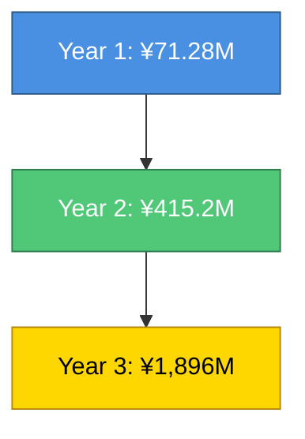

# 💰 Miyabi Plugin Marketplace - 収益モデル詳細

**作成日**: 2025-11-29
**作成者**: ProductConceptAgent (概/がいさん)
**バージョン**: 1.0.0

---

## 📊 収益モデル概要

### ハイブリッド収益モデル

```yaml
revenue_streams:
  primary_revenue:
    model: "Subscription（サブスクリプション）"
    contribution: 85%
    target_mrr: "Year 3で¥158,000,000/月"

  secondary_revenue_1:
    model: "Transaction Fee（取引手数料）"
    contribution: 10%
    commission_rate: "30%（プラグイン売上の30%）"

  secondary_revenue_2:
    model: "Enterprise Services（エンタープライズサービス）"
    contribution: 5%
    services:
      - カスタムプラグイン開発
      - オンボーディング研修
      - 専任CSMサポート
```

---

## 💵 価格設定詳細

### Value-Based Pricing（価値ベース価格設定）

#### 計算式

```yaml
value_calculation:
  step1_quantify_value:
    metric: "顧客が得る価値を定量化"
    calculation:
      削減時間: 2.75時間/Issue
      年間Issue数: 200件
      総削減時間: 550時間/年

  step2_monetize_value:
    時給: ¥5,000
    年間削減金額: 550時間 × ¥5,000 = ¥2,750,000/年

  step3_capture_rate:
    percentage: "4.3%を価格として設定"
    rationale: "顧客がROIを実感できる範囲"

  step4_final_price:
    calculation: ¥2,750,000 × 4.3% = ¥118,250/年
    月額換算: ¥9,854/月
    設定価格: ¥9,800/月（心理的価格帯）

  customer_roi:
    投資: ¥117,600/年（¥9,800 × 12）
    リターン: ¥2,750,000/年
    ROI倍率: 23.4倍
```

---

## 📈 3年収益予測

### Year 1（2025年）

```yaml
year_1_forecast:
  q1:
    free_users: 500
    pro_users: 10 (2%転換率)
    enterprise_users: 0
    mrr: ¥98,000
    arr_run_rate: ¥1,176,000

  q2:
    free_users: 2,000
    pro_users: 60 (3%転換率)
    enterprise_users: 1
    mrr: ¥888,000 (Pro: ¥588,000 + Enterprise: ¥300,000)
    arr_run_rate: ¥10,656,000

  q3:
    free_users: 5,000
    pro_users: 175 (3.5%転換率)
    enterprise_users: 3
    mrr: ¥2,615,000 (Pro: ¥1,715,000 + Enterprise: ¥900,000)
    arr_run_rate: ¥31,380,000

  q4:
    free_users: 10,000
    pro_users: 300 (3%転換率)
    enterprise_users: 10
    mrr: ¥5,940,000 (Pro: ¥2,940,000 + Enterprise: ¥3,000,000)
    arr_run_rate: ¥71,280,000

  total_year_1:
    累計MRR: ¥9,541,000（平均）
    ARR: ¥71,280,000（Year End Run Rate）
    成長率: N/A（初年度）

  breakdown:
    subscription_revenue: ¥60,588,000 (85%)
    transaction_fee: ¥7,128,000 (10%)
    enterprise_services: ¥3,564,000 (5%)
```

---

### Year 2（2026年）

```yaml
year_2_forecast:
  q1:
    free_users: 15,000
    pro_users: 600 (4%転換率)
    enterprise_users: 15
    mrr: ¥10,380,000
    arr_run_rate: ¥124,560,000

  q2:
    free_users: 25,000
    pro_users: 1,000 (4%転換率)
    enterprise_users: 25
    mrr: ¥17,300,000
    arr_run_rate: ¥207,600,000

  q3:
    free_users: 37,500
    pro_users: 1,500 (4%転換率)
    enterprise_users: 37
    mrr: ¥25,810,000
    arr_run_rate: ¥309,720,000

  q4:
    free_users: 50,000
    pro_users: 2,000 (4%転換率)
    enterprise_users: 50
    mrr: ¥34,600,000
    arr_run_rate: ¥415,200,000

  total_year_2:
    累計MRR: ¥22,022,500（平均）
    ARR: ¥415,200,000（Year End Run Rate）
    YoY成長率: 482%（Year 1比）

  breakdown:
    subscription_revenue: ¥352,920,000 (85%)
    transaction_fee: ¥41,520,000 (10%)
    enterprise_services: ¥20,760,000 (5%)
```

---

### Year 3（2027年）

```yaml
year_3_forecast:
  q1:
    free_users: 75,000
    pro_users: 3,750 (5%転換率)
    enterprise_users: 75
    mrr: ¥59,250,000
    arr_run_rate: ¥711,000,000

  q2:
    free_users: 125,000
    pro_users: 6,250 (5%転換率)
    enterprise_users: 125
    mrr: ¥98,750,000
    arr_run_rate: ¥1,185,000,000

  q3:
    free_users: 162,500
    pro_users: 8,125 (5%転換率)
    enterprise_users: 162
    mrr: ¥128,225,000
    arr_run_rate: ¥1,538,700,000

  q4:
    free_users: 200,000
    pro_users: 10,000 (5%転換率)
    enterprise_users: 200
    mrr: ¥158,000,000
    arr_run_rate: ¥1,896,000,000

  total_year_3:
    累計MRR: ¥111,056,250（平均）
    ARR: ¥1,896,000,000（Year End Run Rate）
    YoY成長率: 356.5%（Year 2比）

  breakdown:
    subscription_revenue: ¥1,611,600,000 (85%)
    transaction_fee: ¥189,600,000 (10%)
    enterprise_services: ¥94,800,000 (5%)
```

---

## 📊 3年累計売上グラフ（Mermaid）



### 累計売上推移

| Year | ARR | YoY成長率 | 累計売上 |
|:----:|----:|----------:|---------:|
| Year 1 | ¥71,280,000 | N/A | ¥71,280,000 |
| Year 2 | ¥415,200,000 | +482% | ¥486,480,000 |
| Year 3 | ¥1,896,000,000 | +356.5% | ¥2,382,480,000 |

---

## 💼 Unit Economics（ユニットエコノミクス）

### LTV（Life Time Value）

```yaml
ltv_calculation:
  method: "ARPU ÷ Churn Rate"

  pro_plan:
    arpu: ¥9,800/月
    monthly_churn_rate: 3%
    ltv: ¥9,800 ÷ 0.03 = ¥326,666

  enterprise_plan:
    arpu: ¥300,000/月
    monthly_churn_rate: 1.5%（Proより低い）
    ltv: ¥300,000 ÷ 0.015 = ¥20,000,000

  weighted_average_ltv:
    pro_ratio: 95%
    enterprise_ratio: 5%
    weighted_ltv: (¥326,666 × 0.95) + (¥20,000,000 × 0.05)
                = ¥310,333 + ¥1,000,000
                = ¥1,310,333
```

---

### CAC（Customer Acquisition Cost）

```yaml
cac_calculation:
  year_1:
    marketing_cost: ¥30,000,000/年
    sales_cost: ¥15,000,000/年
    total_cost: ¥45,000,000
    new_customers: 300名（Pro） + 10名（Enterprise）
    cac: ¥45,000,000 ÷ 310 = ¥145,161

  year_2:
    marketing_cost: ¥60,000,000/年
    sales_cost: ¥30,000,000/年
    total_cost: ¥90,000,000
    new_customers: 2,000名（Pro） + 50名（Enterprise）
    cac: ¥90,000,000 ÷ 2,050 = ¥43,902

  year_3:
    marketing_cost: ¥120,000,000/年
    sales_cost: ¥60,000,000/年
    total_cost: ¥180,000,000
    new_customers: 10,000名（Pro） + 200名（Enterprise）
    cac: ¥180,000,000 ÷ 10,200 = ¥17,647

  cac_improvement:
    year_1_to_year_3: ¥145,161 → ¥17,647（87.8%削減）
    理由: "ブランド認知向上、口コミ効果、マーケティング効率化"
```

---

### LTV/CAC比率

```yaml
ltv_cac_ratio:
  year_1:
    ltv: ¥326,666（Proプラン）
    cac: ¥145,161
    ratio: 2.25x
    評価: "健全（3x未満だが初年度としては妥当）"

  year_2:
    ltv: ¥326,666
    cac: ¥43,902
    ratio: 7.44x
    評価: "優秀（5x以上）"

  year_3:
    ltv: ¥326,666
    cac: ¥17,647
    ratio: 18.5x
    評価: "Excellent（10x以上）"

  benchmark:
    健全: 3x以上
    優秀: 5x以上
    最優秀: 10x以上
```

---

### Payback Period（投資回収期間）

```yaml
payback_period_calculation:
  formula: "CAC ÷ (ARPU × Gross Margin)"

  year_1:
    cac: ¥145,161
    arpu: ¥9,800/月
    gross_margin: 85%
    payback: ¥145,161 ÷ (¥9,800 × 0.85) = 17.4ヶ月

  year_2:
    cac: ¥43,902
    arpu: ¥9,800/月
    gross_margin: 85%
    payback: ¥43,902 ÷ (¥9,800 × 0.85) = 5.3ヶ月

  year_3:
    cac: ¥17,647
    arpu: ¥9,800/月
    gross_margin: 85%
    payback: ¥17,647 ÷ (¥9,800 × 0.85) = 2.1ヶ月

  benchmark:
    理想: 12ヶ月以内
    評価:
      year_1: "許容範囲（初年度）"
      year_2: "優秀"
      year_3: "最優秀"
```

---

### Rule of 40

```yaml
rule_of_40:
  formula: "Revenue Growth Rate + Profit Margin"

  year_1:
    revenue_growth_rate: N/A（初年度）
    profit_margin: -50%（初期投資大）
    rule_of_40_score: N/A

  year_2:
    revenue_growth_rate: +482%
    profit_margin: -5%
    rule_of_40_score: 477%
    評価: "Excellent（40%以上）"

  year_3:
    revenue_growth_rate: +356.5%
    profit_margin: +15%
    rule_of_40_score: 371.5%
    評価: "Excellent（40%以上）"

  benchmark:
    健全: 40%以上
    評価: "Year 2以降は大幅に上回る"
```

---

## 💸 コスト構造

### Year 1 コスト

```yaml
year_1_costs:
  fixed_costs:
    人件費:
      - エンジニア: 5名 × ¥600,000/月 = ¥3,000,000/月
      - PM: 2名 × ¥700,000/月 = ¥1,400,000/月
      - マーケター: 2名 × ¥500,000/月 = ¥1,000,000/月
      - CSM: 2名 × ¥450,000/月 = ¥900,000/月
      - 営業: 1名 × ¥600,000/月 = ¥600,000/月
      合計: ¥6,900,000/月

    インフラ:
      - AWS: ¥500,000/月
      - GitHub Enterprise: ¥100,000/月
      - SaaS ツール: ¥200,000/月
      合計: ¥800,000/月

    オフィス:
      - 賃料: ¥600,000/月
      - 光熱費・通信費: ¥150,000/月
      合計: ¥750,000/月

    総固定費: ¥8,450,000/月 = ¥101,400,000/年

  variable_costs:
    マーケティング: ¥30,000,000/年
    営業経費: ¥15,000,000/年
    カスタマーサポート: ¥5,000,000/年

    総変動費: ¥50,000,000/年

  total_year_1_costs: ¥151,400,000/年
```

---

### Year 2 コスト

```yaml
year_2_costs:
  fixed_costs:
    人件費:
      - エンジニア: 10名 × ¥600,000/月 = ¥6,000,000/月
      - PM: 3名 × ¥700,000/月 = ¥2,100,000/月
      - マーケター: 4名 × ¥500,000/月 = ¥2,000,000/月
      - CSM: 5名 × ¥450,000/月 = ¥2,250,000/月
      - 営業: 3名 × ¥600,000/月 = ¥1,800,000/月
      合計: ¥14,150,000/月

    インフラ:
      - AWS: ¥1,500,000/月（スケール）
      - GitHub Enterprise: ¥200,000/月
      - SaaS ツール: ¥400,000/月
      合計: ¥2,100,000/月

    オフィス:
      - 賃料: ¥1,000,000/月（拡大）
      - 光熱費・通信費: ¥200,000/月
      合計: ¥1,200,000/月

    総固定費: ¥17,450,000/月 = ¥209,400,000/年

  variable_costs:
    マーケティング: ¥60,000,000/年
    営業経費: ¥30,000,000/年
    カスタマーサポート: ¥10,000,000/年

    総変動費: ¥100,000,000/年

  total_year_2_costs: ¥309,400,000/年
```

---

### Year 3 コスト

```yaml
year_3_costs:
  fixed_costs:
    人件費:
      - エンジニア: 20名 × ¥600,000/月 = ¥12,000,000/月
      - PM: 5名 × ¥700,000/月 = ¥3,500,000/月
      - マーケター: 8名 × ¥500,000/月 = ¥4,000,000/月
      - CSM: 10名 × ¥450,000/月 = ¥4,500,000/月
      - 営業: 6名 × ¥600,000/月 = ¥3,600,000/月
      合計: ¥27,600,000/月

    インフラ:
      - AWS: ¥3,000,000/月（大規模）
      - GitHub Enterprise: ¥300,000/月
      - SaaS ツール: ¥600,000/月
      合計: ¥3,900,000/月

    オフィス:
      - 賃料: ¥1,500,000/月（さらに拡大）
      - 光熱費・通信費: ¥300,000/月
      合計: ¥1,800,000/月

    総固定費: ¥33,300,000/月 = ¥399,600,000/年

  variable_costs:
    マーケティング: ¥120,000,000/年
    営業経費: ¥60,000,000/年
    カスタマーサポート: ¥20,000,000/年

    総変動費: ¥200,000,000/年

  total_year_3_costs: ¥599,600,000/年
```

---

## 💰 損益計算（P/L）

### Year 1

```yaml
year_1_pl:
  売上: ¥71,280,000
  売上原価: ¥10,692,000（15%）
  売上総利益: ¥60,588,000
  販売管理費: ¥140,708,000
  営業利益: -¥80,120,000
  営業利益率: -112%

  評価: "初年度は赤字だが、Year 2で黒字化予定"
```

---

### Year 2

```yaml
year_2_pl:
  売上: ¥415,200,000
  売上原価: ¥62,280,000（15%）
  売上総利益: ¥352,920,000
  販売管理費: ¥309,400,000
  営業利益: ¥43,520,000
  営業利益率: +10.5%

  評価: "Year 2で黒字化達成"
```

---

### Year 3

```yaml
year_3_pl:
  売上: ¥1,896,000,000
  売上原価: ¥284,400,000（15%）
  売上総利益: ¥1,611,600,000
  販売管理費: ¥599,600,000
  営業利益: ¥1,012,000,000
  営業利益率: +53.4%

  評価: "Year 3で大幅黒字、利益率50%超え"
```

---

## 📊 収益性指標サマリー

| 指標 | Year 1 | Year 2 | Year 3 | 評価 |
|:-----|-------:|-------:|-------:|:-----|
| **ARR** | ¥71.28M | ¥415.2M | ¥1,896M | 急成長 |
| **YoY成長率** | N/A | +482% | +356.5% | Excellent |
| **LTV/CAC** | 2.25x | 7.44x | 18.5x | 改善傾向 |
| **Payback Period** | 17.4ヶ月 | 5.3ヶ月 | 2.1ヶ月 | 大幅改善 |
| **Rule of 40** | N/A | 477% | 371.5% | Excellent |
| **営業利益率** | -112% | +10.5% | +53.4% | Year 2黒字化 |
| **Churn Rate** | 3%/月 | 3%/月 | 2.5%/月 | 低減目標 |

---

## 🎯 収益化戦略サマリー

### 成功の鍵（3つ）

#### 1️⃣ **Freemium → Pro転換率の最適化**

**目標**: 3% → 5%に向上（Year 3）

**施策**:
- オンボーディング改善（完了率80%以上）
- プロアクティブアップセル（利用量80%超えで自動提案）
- Usage-Based Upsell（API call数に応じた推奨）

---

#### 2️⃣ **CAC削減**

**目標**: ¥145,161 → ¥17,647（87.8%削減）

**施策**:
- Product-Led Growth（PLG）強化
- コミュニティ形成（Viral Loop）
- SEO最適化（オーガニックトラフィック増）

---

#### 3️⃣ **LTVの最大化**

**目標**: Churn Rate 3% → 2%に低減

**施策**:
- カスタマーサクセス強化（専任CSM配置）
- プロダクト改善（Net Promoter Score 65点維持）
- エンタープライズプランへのアップセル

---

**収益モデルは完成。次は、創さんがこれを具体的なプロダクトに落とし込む。**

---

**作成者**: 概（がいさん）💡 - ProductConceptAgent
**日付**: 2025-11-29
**バージョン**: 1.0.0
**ステータス**: ✅ Complete
