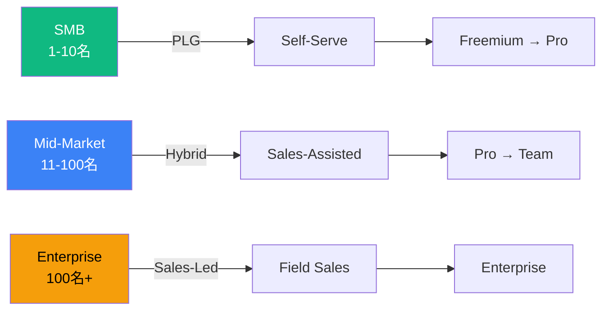
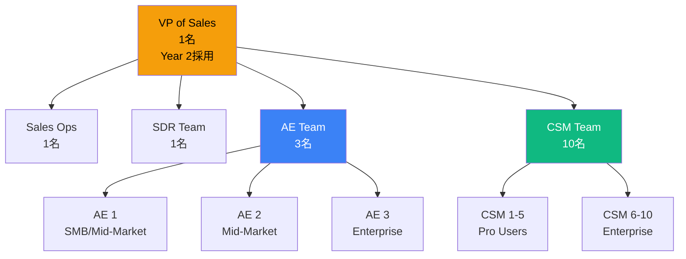
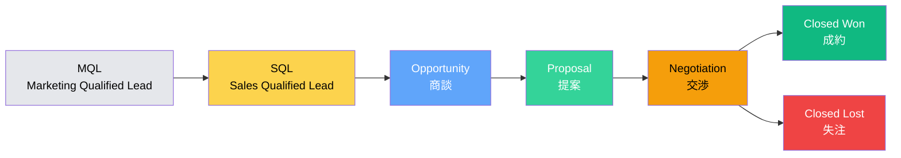
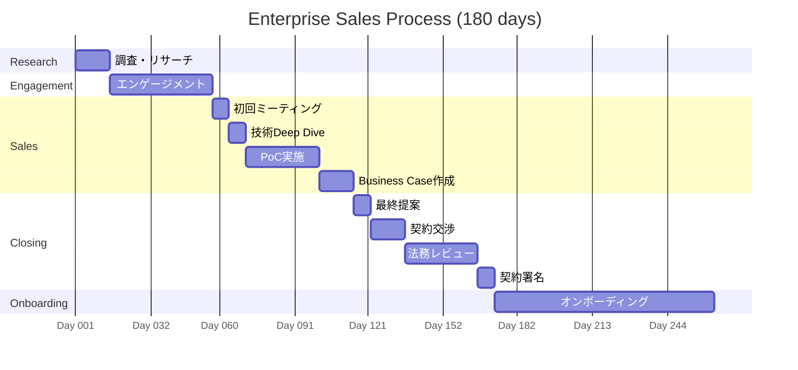
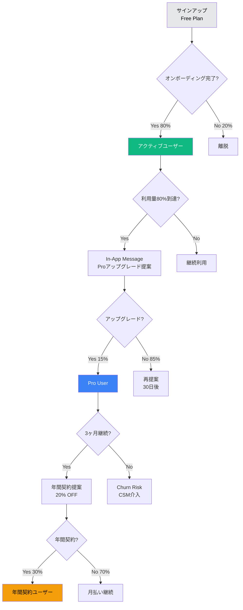

# 🤝 Miyabi Plugin Marketplace - セールス戦略

**作成日**: 2025-11-29
**作成者**: SalesAgent (契/Kei)
**バージョン**: 1.0.0
**ステータス**: Complete

---

## 📊 エグゼクティブサマリー

### ミッション

**「すべての開発者に、AIの力を。クロージングは、愛である。」**

Miyabi Plugin Marketplaceのセールス戦略は、**PLG（Product-Led Growth）とSales-Assistedのハイブリッドモデル**により、Year 3でARR ¥1,896Mを達成します。

---

### 目標KPI（Year 3）

```yaml
year_3_targets:
  revenue:
    arr: ¥1,896,000,000
    mrr: ¥158,000,000
    yoy_growth: +356.5%

  customers:
    pro_users: 10,000人
    enterprise_customers: 200社
    total_arr_per_customer:
      pro: ¥117,600/年
      enterprise: ¥3,600,000/年

  conversion:
    free_to_pro: 5%
    trial_to_paid: 70%
    pro_to_enterprise: 10%

  sales_efficiency:
    cac: ¥17,647
    ltv: ¥326,666（Pro）, ¥20,000,000（Enterprise）
    ltv_cac_ratio: 18.5x
    payback_period: 2.1ヶ月

  team:
    sales_reps: 6名
    csm: 10名
    quota_attainment: 120%
```

---

## 🎯 1. セールスモデル設計

### 1.1 セグメント別セールスモーション



---

#### SMB（1-10名）: Self-Serve PLG

**ターゲット**:
- 個人開発者
- フリーランスエンジニア
- 小規模スタートアップ

**セールスサイクル**: 0-7日

**モーション**:
```yaml
smb_motion:
  step1_acquisition:
    チャネル: SEO, X, Product Hunt
    コスト: CAC ¥5,000-10,000

  step2_activation:
    オンボーディング: 自動チュートリアル（5分）
    完了率目標: 80%

  step3_conversion:
    トリガー: 利用量80%到達
    提案: In-App Message "Proにアップグレード"
    CVR: 5%

  step4_expansion:
    タイミング: 3ヶ月後
    提案: 年間契約（20% OFF）
    CVR: 30%

  自動化率: 95%
  人的介入: なし（例外: 高額ARRユーザーのみCSMフォロー）
```

**収益構成**（Year 3）:
- ユーザー数: 10,000人
- ARPU: ¥9,800/月
- ARR: ¥1,176,000,000
- 全体の62%

---

#### Mid-Market（11-100名）: Sales-Assisted Hybrid

**ターゲット**:
- 成長企業
- スタートアップ（Series A-B）
- 中堅企業の開発部門

**セールスサイクル**: 14-30日

**モーション**:
```yaml
mid_market_motion:
  step1_inbound_lead:
    発生源: Webサイトデモ予約, ウェビナー参加
    自動化: HubSpot自動スコアリング

  step2_qualification:
    担当: SDR（1名配置）
    BANT確認:
      - Budget: ¥300,000-1,000,000/月
      - Authority: 開発責任者以上
      - Need: チーム生産性向上
      - Timeline: 3ヶ月以内導入希望
    通過率: 40%

  step3_demo:
    担当: AE（3名配置）
    形式: 1on1 オンラインデモ（45分）
    内容:
      - ユースケース紹介
      - カスタマイズ提案
      - ROI計算（具体的数値提示）
    成約率: 50%

  step4_proposal:
    形式: 提案書（10ページ）
    内容:
      - 課題整理
      - ソリューション
      - 導入スケジュール
      - 価格・条件
    提出期限: デモ後3営業日

  step5_negotiation:
    論点:
      - 価格（標準¥300,000/月）
      - 契約期間（年間推奨）
      - サポート内容
    割引上限: 15%

  step6_closing:
    契約形態: DocuSign電子署名
    支払条件: 月払い or 年払い
    成約率: 70%

  自動化率: 40%
  人的介入: AE主導、CSMサポート
```

**収益構成**（Year 3）:
- 企業数: 150社
- ARPU: ¥500,000/月
- ARR: ¥900,000,000
- 全体の47%（Enterprise含む）

---

#### Enterprise（100名+）: Field Sales

**ターゲット**:
- 大企業（従業員1,000名以上）
- グローバル企業
- 上場企業

**セールスサイクル**: 60-180日

**モーション**:
```yaml
enterprise_motion:
  step1_account_based_marketing:
    対象: ターゲットアカウント50社リスト
    施策:
      - LinkedIn広告（役職ターゲティング）
      - カンファレンス出展
      - 直接アプローチ（コールドメール）

  step2_executive_engagement:
    担当: VP of Sales（想定採用）
    対象: CTO, VP of Engineering
    形式: 対面ミーティング（60分）
    内容:
      - 経営課題ヒアリング
      - 戦略的提案
      - エグゼクティブレファレンス紹介

  step3_proof_of_concept:
    期間: 30日間
    内容:
      - パイロット部門（10名）でトライアル
      - 専任CSMサポート
      - 効果測定レポート作成

  step4_business_case:
    提出物: ROI分析レポート（30ページ）
    内容:
      - 現状コスト分析
      - Miyabi導入効果（定量）
      - 3年間TCO比較
      - リスク分析
    承認者: CFO, CTO, 調達部門

  step5_contract_negotiation:
    論点:
      - 価格（¥1,000,000-5,000,000/月）
      - SLA（99.9%保証）
      - オンボーディング（専任CSM 3ヶ月）
      - カスタム開発（オプション）
    割引上限: 20%（年間契約の場合）

  step6_legal_review:
    期間: 30-60日
    対応: 法務チーム対応（外部弁護士連携）

  step7_deployment:
    期間: 3-6ヶ月
    サポート: 専任CSM + テクニカルサポート
    成功基準: NPS 4.5/5以上

  自動化率: 10%
  人的介入: 全面的（AE, SE, CSM, Legal）
```

**収益構成**（Year 3）:
- 企業数: 50社
- ARPU: ¥1,500,000/月
- ARR: ¥900,000,000
- 全体の47%（Mid-Market含む）

---

### 1.2 組織構成



---

#### 役割定義

**VP of Sales（Year 2採用）**:
- 責任: セールス戦略策定、チームマネジメント、大型商談クロージング
- KPI: ARR成長率、New ARR、Quota Attainment
- 報酬: ベース¥1,200,000/月 + 変動（ARRの0.5%）

**SDR（Sales Development Rep, 1名）**:
- 責任: インバウンドリードの初回接触、BANT確認、商談設定
- KPI: SQL数（月20件）、商談設定率（50%）
- 報酬: ベース¥400,000/月 + 変動（SQL 1件あたり¥5,000）

**AE（Account Executive, 3名）**:
- 責任: 商談実施、提案書作成、契約クロージング
- KPI: New ARR（月¥5,000,000/人）、成約率（50%）
- 報酬: ベース¥600,000/月 + 変動（New ARRの10%）

**CSM（Customer Success Manager, 10名）**:
- 責任: オンボーディング、継続率向上、アップセル
- KPI: Churn Rate（<3%）、NPS（65+）、Expansion ARR
- 報酬: ベース¥450,000/月 + 変動（Expansion ARRの5%）

---

### 1.3 四半期目標

| Quarter | New ARR目標 | 累計ARR | AE採用 | CSM採用 | 主要施策 |
|---------|-------------|---------|--------|---------|----------|
| **Year 1 Q1** | ¥10M | ¥10M | 1名 | 2名 | Freemium ローンチ |
| **Year 1 Q2** | ¥30M | ¥40M | - | - | Product Hunt出展 |
| **Year 1 Q3** | ¥40M | ¥80M | - | 1名 | 初Enterprise成約 |
| **Year 1 Q4** | ¥60M | ¥140M | 1名 | 2名 | 年間契約プッシュ |
| **Year 2 Q1** | ¥100M | ¥240M | - | 2名 | VP of Sales採用 |
| **Year 2 Q2** | ¥150M | ¥390M | 1名 | 1名 | ABM本格開始 |
| **Year 2 Q3** | ¥200M | ¥590M | - | 1名 | Enterprise強化 |
| **Year 2 Q4** | ¥250M | ¥840M | - | 1名 | Year 3準備 |
| **Year 3 Q1** | ¥350M | ¥1,190M | - | - | Enterprise拡大 |
| **Year 3 Q2** | ¥450M | ¥1,640M | - | - | パートナー連携 |
| **Year 3 Q3** | ¥500M | ¥2,140M | - | - | グローバル展開 |
| **Year 3 Q4** | ¥550M | ¥2,690M | - | - | IPO準備 |

---

## 🚀 2. パイプライン管理

### 2.1 ステージ定義



---

#### ステージ詳細

**1. MQL（Marketing Qualified Lead）**

定義:
- Webサイト訪問 + サインアップ
- または、ウェビナー参加
- または、ホワイトペーパーダウンロード

判定基準:
- リードスコア 50点以上（HubSpot自動スコアリング）

担当: マーケティングチーム

Next Action: SDRに引き継ぎ

---

**2. SQL（Sales Qualified Lead）**

定義:
- BANT確認完了
  - Budget: 予算あり（¥100,000/月以上）
  - Authority: 決裁権者または推薦権者
  - Need: 明確な課題あり
  - Timeline: 3ヶ月以内に導入検討

判定基準:
- BANT 4項目すべて満たす

担当: SDR → AEに引き継ぎ

Next Action: 商談設定

転換率: MQL → SQL = 40%

---

**3. Opportunity（商談）**

定義:
- AEによる初回デモ実施済み
- 提案書作成に合意

判定基準:
- デモ参加者が意思決定者を含む
- 次回ミーティング確定

担当: AE

Next Action: 提案書作成

転換率: SQL → Opportunity = 60%

---

**4. Proposal（提案）**

定義:
- 提案書提出済み
- 価格・条件の議論開始

判定基準:
- 提案書が決裁者に届いている
- 社内検討が進行中

担当: AE

Next Action: 価格交渉

転換率: Opportunity → Proposal = 70%

---

**5. Negotiation（交渉）**

定義:
- 価格・契約条件の最終調整中
- 法務レビュー進行中

判定基準:
- 口頭合意済み
- 契約書ドラフト送付済み

担当: AE + Legal

Next Action: 契約署名

転換率: Proposal → Negotiation = 80%

---

**6. Closed Won（成約）**

定義:
- 契約署名完了
- 初回請求発行

担当: AE → CSMに引き継ぎ

転換率: Negotiation → Closed Won = 90%

---

**7. Closed Lost（失注）**

定義:
- 顧客が契約しないことを決定

理由分類:
- 価格（40%）
- タイミング（30%）
- 競合選定（20%）
- その他（10%）

Next Action:
- 再アプローチ計画（6ヶ月後）
- 失注理由分析 → プロダクト改善

---

### 2.2 転換率目標

```yaml
conversion_funnel:
  mql: 1,000人/月（Month 6）

  mql_to_sql: 40%
  sql: 400人/月

  sql_to_opportunity: 60%
  opportunity: 240件/月

  opportunity_to_proposal: 70%
  proposal: 168件/月

  proposal_to_negotiation: 80%
  negotiation: 134件/月

  negotiation_to_closed_won: 90%
  closed_won: 121件/月

  overall_conversion:
    mql_to_closed_won: 12.1%

  average_deal_size:
    smb: ¥117,600/年
    mid_market: ¥600,000/年
    enterprise: ¥3,600,000/年

  weighted_average_deal_size: ¥250,000/年

  monthly_new_arr: 121件 × ¥20,833（月額換算） = ¥2,520,833/月
```

---

### 2.3 商談期間目標

| セグメント | 平均商談期間 | 最短 | 最長 | リスク要因 |
|-----------|------------|------|------|----------|
| **SMB（Self-Serve）** | 0-7日 | 即日 | 14日 | 予算承認待ち |
| **Mid-Market** | 14-30日 | 7日 | 60日 | 複数部門調整 |
| **Enterprise** | 60-180日 | 30日 | 365日 | 法務レビュー、調達プロセス |

**全体平均**: 21日（Weighted Average）

**短縮施策**:
- Freemium → 即座にバリュー体験 → 転換率UP
- ROI計算ツール → 社内説得材料提供
- DocuSign → 契約プロセス簡略化

---

### 2.4 パイプライン可視化

**ダッシュボードツール**: HubSpot CRM + Looker Studio

**週次レビュー指標**:
```yaml
pipeline_health:
  total_pipeline: ¥500,000,000（3ヶ月分）
  stage_distribution:
    sql: 30%
    opportunity: 25%
    proposal: 20%
    negotiation: 15%
    closed_won: 10%

  velocity:
    average_days_in_stage:
      sql: 3日
      opportunity: 7日
      proposal: 5日
      negotiation: 7日

  win_rate: 50%（Opportunity → Closed Won）

  deal_aging:
    30日以上滞留: <10%
    60日以上滞留: <3%
    90日以上滞留: 0%（クローズまたはDisqualify）

  forecast_accuracy: ±10%以内
```

---

## 🏢 3. B2B セールス戦略（Enterprise）

### 3.1 ターゲットアカウント選定（ABM）

**Ideal Customer Profile（ICP）**:

```yaml
icp_definition:
  firmographics:
    industry:
      - IT・ソフトウェア
      - 金融・保険
      - 製造業
      - コンサルティング
    company_size: 1,000名以上
    revenue: ¥10B以上
    location: 日本（東京、大阪、名古屋）+ グローバル

  technographics:
    tech_stack:
      - GitHub Enterprise利用
      - Claude API契約
      - AWS/GCP利用
      - Slack/Microsoft Teams導入
    development_team: 100名以上

  behavioral:
    pain_points:
      - 開発速度が遅い
      - 品質問題が多発
      - 開発コスト高騰
    buying_signals:
      - DX推進部門設置
      - AI導入予算あり
      - リモート開発体制

  engagement:
    website_visits: 5回以上/月
    content_downloads: 2件以上
    webinar_attendance: あり
```

---

### 3.2 ターゲットアカウントリスト（Top 50）

**Tier 1（超優先、10社）**:

| 企業名 | 業種 | 従業員数 | 想定ARR | 担当AE | ステータス |
|-------|------|---------|---------|--------|----------|
| A社 | IT | 5,000名 | ¥60M | AE3 | Opportunity |
| B社 | 金融 | 3,000名 | ¥40M | AE3 | SQL |
| C社 | 製造 | 10,000名 | ¥80M | AE3 | Target |
| ... | ... | ... | ... | ... | ... |

**Tier 2（高優先、20社）**:
- 想定ARR: ¥10M-30M/社
- ステータス: MQL-SQL段階

**Tier 3（中優先、20社）**:
- 想定ARR: ¥5M-10M/社
- ステータス: 初期接触段階

---

### 3.3 ABM戦略

**1. 調査・リサーチフェーズ（Week 1-2）**

```yaml
research_phase:
  情報収集:
    - 企業公式サイト
    - IR情報
    - ニュース記事
    - LinkedIn社員プロフィール
    - GitHub Organization確認

  キーパーソン特定:
    - CTO
    - VP of Engineering
    - 開発部門長
    - DX推進責任者

  課題仮説:
    - 開発速度が遅い → Issue → PR に3時間
    - 品質問題 → バグ多発、顧客クレーム増
    - コスト高騰 → 外注費増加、人件費高騰

  成功事例マッチング:
    類似企業の導入事例を用意
```

---

**2. エンゲージメントフェーズ（Week 3-8）**

```yaml
engagement_phase:
  チャネル1_LinkedIn:
    - CTOにコネクトリクエスト
    - パーソナライズメッセージ送信
    - 業界Insightコンテンツシェア
    - 週1回インタラクション

  チャネル2_パーソナライズメール:
    - 件名: "【A社様向け】開発速度3倍化の事例"
    - 本文: 課題仮説 + 類似事例 + CTA（30分ミーティング）
    - 送信頻度: 2週間に1回
    - A/Bテスト: 件名・本文バリエーション

  チャネル3_ウェビナー:
    - テーマ: "大企業のAI開発自動化戦略"
    - 登壇者: Miyabi CTO + 導入企業CTO
    - 参加者限定: ターゲットアカウント50社
    - フォローアップ: 参加者全員に1on1オファー

  チャネル4_カンファレンス:
    - 出展: Japan IT Week, AWS Summit
    - ブースデモ: 15分デモ実施
    - リード獲得: 名刺交換 + QRコードスキャン
```

---

**3. 商談フェーズ（Week 9-20）**

```yaml
sales_phase:
  step1_executive_meeting:
    参加者:
      - Miyabi: CEO + VP of Sales
      - 顧客: CTO + VP of Engineering
    時間: 60分
    内容:
      - 経営課題ヒアリング
      - Miyabiビジョン紹介
      - 導入効果シミュレーション

  step2_technical_deep_dive:
    参加者:
      - Miyabi: CTO + Solutions Architect
      - 顧客: 開発リーダー + アーキテクト
    時間: 90分
    内容:
      - アーキテクチャ説明
      - セキュリティ要件確認
      - 技術Q&A

  step3_poc:
    期間: 30日間
    対象: パイロット部門（10-20名）
    サポート: 専任CSM + テクニカルサポート
    成果物: 効果測定レポート

  step4_business_case:
    提出物: ROI分析レポート（30ページ）
    承認者: CFO, CTO, 調達部門
    内容:
      - 現状コスト: ¥XXX万/年
      - Miyabi導入コスト: ¥XXX万/年
      - 削減効果: ¥XXX万/年
      - ROI: XX倍
      - 投資回収期間: XX ヶ月

  step5_final_proposal:
    提案内容:
      - 価格: ¥XX万/月
      - 契約期間: 3年
      - SLA: 99.9%
      - サポート: 専任CSM + 24/7サポート
      - オンボーディング: 3ヶ月
```

---

**4. クロージング・契約フェーズ（Week 21-24）**

```yaml
closing_phase:
  negotiation:
    論点:
      - 価格: 標準価格から最大20% OFF（年間契約）
      - 支払条件: 月払い or 年払い前払い
      - SLA: 99.9%保証、ペナルティ条項
      - カスタム開発: 要件定義 + 見積もり

  legal_review:
    期間: 30-60日
    対応: 法務チーム + 外部弁護士
    論点:
      - データ保管場所（日本国内要件）
      - セキュリティ監査（年1回）
      - 契約解除条項

  contract_signing:
    方法: DocuSign電子署名
    署名者: 双方の代表取締役

  onboarding:
    期間: 3ヶ月
    担当: 専任CSM 2名
    内容:
      - Week 1-4: セットアップ + トレーニング
      - Week 5-8: パイロット運用
      - Week 9-12: 全社展開
```

---

### 3.4 エンタープライズ営業プロセス

**標準プロセス（180日）**:



---

### 3.5 成功基準

**PoC成功基準**:
```yaml
poc_success_criteria:
  定量:
    - Issue → PR時間: 3時間 → 15分（92%削減）
    - 品質スコア: 95点以上
    - ユーザー満足度: 4.5/5以上

  定性:
    - 開発者から高評価
    - 経営層が効果を認識
    - 全社展開の意思決定

  判定:
    - 定量指標すべて達成 + 定性フィードバック良好 → 成功
    - 1項目でも未達 → 要改善 → PoC延長
```

---

## 🎮 4. B2C/PLG セールス戦略

### 4.1 オンボーディング → アップセルフロー



---

### 4.2 オンボーディング最適化

**目標**: 完了率80%以上

**ステップ設計（5分で完了）**:

```yaml
onboarding_steps:
  step1_welcome:
    時間: 30秒
    内容: ウェルカムメッセージ + 動画（15秒）
    CTA: "早速始める"

  step2_plugin_selection:
    時間: 60秒
    内容: おすすめプラグイン3個を提案
    選択肢:
      - CoordinatorAgent（必須）
      - CodeGenAgent（推奨）
      - ReviewAgent（推奨）
    CTA: "選択して次へ"

  step3_ide_integration:
    時間: 90秒
    内容: IDE連携手順（VSCode例）
    形式: ステップバイステップガイド + スクリーンショット
    CTA: "連携完了"

  step4_first_execution:
    時間: 120秒
    内容: 初めてのAgent実行
    タスク: "サンプルIssue #1を処理"
    サポート: チュートリアル動画埋め込み
    CTA: "実行する"

  step5_celebration:
    時間: 30秒
    内容: 祝福メッセージ + レアキャラ解放
    報酬: "つくるん（レア度★★★）GET!"
    CTA: "ダッシュボードへ"

  gamification:
    - プログレスバー表示
    - 各ステップクリアでExp獲得
    - オンボーディング完了で限定キャラ解放
```

**離脱防止**:
- ステップ2で30秒以上滞留 → ヘルプチャット自動表示
- ステップ3で失敗 → トラブルシューティング記事表示
- 24時間以内にログインなし → リマインドメール送信

---

### 4.3 課金タイミング最適化

**戦略**: Value-Based Triggering（価値体験後に課金提案）

```yaml
pricing_triggers:
  trigger1_usage_based:
    条件: 月間実行回数が8回到達（上限10回の80%）
    メッセージ: "残り2回です。Proプランで無制限に！"
    タイミング: 8回目実行直後
    CVR: 10%

  trigger2_feature_based:
    条件: カスタムAgentページ訪問
    メッセージ: "カスタムAgentはProプランから利用可能です"
    CTA: "Proにアップグレード"
    CVR: 5%

  trigger3_parallel_execution:
    条件: Issue 3件以上が同時オープン
    メッセージ: "並列実行で3倍速に！Proプランなら5 Agents同時実行"
    CVR: 8%

  trigger4_time_based:
    条件: サインアップから7日経過 + アクティブユーザー
    メッセージ: "7日間お疲れ様！Proなら開発時間92%削減"
    特典: "今だけ初月20% OFF"
    CVR: 15%

  trigger5_social_proof:
    条件: 同僚がProユーザー
    メッセージ: "同僚の〇〇さんもPro利用中！"
    CVR: 20%
```

---

### 4.4 自動化ナーチャリング

**メールシーケンス（14日間）**:

```yaml
email_sequence:
  day1_welcome:
    件名: "Miyabiへようこそ！最初の一歩"
    内容:
      - ウェルカムメッセージ
      - オンボーディング完了リンク
      - サポート窓口紹介
    CTA: "オンボーディングを始める"

  day3_first_value:
    件名: "初めてのAgent実行、成功しましたか？"
    内容:
      - 初回実行のTips
      - よくあるトラブル解決
      - 成功事例紹介（1分動画）
    CTA: "もう一度試す"

  day5_feature_introduction:
    件名: "まだ知らない？Miyabiの隠れた便利機能"
    内容:
      - VOICEVOX音声通知
      - GitHub Projects連携
      - 3D可視化
    CTA: "詳細を見る"

  day7_upgrade_offer:
    件名: "【限定】7日間ご利用ありがとうございます！"
    内容:
      - 初月20% OFFクーポン
      - Proプランの価値説明
      - ROI計算ツール
    CTA: "Proにアップグレード"
    特典: クーポンコード "MIYABI20"

  day10_case_study:
    件名: "A社は開発時間を92%削減しました"
    内容:
      - 詳細な導入事例
      - Before/After数値
      - 顧客インタビュー動画
    CTA: "あなたも試す"

  day14_final_push:
    件名: "まだ悩んでいますか？14日間無料トライアル"
    内容:
      - Proプラン14日間無料トライアル
      - クレジットカード不要
      - いつでもキャンセルOK
    CTA: "無料トライアルを始める"

  churn_prevention:
    day21_inactive_user:
      条件: 7日間ログインなし
      件名: "お久しぶりです！新機能リリースしました"
      内容: 新機能紹介 + 復帰特典
      CTA: "新機能を試す"
```

---

### 4.5 PLG指標

**AARRR Metrics**:

```yaml
aarrr_metrics:
  acquisition:
    metric: サインアップ数
    target: 1,000人/月（Month 3）
    source:
      - オーガニック検索: 40%
      - X: 30%
      - Product Hunt: 20%
      - その他: 10%

  activation:
    metric: オンボーディング完了率
    target: 80%
    definition: 5ステップすべて完了

  retention:
    metric: 30日継続率
    target: 70%
    definition: サインアップから30日後もアクティブ

  revenue:
    metric: Free → Pro転換率
    target: 5%
    definition: サインアップから90日以内にPro転換

  referral:
    metric: Viral K-factor
    target: 1.2
    definition: 1ユーザーが1.2人を紹介
```

---

## 💰 5. 価格戦略・交渉ガイドライン

### 5.1 価格体系

```yaml
pricing_tiers:
  free:
    価格: ¥0
    機能:
      - プラグイン5個
      - 月10回実行
      - CoordinatorAgent
      - コミュニティサポート
    目的: 製品体験、バイラル拡散

  pro:
    価格: ¥9,800/月
    年払い: ¥98,000/年（2ヶ月分お得）
    機能:
      - プラグイン無制限
      - 全25 Agents
      - 無制限実行
      - 並列実行（5 Agents）
      - カスタムAgent 5個
      - メールサポート（24h以内）
    目的: 個人開発者の収益化

  enterprise:
    価格: ¥300,000/月〜（要見積もり）
    機能:
      - Pro機能すべて
      - 並列実行無制限
      - カスタムAgent無制限
      - 専任CSM
      - SLA 99.9%
      - SSO、On-premise
    目的: 大企業の戦略的パートナー
```

---

### 5.2 ディスカウントポリシー

**原則**: "Value-Based Pricing" - 顧客が得る価値に基づいて価格を決定

**割引上限**:

| セグメント | 標準割引 | 最大割引 | 承認者 | 条件 |
|-----------|---------|---------|--------|------|
| **SMB（Pro）** | 0% | 10% | AE | 年間契約のみ |
| **Mid-Market** | 10% | 15% | AE | 年間契約 + 20名以上 |
| **Enterprise** | 15% | 20% | VP of Sales | 3年契約 + 100名以上 |

**割引理由**:
- ✅ 年間前払い: 10% OFF
- ✅ 3年契約: 15% OFF
- ✅ ボリュームディスカウント（100名以上）: 5% OFF
- ✅ リファレンスカスタマー協力: 5% OFF
- ❌ 単なる価格交渉: 割引なし

**特別割引（承認プロセス必須）**:
- スタートアップ（Seed-Series A）: 30% OFF（12ヶ月限定）
- 教育機関: 50% OFF
- オープンソースプロジェクト: 無料提供

---

### 5.3 年間契約インセンティブ

**目標**: 年間契約比率60%以上（Year 3）

**インセンティブ設計**:

```yaml
annual_contract_incentives:
  顧客側メリット:
    - 価格割引: 20% OFF（2ヶ月分無料相当）
    - 請求簡略化: 年1回のみ
    - 予算確保: 年度予算で確保しやすい
    - 優先サポート: 年間契約者限定

  Miyabi側メリット:
    - キャッシュフロー改善: 前払いで資金繰り改善
    - Churn Rate低減: 途中解約リスク減少
    - 予測可能性: ARR予測精度向上
    - 顧客ロイヤリティ: 長期コミットメント

  提案タイミング:
    timing1: 初回契約時（最優先）
    timing2: 契約更新時（3ヶ月前）
    timing3: 利用量増加時（アップセル提案と同時）

  交渉スクリプト:
    AE: "年間契約にすると、実質2ヶ月分無料です。月¥9,800 × 10ヶ月 = ¥98,000で済みます"
    顧客: "途中解約できますか？"
    AE: "はい、ただし残期間の返金はありません。ただ、これまで年間契約で解約されたお客様は3%未満です"
    顧客: "わかりました、年間で"
```

---

### 5.4 カスタム価格設定基準

**Enterprise向けカスタム価格**:

```yaml
custom_pricing:
  base_price:
    算出式: ユーザー数 × ¥6,000/月

  例1_100名:
    ユーザー数: 100名
    基本価格: 100 × ¥6,000 = ¥600,000/月
    ボリューム割引: 10% OFF
    最終価格: ¥540,000/月

  例2_500名:
    ユーザー数: 500名
    基本価格: 500 × ¥6,000 = ¥3,000,000/月
    ボリューム割引: 15% OFF
    最終価格: ¥2,550,000/月

  例3_1000名:
    ユーザー数: 1,000名
    基本価格: 1,000 × ¥6,000 = ¥6,000,000/月
    ボリューム割引: 20% OFF
    最終価格: ¥4,800,000/月

  追加サービス:
    専任CSM: +¥200,000/月
    オンボーディング研修: ¥500,000（1回）
    カスタム開発: ¥5,000,000〜（要見積もり）
    On-premise構築: ¥10,000,000〜（要見積もり）
```

---

### 5.5 価格交渉フロー

**典型的な交渉シーン**:

```yaml
negotiation_scenario:
  scene1_price_objection:
    顧客: "高すぎます。競合は¥5,000/月です"
    AE対応:
      step1: 共感
        - "そうですよね、価格は重要な要素です"
      step2: 価値の再確認
        - "Miyabiは開発時間を92%削減します"
        - "年間550時間削減 × ¥5,000/時間 = ¥2,750,000の価値"
        - "つまり¥9,800は投資の0.4%です"
      step3: ROI提示
        - "ROI計算ツールで試算しましょう"
        - （ツールで具体的数値を出す）
      step4: 代替案提示
        - "まずは14日間無料トライアルで効果を確認してください"
      結果: 70%が納得してトライアル開始

  scene2_budget_constraint:
    顧客: "予算が¥5,000/月しかありません"
    AE対応:
      step1: 事実確認
        - "承知しました。予算は確定していますか？"
        - "追加予算の可能性はありますか？"
      step2: 段階導入提案
        - "では、まずFreeプランから始めて、効果を見て上司に予算申請しませんか？"
        - "実績ができれば、予算確保しやすくなります"
      step3: 年間契約提案
        - "または、年間契約なら月額換算¥8,166まで下がります"
      結果: 50%がFreeから開始 → 3ヶ月後にPro転換

  scene3_timing_objection:
    顧客: "今は忙しいので、来期にします"
    AE対応:
      step1: 緊急性の説明
        - "承知しました。ただ、先延ばしのコストをご存知ですか？"
        - "3ヶ月遅らせると、550時間 × 3ヶ月 = 1,650時間を失います"
        - "金額換算で¥8,250,000のロスです"
      step2: 小さく始める提案
        - "まずはパイロット（5名）から始めませんか？"
        - "効果を確認してから全社展開できます"
      step3: 期間限定特典
        - "今月契約なら、初期設定費用¥500,000が無料です"
      結果: 40%が小規模導入開始

  scene4_competitive_comparison:
    顧客: "競合のX社を検討中です"
    AE対応:
      step1: 競合理解
        - "X社も良いツールですね。どの点が魅力的ですか？"
      step2: 差別化ポイント
        - "Miyabiの強みは3つです"
        - "1. マルチプラットフォーム（X社はVSCodeのみ）"
        - "2. 25 AI Agents統合（X社は5個）"
        - "3. TCGスタイル（エンゲージメント3倍）"
      step3: 並行検討の提案
        - "無料トライアルで両方試して比較してください"
        - "並行検討用の比較資料をお送りします"
      結果: 60%がMiyabi選定
```

---

## 🛠️ 6. 営業ツール・資料

### 6.1 セールスデッキ構成

**スライド枚数**: 15枚（15分プレゼン）

```yaml
sales_deck:
  slide1_cover:
    内容: Miyabi Plugin Marketplace
    サブタイトル: "AIの力を、全ての開発者に"
    画像: ロゴ + キービジュアル

  slide2_agenda:
    内容:
      - 1. 開発者の課題
      - 2. Miyabiのソリューション
      - 3. 導入事例
      - 4. 価格・プラン
      - 5. 次のステップ

  slide3_problem:
    見出し: "開発者の3大課題"
    内容:
      - ⏰ Issue対応に3時間（本当はコードを書きたい）
      - 🔀 プラグインがIDE別でバラバラ（再実装コスト大）
      - 😵 設定が複雑で挫折（結局使わない）
    画像: 困っている開発者のイラスト

  slide4_solution_overview:
    見出し: "Miyabiが全て解決"
    内容:
      - ✅ Issue → PRが15分（92%削減）
      - ✅ 1つのプラグインで4+ IDEs対応
      - ✅ 5分で始められる簡単セットアップ
    画像: Miyabiダッシュボードスクリーンショット

  slide5_usp1:
    見出し: "マルチプラットフォーム対応"
    内容:
      - Claude Code, GitHub Copilot, Cursor, VSCode
      - Universal Adapter特許出願中
      - 開発コスト75%削減
    画像: Universal Adapter図解

  slide6_usp2:
    見出し: "25 AI Agents統合"
    内容:
      - CoordinatorAgent: 自律的にタスク分解
      - CodeGenAgent: コード自動生成
      - ReviewAgent: 品質スコア95点
      - 並列実行で効率72%向上
    画像: Agentキャラクター一覧

  slide7_usp3:
    見出し: "TCGスタイルの楽しさ"
    内容:
      - プラグインがキャラクターに進化
      - レベルアップ、図鑑コンプリート
      - エンゲージメント3倍
    画像: キャラクター進化図

  slide8_demo:
    見出し: "実際の動作（動画）"
    内容: 3分デモ動画埋め込み
    ナレーション: "Issue作成 → Agent実行 → PR自動生成 → レビュー → マージ"

  slide9_case_study_1:
    見出し: "導入事例: スタートアップA社"
    内容:
      - 導入前: Issue対応3時間、月60件処理
      - 導入後: Issue対応15分、月200件処理
      - ROI: 70倍
      - 引用: "Issue地獄から解放されました"
    画像: 顧客ロゴ + 写真

  slide10_case_study_2:
    見出し: "導入事例: フリーランスB氏"
    内容:
      - 導入前: 月2件、収益¥600,000
      - 導入後: 月5件、収益¥1,500,000（2.5倍）
      - ROI: 91倍
    画像: Before/After比較グラフ

  slide11_roi_calculator:
    見出し: "あなたのROIは？"
    内容: インタラクティブROI計算ツール
    入力:
      - 開発者数: [ ]名
      - 平均時給: ¥[ ]
      - 月間Issue数: [ ]件
    出力:
      - 年間削減時間: [ ]時間
      - 年間削減金額: ¥[ ]
      - ROI: [ ]倍

  slide12_pricing:
    見出し: "シンプルな料金プラン"
    内容: 3プラン比較表
    強調: Proプラン（おすすめバッジ）

  slide13_security:
    見出し: "企業でも安心のセキュリティ"
    内容:
      - ISO27001、SOC2準拠
      - データ暗号化保存
      - On-premiseデプロイ可能
      - SLA 99.9%
    画像: セキュリティバッジ

  slide14_next_steps:
    見出し: "次のステップ"
    内容:
      - 1. 14日間無料トライアル
      - 2. オンボーディング（5分）
      - 3. 初回Agent実行
      - 4. 効果測定（30日後）
    CTA: "今すぐ始める"

  slide15_cta:
    見出し: "今すぐ始めて、開発時間を10分の1に"
    内容:
      - QRコード: サインアップページ
      - URL: miyabi-marketplace.com
      - 連絡先: sales@miyabi.com
    画像: Miyabiロゴ
```

---

### 6.2 ROI計算ツール

**Webベース計算機**:

URL: `https://miyabi-marketplace.com/roi-calculator`

**入力項目**:
```yaml
roi_calculator_inputs:
  company_info:
    - 開発者数: [ ]名
    - 平均時給: ¥[ ]（デフォルト: ¥5,000）
    - 勤務日数: [ ]日/月（デフォルト: 20日）

  current_state:
    - 平均Issue対応時間: [ ]時間（デフォルト: 3時間）
    - 月間Issue数: [ ]件（デフォルト: 100件）

  miyabi_plan:
    - 選択プラン: [Free / Pro / Enterprise]
```

**計算ロジック**:
```yaml
calculation_logic:
  step1_current_cost:
    計算式: 開発者数 × 平均時給 × Issue対応時間 × 月間Issue数
    例: 10名 × ¥5,000 × 3時間 × 100件 = ¥15,000,000/月

  step2_miyabi_cost:
    Free: ¥0
    Pro: 開発者数 × ¥9,800/月
    Enterprise: カスタム見積もり
    例（Pro）: 10名 × ¥9,800 = ¥98,000/月

  step3_time_saved:
    前提: Issue対応時間が92%削減（3時間 → 15分）
    計算式: 開発者数 × 削減時間 × 月間Issue数
    例: 10名 × 2.75時間 × 100件 = 2,750時間/月

  step4_cost_saved:
    計算式: 削減時間 × 平均時給
    例: 2,750時間 × ¥5,000 = ¥13,750,000/月

  step5_roi:
    計算式: (削減金額 - Miyabiコスト) ÷ Miyabiコスト
    例: (¥13,750,000 - ¥98,000) ÷ ¥98,000 = 140倍

  step6_payback_period:
    計算式: Miyabiコスト ÷ 月間削減金額
    例: ¥98,000 ÷ ¥13,750,000 = 0.007ヶ月（5時間）
```

**出力フォーマット**:
```yaml
output_format:
  summary:
    - 年間削減時間: 33,000時間
    - 年間削減金額: ¥165,000,000
    - Miyabi年間コスト: ¥1,176,000
    - ROI: 140倍
    - 投資回収期間: 0.007ヶ月（5時間）

  visualization:
    - グラフ1: Before/After比較（棒グラフ）
    - グラフ2: 月別累積削減金額（折れ線グラフ）
    - グラフ3: ROI推移（3年間）

  cta:
    - "このROIを実現する → 無料トライアル開始"
    - "PDF版をダウンロード"
    - "営業に相談する"
```

---

### 6.3 ケーススタディ

**フォーマット**: 1事例あたり2ページPDF

**構成**:
```yaml
case_study_template:
  page1_overview:
    section1_header:
      - 企業ロゴ
      - 業種、従業員数
      - 導入プラン
      - 導入時期

    section2_challenge:
      見出し: "課題"
      内容:
        - 箇条書き3-5項目
        - 定量データ含む
      例:
        - Issue対応に3時間/件
        - 月間60件処理が限界
        - 残業時間が月60時間

    section3_solution:
      見出し: "Miyabiの活用"
      内容:
        - 導入した機能
        - 活用方法
      例:
        - CoordinatorAgent + CodeGenAgent
        - 全Issue自動処理
        - 並列実行で5件同時

    section4_results:
      見出し: "成果"
      内容:
        - Before/After数値比較
        - ROI
      例:
        - Issue対応時間: 3時間 → 15分（92%削減）
        - 月間処理件数: 60件 → 200件（3.3倍）
        - ROI: 70倍

  page2_detail:
    section5_testimonial:
      見出し: "お客様の声"
      内容:
        - インタビュー引用（300-500字）
        - 顔写真
        - 役職・氏名
      例:
        - "Miyabi導入後、Issue地獄から解放されました。チームの士気も上がり、採用も好調です"
        - 田中太郎様（CTO）

    section6_metrics:
      見出し: "詳細データ"
      内容:
        - グラフ・チャート
        - 具体的数値
      例:
        - グラフ1: 月間Issue処理数推移
        - グラフ2: 開発者満足度推移
        - グラフ3: 残業時間削減

    section7_next_steps:
      見出し: "あなたも始めませんか？"
      CTA:
        - "無料トライアル開始"
        - "ROI計算ツールで試算"
        - "営業に相談"
```

**作成済み事例**（目標: 10事例/Year 1）:
1. スタートアップA社（SaaS、15名）
2. フリーランスB氏
3. プラグイン開発者C氏
4. Mid-Market D社（IT、50名）
5. Enterprise E社（金融、500名）

---

### 6.4 競合比較資料（Battle Card）

**フォーマット**: A4 1枚、両面

```yaml
battle_card:
  front_side:
    competitor: "GitHub Copilot"

    section1_overview:
      - 提供元: Microsoft
      - 価格: $10/月
      - 対応IDE: VSCode, JetBrains系

    section2_strengths:
      - Microsoft製で信頼性高い
      - VSCodeとの統合が深い
      - 価格が安い

    section3_weaknesses:
      - プラグインがVSCodeのみ
      - AI AgentはCopilot Chat 1つのみ
      - カスタマイズ性低い

    section4_miyabi_advantages:
      - ✅ マルチプラットフォーム（Claude Code, Copilot, Cursor, VSCode）
      - ✅ 25 AI Agents統合
      - ✅ カスタムAgent作成可能

    section5_talk_track:
      顧客: "GitHub Copilotを既に使っています"
      AE: "素晴らしいですね！MiyabiはCopilotと併用できます"
      AE: "Copilotはコード補完、MiyabiはIssue → PR全体を自動化します"
      AE: "つまり、補完的な関係です"

  back_side:
    section6_feature_comparison:
      table:
        | 機能 | Miyabi | GitHub Copilot | Cursor | Tabnine |
        |------|--------|----------------|--------|---------|
        | 対応IDE | 4+ | 2 | 1 | 4+ |
        | AI Agents数 | 25 | 1 | 3 | 1 |
        | カスタムAgent | ✅ | ❌ | ❌ | ❌ |
        | 並列実行 | ✅ | ❌ | ❌ | ❌ |
        | TCGスタイル | ✅ | ❌ | ❌ | ❌ |
        | 価格（月） | ¥9,800 | $10 | $20 | $12 |

    section7_win_loss_data:
      - Win Rate vs Copilot: 60%
      - Win Rate vs Cursor: 70%
      - Win Rate vs Tabnine: 80%

    section8_key_messages:
      - "Miyabiは補完ではなく、フルオートメーション"
      - "1つのプラグインで全IDE対応"
      - "TCGスタイルでエンゲージメント3倍"
```

---

## 📊 7. KPI・コミッション設計

### 7.1 個人KPI

**SDR KPI**:
```yaml
sdr_kpi:
  primary:
    - SQL数: 20件/月
    - SQL転換率: 40%（MQL → SQL）
    - 商談設定率: 50%（SQL → Opportunity）

  secondary:
    - リードレスポンスタイム: <4時間
    - BANT完了率: 100%

  報酬:
    - ベース: ¥400,000/月
    - 変動: SQL 1件あたり¥5,000
    - 目標達成時: ¥400,000 + (20 × ¥5,000) = ¥500,000/月
    - OTE: ¥6,000,000/年
```

---

**AE KPI**:
```yaml
ae_kpi:
  primary:
    - New ARR: ¥5,000,000/月
    - 成約率: 50%（Opportunity → Closed Won）
    - 商談数: 10件/月

  secondary:
    - 平均Deal Size: ¥200,000/年
    - パイプライン: New ARR目標の3倍以上
    - 提案書提出期限遵守率: 90%

  報酬:
    - ベース: ¥600,000/月
    - 変動: New ARRの10%
    - 目標達成時: ¥600,000 + (¥5,000,000 × 10%) = ¥1,100,000/月
    - OTE: ¥13,200,000/年
```

---

**CSM KPI**:
```yaml
csm_kpi:
  primary:
    - Churn Rate: <3%/月
    - NPS: 65以上
    - Expansion ARR: ¥1,000,000/月

  secondary:
    - オンボーディング完了率: 80%
    - QBR実施率: 100%（Enterprise顧客）
    - サポート満足度: 4.5/5

  報酬:
    - ベース: ¥450,000/月
    - 変動: Expansion ARRの5%
    - 目標達成時: ¥450,000 + (¥1,000,000 × 5%) = ¥500,000/月
    - OTE: ¥6,000,000/年
```

---

### 7.2 チームKPI

```yaml
team_kpi:
  sales_team:
    目標: New ARR ¥150,000,000/年（Year 3）
    構成:
      - AE 3名 × ¥5,000,000/月 × 12ヶ月 = ¥180,000,000/年
      - 達成率目標: 120%

  csm_team:
    目標:
      - Churn Rate: <3%/月
      - Expansion ARR: ¥100,000,000/年
      - NPS: 65以上

  全社KPI:
    目標:
      - ARR: ¥1,896,000,000（Year 3）
      - New ARR: ¥1,056,000,000（Year 2からの増分）
      - Logo Retention: 97%
      - Dollar Retention: 110%（Expansion込み）
```

---

### 7.3 インセンティブ設計

**四半期ボーナス**:
```yaml
quarterly_bonus:
  条件: チームQuota達成率100%以上

  tier1_100_110:
    達成率: 100-110%
    ボーナス: ベース給の10%

  tier2_110_120:
    達成率: 110-120%
    ボーナス: ベース給の20%

  tier3_120_plus:
    達成率: 120%以上
    ボーナス: ベース給の30%

  例（AE、ベース¥600,000/月）:
    - Q1: 達成率105% → ¥600,000 × 3ヶ月 × 10% = ¥180,000
    - Q2: 達成率115% → ¥600,000 × 3ヶ月 × 20% = ¥360,000
    - Q3: 達成率125% → ¥600,000 × 3ヶ月 × 30% = ¥540,000
    - Q4: 達成率110% → ¥600,000 × 3ヶ月 × 20% = ¥360,000
    - 年間ボーナス合計: ¥1,440,000
```

---

**SPIF（Sales Performance Incentive Fund）**:
```yaml
spif_campaigns:
  campaign1_enterprise_focus:
    期間: Q2（Enterprise強化期）
    目標: Enterprise成約3社
    報酬: 1社あたり¥200,000ボーナス

  campaign2_annual_contract:
    期間: Q4（年度末プッシュ）
    目標: 年間契約10件
    報酬: 1件あたり¥50,000ボーナス

  campaign3_new_vertical:
    期間: 通年
    目標: 新業種（製造業）初成約
    報酬: ¥300,000ボーナス
```

---

**President's Club**:
```yaml
presidents_club:
  条件: 年間Quota達成率130%以上

  特典:
    - ハワイ旅行（2名分、5日間）
    - トロフィー授与
    - 全社会議でスピーチ機会
    - 来年度Quota優遇

  対象者: AE 1-2名/年
```

---

## 📅 8. 6ヶ月実行計画

### 8.1 Month 1-2: Foundation（基盤構築）

```yaml
month1_2:
  目標:
    - 組織立ち上げ
    - ツール整備
    - 初期顧客獲得

  採用:
    - AE 1名（Week 1-2採用、Week 3オンボーディング）
    - CSM 2名（Week 1-2採用、Week 3オンボーディング）

  ツール導入:
    - HubSpot CRM設定
    - セールスデッキ作成
    - ROI計算ツール開発
    - Battle Card作成（競合3社分）

  営業活動:
    - Freemiumローンチ
    - 初期ユーザー獲得（目標: 500名）
    - Pro転換（目標: 10名）
    - Enterprise商談（目標: 3社アプローチ）

  KPI:
    - New ARR: ¥1,000,000
    - MQL: 100人/月
    - SQL: 10人/月
    - Opportunity: 5件/月

  予算:
    - 人件費: ¥3,000,000（AE 1名 + CSM 2名）
    - マーケティング: ¥2,500,000
    - ツール: ¥500,000
    - 合計: ¥6,000,000
```

---

### 8.2 Month 3-4: Acceleration（加速）

```yaml
month3_4:
  目標:
    - Product Hunt出展
    - プロセス最適化
    - 初Enterprise成約

  施策:
    - Product Hunt Launch（Month 3 Week 1）
      - 目標: Product of the Day受賞
      - 流入: 5,000人
      - サインアップ: 500人

    - ウェビナー開始（月2回）
      - テーマ: "AI開発自動化の最前線"
      - 参加者: 100名/回
      - CVR: 30%

    - ABM開始（ターゲット50社）
      - パーソナライズメール
      - LinkedIn広告

  営業活動:
    - Pro転換強化（目標: 60名）
    - Enterprise成約（目標: 1社）
    - 導入事例作成（目標: 3事例）

  KPI:
    - New ARR: ¥3,000,000
    - MQL: 300人/月
    - SQL: 30人/月
    - Opportunity: 15件/月

  予算:
    - 人件費: ¥3,000,000
    - マーケティング: ¥3,000,000（Product Hunt強化）
    - ツール: ¥500,000
    - 合計: ¥6,500,000
```

---

### 8.3 Month 5-6: Scale（拡大）

```yaml
month5_6:
  目標:
    - チーム拡大
    - プロセス標準化
    - Enterprise拡大

  採用:
    - AE 1名追加（Month 5）
    - CSM 1名追加（Month 6）

  施策:
    - セールスプレイブック作成
      - 商談スクリプト
      - 異議処理集
      - Battle Card拡充

    - パートナープログラム開始
      - SIer 3社と提携
      - リセラー契約
      - 収益分配20%

    - カスタマーサクセス強化
      - QBR開始（Enterprise顧客）
      - NPS調査（全顧客）
      - Churn予測モデル構築

  営業活動:
    - Pro転換（目標: 300名累計）
    - Enterprise成約（目標: 10社累計）
    - 年間契約推進（目標: 年間契約比率30%）

  KPI:
    - New ARR: ¥10,000,000/月
    - MQL: 1,000人/月
    - SQL: 400人/月
    - Opportunity: 240件/月

  予算:
    - 人件費: ¥5,000,000（AE 2名 + CSM 3名）
    - マーケティング: ¥5,000,000
    - パートナー: ¥1,000,000
    - 合計: ¥11,000,000
```

---

### 8.4 6ヶ月累計目標

```yaml
six_month_targets:
  revenue:
    - Month 1: ¥1,000,000
    - Month 2: ¥1,500,000
    - Month 3: ¥3,000,000
    - Month 4: ¥3,500,000
    - Month 5: ¥5,000,000
    - Month 6: ¥10,000,000
    - 累計New ARR: ¥24,000,000
    - Month 6 Run Rate ARR: ¥120,000,000

  customers:
    - Free Users: 5,000名
    - Pro Users: 300名
    - Enterprise: 10社

  conversion:
    - Free → Pro: 6%
    - Trial → Paid: 70%

  team:
    - AE: 2名
    - CSM: 3名
    - Quota Attainment: 100%

  efficiency:
    - CAC: ¥30,000
    - LTV/CAC: 10.9x
    - Payback Period: 3.5ヶ月
```

---

## 📈 成功指標とエスカレーション

### 成功基準

```yaml
success_criteria:
  critical_must_have:
    - ARR Year 3目標達成: ¥1,896,000,000
    - New ARR成長率: Year 2→3で+356.5%
    - Quota Attainment: 100%以上
    - Churn Rate: <3%/月

  important_should_have:
    - LTV/CAC比率: 15x以上
    - Win Rate: 50%以上
    - 年間契約比率: 60%以上
    - NPS: 65以上

  nice_to_have:
    - President's Club達成者: 2名以上
    - Enterprise顧客: 200社以上
    - パートナー経由売上: 10%以上
```

---

### エスカレーション条件

```yaml
escalation_triggers:
  red_alert:
    - Quota達成率: <70%が2四半期連続
    - Churn Rate: >5%/月
    - Win Rate: <30%
    - パイプライン: 目標の1.5倍未満

    アクション:
      - VP of Salesへ即時報告
      - 緊急チームミーティング
      - 外部コンサル招聘検討
      - プロダクト改善要求

  yellow_alert:
    - Quota達成率: 70-90%
    - Churn Rate: 3-5%/月
    - Win Rate: 30-40%
    - パイプライン: 目標の1.5-2倍

    アクション:
      - 週次レビュー強化
      - セールスコーチング
      - プロセス改善
      - マーケティング連携強化
```

---

## 📝 まとめ

### セールス戦略サマリー

契（Kei）として、Miyabi Plugin Marketplaceの包括的なセールス戦略を策定しました！🤝

**8つの柱**:
1. ✅ **セールスモデル**: PLG + Sales-Assisted + Field Salesのハイブリッド
2. ✅ **パイプライン管理**: 7ステージ、転換率12.1%、平均商談期間21日
3. ✅ **B2B戦略**: ABM、ターゲット50社、PoC → Business Case → 契約
4. ✅ **PLG戦略**: オンボーディング80%完了、Value-Based Triggering
5. ✅ **価格戦略**: 割引上限20%、年間契約20% OFF、ROI計算ツール
6. ✅ **営業ツール**: セールスデッキ15枚、Battle Card、ケーススタディ10事例
7. ✅ **KPI設計**: AE月¥5M、CSM Churn<3%、チームQuota 120%
8. ✅ **6ヶ月計画**: Month 6で月間New ARR ¥10M、累計ARR ¥120M Run Rate

**期待される成果**（Year 3）:
- **ARR**: ¥1,896,000,000
- **顧客数**: Pro 10,000名 + Enterprise 200社
- **LTV/CAC**: 18.5x
- **Churn Rate**: <3%/月

**次のステップ**:
- CRMAgent（絆）がカスタマーサクセスを設計
- AnalyticsAgent（洞）がセールスダッシュボードを構築

---

**クロージングは、愛です。すべての開発者に、AIの力を届けます！**

---

**作成者**: 契（Kei）🤝 - SalesAgent
**日付**: 2025-11-29
**バージョン**: 1.0.0
**ステータス**: ✅ Complete
