# omakase.ai Business Model Canvas（ビジネスモデルキャンバス）

**Phase**: 4 - Product Concept Design
**Agent**: 💡 概（がい）ProductConceptAgent
**Date**: 2025-12-06
**Version**: 1.0.0

---

## 📊 Business Model Canvas 概要


---

## 1️⃣ Customer Segments（顧客セグメント）

### セグメント優先度マトリックス

```
┌─────────────────────────────────────────────────────────┐
│          Customer Segmentation Matrix                   │
├─────────────────────────────────────────────────────────┤
│                                                         │
│   高    │  Segment B              │  Segment A          │
│   L    │  大規模EC               │  中規模EC           │
│   T    │  (P1)                   │  (P0)              │
│   V    │  市場規模: 小           │  市場規模: 中       │
│        │  単価: 高               │  単価: 中           │
│        │  ────────────────────────┼─────────────────── │
│   低    │  Segment C              │  （参入しない）     │
│        │  小規模EC               │                     │
│        │  (P2)                   │                     │
│        │  市場規模: 大           │                     │
│        │  単価: 低               │                     │
│        └─────────────────────────┴───────────────────── │
│             低 ←  獲得コスト  → 高                       │
│                                                         │
└─────────────────────────────────────────────────────────┘
```

### Segment A（P0）: 中規模EC事業者

| 項目 | 詳細 |
|------|------|
| **規模** | 月商500万〜3,000万円 |
| **従業員数** | 5-30名 |
| **業種** | アパレル、化粧品、食品、雑貨、健康食品 |
| **成長フェーズ** | 成長期（年成長率20-50%） |
| **IT投資意欲** | 高い（売上の3-5%をIT投資） |
| **決裁者** | EC責任者、マーケティング責任者 |
| **決裁プロセス** | 2-4週間（稟議1-2回） |
| **課題** | CVR低い、サポート人手不足、夜間対応不可 |
| **市場規模** | 日本国内3万社（推定） |
| **獲得目標** | Year 1: 40社、Year 3: 300社 |
| **ARPU** | ¥300,000/月 |
| **LTV** | ¥7,500,000 |
| **CAC** | ¥450,000 |
| **LTV/CAC** | 16.7x |

**ペルソナ例**:
```
名前: 田中 健太（35歳）
役職: EC事業責任者
会社: アパレルEC「StyleHub」
従業員: 15名
月商: 1,200万円
課題: CVR 2.5%で業界平均以下、夜間の問い合わせ対応不可
目標: CVR 4%以上、サポートコスト月50万円削減
決裁権限: 月30万円まで
```

### Segment B（P1）: 大規模EC事業者

| 項目 | 詳細 |
|------|------|
| **規模** | 月商3,000万円以上 |
| **従業員数** | 30名以上 |
| **業種** | 総合EC、ブランド企業、メーカー直販 |
| **成長フェーズ** | 成熟期または急成長期 |
| **IT投資意欲** | 非常に高い（売上の5-10%） |
| **決裁者** | CTO、CMO、経営層 |
| **決裁プロセス** | 1-3ヶ月（稟議2-3回、PoC必須） |
| **課題** | 大量の問い合わせ対応、サポート品質維持 |
| **市場規模** | 日本国内5,000社（推定） |
| **獲得目標** | Year 1: 5社、Year 3: 50社 |
| **ARPU** | ¥900,000/月 |
| **LTV** | ¥22,500,000 |
| **CAC** | ¥1,500,000 |
| **LTV/CAC** | 15x |

**ペルソナ例**:
```
名前: 佐藤 美咲（42歳）
役職: CTO
会社: 総合EC「MegaShop」
従業員: 80名
月商: 8,000万円
課題: 月間問い合わせ5,000件、サポート人件費月300万円
目標: サポートコスト50%削減、顧客満足度向上
決裁権限: 月100万円まで（経営会議承認で無制限）
```

### Segment C（P2）: 小規模EC事業者

| 項目 | 詳細 |
|------|------|
| **規模** | 月商〜500万円 |
| **従業員数** | 1-5名 |
| **業種** | ハンドメイド、ニッチ商品 |
| **成長フェーズ** | 立ち上げ期 |
| **IT投資意欲** | 低い（売上の1%以下） |
| **決裁者** | 経営者自身 |
| **決裁プロセス** | 即決（1週間以内） |
| **課題** | 予算制約、ROI不明確 |
| **市場規模** | 日本国内10万社以上 |
| **獲得目標** | Year 2以降に参入検討 |
| **ARPU** | ¥50,000/月 |
| **LTV** | ¥600,000 |
| **CAC** | ¥100,000 |
| **LTV/CAC** | 6x |

**戦略**: Year 1-2は参入せず、Year 3以降にセルフサービス型で参入

---

## 2️⃣ Value Propositions（価値提案）

### 3層価値構造

```
┌─────────────────────────────────────────────────────────┐
│              Value Proposition Pyramid                  │
├─────────────────────────────────────────────────────────┤
│                                                         │
│                  Social Value                           │
│                  （社会的価値）                          │
│              ┌───────────────────┐                       │
│              │ 先進的EC事業者    │                       │
│              │ DX推進企業        │                       │
│              └───────────────────┘                       │
│                       ▲                                 │
│              ┌────────┴────────┐                        │
│          Emotional Value                                │
│          （感情的価値）                                  │
│      ┌───────────────────────┐                          │
│      │ 安心感・達成感・自信  │                          │
│      │ AI接客への信頼       │                          │
│      └───────────────────────┘                          │
│                   ▲                                     │
│          ┌────────┴────────┐                            │
│      Functional Value                                   │
│      （機能的価値）                                      │
│  ┌─────────────────────────────┐                       │
│  │ CVR +73%、コスト -70%      │                       │
│  │ 24/7対応、5分実装          │                       │
│  └─────────────────────────────┘                       │
│                                                         │
└─────────────────────────────────────────────────────────┘
```

### 機能的価値（Functional Value）

#### 1. CVR向上（+73%）

**Before**:
```
訪問者: 10,000人/月
CVR: 3%
購入者: 300人
客単価: ¥10,000
月商: ¥3,000,000
```

**After**:
```
訪問者: 10,000人/月
CVR: 5.2%（+73%）
購入者: 520人
客単価: ¥10,000
月商: ¥5,200,000（+¥2,200,000）
```

**メカニズム**:
- AI接客で離脱防止
- 最適な商品推薦でカート誘導
- クロスセル/アップセル自動化
- 購入障壁を会話で解消

#### 2. サポートコスト削減（-70%）

**Before**:
```
月間問い合わせ: 500件
有人対応コスト: ¥3,000/件
月次コスト: ¥1,500,000
```

**After**:
```
AI自動対応: 450件（90%）
有人対応: 50件（10%）
AI運用コスト: ¥150,000
有人コスト: ¥150,000
月次コスト: ¥300,000（-¥1,200,000）
```

#### 3. 24/7対応

**Before**:
```
営業時間: 10:00-18:00（8時間）
夜間売上: ¥0（機会損失）
```

**After**:
```
営業時間: 24時間365日
夜間売上: 全売上の30%を獲得
月商増: +¥900,000（月商3,000万円の場合）
```

#### 4. 5分実装

**Before（競合）**:
```
実装期間: 1-3ヶ月
エンジニア: 必須（2-3名）
コスト: ¥3,000,000〜
```

**After（omakase.ai）**:
```
実装期間: 5分
エンジニア: 不要
コスト: ¥0（JavaScriptタグ2行のみ）
```

### 感情的価値（Emotional Value）

#### 1. 安心感
- AI接客の品質が高く、顧客クレームがない
- サポート対応漏れがない
- 夜間も安心して営業できる

#### 2. 達成感
- CVR向上を数値で実感
- 売上増加を毎月体感
- 顧客満足度向上を実感

#### 3. 自信
- 競合より優れた顧客体験を提供
- チーム効率化を実現
- データドリブン経営を実践

### 社会的価値（Social Value）

#### 1. 業界評価
- 先進的なEC事業者として業界で認知
- メディアで取り上げられる
- 同業他社から注目される

#### 2. 顧客満足
- AI接客が丁寧で評判が良い
- 口コミ・SNSで好評
- リピート率向上

#### 3. DX推進
- 社内でDX推進企業としてブランディング
- 採用活動でアピールポイントに
- 投資家・株主へのアピール材料

---

## 3️⃣ Channels（チャネル）

### 5段階チャネル設計

```mermaid
flowchart LR
    A[Awareness<br/>認知] --> B[Evaluation<br/>評価]
    B --> C[Purchase<br/>購入]
    C --> D[Delivery<br/>提供]
    D --> E[After Sales<br/>アフター]

    A1[SEO 30K PV/月] --> A
    A2[Google広告 3K Click/月] --> A
    A3[ウェビナー 100名/月] --> A

    B1[LP CVR 8%] --> B
    B2[無料トライアル] --> B

    C1[セルフ購入 30%] --> C
    C2[IS成約 40%] --> C

    D1[SaaS 99.9%稼働] --> D

    E1[CSチーム] --> E
    E2[コミュニティ] --> E

    style A fill:#FFE4B5
    style B fill:#FFDAB9
    style C fill:#FFB6C1
    style D fill:#98FB98
    style E fill:#87CEEB
```



### Awareness（認知段階）

#### 1. SEO / コンテンツマーケティング

**目標**: 月間30,000PV

**コンテンツ戦略**:
| カテゴリ | 記事数 | 狙いKW | 目標PV |
|---------|-------|--------|--------|
| EC運営ノウハウ | 20本 | 「EC CVR 改善」「EC 売上 向上」 | 10,000 |
| AI接客事例 | 10本 | 「AI 接客」「音声AI EC」 | 8,000 |
| 導入事例 | 5本 | 「omakase.ai 事例」 | 5,000 |
| プロダクト紹介 | 5本 | 「EC ショッピングアシスタント」 | 7,000 |

**月次コスト**: ¥500,000
- ライター: 2本/週 × ¥50,000 = ¥400,000
- SEOツール: ¥100,000

#### 2. Google広告

**目標**: 月間3,000クリック

**キャンペーン構成**:
| キャンペーン | 月予算 | CPC | クリック数 |
|-------------|--------|-----|-----------|
| ブランドKW | ¥200,000 | ¥50 | 4,000 |
| 一般KW（EC CVR改善） | ¥800,000 | ¥300 | 2,666 |
| リターゲティング | ¥300,000 | ¥100 | 3,000 |
| ディスプレイ | ¥200,000 | ¥20 | 10,000 |

**月次コスト**: ¥1,500,000

#### 3. ウェビナー

**目標**: 月2回開催、各50名参加

**テーマ例**:
- 「EC CVRを73%向上させる音声AI活用術」
- 「サポートコスト70%削減の成功事例」
- 「omakase.ai導入企業のリアル体験談」

**月次コスト**: ¥200,000
- ウェビナーツール: ¥50,000
- 集客広告: ¥100,000
- 運営人件費: ¥50,000

### Evaluation（評価段階）

#### 1. ランディングページ

**CVR目標**: 8%（訪問者 → トライアル登録）

**構成**:
- ヒーローセクション: キャッチコピー + デモ動画
- 価値提案: CVR +73%、コスト -70%の数値訴求
- 導入事例: 3社の詳細事例
- 機能紹介: 音声デモ、ダッシュボードスクショ
- 料金プラン: 3プラン比較表
- CTA: 「無料トライアルを始める」

**A/Bテスト**:
- バリエーションA: 事例を先に表示
- バリエーションB: 機能を先に表示

#### 2. 無料トライアル

**期間**: 14日間
**制限**: 通話時間100分
**機能**: Proプラン相当

**登録率目標**: 25%（LP訪問者の25%が登録）

**オンボーディングフロー**:
1. メールアドレス登録
2. クレジットカード登録（トライアル中は請求なし）
3. 自動セットアップガイド（動画）
4. サンプル商品データ投入
5. 5分で実装完了

### Purchase（購入段階）

#### 1. Webサイト（セルフサービス）

**成約率**: 30%（トライアル → 有料）

**自動化フロー**:
- トライアル終了3日前: リマインドメール
- トライアル終了日: 自動課金開始
- 初回請求: クレジットカード決済

#### 2. インサイドセールス

**成約率**: 40%（商談 → 契約）

**営業プロセス**:
1. リード獲得（ウェビナー、LP）
2. 初回ヒアリング（30分）
3. デモ実施（30分）
4. 提案書作成
5. クロージング商談（60分）
6. 契約締結

**営業チーム**: 3名
**月次商談数**: 30件
**月次成約数**: 12件

### Delivery（提供段階）

#### SaaSプラットフォーム

**稼働率目標**: 99.9%

**インフラ**:
- AWS（Multi-AZ構成）
- CloudFront（CDN）
- RDS（マルチAZ）
- S3（静的コンテンツ）

**モニタリング**:
- 24/7自動監視
- 障害時即座にアラート
- 1時間以内復旧目標

### After Sales（アフターサービス）

#### 1. カスタマーサポート

**満足度目標**: 4.7/5

**チーム**: 3名
**対応時間**: 平日9:00-18:00
**SLA**: 12時間以内返信

**チャネル**:
- メール
- Slack（Pro以上）
- チャット（ダッシュボード内）

#### 2. コミュニティ

**プラットフォーム**: Slack

**活動**:
- ユーザー同士の交流
- ベストプラクティス共有
- 新機能の早期アクセス

**アクティブ率目標**: 40%

---

## 4️⃣ Customer Relationships（顧客との関係）

### 3層関係性戦略

```
┌─────────────────────────────────────────────────────────┐
│          Customer Relationship Layers                   │
├─────────────────────────────────────────────────────────┤
│                                                         │
│  Starter   │  セルフサービス                             │
│            │  ├─ 動画チュートリアル                      │
│            │  ├─ メールサポート                          │
│            │  └─ コミュニティ                            │
│            │                                            │
│  Pro       │  ミッドタッチ                               │
│            │  ├─ 1対1オンボーディング                   │
│            │  ├─ 月次レビュー                            │
│            │  ├─ Slackサポート                          │
│            │  └─ A/Bテスト支援                          │
│            │                                            │
│  Enterprise│  ハイタッチ                                 │
│            │  ├─ 専任CSM                                │
│            │  ├─ 四半期QBR                              │
│            │  ├─ カスタム開発                            │
│            │  └─ トレーニングセッション                  │
│                                                         │
└─────────────────────────────────────────────────────────┘
```

### Acquisition（獲得フェーズ）

#### Starter: セルフオンボーディング

**コスト/顧客**: ¥10,000

**フロー**:
1. 登録完了メール（即時）
2. セットアップ動画（5分）
3. サンプルデータ自動投入
4. 実装ガイド（2行コピペ）
5. 初回通話テスト
6. Welcome to omakase.ai（メール）

**成功指標**: 3日以内に実装完了率80%

#### Pro: 1対1オンボーディング

**コスト/顧客**: ¥50,000

**フロー**:
1. CSMアサイン
2. キックオフミーティング（60分）
3. ヒアリング（課題、目標）
4. カスタムプロンプト設計
5. 実装サポート（画面共有）
6. 1週間後フォローアップ

**成功指標**: 1週間以内に実装完了率95%

#### Enterprise: White Glove

**コスト/顧客**: ¥200,000

**フロー**:
1. 専任CSMアサイン
2. キックオフ（経営層参加、2時間）
3. 要件定義（1週間）
4. カスタム開発（2-4週間）
5. UAT（User Acceptance Test）
6. 本番リリース
7. トレーニングセッション（全社員対象）

**成功指標**: 1ヶ月以内に全社導入完了

### Retention（維持フェーズ）

#### プロアクティブサポート

**AI監視システム**:
```
利用率低下検知
    ↓
自動アラート（CSMへ）
    ↓
ヒアリングメール送信
    ↓
改善提案（1営業日以内）
    ↓
フォローアップ商談
```

**トリガー例**:
- 利用率30%以下が2週間継続
- ログイン7日間なし
- エラー率5%以上
- 顧客満足度スコア3以下

#### 月次Check-in

**対象**: Pro以上

**内容**:
- 利用状況レビュー
- CVR改善率確認
- 課題ヒアリング
- 次月の改善提案

**形式**: メール（自動）+ 商談（必要時）

#### 四半期QBR（Quarterly Business Review）

**対象**: Enterprise

**内容**:
- 四半期成果レビュー
- ROI分析
- ベンチマーク比較
- 次四半期戦略提案

**参加者**: 経営層、CSM、プロダクトマネージャー

### Expansion（拡大フェーズ）

#### Usage-Based Upsell

**自動化**:
```
通話時間80%到達
    ↓
自動メール: 「アップグレード推奨」
    ↓
In-App Banner表示
    ↓
CSMフォローアップ（Pro以上）
    ↓
アップグレード提案
```

**転換率目標**: 40%

#### Feature-Based Upsell

**トリガー**: 未使用機能への関心

**例**:
```
Starter顧客が「A/Bテスト」を検索
    ↓
In-App Message: 「A/BテストはProで利用可能」
    ↓
無料トライアル提供（Pro機能30日）
    ↓
アップグレード
```

---

## 5️⃣ Revenue Streams（収益の流れ）

### 収益構成（Year 2想定）

```
┌─────────────────────────────────────────────────────────┐
│              Revenue Composition（Year 2）              │
├─────────────────────────────────────────────────────────┤
│                                                         │
│   70%  ██████████████████████████████████████           │
│        SaaS サブスクリプション                           │
│        ¥414,750,000/年                                  │
│                                                         │
│   13%  ███████████                                      │
│        従量課金（超過分）                                │
│        ¥70,000,000/年                                   │
│                                                         │
│   11%  █████████                                        │
│        カスタマイズ開発                                  │
│        ¥60,000,000/年                                   │
│                                                         │
│    6%  █████                                            │
│        成果報酬                                          │
│        ¥15,000,000/年                                   │
│                                                         │
│        ──────────────────────────────────────           │
│        Total: ¥559,750,000/年                           │
│                                                         │
└─────────────────────────────────────────────────────────┘
```

### プラン別収益内訳（Year 2 Q4）

| プラン | 顧客数 | 単価 | MRR | 構成比 |
|--------|--------|------|-----|--------|
| Starter | 60 | ¥50,000 | ¥3,000,000 | 5% |
| Pro | 120 | ¥300,000 | ¥36,000,000 | 64% |
| Enterprise | 20 | ¥1,000,000 | ¥20,000,000 | 36% |
| **合計** | **200** | **¥295,000** | **¥59,000,000** | **100%** |

---

## 6️⃣ Key Resources（リソース）

### 競争優位の源泉

```
┌─────────────────────────────────────────────────────────┐
│              Competitive Moat（競争優位性）             │
├─────────────────────────────────────────────────────────┤
│                                                         │
│   Level 3: ネットワーク効果                             │
│   └─ 顧客会話データ蓄積 → AI精度向上 → 新規顧客獲得    │
│      （データフライホイール）                            │
│                                                         │
│   Level 2: 知的財産                                     │
│   ├─ EC特化プロンプトDB（12ヶ月開発）                   │
│   ├─ 会話フロー設計ノウハウ                             │
│   └─ 業種別ベストプラクティス                           │
│                                                         │
│   Level 1: 技術スタック                                 │
│   ├─ VAPI統合                                          │
│   ├─ EC API統合                                        │
│   └─ Widget UI                                         │
│                                                         │
└─────────────────────────────────────────────────────────┘
```

### Physical Resources（物理的リソース）

| リソース | 詳細 | 月次コスト | 重要度 |
|---------|------|-----------|--------|
| AWSインフラ | EC2, RDS, S3, CloudFront | ¥800,000 | Critical |
| オフィス | 東京都渋谷区（20名） | ¥600,000 | Medium |

### Intellectual Resources（知的リソース）

| リソース | 価値 | 開発期間 | 模倣困難性 |
|---------|------|---------|-----------|
| EC特化プロンプトDB | 非常に高い | 12ヶ月 | 高（6-12ヶ月） |
| 会話フロー設計ノウハウ | 高い | 継続的蓄積 | 中（3-6ヶ月） |
| 顧客会話データ | 非常に高い | 継続的蓄積 | 非常に高（データ規模依存） |
| ブランド | 中（Year 1-2）→ 高（Year 3） | 24ヶ月 | 低 |

**ネットワーク効果**:
```
顧客増 → 会話データ蓄積 → AI精度向上 → CVR改善率向上 → 新規顧客獲得
```

### Human Resources（人的リソース）

| 役割 | 人数 | 月次人件費 | 年間総額 | スキル要件 |
|------|------|-----------|---------|-----------|
| エンジニア | 8 | ¥6,400,000 | ¥76,800,000 | Full-stack, AI/ML, WebRTC |
| PM | 2 | ¥1,400,000 | ¥16,800,000 | SaaS, EC業界知見 |
| セールス | 3 | ¥1,500,000 | ¥18,000,000 | Inside Sales, EC営業 |
| CSM | 3 | ¥1,200,000 | ¥14,400,000 | Customer Success, EC運営 |
| マーケター | 2 | ¥1,000,000 | ¥12,000,000 | Growth Hacking, SEO |
| 経営陣 | 2 | ¥2,000,000 | ¥24,000,000 | CEO, CTO |
| **合計** | **20** | **¥13,500,000** | **¥162,000,000** | - |

---

## 7️⃣ Key Activities（主要活動）

### 活動優先度マトリックス

```
┌─────────────────────────────────────────────────────────┐
│          Activity Priority Matrix                       │
├─────────────────────────────────────────────────────────┤
│                                                         │
│   高    │  Firefighting         │  Strategic            │
│   緊    │  （火消し）           │  （戦略的）           │
│   急    │                       │                       │
│   度    │  ・障害対応           │  ・プロダクト開発     │
│        │  ・顧客クレーム       │  ・AI精度向上         │
│        │                       │  ・営業活動           │
│        │ ─────────────────────┼───────────────────── │
│   低    │  Waste                │  Planning             │
│        │  （無駄）             │  （計画的）           │
│        │                       │                       │
│        │  （削減対象）         │  ・マーケティング     │
│        │                       │  ・ドキュメント作成   │
│        └─────────────────────┴───────────────────────  │
│             低 ←  重要度  → 高                           │
│                                                         │
└─────────────────────────────────────────────────────────┘
```

### Production（開発活動）

#### プロダクト開発

**頻度**: 2週間スプリント

**チーム**: エンジニア8名 + PM 2名

**活動内容**:
- 新機能開発
- バグ修正
- パフォーマンス改善
- セキュリティアップデート

**Year 1ロードマップ**:
| Q | 主要機能 |
|---|---------|
| Q1 | MVP（音声AI基本機能、Shopify連携） |
| Q2 | A/Bテスト、BASE連携 |
| Q3 | EC-CUBE連携、カスタムプロンプト |
| Q4 | 管理ダッシュボード強化、分析機能 |

#### AI/ML改善

**頻度**: 継続的

**チーム**: MLエンジニア2名

**活動内容**:
- プロンプトチューニング
- 精度評価（BLEU, ROUGE, 人間評価）
- ファインチューニング（将来的）
- A/Bテスト

**KPI**:
- 回答精度: 90%以上
- 顧客満足度: 4.5/5以上
- カート誘導成功率: 35%以上

### Problem Solving（課題解決活動）

#### カスタマーサポート

**頻度**: 毎日

**チーム**: CSM 3名

**SLA**:
- Starter: 24時間以内返信
- Pro: 12時間以内返信
- Enterprise: 4時間以内返信

**活動内容**:
- 問い合わせ対応（メール、Slack、チャット）
- 技術トラブルシューティング
- 設定サポート
- フィードバック収集

#### データ分析

**頻度**: 週次

**チーム**: PM 2名

**活動内容**:
- KPIレポート作成
- ユーザー行動分析
- CVR改善分析
- チャーン分析

**成果物**:
- 週次KPIダッシュボード
- 月次レポート
- 改善提案書

### Marketing & Sales（営業・マーケ活動）

#### コンテンツマーケティング

**頻度**: 週2本記事

**チーム**: マーケター2名

**活動内容**:
- SEO記事執筆
- 事例記事作成
- ウェビナー企画・実施
- SNS運用

#### インサイドセールス

**頻度**: 毎日

**チーム**: セールス3名

**活動内容**:
- リード獲得（LP、ウェビナー）
- 初回ヒアリング
- デモ実施
- 提案書作成
- クロージング

**月次目標**:
- 商談数: 30件
- 成約数: 12件
- 成約率: 40%

---

## 8️⃣ Key Partnerships（パートナー）

### パートナー戦略

```
┌─────────────────────────────────────────────────────────┐
│              Partnership Strategy                       │
├─────────────────────────────────────────────────────────┤
│                                                         │
│   Technology Partners                                   │
│   ├─ VAPI（音声AIバックエンド）                         │
│   ├─ Daily.co（WebRTC）                                │
│   ├─ Deepgram（STT）                                   │
│   ├─ ElevenLabs（TTS）                                 │
│   ├─ OpenAI/Anthropic（LLM）                           │
│   └─ AWS（インフラ）                                    │
│                                                         │
│   Distribution Partners                                 │
│   ├─ Shopify Japan（推奨アプリ）                        │
│   ├─ BASE（API連携）                                   │
│   └─ EC-CUBE（API連携）                                │
│                                                         │
│   Strategic Alliances                                   │
│   ├─ EC業界団体（推奨ツール認定）                       │
│   └─ 大手SIer（Enterprise顧客紹介）                    │
│                                                         │
└─────────────────────────────────────────────────────────┘
```

### Technology Partners（技術パートナー）

#### VAPI

| 項目 | 詳細 |
|------|------|
| **提供内容** | 音声AIバックエンド |
| **料金** | 従量課金（通話時間ベース） |
| **重要度** | Critical |
| **リスク** | VAPI が日本市場参入リスク |
| **対策** | 長期契約、ボリュームディスカウント交渉 |

#### AWS

| 項目 | 詳細 |
|------|------|
| **提供内容** | インフラ（EC2, RDS, S3, CloudFront） |
| **料金** | ¥800,000/月 |
| **重要度** | Critical |
| **SLA** | 99.99% |

### Distribution Partners（流通パートナー）

#### Shopify Japan

| 項目 | 詳細 |
|------|------|
| **連携内容** | 推奨アプリ認定、API連携 |
| **利益** | Shopify顧客基盤へのアクセス、ブランド信頼性 |
| **コスト** | 売上の15% |
| **Year 1目標** | 推奨アプリ認定取得 |

#### BASE

| 項目 | 詳細 |
|------|------|
| **連携内容** | API連携、Apps掲載 |
| **利益** | BASE顧客基盤へのアクセス |
| **コスト** | 売上の10% |

### Strategic Alliances（戦略的提携）

#### EC業界団体

| 項目 | 詳細 |
|------|------|
| **連携内容** | 推奨ツール認定 |
| **利益** | 業界信頼性向上、ネットワーク |
| **コスト** | 年会費¥500,000 |

---

## 9️⃣ Cost Structure（コスト構造）

### コスト分類

```
┌─────────────────────────────────────────────────────────┐
│              Cost Structure（Year 2想定）               │
├─────────────────────────────────────────────────────────┤
│                                                         │
│   固定費 (79%)                                          │
│   ├─ 人件費 (70%)      ¥13,500,000/月                  │
│   ├─ インフラ (5%)     ¥1,000,000/月                   │
│   └─ オフィス (4%)     ¥700,000/月                     │
│                                                         │
│   変動費 (21%)                                          │
│   ├─ マーケティング (13%)  ¥2,500,000/月               │
│   ├─ AI API (8%)          ¥1,500,000/月               │
│   └─ 決済手数料 (<1%)     ¥100,000/月                  │
│                                                         │
│   月次総コスト: ¥19,300,000                             │
│   年間総コスト: ¥231,600,000                            │
│                                                         │
└─────────────────────────────────────────────────────────┘
```

### 損益分岐点分析

#### Year 1 Q4

```
固定費: ¥15,200,000/月
変動費率: 21%
平均ARPU: ¥270,000

貢献利益 = ¥270,000 × (1 - 21%) = ¥213,300

BEP = ¥15,200,000 ÷ ¥213,300 = 71顧客

実績: 50顧客 → 損益分岐点未達（投資フェーズ）
```

#### Year 2 Q2

```
顧客数: 110社
MRR: ¥33,000,000
月次コスト: ¥19,300,000

営業利益 = ¥33,000,000 - ¥19,300,000 = ¥13,700,000
営業利益率 = 41.5%

評価: ✅ 黒字転換
```

---

## 📊 ビジネスモデル評価

### Rule of 40

```
Year 2:
Revenue Growth Rate: +476%（Year 1 → Year 2）
Profit Margin: +24.5%

Rule of 40 = 476% + 24.5% = 500.5%

評価: ✅ Excellent（40%以上が健全）
```

### Unit Economics

```
LTV: ¥7,500,000
CAC: ¥450,000
LTV/CAC: 16.7x

Payback Period: 2.0ヶ月

評価: ✅ Excellent
```

### ビジネスモデルの強み

✅ **高いLTV/CAC比率**: 収益性が非常に高い
✅ **短い回収期間**: キャッシュフロー健全
✅ **スケーラブル**: SaaSモデルで限界費用低い
✅ **多様な収益源**: リスク分散
✅ **ネットワーク効果**: データ蓄積で競争優位拡大

---

**Designed by**: 💡 概（がい）ProductConceptAgent
**Date**: 2025-12-06
**Status**: ✅ Complete

---

*このビジネスモデルキャンバスにより、omakase.aiの全体像を可視化しました。*
