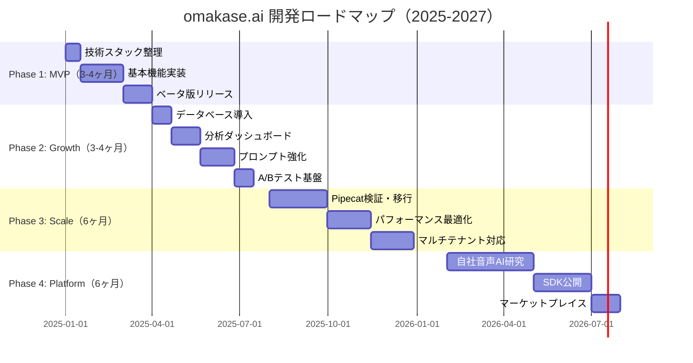
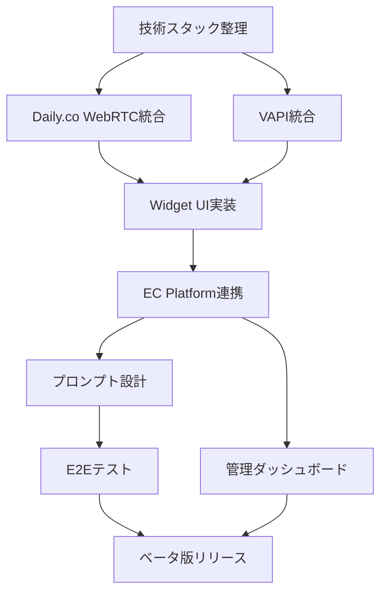
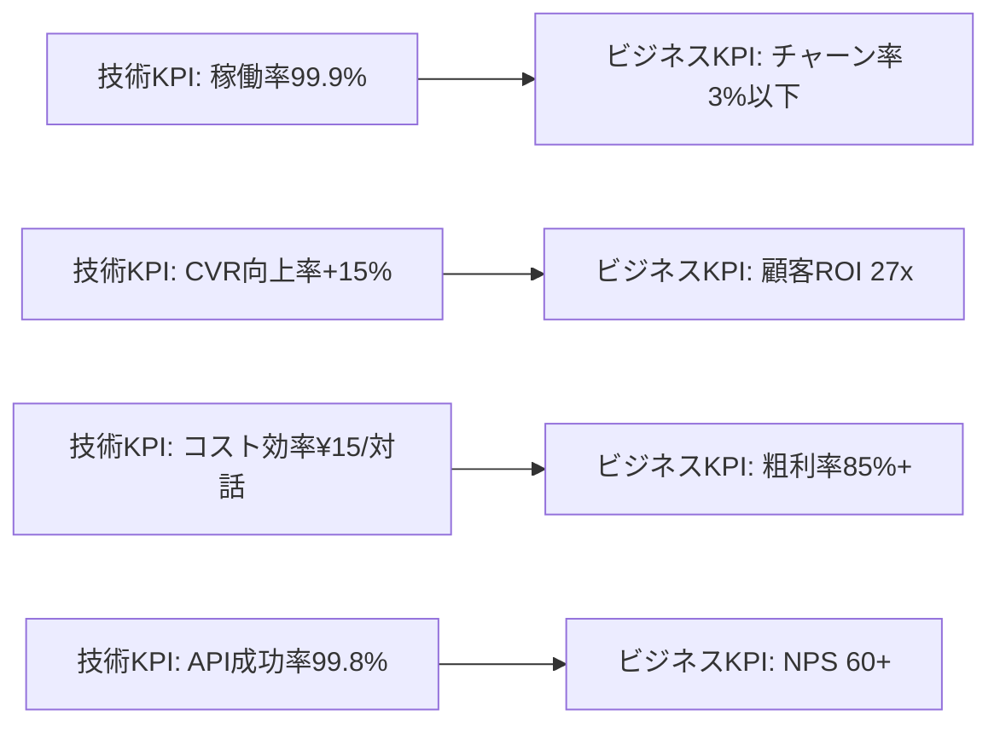

# omakase.ai 開発ロードマップ

**Version**: 1.0.0
**Date**: 2025-12-06
**Project**: omakase.ai - EC特化型音声AIショッピングアシスタント
**Prepared by**: ProductDesignAgent（詳 / Tsumabuki）

---

## 🎯 エグゼクティブサマリー

### プロダクト概要

**omakase.ai** は、EC サイト向けの音声 AI ショッピングアシスタントプラットフォームです。既存のECサイトに5分で導入でき、音声対話による商品検索・推薦・カート操作を実現します。

### 現在の技術スタック

#### 既存実装（技術レポートより）

**Presentation Layer**:
- React Widget（顧客向けUI）

**Transport Layer**:
- Daily.co WebRTC（音声通話基盤）

**AI Platform Layer**:
- VAPI（音声AIバックエンド）
  - STT: Deepgram
  - TTS: ElevenLabs
  - LLM: OpenAI GPT-4 / Anthropic Claude

**Application Layer**:
- Express.js Backend
  - 商品API、音声API、ナレッジAPI
  - データストア: In-Memory（現状）

**Authentication**:
- Clerk（ユーザー認証）

### 開発方針

1. **短期（3-6ヶ月）**: MVP完成とPMF達成
2. **中期（6-12ヶ月）**: スケール基盤構築と機能拡張
3. **長期（1-2年）**: プラットフォーム化と自社技術投資

---

## 📊 全体開発ロードマップ



---

## Phase 1: MVP 開発（3-4ヶ月）

### 目標

- **技術目標**: 安定稼働するMVP完成
- **ビジネス目標**: ベータ顧客5社獲得、PMF検証
- **品質目標**: 稼働率99.5%以上

### 実装機能

#### P0 - 必須機能

##### 1. 音声AIアシスタント（コア機能）

**機能概要**:
```
┌─────────────────────────────────────────┐
│ ユーザー（ECサイト訪問者）               │
│          ↓                              │
│   [マイクボタンクリック]                 │
│          ↓                              │
│   Daily.co WebRTC接続                   │
│          ↓                              │
│   VAPI（音声AI処理）                     │
│   ├─ Deepgram（STT: 音声→テキスト）     │
│   ├─ GPT-4/Claude（理解・推論）          │
│   └─ ElevenLabs（TTS: テキスト→音声）   │
│          ↓                              │
│   omakase.ai Backend（Express.js）      │
│   ├─ 商品検索API                        │
│   ├─ カート操作API                      │
│   └─ ナレッジベースAPI                  │
│          ↓                              │
│   EC Platform（Shopify/BASE）            │
└─────────────────────────────────────────┘
```

**実装タスク**:

| タスク | 担当 | 工数 | 優先度 |
|--------|------|------|--------|
| Daily.co WebRTC統合 | Frontend | 3日 | P0 |
| VAPI API統合 | Backend | 5日 | P0 |
| 商品検索API実装 | Backend | 5日 | P0 |
| カート操作API実装 | Backend | 7日 | P0 |
| プロンプトエンジニアリング（基本版） | AI/PM | 10日 | P0 |

**技術仕様**:

```typescript
// 音声AIセッション開始
interface VoiceSession {
  sessionId: string;
  userId: string;
  ecPlatform: 'shopify' | 'base' | 'ec-cube';
  productCatalog: Product[];
  conversationContext: ConversationContext;
}

interface ConversationContext {
  currentIntent: 'search' | 'recommend' | 'cart' | 'checkout';
  mentionedProducts: string[];
  cartItems: CartItem[];
  userPreferences: UserPreference[];
}

// 商品検索API
POST /api/voice/search
{
  "query": "赤いワンピース",
  "filters": {
    "priceRange": [5000, 15000],
    "inStock": true
  }
}

Response:
{
  "products": [
    {
      "id": "prod_123",
      "name": "エレガント赤ワンピース",
      "price": 12800,
      "imageUrl": "https://...",
      "description": "..."
    }
  ],
  "totalCount": 15
}
```

##### 2. Widget UI（React）

**機能概要**:
- ボタン表示（右下フローティング）
- チャット風UI（音声・テキスト併用）
- 商品カード表示
- カート操作ボタン

**実装タスク**:

| タスク | 担当 | 工数 | 優先度 |
|--------|------|------|--------|
| ボタンコンポーネント | Frontend | 2日 | P0 |
| チャットUIコンポーネント | Frontend | 5日 | P0 |
| 商品カードコンポーネント | Frontend | 3日 | P0 |
| レスポンシブ対応 | Frontend | 3日 | P0 |
| アクセシビリティ対応 | Frontend | 2日 | P1 |

**技術仕様**:

```typescript
// Widget初期化
<script src="https://cdn.omakase.ai/widget.js"></script>
<script>
  OmakaseAI.init({
    apiKey: 'YOUR_API_KEY',
    ecPlatform: 'shopify',
    language: 'ja',
    appearance: {
      primaryColor: '#FF6B6B',
      position: 'bottom-right',
      buttonSize: 'medium'
    }
  });
</script>

// Widget コンポーネント構成
components/
├── OmakaseButton.tsx        # フローティングボタン
├── ChatWindow.tsx           # チャットウィンドウ
├── ProductCard.tsx          # 商品カード
├── VoiceControl.tsx         # 音声コントロール（録音中表示等）
└── CartAction.tsx           # カート操作ボタン
```

##### 3. EC Platform 連携（Shopify優先）

**機能概要**:
- Shopify Storefront API統合
- 商品データ同期
- カート操作（追加、更新、削除）
- 在庫確認

**実装タスク**:

| タスク | 担当 | 工数 | 優先度 |
|--------|------|------|--------|
| Shopify API統合 | Backend | 5日 | P0 |
| 商品データ同期処理 | Backend | 3日 | P0 |
| カート操作実装 | Backend | 5日 | P0 |
| Webhook受信（在庫変動等） | Backend | 3日 | P1 |

**技術仕様**:

```typescript
// Shopify Storefront API
import { createStorefrontApiClient } from '@shopify/storefront-api-client';

const client = createStorefrontApiClient({
  storeDomain: 'https://your-store.myshopify.com',
  apiVersion: '2024-01',
  publicAccessToken: 'YOUR_PUBLIC_TOKEN'
});

// 商品取得
const products = await client.request(`
  query {
    products(first: 10, query: "赤いワンピース") {
      edges {
        node {
          id
          title
          description
          priceRange {
            minVariantPrice {
              amount
              currencyCode
            }
          }
          images(first: 1) {
            edges {
              node {
                url
              }
            }
          }
        }
      }
    }
  }
`);

// カート追加
const cartCreate = await client.request(`
  mutation {
    cartCreate(input: {
      lines: [
        {
          merchandiseId: "gid://shopify/ProductVariant/123",
          quantity: 1
        }
      ]
    }) {
      cart {
        id
        checkoutUrl
      }
    }
  }
`);
```

##### 4. 管理ダッシュボード（基本版）

**機能概要**:
- 会話ログ閲覧
- 基本的な統計（対話数、CVR等）
- API Key管理
- 設定変更

**実装タスク**:

| タスク | 担当 | 工数 | 優先度 |
|--------|------|------|--------|
| ダッシュボード画面設計 | Frontend | 3日 | P0 |
| 会話ログ表示機能 | Frontend | 5日 | P0 |
| 統計表示（基本版） | Frontend | 3日 | P0 |
| API Key管理 | Backend/Frontend | 3日 | P0 |
| 設定変更UI | Frontend | 2日 | P1 |

**技術仕様**:

```typescript
// ダッシュボード画面構成
pages/
├── Dashboard.tsx            # ダッシュボードトップ
├── ConversationLogs.tsx     # 会話ログ
├── Analytics.tsx            # 基本統計
├── Settings.tsx             # 設定
└── ApiKeys.tsx              # API Key管理

// 会話ログAPI
GET /api/dashboard/conversations?page=1&limit=20

Response:
{
  "conversations": [
    {
      "id": "conv_123",
      "userId": "user_456",
      "startedAt": "2025-01-15T10:30:00Z",
      "endedAt": "2025-01-15T10:33:45Z",
      "duration": 225,
      "messageCount": 8,
      "outcome": "cart_added", // cart_added, checkout, abandoned
      "transcript": [
        { "role": "user", "content": "赤いワンピースを探しています" },
        { "role": "assistant", "content": "かしこまりました..." }
      ]
    }
  ],
  "totalCount": 450,
  "page": 1,
  "limit": 20
}
```

##### 5. プロンプト設計（EC特化）

**機能概要**:
- 商品推薦プロンプト
- カート誘導プロンプト
- クロスセル/アップセルプロンプト
- 業種別テンプレート（3業種：ファッション、コスメ、食品）

**実装タスク**:

| タスク | 担当 | 工数 | 優先度 |
|--------|------|------|--------|
| 基本プロンプト設計 | PM/AI | 7日 | P0 |
| 業種別プロンプト（3業種） | PM/AI | 10日 | P0 |
| プロンプトテンプレート化 | Backend | 5日 | P0 |
| 動的プロンプト生成 | Backend | 5日 | P1 |

**技術仕様**:

```typescript
// プロンプトテンプレート構造
interface PromptTemplate {
  industry: 'fashion' | 'cosmetics' | 'food';
  systemPrompt: string;
  contextVariables: string[];
  examples: ConversationExample[];
}

// ファッション業種のプロンプト例
const fashionPrompt: PromptTemplate = {
  industry: 'fashion',
  systemPrompt: `
あなたは経験豊富なファッションアドバイザーです。
顧客の好みや体型、シーンに合わせた最適な商品を提案してください。

重要な指示:
1. 必ず顧客のニーズを深掘りしてから提案する
2. 商品の素材、サイズ感、コーディネート例を具体的に説明
3. 在庫がある商品のみ提案
4. カートに追加を自然に促す（押し売りしない）

商品カタログ:
{productCatalog}

顧客情報:
- 過去の購入履歴: {purchaseHistory}
- 閲覧履歴: {browsingHistory}
  `,
  contextVariables: ['productCatalog', 'purchaseHistory', 'browsingHistory'],
  examples: [
    {
      user: "デートに着ていくワンピースを探しています",
      assistant: "素敵なデートですね！どんな雰囲気のデートか教えていただけますか？例えば、レストランディナーやカジュアルなカフェデート、屋外でのピクニックなど。また、お好みのカラーはありますか？"
    }
  ]
};

// 動的プロンプト生成
function generatePrompt(
  template: PromptTemplate,
  context: {
    productCatalog: Product[];
    purchaseHistory: Order[];
    browsingHistory: Product[];
  }
): string {
  let prompt = template.systemPrompt;

  // 変数を実際のデータで置換
  prompt = prompt.replace(
    '{productCatalog}',
    JSON.stringify(context.productCatalog, null, 2)
  );
  prompt = prompt.replace(
    '{purchaseHistory}',
    JSON.stringify(context.purchaseHistory, null, 2)
  );
  prompt = prompt.replace(
    '{browsingHistory}',
    JSON.stringify(context.browsingHistory, null, 2)
  );

  return prompt;
}
```

#### P1 - 重要だが後回し可能

- BASE連携
- EC-CUBE連携
- テキストチャット機能（音声のみでスタート）

---

### 技術的依存関係



### 必要な開発リソース

| 役割 | 人数 | スキルセット | 期間 |
|------|------|------------|------|
| **Frontend Engineer** | 2名 | React, TypeScript, WebRTC | 3ヶ月 |
| **Backend Engineer** | 2名 | Node.js, Express, API設計 | 3ヶ月 |
| **Product Manager** | 1名 | EC業界知見, プロンプトエンジニアリング | 3ヶ月 |
| **QA Engineer** | 1名 | E2Eテスト, 音声テスト | 2ヶ月 |
| **Designer** | 1名（パートタイム） | UI/UX, アクセシビリティ | 2ヶ月 |

**合計**: 6-7名、3ヶ月

### マイルストーン

| Week | マイルストーン | 成果物 |
|------|--------------|--------|
| Week 2 | 技術スタック確定 | アーキテクチャ設計書 |
| Week 4 | WebRTC統合完了 | 音声通話デモ |
| Week 6 | Shopify連携完了 | 商品検索デモ |
| Week 8 | プロンプト初版完成 | 対話品質デモ |
| Week 10 | Widget UI完成 | 統合デモ |
| Week 12 | ベータ版リリース | 本番環境デプロイ |

### 技術的課題と対策

#### 課題1: VAPIへの依存度が高い

**リスク**: VAPIの障害や価格変更の影響を直接受ける

**対策**:
- Phase 2でPipecat検証を開始（中期的な移行準備）
- VAPI以外のプロバイダー（Retell等）も調査
- 抽象化レイヤーを設けて、プロバイダー切り替えを容易に

```typescript
// 抽象化レイヤー例
interface VoiceAIProvider {
  startSession(config: SessionConfig): Promise<Session>;
  sendMessage(sessionId: string, message: string): Promise<Response>;
  endSession(sessionId: string): Promise<void>;
}

class VAPIProvider implements VoiceAIProvider {
  // VAPI固有の実装
}

class PipecatProvider implements VoiceAIProvider {
  // Pipecat固有の実装（将来）
}

// 環境変数で切り替え可能
const provider: VoiceAIProvider =
  process.env.VOICE_PROVIDER === 'pipecat'
    ? new PipecatProvider()
    : new VAPIProvider();
```

#### 課題2: In-Memoryデータストアのスケーラビリティ

**リスク**: サーバー再起動でデータ消失、複数インスタンス運用不可

**対策**:
- Phase 1終了時点でPostgreSQL導入（Phase 2 Week 1-3）
- セッションデータのみRedisに移行
- データベーススキーマ設計を早期に完成

#### 課題3: 音声認識精度（日本語）

**リスク**: 日本語の音声認識精度がビジネス要件を満たさない

**対策**:
- Deepgramの日本語モデル選択を慎重に行う
- ベータ版で実測データを収集
- 必要に応じてAzure Speech Services等も検証

---

## Phase 2: Growth 機能（3-4ヶ月）

### 目標

- **技術目標**: スケール可能な基盤構築
- **ビジネス目標**: 有料顧客30社獲得
- **品質目標**: CVR向上率+15%以上を実証

### 実装機能

#### 1. データベース導入（PostgreSQL + Redis）

**目的**: データ永続化、スケーラビリティ確保

**実装タスク**:

| タスク | 担当 | 工数 | 優先度 |
|--------|------|------|--------|
| DB設計（スキーマ設計） | Backend | 5日 | P0 |
| PostgreSQL環境構築 | Backend/DevOps | 3日 | P0 |
| マイグレーション実装 | Backend | 5日 | P0 |
| Redis導入（セッション管理） | Backend | 3日 | P0 |
| In-Memory→DB移行 | Backend | 7日 | P0 |

**技術仕様**:

```sql
-- データベーススキーマ設計

-- ユーザー（EC事業者）
CREATE TABLE users (
  id UUID PRIMARY KEY DEFAULT gen_random_uuid(),
  email VARCHAR(255) UNIQUE NOT NULL,
  company_name VARCHAR(255),
  ec_platform VARCHAR(50), -- 'shopify', 'base', 'ec-cube'
  api_key VARCHAR(255) UNIQUE,
  created_at TIMESTAMP DEFAULT NOW(),
  updated_at TIMESTAMP DEFAULT NOW()
);

-- 会話セッション
CREATE TABLE conversation_sessions (
  id UUID PRIMARY KEY DEFAULT gen_random_uuid(),
  user_id UUID REFERENCES users(id),
  shopper_id VARCHAR(255), -- ECサイト訪問者ID（匿名可）
  started_at TIMESTAMP DEFAULT NOW(),
  ended_at TIMESTAMP,
  duration_seconds INTEGER,
  message_count INTEGER,
  outcome VARCHAR(50), -- 'cart_added', 'checkout', 'abandoned'
  created_at TIMESTAMP DEFAULT NOW()
);

-- 会話メッセージ
CREATE TABLE conversation_messages (
  id UUID PRIMARY KEY DEFAULT gen_random_uuid(),
  session_id UUID REFERENCES conversation_sessions(id),
  role VARCHAR(20), -- 'user', 'assistant'
  content TEXT,
  timestamp TIMESTAMP DEFAULT NOW(),
  metadata JSONB -- 音声認識スコア、レスポンス時間等
);

-- 商品推薦ログ
CREATE TABLE product_recommendations (
  id UUID PRIMARY KEY DEFAULT gen_random_uuid(),
  session_id UUID REFERENCES conversation_sessions(id),
  product_id VARCHAR(255),
  product_name VARCHAR(255),
  price DECIMAL(10, 2),
  recommended_at TIMESTAMP DEFAULT NOW(),
  clicked BOOLEAN DEFAULT FALSE,
  added_to_cart BOOLEAN DEFAULT FALSE
);

-- カート操作ログ
CREATE TABLE cart_actions (
  id UUID PRIMARY KEY DEFAULT gen_random_uuid(),
  session_id UUID REFERENCES conversation_sessions(id),
  action VARCHAR(50), -- 'add', 'update', 'remove'
  product_id VARCHAR(255),
  quantity INTEGER,
  timestamp TIMESTAMP DEFAULT NOW()
);

-- インデックス
CREATE INDEX idx_sessions_user_id ON conversation_sessions(user_id);
CREATE INDEX idx_sessions_started_at ON conversation_sessions(started_at);
CREATE INDEX idx_messages_session_id ON conversation_messages(session_id);
CREATE INDEX idx_recommendations_session_id ON product_recommendations(session_id);
```

**Redis活用**:

```typescript
// セッション管理（Redis）
import Redis from 'ioredis';

const redis = new Redis({
  host: process.env.REDIS_HOST,
  port: 6379
});

// セッション保存（有効期限30分）
await redis.setex(
  `session:${sessionId}`,
  1800, // 30分
  JSON.stringify({
    userId,
    shopperId,
    conversationContext,
    lastActivity: Date.now()
  })
);

// セッション取得
const sessionData = await redis.get(`session:${sessionId}`);
```

#### 2. 分析ダッシュボード強化

**目的**: CVR分析、会話分析、コンバージョン追跡

**実装機能**:
- CVR分析（音声あり vs なし）
- 会話品質スコア
- 推薦商品のクリック率
- ファネル分析（対話開始→商品推薦→カート追加→購入）

**実装タスク**:

| タスク | 担当 | 工数 | 優先度 |
|--------|------|------|--------|
| CVR分析機能 | Backend | 5日 | P0 |
| 会話品質スコアリング | Backend/AI | 7日 | P0 |
| ファネル分析実装 | Backend | 5日 | P0 |
| ダッシュボードUI実装 | Frontend | 10日 | P0 |

**技術仕様**:

```typescript
// CVR分析API
GET /api/dashboard/analytics/cvr?startDate=2025-01-01&endDate=2025-01-31

Response:
{
  "withVoice": {
    "sessions": 1500,
    "conversions": 78,
    "cvrRate": 5.2 // %
  },
  "withoutVoice": {
    "sessions": 8500,
    "conversions": 255,
    "cvrRate": 3.0 // %
  },
  "improvement": 73.3 // %
}

// 会話品質スコア
interface ConversationQualityScore {
  sessionId: string;
  scores: {
    relevance: number; // 関連性（0-100）
    responsiveness: number; // 応答速度（0-100）
    engagement: number; // エンゲージメント（0-100）
    satisfaction: number; // 満足度（0-100、アンケート）
  };
  overallScore: number; // 総合スコア（0-100）
}

// ファネル分析
GET /api/dashboard/analytics/funnel?startDate=2025-01-01

Response:
{
  "funnel": [
    { "stage": "対話開始", "count": 1500, "conversionRate": 100 },
    { "stage": "商品推薦", "count": 1350, "conversionRate": 90 },
    { "stage": "カート追加", "count": 450, "conversionRate": 33.3 },
    { "stage": "購入完了", "count": 78, "conversionRate": 17.3 }
  ]
}
```

#### 3. プロンプト強化（業種別テンプレート拡充）

**目的**: CVR向上、業種カバレッジ拡大

**実装内容**:
- 業種別テンプレート追加（3業種→10業種）
  - アパレル、コスメ、食品、雑貨、家電、スポーツ、書籍、家具、ペット用品、健康食品
- クロスセル/アップセルプロンプト
- リテンション（再購入促進）プロンプト

**実装タスク**:

| タスク | 担当 | 工数 | 優先度 |
|--------|------|------|--------|
| 業種別プロンプト追加（7業種） | PM/AI | 14日 | P0 |
| クロスセルプロンプト設計 | PM/AI | 5日 | P0 |
| アップセルプロンプト設計 | PM/AI | 5日 | P0 |
| プロンプトバージョン管理 | Backend | 3日 | P1 |

#### 4. A/Bテスト基盤

**目的**: プロンプト、声、フローの最適化

**実装機能**:
- プロンプトA/Bテスト
- 音声（TTS）A/Bテスト
- 会話フローA/Bテスト

**実装タスク**:

| タスク | 担当 | 工数 | 優先度 |
|--------|------|------|--------|
| A/Bテストフレームワーク実装 | Backend | 7日 | P0 |
| バリアント管理UI | Frontend | 5日 | P0 |
| 統計的有意性判定 | Backend | 3日 | P0 |

**技術仕様**:

```typescript
// A/Bテスト設定
interface ABTest {
  id: string;
  name: string;
  type: 'prompt' | 'voice' | 'flow';
  variants: Variant[];
  trafficAllocation: number[]; // [50, 50] = 50%ずつ
  startDate: Date;
  endDate?: Date;
  status: 'draft' | 'running' | 'completed';
  winnerVariantId?: string;
}

interface Variant {
  id: string;
  name: string;
  config: any; // プロンプト、音声設定、フロー定義等
  metrics: {
    sessions: number;
    conversions: number;
    cvr: number;
    avgEngagement: number;
  };
}

// バリアント割り当て（セッション開始時）
function assignVariant(testId: string, userId: string): Variant {
  const test = getABTest(testId);
  const hash = murmurhash(userId + testId);
  const bucket = hash % 100;

  let cumulative = 0;
  for (let i = 0; i < test.variants.length; i++) {
    cumulative += test.trafficAllocation[i];
    if (bucket < cumulative) {
      return test.variants[i];
    }
  }

  return test.variants[0]; // デフォルト
}

// 統計的有意性判定（カイ二乗検定）
function calculateStatisticalSignificance(
  variantA: Variant,
  variantB: Variant
): { pValue: number; significant: boolean } {
  // カイ二乗検定実装
  // p < 0.05 で統計的に有意
}
```

---

### インフラ計画（Phase 2）

#### 現状（推定）

```
┌─────────────────────────────────────────┐
│ Vercel/Netlify（Frontend）               │
│  - Widget JavaScript                    │
│  - 管理ダッシュボード                     │
└─────────────────────────────────────────┘
                 ↓
┌─────────────────────────────────────────┐
│ Heroku/Railway（Backend）                │
│  - Express.js API                       │
│  - In-Memory データストア                │
└─────────────────────────────────────────┘
                 ↓
┌─────────────────────────────────────────┐
│ VAPI（外部サービス）                      │
│  - Daily.co WebRTC                      │
│  - Deepgram STT                         │
│  - ElevenLabs TTS                       │
│  - OpenAI/Claude LLM                    │
└─────────────────────────────────────────┘
```

**月額コスト（推定）**: ¥50,000-100,000

#### Phase 2 移行後

```
┌─────────────────────────────────────────┐
│ Vercel Pro（Frontend）                   │
│  - Widget CDN配信                        │
│  - 管理ダッシュボード                     │
│  月額コスト: $20                         │
└─────────────────────────────────────────┘
                 ↓
┌─────────────────────────────────────────┐
│ AWS ECS Fargate（Backend）               │
│  - Express.js API（2 tasks）             │
│  - Auto Scaling（CPU 70%でスケール）      │
│  月額コスト: ¥30,000                     │
└─────────────────────────────────────────┘
                 ↓
┌─────────────────────────────────────────┐
│ AWS RDS PostgreSQL（db.t3.micro）        │
│  - マルチAZ: 無効（Phase 2）              │
│  - ストレージ: 50GB                      │
│  月額コスト: ¥15,000                     │
└─────────────────────────────────────────┘
                 ↓
┌─────────────────────────────────────────┐
│ AWS ElastiCache Redis                   │
│  - cache.t3.micro                       │
│  月額コスト: ¥10,000                     │
└─────────────────────────────────────────┘
                 ↓
┌─────────────────────────────────────────┐
│ VAPI（従量課金）                          │
│  - 通話時間: 月10,000分想定               │
│  月額コスト: ¥150,000                    │
└─────────────────────────────────────────┘
```

**月額コスト合計**: 約¥210,000（顧客30社想定）

### コスト試算（Phase 2）

| カテゴリ | 項目 | 月額コスト | 備考 |
|---------|------|-----------|------|
| **インフラ** | Vercel Pro | ¥3,000 | CDN配信 |
| | AWS ECS Fargate | ¥30,000 | Backend API |
| | AWS RDS PostgreSQL | ¥15,000 | データベース |
| | AWS ElastiCache Redis | ¥10,000 | セッション管理 |
| | AWS S3/CloudFront | ¥5,000 | ストレージ・CDN |
| **AI API** | VAPI（通話時間） | ¥150,000 | 10,000分想定 |
| **その他** | 監視・ログ（Datadog等） | ¥20,000 | |
| | 決済（Stripe） | ¥10,000 | 売上の3.6% |
| **合計** | | **¥243,000/月** | |

**顧客単価**: ¥50,000/月 × 30社 = ¥1,500,000/月
**粗利**: ¥1,500,000 - ¥243,000 = **¥1,257,000/月**
**粗利率**: 83.8%

---

## Phase 3: Scale 機能（6ヶ月）

### 目標

- **技術目標**: 月間100万対話に耐えるスケーラビリティ
- **ビジネス目標**: 有料顧客150社獲得
- **品質目標**: 稼働率99.9%以上

### 実装機能

#### 1. Pipecat 検証・移行（VAPI依存度軽減）

**目的**: コスト削減、カスタマイズ性向上

**Pipecat とは**:
- Pythonベースのオープンソース音声AIフレームワーク
- Daily.co WebRTC、各種STT/TTS/LLMに対応
- VAPIと同等機能を自社で構築可能

**検証項目**:

| 項目 | VAPI | Pipecat | 判定基準 |
|------|------|---------|---------|
| 初期開発コスト | 低（APIのみ） | 高（実装必要） | 投資回収期間 |
| ランニングコスト | 高（¥15/分） | 低（API直接課金） | コスト50%削減可能か |
| カスタマイズ性 | 低 | 高 | 独自機能実装可能か |
| 保守コスト | 低 | 中（自社保守） | エンジニアリソース確保可能か |
| 音声品質 | 高 | 同等 | 品質劣化しないか |

**実装タスク**:

| タスク | 担当 | 工数 | 優先度 |
|--------|------|------|--------|
| Pipecat PoC実装 | Backend | 10日 | P0 |
| コスト比較分析 | PM/Backend | 3日 | P0 |
| 音声品質テスト | QA | 5日 | P0 |
| 移行判断 | 経営陣/PM | 2日 | P0 |
| 本番移行（採用時） | Backend | 20日 | P0 |

**技術仕様（Pipecat実装例）**:

```python
# Pipecat実装例
from pipecat import Pipeline, DailyTransport
from pipecat.audio import DeepgramSTT, ElevenLabsTTS
from pipecat.llm import OpenAILLM

# パイプライン構築
pipeline = Pipeline([
    DailyTransport(
        room_url="https://example.daily.co/room",
        token="YOUR_DAILY_TOKEN"
    ),
    DeepgramSTT(
        api_key=os.environ["DEEPGRAM_API_KEY"],
        language="ja"
    ),
    OpenAILLM(
        api_key=os.environ["OPENAI_API_KEY"],
        model="gpt-4-turbo",
        system_prompt=get_prompt_template()
    ),
    ElevenLabsTTS(
        api_key=os.environ["ELEVENLABS_API_KEY"],
        voice_id="japanese_female_01"
    )
])

# セッション開始
await pipeline.start()
```

**コスト比較**:

| 項目 | VAPI | Pipecat（自社実装） | 差分 |
|------|------|-------------------|------|
| **通話時間** | 月100,000分 | 月100,000分 | - |
| **VAPI料金** | ¥1,500,000 | ¥0 | -¥1,500,000 |
| **Deepgram STT** | 含む | ¥100,000 | +¥100,000 |
| **ElevenLabs TTS** | 含む | ¥200,000 | +¥200,000 |
| **OpenAI API** | 含む | ¥300,000 | +¥300,000 |
| **Daily.co** | 含む | ¥100,000 | +¥100,000 |
| **サーバーコスト** | 含む | ¥50,000 | +¥50,000 |
| **開発・保守** | ¥0 | ¥200,000/月 | +¥200,000 |
| **合計** | **¥1,500,000** | **¥950,000** | **-¥550,000（-37%）** |

**移行判断基準**:
- コスト削減 > 30%
- 音声品質の維持
- 移行期間 < 3ヶ月
- エンジニアリソース確保可能

#### 2. パフォーマンス最適化

**目的**: レスポンス速度向上、コスト削減

**実装内容**:
- LLMレスポンスキャッシング
- 商品データのキャッシュ戦略
- CDN最適化
- データベースクエリ最適化

**実装タスク**:

| タスク | 担当 | 工数 | 優先度 |
|--------|------|------|--------|
| LLMキャッシング実装 | Backend | 7日 | P0 |
| 商品データキャッシュ | Backend | 5日 | P0 |
| DBクエリ最適化 | Backend | 5日 | P0 |
| CDN設定最適化 | DevOps | 3日 | P1 |

**技術仕様**:

```typescript
// LLMレスポンスキャッシング
import { Redis } from 'ioredis';

const redis = new Redis();

async function getChatCompletion(
  prompt: string,
  context: ConversationContext
): Promise<string> {
  // キャッシュキー生成（プロンプト+コンテキストのハッシュ）
  const cacheKey = `llm:${hash(prompt + JSON.stringify(context))}`;

  // キャッシュヒット確認
  const cached = await redis.get(cacheKey);
  if (cached) {
    console.log('Cache HIT');
    return cached;
  }

  // LLM API呼び出し
  const response = await openai.chat.completions.create({
    model: 'gpt-4-turbo',
    messages: [
      { role: 'system', content: prompt },
      ...context.messages
    ]
  });

  const content = response.choices[0].message.content;

  // キャッシュ保存（有効期限1時間）
  await redis.setex(cacheKey, 3600, content);

  return content;
}

// 商品データキャッシュ（Redis）
async function getProductCatalog(userId: string): Promise<Product[]> {
  const cacheKey = `products:${userId}`;

  const cached = await redis.get(cacheKey);
  if (cached) {
    return JSON.parse(cached);
  }

  // Shopify APIから取得
  const products = await fetchProductsFromShopify(userId);

  // 10分間キャッシュ
  await redis.setex(cacheKey, 600, JSON.stringify(products));

  return products;
}
```

#### 3. マルチテナント対応

**目的**: 顧客ごとのデータ分離、セキュリティ強化

**実装内容**:
- テナント分離（Row-Level Security）
- API Key管理強化
- 権限管理（RBAC）

**実装タスク**:

| タスク | 担当 | 工数 | 優先度 |
|--------|------|------|--------|
| RLS実装（PostgreSQL） | Backend | 7日 | P0 |
| API Key暗号化 | Backend | 3日 | P0 |
| RBAC実装 | Backend | 5日 | P1 |

**技術仕様**:

```sql
-- Row-Level Security（PostgreSQL）
ALTER TABLE conversation_sessions ENABLE ROW LEVEL SECURITY;

CREATE POLICY tenant_isolation ON conversation_sessions
  USING (user_id = current_setting('app.current_user_id')::UUID);

-- セッション開始時にテナントIDを設定
SET app.current_user_id = 'user_123';
```

---

### インフラ計画（Phase 3）

#### スケール後のインフラ構成

```
┌─────────────────────────────────────────┐
│ Cloudflare CDN（グローバル）              │
│  - Widget配信                           │
│  - DDoS対策                             │
│  月額コスト: ¥20,000                     │
└─────────────────────────────────────────┘
                 ↓
┌─────────────────────────────────────────┐
│ AWS ALB（Application Load Balancer）     │
│  - HTTPS終端                            │
│  - ヘルスチェック                         │
│  月額コスト: ¥15,000                     │
└─────────────────────────────────────────┘
                 ↓
┌─────────────────────────────────────────┐
│ AWS ECS Fargate（Auto Scaling）          │
│  - Backend API（4-10 tasks）             │
│  - CPU 70%でスケールアウト                │
│  月額コスト: ¥100,000                    │
└─────────────────────────────────────────┘
                 ↓
┌─────────────────────────────────────────┐
│ AWS RDS PostgreSQL（db.r5.large）        │
│  - マルチAZ: 有効                        │
│  - ストレージ: 500GB                     │
│  - Read Replica: 1台                    │
│  月額コスト: ¥80,000                     │
└─────────────────────────────────────────┘
                 ↓
┌─────────────────────────────────────────┐
│ AWS ElastiCache Redis（Cluster Mode）    │
│  - cache.r5.large × 3ノード              │
│  月額コスト: ¥60,000                     │
└─────────────────────────────────────────┘
                 ↓
┌─────────────────────────────────────────┐
│ Pipecat（自社実装）or VAPI                │
│  - 月間100,000分                         │
│  月額コスト: ¥950,000（Pipecat）          │
│            or ¥1,500,000（VAPI）         │
└─────────────────────────────────────────┘
```

**月額コスト合計**: 約¥1,225,000（顧客150社想定、Pipecat採用時）

### コスト試算（Phase 3）

| カテゴリ | 項目 | 月額コスト | 備考 |
|---------|------|-----------|------|
| **インフラ** | Cloudflare | ¥20,000 | CDN・DDoS対策 |
| | AWS ALB | ¥15,000 | ロードバランサー |
| | AWS ECS Fargate | ¥100,000 | Backend API（4-10 tasks） |
| | AWS RDS PostgreSQL | ¥80,000 | db.r5.large + Read Replica |
| | AWS ElastiCache Redis | ¥60,000 | cache.r5.large × 3 |
| | AWS S3/CloudFront | ¥20,000 | ストレージ・CDN |
| **AI API** | Pipecat（Deepgram, ElevenLabs, OpenAI） | ¥950,000 | 100,000分想定 |
| **その他** | 監視・ログ（Datadog） | ¥50,000 | |
| | 決済（Stripe） | ¥30,000 | 売上の3.6% |
| **合計** | | **¥1,325,000/月** | |

**顧客単価**: ¥60,000/月 × 150社 = ¥9,000,000/月
**粗利**: ¥9,000,000 - ¥1,325,000 = **¥7,675,000/月**
**粗利率**: 85.3%

---

## Phase 4: Platform 化（6ヶ月）

### 目標

- **技術目標**: SDK公開、マーケットプレイス構築
- **ビジネス目標**: エコシステム構築、収益多様化
- **品質目標**: API稼働率99.99%

### 実装機能

#### 1. 自社音声AI研究（Fine-tuned モデル）

**目的**: VAPI/Pipecatへの依存度をさらに軽減、差別化強化

**研究項目**:
- EC特化LLMのFine-tuning
- 日本語音声認識モデルのカスタマイズ
- 独自TTS（音声合成）の検討

**実装タスク**:

| タスク | 担当 | 工数 | 優先度 |
|--------|------|------|--------|
| データセット準備（会話ログ） | AI | 20日 | P0 |
| LLM Fine-tuning実験 | AI | 30日 | P0 |
| STTカスタマイズ検証 | AI | 20日 | P1 |
| 評価・ベンチマーク | AI | 10日 | P0 |

**技術仕様**:

```python
# EC特化LLM Fine-tuning（OpenAI GPT-4-turbo）
import openai

# データセット準備
training_data = [
    {
        "messages": [
            {"role": "system", "content": "あなたはファッションアドバイザーです..."},
            {"role": "user", "content": "デートに着ていくワンピースを探しています"},
            {"role": "assistant", "content": "素敵なデートですね！..."}
        ]
    },
    # 10,000件以上の会話ログから生成
]

# Fine-tuning実行
fine_tuned_model = openai.FineTuning.create(
    training_file=upload_training_data(training_data),
    model="gpt-4-turbo",
    hyperparameters={
        "n_epochs": 3,
        "batch_size": 8
    }
)

# 評価
test_results = evaluate_model(fine_tuned_model, test_data)
print(f"Accuracy: {test_results['accuracy']}")
print(f"Relevance Score: {test_results['relevance']}")
```

#### 2. SDK公開

**目的**: サードパーティ開発者向けにAPI公開

**実装内容**:
- REST API公開
- JavaScript SDK
- Python SDK
- ドキュメント整備

**実装タスク**:

| タスク | 担当 | 工数 | 優先度 |
|--------|------|------|--------|
| REST API設計 | Backend | 10日 | P0 |
| JavaScript SDK実装 | Frontend | 15日 | P0 |
| Python SDK実装 | Backend | 15日 | P1 |
| API ドキュメント作成 | PM | 10日 | P0 |
| 認証・レート制限 | Backend | 7日 | P0 |

**技術仕様**:

```typescript
// JavaScript SDK
import OmakaseAI from '@omakase-ai/sdk';

const client = new OmakaseAI({
  apiKey: 'YOUR_API_KEY'
});

// セッション開始
const session = await client.sessions.create({
  userId: 'user_123',
  ecPlatform: 'shopify',
  productCatalog: products
});

// メッセージ送信
const response = await client.sessions.sendMessage(session.id, {
  type: 'text',
  content: '赤いワンピースを探しています'
});

console.log(response.message); // AI応答
console.log(response.recommendations); // 推薦商品
```

#### 3. マーケットプレイス

**目的**: プロンプトテンプレート、カスタム機能の販売

**実装内容**:
- プロンプトマーケットプレイス
- カスタム機能販売（クロスセル、アップセル等）
- 収益分配システム

**実装タスク**:

| タスク | 担当 | 工数 | 優先度 |
|--------|------|------|--------|
| マーケットプレイスUI | Frontend | 20日 | P0 |
| 決済システム統合 | Backend | 10日 | P0 |
| 収益分配システム | Backend | 10日 | P0 |
| 審査フロー | Backend | 7日 | P1 |

---

## 📊 KPI 連動

### 技術 KPI

| Phase | KPI | 目標値 | ビジネス影響 |
|-------|-----|-------|------------|
| **Phase 1** | 稼働率 | 99.5% | 顧客満足度 |
| | レスポンス時間（平均） | < 3秒 | CVR向上 |
| | 音声認識精度 | 95%+ | 顧客体験 |
| **Phase 2** | 稼働率 | 99.7% | チャーン率低下 |
| | CVR向上率 | +15%+ | 顧客価値提供 |
| | API成功率 | 99.8% | 信頼性 |
| **Phase 3** | 稼働率 | 99.9% | Enterprise顧客獲得 |
| | スケーラビリティ | 月100万対話 | 成長制約解除 |
| | コスト効率 | 対話あたり¥15以下 | 利益率向上 |
| **Phase 4** | 稼働率 | 99.99% | SLA保証 |
| | API レート制限 | 1,000 req/min | SDK採用促進 |
| | カスタムモデル精度 | +10% | 差別化強化 |

### ビジネス KPI との関連



---

## 🚀 まとめ

### 各フェーズの成功条件

#### Phase 1: MVP

✅ **技術的成功**:
- ベータ版が安定稼働（稼働率99.5%）
- 音声認識精度95%以上
- Shopify連携が正常動作

✅ **ビジネス的成功**:
- ベータ顧客5社獲得
- CVR向上率+15%を実証
- NPS 50以上

#### Phase 2: Growth

✅ **技術的成功**:
- データベース移行完了
- 分析ダッシュボード稼働
- A/Bテスト基盤完成

✅ **ビジネス的成功**:
- 有料顧客30社獲得
- MRR ¥1,500,000達成
- LTV/CAC > 3.0

#### Phase 3: Scale

✅ **技術的成功**:
- Pipecat移行完了（採用時）
- 稼働率99.9%達成
- 月間100万対話に耐える

✅ **ビジネス的成功**:
- 有料顧客150社獲得
- MRR ¥9,000,000達成
- 損益分岐点突破

#### Phase 4: Platform

✅ **技術的成功**:
- SDK公開、API稼働率99.99%
- 自社LLMモデル精度+10%
- マーケットプレイス稼働

✅ **ビジネス的成功**:
- エコシステム構築
- 収益多様化
- 年商18億円達成

---

## 📋 Next Steps（直近1ヶ月）

### Week 1-2: Phase 1 準備

- [ ] 技術スタック最終確定
- [ ] アーキテクチャ設計書作成
- [ ] 開発環境セットアップ
- [ ] Daily.co, VAPI アカウント開設
- [ ] Shopify開発者アカウント取得

### Week 3-4: 開発開始

- [ ] Daily.co WebRTC統合開始
- [ ] VAPI API統合開始
- [ ] Widget UI基本実装
- [ ] Shopify API統合開始

---

**Document Version**: 1.0.0
**Last Updated**: 2025-12-06
**Owner**: ProductDesignAgent（詳 / Tsumabuki）

---

> 📣 **詳（つまぶき）より**:
> 「この開発ロードマップは、既存の技術スタック（VAPI, Daily.co, Express.js）を活かしつつ、段階的にスケールし、最終的に自社技術で差別化を図る実行可能な計画です。Phase 1のMVP完成が最重要マイルストーンです。技術的負債を最小化しながら、ビジネス成長と並走できる設計になっています。一緒に素晴らしいプロダクトを作りましょう！」

**技術とビジネスの両立を実現する、堅実で野心的なロードマップです！** 🚀
