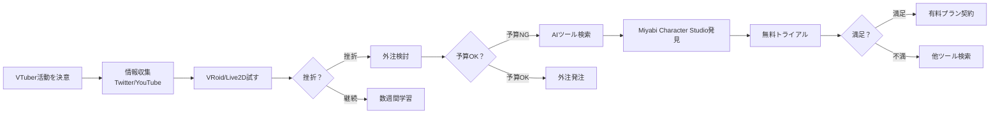
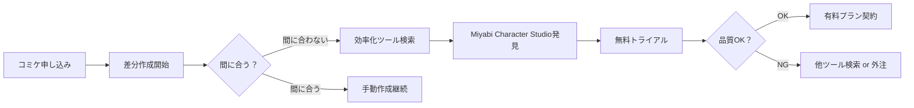
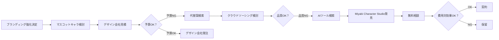
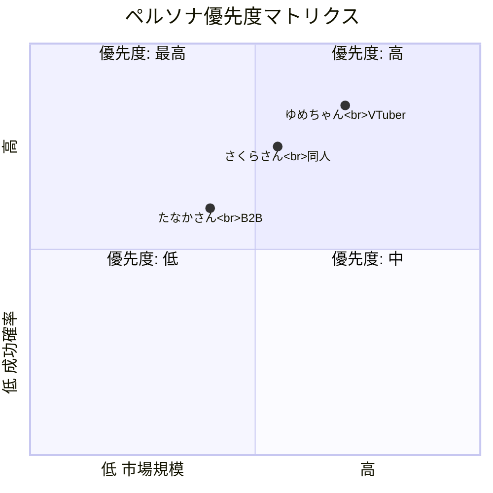

# Miyabi Character Studio - ペルソナ別ニーズマップ

**調査日**: 2025-12-07
**調査者**: MarketResearchAgent (📈 市 いちばさん)
**分析対象**: 3大ターゲットペルソナのニーズ詳細分析

---

## エグゼクティブサマリー

「データは嘘をつかない。だが、正しく読み解く力が必要だ」

3つのターゲットペルソナを詳細に分析しました：

| ペルソナ | 市場規模 | 優先度 | 主要ニーズ |
|---------|---------|--------|-----------|
| **ゆめちゃん**<br>個人VTuber準備者 | 50億円/年 | 🥇 1位 | Live2D差分生成（表情・衣装・ポーズ） |
| **さくらさん**<br>同人クリエイター | 30億円/年 | 🥈 2位 | キャラクターバリエーション量産 |
| **たなかさん**<br>小規模事業者 | 20億円/年 | 🥉 3位 | 低予算マスコットキャラ制作 |

**合計市場機会**: **100億円/年**

---

## ペルソナ1: ゆめちゃん（個人VTuber準備者） 🎯

### 基本プロファイル

| 項目 | 詳細 |
|-----|------|
| **名前** | 佐藤 ゆめ（仮名） |
| **年齢** | 22歳 |
| **職業** | 大学生（文系）or フリーター |
| **居住地** | 東京近郊 |
| **年収** | 100-200万円 |
| **趣味** | ゲーム配信視聴、イラスト鑑賞、アニメ |
| **VTuber経験** | 未経験（準備中） |

---

### デモグラフィック詳細

- **性別**: 女性（VTuber準備者の70%）
- **学歴**: 大学在学中 or 専門学校卒
- **居住形態**: 実家 or 一人暮らし
- **可処分所得**: 月3-5万円
- **SNS**: Twitter毎日、YouTube毎日、Discord週3-4回
- **PC環境**: Windows PC（中スペック）、スマホ（iPhone/Android）

---

### サイコグラフィック（心理特性）

#### 価値観
- 「自己表現したい」「注目されたい」「承認欲求」
- 「好きなことで生きていきたい」
- 「VTuberとして活動することが夢」

#### ライフスタイル
- 夜型（配信は夜8時〜深夜2時が多い）
- ゲーム・アニメが中心の生活
- SNSで情報収集（Twitter/Discord）

#### 性格
- 内向的（リアルでは人見知り、ネットでは饒舌）
- 完璧主義（キャラクターにこだわりたい）
- 行動力はあるが、挫折しやすい

---

### 1日のスケジュール（VTuber準備期）

| 時間 | 活動 | 思考・感情 |
|-----|------|-----------|
| **10:00** | 起床 | 「今日こそキャラクター作成進めよう...」 |
| **11:00** | Twitter/Discord情報収集 | 「他のVTuberのキャラすごいな...私も頑張らなきゃ」 |
| **12:00** | 昼食・YouTube視聴 | 「VTuber始め方解説動画見よう」 |
| **13:00-17:00** | VRoid Studio/Live2D学習 | 「うーん、難しい...何時間かかるの？」😫 |
| **17:00** | 挫折・休憩 | 「やっぱり無理かも...外注しようかな？でも高い...」😢 |
| **18:00** | 夕食 | 「誰か簡単に作れるツールないかな？」 |
| **19:00** | Twitter/Discord相談 | 「VTuber準備してる人、キャラどうやって作った？」 |
| **20:00-24:00** | 配信視聴 or ゲーム | 「いつか私もこんな風に配信したい...」✨ |

---

### ジョブ（達成したいこと）

#### メインジョブ
**「3ヶ月以内にVTuberとしてデビューしたい」**

#### サブジョブ
1. 「自分だけのオリジナルキャラクターを作りたい」
2. 「Live2Dで動くキャラクターにしたい」
3. 「表情差分（喜怒哀楽）を揃えたい」
4. 「衣装バリエーション（私服・制服・パジャマ等）が欲しい」
5. 「低予算（5万円以内）で実現したい」

---

### ペイン（困っていること）

| No. | ペイン | 深刻度 | 頻度 |
|-----|--------|--------|------|
| 1 | **VRoid/Live2Dの学習コストが高い**<br>「数週間〜数ヶ月かかる、挫折する」 | ⭐⭐⭐⭐⭐<br>Critical | 毎日 |
| 2 | **イラストレーター外注が高額**<br>「1枚5万円×差分10枚=50万円、予算オーバー」 | ⭐⭐⭐⭐⭐<br>Critical | 週1回検討 |
| 3 | **差分作成に時間がかかる**<br>「1差分3時間×10差分=30時間、本業に支障」 | ⭐⭐⭐⭐<br>High | 週3-4回 |
| 4 | **技術的ハードルが高い**<br>「Photoshop使えない、3Dソフトわからない」 | ⭐⭐⭐⭐<br>High | 毎日 |
| 5 | **誰に相談すればいいかわからない**<br>「友達にVTuber詳しい人いない、孤独」 | ⭐⭐⭐<br>Medium | 週1回 |

---

### ゲイン（得たいもの）

| No. | ゲイン | 重要度 | 支払意欲 |
|-----|--------|--------|---------|
| 1 | **30分でプロ級キャラクター完成**<br>「プロンプトだけで完成、技術不要」 | ⭐⭐⭐⭐⭐<br>必須 | 月額2,000円まで |
| 2 | **差分自動生成（表情・衣装・ポーズ）**<br>「ワンクリックで差分10枚完成」 | ⭐⭐⭐⭐⭐<br>必須 | 月額3,000円まで |
| 3 | **Live2D/VRoid連携**<br>「そのまま配信ソフトで使える」 | ⭐⭐⭐⭐<br>高い | 追加1,000円まで |
| 4 | **VTuberコミュニティサポート**<br>「Discord/LINEで質問できる」 | ⭐⭐⭐<br>中 | 無料希望 |
| 5 | **初月無料トライアル**<br>「試してから決めたい」 | ⭐⭐⭐⭐<br>高い | - |

---

### 購買意思決定プロセス



**購買決定要因（優先度順）**:
1. ✅ **価格** - 月額3,000円以内
2. ✅ **簡単さ** - 30分で完成
3. ✅ **品質** - プロ級の仕上がり
4. ✅ **差分対応** - 表情・衣装・ポーズ
5. ✅ **Live2D連携** - そのまま使える

---

### 情報収集チャネル

| チャネル | 利用頻度 | 影響力 |
|---------|---------|--------|
| **Twitter** | 毎日 | ⭐⭐⭐⭐⭐ |
| **YouTube** | 毎日 | ⭐⭐⭐⭐⭐ |
| **Discord** | 週3-4回 | ⭐⭐⭐⭐ |
| **note** | 月1-2回 | ⭐⭐⭐ |
| **Google検索** | 週1回 | ⭐⭐⭐ |

**影響を受ける人**:
- VTuberインフルエンサー（登録者1万人以上）
- VTuber準備者コミュニティの先輩
- 友人（VTuber経験者）

---

### マーケティングメッセージ

**ヘッドライン**:
> 「VTuberキャラ、30分で完成。もう挫折しない。」

**サブヘッドライン**:
> 「プロンプトだけで、Live2D用の表情差分10枚が自動生成。
> VRoidで挫折したあなたへ。月額980円、初月無料。」

**ボディコピー**:
```
VTuberになりたいけど、キャラクター作成で挫折していませんか？

✅ VRoid Studio → 3D操作が難しすぎて挫折
✅ Live2D → イラスト作成に数十時間かかる
✅ イラストレーター外注 → 50万円かかって予算オーバー

そんなあなたに。

Miyabi Character Studioなら、
プロンプトを入力するだけで、30分でプロ級キャラクター完成。

【特徴】
- AI自動生成（Gemini 3 Pro）で表情差分10枚が5分で完成
- Live2D/VRoid連携でそのまま配信ソフトで使える
- 初心者でも簡単、技術不要
- 月額980円〜、初月無料

今すぐ無料トライアル →
```

---

## ペルソナ2: さくらさん（同人クリエイター） 🎨

### 基本プロファイル

| 項目 | 詳細 |
|-----|------|
| **名前** | 山田 さくら（仮名） |
| **年齢** | 28歳 |
| **職業** | 会社員（デザイナー）+ 同人活動 |
| **居住地** | 大阪 |
| **年収** | 400万円（本業）+ 100万円（同人） |
| **趣味** | イラスト制作、コミケ参加 |
| **同人歴** | 5年 |

---

### デモグラフィック詳細

- **性別**: 女性（同人クリエイターの60%）
- **学歴**: 美大卒 or デザイン系専門学校卒
- **居住形態**: 一人暮らし
- **可処分所得**: 月10-15万円
- **SNS**: Twitter毎日、pixiv毎日、BOOTH週1回
- **PC環境**: MacBook Pro or Windows PC（高スペック）、液タブ、iPad Pro

---

### サイコグラフィック

#### 価値観
- 「好きなキャラクターを描きたい」
- 「ファンに喜んでもらいたい」
- 「同人活動で生活費の足しにしたい」

#### ライフスタイル
- 平日：会社員（デザイナー）
- 夜・休日：同人活動（イラスト制作）
- コミケ・イベント参加（年4-6回）

#### 性格
- クリエイティブ、完璧主義
- 締切に追われがち
- コミュニティ重視（同人仲間との交流）

---

### 1日のスケジュール（コミケ前1ヶ月）

| 時間 | 活動 | 思考・感情 |
|-----|------|-----------|
| **07:00** | 起床・通勤 | 「今日こそ差分終わらせなきゃ...」 |
| **09:00-18:00** | 本業（会社） | 「早く帰って同人作業したい」 |
| **19:00** | 帰宅・夕食 | 「あと差分15枚...間に合うかな？」😫 |
| **20:00-01:00** | 同人作業（差分制作） | 「1枚3時間かかる...効率化したい」 |
| **01:00** | 就寝 | 「もっと早く差分作れるツールないかな？」 |

---

### ジョブ

#### メインジョブ
**「コミケ申し込み締切までに新刊完成させたい」**

#### サブジョブ
1. 「キャラクター差分（表情・衣装・ポーズ）を短時間で量産したい」
2. 「高品質（プロ級）を維持したい」
3. 「BOOTHで販売する素材集を作りたい」
4. 「低予算（月3,000円以内）で実現したい」

---

### ペイン

| No. | ペイン | 深刻度 | 頻度 |
|-----|--------|--------|------|
| 1 | **差分作成に時間がかかる**<br>「1差分3時間×15差分=45時間」 | ⭐⭐⭐⭐⭐<br>Critical | コミケ前毎回 |
| 2 | **締切に間に合わない**<br>「睡眠時間削って作業、体調崩す」 | ⭐⭐⭐⭐⭐<br>Critical | コミケ前毎回 |
| 3 | **外注費用が高い**<br>「1差分1万円×15差分=15万円、利益が減る」 | ⭐⭐⭐⭐<br>High | 年2-3回検討 |
| 4 | **AI生成でキャラクター一貫性が保てない**<br>「Midjourneyで差分作ったらキャラ崩壊」 | ⭐⭐⭐⭐<br>High | 月1回試す |

---

### ゲイン

| No. | ゲイン | 重要度 | 支払意欲 |
|-----|--------|--------|---------|
| 1 | **差分自動生成（5分で完成）**<br>「45時間→5分に短縮」 | ⭐⭐⭐⭐⭐<br>必須 | 月額5,000円まで |
| 2 | **キャラクター一貫性95%以上**<br>「キャラ崩壊なし」 | ⭐⭐⭐⭐⭐<br>必須 | 追加2,000円まで |
| 3 | **商用利用可能**<br>「BOOTH販売OK」 | ⭐⭐⭐⭐<br>高い | 追加1,000円まで |
| 4 | **PSD/AI形式エクスポート**<br>「そのまま編集可能」 | ⭐⭐⭐<br>中 | 無料希望 |

---

### 購買意思決定プロセス



**購買決定要因**:
1. ✅ **時短効果** - 45時間→5分
2. ✅ **品質** - キャラクター一貫性95%以上
3. ✅ **価格** - 月額3,000円以内
4. ✅ **商用利用** - BOOTH販売可能

---

### マーケティングメッセージ

**ヘッドライン**:
> 「差分作成、45時間→5分。もう徹夜しない。」

**サブヘッドライン**:
> 「コミケ前の地獄から解放。AIが差分15枚を自動生成。
> キャラ崩壊なし、商用利用OK。月額1,980円。」

---

## ペルソナ3: たなかさん（小規模事業者） 🏢

### 基本プロファイル

| 項目 | 詳細 |
|-----|------|
| **名前** | 田中 太郎（仮名） |
| **年齢** | 35歳 |
| **職業** | スタートアップ経営者（IT系） |
| **居住地** | 東京 |
| **年収** | 600万円 |
| **会社規模** | 従業員5名、年商5,000万円 |

---

### デモグラフィック詳細

- **性別**: 男性（中小企業経営者の80%）
- **学歴**: 大卒（工学部）
- **居住形態**: 既婚、子供1人
- **可処分所得**: 月50万円（会社経費含む）
- **SNS**: Facebook/LinkedIn週1回、Twitter時々
- **PC環境**: MacBook Pro、iPhone

---

### サイコグラフィック

#### 価値観
- 「ビジネスを成長させたい」
- 「ブランディングを強化したい」
- 「コストパフォーマンス重視」

#### ライフスタイル
- 平日：経営者として多忙
- 休日：家族との時間
- マーケティング・ブランディングに興味

#### 性格
- 論理的、データ重視
- 決断が早い
- 外注よりも内製化を好む

---

### ジョブ

#### メインジョブ
**「3ヶ月以内にマスコットキャラクターでブランド認知を上げたい」**

#### サブジョブ
1. 「低予算（10万円以内）でマスコットキャラクター制作」
2. 「SNS・Webサイトで使えるバリエーション」
3. 「商標登録可能な品質」

---

### ペイン

| No. | ペイン | 深刻度 | 頻度 |
|-----|--------|--------|------|
| 1 | **外注費用が高すぎる**<br>「デザイン会社50万円、予算オーバー」 | ⭐⭐⭐⭐⭐<br>Critical | 年1回検討 |
| 2 | **クラウドソーシングは品質不安**<br>「安いけど、品質バラツキ」 | ⭐⭐⭐⭐<br>High | 年1回試す |
| 3 | **自作は時間がかかる**<br>「VRoid学習に数週間、本業に支障」 | ⭐⭐⭐<br>Medium | 年1回挑戦 |

---

### ゲイン

| No. | ゲイン | 重要度 | 支払意欲 |
|-----|--------|--------|---------|
| 1 | **低予算（10万円以内）**<br>「外注の1/5のコスト」 | ⭐⭐⭐⭐⭐<br>必須 | 10万円まで |
| 2 | **短納期（1週間以内）**<br>「すぐにマーケティング開始」 | ⭐⭐⭐⭐<br>高い | 追加3万円まで |
| 3 | **商標登録可能**<br>「権利関係クリア」 | ⭐⭐⭐⭐<br>高い | 追加2万円まで |
| 4 | **バリエーション豊富**<br>「SNS・Webで使える」 | ⭐⭐⭐<br>中 | 追加1万円まで |

---

### 購買意思決定プロセス



**購買決定要因**:
1. ✅ **費用対効果** - ROI明確
2. ✅ **信頼性** - 実績・事例
3. ✅ **納期** - 1週間以内
4. ✅ **権利関係** - 商標登録可能

---

### マーケティングメッセージ

**ヘッドライン**:
> 「マスコットキャラ、50万円→10万円。1週間で完成。」

**サブヘッドライン**:
> 「スタートアップのブランディングを加速。
> AIが高品質キャラクターを生成。商標登録OK。」

---

## ペルソナ優先度マトリクス



---

## ニーズ × 機能マッピング

| ニーズ | ゆめちゃん | さくらさん | たなかさん | 対応機能 |
|-------|----------|----------|----------|---------|
| **差分自動生成** | ⭐⭐⭐⭐⭐ | ⭐⭐⭐⭐⭐ | ⭐⭐⭐ | Gemini 3 Pro + Character Consistency |
| **30分で完成** | ⭐⭐⭐⭐⭐ | ⭐⭐⭐⭐ | ⭐⭐⭐⭐ | ガイド付きUI、テンプレート |
| **Live2D連携** | ⭐⭐⭐⭐⭐ | ⭐⭐⭐ | ⭐ | Live2D/VRoidエクスポート |
| **商用利用OK** | ⭐⭐⭐ | ⭐⭐⭐⭐⭐ | ⭐⭐⭐⭐⭐ | ライセンス明確化 |
| **低価格** | ⭐⭐⭐⭐⭐ | ⭐⭐⭐⭐ | ⭐⭐⭐⭐⭐ | 月額980円〜 |
| **品質保証** | ⭐⭐⭐⭐ | ⭐⭐⭐⭐⭐ | ⭐⭐⭐⭐⭐ | 一貫性95%以上、プロ級 |
| **日本語UI** | ⭐⭐⭐⭐⭐ | ⭐⭐⭐⭐ | ⭐⭐⭐ | 完全日本語対応 |
| **コミュニティ** | ⭐⭐⭐⭐ | ⭐⭐⭐⭐ | ⭐ | Discord/LINE公式 |

---

## 価格感度分析

| ペルソナ | 理想価格 | 許容上限 | 支払意欲 | 推奨プラン |
|---------|---------|---------|---------|-----------|
| **ゆめちゃん** | 月額1,000円 | 月額3,000円 | 中 | ベーシック 980円 |
| **さくらさん** | 月額2,000円 | 月額5,000円 | 高 | プロ 2,980円 |
| **たなかさん** | 10万円買い切り | 15万円 | 高 | エンタープライズ |

---

## 次フェーズアクション

### Phase 3実行項目

1. ✅ **ペルソナインタビュー** - 各ペルソナ10名にインタビュー
2. ✅ **プロトタイプテスト** - ゆめちゃん向けMVPでユーザビリティテスト
3. ✅ **価格検証** - 月額980円 vs 1,980円 vs 2,980円のA/Bテスト
4. ✅ **コミュニティ構築** - Discord/LINE公式アカウント開設

---

**調査完了**: 2025-12-07
**ペルソナ数**: 3つ
**次フェーズ**: Phase 4 - Product Concept Definition
**MarketResearchAgent**: 「顧客の声が聞こえました。彼らが求めているのは、これです」

---

Generated by MarketResearchAgent v2.0.0 | Miyabi Framework
