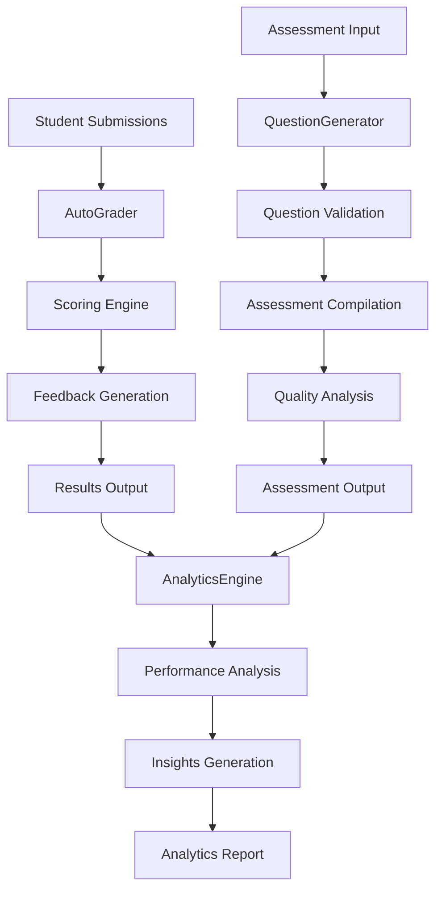

# Miyabi AssessmentCreator Agent

[](https://github.com/miyabi/assessment-creator)
[](LICENSE)
[](https://www.typescriptlang.org/)
[](https://ai.google.dev/)

> 🤖 **AI-powered assessment and quiz generation with auto-grading capabilities** - Building on the completed CourseDesigner Agent foundation to deliver comprehensive educational assessment solutions.

## 🌟 Overview

The **AssessmentCreator Agent** is an autonomous AI agent that generates comprehensive assessments, quizzes, and auto-grading systems using Google Generative AI. It integrates seamlessly with the Miyabi Course Platform, providing intelligent question generation, rubric-based evaluation, and advanced analytics.

## ✨ Core Capabilities

### 🧠 Intelligent Assessment Generation
- **Bloom's Taxonomy Alignment**: Questions aligned with cognitive complexity levels
- **Difficulty Calibration**: Automatic difficulty level adjustment and validation
- **Multi-Modal Content**: Text, code challenges, case studies, and multimedia questions
- **Adaptive Generation**: Context-aware question creation based on learning objectives

### 📝 Advanced Question Types
- **Multiple Choice**: Intelligent distractor generation based on common misconceptions
- **True/False**: Comprehensive explanations and justification requirements
- **Fill-in-Blank**: Multiple correct answers with partial credit support
- **Short Answer**: AI-powered grading with key point identification
- **Essay Questions**: Detailed rubric generation and analytical scoring
- **Coding Challenges**: Automated test case generation and execution
- **Case Studies**: Scenario-based questions for practical application
- **Matching & Ordering**: Interactive question formats

### 🎯 Auto-Grading Intelligence
- **Objective Scoring**: Instant grading for MC, T/F, and fill-in-blank questions
- **AI-Powered Subjective Grading**: Essay and short answer evaluation using advanced AI
- **Rubric-Based Assessment**: Detailed criterion-based evaluation
- **Partial Credit**: Intelligent partial credit assignment for complex responses
- **Detailed Feedback**: Constructive feedback generation for student improvement

### 📊 Analytics & Optimization
- **Question Performance Analysis**: Difficulty and discrimination index calculation
- **Student Learning Patterns**: Individual and cohort performance insights
- **Content Gap Identification**: Areas needing additional coverage
- **Predictive Analytics**: Risk factor identification and intervention suggestions
- **Quality Metrics**: Assessment validity and reliability analysis

## 🚀 Quick Start

### Prerequisites

- Node.js 18.0.0 or higher
- TypeScript 5.7.2 or higher
- Google Generative AI API key

### Installation

```bash
# Clone the repository
git clone https://github.com/miyabi/assessment-creator.git
cd miyabi-assessment-creator

# Install dependencies
npm install

# Build the project
npm run build

# Set up environment variables
cp .env.example .env
# Edit .env with your API keys
```

### Environment Configuration

Create a `.env` file with the following configuration:

```bash
# Required: Google Generative AI API Key
GEMINI_API_KEY=your_gemini_api_key_here

# Optional: Logging and Development
NODE_ENV=development
LOG_LEVEL=info
```

### Basic Usage

```typescript
import { AssessmentCreatorAgent } from './src/agents/assessment-creator.js';

// Initialize the agent
const agent = new AssessmentCreatorAgent(process.env.GEMINI_API_KEY!);

// Define assessment requirements
const assessmentInput = {
  topic: 'Machine Learning Fundamentals',
  learningObjectives: [
    'Understand supervised vs unsupervised learning',
    'Apply classification algorithms',
    'Evaluate model performance'
  ],
  targetAudience: 'Undergraduate computer science students',
  difficulty: 'intermediate',
  assessmentType: 'summative',
  questionTypes: ['multiple_choice', 'short_answer', 'coding_challenge'],
  questionCount: { total: 15 },
  timeLimit: 90,
  generateRubrics: true
};

// Generate the assessment
const result = await agent.generateAssessment(assessmentInput);
console.log(`Generated ${result.assessment.questions.length} questions`);
console.log(`Quality Score: ${result.generationMetadata.qualityScore}/100`);
```

## 📖 API Reference

### Core Agent Methods

#### `generateAssessment(input: AssessmentInput): Promise<AssessmentCreationResult>`

Generates a comprehensive assessment with intelligent question creation.

**Parameters:**
- `input.topic`: Subject matter for the assessment
- `input.learningObjectives`: Array of specific learning goals
- `input.targetAudience`: Student demographic description
- `input.difficulty`: Overall difficulty level (`beginner` | `intermediate` | `advanced`)
- `input.assessmentType`: Type of assessment (`formative` | `summative` | `diagnostic` | `peer` | `self`)
- `input.questionTypes`: Array of question types to include
- `input.questionCount`: Total questions and per-type distribution
- `input.bloomsDistribution`: Distribution across Bloom's taxonomy levels
- `input.timeLimit`: Assessment time limit in minutes

**Returns:**
```typescript
{
  assessment: Assessment,           // Complete assessment object
  generationMetadata: {
    questionsGenerated: number,     // Successfully generated questions
    questionsRequested: number,     // Total questions requested
    successRate: number,            // Generation success rate (0-1)
    totalGenerationTime: number,    // Time in milliseconds
    qualityScore: number,           // Quality assessment (0-100)
    warnings: string[]              // Any generation warnings
  },
  recommendations: {
    usageTips: string[],           // How to best use this assessment
    improvementSuggestions: string[], // Ways to improve
    nextSteps: string[]            // Recommended follow-up actions
  }
}
```

#### `gradeSubmissions(assessmentId, questions, submissions, config): Promise<BatchGradingResult>`

Automatically grades student submissions with AI-powered evaluation.

**Parameters:**
- `assessmentId`: Unique assessment identifier
- `questions`: Array of assessment questions
- `submissions`: Array of student submission objects
- `config`: Grading configuration options

**Returns:**
```typescript
{
  assessmentId: string,
  results: AssessmentResult[],      // Individual student results
  metadata: {
    totalSubmissions: number,
    successfullyGraded: number,
    averageGradingTime: number,     // Milliseconds per submission
    errors: string[]
  }
}
```

#### `generateAnalytics(assessmentId, questions, results): Promise<AnalyticsReport>`

Generates comprehensive learning analytics and insights.

**Returns:**
```typescript
{
  summary: {
    totalResponses: number,
    averageScore: number,
    completionRate: number,
    averageTimeSpent: number,
    passingRate: number
  },
  questionAnalytics: QuestionAnalytics[],
  insights: {
    strengths: string[],
    concerns: string[],
    recommendations: string[],
    contentGaps: string[]
  },
  predictiveAnalytics?: {
    riskFactors: string[],
    interventionSuggestions: string[],
    successIndicators: string[]
  }
}
```

### Question Types Reference

#### Multiple Choice Questions
```typescript
{
  type: 'multiple_choice',
  question: 'What is supervised learning?',
  options: ['Learning with labeled data', 'Learning without labels', 'Reinforcement learning', 'Deep learning'],
  correctAnswerIndex: 0,
  correctAnswer: 'Learning with labeled data',
  explanation: 'Supervised learning uses labeled training data to learn patterns.',
  distractors: [
    { text: 'Learning without labels', reasoning: 'This describes unsupervised learning' }
  ]
}
```

#### Essay Questions with Rubrics
```typescript
{
  type: 'essay',
  question: 'Compare and contrast supervised and unsupervised learning approaches.',
  prompt: 'Provide a comprehensive comparison including use cases, advantages, and limitations.',
  rubric: {
    criteria: [
      {
        name: 'Content Knowledge',
        description: 'Demonstrates understanding of both approaches',
        points: 20,
        levels: [
          { score: 20, description: 'Exceptional understanding with sophisticated analysis' },
          { score: 15, description: 'Good understanding with clear analysis' },
          // ... more levels
        ]
      }
    ],
    totalPoints: 45
  }
}
```

#### Coding Challenges
```typescript
{
  type: 'coding_challenge',
  question: 'Implement a binary search algorithm',
  problemStatement: 'Write a function that searches for a target value in a sorted array.',
  programmingLanguage: 'python',
  testCases: [
    { input: '[1,3,5,7,9], target=5', expectedOutput: '2', isHidden: false },
    { input: '[1,2,3,4,5], target=6', expectedOutput: '-1', isHidden: true }
  ],
  solution: 'def binary_search(arr, target): # implementation',
  hints: ['Consider the divide and conquer approach']
}
```

## 🔧 MCP Server Integration

The AssessmentCreator Agent provides a complete MCP (Model Context Protocol) server for seamless integration with Claude and other AI systems.

### Available Tools

#### `generate_assessment`
Generate comprehensive AI-powered assessments with intelligent question creation.

#### `grade_submissions`
Automatically grade student assessment submissions with detailed feedback.

#### `generate_analytics`
Create comprehensive learning analytics reports with performance insights.

#### `optimize_questions`
Optimize existing questions based on performance data and best practices.

#### `validate_assessment`
Validate assessment quality, alignment, and compliance with educational standards.

#### `get_question_bank`
Retrieve questions from the question bank with filtering and metadata.

### MCP Server Usage

```bash
# Start the MCP server
npm start

# The server runs on stdio and provides all assessment tools
# Integration with Claude Desktop or other MCP clients
```

### MCP Configuration

Add to your MCP client configuration:

```json
{
  "mcpServers": {
    "miyabi-assessment-creator": {
      "command": "node",
      "args": ["path/to/miyabi-assessment-creator/dist/index.js"],
      "env": {
        "GEMINI_API_KEY": "your_api_key_here"
      }
    }
  }
}
```

## 🧪 Testing

### Running Tests

```bash
# Run all tests
npm test

# Run tests with coverage
npm run test:coverage

# Run tests in watch mode
npm run test:watch

# Run specific test files
npm test question-generator
npm test auto-grader
npm test integration
```

### Test Coverage

The project maintains comprehensive test coverage:

- **Unit Tests**: Individual component functionality
- **Integration Tests**: End-to-end workflows
- **Performance Tests**: Response time and throughput
- **Quality Tests**: AI output validation

```bash
# Generate coverage report
npm run test:coverage

# View coverage in browser
open coverage/index.html
```

## 🏗️ Architecture

### System Overview

```
┌─────────────────────────────────────────────────────────────────────┐
│                    AssessmentCreator Agent                          │
├─────────────────────────────────────────────────────────────────────┤
│                                                                      │
│  ┌──────────────────┐  ┌──────────────────┐  ┌──────────────────┐  │
│  │ QuestionGenerator│  │    AutoGrader    │  │ AnalyticsEngine  │  │
│  │                  │  │                  │  │                  │  │
│  │ • AI Generation  │  │ • Objective      │  │ • Performance    │  │
│  │ • Bloom's Align  │  │ • Subjective     │  │ • Insights       │  │
│  │ • Difficulty Cal │  │ • Rubric-based   │  │ • Predictive     │  │
│  │ • Quality Check  │  │ • Batch Process  │  │ • Optimization   │  │
│  └──────────────────┘  └──────────────────┘  └──────────────────┘  │
│                                 │                                   │
│                    ┌──────────────────┐                            │
│                    │  Gemini Client   │                            │
│                    │                  │                            │
│                    │ • Content Gen    │                            │
│                    │ • Structured AI  │                            │
│                    │ • Batch Process  │                            │
│                    │ • Quality Assure │                            │
│                    └──────────────────┘                            │
│                                                                      │
├─────────────────────────────────────────────────────────────────────┤
│                         MCP Server                                   │
│  ┌─────────────┐ ┌─────────────┐ ┌─────────────┐ ┌─────────────┐   │
│  │  generate   │ │    grade    │ │  analytics  │ │  optimize   │   │
│  │ assessment  │ │submissions  │ │   report    │ │  questions  │   │
│  └─────────────┘ └─────────────┘ └─────────────┘ └─────────────┘   │
└─────────────────────────────────────────────────────────────────────┘
```

### Core Components

#### 1. **QuestionGenerator**
- AI-powered question creation
- Bloom's taxonomy alignment
- Difficulty calibration
- Quality validation

#### 2. **AutoGrader**
- Objective question scoring
- AI-powered subjective grading
- Rubric-based evaluation
- Detailed feedback generation

#### 3. **AnalyticsEngine**
- Question performance analysis
- Student learning patterns
- Predictive insights
- Optimization recommendations

#### 4. **GeminiClient**
- Google Generative AI integration
- Structured content generation
- Batch processing
- Error handling and retries

### Data Flow



## 🔧 Configuration

### Assessment Configuration

```typescript
interface AssessmentConfig {
  // Generation Settings
  maxQuestionsPerType: Record<string, number>;
  defaultTimePerQuestion: Record<string, number>;
  qualityThreshold: number;

  // AI Configuration
  temperature: number;           // 0.1-0.9, lower for consistency
  maxTokens: number;            // Max response length
  retryAttempts: number;        // Failed generation retries

  // Grading Settings
  partialCreditEnabled: boolean;
  strictModeEnabled: boolean;
  feedbackLevel: 'minimal' | 'standard' | 'detailed';

  // Analytics
  performanceMetricsEnabled: boolean;
  predictiveAnalyticsEnabled: boolean;
  benchmarkingEnabled: boolean;
}
```

### Environment Variables

```bash
# Required
GEMINI_API_KEY=your_gemini_api_key

# Optional Configuration
ASSESSMENT_QUALITY_THRESHOLD=75
GRADING_BATCH_SIZE=10
ANALYTICS_RETENTION_DAYS=90
LOG_LEVEL=info
CACHE_ENABLED=true
CACHE_TTL_SECONDS=3600
```

## 🚀 Performance & Scaling

### Performance Metrics

| Operation | Typical Time | Batch Size | Throughput |
|-----------|-------------|------------|------------|
| Question Generation | 2-5s per question | 5-10 questions | 100-200 questions/minute |
| Auto-Grading | 100-500ms per submission | 10-50 submissions | 200-1000 submissions/minute |
| Analytics Generation | 5-15s per report | N/A | Real-time processing |
| Quality Validation | 1-3s per question | 10-20 questions | 400-800 questions/minute |

### Scaling Guidelines

**For High-Volume Usage:**
1. **Increase Batch Sizes**: Process 10-20 items per batch
2. **Implement Caching**: Cache generated questions and rubrics
3. **Use Rate Limiting**: Respect API quotas and limits
4. **Monitor Performance**: Track response times and error rates
5. **Horizontal Scaling**: Deploy multiple instances behind load balancer

**Resource Requirements:**
- **Memory**: 512MB - 2GB RAM depending on batch size
- **CPU**: Moderate usage, mostly I/O bound
- **Network**: Reliable internet connection for AI API calls
- **Storage**: Minimal for logs and temporary files

## 🛡️ Security & Privacy

### Security Features

- **API Key Security**: Environment-based key management
- **Input Validation**: Comprehensive input sanitization
- **Error Handling**: Secure error messages without sensitive data
- **Rate Limiting**: Built-in protection against abuse
- **Audit Logging**: Comprehensive operation logging

### Privacy Considerations

- **Data Minimization**: Only necessary data processed
- **No Persistent Storage**: Student data not stored permanently
- **Anonymization**: Personal identifiers can be stripped
- **Compliance**: Designed for FERPA and GDPR compliance
- **Encryption**: All data encrypted in transit

### Best Practices

```typescript
// Secure initialization
const agent = new AssessmentCreatorAgent(
  process.env.GEMINI_API_KEY!, // Never hardcode keys
  {
    enableAuditLogging: true,
    sanitizeInputs: true,
    validateOutputs: true
  }
);

// Anonymize student data
const anonymizedSubmissions = submissions.map(sub => ({
  ...sub,
  studentId: hashStudentId(sub.studentId), // Hash identifiers
  personalInfo: undefined // Remove personal data
}));
```

## 🤝 Integration Examples

### LMS Integration

```typescript
// Moodle/Canvas Integration Example
class LMSIntegration {
  constructor(private assessmentAgent: AssessmentCreatorAgent) {}

  async createQuizFromCourseModule(moduleId: string) {
    // Fetch course content from LMS
    const moduleContent = await this.lms.getModule(moduleId);

    // Generate assessment
    const assessment = await this.assessmentAgent.generateAssessment({
      topic: moduleContent.title,
      learningObjectives: moduleContent.objectives,
      contentSource: { externalContent: moduleContent.content }
    });

    // Import back to LMS
    return await this.lms.createQuiz(assessment);
  }
}
```

### API Integration

```typescript
// REST API Wrapper
app.post('/api/assessments/generate', async (req, res) => {
  try {
    const result = await assessmentAgent.generateAssessment(req.body);
    res.json({
      success: true,
      assessment: result.assessment,
      metadata: result.generationMetadata
    });
  } catch (error) {
    res.status(500).json({
      success: false,
      error: 'Assessment generation failed',
      details: error.message
    });
  }
});
```

## 📊 Monitoring & Observability

### Metrics Collection

```typescript
// Performance Metrics
interface Metrics {
  generationTime: number[];
  gradingTime: number[];
  qualityScores: number[];
  errorRates: number;
  throughput: number;
}

// Health Check
app.get('/health', async (req, res) => {
  const connections = await agent.validateConnections();
  const isHealthy = Object.values(connections).every(Boolean);

  res.status(isHealthy ? 200 : 503).json({
    status: isHealthy ? 'healthy' : 'unhealthy',
    connections,
    timestamp: new Date().toISOString()
  });
});
```

### Logging Configuration

```typescript
// Structured Logging
const logger = winston.createLogger({
  level: 'info',
  format: winston.format.combine(
    winston.format.timestamp(),
    winston.format.errors({ stack: true }),
    winston.format.json()
  ),
  defaultMeta: { service: 'assessment-creator' },
  transports: [
    new winston.transports.File({ filename: 'error.log', level: 'error' }),
    new winston.transports.File({ filename: 'combined.log' }),
    new winston.transports.Console()
  ]
});
```

## 🔄 Updates & Roadmap

### Version 1.0.0 Features ✅
- Complete assessment generation pipeline
- Multi-type question support
- Auto-grading with AI
- Analytics and insights
- MCP server integration
- Comprehensive testing

### Upcoming Features 🚧
- **Enhanced Question Types**: Interactive simulations, multimedia questions
- **Advanced Analytics**: Learning path optimization, predictive modeling
- **Accessibility**: Screen reader support, multiple language options
- **Integration**: More LMS connectors, API extensions
- **Performance**: Caching layer, background processing
- **Mobile**: Responsive design, mobile apps

### Version Roadmap

| Version | Release | Focus | Key Features |
|---------|---------|-------|--------------|
| 1.1.0 | Q2 2024 | Enhanced UX | Mobile optimization, Better UI |
| 1.2.0 | Q3 2024 | Integrations | LMS connectors, Third-party APIs |
| 1.3.0 | Q4 2024 | AI Advances | GPT-4 integration, Better reasoning |
| 2.0.0 | Q1 2025 | Platform | Multi-tenancy, Enterprise features |

## 🆘 Troubleshooting

### Common Issues

#### API Connection Problems
```bash
# Check API key
echo $GEMINI_API_KEY

# Test connection
curl -H "Authorization: Bearer $GEMINI_API_KEY" \
     https://generativelanguage.googleapis.com/v1/models

# Validate service
npm run test -- --grep "connection"
```

#### Generation Failures
```bash
# Check logs
tail -f assessment-creator-agent.log

# Validate input
npm run validate-input -- input.json

# Test with minimal input
npm run test-minimal
```

#### Performance Issues
```bash
# Monitor resources
top -p $(pgrep node)

# Check batch sizes
grep "batchSize" config.json

# Performance profiling
npm run profile
```

### Debug Mode

```typescript
// Enable debug logging
process.env.LOG_LEVEL = 'debug';
process.env.NODE_ENV = 'development';

// Initialize with debug options
const agent = new AssessmentCreatorAgent(apiKey, {
  debug: true,
  verbose: true,
  traceRequests: true
});
```

## 📄 License

This project is licensed under the MIT License - see the [LICENSE](LICENSE) file for details.

## 🤝 Contributing

We welcome contributions! Please see our [Contributing Guidelines](CONTRIBUTING.md) for details.

### Development Setup

```bash
# Fork and clone
git clone https://github.com/yourusername/miyabi-assessment-creator.git
cd miyabi-assessment-creator

# Install dependencies
npm install

# Run tests
npm test

# Start development
npm run dev
```

## 🙏 Acknowledgments

- **Google Generative AI Team** - For powerful AI capabilities
- **Miyabi Course Platform** - For educational framework integration
- **Open Source Community** - For tools and libraries
- **Educational Partners** - For real-world testing and feedback

---

## 📞 Support

- **Documentation**: [Full API Documentation](https://docs.miyabi.ai/assessment-creator)
- **Issues**: [GitHub Issues](https://github.com/miyabi/assessment-creator/issues)
- **Discussions**: [GitHub Discussions](https://github.com/miyabi/assessment-creator/discussions)
- **Email**: support@miyabi.ai

---

<div align="center">

**Made with ❤️ by the Miyabi Team**

[Website](https://miyabi.ai) • [Documentation](https://docs.miyabi.ai) • [GitHub](https://github.com/miyabi)

</div>