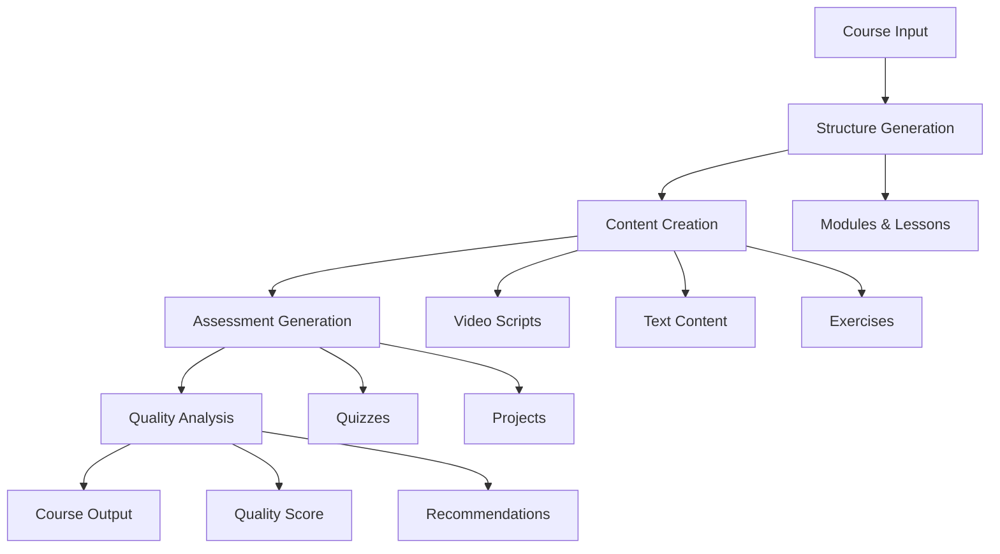

# Miyabi CourseDesigner Agent

**AI-powered comprehensive course content generation using Google Generative AI**

The CourseDesigner Agent is an autonomous AI agent that creates complete educational courses from simple topic inputs, leveraging advanced prompt engineering and Google's Generative AI to produce high-quality, engaging, and educational content.

## 🎯 Features

### Core Capabilities

- **🏗️ Intelligent Course Structure Generation**
  - Automatically creates logical course outlines with modules and lessons
  - Generates learning objectives aligned with target audience
  - Optimizes lesson sequencing and pacing

- **📝 Multi-Modal Content Creation**
  - Text content with proper formatting and structure
  - Video script outlines with visual cues and timing
  - Interactive exercises and practice activities
  - Discussion prompts and collaborative activities

- **📊 Assessment Integration**
  - Comprehensive quiz generation with multiple question types
  - Assignment and project templates with rubrics
  - Peer review activities and self-assessments
  - Automated feedback templates

- **🔄 Adaptive Content Optimization**
  - Content quality analysis and scoring
  - Engagement optimization recommendations
  - Learning path suggestions
  - Accessibility compliance validation

### Advanced Features

- **🌐 Multi-language Support** - Content generation in multiple languages
- **♿ Accessibility Compliance** - WCAG 2.1 compatible content generation
- **📦 SCORM Compatibility** - Ready for LMS integration
- **📈 Learning Analytics** - Built-in progress tracking and analytics
- **🎨 Customizable Templates** - Flexible prompt templates for different content types

## 🚀 Quick Start

### Prerequisites

- Node.js 18+
- Google Generative AI API key
- TypeScript development environment

### Installation

1. **Install dependencies:**
```bash
cd mcp-servers/miyabi-course-designer
npm install
```

2. **Set up environment variables:**
```bash
export GEMINI_API_KEY="your-google-generative-ai-api-key"
```

3. **Build the project:**
```bash
npm run build
```

4. **Run tests:**
```bash
npm test
```

5. **Start the MCP server:**
```bash
npm start
```

## 📖 Usage

### MCP Tool Integration

The CourseDesigner Agent provides four main MCP tools:

#### 1. `generate_course`
Generate a complete course from specifications:

```json
{
  "topic": "Introduction to Machine Learning",
  "targetAudience": "Software developers with Python experience",
  "difficulty": "intermediate",
  "duration": {
    "weeks": 8,
    "hoursPerWeek": 4
  },
  "learningObjectives": [
    "Understand ML fundamentals",
    "Implement basic ML algorithms",
    "Deploy ML models to production"
  ],
  "format": {
    "includeVideos": true,
    "includeAssessments": true,
    "includeProjects": true,
    "includeDiscussions": false
  },
  "preferences": {
    "language": "en",
    "tone": "conversational",
    "interactivity": "high"
  }
}
```

#### 2. `get_generation_progress`
Monitor course generation progress:

```json
{}
```

Returns real-time progress with step details and time estimates.

#### 3. `validate_api_connection`
Check Google Generative AI connectivity:

```json
{}
```

#### 4. `get_agent_info`
Get agent capabilities and configuration:

```json
{}
```

### Direct API Usage

```typescript
import { CourseDesignerAgent } from './agents/course-designer.js';

const agent = new CourseDesignerAgent('your-api-key');

const courseInput = {
  topic: 'Web Development Fundamentals',
  targetAudience: 'Complete beginners',
  difficulty: 'beginner',
  duration: { weeks: 6, hoursPerWeek: 3 }
};

const course = await agent.generateCourse(courseInput);
console.log('Generated course:', course.courseStructure.title);
```

## 🏗️ Architecture

### System Components

```
CourseDesigner Agent
├── 🧠 GeminiClient          # Google Generative AI integration
├── 📝 PromptTemplates       # Educational content prompts
├── 🏗️ CourseDesignerAgent   # Main orchestration logic
├── 🔌 MCP Server           # Tool interface
└── 🧪 Test Suite          # Comprehensive testing
```

### Generation Pipeline



### Content Types

- **📚 Course Structure**: Modules, lessons, learning objectives
- **🎬 Video Scripts**: Detailed scripts with timing and visual cues
- **📖 Text Content**: Formatted lesson content with proper structure
- **🏃 Exercises**: Practice activities, projects, discussions
- **📝 Assessments**: Quizzes, assignments, rubrics
- **📊 Analytics**: Quality scores, completion estimates, recommendations

## 🛠️ Configuration

### Environment Variables

| Variable | Required | Description |
|----------|----------|-------------|
| `GEMINI_API_KEY` | Yes | Google Generative AI API key |
| `NODE_ENV` | No | Environment (development/production) |

### AI Model Configuration

```typescript
{
  model: 'gemini-2.0-flash-exp',
  temperature: 0.7,      // Creativity level
  maxTokens: 8192,       // Response length
  topP: 0.8,            // Nucleus sampling
  frequencyPenalty: 0.0,
  presencePenalty: 0.0
}
```

### Content Templates

Customize generation with template variables:

- **Course Structure**: `topic`, `targetAudience`, `difficulty`, `duration`
- **Lesson Content**: `courseTitle`, `moduleTitle`, `lessonTitle`, `duration`
- **Assessments**: `learningObjectives`, `moduleContent`, `difficulty`

## 📊 Quality Metrics

### Content Quality Scoring

- **Structure Clarity**: Logical progression and organization
- **Educational Alignment**: Learning objective alignment
- **Engagement Level**: Interactive and practical elements
- **Accessibility**: WCAG 2.1 compliance
- **Completeness**: Comprehensive coverage

### Performance Benchmarks

- **Generation Speed**: ~30-60 seconds per course
- **Quality Score**: Target 80+ points
- **Completion Rate**: Estimated 75%+ student completion
- **SCORM Compatibility**: 100% compatible output
- **Multi-language**: 9+ languages supported

## 🧪 Testing

### Test Coverage

```bash
# Run all tests
npm test

# Run with coverage
npm run test:coverage

# Run specific test suites
npm test -- tests/unit/
npm test -- tests/integration/
```

### Test Structure

- **Unit Tests**: Individual component testing
- **Integration Tests**: MCP server and API integration
- **E2E Tests**: Complete course generation workflows

### Quality Gates

- ✅ 80%+ test coverage
- ✅ All linting rules pass
- ✅ TypeScript compilation
- ✅ API connection validation

## 🔧 Development

### Project Structure

```
miyabi-course-designer/
├── src/
│   ├── agents/           # Main agent implementation
│   ├── lib/             # Core libraries
│   │   ├── gemini-client.ts
│   │   └── prompt-templates.ts
│   ├── types/           # TypeScript definitions
│   └── index.ts         # MCP server entry point
├── tests/
│   ├── unit/           # Unit tests
│   └── integration/    # Integration tests
├── package.json
├── tsconfig.json
└── vitest.config.ts
```

### Build Commands

```bash
npm run build      # TypeScript compilation
npm run dev        # Development with watch mode
npm run test       # Run test suite
npm start         # Start MCP server
```

### Code Style

- **TypeScript**: Strict mode enabled
- **ESLint**: Airbnb configuration
- **Prettier**: Code formatting
- **Vitest**: Testing framework

## 🌟 Examples

### Basic Course Generation

```typescript
// Simple course for beginners
const basicCourse = await agent.generateCourse({
  topic: 'HTML & CSS Basics',
  targetAudience: 'Web development beginners',
  difficulty: 'beginner'
});
```

### Advanced Course with Full Configuration

```typescript
// Comprehensive course setup
const advancedCourse = await agent.generateCourse({
  topic: 'Advanced React Patterns',
  targetAudience: 'Experienced React developers',
  difficulty: 'advanced',
  duration: { weeks: 12, hoursPerWeek: 5 },
  learningObjectives: [
    'Master advanced React patterns',
    'Implement performance optimizations',
    'Build scalable architectures'
  ],
  prerequisites: [
    'React fundamentals',
    'JavaScript ES6+',
    'State management'
  ],
  format: {
    includeVideos: true,
    includeAssessments: true,
    includeProjects: true,
    includeDiscussions: true
  },
  preferences: {
    language: 'en',
    tone: 'academic',
    interactivity: 'high'
  }
});
```

### Multi-language Course

```typescript
// Japanese language course
const japaneseCourse = await agent.generateCourse({
  topic: 'Python プログラミング入門',
  targetAudience: '初心者プログラマー',
  difficulty: 'beginner',
  preferences: {
    language: 'ja',
    tone: 'conversational'
  }
});
```

## 🔗 Integration

### Miyabi Agent System

The CourseDesigner Agent integrates seamlessly with the Miyabi ecosystem:

- **Agent Registry**: Automatic registration and discovery
- **Task Orchestration**: Coordination with other agents
- **Progress Tracking**: Real-time status updates
- **Error Handling**: Graceful failure recovery

### MCP Protocol

Implements full MCP (Model Context Protocol) specification:

- **Tool Discovery**: Dynamic tool registration
- **Parameter Validation**: Zod schema validation
- **Error Responses**: Structured error handling
- **Streaming Support**: Real-time progress updates

## 📄 License

MIT License - see LICENSE file for details.

## 🤝 Contributing

1. Fork the repository
2. Create feature branch (`git checkout -b feature/amazing-feature`)
3. Commit changes (`git commit -m 'Add amazing feature'`)
4. Push branch (`git push origin feature/amazing-feature`)
5. Open Pull Request

## 🐛 Troubleshooting

### Common Issues

**API Connection Failures**
```bash
# Verify API key
export GEMINI_API_KEY="your-key"
npm run validate-connection
```

**Generation Timeouts**
- Increase timeout in configuration
- Reduce course scope/complexity
- Check network connectivity

**Quality Score Low**
- Review learning objectives clarity
- Adjust content preferences
- Validate target audience specification

**Memory Issues**
- Monitor token usage
- Implement batch processing
- Optimize prompt templates

### Debug Mode

```bash
NODE_ENV=development npm start
```

Enables verbose logging and detailed error traces.

## 📞 Support

- **Documentation**: [Miyabi Docs](../docs/)
- **Issues**: [GitHub Issues](https://github.com/miyabi/issues)
- **Discord**: [Miyabi Community](https://discord.gg/miyabi)
- **Email**: support@miyabi.ai

---

**Built with ❤️ by the Miyabi Team**

*Empowering education through AI-powered course generation*