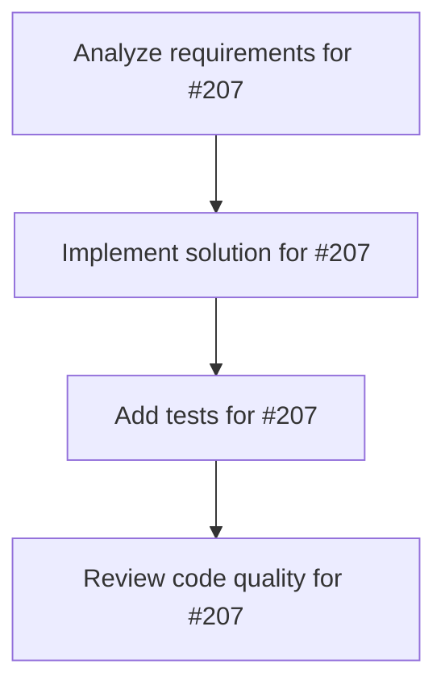

# Plans for Issue #207

**Title**: Documentation & Legacy Cleanup

**URL**: https://github.com/customer-cloud/miyabi-private/issues/207

---

## 📋 Summary

- **Total Tasks**: 4
- **Estimated Duration**: 60 minutes
- **Execution Levels**: 4
- **Has Cycles**: ✅ No

## 📝 Task Breakdown

### 1. Analyze requirements for #207

- **ID**: `task-207-analysis`
- **Type**: Docs
- **Assigned Agent**: IssueAgent
- **Priority**: 0
- **Estimated Duration**: 5 min

**Description**: Analyze issue requirements and create detailed specification

### 2. Implement solution for #207

- **ID**: `task-207-impl`
- **Type**: Docs
- **Assigned Agent**: CodeGenAgent
- **Priority**: 1
- **Estimated Duration**: 30 min
- **Dependencies**: task-207-analysis

**Description**: ## Summary
Update `.claude` prompts and project documentation to match the refactored architecture, clean up or archive obsolete TypeScript assets, and deliver a migration guide for contributors.

## Deliverables
- Updated documentation set aligned with refactors
- Legacy TypeScript cleanup plan executed
- Contributor migration guide

## Dependencies
- Issue 202 (Harden Domain Models)
- Issue 203 (Unify Agent Pipeline)
- Issue 204 (Modularize Worktree Infrastructure)
- Issue 205 (Refactor CLI Command Surface)
- Issue 206 (Consolidate Cross-Cutting Concerns)

## Checklist
- [ ] T7-current-doc-audit — docs — audit `.claude` docs, templates, and TS references
- [ ] T7-update-plan — docs-lead — map new architecture to documentation updates
- [ ] T7-doc-rewrite — docs — refresh key guides, prompts, template index
- [ ] T7-legacy-cleanup — legacy-team — remove/deprecate obsolete TS packages or add shims
- [ ] T7-migration-guide — docs — draft contributor migration notes and changelog entries
- [ ] T7-final-review — docs-lead — perform doc QA, link checks, finalize publication

### 3. Add tests for #207

- **ID**: `task-207-test`
- **Type**: Test
- **Assigned Agent**: CodeGenAgent
- **Priority**: 2
- **Estimated Duration**: 15 min
- **Dependencies**: task-207-impl

**Description**: Create comprehensive test coverage

### 4. Review code quality for #207

- **ID**: `task-207-review`
- **Type**: Refactor
- **Assigned Agent**: ReviewAgent
- **Priority**: 3
- **Estimated Duration**: 10 min
- **Dependencies**: task-207-test

**Description**: Run quality checks and code review

## 🔄 Execution Plan (DAG Levels)

Tasks can be executed in parallel within each level:

### Level 0 (Parallel Execution)

- `task-207-analysis` - Analyze requirements for #207

### Level 1 (Parallel Execution)

- `task-207-impl` - Implement solution for #207

### Level 2 (Parallel Execution)

- `task-207-test` - Add tests for #207

### Level 3 (Parallel Execution)

- `task-207-review` - Review code quality for #207

## 📊 Dependency Graph

## ⏱️ Timeline Estimation

- **Sequential Execution**: 60 minutes (1.0 hours)
- **Parallel Execution (Critical Path)**: 10 minutes (0.2 hours)
- **Estimated Speedup**: 6.0x

---

*Generated by CoordinatorAgent on 2025-10-31 09:21:24 UTC*
