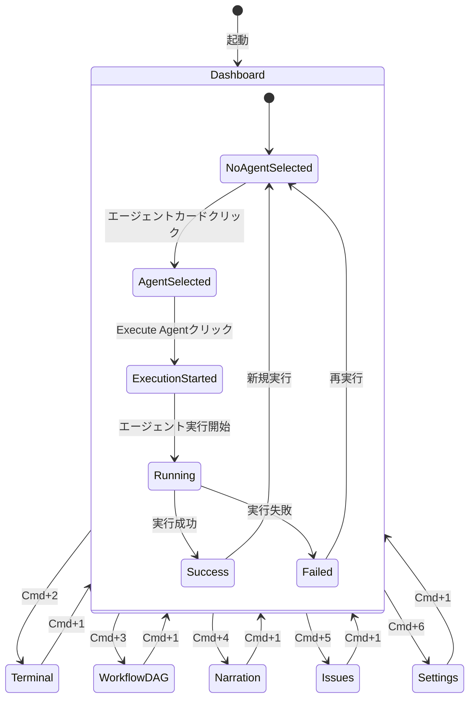

# Miyabi Desktop - 詳細UXストーリーとユーザージャーニー

**作成日**: 2025-10-31
**バージョン**: 1.0.0
**ステータス**: Draft

---

## 📋 目次

1. [エグゼクティブサマリー](#エグゼクティブサマリー)
2. [ユーザーペルソナ定義](#ユーザーペルソナ定義)
3. [コアバリュープロポジション](#コアバリュープロポジション)
4. [詳細ユーザージャーニーマップ](#詳細ユーザージャーニーマップ)
5. [画面遷移フロー](#画面遷移フロー)
6. [インタラクションデザインパターン](#インタラクションデザインパターン)
7. [感情曲線とペインポイント](#感情曲線とペインポイント)
8. [実装ステータス](#実装ステータス)

---

## エグゼクティブサマリー

### アプリケーション概要

**Miyabi Desktop**は、AI駆動型の完全自律開発プラットフォームのデスクトップアプリケーションです。開発者が21種類のAIエージェント（Coding: 7個、Business: 14個）をGUIから直感的に操作し、GitHub Issue処理からコード生成、PR作成、デプロイまでを完全自動化します。

### 核心的な価値提案

1. **視覚的エージェント管理**: キャラクター化されたエージェントを直感的に選択・実行
2. **リアルタイムフィードバック**: エージェント実行中のログをリアルタイムストリーミング表示
3. **ワークフロー可視化**: DAG（有向非巡回グラフ）による依存関係の視覚化
4. **Issue統合管理**: GitHub Issuesをカンバンボード形式で管理
5. **音声ガイド**: VOICEVOX統合によるゆっくり音声ナレーション

### 想定ユーザー層

- **Primary**: 個人開発者・スタートアップ創業者（技術バックグラウンド有）
- **Secondary**: 小規模チーム（2-5人）のテックリード
- **Tertiary**: ビジネスサイドでMVP開発を行う起業家

---

## ユーザーペルソナ定義

### ペルソナ 1: 個人開発者「たかし」（メインターゲット）

**基本情報**
- 年齢: 28歳
- 職業: フルスタックエンジニア（副業で個人開発）
- 技術スタック: Rust, TypeScript, React, Node.js
- 経験年数: 5年
- 居住地: 東京

**背景ストーリー**
たかしは日中フルタイムで働きながら、夜と週末に自分のSaaSプロダクトを開発しています。時間が限られているため、反復的なコーディング作業を自動化し、本質的な設計や戦略に時間を使いたいと考えています。

**ゴール**
- 週末だけでMVPを完成させたい
- 複数のGitHub Issueを並列処理したい
- コード品質を落とさずに開発速度を上げたい
- デプロイまでのワークフローを自動化したい

**ペインポイント**
- Issue→コーディング→PR作成→デプロイの一連の流れが手作業で時間がかかる
- 複数Issueを同時進行すると、ブランチ管理が煩雑になる
- コードレビューを自分一人でやるのは見落としが多い
- CLIツールは便利だが、実行状況が見えづらい

**テクノロジー理解度**
- ⭐⭐⭐⭐⭐ Git/GitHub
- ⭐⭐⭐⭐⭐ CLI操作
- ⭐⭐⭐⭐ Docker/DevOps
- ⭐⭐⭐ AI/LLM API

**利用シーン**
- 平日夜: 1-2時間（Issue確認→エージェント実行→結果確認）
- 週末: 4-6時間（集中開発セッション、複数Issue並列処理）
- 通勤時間: スマホでGitHubをチェック、家に帰ったらMiyabi Desktopで実行

**成功の定義**
- 週末2日間で3-5個のIssueを完了できる
- コード品質スコアが80%以上を維持
- デプロイまでの時間を50%削減

---

### ペルソナ 2: スタートアップ創業者「さくら」（セカンダリーターゲット）

**基本情報**
- 年齢: 32歳
- 職業: スタートアップCTO兼創業者
- 技術スタック: Python, JavaScript, 最近Rustを学習中
- 経験年数: 8年（エンジニア経験）、2年（経営経験）
- 居住地: 大阪

**背景ストーリー**
さくらは2年前にSaaS企業を創業し、現在3人のチームでプロダクト開発を行っています。技術的な実装だけでなく、マーケティング戦略やビジネスモデル設計にも時間を割く必要があります。Miyabi Desktopのビジネスエージェントを活用して、技術とビジネス両方を加速させたいと考えています。

**ゴール**
- Codingエージェントで開発速度を上げる
- Businessエージェント（14個）で戦略立案を自動化
- チームメンバーのタスク依存関係を可視化
- 投資家向けのビジネスプランを短期間で作成

**ペインポイント**
- 技術実装とビジネス戦略の両方をこなすのが大変
- 市場調査やペルソナ設定に時間がかかる
- マーケティング施策を体系的に実行できていない
- CRMやアナリティクスを手動で管理するのが煩雑

**テクノロジー理解度**
- ⭐⭐⭐⭐ Git/GitHub
- ⭐⭐⭐⭐ CLI操作
- ⭐⭐⭐ Docker/DevOps
- ⭐⭐⭐ ビジネス戦略
- ⭐⭐ AI/LLM API

**利用シーン**
- 朝: 戦略ミーティング前にビジネスエージェントで分析レポート生成
- 昼: 開発チームとコーディングエージェントの実行結果をレビュー
- 夕方: Issue Dashboardで進捗確認、ボトルネックの特定
- 週末: 次週の戦略立案（MarketResearch、Persona、FunnelDesignエージェント活用）

**成功の定義**
- 月間20個以上のIssueを処理
- ビジネスプランドキュメントを週1で更新
- チーム全体の開発速度を2倍にする
- 投資家向けピッチ資料をエージェントで自動生成

---

### ペルソナ 3: ビジネスサイド起業家「けんた」（ターシャリーターゲット）

**基本情報**
- 年齢: 35歳
- 職業: ビジネスコンサルタント→起業家
- 技術スタック: ほぼなし（HTML/CSS基礎レベル）
- 経験年数: 12年（ビジネス経験）、0年（エンジニアリング経験）
- 居住地: 福岡

**背景ストーリー**
けんたはビジネスコンサルティング業界で10年以上のキャリアを持ち、独自のビジネスアイデアを実現するために起業しました。しかし、技術的なバックグラウンドがないため、MVPの開発を外注するか、共同創業者を探すか悩んでいました。Miyabi Desktopを使えば、技術を学びながら自分でプロトタイプを作れると知り、挑戦することを決意しました。

**ゴール**
- ビジネスエージェントを使って戦略を体系化
- 技術を学びながらMVPを構築
- 市場調査・ペルソナ設定・マーケティング戦略を自動化
- 最小限のコストでプロダクトを検証

**ペインポイント**
- 技術用語が分からず、CLIツールは使えない
- GitHubの操作に不慣れ
- コードを読めないので、エージェントの実行結果が正しいか判断できない
- デプロイやCI/CDの概念が理解できていない

**テクノロジー理解度**
- ⭐ Git/GitHub
- ⭐ CLI操作
- ⭐ Docker/DevOps
- ⭐⭐⭐⭐⭐ ビジネス戦略
- ⭐ AI/LLM API

**利用シーン**
- 朝: ビジネスプラン作成（AIEntrepreneur、ProductConcept、Personaエージェント）
- 昼: 市場調査レポート生成（MarketResearchエージェント）
- 夕方: マーケティング戦略立案（Marketing、SNSStrategyエージェント）
- 週末: 簡単なコーディング学習 + CodeGenエージェントで実装支援

**成功の定義**
- 3ヶ月でビジネスプラン完成
- 6ヶ月でMVPをローンチ
- マーケティング施策を体系的に実行
- 技術共同創業者を見つけるまでの橋渡し

---

## コアバリュープロポジション

### 1. 視覚的エージェント管理（Visual Agent Management）

**価値**: CLIの効率性とGUIの直感性を融合

**実装状況**: ✅ 実装済み

**ユーザー体験**:
- 21個のエージェントがキャラクター名とカラーコードで識別可能
- エージェントカードをクリックするだけで選択
- カテゴリ別フィルタリング（Coding / Business）
- カード UI に「しきるん」「つくるん」など親しみやすいキャラクター名

**ペインポイント解決**:
- ❌ Before: `miyabi agent coordinator --issue 270` のようなCLIコマンドを覚える必要があった
- ✅ After: カードをクリック → Issue選択 → 実行ボタン

---

### 2. リアルタイムログストリーミング（Real-time Log Streaming）

**価値**: エージェント実行の透明性と安心感

**実装状況**: 🔧 修正中（Phase 9 & 10で実装予定）

**ユーザー体験**:
- エージェント実行中に標準出力/エラー出力をリアルタイム表示
- 実行ステータス（Starting → Running → Success/Failed）を視覚的に表示
- 実行時間とExit codeを即座に確認
- ログ出力が途切れることなく、1行ずつストリーミング表示

**ペインポイント解決**:
- ❌ Before: エージェントが何をしているか分からず不安
- ✅ After: リアルタイムでログを確認でき、進捗を把握できる

---

### 3. ワークフローDAG可視化（Workflow DAG Visualization）

**価値**: 複雑な依存関係の直感的理解

**実装状況**: ✅ 実装済み（サンプルデータで動作確認可能）

**ユーザー体験**:
- React Flowによるインタラクティブなグラフ表示
- エージェント間の依存関係を矢印で可視化
- 実行中のエージェントがアニメーション表示
- ドラッグ&ドロップでレイアウト調整可能
- ミニマップで全体像を把握

**ペインポイント解決**:
- ❌ Before: 複数エージェントの実行順序が分からない
- ✅ After: DAGを見れば、どのエージェントがどの順序で実行されるか一目瞭然

---

### 4. GitHub Issue統合管理（Integrated Issue Management）

**実装状況**: ✅ 実装済み

**ユーザー体験**:
- カンバンボード形式でIssueを管理
- Miyabiの53ラベルシステムに基づいた状態管理
- Issue検索・フィルタリング機能
- IssueカードをクリックしてGitHubで詳細を確認
- Open/Closed状態の自動同期

**ペインポイント解決**:
- ❌ Before: GitHubとCLIを行ったり来たりする必要があった
- ✅ After: Miyabi Desktop内でIssue管理が完結

---

### 5. VOICEVOX音声ガイド（Voice-guided Narration）

**実装状況**: ✅ 実装済み（基本機能）

**ユーザー体験**:
- Git履歴から自動的に音声ガイドを生成
- ゆっくりボイスによる開発進捗の聴覚的フィードバック
- バックグラウンド再生でマルチタスク可能
- 通勤時間やジョギング中に進捗を確認

**ペインポイント解決**:
- ❌ Before: 進捗確認のために画面を見る必要があった
- ✅ After: 音声だけで開発状況を把握できる

---

## 詳細ユーザージャーニーマップ

### ジャーニー 1: 初回起動とセットアップ（First-Time User Experience）

**想定所要時間**: 3-5分

**シナリオ**: たかしが金曜日の夜、Miyabi Desktopを初めて起動する

---

#### ステップ 1.1: アプリケーション起動

**アクション**:
1. Miyabi Desktopアイコンをダブルクリック
2. スプラッシュスクリーン表示（「M」ロゴ + ローディングアニメーション）
3. 3秒後にメイン画面が表示

**UI要素**:
- スプラッシュスクリーン: 最小限のデザイン、グレー背景
- ローディングインジケーター: 回転する「M」マーク
- プログレスバー: 不要（高速起動を強調）

**感情**: 😊 期待感 → 🤔 どう使うんだろう？

**実装ステータス**: ✅ 基本UI実装済み

---

#### ステップ 1.2: 初回セットアップウィザード（未実装）

**アクション**:
1. 「Welcome to Miyabi Desktop」画面が表示
2. GitHub Tokenの設定を求められる
3. リポジトリ名を入力
4. デバイス識別子を自動検出（MacBook Pro など）
5. 「セットアップ完了」ボタンをクリック

**UI要素**:
- ウィザード形式の4ステップUI
- 各ステップに説明テキストとヘルプリンク
- スキップ可能（後で設定）
- GitHub Token取得リンク（https://github.com/settings/tokens）

**感情**: 🤔 設定が面倒だな → 😌 思ったより簡単だった

**実装ステータス**: ⚠️ 未実装（Settingsパネルで代替可能）

---

#### ステップ 1.3: ダッシュボードの初見

**アクション**:
1. エージェント実行パネル（Dashboard）が表示される
2. 左サイドバーに7個のCoding Agentsが並んでいる
3. 右側には「No Agent Selected」と表示
4. 青色の使い方ガイドボックスが目に入る

**UI要素**:
- 左サイドバー: エージェントカード（7個）
- 使い方ガイド: 青背景の3ステップ説明
- ステータスバー: 「Agents: Idle」「CPU: 12%」

**感情**: 😀 分かりやすいUI！ → 🎯 早速使ってみよう

**実装ステータス**: ✅ 実装済み

---

### ジャーニー 2: 初めてのエージェント実行（First Agent Execution）

**想定所要時間**: 2-3分

**シナリオ**: たかしがCoordinatorAgentを使って、Issue #270を処理する

---

#### ステップ 2.1: エージェント選択

**アクション**:
1. サイドバーの「しきるん（CoordinatorAgent）」カードをクリック
2. カードが黒背景に変わり、選択されたことが分かる
3. 右側に「しきるん」の説明が表示される

**UI要素**:
- エージェントカード: 赤色の丸（coordinatorのカラー）+ キャラクター名
- 選択状態: 黒背景 + 白テキスト
- 右パネル: エージェントの詳細説明（displayName, characterName, description）

**感情**: 😊 カードがクリックできるの分かりやすい

**実装ステータス**: ✅ 実装済み

---

#### ステップ 2.2: Issue選択

**アクション**:
1. 「Select Issue (optional)」ドロップダウンをクリック
2. Open Issuesのリストが表示される（「#270 - Implement parallel agent execution」）
3. Issue #270を選択
4. ドロップダウンが閉じ、選択されたIssue番号が表示される

**UI要素**:
- ドロップダウン: グレー背景 + 黒ボーダー
- Issue形式: `#270 - Implement parallel agent execution`
- リフレッシュボタン: ドロップダウン横のアイコン
- 下部テキスト: 「15 open issues」

**感情**: 🤔 Issue一覧が見やすい → ✅ #270を選択完了

**実装ステータス**: ✅ 実装済み

---

#### ステップ 2.3: エージェント実行開始

**アクション**:
1. 「Execute Agent」ボタンをクリック
2. ボタンがグレーアウトされ、「Executing...」に変わる
3. 右パネルに実行中のステータスが表示される（Running... + 時計アイコン）
4. 黒い背景に青色の「実行中...」メッセージとアニメーション

**UI要素**:
- 実行ボタン: 黒背景 → グレー（disabled状態）
- ステータス表示: 「Running...」 + Clock icon (animate-pulse)
- 右パネル: 黒背景のターミナル風UI

**感情**: 😀 実行開始！ → 🤔 何が起きているんだろう？

**実装ステータス**: ✅ 実装済み（ただし、リアルタイムログは修正中）

---

#### ステップ 2.4: リアルタイムログ確認

**アクション**:
1. 数秒後、ターミナル風パネルにログが流れ始める
2. `[DEBUG] Received agent output: Starting CoordinatorAgent...`
3. `[INFO] Analyzing Issue #270...`
4. `[INFO] Creating worktree for parallel execution...`
5. ログが1行ずつストリーミング表示され、自動スクロール

**UI要素**:
- ログ表示: 黒背景 + グレーテキスト（font-mono）
- 自動スクロール: 最新ログが常に見える位置に
- デバッグログ: `[DEBUG]` プレフィックス付き

**感情**: 😊 進捗が見えるから安心 → 🎉 ちゃんと動いてる！

**実装ステータス**: 🔧 修正中（現在は実行完了後に一括表示）

---

#### ステップ 2.5: 実行完了と結果確認

**アクション**:
1. 45秒後、ステータスが「Success」に変わる
2. 緑色のチェックマーク ✓ が表示される
3. 実行時間「45.6s」とExit code「0」が表示される
4. アクションボタンが4つ表示される:
   - 「GitHubを開く」
   - 「詳細ログ」
   - 「Pull Requests」
   - 「Issue #270」

**UI要素**:
- ステータス: 緑色のCheckCircleアイコン + 「実行完了」
- 実行時間: 「実行時間: 45.6秒」
- アクションボタン: 4つのカード型ボタン（アイコン + 説明 + 矢印）

**感情**: 🎉 成功！ → 😊 結果をGitHubで確認しよう

**実装ステータス**: ✅ 実装済み

---

#### ステップ 2.6: GitHub確認

**アクション**:
1. 「Pull Requests」ボタンをクリック
2. ブラウザが開き、作成されたPRが表示される
3. PRタイトル: 「feat: implement parallel agent execution (#270)」
4. PR本文にCoordinatorAgentが自動生成した説明が記載されている

**UI要素**:
- 外部リンクボタン: ExternalLinkアイコン
- ブラウザ遷移: 新しいタブで開く

**感情**: 🎉 PRが自動作成されてる！ → 😲 こんなに便利なんだ！

**実装ステータス**: ✅ 実装済み（GitHub API連携）

---

### ジャーニー 3: 複数Issueの並列実行（Parallel Execution）

**想定所要時間**: 5-10分

**シナリオ**: たかしが土曜日の午前中、3つのIssueを同時に処理する

---

#### ステップ 3.1: Workflow DAGを確認

**アクション**:
1. サイドバーの「ワークフローDAG」アイコン（Networkアイコン）をクリック
2. WorkflowDAGViewerが表示される
3. サンプルワークフローとして、Coordinator → CodeGen (x2) → Review → PR → Deploymentのフローが表示される
4. マウスホイールでズームイン/アウト、ノードをドラッグして配置調整

**UI要素**:
- React Flowキャンバス
- エージェントノード: カラフルなカード型ノード
- エッジ: 色付き矢印（エージェントのカラーに対応）
- コントロールパネル: ズーム、フィット、ロック
- ミニマップ: 右下に全体図

**感情**: 😲 こんなに綺麗にビジュアル化されるんだ → 🤔 依存関係が一目瞭然

**実装ステータス**: ✅ 実装済み

---

#### ステップ 3.2: Issue Dashboardで進捗確認

**アクション**:
1. サイドバーの「GitHub Issues」アイコン（ListTodoアイコン）をクリック
2. IssueDashboardが表示される
3. カンバンボード形式で、state:backlog, state:ready, state:in-progressなど複数列に分かれている
4. 各カラムに該当するIssueカードが並んでいる
5. 検索バーで「parallel」と入力して絞り込み

**UI要素**:
- カンバンボード: 横スクロール可能な複数カラム
- Issueカード: グレー背景 + ホバーで黒ボーダー
- 検索バー: 左側にSearchアイコン
- フィルターボタン: 右上

**感情**: 😊 Issueの状態が分かりやすい → 🎯 次にやるべきことが明確

**実装ステータス**: ✅ 実装済み

---

#### ステップ 3.3: ターミナルで詳細ログ確認

**アクション**:
1. サイドバーの「ターミナル」アイコン（TerminalIconアイコン）をクリック
2. TerminalManagerが表示される
3. 複数のターミナルタブが並んでいる（未実装の場合は1つ）
4. 最新の実行ログが表示され、スクロールして過去のログを確認

**UI要素**:
- ターミナルパネル: 黒背景 + 緑色テキスト（クラシックなターミナル風）
- タブ切り替え: 複数ターミナルセッションの管理
- ログフィルタリング: エラーのみ表示、など

**感情**: 🤓 詳細ログが見たいときはターミナルを開けばいい

**実装ステータス**: ✅ 実装済み（基本機能）

---

### ジャーニー 4: ビジネスエージェントの活用（Business Agents）

**想定所要時間**: 10-15分

**シナリオ**: さくらが月曜日の朝、次四半期のビジネスプランを作成する

---

#### ステップ 4.1: ビジネスエージェントカテゴリの表示（未実装）

**アクション**:
1. エージェント実行パネルで「Category」ドロップダウンをクリック
2. 「Coding Agents」「Business Agents - Strategy」「Business Agents - Marketing」「Business Agents - Sales」から選択
3. 「Business Agents - Strategy」を選択
4. 6個のストラテジーエージェントが表示される

**UI要素**:
- カテゴリフィルター: ドロップダウンまたはタブUI
- エージェントカード: ビジネスエージェント用のカラーコード（ピンク、紫、ティール、オレンジなど）

**感情**: 🤔 ビジネスエージェントもあるんだ → 😊 戦略立案を自動化できそう

**実装ステータス**: ⚠️ 未実装（現在はCoding Agentsのみ表示）

---

#### ステップ 4.2: MarketResearchAgentの実行

**アクション**:
1. 「市場調査（MarketResearchAgent）」カードをクリック
2. Issue番号を選択せず、「No Issue (Auto-select)」のまま実行
3. エージェントが競合分析を開始
4. リアルタイムログで「Analyzing 20+ competitors...」と表示
5. 10分後、レポートが生成され、`reports/market-research-2025-10-31.md`に保存

**UI要素**:
- エージェントカード: オレンジ色の丸 + 「市場調査」
- 実行ログ: 競合企業名が次々と表示される
- 完了メッセージ: 「レポートを reports/market-research-2025-10-31.md に保存しました」

**感情**: 😲 20社以上を自動調査してくれるんだ → 🎉 これは便利！

**実装ステータス**: ⚠️ バックエンド実装済み（RustのAgent）、フロントエンド未統合

---

#### ステップ 4.3: PersonaAgent + FunnelDesignAgentの連携

**アクション**:
1. PersonaAgentを実行して、ターゲット顧客ペルソナを3-5人生成
2. 生成されたペルソナ情報を元に、FunnelDesignAgentを実行
3. 認知→購入→LTVまでの顧客導線を自動設計
4. 両方のレポートをGitHub Issueとして記録

**UI要素**:
- エージェント連携フロー: ワークフローDAGで依存関係を可視化
- レポート保存: `docs/personas/`、`docs/funnel-design/` に自動保存

**感情**: 🤩 エージェント同士が連携してる！ → 🚀 これは本格的なツールだ

**実装ステータス**: ⚠️ バックエンド実装済み、フロントエンド未統合

---

### ジャーニー 5: コマンドパレットとキーボードショートカット

**想定所要時間**: 1-2分

**シナリオ**: たかしがキーボードだけで素早く操作する

---

#### ステップ 5.1: コマンドパレットを開く

**アクション**:
1. `Cmd+K`（Macの場合）または`Ctrl+K`（Windowsの場合）を押す
2. 画面中央にコマンドパレットが表示される
3. 「Search commands...」プレースホルダーが表示される

**UI要素**:
- モーダルオーバーレイ: 半透明の黒背景
- コマンドパレット: 白い検索ボックス + コマンドリスト
- キーボードヒント: 各コマンドの横にショートカットキー表示

**感情**: 😊 VS Codeみたいで使いやすい → ⚡ 素早く操作できる

**実装ステータス**: ✅ 実装済み

---

#### ステップ 5.2: コマンド検索と実行

**アクション**:
1. 「workflow」と入力
2. 「ワークフローDAGを表示」コマンドが候補に表示される
3. Enterキーを押すか、クリックして実行
4. WorkflowDAGViewerパネルに遷移

**UI要素**:
- インクリメンタル検索: 入力に応じてリアルタイムフィルタリング
- コマンドアイコン: 各コマンドに対応するLucideアイコン
- 説明テキスト: コマンドの機能を簡潔に説明

**感情**: ⚡ 一瞬で切り替えられる → 👍 効率的！

**実装ステータス**: ✅ 実装済み

---

#### ステップ 5.3: 数字キーでパネル切り替え

**アクション**:
1. `Cmd+1`でエージェント実行パネルに切り替え
2. `Cmd+2`でターミナルパネルに切り替え
3. `Cmd+3`でワークフローDAGに切り替え
4. `Cmd+4`でNarrationパネルに切り替え
5. `Cmd+5`でIssue Dashboardに切り替え
6. `Cmd+6`でSettingsパネルに切り替え

**UI要素**:
- サイドバーのアイコン: 選択されたパネルが黒背景に変わる
- パネル遷移: 瞬時に切り替わる（アニメーションなし）

**感情**: ⚡⚡⚡ キーボードだけで全部操作できる！

**実装ステータス**: ✅ 実装済み

---

## 画面遷移フロー

### 画面構成

```
┌─────────────────────────────────────────────────────────┐
│  Miyabi Desktop                                   [- □ ×] │
├──┬──────────────────────────────────────────────────────┤
│M │                                                        │
│  │                                                        │
│🤖│                    Main Content                       │
│🖥 │                    (Active Panel)                    │
│🌐│                                                        │
│🎵│                                                        │
│📋│                                                        │
│  │                                                        │
│⚙ │                                                        │
├──┴──────────────────────────────────────────────────────┤
│ Agents: Idle  ·  CPU: 12%  ·  ⌘K for Command Palette   │
└─────────────────────────────────────────────────────────┘
```

### パネル一覧

| アイコン | パネル名 | ショートカット | 説明 |
|---------|---------|--------------|------|
| 🤖 Bot | Agent Execution | `Cmd+1` | エージェント選択・実行・ログ表示 |
| 🖥 Terminal | Terminal | `Cmd+2` | 詳細ログ確認・コマンド実行 |
| 🌐 Network | Workflow DAG | `Cmd+3` | エージェントのワークフロー可視化 |
| 🎵 Volume2 | Narration | `Cmd+4` | VOICEVOX音声ガイド再生 |
| 📋 ListTodo | GitHub Issues | `Cmd+5` | Issue管理カンバンボード |
| ⚙ Settings | Settings | `Cmd+6` | アプリケーション設定 |

---

### 遷移図（State Diagram）



---

## インタラクションデザインパターン

### 1. カード選択パターン（Card Selection Pattern）

**適用箇所**: エージェント選択、実行履歴選択

**デザイン原則**:
- デフォルト: グレー背景 + グレーボーダー
- ホバー: 軽いグレー背景 + 黒ボーダー
- 選択: 黒背景 + 白テキスト
- トランジション: 200ms ease-in-out

**コード例**:
```tsx
<button
  onClick={() => setSelectedAgent(agent.type)}
  className={`w-full text-left p-4 rounded-xl transition-all duration-200 ${
    selectedAgent === agent.type
      ? "bg-gray-900 text-white"
      : "bg-white text-gray-900 hover:bg-gray-100 border border-gray-200"
  }`}
>
```

---

### 2. ステータス表示パターン（Status Display Pattern）

**適用箇所**: エージェント実行ステータス、Issue状態

**ステータスの種類**:

| ステータス | アイコン | カラー | アニメーション |
|-----------|---------|-------|--------------|
| Idle | ○ | Gray | なし |
| Starting | ⏳ | Blue | なし |
| Running | ⏳ | Blue | Pulse |
| Success | ✓ | Green | なし |
| Failed | ✗ | Red | なし |

**コード例**:
```tsx
{activeExecution.status === "running" && (
  <Clock size={14} className="text-blue-400 animate-pulse" />
)}
{activeExecution.status === "success" && (
  <CheckCircle size={14} className="text-green-400" />
)}
{activeExecution.status === "failed" && (
  <AlertCircle size={14} className="text-red-400" />
)}
```

---

### 3. リアルタイムストリーミング表示パターン

**適用箇所**: エージェント実行ログ

**デザイン原則**:
- ログは1行ずつ追加される
- 自動スクロールで常に最新行が見える
- 長いログは折り返さず、横スクロール可能
- デバッグログとエラーログで色分け

**コード例**:
```tsx
<div className="flex-1 overflow-y-auto bg-gray-900 p-6 font-mono text-sm text-gray-100">
  {activeExecution.output.map((line, index) => (
    <div key={index} className="mb-1">
      {line}
    </div>
  ))}
  <div ref={outputEndRef} />
</div>
```

---

### 4. アクションボタングループパターン

**適用箇所**: エージェント実行完了後のアクション

**デザイン原則**:
- 4つのカード型ボタンを縦に並べる
- 各ボタンにアイコン + タイトル + 説明
- ホバーで背景色が変わる
- 矢印アイコンで外部リンクを示唆

**コード例**:
```tsx
<button
  onClick={() => window.open(githubUrl, "_blank")}
  className="w-full flex items-center justify-between p-4 bg-gray-800 hover:bg-gray-700 rounded-xl transition-all duration-200 text-left"
>
  <div className="flex items-center space-x-3">
    <ExternalLink size={20} className="text-blue-400" />
    <div>
      <div className="text-sm font-light text-gray-100">GitHubを開く</div>
      <div className="text-xs text-gray-500">Issue/PRの更新を確認</div>
    </div>
  </div>
  <span className="text-gray-600">→</span>
</button>
```

---

### 5. コマンドパレットパターン

**適用箇所**: グローバルナビゲーション

**デザイン原則**:
- `Cmd+K`で即座に開く
- インクリメンタル検索
- 上下矢印キーで候補選択
- Enterキーで実行、Escキーで閉じる

**コード例**:
```tsx
useEffect(() => {
  const handleKeyDown = (e: KeyboardEvent) => {
    if ((e.metaKey || e.ctrlKey) && e.key === "k") {
      e.preventDefault();
      setCommandPaletteOpen(true);
    }
  };
  window.addEventListener("keydown", handleKeyDown);
  return () => window.removeEventListener("keydown", handleKeyDown);
}, []);
```

---

## 感情曲線とペインポイント

### 感情曲線グラフ（Emotional Journey Curve）

```
感情
 ↑
10│                    🎉
 9│                   /  \
 8│                  /    \              🎉
 7│        😊      /      \            /  \
 6│       /  \    /        \          /    \
 5│ 😊   /    \  /          \  😊    /      \
 4│/  \ /      \/            \/  \  /        \
 3│    X        X              \ X            \ 😌
 2│   /🤔      🤔               \🤔             \
 1│  /                                          \
 0│ /                                            \
  └────────────────────────────────────────────────→ 時間
   起動 選択 実行 待機  完了 GitHub 次回 並列 完了 日常
```

### ペインポイント詳細

#### ペインポイント 1: 初回セットアップの煩雑さ（現状）

**問題**:
- GitHub Tokenの取得方法が分からない
- リポジトリ名の入力フォーマットが不明確
- セットアップ失敗時のエラーメッセージが分かりにくい

**解決策**:
- ⚠️ 初回セットアップウィザードの実装（未実装）
- ✅ Settingsパネルで後から変更可能（実装済み）
- 📝 ドキュメント: QUICKSTART-JA.mdで手順を詳細に説明

**優先度**: 🟡 Medium（Workaround可能）

---

#### ペインポイント 2: リアルタイムログが表示されない（修正中）

**問題**:
- エージェント実行中にログが表示されず、何が起きているか分からない
- 実行完了後に一括表示されるため、長時間待たされる感覚
- エラーが発生しても、どの段階で失敗したか分からない

**解決策**:
- 🔧 Rust バックエンドの修正（`agent.rs` L248-285）
- 🔧 React フロントエンドのイベントリスナー設定（`AgentExecutionPanel.tsx` L109-125）
- ✅ デバッグログ追加済み

**優先度**: 🔴 High（UXの核心機能）

**実装状況**: Phase 9 & 10で修正予定

---

#### ペインポイント 3: ビジネスエージェントが表示されない

**問題**:
- 現在はCoding Agents（7個）しかUIに表示されていない
- ビジネスエージェント（14個）が存在するのに、アクセス方法が不明

**解決策**:
- ⚠️ カテゴリフィルターの実装（未実装）
- ⚠️ ビジネスエージェントカードの表示（未実装）
- ⚠️ エージェント検索機能の追加（未実装）

**優先度**: 🟡 Medium（バックエンドは実装済み）

---

#### ペインポイント 4: エラー発生時の対処法が不明確

**問題**:
- エージェント実行が失敗しても、「Failed」と表示されるだけ
- エラーメッセージが技術的すぎて、初心者には理解できない
- リトライ方法やトラブルシューティングガイドへのリンクがない

**解決策**:
- 📝 エラーメッセージの改善（ユーザーフレンドリーな表現）
- 📝 トラブルシューティングガイドへのリンク追加
- 📝 「Re-run」ボタンの追加（現在は手動で再実行が必要）

**優先度**: 🟡 Medium

---

#### ペインポイント 5: 並列実行の進捗が分かりにくい

**問題**:
- 複数エージェントを並列実行しても、全体の進捗が把握できない
- どのエージェントが実行中で、どのエージェントが完了したか分からない
- WorkflowDAGは静的なサンプルデータしか表示していない

**解決策**:
- 📝 WorkflowDAGのリアルタイム更新機能（未実装）
- 📝 プログレスバーの追加（「3/5 agents completed」など）
- 📝 実行履歴パネルの改善（並列実行を視覚的にグループ化）

**優先度**: 🟢 Low（現状でも使用可能）

---

## 実装ステータス

### ✅ 実装済み機能

1. **エージェント実行パネル（AgentExecutionPanel）**
   - エージェントカード選択
   - Issue選択ドロップダウン
   - Execute Agentボタン
   - 実行ステータス表示
   - 実行履歴パネル

2. **ワークフローDAG可視化（WorkflowDAGViewer）**
   - React Flow統合
   - サンプルワークフロー表示
   - ノードドラッグ&ドロップ
   - ミニマップ
   - ズーム/フィットコントロール

3. **Issue Dashboard（IssueDashboard）**
   - カンバンボード形式
   - Issue検索・フィルタリング
   - ラベル別フィルタリング
   - Issueカードクリックでブラウザを開く

4. **コマンドパレット（CommandPalette）**
   - `Cmd+K` / `Ctrl+K`で起動
   - パネル遷移コマンド
   - インクリメンタル検索

5. **キーボードショートカット**
   - `Cmd+1-6`: パネル切り替え
   - `Cmd+K`: コマンドパレット起動

6. **ターミナルマネージャー（TerminalManager）**
   - 基本的なターミナルUI

7. **音声ガイド（NarrationPlayer）**
   - VOICEVOX統合（基本機能）

8. **設定パネル（SettingsPanel）**
   - GitHub Token設定
   - リポジトリ名設定

---

### 🔧 修正中機能

1. **リアルタイムログストリーミング**
   - バックエンド: `agent.rs` の修正完了
   - フロントエンド: デバッグログ追加完了
   - テスト: 手動テストが必要（MANUAL_UX_TEST_GUIDE.md参照）

**実装状況**: Phase 9 & 10

---

### ⚠️ 未実装機能

1. **初回セットアップウィザード**
   - Welcome画面
   - ステップ形式の設定フロー
   - GitHub Token取得ガイド

2. **ビジネスエージェント表示**
   - カテゴリフィルター
   - ビジネスエージェントカード（14個）
   - カテゴリ別タブUI

3. **WorkflowDAGリアルタイム更新**
   - 実行中エージェントのアニメーション
   - 完了エージェントのステータス反映
   - 並列実行の可視化

4. **エラーハンドリング改善**
   - ユーザーフレンドリーなエラーメッセージ
   - トラブルシューティングガイドへのリンク
   - Re-runボタン

5. **並列実行プログレスバー**
   - 全体進捗表示
   - 完了数/総数の表示

---

## 付録: 用語集

| 用語 | 説明 |
|-----|------|
| **エージェント** | Miyabiフレームワークで定義された21種類の自律型AIタスク実行単位 |
| **CoordinatorAgent** | タスク統括・並行実行制御を行うエージェント（愛称: しきるん） |
| **CodeGenAgent** | コード生成実行を行うエージェント（愛称: つくるん） |
| **ReviewAgent** | コード品質判定を行うエージェント（愛称: めだまん） |
| **WorkflowDAG** | エージェント間の依存関係を表す有向非巡回グラフ |
| **Issue** | GitHub Issueのこと。Miyabiでは53ラベルシステムで管理 |
| **リアルタイムログストリーミング** | エージェント実行中の標準出力/エラー出力をリアルタイムで表示する機能 |
| **VOICEVOX** | ゆっくりボイス生成エンジン。Miyabiでは音声ガイド生成に使用 |
| **Tauri** | Rustベースのデスクトップアプリケーションフレームワーク |

---

**作成者**: Miyabi Team
**最終更新**: 2025-10-31
**ステータス**: Draft v1.0.0
**フィードバック**: GitHub Issue #[TBD]

---
