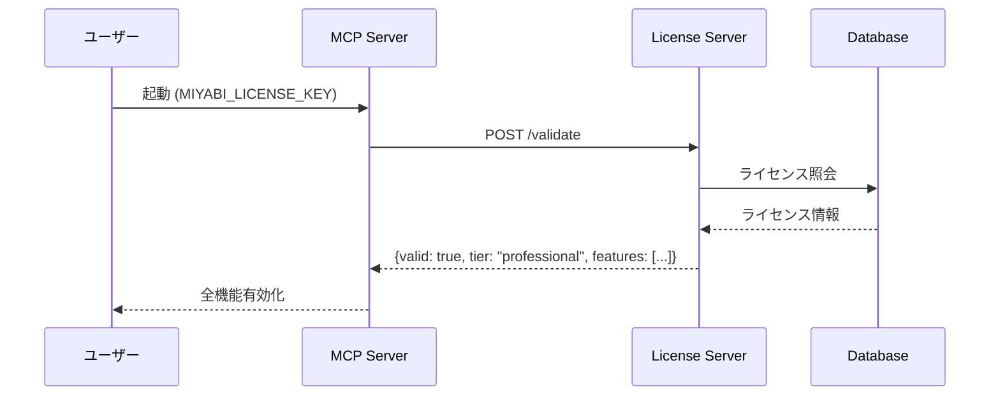

# Miyabi Plugin 配布・サービス提供プラン

## Executive Summary

**Miyabi**を安全に配布し、ソースコード資産を保護しながら顧客に価値を提供する戦略。

---

## 配布アーキテクチャ

### オープン/クローズドの分離

```
┌─────────────────────────────────────────────────────────────────┐
│                    GitHub Public Repository                      │
│  github.com/customer-cloud/miyabi-plugins (予定)                 │
│                                                                  │
│  ┌─────────────────────────────────────────────────────────┐    │
│  │  Open Source Layer (Apache-2.0)                         │    │
│  │  - Agent仕様書 (Markdown)                               │    │
│  │  - コンテキストファイル                                   │    │
│  │  - スキル・コマンド定義                                   │    │
│  │  - 設定テンプレート (.mcp.json.template)                 │    │
│  │  - ドキュメント                                          │    │
│  └─────────────────────────────────────────────────────────┘    │
└─────────────────────────────────────────────────────────────────┘
                              │
                              │ npm install @miyabi/core
                              ▼
┌─────────────────────────────────────────────────────────────────┐
│                    NPM Private Registry                          │
│  または GitHub Packages (Private)                                │
│                                                                  │
│  ┌─────────────────────────────────────────────────────────┐    │
│  │  Proprietary Layer (Commercial License)                 │    │
│  │  - コンパイル済みMCPサーバー (バイナリ)                   │    │
│  │  - miyabi-commercial-agents                             │    │
│  │  - ライセンス認証モジュール                               │    │
│  │  - 高度な分析機能                                        │    │
│  └─────────────────────────────────────────────────────────┘    │
└─────────────────────────────────────────────────────────────────┘
```

---

## 価格体系

### Tier 1: Community (無料)

| 項目 | 内容 |
|------|------|
| **価格** | ¥0 |
| **Agent仕様** | 全25 Agent仕様書 |
| **Skills** | 全22 Skill定義 |
| **Commands** | 全50+ コマンド定義 |
| **Context Files** | 全31 コンテキストファイル |
| **MCPサーバー** | ❌ なし (自前実装必要) |
| **サポート** | GitHub Issues / Discord Community |

**ターゲット:**
- 個人開発者
- 学習目的
- POC検証

---

### Tier 2: Professional (月額サブスク)

| 項目 | 内容 |
|------|------|
| **価格** | ¥9,800/月 または ¥98,000/年 |
| **Community全機能** | ✅ |
| **MCPサーバー** | ✅ コンパイル済みバイナリ (24個) |
| **Commercial Agents** | ✅ 商用Agent機能 |
| **ライセンス認証** | ✅ オンライン認証 |
| **アップデート** | ✅ 自動更新 |
| **サポート** | メールサポート (24h以内返答) |

**ターゲット:**
- 小規模チーム (1-5人)
- スタートアップ
- フリーランス

---

### Tier 3: Team (チームライセンス)

| 項目 | 内容 |
|------|------|
| **価格** | ¥49,800/月 または ¥498,000/年 |
| **Professional全機能** | ✅ |
| **ライセンス数** | 最大10名 |
| **チーム管理** | ✅ 管理ダッシュボード |
| **使用量分析** | ✅ チーム生産性レポート |
| **優先サポート** | Slack直通 (4h以内返答) |

**ターゲット:**
- 中規模チーム (6-10人)
- 部署導入

---

### Tier 4: Enterprise (カスタム)

| 項目 | 内容 |
|------|------|
| **価格** | ¥500,000〜/年 (要相談) |
| **Team全機能** | ✅ |
| **ライセンス数** | 無制限 |
| **ソースコードアクセス** | ✅ (NDA締結) |
| **オンプレミス導入** | ✅ |
| **カスタマイズ** | ✅ 専用Agent開発 |
| **SLA** | 99.9% 稼働保証 |
| **サポート** | 専任担当者 + 定例MTG |

**ターゲット:**
- 大企業
- 金融/医療等のコンプライアンス要件

---

## 配布チャネル

### 1. GitHub Marketplace (Community)

```bash
# ユーザーがインストール
gh extension install customer-cloud/miyabi-plugins

# または Claude Code内で
/plugin marketplace add customer-cloud/miyabi-plugins
/plugin install @miyabi/core
```

### 2. NPM / GitHub Packages (Professional以上)

```bash
# 認証設定
npm login --registry=https://npm.miyabi-world.com

# インストール
npm install @miyabi/suite --save
```

### 3. 直接ダウンロード (Enterprise)

```bash
# ライセンスキー認証後、専用ポータルから
curl -H "Authorization: Bearer $LICENSE_KEY" \
  https://download.miyabi-world.com/v2/suite/latest.tar.gz
```

---

## ライセンスキー管理

### ライセンスサーバー

```
https://license.miyabi-world.com/api/v1/
```

### 認証フロー



### ライセンスキー形式

```
MIYABI-{TIER}-{ORG_ID}-{CHECKSUM}

例:
MIYABI-PRO-D4EECA216879B8028C39
MIYABI-TEAM-A1B2C3D4E5F6789012AB
MIYABI-ENT-CUSTOMER-CLOUD-XYZ123
```

---

## セキュリティ対策

### ソースコード保護

| 対策 | 実装 |
|------|------|
| **難読化** | JavaScript: webpack + terser, Rust: strip + UPX |
| **バイナリ配布** | ソースコード非公開 |
| **ライセンス認証** | オフライン不可、定期チェック |
| **使用制限** | マシンID紐付け (Professionalは3台まで) |

### 顧客データ保護

| 対策 | 実装 |
|------|------|
| **ゼロ知識** | 顧客データはローカル処理のみ |
| **API Key分離** | 顧客の認証情報は顧客環境のみ |
| **ログ非収集** | 使用統計のみ (オプトアウト可) |

---

## サポート体制

### Community

```
GitHub Issues: https://github.com/customer-cloud/miyabi-plugins/issues
Discord: https://discord.gg/miyabi-community
```

### Professional / Team

```
Email: support@miyabi-world.com
Response: 24時間以内
```

### Enterprise

```
Slack: 専用チャンネル
担当者: 専任カスタマーサクセス
定例MTG: 月1回
```

---

## Go-to-Market 戦略

### Phase 1: Community Build (Month 1-3)

1. GitHub Public Repoでオープンソース公開
2. Discord Community構築
3. ブログ/note.comでコンテンツマーケティング
4. YouTube解説動画

### Phase 2: Product Launch (Month 4-6)

1. Professional tier販売開始
2. ライセンスサーバー稼働
3. 有料サポート開始
4. 顧客フィードバック収集

### Phase 3: Scale (Month 7-12)

1. Team tier追加
2. Enterprise営業開始
3. パートナープログラム
4. カンファレンス出展

---

## KPI

| 指標 | 目標 (12ヶ月) |
|------|---------------|
| GitHub Stars | 1,000+ |
| Community Users | 5,000+ |
| Professional契約 | 100+ |
| Team契約 | 20+ |
| Enterprise契約 | 3+ |
| MRR | ¥2,000,000 |

---

## 必要なインフラ

1. **License Server** (AWS Lambda + DynamoDB)
2. **Download Server** (S3 + CloudFront)
3. **NPM Private Registry** (Verdaccio on ECS)
4. **Support Portal** (Zendesk or Intercom)
5. **Payment** (Stripe Subscription)

---

## Next Steps

1. [ ] ライセンスサーバー実装
2. [ ] NPMパッケージング
3. [ ] 価格ページ作成
4. [ ] Stripeインテグレーション
5. [ ] ドキュメントサイト公開
6. [ ] Communityプラグイン公開

---

**Prepared by**: Miyabi Development Team
**Date**: 2025-11-29
**Version**: 1.0
