# Tutorial 3: Issue-to-PR Workflow - Autonomous Development Cycle

**Estimated Time**: 40 minutes
**Difficulty**: ⭐ Beginner
**Prerequisites**: Tutorial 1 & 2 completed, basic understanding of Git workflows

## Learning Objectives

By the end of this tutorial, you will:
- Master the complete autonomous development cycle from Issue to PR
- Understand Label-driven state transitions
- Learn how Conventional Commits integrate with Miyabi
- Practice the end-to-end workflow with a real example
- Understand quality gates and feedback loops
- Know how to monitor and debug the autonomous workflow

## Introduction

In Tutorials 1 and 2, you learned how to install Miyabi and understand its 21 Agents. Now it's time to master the complete workflow: from creating a GitHub Issue to automatically generating a Pull Request with working code.

This is where Miyabi truly shines. The Issue-to-PR workflow is the heart of autonomous development. You describe what you want in a GitHub Issue, and Miyabi handles everything else: planning, coding, testing, reviewing, and creating a PR. All you do is review and merge.

Let's walk through each phase of this powerful workflow.

## Workflow Overview

The Miyabi workflow follows five phases, orchestrated by Labels and Agents:

```mermaid
graph LR
    Issue[Issue Created] --> Analyzing[🏷️ state:analyzing]
    Analyzing --> Planning[CoordinatorAgent]
    Planning --> Implementing[🏷️ state:implementing]
    Implementing --> Coding[CodeGenAgent]
    Coding --> Reviewing[🏷️ state:reviewing]
    Reviewing --> Review[ReviewAgent]
    Review --> PR[🏷️ state:pr-ready]
    PR --> Done[🏷️ state:done]

    style Issue fill:#FFD700
    style Planning fill:#87CEEB
    style Coding fill:#90EE90
    style Review fill:#FFB6C1
    style Done fill:#9370DB
```



### State Transition Flow

| Phase | Label | Agent | Output |
|-------|-------|-------|--------|
| **1. Created** | `state:pending` | Manual | GitHub Issue |
| **2. Analysis** | `state:analyzing` | CoordinatorAgent | Execution plan |
| **3. Implementation** | `state:implementing` | CodeGenAgent | Generated code |
| **4. Review** | `state:reviewing` | ReviewAgent | Quality report |
| **5. PR Creation** | `state:pr-ready` | PRAgent | Draft Pull Request |
| **6. Completion** | `state:done` | Merge | Closed Issue |

Each state transition is triggered by Labels. This "Label-driven state machine" is what makes Miyabi's workflow so powerful and transparent.

## GitHub as Operating System

Miyabi treats GitHub as an operating system where:
- **Issues** are work items (like processes)
- **Labels** are state variables (like process flags)
- **Pull Requests** are change requests (like merge requests)
- **Actions** are execution engines (like cron jobs)

This "GitHub as OS" philosophy means everything happens in GitHub, making the workflow fully auditable and transparent.

## Phase 1: Issue Creation

Let's create a well-structured Issue that Miyabi can process efficiently.

### Best Practices for Issue Descriptions

A good Issue should include:
1. **Clear Title**: Descriptive and concise
2. **Context**: Why is this needed?
3. **Requirements**: What should be implemented?
4. **Acceptance Criteria**: How to verify success?
5. **Dependencies** (optional): Related Issues

### Example Issue: User Authentication System

**Title**: `[Feature] Implement JWT-based user authentication`

**Description**:
```markdown
## Context
We need a secure authentication system for our API. Users should be able to register, login, and receive JWT tokens for authenticated requests.

## Requirements
1. User registration endpoint (`POST /api/auth/register`)
   - Accept email and password
   - Hash passwords with bcrypt
   - Store users in database

2. User login endpoint (`POST /api/auth/login`)
   - Validate credentials
   - Generate JWT token with 24-hour expiration
   - Return token in response

3. JWT validation middleware
   - Verify token signature
   - Check expiration
   - Attach user info to request context

## Acceptance Criteria
- [ ] All endpoints return appropriate HTTP status codes
- [ ] Passwords are hashed (never stored in plaintext)
- [ ] JWT tokens expire after 24 hours
- [ ] Unit tests cover all endpoints
- [ ] Integration tests verify full auth flow

## Dependencies
None

## Technical Notes
- Use `jsonwebtoken` crate for JWT handling
- Use `bcrypt` crate for password hashing
- Store JWT secret in environment variable
```

### Specifying Task Dependencies

If an Issue depends on another, use the `(depends: #XXX)` syntax:

**Title**: `[Feature] Add user profile page (depends: #500)`

This tells Miyabi that Issue #500 (authentication) must be completed before this Issue can start.

### IssueAgent Automatic Labeling

When you create an Issue, IssueAgent can automatically infer Labels:

```bash
miyabi agent run issue --issue 510
```

**What IssueAgent Does**:
1. Analyzes Issue description using AI
2. Infers type: `type:feature`, `type:bug`, `type:docs`, etc.
3. Assigns priority: `priority:p0-critical` to `priority:p3-low`
4. Detects severity: `severity:high`, `severity:medium`, etc.
5. Suggests related Labels: `security`, `breaking-change`, etc.

**Example Output**:
```
[INFO] IssueAgent (みつけるん) analyzing Issue #510
[INFO] Detected type: feature
[INFO] Suggested priority: P1-High
[INFO] Security implications detected: Adding 🔒 security label
[INFO] Labels applied:
  - type:feature
  - priority:p1-high
  - security
  - state:pending
```

This automatic labeling ensures consistency and saves time.

## Phase 2: Task Decomposition (CoordinatorAgent)

Once an Issue is labeled `state:analyzing`, CoordinatorAgent takes over.

### Running CoordinatorAgent

```bash
miyabi agent run coordinator --issue 510
```

### Task Decomposition Process

CoordinatorAgent performs several steps:

1. **Fetch Issue**: Retrieves Issue #510 from GitHub API
2. **Extract Requirements**: Parses the description to identify discrete tasks
3. **Create Task DAG**: Builds a dependency graph using topological sorting
4. **Assign Agents**: Determines which Agent should handle each task
5. **Estimate Effort**: Calculates time estimates for each task
6. **Generate Plan**: Creates `.ai/plans/issue-510-plans.md`

### Example Task Breakdown

For the authentication Issue, CoordinatorAgent might create:

**Task DAG**:
```
T1: Create user database schema (CodeGenAgent)
  ↓
T2: Implement password hashing utilities (CodeGenAgent)
  ↓
T3: Create registration endpoint (CodeGenAgent)
  ↓
T4: Create login endpoint (CodeGenAgent)
  ↓
T5: Implement JWT middleware (CodeGenAgent)
  ↓
T6: Write unit tests for auth endpoints (CodeGenAgent)
  ↓
T7: Write integration tests (CodeGenAgent)
  ↓
T8: Review code quality (ReviewAgent)
  ↓
T9: Create Pull Request (PRAgent)
```

### Topological Sorting for Parallel Execution

Some tasks can run in parallel if they don't depend on each other:

```
Level 0: T1 (database schema)
Level 1: T2 (password hashing)
Level 2: T3 (registration), T4 (login) [parallel]
Level 3: T5 (JWT middleware)
Level 4: T6 (unit tests), T7 (integration tests) [parallel]
Level 5: T8 (review)
Level 6: T9 (PR creation)
```

Tasks at the same level can execute concurrently in separate Worktrees, dramatically reducing total execution time.

### Reviewing the Execution Plan

Open the generated plan:

```bash
cat .ai/plans/issue-510-plans.md
```

You'll see:
- Detailed task descriptions
- Agent assignments
- Dependency graph visualization (Mermaid diagram)
- Estimated execution time
- Success criteria for each task

**This plan is fully transparent** - you can review Miyabi's strategy before any code is written.

## Phase 3: Code Generation (CodeGenAgent)

With the plan ready, it's time to generate code. The Issue transitions to `state:implementing`.

### Git Worktree Isolation

CodeGenAgent doesn't modify your main branch directly. Instead, it creates an isolated **Git Worktree**:

```bash
git worktree list
```

You'll see:
```
.worktrees/issue-510  [issue-510]
```

This Worktree is a full copy of your repository in a separate directory. Changes made here don't affect the main branch until explicitly merged.

**Benefits of Worktrees**:
- **Isolation**: Multiple Issues can be worked on simultaneously
- **Safety**: Main branch remains clean
- **Rollback**: Easy to discard changes if something goes wrong

### Running CodeGenAgent

```bash
miyabi agent run codegen --issue 510
```

### Code Generation Process

CodeGenAgent follows a structured workflow:

1. **Load Execution Context**: Reads `.ai/plans/issue-510-plans.md`
2. **Create Worktree**: `git worktree add .worktrees/issue-510 -b issue-510`
3. **For Each Task**:
   - Generate code based on task description
   - Write unit tests
   - Run `cargo build` to verify compilation
   - Run `cargo test` to verify tests pass
   - Create a Git commit with Conventional Commits format
4. **Summarize Results**: Update Issue with progress

### Conventional Commits Format

All commits follow the [Conventional Commits](https://www.conventionalcommits.org/) specification:

**Format**: `<type>(<scope>): <description>`

**Examples**:
```
feat(auth): add user registration endpoint (#510)
feat(auth): implement JWT token generation (#510)
test(auth): add unit tests for login endpoint (#510)
```

**Types**:
- `feat`: New feature
- `fix`: Bug fix
- `docs`: Documentation
- `test`: Adding tests
- `refactor`: Code refactoring
- `perf`: Performance improvement
- `style`: Code style changes

This format enables automatic changelog generation and semantic versioning.

### Monitoring Progress

You can watch CodeGenAgent work in real-time:

```bash
# Tail the Agent log
tail -f .ai/logs/2025-10-24_codegen_issue-510.md
```

You'll see:
- Task execution updates
- Compilation results
- Test results
- Commit messages

### Example Generated Code

After CodeGenAgent completes, you can review the generated code:

```bash
cd .worktrees/issue-510
cat crates/miyabi-auth/src/register.rs
```

**Generated Registration Endpoint**:
```rust
use axum::{Json, http::StatusCode};
use bcrypt::{hash, DEFAULT_COST};
use serde::{Deserialize, Serialize};

#[derive(Deserialize)]
pub struct RegisterRequest {
    pub email: String,
    pub password: String,
}

#[derive(Serialize)]
pub struct RegisterResponse {
    pub user_id: String,
    pub message: String,
}

pub async fn register_user(
    Json(payload): Json<RegisterRequest>,
) -> Result<Json<RegisterResponse>, StatusCode> {
    // Hash password
    let password_hash = hash(payload.password, DEFAULT_COST)
        .map_err(|_| StatusCode::INTERNAL_SERVER_ERROR)?;

    // Save user to database (pseudocode)
    let user_id = save_user_to_db(&payload.email, &password_hash).await
        .map_err(|_| StatusCode::INTERNAL_SERVER_ERROR)?;

    Ok(Json(RegisterResponse {
        user_id,
        message: "User registered successfully".to_string(),
    }))
}
```

Notice:
- Type-safe with Rust's type system
- Proper error handling
- Follows Axum web framework conventions
- Passwords are hashed with bcrypt

## Phase 4: Quality Review (ReviewAgent)

After code generation, the Issue transitions to `state:reviewing`. ReviewAgent evaluates the code quality.

### Running ReviewAgent

```bash
miyabi agent run review --issue 510
```

### Quality Scoring (100-Point Scale)

ReviewAgent analyzes multiple dimensions:

| Dimension | Weight | Criteria |
|-----------|--------|----------|
| **Correctness** | 30% | Does the code meet requirements? |
| **Test Coverage** | 20% | Are there comprehensive tests? |
| **Security** | 20% | Any security vulnerabilities? |
| **Performance** | 10% | Efficient algorithms and data structures? |
| **Code Style** | 10% | Follows Rust best practices? |
| **Documentation** | 10% | Clear comments and docs? |

**Example Quality Report**:
```markdown
# Quality Report - Issue #510

**Overall Score**: 87/100

## Correctness (28/30)
✅ All endpoints implemented
✅ Password hashing functional
⚠️ Error handling could be more granular

## Test Coverage (18/20)
✅ Unit tests for all functions
✅ Integration tests for auth flow
⚠️ Edge cases not fully covered (e.g., duplicate email)

## Security (20/20)
✅ Passwords hashed with bcrypt
✅ JWT secret stored in environment variable
✅ No plaintext password storage

## Performance (9/10)
✅ Efficient bcrypt configuration
⚠️ Database queries could use connection pooling

## Code Style (9/10)
✅ Follows Rust naming conventions
✅ clippy warnings resolved
⚠️ Some functions could use more descriptive names

## Documentation (8/10)
✅ Public API documented
⚠️ Internal functions lack comments

## Recommendations
1. Add validation for duplicate emails in registration
2. Implement database connection pooling
3. Add more descriptive function names (e.g., `register_user` → `register_user_with_email`)
4. Add comments for JWT token generation logic
```

### Quality Gates

Based on the score, ReviewAgent recommends actions:

- **90-100**: Excellent, approve for auto-merge
- **80-89**: Good, manual review recommended
- **70-79**: Acceptable, improvements required before merge
- **Below 70**: Significant issues, revision needed

In this example (score: 87), manual review is recommended.

### Feedback Loop

If the score is below 80, CodeGenAgent can automatically implement improvements:

```bash
miyabi agent run codegen --issue 510 --apply-review-feedback
```

This creates a feedback loop where code quality continuously improves until ReviewAgent approves.

## Phase 5: PR Creation (PRAgent)

Once ReviewAgent approves (or you decide to proceed), PRAgent creates a Pull Request.

### Running PRAgent

```bash
miyabi agent run pr --issue 510
```

### PR Generation Process

PRAgent performs these steps:

1. **Push Worktree Branch**: `git push origin issue-510`
2. **Generate PR Title**: Following Conventional Commits format
3. **Generate PR Description**: Including:
   - Summary of changes
   - Link to original Issue
   - Quality score from ReviewAgent
   - List of commits
4. **Create Draft PR**: Using GitHub API
5. **Add Labels**: `type:feature`, `priority:p1-high`, `review-ready`

### Example Pull Request

**Title**: `feat(auth): implement JWT-based user authentication (#510)`

**Description**:
```markdown
## Summary
Implements JWT-based authentication system with user registration and login endpoints.

## Changes
- Add user database schema
- Implement password hashing with bcrypt
- Create `/api/auth/register` endpoint
- Create `/api/auth/login` endpoint
- Add JWT token generation and validation middleware
- Comprehensive unit and integration tests

## Quality Report
**ReviewAgent Score**: 87/100

See detailed quality report in `.ai/quality-reports/issue-510-quality.md`

## Testing
All tests pass:
```
running 12 tests
test test_register_user_success ... ok
test test_register_duplicate_email ... ok
test test_login_valid_credentials ... ok
test test_login_invalid_credentials ... ok
test test_jwt_token_validation ... ok
...
test result: ok. 12 passed; 0 failed; 0 ignored
```

## Closes
Closes #510

## Checklist
- [x] Code compiles without errors
- [x] All tests pass
- [x] ReviewAgent score above 80
- [x] Conventional Commits format followed
```

### Reviewing the PR

Now you (or your team) can review the PR on GitHub. The code is already tested, reviewed by AI, and ready for human review.

If you approve, merge the PR:
```bash
# Via GitHub UI or command line
gh pr merge 510 --squash
```

## Monitoring & Debugging

Throughout the workflow, Miyabi generates extensive logs for transparency and debugging.

### Execution Logs

All Agent activities are logged in `.ai/logs/`:

```bash
ls .ai/logs/
```

You'll see:
- `2025-10-24_coordinator_issue-510.md` - Planning log
- `2025-10-24_codegen_issue-510.md` - Code generation log
- `2025-10-24_review_issue-510.md` - Quality review log
- `2025-10-24_pr_issue-510.md` - PR creation log

**Viewing Logs**:
```bash
cat .ai/logs/2025-10-24_codegen_issue-510.md
```

### Plans and Reports

Execution plans and quality reports:

```bash
ls .ai/plans/
ls .ai/quality-reports/
```

### Worktree Status

Check active Worktrees:

```bash
git worktree list
```

If a Worktree is stuck or no longer needed:

```bash
# Remove a Worktree
git worktree remove .worktrees/issue-510

# Prune deleted Worktrees
git worktree prune
```

### Common Issues

**Issue**: Agent execution stalled

**Solution**: Check the Agent log for errors:
```bash
tail -f .ai/logs/2025-10-24_codegen_issue-510.md
```

**Issue**: Tests failing in CodeGenAgent

**Solution**: Review test output in the log, then manually fix in Worktree:
```bash
cd .worktrees/issue-510
cargo test --verbose
```

**Issue**: Worktree merge conflict

**Solution**: Manually resolve conflicts:
```bash
cd .worktrees/issue-510
git status
# Resolve conflicts, then:
git add .
git commit
```

## End-to-End Example

Let's run a complete workflow from start to finish:

### Step 1: Create Issue

Create Issue #511 on GitHub with clear requirements (use the authentication example above).

### Step 2: Run Full Autonomous Workflow

```bash
# Phase 1: Analysis and Planning
miyabi agent run coordinator --issue 511

# Phase 2: Implementation
miyabi agent run codegen --issue 511

# Phase 3: Quality Review
miyabi agent run review --issue 511

# Phase 4: PR Creation (if ReviewAgent score >= 80)
miyabi agent run pr --issue 511
```

Or run all phases with a single command (coming soon):
```bash
miyabi agent run full --issue 511
```

### Step 3: Review and Merge

1. Open the PR on GitHub
2. Review the code changes
3. Check the ReviewAgent quality report
4. If satisfied, merge the PR
5. Issue #511 automatically closes with label `state:done`

**Congratulations!** You've completed a full autonomous development cycle. From Issue to merged PR, with minimal manual intervention.

## Success Checklist

Before finishing this tutorial, verify:

- [ ] You understand all 5 phases of the Issue-to-PR workflow
- [ ] You've created a well-structured Issue with clear requirements
- [ ] You've run CoordinatorAgent to generate an execution plan
- [ ] You've run CodeGenAgent to generate code in a Worktree
- [ ] You've run ReviewAgent to get a quality score
- [ ] You've run PRAgent to create a Pull Request
- [ ] You know how to view execution logs and debug issues
- [ ] You understand Label-driven state transitions
- [ ] You understand Conventional Commits format

## Next Steps

Congratulations! You've mastered the core Miyabi workflow. You now know how to:
- Create effective Issues that Agents can process
- Orchestrate autonomous code generation
- Monitor and debug Agent execution
- Review and merge AI-generated Pull Requests

**Next Tutorial**: [Tutorial 4: Agent Customization - Building Your Own Prompts](./04-agent-customization.md)

In the next tutorial (Intermediate level), you'll learn how to customize Agent behavior, modify prompts, and configure Miyabi for your specific needs.

## Additional Resources

- **Workflow Diagram**: `docs/WORKFLOW_DIAGRAM.md`
- **Label System Guide**: `docs/LABEL_SYSTEM_GUIDE.md`
- **Conventional Commits**: [conventionalcommits.org](https://www.conventionalcommits.org/)
- **Git Worktree Documentation**: [git-scm.com/docs/git-worktree](https://git-scm.com/docs/git-worktree)
- **GitHub Issues Guide**: [docs.github.com/issues](https://docs.github.com/en/issues)

---

**Tutorial 3 Complete!** You're now proficient in autonomous development workflows. Ready to customize Agents for your needs? Proceed to Tutorial 4.
