# Tutorial 6: Label System Mastery - 53 Labels Explained

**Estimated Time**: 45 minutes
**Difficulty**: ⭐⭐ Intermediate
**Prerequisites**: Completed Tutorials 1-3, Familiarity with GitHub Labels, Understanding of state machines

## Learning Objectives

By the end of this tutorial, you will:
- Master the 53-label system across 11 categories
- Understand Label-driven state machine transitions
- Use Labels for automatic Agent routing and prioritization
- Implement custom Label workflows for your team
- Leverage Labels for workflow automation

## Prerequisites

Before starting, ensure you have:
- **Completed Beginner Tutorials**: Tutorials 1-3 are essential
- **GitHub Label Knowledge**: Basic familiarity with GitHub's Label system
- **State Machine Concepts**: Understanding of state transitions
- **Working Miyabi Installation**: Able to create and manage Issues

## Introduction

"Everything starts with an Issue. Labels define the state."

In traditional project management, Issues are just containers for text descriptions. But in Miyabi, Labels are the operating system's control interface—they define state, trigger automation, route tasks, and orchestrate entire workflows.

Miyabi's 53-label system is not arbitrary. Each Label serves a specific purpose in the autonomous development lifecycle: STATE labels control workflow progression, AGENT labels route tasks to appropriate Agents, PRIORITY labels determine execution order, and TRIGGER labels activate automation.

In this tutorial, you'll master all 53 Labels, understand their relationships, and learn how to leverage them for powerful workflow automation.

## Label System Philosophy

### The GitHub as OS Paradigm

Think of Miyabi as an operating system where:
- **GitHub Repository** = Operating System kernel
- **Issues** = Processes
- **Labels** = Process states and signals
- **Agents** = System daemons that respond to signals
- **Worktrees** = Process memory spaces

Just as an OS uses process states (running, waiting, sleeping), Miyabi uses Labels to manage Issue states.

### Core Principles

1. **Single Source of Truth**: Labels are the authoritative state
2. **Immutable History**: Label changes are tracked in GitHub events
3. **Declarative State**: Labels declare "what is" not "what to do"
4. **Event-Driven**: Label changes trigger Agent actions
5. **Composable**: Multiple Labels combine to express complex states

### State Transition Flow

```mermaid
graph LR
    A[📥 state:pending] --> B[🔍 state:analyzing]
    B --> C[🏗️ state:implementing]
    C --> D[👀 state:reviewing]
    D --> E[✅ state:done]
    D --> F[❌ state:blocked]
    F --> C
```



## The 11 Label Categories

Miyabi's 53 Labels are organized into 11 categories, each serving a distinct purpose.

### 1. STATE (8 Labels) - Lifecycle Management

STATE Labels control the fundamental workflow lifecycle.

| Label | Emoji | Description | Next States |
|-------|-------|-------------|-------------|
| `📥 state:pending` | 📥 | Waiting for processing | analyzing, blocked |
| `🔍 state:analyzing` | 🔍 | Being analyzed by IssueAgent | implementing, blocked |
| `🏗️ state:implementing` | 🏗️ | Code being written | reviewing, blocked |
| `👀 state:reviewing` | 👀 | Under review | done, implementing, blocked |
| `✅ state:done` | ✅ | Completed successfully | (terminal state) |
| `❌ state:blocked` | ❌ | Blocked by dependency or issue | pending, analyzing |
| `⏸️ state:paused` | ⏸️ | Temporarily paused | pending, analyzing |
| `🔄 state:in-progress` | 🔄 | Generic "in progress" state | (any state) |

**State Transition Rules**:
- New Issues automatically get `📥 state:pending`
- IssueAgent adds `🔍 state:analyzing` when processing begins
- CoordinatorAgent adds `🏗️ state:implementing` when assigning to CodeGenAgent
- PRAgent adds `👀 state:reviewing` when PR is created
- Merge event adds `✅ state:done`

**Example Workflow**:

```bash
# Create Issue
gh issue create --title "Add authentication" --body "Implement JWT auth"
# Automatic: 📥 state:pending

# IssueAgent analyzes
# Automatic: 🔍 state:analyzing

# CoordinatorAgent assigns to CodeGenAgent
# Automatic: 🏗️ state:implementing

# PRAgent creates PR
# Automatic: 👀 state:reviewing

# PR merged
# Automatic: ✅ state:done
```

### 2. AGENT (6 Labels) - Agent Assignment

AGENT Labels route Issues to specific Agents.

| Label | Agent | Use Case |
|-------|-------|----------|
| `🤖 agent:coordinator` | CoordinatorAgent | Task decomposition, orchestration |
| `🤖 agent:codegen` | CodeGenAgent | Code generation |
| `🤖 agent:review` | ReviewAgent | Code quality review |
| `🤖 agent:deployment` | DeploymentAgent | CI/CD deployment |
| `🤖 agent:pr` | PRAgent | Pull Request creation |
| `🤖 agent:issue` | IssueAgent | Issue analysis and labeling |

**Automatic Assignment**:
IssueAgent uses AI to infer the appropriate Agent based on Issue content:

```
Issue Title: "Fix memory leak in Agent execution"
Issue Body: "Agent crashes after 100 executions..."

IssueAgent Analysis:
- Type: bug (keyword: "Fix", "memory leak", "crashes")
- Severity: Sev.2-High (stability issue)
- Agent: agent:codegen (requires code changes)
```

**Manual Override**:

```bash
# Override IssueAgent's decision
gh issue edit 270 --add-label "agent:review"  # Force ReviewAgent instead
```

### 3. PRIORITY (4 Labels) - Execution Order

PRIORITY Labels determine task execution order.

| Label | Level | SLA | Description |
|-------|-------|-----|-------------|
| `🔥 priority:P0-Critical` | P0 | 1 hour | System down, security breach |
| `⚠️ priority:P1-High` | P1 | 4 hours | Major functionality broken |
| `📌 priority:P2-Medium` | P2 | 1 day | Important but not urgent |
| `📝 priority:P3-Low` | P3 | 1 week | Nice to have, low impact |

**Priority-Based Scheduling**:

CoordinatorAgent sorts Tasks by priority:

```rust
// Pseudo-code
let mut tasks = get_pending_tasks();
tasks.sort_by(|a, b| {
    match (a.priority, b.priority) {
        (P0, _) => Ordering::Less,  // P0 always first
        (_, P0) => Ordering::Greater,
        (P1, P2) | (P1, P3) => Ordering::Less,
        (P2, P3) => Ordering::Less,
        _ => Ordering::Equal,
    }
});
```

**Example: Emergency Bug Fix**:

```bash
# Production is down!
gh issue create \
  --title "🔥 Critical: Database connection pool exhausted" \
  --label "priority:P0-Critical,type:bug,agent:codegen"

# CoordinatorAgent immediately processes (preempts other tasks)
```

### 4. TYPE (7 Labels) - Issue Classification

TYPE Labels categorize Issues by nature.

| Label | Emoji | Description | Typical Agent |
|-------|-------|-------------|---------------|
| `✨ type:feature` | ✨ | New functionality | CodeGenAgent |
| `🐛 type:bug` | 🐛 | Bug fix | CodeGenAgent |
| `📚 type:docs` | 📚 | Documentation | ContentCreationAgent |
| `🔨 type:refactor` | 🔨 | Code refactoring | CodeGenAgent + ReviewAgent |
| `🧪 type:test` | 🧪 | Testing | CodeGenAgent |
| `🎨 type:style` | 🎨 | Code style / formatting | CodeGenAgent |
| `⚡ type:performance` | ⚡ | Performance optimization | CodeGenAgent + ReviewAgent |

**Conventional Commits Integration**:

TYPE Labels automatically map to Conventional Commits prefixes:

```bash
# Issue with type:feature
git commit -m "feat(auth): implement JWT authentication"

# Issue with type:bug
git commit -m "fix(db): resolve connection pool exhaustion"

# Issue with type:docs
git commit -m "docs(readme): update installation instructions"
```

### 5. SEVERITY (4 Labels) - Escalation Management

SEVERITY Labels define escalation rules.

| Label | Severity | Escalation Target | Response Time |
|-------|----------|-------------------|---------------|
| `🚨 severity:Sev.1-Critical` | Sev.1 | CTO / VP Engineering | Immediate |
| `⚠️ severity:Sev.2-High` | Sev.2 | Tech Lead / Senior Engineer | 1 hour |
| `📌 severity:Sev.3-Medium` | Sev.3 | Agent autonomous | 4 hours |
| `📝 severity:Sev.4-Low` | Sev.4 | Agent autonomous | 1 day |

**Escalation Protocol**:

```rust
// Pseudo-code for Agent escalation
if issue.severity == Sev1 && !agent.can_resolve() {
    escalate_to_human(CTO);
    send_slack_alert("#incidents");
    create_post_mortem_issue();
}
```

**Example: Security Vulnerability**:

```bash
gh issue create \
  --title "🚨 SQL Injection vulnerability in user input" \
  --label "severity:Sev.1-Critical,security,priority:P0-Critical"

# Automatic escalation:
# 1. Slack alert to #security channel
# 2. Email to CTO and Security Team
# 3. Agent attempts automated fix
# 4. Creates post-mortem Issue
```

### 6. PHASE (5 Labels) - Project Phase Tracking

PHASE Labels track project lifecycle stages.

| Label | Emoji | Description | Typical Duration |
|-------|-------|-------------|------------------|
| `🎯 phase:planning` | 🎯 | Requirements, design | 1-2 weeks |
| `🏗️ phase:development` | 🏗️ | Active coding | 2-8 weeks |
| `🧪 phase:testing` | 🧪 | QA, integration tests | 1-2 weeks |
| `👀 phase:review` | 👀 | Code review, approval | 3-5 days |
| `🚀 phase:deployment` | 🚀 | Production deployment | 1-2 days |

**Project Timeline Visualization**:

```bash
# View all Issues by phase
gh issue list --label "phase:development"
gh issue list --label "phase:testing"

# Project completion calculation
Completed Phases / Total Phases * 100%
```

### 7. SPECIAL (7 Labels) - Special Handling

SPECIAL Labels mark Issues requiring special attention.

| Label | Emoji | Description | Handling |
|-------|-------|-------------|----------|
| `🔐 security` | 🔐 | Security-related | Private issue, restricted access |
| `💰 cost-watch` | 💰 | High resource cost | Monitor API usage, alert on budget |
| `🔄 dependencies` | 🔄 | External dependencies | Track dependency updates |
| `📦 breaking-change` | 📦 | API breaking change | Require major version bump |
| `🚀 epic` | 🚀 | Large feature set | Link multiple child Issues |
| `🔬 experiment` | 🔬 | Experimental feature | May be reverted, feature flag |
| `📝 documentation` | 📝 | Docs-related | Use ContentCreationAgent |

**Example: Epic Issue**:

```bash
# Epic: Authentication System
gh issue create --title "🚀 Epic: Implement Authentication System" --label "epic,phase:planning"

# Child Issues
gh issue create --title "Implement JWT token generation" --body "(part of #300)" --label "type:feature"
gh issue create --title "Add login endpoint" --body "(part of #300)" --label "type:feature"
gh issue create --title "Add logout endpoint" --body "(part of #300)" --label "type:feature"
```

### 8. TRIGGER (4 Labels) - Automation Triggers

TRIGGER Labels activate specific automation workflows.

| Label | Trigger | Action | Prerequisites |
|-------|---------|--------|---------------|
| `🤖 trigger:agent-execute` | Agent execution | Run CoordinatorAgent | Issue ready for processing |
| `🚀 trigger:deploy-staging` | Staging deploy | Deploy to staging | PR merged, tests pass |
| `🚀 trigger:deploy-production` | Production deploy | Deploy to production | Staging validated, approval |
| `🔄 trigger:auto-merge` | Auto-merge | Merge PR automatically | Quality score 90+, tests pass |

**Webhook Integration**:

```yaml
# .github/workflows/miyabi-agent.yml
name: Miyabi Agent Execution
on:
  issues:
    types: [labeled]
jobs:
  execute-agent:
    if: github.event.label.name == '🤖 trigger:agent-execute'
    runs-on: ubuntu-latest
    steps:
      - uses: actions/checkout@v4
      - name: Run CoordinatorAgent
        run: |
          cargo run --release --bin miyabi-cli -- \
            agent run coordinator --issue ${{ github.event.issue.number }}
```

**Example: Automated Deployment**:

```bash
# PR merged → Label added → Deployment triggered
gh pr merge 45 --squash
gh issue edit 270 --add-label "trigger:deploy-staging"

# GitHub Actions workflow runs:
# 1. Build Docker image
# 2. Run integration tests
# 3. Deploy to staging
# 4. Run smoke tests
# 5. Add "trigger:deploy-production" label (if approved)
```

### 9. QUALITY (4 Labels) - Quality Score Gates

QUALITY Labels reflect ReviewAgent's quality assessment.

| Label | Score Range | Description | Action |
|-------|-------------|-------------|--------|
| `⭐ quality:excellent` | 90-100 | Exceptional quality | Auto-merge eligible |
| `✅ quality:good` | 80-89 | Good quality | Review recommended |
| `📝 quality:fair` | 70-79 | Acceptable | Improvements needed |
| `⚠️ quality:needs-improvement` | <70 | Poor quality | Block merge, require fixes |

**ReviewAgent Scoring**:

```rust
// Pseudo-code
let quality_score = ReviewAgent::evaluate(pr);
// Score = (code_quality * 0.4) + (test_coverage * 0.3) +
//         (documentation * 0.2) + (maintainability * 0.1)

match quality_score {
    90..=100 => add_label("quality:excellent"),
    80..=89 => add_label("quality:good"),
    70..=79 => add_label("quality:fair"),
    _ => add_label("quality:needs-improvement"),
}
```

**Quality Gate Enforcement**:

```toml
# miyabi.toml
[quality_gates]
minimum_score = 80  # Block merge if score < 80
auto_merge_score = 90  # Auto-merge if score >= 90
require_human_review = true  # Always require human review
```

### 10. COMMUNITY (4 Labels) - Community Engagement

COMMUNITY Labels help onboard contributors and encourage participation.

| Label | Emoji | Description | Target Audience |
|-------|-------|-------------|-----------------|
| `👋 good-first-issue` | 👋 | Easy for beginners | First-time contributors |
| `🙏 help-wanted` | 🙏 | Community help needed | Experienced contributors |
| `❓ question` | ❓ | Question/discussion | Anyone |
| `💡 enhancement` | 💡 | Feature suggestion | Product-minded contributors |

**Example: Onboarding New Contributors**:

```bash
# Create beginner-friendly Issue
gh issue create \
  --title "Add unit tests for config.rs" \
  --body "Write tests for Config struct. See existing tests for examples." \
  --label "good-first-issue,type:test,priority:P3-Low"

# Automatically mentioned in README:
# "Looking for your first contribution? Check out our [good first issues](link)!"
```

### 11. SCOPE (Bonus Category - 4 Labels)

While not in the original 53, SCOPE Labels help organize by codebase area.

| Label | Scope | Description |
|-------|-------|-------------|
| `scope:agent` | Agent system | Changes to Agent logic |
| `scope:cli` | CLI tool | Changes to miyabi-cli |
| `scope:worktree` | Worktree system | Changes to Worktree management |
| `scope:github` | GitHub integration | Changes to GitHub API client |

## Label-Driven Automation

Labels aren't just metadata—they're triggers for powerful automation.

### Automation 1: State Transition Triggers

**Scenario**: Automatically start CodeGenAgent when Issue is analyzed.

```yaml
# .github/workflows/auto-codegen.yml
on:
  issues:
    types: [labeled]
jobs:
  trigger-codegen:
    if: |
      github.event.label.name == '🏗️ state:implementing' &&
      contains(github.event.issue.labels.*.name, 'agent:codegen')
    runs-on: ubuntu-latest
    steps:
      - run: |
          miyabi agent run codegen --issue ${{ github.event.issue.number }}
```

### Automation 2: Agent Routing

**Scenario**: Route Issues to correct Agent based on TYPE label.

```rust
// Pseudo-code in CoordinatorAgent
let agent = match issue.labels {
    labels if labels.contains("type:bug") => CodeGenAgent,
    labels if labels.contains("type:docs") => ContentCreationAgent,
    labels if labels.contains("type:refactor") => CodeGenAgent,
    _ => IssueAgent,  // Default: analyze first
};
```

### Automation 3: Deployment Pipeline

**Scenario**: Automatically deploy to staging after PR merge.

```yaml
# .github/workflows/auto-deploy.yml
on:
  pull_request:
    types: [closed]
jobs:
  deploy-staging:
    if: github.event.pull_request.merged == true
    runs-on: ubuntu-latest
    steps:
      - name: Add deployment trigger
        run: |
          gh issue edit ${{ github.event.pull_request.number }} \
            --add-label "trigger:deploy-staging"
```

### Automation 4: Quality Gate Enforcement

**Scenario**: Block merge if quality score is below threshold.

```yaml
# .github/workflows/quality-gate.yml
on:
  pull_request:
    types: [labeled]
jobs:
  enforce-quality:
    if: contains(github.event.pull_request.labels.*.name, 'quality:needs-improvement')
    runs-on: ubuntu-latest
    steps:
      - name: Block merge
        run: |
          gh pr review ${{ github.event.pull_request.number }} \
            --comment "Quality score below 70. Improvements required." \
            --request-changes
```

## Custom Label Workflows

Let's create some custom workflows for real-world scenarios.

### Custom Workflow 1: Security Vulnerability Response

```bash
# 1. Security issue reported
gh issue create --title "SQL injection in auth endpoint" \
  --label "security,severity:Sev.1-Critical,priority:P0-Critical"

# 2. Automatic actions (GitHub Actions):
# - Create private fork
# - Alert security team
# - Run security scan
# - Assign to security engineer

# 3. Agent fixes issue
miyabi agent run codegen --issue 301

# 4. Emergency deployment
gh issue edit 301 --add-label "trigger:deploy-production"

# 5. Post-mortem
gh issue create --title "Post-mortem: SQL injection CVE-2025-001" \
  --label "documentation,severity:Sev.1-Critical"
```

### Custom Workflow 2: Feature Development Sprint

```bash
# Sprint planning: Create Epic
gh issue create --title "🚀 Sprint 10: User Dashboard" \
  --label "epic,phase:planning"

# Create child Issues
for feature in "Profile Widget" "Activity Feed" "Settings Panel"; do
  gh issue create --title "$feature" \
    --body "Part of Sprint 10 Epic #305" \
    --label "type:feature,phase:development,priority:P2-Medium"
done

# CoordinatorAgent processes all in parallel
miyabi agent run coordinator --issues 306,307,308 --concurrency 3

# Automated deployment pipeline
for issue in 306 307 308; do
  gh issue edit $issue --add-label "trigger:deploy-staging"
done
```

### Custom Workflow 3: Dependency Update Campaign

```bash
# Create tracking Issue
gh issue create --title "Q4 2025 Dependency Updates" \
  --label "dependencies,type:maintenance,priority:P2-Medium"

# Generate sub-Issues for each dependency
cargo outdated --format json | jq -r '.dependencies[] | .name' | while read dep; do
  gh issue create --title "Update $dep to latest version" \
    --body "Part of Q4 dependency updates #310" \
    --label "dependencies,type:maintenance"
done

# Batch update with Agent
miyabi agent run coordinator --label "dependencies" --concurrency 5
```

## Label Management Best Practices

### Practice 1: Keep Taxonomy Consistent

**Bad**:
```
Labels: "bug", "Bug Fix", "BUG", "fixing bugs"
```

**Good**:
```
Label: "🐛 type:bug" (one canonical Label)
```

### Practice 2: Document Custom Labels

Create `.github/LABELS.md`:

```markdown
# Custom Label Guide

## Custom Labels

### `custom:legacy-code`
Used for Issues touching legacy TypeScript codebase (pre-v2.0).
**Agent Behavior**: CodeGenAgent uses extra caution, ReviewAgent requires human review.

### `custom:external-api`
Issues involving external API changes.
**Agent Behavior**: CodeGenAgent generates API client tests, DeploymentAgent skips staging.
```

### Practice 3: Automate Label Management

```bash
# Sync Labels from config file
gh label sync --file .github/labels.yml

# Example labels.yml:
# - name: "🐛 type:bug"
#   color: "d73a4a"
#   description: "Bug fix"
```

### Practice 4: Use Label Templates

```bash
# Create Issue template with pre-filled Labels
cat > .github/ISSUE_TEMPLATE/bug_report.md <<EOF
---
name: Bug Report
labels: ["type:bug", "priority:P2-Medium", "state:pending"]
---
# Bug Report
...
EOF
```

## Success Checklist

Before considering yourself a Label System master:

- [ ] Can identify appropriate Labels for any Issue
- [ ] Understand all 11 Label categories
- [ ] Know state transition rules
- [ ] Created custom Label workflow
- [ ] Automated Label management with IssueAgent
- [ ] Configured quality gates using QUALITY Labels
- [ ] Set up Label-driven CI/CD pipeline

## Next Steps

Congratulations! You've mastered Miyabi's Label System. Here's what to explore next:

1. **Tutorial 7: MCP Integration** - Connect external tools for enhanced Label automation
2. **Tutorial 8: Entity-Relation Model** - Understand how Labels relate to other Entities
3. **Tutorial 9: Custom Agent Development** - Build Agents that respond to custom Labels

## Resources

- **Label System Guide**: `docs/LABEL_SYSTEM_GUIDE.md` (Complete specification)
- **GitHub Labels Config**: `.github/labels.yml`
- **IssueAgent Spec**: `.claude/agents/specs/coding/issue-agent.md`
- **Agent SDK Integration**: `docs/AGENT_SDK_LABEL_INTEGRATION.md`

## Appendix: Complete Label Reference

### Quick Reference Table

| Category | Count | Purpose |
|----------|-------|---------|
| STATE | 8 | Workflow lifecycle |
| AGENT | 6 | Agent assignment |
| PRIORITY | 4 | Execution order |
| TYPE | 7 | Issue classification |
| SEVERITY | 4 | Escalation management |
| PHASE | 5 | Project phase tracking |
| SPECIAL | 7 | Special handling |
| TRIGGER | 4 | Automation triggers |
| QUALITY | 4 | Quality gates |
| COMMUNITY | 4 | Community engagement |
| **Total** | **53** | **Complete system** |

---

**Tutorial Created**: 2025-10-24
**Last Updated**: 2025-10-24
**Author**: ContentCreationAgent (かくちゃん)
